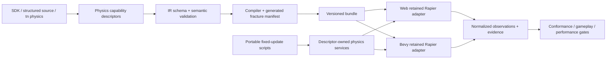
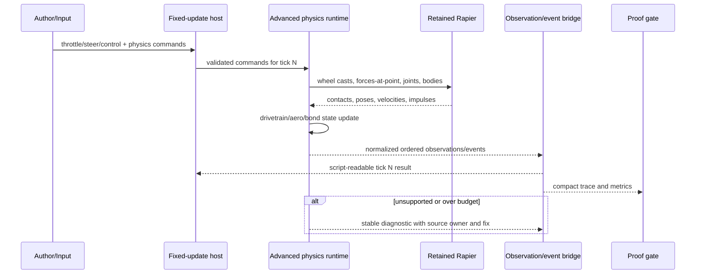

# PRD: Advanced Physics for Major Games

Complexity: 13 -> HIGH mode

Score basis: +3 touches 10+ files, +2 introduces new physics systems, +2 has
complex fixed-step state and solver interaction, +2 spans SDK/IR/compiler/web/
Bevy/authoring/verification, +2 requires deterministic cross-runtime evidence,
+1 adds generated fracture assets, and +1 affects release gates.

Status: Active proposal. No capability claim in this document is implemented
until its phase evidence passes. This PRD supersedes only Phase 2 (advanced
physics) of
`proof-first-engine-loop-2026-07-05/PRD-016-advanced-animation-physics-depth.md`;
that document remains the owner of advanced animation planning.

## 1. Context

**Problem:** ThreeNative's portable physics contract supports core rigid-body
gameplay, but it cannot yet express or prove the wheel, drivetrain,
aerodynamic, compound-body, breakable-assembly, and high-load behavior needed
by racing, flight, vehicle-combat, demolition, and physics-sandbox games.

**Goal:** Let authors build those game classes through structured source and
portable TypeScript while preserving one versioned IR contract, actionable
unsupported diagnostics, comparable web/Bevy outcomes, and release-grade
performance evidence.

**Files analyzed:**

- `packages/sdk/src/physics.ts`
- `packages/ir/src/types.ts`
- `packages/ir/src/physicsValidation.ts`
- `packages/ir/src/scriptServices.ts`
- `packages/runtime-web-three/src/physics.ts`
- `runtime-bevy/crates/threenative_runtime/src/physics.rs`
- `packages/authoring/src/operations/`
- `tools/verify/src/physicsSelfVerification.ts`
- `docs/status/capabilities/physics.md`
- `docs/status/SYSTEMS_CODE_QUALITY_STATUS.md`
- `docs/audits/PHYSICS_SYSTEM_AUDIT_2026-07-13.md`
- `docs/PRDs/proof-first-engine-loop-2026-07-05/PRD-016-advanced-animation-physics-depth.md`

No environment variables, external service, database, or network API are
required. Rapier is already the retained solver on web and the native solver in
Bevy; this PRD does not replace it.

**Current behavior:**

- Portable rigid bodies cover static, kinematic, and dynamic bodies with mass,
  velocity, damping, gravity scale, axis locks, sleep policy, solver iterations,
  CCD, filters, materials, and primitive/static-mesh colliders.
- Live Rapier supports hinge, slider, and suspension constraints in both
  adapters. Scripts can apply force, torque, impulses, and velocity changes in
  the current fixed tick.
- Contact phases, sensors, ray/shape/overlap queries, character push response,
  and focused web/native physics evidence exist.
- Compound colliders, wheel/tire models, drivetrains, force-at-point,
  aerodynamics, breakable constraints, destruction, ragdolls, and physics-state
  snapshots are not portable capabilities.
- Conservative query/proof geometry is duplicated outside retained Rapier,
  creating a known parity and maintenance risk.

## 2. Product Scope

### 2.1 Target game classes

The first release must make these loops viable without raw Rapier/Bevy access:

1. **Racing and vehicle combat:** four or more independently configured wheels,
   suspension, steering, braking, engine/gearing, tire slip, surface response,
   downforce, collision damage, and detachable parts.
2. **Flight and high-speed craft:** lift, drag, angle-of-attack response, stall,
   control surfaces, thrust, wind, air density, and force application at local
   points.
3. **Demolition and destructible environments:** authored fracture pieces,
   break thresholds, stress/impact damage, bounded debris activation, cleanup,
   and deterministic destruction events.
4. **Physics sandboxes and action games:** compound bodies, richer constraints,
   motors, breakable joints, projectile CCD, stable stacks, runtime queries,
   and inspectable solver state.

### 2.2 P0, P1, and explicit non-goals

**P0 release scope:** compound colliders; force/impulse at point; normalized live
queries; raycast wheels; tire/surface response; drivetrain and vehicle control;
aerodynamic bodies/surfaces/wind; fixed/ball/rope plus motorized and breakable
joints; build-time pre-fractured destruction; bounded debris lifecycle; physics
debugging, telemetry, deterministic event ordering, web/Bevy conformance, and
three playable forcing functions.

**P1 follow-up, not required for P0:** articulated ragdolls, buoyancy volumes,
tracked vehicles, hovercraft helpers, trailers, two-wheeled stabilization,
vehicle assists, replayable physics snapshots, and networking-friendly state
quantization. Each requires a separate promoted slice and proof case.

**Non-goals:** arbitrary runtime Boolean/Voronoi mesh cutting; soft bodies,
cloth, fluids, granular simulation, or deformable tires; CFD; professional
motorsport tire thermodynamics; bit-identical floating-point trajectories
between JavaScript/WASM and Rust; deterministic lockstep networking; raw solver
handles/callbacks; arbitrary solver plugins; or author-authored Rust/Bevy
physics. Unsupported declarations must fail during validation with a stable
code, source path, message, and portable alternative.

### 2.3 Success metrics

- A generated-project author can create a controllable four-wheel vehicle and
  an aerodynamic craft using documented SDK/structured-source APIs and no
  backend-specific code.
- A pre-fractured wall can break from a declared impact threshold, activate no
  more than its authored debris budget, and emit stable cause/piece events.
- Identical input recordings produce the same ordered semantic events and stay
  within per-observation web/Bevy tolerances for pose, velocity, wheel contact,
  vehicle state, aerodynamic force, and destruction state.
- The focused workload of 16 four-wheel vehicles, 128 active debris bodies,
  256 static compound shapes, and 64 projectile bodies holds p95 physics-step
  time at or below 12 ms on the documented web CI/reference profile and 8 ms on
  the documented desktop profile, with no step above 16.67 ms in the measured
  60-second steady-state window. Hardware and browser/runtime versions are
  recorded with evidence.
- Every promoted public field is consumed by both adapters or rejected before
  bundle emission. Registry/drift tests prevent an accepted field or service
  from becoming adapter-dead data.

## 3. Pre-Planning and Integration Points

**Durable owners:**

- The versioned IR component/service schemas and validation rules own portable
  meaning, units, limits, defaults, and unsupported boundaries.
- One physics capability descriptor registry owns component names, script
  services, authoring operations, adapter support, fixture enrollment, and
  release-gate requirements. SDK helpers, CLI/MCP/editor exposure, service
  allowlists, and coverage matrices must derive from it or have a drift test.
- Runtime adapters own only solver mapping and runtime-private handles.
- Generated fracture manifests own piece IDs, shapes, mass fractions, bonds,
  and activation budgets; emitted bundle JSON is never edited directly.

**How will this feature be reached?**

- [x] Entry point identified: SDK helpers, `content/**/*.json`, descriptor-backed
  `tn physics ... --json` mutations, portable `ctx.physics` services, `tn build`,
  `tn playtest`, and focused verification commands.
- [x] Caller files identified: compiler world extraction/validation, the fixed
  update system host, the web game loop, the native runtime loop, authoring
  operation dispatch, and verify command registration.
- [x] Registration/wiring needed: physics descriptor registry, IR/schema exports,
  SDK exports, compiler preservation, web/native mapper registration, script
  service matrix, CLI/MCP/editor derivation, fixture catalog, focused gate, docs,
  and generated-game proof enrollment.

**Is this user-facing?** Yes. The author-facing surface is structured source,
SDK helpers, conventional script APIs, bounded CLI/editor operations, debug
views, diagnostics, and playtest evidence. No separate settings page is needed;
the editor counterpart is descriptor-derived component forms and read-only live
telemetry for the same fields.

**Full user flow:**

1. The author adds a compound body, vehicle, aerodynamic surface, or destructible
   assembly through an SDK helper or `tn physics ... --json` operation.
2. `tn authoring validate --json` validates references, units, budgets, and
   portable bounds; `tn build` emits versioned IR and generated fracture data.
3. A fixed-update script reads declared input and calls conventional portable
   controls such as `ctx.physics.vehicle.setInputs(...)`, or fully declarative
   input bindings drive the controller.
4. The web or desktop adapter maps the same contract into retained Rapier,
   advances it once per fixed tick, and emits normalized observations/events.
5. `tn playtest` and debug capture show wheel contacts, forces, joints, breakage,
   timing, and objective-level results; unsupported behavior fails with a fix.

## 4. Solution

### 4.1 Architecture

### 4.2 Contract decisions

- Units are SI: meters, kilograms, seconds, Newtons, Newton-meters, radians,
  Pascals for optional pressure, and kilograms per cubic meter for density.
  Helpers may offer display-unit conversion, but IR stores SI values.
- Fixed update is the only mutation boundary. Inputs are sampled for the next
  fixed tick; commands queued in `fixedUpdate` affect that tick according to the
  existing scheduling contract. Render interpolation never feeds the solver.
- `CompoundCollider` is one component containing stable child IDs and local
  primitive or convex-hull shapes. Dynamic triangle meshes remain unsupported.
- `WheelAssembly` belongs to the chassis and contains stable wheel IDs, local
  attachment points, radius/width, suspension, steering/driven/braked flags,
  and a named `TireModel`. Wheels use solver ray/shape casts; visual wheel
  entities follow normalized wheel observations and are not extra rigid bodies.
- `VehicleController` owns engine torque curve, gearbox, differential, clutch,
  braking, steering response, assists, and input bindings. `TireModel` and
  `PhysicsSurface` own longitudinal/lateral grip curves and combine rules.
- `AerodynamicBody` provides reference area, drag coefficient, center of
  pressure, and density policy. Optional `AerodynamicSurface` entries provide
  local pose, area, lift/drag curves, stall angle, aspect ratio, control input,
  and deflection bounds. `WindVolume` supplies bounded uniform/gust fields.
- `PhysicsJoint` expands to `fixed`, `ball`, and `rope` and gains optional motor
  and break thresholds. A joint emits exactly one break event before removal.
- `Destructible` references a compiler-generated `FractureManifest`. The source
  asset or authored primitive recipe is fractured at build time using a stable
  seed; runtime only evaluates bonds and activates existing bounded pieces.
- Public observations are semantic and normalized, not raw solver objects:
  body state, contacts, wheel state, vehicle state, force contribution,
  joint load/break, and destructible state. Debug-only detail is artifact-backed
  and size-capped.
- Cross-runtime proof compares ordered events exactly and continuous values with
  field-owned absolute/relative tolerances. A tolerance registry is versioned,
  reviewed, and may not be widened merely to pass a gate.

### 4.3 Proposed portable data model

| Owner | Required fields | Important optional fields | Limits |
| --- | --- | --- | --- |
| `CompoundCollider` | `children[{id, shape, localPose}]` | child material/filter | 32 children; primitive/convex only |
| `WheelAssembly` | `wheels[{id, attachment, radius, width, suspension, tire}]` | steer/driven/braked, visual entity | 2-16 wheels |
| `TireModel` | longitudinal/lateral slip curves | load sensitivity, rolling resistance | bounded piecewise-linear curves, max 16 points |
| `PhysicsSurface` | friction/grip multipliers | rolling resistance, tags | named registry entry |
| `VehicleController` | engine curve, gears, final drive, input mapping | differential, clutch, ABS/TCS | 2-16 wheels, 1-12 forward gears |
| `AerodynamicBody` | reference area, drag coefficient | center of pressure, density | finite non-negative values |
| `AerodynamicSurface` | local pose, area, lift/drag curves | stall, aspect ratio, control binding | max 32 surfaces/body, curves max 16 points |
| `WindVolume` | shape, velocity | density, gust seed/frequency/amplitude | deterministic bounded gust function |
| `PhysicsJoint` | kind, target, anchors | limits, motor, break force/torque | finite graph; no self/cyclic gear drive |
| `Destructible` | fracture manifest, bond strength, activation budget | impact filter, cleanup policy, max depth | 256 pieces/assembly, 1024 active pieces/scene by default |

Exact JSON schema names and version migration are finalized in Phase 1 before
runtime implementation. Public helpers use familiar Unity/game-engine terms
where they do not conflict with the portable contract.

### 4.4 Sequence flow

### 4.5 Errors, budgets, and compatibility

- Validation rejects NaN/infinite/out-of-range values, missing entity/asset/
  surface references, duplicate child/wheel IDs, invalid curves, impossible
  gear graphs, unsupported dynamic triangle meshes, excessive fracture pieces,
  and raw backend fields.
- Runtime topology changes are bounded operations. Exceeding an authored active
  body/debris budget emits a deterministic event and applies the declared
  `reject-new`, `sleep-oldest`, or `despawn-oldest` policy; no silent dropping.
- New schema fields require an IR version bump or additive version policy,
  migration tests, and old-bundle fixtures. Unknown fields remain errors.
- Existing `RigidBody`, `Collider`, and joint declarations preserve behavior.
  There is no implicit conversion of the current `suspension` joint into a
  wheel; authors opt into `WheelAssembly`.
- Physics diagnostics include code, severity, source path, message, suggestion,
  and structured fix when a safe authoring mutation exists.

## 5. Execution Phases

Every phase is a user-testable vertical slice. Each checkpoint runs the
automated PRD work review required by the `prd-creator` protocol. Performance,
visual/debug, and playable-game phases also require manual artifact review.
The paths below are the five primary owner groups per phase; colocated tests and
generated schema snapshots remain part of their owner group. Files marked
`(new)` do not exist yet; each names the current durable owner it extends or is
extracted from, and implementation must move or derive that owner's behavior
rather than duplicating it in a second surface.

### Phase 1: Contract registry and live observation foundation

**Outcome:** An author can validate a compound collider and force-at-point call,
and both runtimes report the same normalized live body/query observation.

**Primary files (max 5):**

- `packages/ir/src/physicsCapabilities.ts` (new) - owning descriptors, units,
  limits, tolerance metadata, services, and adapter requirements; consolidates
  the physics knowledge currently spread across `physicsValidation.ts` and
  `scriptServices.ts` rather than adding a parallel list.
- `packages/ir/src/physicsValidation.ts` - semantic and negative validation.
- `packages/ir/src/types.ts` - versioned component/observation types.
- `packages/runtime-web-three/src/physics.ts` - retained Rapier compound mapping,
  force-at-point, and live query observations.
- `runtime-bevy/crates/threenative_runtime/src/physics.rs` - native equivalent.

**Implementation:**

- [ ] Add descriptor registry and a drift assertion covering IR, script-service,
  web, native, authoring-operation, fixture, and gate ownership.
- [ ] Add `CompoundCollider` with stable child IDs and local pose; support box,
  sphere, capsule, and compiler-produced bounded convex hull children.
- [ ] Add `physics.addForceAtPoint` and `physics.applyImpulseAtPoint` with SI
  semantics and same-tick scheduling.
- [ ] Replace conservative public query/proof claims with normalized retained
  Rapier raycast, shape-cast, overlap, and contact observations.
- [ ] Preserve existing primitive contracts and reject raw handles/dynamic
  triangle children with actionable diagnostics.

**Tests required:**

| Test | Assertion |
| --- | --- |
| `should reject duplicate compound child ids and dynamic triangle children` | Stable code and exact source path for each invalid child. |
| `should rotate a body when force is applied off center` | Web/native angular and linear velocity are within owned tolerances. |
| `should report the live collider hit rather than conservative bounds` | Query identity, point, normal, and distance match the solver scene. |
| `should fail descriptor drift when an adapter consumer is absent` | Removing one consumer makes the registry test fail. |

**Verification plan:** focused IR/SDK/runtime tests; negative fixtures;
`pnpm verify:conformance`; old physics fixture regression.

**User verification:** Run the compound-body fixture and apply an off-center
impulse. The body spins, queries hit the correct child ID, and web/desktop
traces identify the same child and semantic event order.

**Checkpoint:** automated reviewer must report PASS before Phase 2.

### Phase 2: Wheel contact, suspension, tires, and surfaces

**Outcome:** An author can roll, steer, brake, and obtain suspension/tire state
for a chassis on surfaces with different grip.

**Primary files (max 5):**

- `packages/ir/src/physicsCapabilities.ts` - wheel/tire/surface descriptors.
- `packages/sdk/src/physics.ts` - `wheelAssembly`, `tireModel`, and surface helpers.
- `packages/compiler/src/emit/physics.ts` (new) - reference resolution and
  lossless emit, extracted from the current `emitPhysics` owner in
  `packages/compiler/src/emit/scene-to-world.ts` (tests already live in
  `emit/physics.test.ts`); `scene-to-world.ts` must delegate, not duplicate.
- `packages/runtime-web-three/src/physicsVehicle.ts` (new) - wheel cast and tire solver.
- `runtime-bevy/crates/threenative_runtime/src/physics_vehicle.rs` (new) - native solver.

**Implementation:**

- [ ] Define stable wheel IDs, local attachments, suspension travel/spring/
  damper, radius/width, steering/driven/braked flags, and visual targets.
- [ ] Define bounded longitudinal and lateral slip curves, load sensitivity,
  rolling resistance, and deterministic material/surface combine rules.
- [ ] Use retained-world ray/shape casts, apply suspension and tire forces at
  contact points, and cap invalid/extreme forces through authored limits.
- [ ] Publish contact, compression, normal load, slip ratio/angle, angular
  speed, surface, and grounded state in stable wheel order.
- [ ] Keep wheel visuals presentation-only and interpolate from physics state.

**Tests required:**

| Test | Assertion |
| --- | --- |
| `should reject invalid wheel geometry and non-monotonic slip curves` | Validation points to the wheel/curve entry and suggests valid bounds. |
| `should compress suspension and settle chassis under static load` | Ride height and per-wheel load converge inside declared tolerance. |
| `should reduce acceleration when wheel moves from asphalt to ice` | Surface ID changes and longitudinal acceleration decreases measurably. |
| `should preserve stable wheel observation order` | Output order follows authored wheel IDs across runtimes. |

**Verification plan:** unit curve tests; static-load fixture; split-surface
fixture; paired traces; `pnpm verify:conformance`.

**User verification:** Drive the wheel fixture across asphalt and ice. Debug
rays, compression, contact patch, and slip change visibly and match telemetry.

**Checkpoint:** automated plus manual debug-overlay review.

### Phase 3: Drivetrain and production vehicle control

**Outcome:** An author can build a playable car with engine, gearing,
differential, steering, brakes, and bounded driving assists.

**Primary files (max 5):**

- `packages/ir/src/physicsCapabilities.ts` - controller/drivetrain contract.
- `packages/script-stdlib/src/physics.ts` (new) - typed conventional vehicle
  facade layered on the existing physics service surface in
  `packages/script-stdlib/src/script-context.ts`.
- `packages/runtime-web-three/src/physicsVehicle.ts` - drivetrain/control step.
- `runtime-bevy/crates/threenative_runtime/src/physics_vehicle.rs` - native step.
- `packages/authoring/src/operations/physics.ts` (new) - descriptor-backed
  mutation; the existing `RigidBody` component operation in
  `packages/authoring/src/operations/sceneComponents.ts` moves or is re-exported
  here so physics authoring has one owner.

**Implementation:**

- [ ] Add bounded piecewise engine torque curve, idle/redline, forward/reverse
  ratios, final drive, clutch response, and open/locked/limited-slip differential.
- [ ] Add throttle, brake, handbrake, steer, clutch, and gear inputs with
  declarative bindings plus `ctx.physics.vehicle.setInputs`.
- [ ] Add speed-sensitive steering, brake bias, engine braking, auto/manual
  shift policy, optional ABS/TCS, and deterministic state transitions.
- [ ] Publish speed, engine RPM, gear, torque path, and assist activations.
- [ ] Add `tn physics vehicle add|inspect|validate --json` through the owning
  operation descriptor; derive MCP/editor metadata and generated API cards.

**Tests required:**

| Test | Assertion |
| --- | --- |
| `should reject disconnected driven wheels and invalid gear ratios` | Build fails with structured fixes. |
| `should shift through gears under a recorded throttle input` | Gear/RPM event sequence is stable and speed rises. |
| `should turn toward steering input without chassis teleportation` | Yaw and lateral path meet fixture bounds; transform has solver ownership. |
| `should expose identical CLI MCP and editor vehicle fields` | Descriptor drift test reports no missing fields. |

**Verification plan:** drivetrain unit tests; recorded-input lap segment;
authoring dry-run/apply round trip; web/desktop playtest.

**User verification:** Use the generated controls to launch, steer through a
slalom, brake, reverse, and retry. HUD/debug telemetry shows RPM, gear, speed,
wheel slip, and assists.

**Checkpoint:** automated plus manual playability/artifact review.

### Phase 4: Aerodynamics, thrust, control surfaces, and wind

**Outcome:** An author can create a craft that takes off, stalls, recovers, and
responds to wind using portable declarations and force-at-point physics.

**Primary files (max 5):**

- `packages/ir/src/physicsCapabilities.ts` - aero/wind/thrust descriptors.
- `packages/sdk/src/physics.ts` - aerodynamic helpers and bounded curves.
- `packages/runtime-web-three/src/physicsAerodynamics.ts` (new) - web force model.
- `runtime-bevy/crates/threenative_runtime/src/physics_aerodynamics.rs` (new) - native model.
- `packages/authoring/src/operations/physics.ts` - authoring operations/forms.

**Implementation:**

- [ ] Add quadratic body drag and local aerodynamic surfaces with lift/drag
  curves, center of pressure, aspect-ratio correction, stall, and control input.
- [ ] Add force/torque thrusters with throttle binding, response, and fuel hook
  metadata; fuel inventory itself remains a gameplay/resource concern.
- [ ] Add box/sphere wind volumes with deterministic uniform and seeded gust
  velocity and optional air density override.
- [ ] Publish relative air velocity, angle of attack, sideslip, lift, drag,
  force point, control deflection, and stall state.
- [ ] Clamp only at declared physical/safety bounds and emit a diagnostic when
  input would create non-finite or over-budget force.

**Tests required:**

| Test | Assertion |
| --- | --- |
| `should produce zero aerodynamic force at zero relative airspeed` | All force contributions are zero and finite. |
| `should increase drag quadratically with airspeed` | Doubling speed yields four-times drag within numeric tolerance. |
| `should reverse control torque when elevator deflection reverses` | Pitch torque sign changes in both adapters. |
| `should enter and leave stall under a recorded maneuver` | Ordered stall events and recovery occur inside tick windows. |

**Verification plan:** analytic unit cases; wind-volume boundary fixture;
recorded takeoff/stall/recovery scenario; paired traces; visual force vectors.

**User verification:** Fly the forcing-function craft through a gust, induce a
stall, recover, and land. Telemetry and vectors explain the motion.

**Checkpoint:** automated plus manual flight-feel/artifact review.

### Phase 5: Rich, motorized, and breakable joints

**Outcome:** Authors can build doors, turrets, ropes, suspensions, detachable
vehicle parts, and machines with observable motors and break thresholds.

**Primary files (max 5):**

- `packages/ir/src/physicsValidation.ts` - joint graph validation.
- `packages/sdk/src/physics.ts` - fixed/ball/rope/motor/break helpers.
- `packages/runtime-web-three/src/physicsJoints.ts` (new) - web joint lifecycle,
  extracted from the joint handling in `packages/runtime-web-three/src/physics.ts`.
- `runtime-bevy/crates/threenative_runtime/src/physics_joints.rs` (new) - native
  lifecycle, extracted from `physics.rs`.
- `packages/ir/fixtures/conformance/advanced-physics-joints/` (new) - shared fixture.

**Implementation:**

- [ ] Add fixed, ball, and rope joints while retaining hinge, slider, and
  suspension compatibility.
- [ ] Add bounded position/velocity motors, maximum force/torque, damping, and
  limits where meaningful for each joint kind.
- [ ] Add break force/torque, stable load observations, one-shot break events,
  and safe deferred solver removal.
- [ ] Validate references, local frames, axes, motor/limit compatibility, and
  graph/budget limits before runtime.
- [ ] Ensure runtime spawn/despawn and component patches reconcile joint state
  without rebuilding unrelated bodies.

**Tests required:**

| Test | Assertion |
| --- | --- |
| `should reject motor fields unsupported by the joint kind` | Diagnostic names field, kind, and supported alternative. |
| `should hold a fixed joint within tolerance under load` | Relative pose stays bounded across both adapters. |
| `should break once when accumulated load crosses threshold` | One event occurs and the joint is absent next safe tick. |
| `should preserve unrelated body handles when a joint changes` | Rebuild/lifecycle counter remains bounded. |

**Verification plan:** per-kind fixtures; load ramp; patch/reconciliation
tests; paired normalized joint trace; `pnpm verify:conformance`.

**User verification:** Apply load to a motorized turret and detachable panel;
the motor respects limits and the panel breaks at the declared threshold.

**Checkpoint:** automated reviewer must report PASS.

### Phase 6: Build-time fracture and bounded destruction runtime

**Outcome:** An authored wall or vehicle part breaks into physical pieces from
impact or script damage without runtime mesh cutting or unbounded debris.

**Primary files (max 5):**

- `packages/compiler/src/bake/fracture.ts` (new) - deterministic fracture/bond bake.
- `packages/ir/src/fractureManifest.ts` (new) - structured manifest schema and validation.
- `packages/runtime-web-three/src/physicsDestruction.ts` (new) - web damage/bond activation.
- `runtime-bevy/crates/threenative_runtime/src/physics_destruction.rs` (new) - native equivalent.
- `packages/cli/src/commands/physicsFracture.ts` (new) - inspect/generate/validate
  command, registered through `packages/cli/src/commands/registry.ts`.

**Implementation:**

- [ ] Support imported pre-fractured GLB pieces and bounded seeded primitive/
  convex build-time fracture recipes; preserve stable piece and bond IDs.
- [ ] Compute/validate piece colliders, mass fractions, adjacency bonds, health,
  impulse/energy thresholds, material response, and hierarchical activation.
- [ ] Convert normalized contact impulse or explicit portable damage into bond
  damage once per tick, activate pieces in stable order, and conserve authored
  assembly mass within tolerance.
- [ ] Enforce per-assembly and scene active-piece budgets with declared policy,
  sleep/despawn cleanup, pooling, and proof-visible overflow events.
- [ ] Emit `damaged`, `bondBroken`, `pieceActivated`, `assemblyBroken`, and
  `budgetExceeded` events with cause entity/contact/script and stable ordering.

**Tests required:**

| Test | Assertion |
| --- | --- |
| `should bake byte-stable fracture manifests from the same source and seed` | Repeated output hashes match. |
| `should reject disconnected pieces invalid mass fractions and excessive budgets` | Each error has source path and fix. |
| `should break the same bonds for a recorded impact` | Ordered semantic events/piece IDs match web/native. |
| `should enforce debris policy without silently losing events` | Active count stays bounded and overflow event identifies policy. |

**Verification plan:** bake determinism; imported-piece fixture; impact replay;
mass/momentum bounds; budget stress; `tn asset inspect`/`tn model-test`; paired
playtests.

**User verification:** Fire projectiles at the wall at sub-threshold and
over-threshold speeds. The first impact dents/damages only; the second activates
the expected region, with bounded cleanup and readable evidence.

**Checkpoint:** automated plus manual destruction/contact-sheet review.

### Phase 7: Public authoring, debugging, and actionable diagnostics

**Outcome:** An author can discover, create, inspect, tune, and debug every P0
physics feature without hand-editing emitted artifacts.

**Primary files (max 5):**

- `packages/authoring/src/operations/physics.ts` - owning structured mutations.
- `packages/cli/src/commands/registry.ts` - derived `tn physics` command family.
- `packages/editor/src/` - descriptor-derived forms and live inspector panels.
- `packages/runtime-web-three/src/physicsDebug.ts` (new) - normalized debug primitives.
- `runtime-bevy/crates/threenative_runtime/src/physics_debug.rs` (new) - native debug output.

**Implementation:**

- [ ] Provide bounded add/set/remove/inspect/validate operations for compound,
  wheel, vehicle, aero, joint, and destructible declarations, with dry-run and
  atomic batch support.
- [ ] Derive CLI help, JSON payloads, MCP/editor operation metadata, generated
  types, API cards, and cookbook references from descriptors.
- [ ] Add toggleable collider, center-of-mass, contact, wheel, suspension,
  slip, force, aero, joint-load, bond, sleep, and budget views.
- [ ] Add compact per-tick/per-system timing, active/sleeping body counts,
  contacts, queries, solver iterations, rebuilds, and allocated pieces to
  artifact-backed telemetry; keep stdout summaries bounded.
- [ ] Add diagnostic fixtures for every unsupported/non-finite/reference/budget
  boundary and verify structured fixes round-trip through authoring operations.

**Tests required:**

| Test | Assertion |
| --- | --- |
| `should round trip every advanced physics operation through dry run and apply` | Structured source is valid and stable after re-read. |
| `should keep CLI MCP editor and API card fields in descriptor parity` | No hand-maintained surface drifts. |
| `should draw normalized debug primitives from the same observation` | Web/native debug reports have matching IDs/types. |
| `should cap terminal output and persist deep telemetry as artifacts` | Size budget passes and artifact contains full details. |

**Verification plan:** operation/registry tests; generated-project smoke;
`pnpm verify:cookbook`; editor test; web/desktop debug captures.

**User verification:** Starting from a generated project, build and tune one
vehicle and one destructible prop using CLI/editor operations, then identify a
bad wheel contact and over-stressed joint from the debug evidence.

**Checkpoint:** automated plus manual editor/debug usability review.

### Phase 8: Major-game forcing functions, performance, and release ratchet

**Outcome:** Racing, flight, and destruction examples pass objective-level web
and desktop scenarios, conformance, and measured performance budgets.

**Primary files (max 5):**

- `examples/advanced-vehicle-course/` (new) - lap, surfaces, jump, damage, retry.
- `examples/aerodynamics-flight-course/` (new) - takeoff, gust, stall, recovery, land.
- `examples/destruction-range/` (new) - threshold, regional break, debris, cleanup.
- `tools/verify/src/advancedPhysicsGate.ts` (new) - registry-derived parity/perf gate.
- `docs/status/capabilities/physics.md` - evidence-backed capability truth.

**Implementation:**

- [ ] Create production plans before source mutation and use catalog/authored
  assets for hero vehicles, craft, destructibles, and dominant environment.
- [ ] Add recorded-input scenarios with objective, progression, fail/retry,
  feedback, collision/damage, and stable semantic assertions; primitives alone
  cannot qualify the visual forcing functions as finished.
- [ ] Add exact event/state comparisons, field-owned numeric tolerances,
  negative controls, stale-evidence hashes, and web/desktop artifact pairing.
- [ ] Add the specified dense workload and 60-second steady-state benchmark,
  recording p50/p95/max step, allocations, active/sleeping bodies, contacts,
  queries, piece count, hardware, browser, runtime, and build profile.
- [ ] Enroll the descriptor-derived gate in focused/release verification only
  after all P0 cases pass; update `docs/STATUS.md`, Bevy parity evidence, cookbook,
  and code-quality risk notes in the same phase.

**Tests required:**

| Test | Assertion |
| --- | --- |
| `should complete a lap segment across mixed surfaces and collision damage` | Checkpoints, speed/slip bounds, damage, fail/retry, and finish event pass. |
| `should take off stall recover and land from recorded controls` | Objective states and aero observations occur in bounded tick windows. |
| `should keep destruction regional bounded and causally linked` | Expected bonds/pieces activate; unrelated region and budget remain stable. |
| `should reject stale missing weakened or single-adapter evidence` | Gate fails with exact missing/drift path. |
| `should stay within advanced physics performance budgets` | p95/max and count budgets meet Section 2.3. |

**Verification plan:** `pnpm verify:conformance`; focused advanced physics gate;
`pnpm test:gameplay`; `pnpm verify:gameplay-parity`; `pnpm verify:cookbook`;
desktop reruns for all three scenarios; full relevant release gate.

**User verification:** Play all three examples on web and desktop, review debug
and performance artifacts, and confirm each objective/fail/retry loop without
backend-specific source.

**Checkpoint:** automated reviewer PASS plus manual playability, visual,
performance, and artifact review before any status promotion.

## 6. Verification and Evidence Protocol

### 6.1 Comparison policy

- Exact across adapters: entity/piece/wheel/joint IDs, event types and order,
  input record, surface selection, gear transition order, grounded/stall/broken
  booleans, budget policy, diagnostic codes/paths, and fixture hashes.
- Numeric tolerance: positions, rotations, velocities, impulses, loads, slip,
  RPM, force contributions, and timing windows. Each field has an explicit
  absolute and/or relative tolerance in the owning registry.
- Outcome bounds: lap checkpoints, takeoff/landing corridor, stall/recovery
  window, impacted destruction region, active debris count, and settling time.
- Visual evidence supports, but never substitutes for, semantic and solver
  observations. Headless traces support, but never substitute for, playable
  input/objective proof.

### 6.2 Negative controls

Every promoted slice must prove at least one causal negative control: remove a
driven-wheel flag, invert a control surface, lower a joint threshold, swap the
surface, corrupt a fracture hash, exceed a budget, or remove one adapter's
consumer. The relevant gate must fail for the intended reason.

### 6.3 Evidence layout

- Shared fixture truth: `packages/ir/fixtures/conformance/advanced-physics-*`.
- Example runtime evidence: `examples/<forcing-function>/artifacts/<gate>/`.
- Aggregate report: `tools/verify/artifacts/advanced-physics/`.
- Bevy-only lower-level evidence: `runtime-bevy/artifacts/advanced-physics/`.
- Every report includes schema version, source/bundle hash, runtime adapter,
  runtime/dependency versions, platform, scenario, fixed delta, seed, tolerance
  registry version, command, timestamps, and artifact hashes.

### 6.4 Checkpoint protocol

After each phase, invoke the available PRD work reviewer with the PRD path,
phase number, implementation summary, and verification commands. Proceed only
on PASS. If that specialized reviewer is unavailable, record that fact and use
an independent review agent with the same checklist; do not silently skip the
checkpoint. Manual checkpoints are additional for Phases 2, 3, 4, 6, 7, and 8.

## 7. Risks and Mitigations

| Risk | Mitigation / owner |
| --- | --- |
| Rapier JS/Rust numerical divergence | Compare semantics exactly and values with reviewed field tolerances plus outcome bounds; never promise bit identity. Owner: IR tolerance registry. |
| Vehicle/aero helpers become an opaque second solver | Helpers calculate bounded forces/state only; retained Rapier owns integration, contacts, constraints, and body poses. Owner: runtime physics coordinator. |
| Descriptor and adapter drift | One registry plus missing-consumer tests; no second hand-maintained support list. Owner: IR physics capabilities. |
| Runtime topology churn/rebuild cost | Incremental handles and deferred safe mutation; lifecycle counters and stress tests. Owner: each adapter. |
| Unbounded debris/body growth | Authored budgets, deterministic policy, pooling/cleanup, and observable overflow. Owner: destruction runtime and target profile. |
| Destruction asset nondeterminism | Build-time seeded bake, canonical serialization, stable IDs, source hash, and repeat-build hash test. Owner: compiler fracture bake. |
| Tuning complexity harms author velocity | Conventional presets, bounded CLI operations, live debug telemetry, cookbook patterns, and source-preserving customization. Owner: authoring descriptor. |
| Advanced physics bloats all games | Tree-shakable web modules and feature-gated native systems/assets; bundle-size/startup metrics in the gate. Owner: compiler/adapter registration. |
| Scope expands into full simulation middleware | P0/P1/non-goal boundary and forcing-function admission rule; new breadth needs its own game case and evidence budget. Owner: this PRD/status docs. |

## 8. Acceptance Criteria

- [ ] All eight phases are complete and every checkpoint review reports PASS.
- [ ] Compound colliders and force/impulse-at-point work through portable source,
  scripts, retained Rapier, live queries, and paired evidence.
- [ ] Wheel, tire, surface, suspension, drivetrain, steering, braking, and assist
  behavior completes the vehicle forcing function on web and desktop.
- [ ] Lift, drag, stall, control surfaces, thrust, wind, and force telemetry
  complete the flight forcing function on web and desktop.
- [ ] Fixed/ball/rope and motorized/breakable joints pass lifecycle, load, patch,
  and cross-runtime evidence.
- [ ] Build-time pre-fracture, bonds, impact/script damage, deterministic piece
  activation, debris budgets, cleanup, and events complete the destruction
  forcing function on web and desktop.
- [ ] CLI, MCP, editor, SDK, generated API card, cookbook, compiler, services,
  adapters, fixtures, and gates derive from the owner or pass explicit drift
  tests.
- [ ] Unsupported soft-body/fluid/runtime-cutting/backend-specific behavior
  fails with stable actionable diagnostics and no silent fallback.
- [ ] Existing physics fixtures and generated games do not regress.
- [ ] `pnpm verify:conformance`, the focused advanced physics gate,
  `pnpm test:gameplay`, `pnpm verify:gameplay-parity`, `pnpm verify:cookbook`,
  and all three desktop scenarios pass with current-run evidence.
- [ ] The dense workload meets the web and desktop budgets in Section 2.3 and
  records reproducible environment metadata.
- [ ] Capability, `docs/STATUS.md`, Bevy parity, cookbook, and systems quality
  docs are updated only after their corresponding evidence exists.
- [ ] No raw physics backend handle, generated artifact edit, weakened tolerance,
  broad cast, silent fallback, disabled test, or untracked compatibility shim is
  used to claim completion.

## 9. Verification Evidence

Implementation evidence is intentionally empty while this PRD is active. Each
phase appends commands, pass/fail results, artifact paths, hashes, review verdict,
and manual sign-off here. The PRD moves to `docs/PRDs/done` only after every
acceptance criterion is checked and current status/capability indexes point to
the final evidence.
