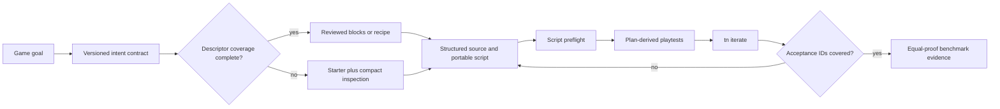
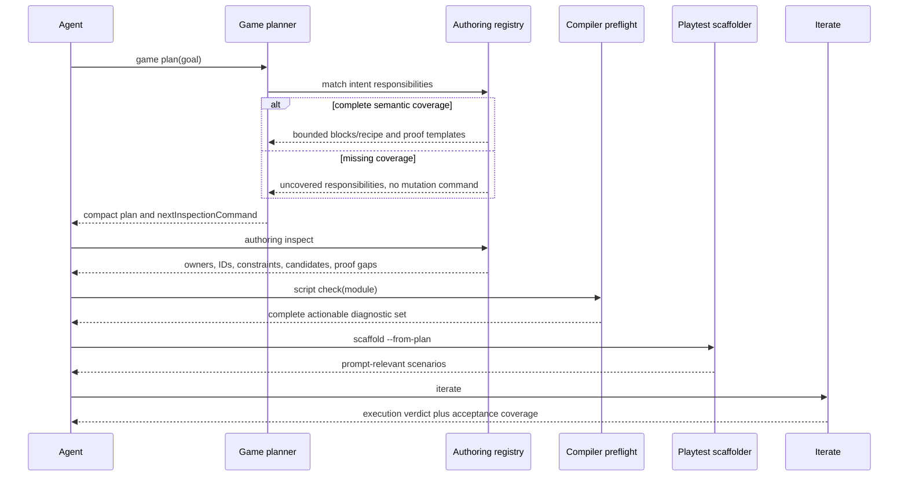

# PRD: Smooth and Efficient Off-Recipe Game Authoring

`Planning Mode: Principal Architect`
`Status: active - ThreeNative acceptance repaired; equal-proof vanilla control still fails`

Complexity: 9 -> HIGH mode

Score basis: +3 touches more than 10 files, +2 introduces new intent/proof
contracts and reusable mechanic modules, +2 changes complex input/transform
state semantics, and +2 spans CLI, authoring, compiler, web runtime, Bevy
runtime, verification, templates, and benchmark packages.

## 1. Context

**Problem:** ThreeNative can now avoid applying an unrelated scaffold to an
unfamiliar game, but custom authoring still consumes more agent tokens and
repair cycles than the invalid vanilla control because planner intent,
portable-script constraints, runtime write semantics, reusable mechanics, and
prompt-level proof are not connected into one compact path.

### Evidence

The retained grid-push experiment is
`tools/agent-benchmark/GRID-PUSH-EXPLORATORY-2026-07-15.md`.

- The first ThreeNative run mapped "push crates" to `physics-target`, proved
  the wrong scenarios, and scored 0/4 prompt assertions.
- The corrected run stayed on the starter and reached 4/4, proving that the
  product can author the game without a prompt-specific scaffold.
- The corrected run used 2,825,566 raw tokens, 457,976 cost-weighted tokens,
  24 command steps, and nine failed commands.
- Failures included unsupported camera/prefab fields, portable module state,
  exported behavior closure capture, resource/component declaration confusion,
  held-input repetition, release timing, and transform reads that did not see
  writes queued in the same tick.
- The vanilla control used fewer cost-weighted tokens but rendered a DOM game,
  not a compliant vanilla Three.js canvas candidate. It is diagnostic, not a
  valid efficiency victory.

### Files analyzed

- `AGENTS.md`
- `CHALLENGES.md`
- `packages/authoring/src/project.ts`
- `packages/authoring/src/recipes.ts`
- `packages/cli/src/commands/authoring.ts`
- `packages/cli/src/commands/game.ts`
- `packages/cli/src/commands/gamePlanTypes.ts`
- `packages/cli/src/commands/iterate.ts`
- `packages/cli/src/commands/playtestScaffold.ts`
- `packages/cli/src/mechanicBlocks/registry.ts`
- `packages/compiler/src/scripts/bundle.ts`
- `packages/compiler/src/scripts/diagnostics.ts`
- `packages/compiler/src/scripts/sourceRefs.ts`
- `packages/compiler/src/typegen.ts`
- `packages/script-stdlib/src/script-context.ts`
- `packages/runtime-web-three/src/systems/context.ts`
- `runtime-bevy/crates/threenative_runtime/src/systems_host_bridge.js`
- `runtime-bevy/crates/threenative_runtime/tests/systems_host.rs`
- `templates/structured-source-starter/AGENTS.md`
- `tools/agent-benchmark/PROTOCOL.md`
- `tools/agent-benchmark/src/prepare.ts`
- `tools/agent-benchmark/src/proof-contract.ts`
- `tools/agent-benchmark/GRID-PUSH-EXPLORATORY-2026-07-15.md`
- `docs/PRDs/done/PRD-authoring-smoothness-2026-07-11.md`
- `docs/PRDs/done/PRD-authoring-golden-path-frictions-2026-07-11.md`

### Current behavior

- `tn game plan` now emits `custom-on-starter` for unmatched goals, but its
  intent and mechanic coverage are still mostly keyword/rank based.
- `tn authoring inspect` inventories documents and IDs but does not return the
  compact source-owner, portable-script, input-edge, or proof guidance needed
  to implement an unfamiliar loop correctly on the first attempt.
- Portable script checks exist, but an agent can discover several independent
  constraints only through sequential build/iterate failures.
- `ScriptInputFacade` already exposes `pressed`/`released`, while generated and
  improvised behaviors commonly use held actions plus custom latches.
- Web transform writes are queued without updating the facade's pending read
  view, so a later read in the same system observes stale state.
- Mechanic blocks, game-plan descriptors, recipe metadata, help, generated
  scripts, scenarios, and benchmark proof mappings have overlapping ownership.
- Playtest scaffolding covers movement, pickup, win-state, and retry, but not
  blocked movement, push-only interaction, or occupancy progress as reusable
  assertion families.

## 2. Goal and measurable outcome

Deliver a compact off-recipe authoring path in which an agent can inspect the
starter, compose reusable mechanics or write one portable behavior, generate
prompt-relevant proof, and converge through `tn iterate` without engine-source
searches or repeated diagnostic discovery.

### Product success metrics

For each post-fix ThreeNative benchmark run:

- All prompt-required assertions pass from browser/playtest observations.
- The scorer observes a nonblank browser canvas and real input-caused motion.
- No unrelated scaffold or recipe is applied.
- `TN_ITERATE_OK` is accepted only when scenario coverage satisfies the plan's
  stable acceptance IDs.
- Failed command count is at most 2 per run and median 0.
- Tool-step median is at most 15 and no run exceeds 25.
- Iterate repair median is at most 3.
- Engine-source searches, redundant standalone verification, and deep artifact
  forensics each remain 0.
- Every run stays under the existing 300,000 raw-token cap.

For the aggregate three-repeat comparison:

- ThreeNative median raw tokens are <= 1.0x vanilla Three.js for every
  beyond-one-shot prompt.
- ThreeNative median cost-weighted tokens are <= 1.0x vanilla Three.js.
- ThreeNative is not allowed to win by producing weaker proof, a non-canvas
  result, a starter-only result, or a prompt-specific hidden instruction.

### Quality target for the compact CLI surfaces

- Default `tn game plan --json` stdout remains <= 24 KiB.
- Default `tn authoring inspect --json` stdout remains <= 16 KiB; detailed
  schemas and examples are artifact-backed or requested explicitly.
- A single portable-script preflight reports all statically discoverable
  portability and declaration issues in one response.
- Fresh starter plus any new recipe/block validates with zero duplicate system
  or UI ownership diagnostics.

## 3. Non-goals

- Do not add a Sokoban-only scaffold to make the retained prompt pass.
- Do not add one recipe per benchmark prompt or use hidden benchmark hints.
- Do not expose raw Three.js, Bevy, DOM, filesystem, worker, timer, or native
  handles to portable scripts.
- Do not replace structured source with generated bundle edits.
- Do not weaken proof assertions, token accounting, or the 300,000-token cap.
- Do not claim vanilla Three.js efficiency from a DOM-only control.
- Do not expand rendering, asset-generation, networking, or editor scope unless
  an acceptance prompt proves it is required.

## 4. Integration points

### How will this feature be reached?

- [x] Entry point identified: `tn game plan --goal ... --json`.
- [x] Inspection entry identified: the plan's `nextInspectionCommand`, backed
  by `tn authoring inspect --project . --json`.
- [x] Mutation entry identified: registry-backed `tn add`, `tn recipe apply`,
  and atomic authoring batch operations.
- [x] Script entry identified: a new nested `tn authoring script
  scaffold|check` surface rather than an unrelated top-level adapter.
- [x] Proof entry identified: `tn playtest scaffold --from-plan` followed by
  `tn iterate`.
- [x] Callers identified: CLI command registry/index, game planner, authoring
  loader, compiler script pipeline, runtime system context, iterate, and agent
  benchmark preparation/scoring.
- [x] Registration required: extend the existing command and mechanic
  descriptor owners; do not add hand-maintained dispatch/help lists.

### Is this user-facing?

- [x] Yes, through CLI JSON/human output and generated-project instructions.
- [x] No new visual UI is required. Browser screenshots and playtests are proof
  surfaces, not a new editor feature.

### Full user flow

1. User asks for a game whose mechanics do not match a promoted kit.
2. Agent runs `tn game plan`.
3. Planner emits a stable intent contract, uncovered responsibilities,
   `custom-on-starter`, and `nextInspectionCommand`; it emits no unrelated
   mutation command.
4. Agent runs the inspection command and receives source owners, relevant IDs,
   portable-script constraints, reusable mechanic candidates, and proof gaps.
5. Agent applies semantically complete reusable blocks/recipe or scaffolds and
   checks one portable behavior.
6. Agent generates plan-derived playtests and runs `tn iterate`.
7. Iterate reports both execution pass/fail and plan-acceptance coverage.
8. Agent stops only when all required acceptance IDs have observed evidence.
9. Benchmark capture records authoritative usage and compares equal-proof
   ThreeNative with vanilla Three.js.

## 5. Solution architecture

### Approach

1. Make goal intent and mechanic coverage explicit data instead of keyword
   implications.
2. Turn inspection into a bounded authoring briefing derived from real project
   owners and compiler/runtime contracts.
3. Collapse sequential portable-script failures into scaffold-time and
   preflight diagnostics.
4. Fix input edge and same-tick transform semantics so conventional game logic
   does not need custom latches or stale-state workarounds.
5. Add reusable grid/spatial mechanic primitives through the owning descriptor
   registry, then expose one composition recipe that is useful beyond the
   benchmark prompt.
6. Generate proof from stable plan acceptance IDs and reject semantic false
   greens in iterate.
7. Prove efficiency with frozen prompts, fresh sessions, equal proof, and
   authoritative usage capture.



### Durable owners and key decisions

- `IGamePlan.intentContract` owns required verbs, capabilities, and acceptance
  IDs. Benchmark code consumes it but does not redefine it.
- The mechanic descriptor registry owns mechanic responsibility coverage,
  generated command, source owners, dependencies, and proof templates.
- Authoring recipes compose registered descriptors. A recipe does not own a
  second copy of capability keywords or assertion mappings.
- Compiler script diagnostics and `ScriptContext` types own portable behavior
  rules. Inspection serializes a compact projection of those owners.
- Runtime context facades own input edge and pending-write semantics. Generated
  scripts use those conventional APIs.
- Playtest scaffold descriptors own assertion-family templates. Iterate and the
  benchmark proof adapter consume their stable IDs.
- Unsupported or incomplete coverage fails with an actionable diagnostic; no
  silent best-effort scaffold fallback is allowed.

### Data changes

1. Bump the game plan schema version and add:
   - `intentContract.id` and `intentContract.version`;
   - normalized `verbs[]` with `id`, `subject`, `object`, and `required`;
   - `requiredCapabilities[]`;
   - stable `acceptanceAssertions[]` with `id`, `kind`, and description;
   - `coveredResponsibilityIds[]` and `uncoveredResponsibilityIds[]`.
2. Extend mechanic descriptors with:
   - `responsibilityIds[]`;
   - `requires[]` and `conflicts[]`;
   - a generated CLI mutation command;
   - source-owner paths;
   - proof-template IDs;
   - recipe memberships.
3. Extend iterate report with `acceptanceCoverage` containing required,
   observed, missing, and unrelated assertion IDs.
4. Keep old plan/report readers backward compatible. Old artifacts are never
   silently upgraded into stronger proof.

Environment/config changes: none. The existing project-local `.env` remains
reserved for optional provider tooling; this authoring and benchmark path must
run without credentials or external APIs.

## 6. Sequence flow



## 7. Execution phases

Each phase is a user-testable vertical slice and may touch at most five files.
After every phase, run the automated checkpoint protocol in Section 8. HIGH
mode manual checks are additional, not substitutes for automated review.

### Phase 1: Freeze the regression and holdout contracts

**User-visible outcome:** The original failure and two different unfamiliar
genres have neutral equal-proof contracts whose prompt contents cannot change
without an explicit protocol version bump.

**Files (5):**

- `tools/agent-benchmark/prompts/grid-push-puzzle.md` - freeze the existing
  regression prompt and record its content hash in the prepared manifest.
- `tools/agent-benchmark/prompts/wave-defense.md` - add a continuous-action
  holdout: movement/aim, spawned waves, base health, progression, fail/retry.
- `tools/agent-benchmark/prompts/turn-based-tactics.md` - add a discrete-state
  holdout: selection, grid move, enemy turn, objective, fail/retry.
- `tools/agent-benchmark/src/proof-contract.ts` - add neutral stable assertion
  IDs for both holdouts.
- `tools/agent-benchmark/src/proof-contract.test.ts` - reject incomplete or
  post-freeze contract changes without a protocol version bump.

**Implementation:**

- [ ] Define assertions only in observable game terms, not ThreeNative APIs.
- [ ] Require a WebGL canvas and actual keyboard/pointer interaction for both
  conditions.
- [ ] Store the expected prompt SHA-256 beside each proof contract.
- [ ] Make the contract test fail when prompt contents drift without a protocol
  version and expected-hash update.

**Tests required:**

| Test file | Test name | Assertion |
| --- | --- | --- |
| `proof-contract.test.ts` | `should expose complete proof for every frozen unfamiliar prompt` | Every prompt has movement/interaction, objective/progression, and retry/fail proof. |
| `proof-contract.test.ts` | `should reject prompt content drift without a protocol version bump` | Modified prompt invalidates its frozen contract. |

**User verification:** Run the proof-contract test and inspect the three frozen
prompt hashes and stable assertion IDs.

### Phase 2: Versioned intent contract and coverage-based planning

**User-visible outcome:** Planning a crate-push goal lists `move.grid`,
`interaction.push`, `objective.occupancy`, and `state.retry` as requirements;
it emits a mutation command only when registered descriptors cover all required
responsibilities.

**Files (5):**

- `packages/cli/src/game/intentContract.ts` - new normalized intent contract
  builder with deterministic vocabulary and stable assertion IDs.
- `packages/cli/src/game/intentContract.test.ts` - positive, negative, and
  ambiguity fixtures across all benchmark prompts.
- `packages/cli/src/commands/gamePlanTypes.ts` - versioned intent/coverage types.
- `packages/cli/src/commands/game.ts` - consume contract and require complete
  responsibility coverage before emitting `nextAuthoringCommand`.
- `packages/cli/src/commands/gameScore.test.ts` - boundary regressions.

**Implementation:**

- [ ] Normalize intent into explicit subject-verb-object records.
- [ ] Keep deterministic rules local and inspectable; no network/LLM classifier.
- [ ] Emit `TN_GAME_PLAN_AMBIGUOUS` when two incompatible interpretations tie.
- [ ] Emit `TN_GAME_PLAN_OFF_RECIPE` with uncovered responsibility IDs.
- [ ] Never treat one matching keyword as complete mechanic coverage.
- [ ] Preserve the current `custom-on-starter` fallback.

**Tests required:**

| Test file | Test name | Assertion |
| --- | --- | --- |
| `intentContract.test.ts` | `should distinguish push interaction from projectile knockdown` | Crate push never requests physics-target responsibility. |
| `intentContract.test.ts` | `should report uncovered responsibilities for an unfamiliar goal` | Missing coverage is explicit and stable. |
| `gameScore.test.ts` | `should omit mutation command when responsibility coverage is partial` | Planner cannot produce a semantic false match. |
| `gameScore.test.ts` | `should retain physics-target for explicit knockdown intent` | Existing supported path remains intact. |

**User verification:** Run both crate-push and physics-knockdown plans and
compare intent, coverage, next commands, and diagnostics.

### Phase 3: Compact project-aware authoring inspection

**User-visible outcome:** The emitted inspection command returns the actual
source owners, IDs, relevant CLI operations, portable-script rules, input edge
APIs, and missing proof families needed for the plan in <=16 KiB.

**Files (5):**

- `packages/compiler/src/scripts/authoringProfile.ts` - compact projection of
  compiler-owned portability rules and conventional APIs.
- `packages/compiler/src/scripts/authoringProfile.test.ts` - drift and size
  tests against diagnostics and `ScriptContext`.
- `packages/cli/src/commands/authoring.ts` - accept `--plan` and include the
  plan-relevant inspection profile.
- `packages/cli/src/commands/authoring.test.ts` - owner, relevance, negative,
  and stdout-budget tests.
- `docs/cookbook/off-recipe-starter-fallback.md` - document the exact compact
  inspection flow and artifact fallback.

**Implementation:**

- [ ] `nextInspectionCommand` points at the plan artifact.
- [ ] Derive document owners from `loadAuthoringProject`; do not duplicate a
  second file-kind map.
- [ ] Surface only plan-relevant entity/resource/input/UI/system IDs.
- [ ] Explicitly recommend `input.pressed/released` for discrete actions.
- [ ] Explicitly state self-contained export and resource declaration rules.
- [ ] Put full schemas/examples in an artifact or behind `--details`; default
  output stays bounded.

**Tests required:**

| Test file | Test name | Assertion |
| --- | --- | --- |
| `authoringProfile.test.ts` | `should derive every compact rule from a diagnostic or public facade` | No hand-maintained rule drift. |
| `authoring.test.ts` | `should inspect only source relevant to the supplied plan` | Grid plan excludes unrelated audio/physics detail. |
| `authoring.test.ts` | `should keep default inspection output under 16 KiB` | Token budget is enforced. |

**Manual checkpoint:** A clean agent must answer where to put scene, system,
UI, resource, input, behavior, and proof changes using only this output.

### Phase 4: One-pass portable behavior scaffold and preflight

**User-visible outcome:** `tn authoring script scaffold` creates a conventional
self-contained behavior, and `tn authoring script check` reports all static
portability/declaration problems before a full iterate.

**Files (5):**

- `packages/compiler/src/scripts/diagnostics.ts` - aggregate module-state,
  closure, ambient API, declaration, and common facade misuse diagnostics.
- `packages/compiler/src/scripts/diagnostics.test.ts` - multi-error fixtures and
  stable fix payloads.
- `packages/cli/src/commands/authoring.ts` - nested script scaffold/check
  dispatch with bounded output.
- `packages/cli/src/commands/authoring.test.ts` - end-to-end scaffold/check
  tests, path guards, and generated-source compilation.
- `docs/cookbook/portable-custom-behavior.md` - one complete discrete-action,
  resource, transform, HUD, and retry example.

**Implementation:**

- [ ] Scaffold from selected entity/resource/input IDs, never placeholders.
- [ ] Generated behavior uses `pressed` for discrete controls.
- [ ] Generated export closes over no module-local mutable state or helper.
- [ ] Infer literal resource access declarations where the compiler already
  owns enough information; otherwise emit a paste-exact metadata fix.
- [ ] Report every statically discoverable issue in one check.
- [ ] Reject paths outside `src/scripts/**/*.ts` and generated output.

**Tests required:**

| Test file | Test name | Assertion |
| --- | --- | --- |
| `diagnostics.test.ts` | `should report module state closure and declaration failures together` | One run returns the complete diagnostic set. |
| `authoring.test.ts` | `should scaffold a bundler-legal self-contained behavior from project IDs` | Generated behavior bundles and validates. |
| `authoring.test.ts` | `should reject generated and traversal script targets` | Source boundary remains closed. |

**Manual checkpoint:** Scaffold and check a behavior in a fresh starter without
opening engine source or the full API card.

### Phase 5: Conventional input edges and same-tick transform reads

**User-visible outcome:** One key press causes one grid action without a custom
latch, and a transform read after a write in the same behavior sees the pending
value on both web and Bevy.

**Files (5):**

- `packages/runtime-web-three/src/systems/context.ts` - maintain a pending
  component view when queueing patches/sets.
- `packages/runtime-web-three/src/systems/context.test.ts` - input edge and
  read-your-writes regressions.
- `runtime-bevy/crates/threenative_runtime/src/systems_host_bridge.js` - match
  pending-view semantics and retain pressed/released input edges.
- `runtime-bevy/crates/threenative_runtime/tests/systems_host.rs` - native
  positive and negative cases.
- `packages/ir/fixtures/contracts/scripting/pending-writes.json` - shared
  expected trace for web/native conformance.

**Implementation:**

- [ ] Patch/set updates the system-local pending view immediately while runtime
  application remains command-buffered.
- [ ] Multiple patches merge deterministically in issue order.
- [ ] Reads before a write see the original snapshot; reads after see pending.
- [ ] `pressed` is true for only the transition tick and `released` only for the
  release tick in web, Bevy, and playtest injection.
- [ ] Add an actionable diagnostic if a generated discrete mechanic uses held
  `action/getButton` without an explicit repeat policy.

**Tests required:**

| Test file | Test name | Assertion |
| --- | --- | --- |
| `context.test.ts` | `should read pending transform after setting position` | Same-system read returns new position. |
| `context.test.ts` | `should fire pressed once while key remains held` | No repeated grid action. |
| `systems_host.rs` | `script_context_should_match_pending_write_and_input_edge_fixture` | Native trace matches shared fixture. |

**Manual checkpoint:** Run paired web/desktop scenarios that press, hold,
release, move, score from the new position, and reset.

### Phase 6: One descriptor owner for mechanic coverage and adapters

**User-visible outcome:** `tn add --help`, game-plan matching, recipe metadata,
generated proof, and removal enrollment all derive from the same mechanic
descriptor.

**Files (5):**

- `packages/cli/src/mechanicBlocks/descriptors.ts` - owning typed registry.
- `packages/cli/src/mechanicBlocks/descriptors.test.ts` - uniqueness,
  dependency, command, proof, and source-owner drift tests.
- `packages/cli/src/mechanicBlocks/registry.ts` - derive dispatch/help/result
  metadata from descriptors.
- `packages/cli/src/commands/add.ts` - descriptor-derived argument validation.
- `packages/cli/src/commands/add.test.ts` - CLI positive/negative integration.

**Implementation:**

- [ ] Migrate existing blocks without changing behavior.
- [ ] Descriptor IDs own responsibility and proof-template IDs.
- [ ] Require a removal owner or explicit non-removable rationale.
- [ ] Reject duplicate keywords/responsibilities that imply incompatible
  mechanics such as push-contact versus projectile impact.
- [ ] Add a drift test instead of new adapter lists.

**Tests required:**

| Test file | Test name | Assertion |
| --- | --- | --- |
| `descriptors.test.ts` | `should derive every add help and dispatch entry from descriptors` | No missing adapter surface. |
| `descriptors.test.ts` | `should reject incompatible responsibility aliases` | Push cannot silently map to physics-target. |
| `add.test.ts` | `should preserve existing mechanic block outputs after descriptor migration` | No regression to supported paths. |

### Phase 7: Reusable spatial mechanic primitives

**User-visible outcome:** Agents can compose discrete grid movement, blocked
cells, push-only objects, occupancy objectives, progress, win, and retry without
writing the low-level loop from scratch.

**Files (5):**

- `packages/cli/src/mechanicBlocks/spatial.ts` - writers for `grid-step`,
  `push-interaction`, and `occupancy-objective` blocks.
- `packages/cli/src/mechanicBlocks/spatial.test.ts` - atomic application,
  composition, collision, push/no-pull, progress, and retry tests.
- `packages/cli/src/mechanicBlocks/descriptors.ts` - register the three blocks
  and their dependencies/proof templates.
- `packages/cli/src/commands/add.test.ts` - public command integration and
  rollback tests.
- `docs/cookbook/spatial-grid-mechanics.md` - CLI composition and source owners.

**Implementation:**

- [ ] `grid-step` owns step size, bounds/blocked occupancy, edge-trigger input,
  and visible movement state.
- [ ] `push-interaction` owns push-only adjacency and occupied-target rejection;
  it does not own goals or scoring.
- [ ] `occupancy-objective` owns target occupancy count, HUD text, win state,
  and reset integration; it does not own movement.
- [ ] Blocks adopt existing project IDs and use atomic batches.
- [ ] All systems/UI are written to sibling owner documents, never duplicated
  inline in scenes.
- [ ] Generated scripts use pending-write and edge-input conventions.
- [ ] Prove reuse with both crate-to-goal and tactical switch/pressure-plate
  fixtures, not only the benchmark puzzle.

**Tests required:**

| Test file | Test name | Assertion |
| --- | --- | --- |
| `spatial.test.ts` | `should compose grid push and occupancy without duplicate owners` | Clean source and complete loop. |
| `spatial.test.ts` | `should reuse grid and occupancy without push for tactical switches` | Primitives are not Sokoban-specific. |
| `spatial.test.ts` | `should reject pushing into wall or occupied object` | Core negative behavior is proven. |

**Manual checkpoint:** Inspect and play both fixtures; primitives must read as
intentional reusable mechanics, not benchmark-specific source substitutions.

### Phase 8: Admissible spatial recipe and semantic plan matching

**User-visible outcome:** A reviewed `spatial-grid-objective` recipe composes
the three primitives only when the plan requires their full responsibility set;
otherwise the agent remains on the starter.

**Files (5):**

- `packages/authoring/src/recipes.ts` - add composition recipe sourced from
  mechanic descriptors.
- `packages/authoring/src/recipes.test.ts` - plan/apply/rollback and ownership
  tests.
- `packages/cli/src/commands/recipe.test.ts` - public CLI and proof command
  integration.
- `packages/cli/src/commands/gameScore.test.ts` - complete/partial/ambiguous
  semantic matching.
- `docs/cookbook/spatial-grid-objective-recipe.md` - worked composition with
  customization boundaries.

**Implementation:**

- [ ] Recipe metadata derives responsibility/proof/source ownership from block
  descriptors.
- [ ] Apply only for complete coverage of discrete movement, blocked cells,
  push interaction, occupancy objective, progress/win, and retry.
- [ ] A grid tactics prompt without pushing uses only relevant primitives.
- [ ] A physics knockdown prompt never selects the spatial recipe.
- [ ] Recipe admission requires two distinct fixture uses and clean cookbook,
  emitted-command, removal, and iterate proof.

**Tests required:**

| Test file | Test name | Assertion |
| --- | --- | --- |
| `recipes.test.ts` | `should compose spatial recipe atomically from descriptor owners` | No copied adapter metadata. |
| `gameScore.test.ts` | `should select spatial recipe only for complete semantic coverage` | Partial keyword matches remain custom-on-starter. |
| `recipe.test.ts` | `should emit prompt-relevant proof and removal commands` | Generated path is complete and reversible. |

### Phase 9: Plan-derived proof generation

**User-visible outcome:** `tn playtest scaffold --from-plan` writes scenarios
for every required acceptance ID using real project IDs and reports unsupported
assertions before iterate.

**Files (5):**

- `packages/cli/src/commands/playtestScaffold.ts` - add plan-driven multi-file
  generation and new assertion families.
- `packages/cli/src/commands/playtestScaffold.test.ts` - real-ID discovery,
  complete coverage, unsupported, and atomic rollback tests.
- `packages/cli/src/commands/gamePlanTypes.ts` - typed proof-template bindings.
- `packages/cli/src/commands/game.ts` - emit stable acceptance/proof mappings.
- `docs/cookbook/prompt-proof-from-plan.md` - compact generate/iterate flow.

**Implementation:**

- [ ] Add assertion families `blocked-movement`, `push-only`,
  `objective-progress`, and retain existing movement/win/retry families.
- [ ] Generate all scenarios in one atomic operation.
- [ ] Use actual input, entity, resource, and HUD IDs from inspection.
- [ ] Report `TN_PLAYTEST_PLAN_ASSERTION_UNSUPPORTED` with missing capability and
  a bounded manual scenario shape.
- [ ] Generated scenarios must observe before/after state; static equals-only
  assertions cannot prove progress or retry.

**Tests required:**

| Test file | Test name | Assertion |
| --- | --- | --- |
| `playtestScaffold.test.ts` | `should generate one scenario per plan acceptance assertion` | No acceptance ID is silently omitted. |
| `playtestScaffold.test.ts` | `should use real project ids and transition assertions` | No placeholder or proof-theater scenario. |
| `playtestScaffold.test.ts` | `should fail atomically when an assertion family is unsupported` | No partial proof set remains. |

### Phase 10: Iterate semantic completion gate

**User-visible outcome:** Iterate can pass execution while clearly reporting
`promptCoverage: fail`; it reports full success only when all plan acceptance
IDs are observed by current scenario summaries.

**Files (4):**

- `packages/cli/src/commands/iterate.ts` - compute plan acceptance coverage and
  distinguish execution from semantic completion.
- `packages/cli/src/commands/iterate.test.ts` - wrong-scenario, stale-scenario,
  unrelated-pass, full-pass, and compact-output tests.
- `tools/agent-benchmark/src/proof-adapter.ts` - consume the same stable IDs from
  iterate summaries.
- `tools/agent-benchmark/src/proof-adapter.test.ts` - parity and false-green
  regressions.

**Implementation:**

- [ ] Add `acceptanceCoverage.required/observed/missing/unrelated`.
- [ ] Emit `TN_ITERATE_PROMPT_COVERAGE_INCOMPLETE` without misreporting build or
  scenario execution failures.
- [ ] Ignore stale artifact directories not listed in the current iterate run.
- [ ] Benchmark adapter imports only current passing observations.
- [ ] Keep deep evidence artifact-backed and compact stdout within budget.

**Tests required:**

| Test file | Test name | Assertion |
| --- | --- | --- |
| `iterate.test.ts` | `should reject unrelated passing scaffold scenarios as prompt completion` | Original false green cannot recur. |
| `iterate.test.ts` | `should ignore stale deleted scenario artifacts` | Coverage reflects current run only. |
| `proof-adapter.test.ts` | `should match iterate acceptance ids without manual neutral proof` | Product and benchmark share proof truth. |

### Phase 11: Equal-proof benchmark compliance and preparation

**User-visible outcome:** Prepared candidates are prompt-hash locked, and the
scorer rejects DOM-only vanilla candidates or projects that do not actually use
the pinned Three.js renderer.

**Files (5):**

- `tools/agent-benchmark/PROTOCOL.md` - strengthen vanilla Three.js compliance,
  prompt hashes, cost-weighted gate, and new efficiency thresholds.
- `tools/agent-benchmark/src/capture.ts` - verify the canvas plus pinned
  `three` dependency/import/`WebGLRenderer` contract.
- `tools/agent-benchmark/src/capture.test.ts` - compliant Three.js and DOM-only
  negative controls.
- `tools/agent-benchmark/src/prepare.ts` - prepare frozen three-prompt,
  two-condition, three-repeat slots with no hidden implementation hints.
- `tools/agent-benchmark/src/prepare.test.ts` - manifest and operator neutrality.

**Implementation:**

- [ ] Store the Phase 1 prompt hashes in every prepared slot/manifest and reject
  capture/scoring when candidate prompt contents differ.
- [ ] Pin vanilla to the repository's Three.js version and require an imported
  `three` dependency plus `THREE.WebGLRenderer`; DOM-only games are invalid.
- [ ] Add multi-prompt preparation through `--prompts` while preserving the
  existing single `--prompt` form.
- [ ] Generated operator instructions contain the neutral contract and
  condition only, with no implementation hints for holdouts.

**Tests required:**

| Test file | Test name | Assertion |
| --- | --- | --- |
| `capture.test.ts` | `should accept pinned vanilla Three.js WebGL canvas candidate` | A real Three.js control reaches scoring. |
| `capture.test.ts` | `should reject DOM canvas and dependency-only impostors` | Canvas or package name alone cannot fake Three.js compliance. |
| `prepare.test.ts` | `should prepare frozen multi-prompt matrix with matching hashes` | Exactly 18 neutral slots are emitted. |
| `prepare.test.ts` | `should keep holdout operator instructions implementation neutral` | No ThreeNative recipe/block name leaks into prompt guidance. |

### Phase 12: Fresh equal-proof benchmark rerun and decision

**User-visible outcome:** A dated, reproducible matrix proves whether the new
authoring path is smoother and at least as token-efficient as compliant vanilla
Three.js.

**Files (5):**

- `tools/agent-benchmark/src/aggregate.ts` - enforce raw and cost-weighted
  ratios plus per-run cap/command/churn admissibility.
- `tools/agent-benchmark/src/aggregate.test.ts` - pass/fail boundary fixtures.
- `tools/agent-benchmark/src/matrix.ts` - expose per-prompt raw,
  cost-weighted, command, step, churn, proof, and rubric verdicts.
- `tools/agent-benchmark/src/matrix.test.ts` - complete/inadmissible boundary
  tests.
- `tools/agent-benchmark/OFF-RECIPE-EFFICIENCY-RERUN.md` - retained
  method, results, limitations, and decision linked to raw artifacts.

**Implementation:**

- [x] Build CLI, templates, compiler, runtime, scorer, and benchmark tools once
  before starting sessions; do not charge repo build setup to either arm.
- [x] Use the same model, reasoning settings, tool permissions, prompt text,
  token cap, scorer, and stop rules for both conditions.
- [x] Run `grid-push-puzzle`, `wave-defense`, and `turn-based-tactics` with
  three fresh ThreeNative and three fresh vanilla Three.js sessions each: 18
  total independent sessions.
- [x] Do not reuse transcripts, candidate source, generated proof, or agent
  memory between runs.
- [x] Keep generated ThreeNative project instructions; give vanilla only its
  equivalent condition instructions and the neutral proof contract.
- [ ] Stop at playable claim, 300,000 raw tokens, or genuine setup failure.
- [x] Capture usage only from authoritative `turn.completed` events.
- [ ] Score every candidate before aggregation; inadmissible runs do not enter
  medians and cannot be silently replaced without recording a new run ID.

**Exact benchmark commands:**

```bash
pnpm --filter @threenative/cli build
pnpm --filter @threenative/agent-benchmark test

node tools/agent-benchmark/dist/index.js prepare \
  --out tools/verify/artifacts/agent-benchmark/off-recipe-efficiency-<date> \
  --prompts grid-push-puzzle,wave-defense,turn-based-tactics \
  --repeats 3 \
  --conditions threenative,vanilla \
  --json

node tools/agent-benchmark/dist/index.js status \
  --manifest tools/verify/artifacts/agent-benchmark/off-recipe-efficiency-<date>/round-5-prepare-manifest.json \
  --require-complete \
  --json

node tools/agent-benchmark/dist/index.js aggregate \
  --runs tools/verify/artifacts/agent-benchmark/off-recipe-efficiency-<date> \
  --out tools/verify/artifacts/agent-benchmark/off-recipe-efficiency-<date>/benchmark-report.json \
  --json

node tools/agent-benchmark/dist/index.js matrix \
  --report tools/verify/artifacts/agent-benchmark/off-recipe-efficiency-<date>/benchmark-report.json \
  --json
```

For each agent session, run the generated command from `next` and capture:

```bash
node tools/agent-benchmark/dist/index.js capture-session \
  --events <candidate>/codex-events.jsonl \
  --template <candidate>/session.template.json \
  --out <candidate>/session.json \
  --stop-reason <claimed-playable|token-cap|failed-setup> \
  --json

node tools/agent-benchmark/dist/index.js score \
  --candidate <candidate> \
  --condition <threenative|vanilla> \
  --out <run-report.json> \
  --json
```

**Benchmark pass criteria:**

- [ ] 18/18 slots have valid authoritative sessions and scored run reports.
- [ ] Every counted run passes its prompt contract and canvas/start contract.
- [ ] Each condition has three admissible repeats per prompt.
- [ ] Every run remains <=300,000 raw tokens.
- [ ] ThreeNative median raw ratio <=1.0x vanilla for each prompt.
- [ ] ThreeNative median cost-weighted ratio <=1.0x vanilla for each prompt.
- [ ] ThreeNative failed-command median is 0 and every run is <=2.
- [ ] ThreeNative tool-step median is <=15 and every run is <=25.
- [ ] ThreeNative retry-chain medians are same diagnostic <=1 and identical
  failed assertion ==0.
- [ ] ThreeNative engine-source search, redundant standalone verification, and
  artifact-forensics medians are 0.
- [ ] Human rubric median is playability >=2 and visual >=2 in both conditions.
- [ ] Grid-push uses the new spatial composition without prompt-specific hidden
  instructions; at least one holdout remains `custom-on-starter` and passes.

**Decision rule:**

- PASS: promote the authoring-efficiency gate and retain the reusable recipe.
- FUNCTIONAL-ONLY: if proof passes but either token ratio exceeds 1.0x, keep the
  feature experimental and create a bounded friction PRD from command/session
  traces before adding more recipes.
- FAIL: if proof or admissibility fails, do not claim authoring smoothness and
  do not tune prompts, scorer thresholds, or proof contracts after seeing runs.

**Manual checkpoint:** Inspect the first/last screenshots and proof summaries
for all 18 runs, verify vanilla actually uses Three.js WebGL canvas, and verify
ThreeNative did not substitute an unrelated game.

### Phase 13: Documentation, capability, and quality-status closure

**User-visible outcome:** Public authoring guidance and status claims match the
measured result, with failures retained rather than overwritten.

**Files (5):**

- `CHALLENGES.md` - record decision and remaining strategic gap.
- `docs/STATUS.md` - update the one-line authoring/tooling index.
- `docs/status/capabilities/authoring.md` - document intent/inspection/mechanic
  contract and evidence.
- `docs/status/capabilities/tooling-proof.md` - link fresh matrix and gate.
- `docs/status/SYSTEMS_CODE_QUALITY_STATUS.md` - close or retain systemic debt.

**Implementation:**

- [ ] Link the dated matrix, sessions, scorer reports, and screenshots.
- [ ] State raw and cost-weighted results separately.
- [ ] Preserve the initial failed and corrected-over-budget reports.
- [ ] Move this PRD under `docs/PRDs/done/` only after every acceptance item and
  checkpoint passes.

**Tests required:**

| Command | Assertion |
| --- | --- |
| `pnpm check:docs` | Capability/index/evidence links are consistent. |
| `pnpm verify:cookbook` | New reusable patterns remain executable. |
| `pnpm verify:template-production` | Generated instructions and compact workflow do not drift. |

## 8. Checkpoint protocol

After each phase:

1. Run the narrow tests named in that phase.
2. Run package build/typecheck for every touched package.
3. Run an automated PRD checkpoint review against this file. When the
   `prd-work-reviewer` agent is available and delegation is permitted, use it;
   otherwise perform the same diff/requirements/test review locally and record
   the result in `Verification Evidence`.
4. Correct every finding before moving to the next phase.
5. For phases marked manual, retain command output and screenshot/playtest
   evidence and require explicit reviewer acceptance.

Checkpoint request template:

```text
Review checkpoint for phase <N> of
docs/PRDs/PRD-off-recipe-authoring-efficiency-2026-07-15.md.
Compare the implementation diff with every phase requirement, run the named
verification commands, inspect evidence, and report PASS or exact corrections.
```

## 9. Verification strategy

### Narrow verification

```bash
pnpm --filter @threenative/cli test
pnpm --filter @threenative/authoring test
pnpm --filter @threenative/compiler test
pnpm --filter @threenative/runtime-web-three test
pnpm --filter @threenative/agent-benchmark test
cargo test -p threenative_runtime --test systems_host --quiet
```

### Contract and conformance verification

```bash
pnpm verify:conformance
pnpm verify:emitted-commands
pnpm verify:cookbook
pnpm verify:template-production
```

### End-to-end product proof

```bash
tn game plan --goal "grid puzzle where the player pushes crates onto goals" --project <fresh-project> --json
tn authoring inspect --project <fresh-project> --plan <fresh-project>/artifacts/game-production/plan.json --json
tn playtest scaffold --from-plan <fresh-project>/artifacts/game-production/plan.json --project <fresh-project> --json
tn iterate --project <fresh-project> --json
tn playtest --project <fresh-project> --scenario <scenario> --target desktop --json
```

### Full verification before completion

```bash
pnpm build
pnpm typecheck
pnpm lint
pnpm test
pnpm verify:conformance
pnpm check:docs
```

### Required evidence per phase

- Test output with exact pass count.
- Relevant CLI JSON with stable code and bounded size.
- Positive and negative diagnostic fixtures.
- Web and Bevy conformance trace for runtime semantics.
- Before/after screenshots and current scenario summaries for gameplay phases.
- Authoritative benchmark `codex-events.jsonl`, `session.json`,
  `run-report.json`, aggregate report, and matrix report for Phase 12.

## 10. Risks and mitigations

| Risk | Mitigation |
| --- | --- |
| Benchmark Goodharting through a grid-puzzle recipe | Freeze two different holdouts first; require at least one passing custom-on-starter holdout. |
| Descriptor registry becomes another duplicate truth | Derive help, dispatch, plan matching, recipe metadata, removal, and proof mappings; add drift tests. |
| Intent rules overfit English phrases | Use explicit responsibility coverage, ambiguity diagnostics, and positive/negative paraphrase fixtures. |
| Read-your-writes changes runtime ordering | Keep writes command-buffered globally; expose pending values only inside the issuing system; prove shared traces. |
| More diagnostics increase output tokens | Aggregate compactly, cap stdout, and store details in artifacts. |
| Cached token accounting obscures efficiency | Gate raw and cost-weighted medians separately and retain cached/uncached fields. |
| Vanilla control cheats with DOM | Require pinned Three.js import and `WebGLRenderer`, plus canvas/scorer proof. |
| Recipe growth increases maintenance | Apply the two-distinct-use admission rule and require removal/proof ownership. |

## 11. Acceptance criteria

- [x] All 13 phases executed and evidence recorded.
- [ ] All phase checkpoints pass; manual checkpoints have retained evidence.
- [x] Intent contracts prevent partial or unrelated scaffold application.
- [x] Inspection is project-aware, derived, actionable, and <=16 KiB.
- [x] Portable behavior scaffold/check resolves the learned script failures in
  one preflight response.
- [x] Input edge and same-tick pending-write semantics match on web and Bevy.
- [x] Mechanic, recipe, help, removal, and proof adapters derive from one owner.
- [x] Spatial primitives work for at least two distinct game shapes.
- [x] Plan-derived proof scenarios cover every stable acceptance ID.
- [x] Iterate cannot report semantic completion from unrelated scenarios.
- [ ] Fresh 18-session benchmark satisfies every Phase 12 pass criterion.
- [x] All relevant cookbook, emitted-command, template, conformance, docs, and
  package gates pass.
- [x] Capability and quality-status docs link the fresh evidence honestly.
- [ ] PRD is moved to `docs/PRDs/done/` only after all checks pass.

## 12. Verification evidence

Populate during implementation. Do not replace failed evidence; append a new
dated rerun and explain the correction.

| Phase | Automated checkpoint | Manual checkpoint | Evidence path | Status |
| --- | --- | --- | --- | --- |
| 1 | PASS - 4/4 named contract tests; package build/typecheck passed; local requirement/diff review passed | n/a | `tools/agent-benchmark/prompts/{grid-push-puzzle,wave-defense,turn-based-tactics}.md`; `tools/agent-benchmark/src/proof-contract{,.test}.ts` | complete (2026-07-15) |
| 2 | PASS - 42/42 intent/planner tests; CLI build/typecheck passed; local requirement/diff review passed | grid plan 8,910 bytes with four uncovered responsibilities and no mutation; physics plan 7,955 bytes with complete `physics-target` coverage | `packages/cli/src/game/intentContract{,.test}.ts`; `packages/cli/src/commands/game{,PlanTypes,Score.test}.ts` | complete (2026-07-15) |
| 3 | PASS - 2/2 compiler-profile and 8/8 authoring tests; compiler/CLI builds passed; full cookbook gate initially exposed missing registered `collectible` synonym, then passed after correction | PASS - fresh starter briefing was 6,722 bytes and identified scene/system/UI/resource/input/behavior/proof owners without engine source | `packages/compiler/src/scripts/authoringProfile{,.test}.ts`; `packages/cli/src/commands/authoring{,.test}.ts`; `docs/cookbook/off-recipe-starter-fallback.md` | complete (2026-07-15) |
| 4 | PASS - 25/25 compiler diagnostics and 11/11 authoring command tests; compiler/CLI builds and registry-backed cookbook entry passed | PASS - fresh starter scaffold selected `player`/`move-left`/`GameState`; check returned zero diagnostics in 211 bytes | `packages/compiler/src/scripts/diagnostics{,.test}.ts`; `packages/cli/src/commands/authoring{,.test}.ts`; `docs/cookbook/portable-custom-behavior.md` | complete (2026-07-15) |
| 5 | PASS - 480/480 web runtime tests and 49/49 native host tests; shared fixture proves original/pending reads, ordered patch composition, and press/held/release edges; generated discrete-input descriptor validation rejects held actions without repeat policy | PASS - generated physics-target retry scenario passed on web and desktop with score/reset/runtime diagnostics assertions; first uncached desktop attempt hit the 180s build timeout, identical cached rerun passed | `packages/ir/fixtures/contracts/scripting/pending-writes.json`; `packages/runtime-web-three/src/systems/context{,.test}.ts`; `runtime-bevy/crates/threenative_runtime/{src/systems_host_bridge.js,tests/systems_host.rs}` | complete (2026-07-15) |
| 6 | PASS - 3/3 descriptor drift/alias/input-policy tests and 4/4 public add integration tests; CLI build/typecheck passed | n/a | `packages/cli/src/mechanicBlocks/descriptors{,.test}.ts`; `packages/cli/src/mechanicBlocks/registry.ts`; `packages/cli/src/commands/add{,.test}.ts` | complete (2026-07-15) |
| 7 | PASS - 3/3 required spatial unit/integration tests plus 10/10 descriptor/add tests at phase close; CLI build, authoring validation, build, and focused cookbook passed. Initial playtests exposed nested-resource serialization, unsupported `resources.has`, target placement, and repeated fixed-tick edge consumption; each owning contract was corrected and rerun | PASS - crate-to-goal web play moved exactly one cell, pushed the crate onto the target, reached progress 1/win, and rendered intentional colored player/crate/target/HUD; no-push pressure-plate fixture moved exactly one cell and reached progress 1. Screenshots and current summaries were inspected | `packages/cli/src/mechanicBlocks/spatial{,.test}.ts`; `docs/cookbook/spatial-grid-mechanics.md`; `/tmp/tn-phase7-rerun3-ykbKu6/push`; `/tmp/tn-phase7-switch-yHV5er/game` | complete (2026-07-15) |
| 8 | PASS - 8/8 authoring recipe tests, 13/13 descriptor/spatial/recipe CLI tests, and the exact semantic-selection test passed; authoring/CLI builds and focused recipe cookbook passed. Apply publishes the descriptor composition once and removal deletes the complete shared owner transactionally | n/a | `packages/authoring/src/recipes{,.test}.ts`; `packages/cli/src/commands/{recipe,recipe.test,game,gameScore.test}.ts`; `packages/cli/src/mechanicBlocks/descriptors{,.test}.ts`; `docs/cookbook/spatial-grid-objective-recipe.md` | complete (2026-07-15) |
| 9 | PASS - 3/3 required plan-scaffold tests plus 25 supporting assertion/intent tests; CLI build and focused cookbook passed. Four acceptance scenarios publish in one authoring transaction, use live actor/crate/input/resource/HUD/bound IDs, and unsupported bindings leave zero files | n/a | `packages/cli/src/commands/playtestScaffold{,.test}.ts`; `packages/cli/src/commands/{gamePlanTypes,game,playtestScenario,playtestAssertions}.ts`; `docs/cookbook/prompt-proof-from-plan.md`; `tools/verify/artifacts/cookbook/verification-report.json` | complete (2026-07-15) |
| 10 | PASS - 20/20 authoring-schema/iterate tests and 13/13 benchmark proof-adapter tests. Current-run required/observed/missing/unrelated IDs are artifact-backed; unrelated and stale successes fail prompt coverage without falsifying successful execution; complete current coverage passes | n/a | `packages/authoring/src/iterateReport{,.test}.ts`; `packages/cli/src/commands/{iterate,iterate.test,playtestArtifacts}.ts`; `tools/agent-benchmark/src/proof-adapter{,.test}.ts` | complete (2026-07-15) |
| 11 | PASS - 77/77 agent-benchmark tests, including all four named compliance/preparation controls; benchmark/CLI builds passed. The first full rerun exposed a missing copied Three.js core module plus package-relative prompt paths (74/77), and the second exposed a non-continuous WebGL fixture render (76/77); both owning fixtures were corrected before the clean rerun | n/a | `tools/agent-benchmark/{PROTOCOL.md,src/capture{,.test}.ts,src/prepare{,.test}.ts,src/index.ts}` | complete (2026-07-15) |
| 12 | FAIL - the July 16 round attempted all 18 frozen slots. Sixteen emitted authoritative final usage and all 16 exceeded the 300,000 raw-token cap (584,945..3,158,563); five ThreeNative reports lacked complete equal-proof results and four exceeded the two-failed-command cap. Two ThreeNative wave-defense attempts reached the 25-command hard stop without `turn.completed`, so no session metrics were fabricated. The clean 16-run aggregate verdict is `fail` and matrix returns `TN_BENCH_MATRIX_INCOMPLETE` | PASS functional inspection only - all completed and capped candidates show recognizable nonblank prompt-matched WebGL games; grouped manual rubric was ThreeNative 2/2 and vanilla 3/3, but incomplete sessions were not made admissible | `tools/agent-benchmark/OFF-RECIPE-EFFICIENCY-RERUN.md`; `tools/verify/artifacts/agent-benchmark/off-recipe-efficiency-2026-07-16/` | failed (2026-07-16); PRD remains active |
| 12 follow-up | ThreeNative pilot repair PASS - project-pinned planning, exact proof IDs, isolated browser access, in-flight cap handling, spatial composition, and capability-selected custom prototypes produced scorer-passing grid, wave-defense, and tactics runs below 300k. A grid retry exposed that the configured 160k interrupt reserve was accidentally capped at 20%; the owning formula and regression were corrected, and the replacement grid run passed at 233,690 tokens with five tool steps and zero failed commands. Replacement matrix remains FAIL/absent: the fresh vanilla wave control stayed below the cap but used the wrong Three.js pin and retained no admissible equal-proof artifact; scorer now rejects missing proof explicitly. Per the decision rule, no thresholds or frozen assertions were weakened and no 18-slot promotion rerun was claimed | PASS - generated prototype scenarios for both reusable profiles validate, build, and pass; the grid, wave, and tactics pilot iterate reports have complete exact acceptance coverage | `tools/verify/artifacts/agent-benchmark/off-recipe-efficiency-2026-07-16-r4-pilot12/`; `tools/verify/artifacts/agent-benchmark/off-recipe-efficiency-2026-07-16-r4-pilot13/`; `tools/verify/artifacts/agent-benchmark/off-recipe-efficiency-2026-07-16-r4-pilot15/`; `packages/cli/src/game/prototypeAuthoring.ts` | failed at equal-proof vanilla boundary (2026-07-16); PRD remains active |
| 13 | PASS engineering/docs closure - `verify:emitted-commands` reports zero failures; full web/Bevy conformance passes; cookbook, template-production, docs consistency, repository build/typecheck/lint, the full CLI suite, and agent-benchmark 94/94 pass. Earlier closure constituents also passed verify-tools, root-script, and Rust workspace tests. The closure fixed whole-project vehicle recipe replacement ordering, starter readonly tuple generation, verify-test repo-root resolution, descriptor-owned artifact paths, and the runner interrupt-reserve formula exposed by clean gates and fresh pilots. Status/capability/challenge/quality docs link the July 16 aggregate and distinguish recognizable WebGL output from failed efficiency acceptance | n/a | `CHALLENGES.md`; `docs/STATUS.md`; `docs/status/capabilities/{authoring,tooling-proof}.md`; `docs/status/SYSTEMS_CODE_QUALITY_STATUS.md`; `tools/verify/artifacts/{emitted-commands,template-production,cookbook}/`; `packages/ir/artifacts/conformance/verification-report.json` | complete closure (2026-07-16); PRD retained because Phase 12 failed |
| July 23 safety remediation | PASS - plan-derived custom prototypes now inspect first, stage authored collisions with an exact review hash/target list, journal publication, retain transaction ownership, remove only unchanged owned files, and restore preimages when the owned proof fails. Agent guidance and compact output are registry/profile derived and drift-gated. This does not change the failed Phase 12 promotion verdict. | n/a | `docs/PRDs/done/session-learnings-remediation-2026-07-23/PRD-005-safe-prototypes-and-agent-authoring-contract.md`; `packages/cli/src/game/prototypeAuthoring.ts`; `packages/cli/src/resultProjection.ts`; `packages/compiler/src/scripts/authoringProfile.ts` | complete (2026-07-23) |
