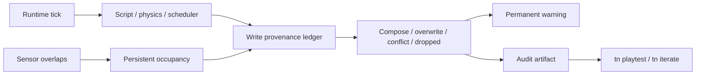
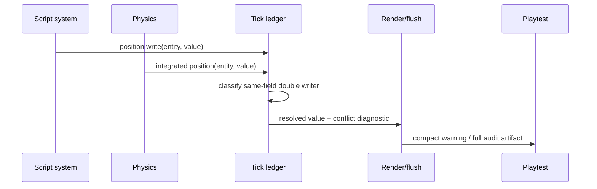

# PRD-001: Runtime State Integrity And Write Audit

`Planning Mode: Principal Architect`
`Complexity: 9 -> HIGH mode`

Score basis: +3 touches 10+ files, +2 introduces a runtime provenance system,
+2 complex per-tick state/conflict logic, +2 spans IR, web, native, CLI, and
verification packages.

## 1. Context

**Problem:** Sensor transitions and competing runtime writes are not owned by
one durable per-tick state model, so repeated `enter` events and silent
overwrites make engine failures indistinguishable from author mistakes.

**Wishlist coverage:** items 2 and 4.

**Files analyzed:**

- `packages/runtime-web-three/src/sensors.ts`
- `packages/runtime-web-three/src/systems/context.ts`
- `packages/runtime-web-three/src/systems/contextTypes.ts`
- `packages/runtime-web-three/src/systems/effects.ts`
- `packages/runtime-web-three/src/systems/runner.ts`
- `runtime-bevy/crates/threenative_runtime/src/physics_sensors.rs`
- `runtime-bevy/crates/threenative_runtime/src/systems_context.rs`
- `runtime-bevy/crates/threenative_runtime/src/systems_effects.rs`
- `packages/cli/src/commands/playtest.ts`
- `packages/cli/src/commands/iterate.ts`
- `docs/PRDs/done/agent-native-authoring-loop-2026-07-07/PRD-014-runtime-resource-parity-diagnostics.md`

**Current behavior:**

- Resource load/read/write observations exist and can diagnose an unobserved
  declared resource.
- `tracePhysicsSensors` creates its occupancy map inside each call. A host call
  can therefore report `enter` again instead of preserving transition state.
- Script component writes, resource writes, physics integration, and render
  interpolation do not share a stable provenance record.
- Playtest JSON has no opt-in general write audit, and transform double writers
  are not a permanent warning.

**Impact and risks:**

- Affects system scheduling, physics, sensors, command flushing, playtest
  artifacts, and diagnostics.
- Provenance capture can become too noisy or expensive; normal mode must retain
  only permanent correctness warnings, while audit mode stores full events.
- “Conflict” must distinguish intentional ordered composition from an
  overwrite. False positives would train authors to ignore the feature.

## 2. Solution

**Approach:**

- Add runtime-owned sensor occupancy keyed by scene, sensor, and occupant; emit
  `enter` once, `stay` while present, and `exit` once.
- Define one structured write-observation schema for component fields,
  resources, and declared state ingress, with writer, schedule, tick, old/new
  value fingerprints, and disposition.
- Classify ordered resource patches as `composed`, same-field replacement as
  `overwritten`, and transform writes from both physics and scripts in one tick
  as `conflict` unless an explicit ownership rule makes one authoritative.
- Emit a permanent diagnostic for script/physics transform double ownership;
  expose full observations only through `--audit-writes`.
- Extend existing resource-observation artifacts instead of creating a second
  trace family.



**Key decisions:**

- [x] Provenance records semantic writer categories, not adapter handles.
- [x] Values use bounded fingerprints plus small inline scalar/tuple values;
      full arbitrary component payloads do not flood stdout.
- [x] Sensor occupancy is runtime session state and resets on scene unload,
      explicit runtime reset, or entity destruction.
- [x] `TriggerEx.entered` remains a deprecated compatibility wrapper for one
      release cycle and delegates to host phases when available.
- [x] Normal mode reports only correctness conflicts; audit mode records all
      accepted/composed/overwritten/dropped writes.

**Data changes:** Playtest report JSON gains a versioned `writeAudit` object and
sensor transition observations. Bundle IR is unchanged.

## 3. Integration points

**How will this feature be reached?**

- [x] Entry points: every runtime tick; `tn playtest --audit-writes`; the same
      flag forwarded by `tn iterate`.
- [x] Callers: web/native system runners and effect flushers, physics
      integration, and playtest artifact builders.
- [x] Registration/wiring: CLI descriptor/argument registry, report schema,
      diagnostic catalog, conformance fixture, focused verification.

**Is this user-facing?** Yes. Agents see permanent warnings in ordinary runs
and a detailed audit in JSON/artifacts when requested.

**Full user flow:**

1. An author runs a playtest normally or with `--audit-writes`.
2. Physics and a script both write an entity transform, or a sensor overlap
   changes.
3. The runtime records writers and transition history before command flush.
4. Normal output names a correctness conflict; audit output additionally shows
   the ordered provenance chain and suggested owner-level fix.

## 4. Sequence flow



## 5. Execution phases

#### Phase 1: Stateful Web Sensor Phases - A continuous overlap emits enter, then stay, then one exit.

**Files (max 5):**

- `packages/runtime-web-three/src/sensors.ts` - separate occupancy state from
  the pure overlap calculation.
- `packages/runtime-web-three/src/sensors.test.ts` - multi-call transition and
  teardown coverage.
- `packages/runtime-web-three/src/systems/context.ts` - retain occupancy in web
  runtime state.
- `packages/runtime-web-three/src/systems/contextTypes.ts` - phase result types.
- `packages/runtime-web-three/src/systems/context.test.ts` - script-facing
  sensor sequence.

**Implementation:**

- [x] Add an explicit sensor state object owned by the web runtime session.
- [x] Advance occupancy once per fixed tick, not once per script call.
- [x] Return stable sorted occupants for each phase; repeated reads in one tick
      return the same snapshot without advancing state.
- [x] Remove occupancy for destroyed sensors/occupants and emit the final exit
      before cleanup when the sensor still exists.

**Tests required:**

| Test file | Test name | Assertion |
| --- | --- | --- |
| `sensors.test.ts` | `should emit enter once and stay on later ticks` | One enter followed by stays across separate calls. |
| `context.test.ts` | `should return one sensor snapshot to every reader in a tick` | Two systems observe identical phases without double advancement. |

**Verification plan:** run the focused web runtime tests and a pickup fixture
for three fixed ticks. Expected phases are `enter`, `stay`, `stay`, not three
`enter` events.

#### Phase 2: Write Provenance Contract - Every runtime write has a stable semantic owner and disposition.

**Files (max 5):**

- `packages/ir/src/runtimeDiagnostics.ts` - versioned observation types and
  diagnostic codes, or the existing owning diagnostics module.
- `packages/ir/src/runtimeDiagnostics.test.ts` - schema/serialization tests.
- `packages/runtime-web-three/src/systems/contextTypes.ts` - web ledger types.
- `packages/runtime-web-three/src/systems/context.ts` - record script writes.
- `packages/runtime-web-three/src/systems/effects.ts` - record final disposition.

**Implementation:**

- [x] Define writer categories: `script`, `physics`, `scheduler`, `animation`,
      `runtime-sync`, and `initial-ir`.
- [x] Record target kind/id/path, system/schedule/tick when applicable,
      fingerprint, and disposition.
- [x] Reuse resource observations by mapping them into the same envelope.
- [x] Classify different-field patches as composed, not conflicts.

**Tests required:**

| Test file | Test name | Assertion |
| --- | --- | --- |
| `runtimeDiagnostics.test.ts` | `should serialize bounded write observations deterministically` | Stable key order and fingerprints. |
| `effects.test.ts` | `should distinguish composed patches from overwritten fields` | Dispositions match ordered writes. |

**Verification plan:** run IR and web effects tests; inspect one JSON snapshot to
confirm it contains no adapter handles or unbounded payloads.

#### Phase 3: Permanent Conflict Diagnostics - Script/physics transform double ownership names both writers.

**Files (max 5):**

- `packages/runtime-web-three/src/systems/runner.ts` - tick ledger lifecycle.
- `packages/runtime-web-three/src/physics.ts` - record physics-owned pose writes.
- `packages/runtime-web-three/src/systems/effects.ts` - resolve and diagnose
  conflicting script writes.
- `packages/runtime-web-three/src/systems/runner.test.ts` - canonical
  double-integration regression.
- `packages/ir/diagnostics/diagnostics.catalog.json` - stable diagnostic family.

**Implementation:**

- [x] Emit `TN_RUNTIME_WRITE_CONFLICT` for the same transform field written by
      script and physics during one tick.
- [x] Include entity, field, both writer categories/system IDs, winning write,
      and a fix suggesting one owner.
- [ ] Diagnose declared input/component values that never enter the
      script-visible snapshot by extending the existing observation logic.
- [x] Keep conflict evaluation deterministic across system ordering.

**Tests required:**

| Test file | Test name | Assertion |
| --- | --- | --- |
| `runner.test.ts` | `should diagnose transform double ownership in one fixed tick` | Diagnostic names physics and script writers. |
| `runner.test.ts` | `should not diagnose ordered resource patch composition` | Legitimate composition remains clean. |

**Verification plan:** replay the kinematic double-integration regression. The
first failing run must contain an actionable conflict without audit mode.

#### Phase 4: Native Correctness Parity - Native sensors and conflicts produce the same semantic trace.

**Files (max 5):**

- `runtime-bevy/crates/threenative_runtime/src/physics_sensors.rs` - persistent
  transition state.
- `runtime-bevy/crates/threenative_runtime/src/systems_context.rs` - expose one
  snapshot per tick.
- `runtime-bevy/crates/threenative_runtime/src/systems_effects.rs` - native
  write ledger and dispositions.
- `runtime-bevy/crates/threenative_runtime/tests/systems_host.rs` - sensor and
  conflict host tests.
- `runtime-bevy/crates/threenative_runtime/tests/physics.rs` - transition tests.

**Implementation:**

- [x] Mirror session reset and entity teardown semantics.
- [x] Produce the same writer categories and conflict code as web.
- [x] Compare semantic fields, not adapter ordering or internal IDs.

**Tests required:**

| Test file | Test name | Assertion |
| --- | --- | --- |
| `physics.rs` | `should preserve sensor occupancy across native fixed ticks` | Enter/stay/exit sequence matches web. |
| `systems_host.rs` | `should report native transform double ownership` | Same code, target, and writers as web. |

**Verification plan:** run focused native tests and the cross-runtime fixture;
semantic audit observations must match after normalization.

#### Phase 5: CLI Audit And Promotion - One flag exposes the provenance chain and artifacts remain clean JSON.

**Files (max 5):**

- `packages/cli/src/commands/registry.ts` - own the `--audit-writes` flag.
- `packages/cli/src/commands/playtest.ts` - forward flag and report artifact.
- `packages/cli/src/commands/playtest.test.ts` - flag/output/diagnostic tests.
- `tools/verify/src/runtimeWriteAuditGate.ts` - focused cross-runtime fixture.
- `docs/status/capabilities/scripting.md` - capability and evidence.

**Implementation:**

- [x] Derive help/argv handling from the command registry.
- [x] Keep stdout summary bounded; write the full trace to the scenario
      artifact directory and include its path in JSON.
- [ ] Add `--expect-sensor-phase` and conflict-free proof only if they can be
      derived from the same playtest assertion registry; otherwise defer them.
- [x] Deprecate `TriggerEx.entered` in docs for one cycle.
- [x] Update `docs/STATUS.md`, relevant parity claims, cookbook patterns, and
      run cookbook verification as required by repo policy.

**Tests required:**

| Test file | Test name | Assertion |
| --- | --- | --- |
| `playtest.test.ts` | `should emit clean JSON and write a full audit artifact` | JSON parses and artifact exists. |
| focused gate | `should match sensor transitions and conflicts across runtimes` | Normalized evidence matches. |

**Verification plan:**

```bash
pnpm --filter @threenative/runtime-web-three test
cargo test --manifest-path runtime-bevy/Cargo.toml -p threenative_runtime physics_sensors
pnpm --filter @threenative/cli test
pnpm verify:conformance
pnpm verify:cookbook
```

## 6. Checkpoint protocol

After each phase, run the automated PRD checkpoint reviewer against this file
and proceed only on PASS. Phases 4 and 5 also require manual inspection of one
audit artifact for readability and bounded size.

## 7. Acceptance criteria

- [x] Continuous overlap emits exactly one enter and one exit per transition on
      web and native.
- [x] Two sensor reads in the same tick do not mutate phase state.
- [x] Script/physics transform double ownership is a permanent actionable
      warning without audit mode.
- [x] Audit mode records component/resource provenance and dropped/overwritten
      writes with stable JSON.
- [x] Legitimate ordered patch composition does not warn.
- [x] CLI JSON remains parseable and links the full artifact.
- [ ] All phase tests, conformance, docs, and checkpoint reviews pass. The
      focused phase tests, docs, cookbook, and gate pass; the conformance
      aggregate is currently blocked by an unrelated concurrent CLI type error
      in `packages/cli/src/commands/gameScore.test.ts`.

## 8. Verification evidence

Implementation evidence (2026-07-11):

- Web runtime: `pnpm --filter @threenative/runtime-web-three test` passed 376
  tests and typecheck passed.
- IR: `pnpm --filter @threenative/ir test` passed 354 tests.
- Native: `cargo test -p threenative_runtime systems_host --lib --tests`
  passed 39 systems-host tests; the proof-harness test target also passed.
- CLI: the focused write-audit artifact test passed; the full CLI suite had
  previously passed 401 tests before an unrelated concurrent edit introduced
  the current `gameScore.test.ts` type error.
- Gate: `pnpm --filter @threenative/verify-tools test -- --run "runtime write audit gate"`
  passed, and `pnpm verify:focused verify:runtime-write-audit` writes
  `tools/verify/artifacts/runtime-write-audit/verification-report.json`.
- Docs/cookbook: `pnpm verify:cookbook` passed with
  `TN_COOKBOOK_GATE_OK`; `pnpm check:docs` is pending the unrelated CLI type
  error because its setup rebuilds the CLI package.
- Conformance: `pnpm verify:conformance` reached the aggregate gate but failed
  at V7 packaging setup because `pnpm --filter @threenative/cli build` currently
  fails on the unrelated `gameScore.test.ts` type mismatch.
- Self-checkpoint: PASS for the state/audit implementation, bounded JSON
  artifact, web/native focused tests, focused gate, and cookbook evidence.
