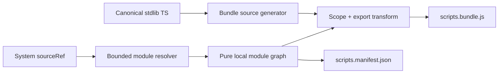
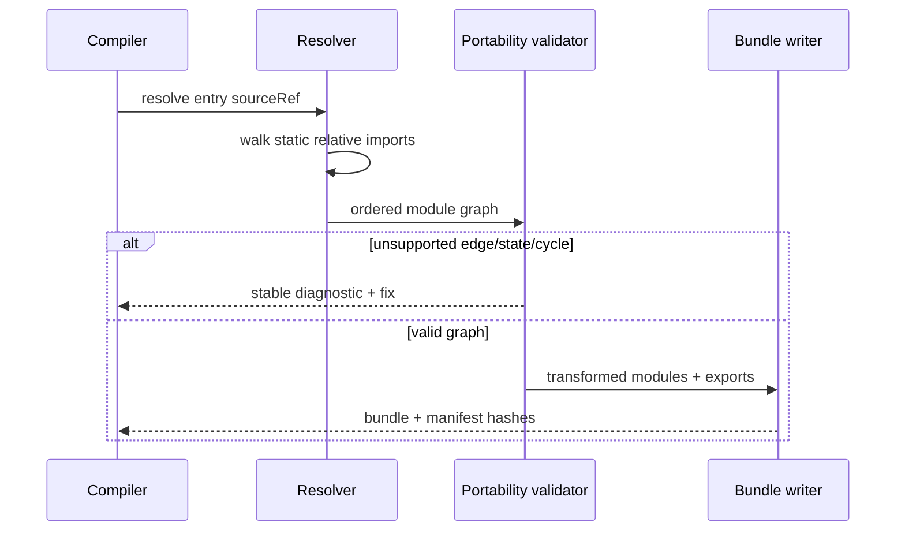

# PRD-002: Project-Local Script Modules

`Planning Mode: Principal Architect`
`Complexity: 7 -> HIGH mode`

Score basis: +3 touches 10+ files, +2 adds a module-graph subsystem, and +2
spans compiler, script stdlib, CLI diagnostics, fixtures, and documentation.

## 1. Context

**Problem:** Portable scripts cannot import project-local helpers, forcing each
system export to be self-contained and keeping the script stdlib in two
hand-maintained implementations.

**Wishlist coverage:** item 1.

**Files analyzed:**

- `packages/compiler/src/scripts/bundle.ts`
- `packages/compiler/src/scripts/bundle.test.ts`
- `packages/compiler/src/scripts/diagnostics.ts`
- `packages/compiler/src/scripts/lexical.ts`
- `packages/compiler/src/scripts/sourceRefs.ts`
- `packages/script-stdlib/src/index.ts`
- `packages/script-stdlib/src/bundle-source.ts`
- `packages/script-stdlib/src/index.test.ts`
- `docs/contracts/scripting-host-matrix.md`
- `docs/status/capabilities/scripting.md`

**Current behavior:**

- Runtime helper imports are restricted to a fixed package allowlist.
- Source-referenced scripts reject module-local helpers that cannot be emitted.
- Type-only generated local context imports are ignored safely.
- Runtime bundles are single generated JavaScript files consumed by both hosts.
- Stdlib TypeScript and `bundle-source.ts` duplicate the runtime helper logic and
  rely on parity tests to catch drift.

**Impact and risks:**

- Affects source resolution, diagnostics, bundle hashing/manifests, editor
  source workflows, and both hosts' bundle loading.
- Cycles, path escapes, hidden mutable state, dynamic imports, and ambiguous
  extension resolution must fail deterministically.
- Bundling must preserve system export names and metadata extraction.

## 2. Solution

**Approach:**

- Resolve static relative imports from each `src/scripts/**` source reference
  into a project-root-bounded module graph.
- Support named/default imports and re-exports only where the compiler can
  prove a closed, side-effect-free graph; reject dynamic import, bare project
  dependencies, path escapes, and top-level mutable state.
- Transform the graph into one deterministic bundle with module-local scopes
  and stable ordering, retaining the existing single-bundle runtime contract.
- Record source module/hash/dependency edges in `scripts.manifest.json` for
  diagnostics and cache invalidation.
- Generate the runtime stdlib bundle source from the canonical stdlib modules
  during package build, eliminating manual dual implementation.



**Key decisions:**

- [x] Relative modules are compile-time only; runtimes still load one bundle
      and receive no filesystem or dynamic module capability.
- [x] Resolution is rooted at the project `src/scripts` directory and accepts
      explicit `.ts` plus familiar extensionless/index resolution with a fixed,
      documented precedence.
- [x] Module evaluation order is deterministic topological order with lexical
      path tie-breaking; dependency cycles fail with the full cycle chain.
- [x] Pure declarations and functions are allowed; mutable top-level state and
      side-effect expressions remain unsupported.
- [x] Existing package helper imports continue through their owning allowlist.

**Data changes:** `scripts.manifest.json` gains a versioned local-module graph.
`scripts.bundle.js` remains the only executable artifact.

## 3. Integration points

**How will this feature be reached?**

- [x] Entry point: `tn build`, compiler capture/build, and editor-triggered
      source compilation.
- [x] Caller: script `sourceRef` resolution before `bundleSystemScripts`.
- [x] Registration/wiring: resolver, diagnostic catalog, manifest writer,
      compiler fixture, cookbook pattern, and stdlib package build.

**Is this user-facing?** Yes. Authors write ordinary relative imports between
portable script files; build diagnostics point to the importing file and edge.

**Full user flow:**

1. An author imports `patrolStep` from `./shared/ai` in a system module.
2. The compiler resolves the path inside `src/scripts`, validates the closed
   graph, and derives system metadata from the entry export.
3. The compiler emits one portable bundle and graph manifest.
4. Web and native execute the same system export without runtime imports.

## 4. Sequence flow



## 5. Execution phases

#### Phase 1: Bounded Module Resolution - Relative imports resolve inside `src/scripts` with prescriptive failures.

**Files (max 5):**

- `packages/compiler/src/scripts/moduleGraph.ts` - resolver and graph types.
- `packages/compiler/src/scripts/moduleGraph.test.ts` - path/cycle/order tests.
- `packages/compiler/src/scripts/sourceRefs.ts` - invoke graph resolution.
- `packages/compiler/src/scripts/diagnostics.ts` - module diagnostics/fixes.
- `packages/compiler/src/scripts/diagnostics.test.ts` - stable messages.

**Implementation:**

- [x] Parse static import/export specifiers with the existing structured
      lexical/parsing utilities; do not use regular expressions as a module
      parser.
- [x] Resolve `./x`, `./x.ts`, and `./x/index.ts` with fixed precedence.
- [x] Reject paths outside `src/scripts`, dynamic imports, unsupported bare
      packages, missing modules, and cycles with import-chain context.
- [x] Sort graph nodes/edges deterministically and hash normalized source.

**Tests required:**

| Test file | Test name | Assertion |
| --- | --- | --- |
| `moduleGraph.test.ts` | `should resolve a nested relative module graph deterministically` | Same graph/order/hash on repeated runs. |
| `moduleGraph.test.ts` | `should reject an import that escapes src scripts` | Diagnostic names importer, specifier, root, and fix. |
| `moduleGraph.test.ts` | `should report the complete relative import cycle` | Cycle chain is stable. |

**Verification plan:** run compiler module graph and diagnostics tests with
temporary fixture roots; no emitted code is required yet.

#### Phase 2: Pure Module Bundling - Two script files execute as one portable system bundle.

**Files (max 5):**

- `packages/compiler/src/scripts/bundle.ts` - consume module graphs and scope
  transformed modules.
- `packages/compiler/src/scripts/bundle.test.ts` - helper import/re-export and
  execution coverage.
- `packages/compiler/src/scripts/lexical.ts` - structured declaration/export
  analysis if the current parser lacks a needed node.
- `packages/compiler/src/scripts/quickjsProbe.ts` - probe final exports.
- `packages/compiler/src/scripts/quickjsProbe.test.ts` - QuickJS parity test.

**Implementation:**

- [x] Preserve module-local names without leaking helpers globally.
- [x] Wire named/default imports and supported re-exports to transformed module
      bindings.
- [x] Continue extracting the system entry export and `defineBehavior`
      metadata exactly once.
- [x] Reject top-level mutation, side-effect-only imports, ambiguous exports,
      and runtime-dependent initialization.
- [x] Prove a helper imported by two systems is emitted once or safely scoped
      once per module, not copy-pasted per export.

**Tests required:**

| Test file | Test name | Assertion |
| --- | --- | --- |
| `bundle.test.ts` | `should bundle a system that imports a project local helper` | Export executes and returns expected effects. |
| `bundle.test.ts` | `should reject mutable module local state across ticks` | Existing portability diagnostic remains enforced. |
| `quickjsProbe.test.ts` | `should execute the local module bundle in QuickJS` | Native host-compatible export is callable. |

**Verification plan:** run compiler tests and execute the emitted string in the
existing VM and QuickJS probes.

#### Phase 3: Manifest, Cache, And Source Diagnostics - Every emitted byte maps back to its owning local module.

**Files (max 5):**

- `packages/compiler/src/scripts/bundle.ts` - manifest graph emission.
- `packages/compiler/src/scripts/sourceRefs.ts` - module/hash source mapping.
- `packages/compiler/src/scripts/sourceRefs.test.ts` - hash invalidation tests.
- `packages/ir/src/types.ts` - manifest graph type if it is a public artifact
  contract.
- `packages/ir/src/schema.test.ts` - structured manifest round-trip.

**Implementation:**

- [x] Record normalized project-relative path, content hash, dependencies, and
      entry systems for every module.
- [x] Invalidate bundle output when any transitive dependency changes.
- [x] Attribute parse/portability errors to the original module and line rather
      than generated bundle offsets.
- [x] Preserve stable output when filesystem enumeration order changes.

**Tests required:**

| Test file | Test name | Assertion |
| --- | --- | --- |
| `sourceRefs.test.ts` | `should invalidate an entry when a transitive helper changes` | Entry graph hash changes. |
| `schema.test.ts` | `should round trip the local script module manifest` | Structured parse/serialize preserves graph. |

**Verification plan:** build the same fixture twice in different file creation
orders and compare bundle/manifest hashes.

#### Phase 4: Single-Source Stdlib Bundle - Runtime helper code is generated from canonical stdlib modules.

**Files (max 5):**

- `packages/script-stdlib/scripts/generate-bundle-source.mjs` - deterministic
  generator using the package's canonical source graph.
- `packages/script-stdlib/src/bundle-source.generated.ts` - generated artifact
  imported by consumers.
- `packages/script-stdlib/src/index.ts` - canonical export ownership.
- `packages/script-stdlib/src/index.test.ts` - generated/export parity.
- `packages/script-stdlib/package.json` - build/check scripts.

**Implementation:**

- [x] Generate the bundle source as part of build from the same canonical
      helper implementations used by TypeScript consumers.
- [x] Replace the manual `bundle-source.ts` body with a generated import or
      compatibility shim; do not keep two editable implementations.
- [x] Add a check-mode command that fails on stale generated output.
- [x] Preserve the existing public export names and runtime bundle behavior.

**Tests required:**

| Test file | Test name | Assertion |
| --- | --- | --- |
| `index.test.ts` | `should expose identical canonical and generated stdlib behavior` | Full helper corpus matches. |
| package check | `should fail when generated bundle source is stale` | Edited canonical helper requires regeneration. |

**Verification plan:** run the stdlib generation check, package tests, and a
clean package build from deleted generated output.

#### Phase 5: Golden-Path Fixture And Docs - A real game splits shared helpers without changing behavior.

**Files (max 5):**

- `packages/ir/fixtures/conformance/script-local-modules/` - closed multi-file
  source fixture and expected bundle evidence.
- `packages/ir/fixtures/conformance/fixture-catalog.json` - fixture enrollment.
- `tools/verify/src/scriptLocalModulesGate.ts` - deterministic bundle/runtime
  proof.
- `docs/contracts/scripting.md` - allowed local-module subset and examples.
- `docs/status/capabilities/scripting.md` - promotion/evidence.

**Implementation:**

- [x] Split a representative patrol/collection helper into a shared module and
      two system entry files.
- [x] Prove web and native consume the same single bundle and effects.
- [x] Document supported import grammar, purity rules, resolution precedence,
      and diagnostics.
- [x] Update `docs/STATUS.md`, cookbook pattern, and cookbook verification.

**Tests required:**

| Test file | Test name | Assertion |
| --- | --- | --- |
| focused gate | `should execute project local modules identically on web and native` | System effects and bundle hash evidence pass. |

**Verification plan:**

```bash
pnpm --filter @threenative/script-stdlib test
pnpm --filter @threenative/compiler test
pnpm build
pnpm verify:conformance
pnpm verify:cookbook
```

## 6. Checkpoint protocol

Run the automated PRD checkpoint reviewer after every phase. Phase 4 also
requires manual confirmation that there is exactly one editable stdlib
implementation and generated files are clearly marked.

## 7. Acceptance criteria

- [x] Static relative imports within `src/scripts` compile into one bundle.
- [x] Cycles, path escapes, dynamic imports, unsupported packages, side effects,
      and mutable module state fail with actionable diagnostics.
- [x] Transitive edits invalidate hashes and diagnostics name original files.
- [x] Bundle output is deterministic across filesystem enumeration order.
- [x] Stdlib runtime source is generated from one canonical implementation.
- [x] The multi-file fixture executes identically on web and native.
- [x] All tests, docs, cookbook, conformance, and checkpoint reviews pass.

## 8. Verification evidence

Evidence: `pnpm --filter @threenative/script-stdlib check:generated` passed;
stdlib parity passed 32 tests; compiler tests passed 241 tests; the focused
`verify:script-local-modules` gate passed with deterministic bundle hash,
transitive module graph metadata, one shared helper module, VM results
`collect={score:5,status:collected}` and `updateHud={label:"Score 5"}`, and
QuickJS loadability; sourceRefs tests cover transitive hash invalidation and
the graph tests cover deterministic order, path escape, missing/bare/dynamic
imports, and complete cycles. `pnpm verify:cookbook` and
`pnpm verify:conformance` passed after adding the project-local module pattern
and canonical fixture bundle.
