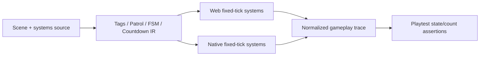

# PRD-003: Runtime-Owned Gameplay Primitives

`Planning Mode: Principal Architect`
`Complexity: 9 -> HIGH mode`

Score basis: +3 touches 10+ files, +2 adds runtime component/resource systems,
+2 complex lifecycle/state logic, and +2 spans authoring, IR, web, native, CLI,
and verification packages.

## 1. Context

**Problem:** Common entity behavior and match plumbing still live in repetitive
scripts even though both runtimes already own fixed ticks, queries, sensors,
spawn/despawn, and resources.

**Wishlist coverage:** items 5, 6, 7 (remaining tags/query/observations only),
and 8.

**Files analyzed:**

- `packages/ir/src/types.ts`
- `packages/ir/src/systems.ts`
- `packages/ir/src/systemsValidation.ts`
- `packages/runtime-web-three/src/systems/context.ts`
- `packages/runtime-web-three/src/spawner.ts`
- `runtime-bevy/crates/threenative_loader/src/types.rs`
- `runtime-bevy/crates/threenative_runtime/src/systems_context.rs`
- `runtime-bevy/crates/threenative_runtime/src/systems_effects.rs`
- `runtime-bevy/crates/threenative_runtime/src/kinematic_mover.rs`
- `packages/cli/src/commands/add.ts`
- `packages/cli/src/mechanicBlocks/registry.ts`
- `docs/PRDs/done/other/system-code-quality-remediation-2026-07-08/PRD-001-native-scripted-spawn-despawn-live-reconciliation.md`

**Current behavior:**

- World entities already carry optional tags in TypeScript IR, but the native
  loader and script context do not expose a complete tag-query contract.
- Scripted spawn/despawn is live-reconciled natively; this PRD does not redo it.
- Queries are component-oriented; lifecycle observation and tag-count playtest
  assertions are missing.
- `KinematicMover` and fixed-tick helpers exist, but general waypoint patrol,
  per-entity FSMs, and runtime-ticked countdown resources do not.
- `tn add timer` exists, but generates resource/script plumbing rather than a
  runtime-owned timer declaration.

**Impact and risks:** Broad gameplay automation can become an inflexible second
scripting language. V1 therefore implements only deterministic, inspectable
primitives and leaves game-specific decisions in scripts.

## 2. Solution

**Approach:**

- Finish tags as a cross-runtime entity contract and expose sorted
  `ctx.entities.withTag/countTag/spawned/despawned` observations.
- Add a bounded `Patrol` component for straight-line loop/ping-pong movement,
  facing, pause, and script pause/resume/redirect controls.
- Add a bounded per-entity `StateMachine` component with event, sensor-phase,
  and timer transitions. Scripts handle arbitrary predicates by issuing an
  explicit transition event; the runtime does not call named user functions.
- Add systems-level countdown declarations that tick a numeric resource field
  on fixed updates and emit one declared event at the limit.
- Extend the existing mechanic-block registry so `tn add timer` emits the
  runtime declaration and proof, rather than maintaining timer math in a stub.



**Key decisions:**

- [x] Existing tags, queries, spawn reconciliation, sensors, resources, and
      event queues are extended; no parallel entity registry is introduced.
- [x] Entity order is stable by entity ID in both hosts.
- [x] Patrol is kinematic intent. Dynamic rigid bodies require an explicit
      unsupported diagnostic or a future force/steering contract.
- [x] FSM transitions are data and events, not arbitrary runtime callbacks.
- [x] Countdown advancement is fixed-tick only and fires its limit event once
      per start/restart cycle.

**Data changes:** Entity/prefab tags round-trip through native loader; built-in
`Patrol` and `StateMachine` component schemas are added; systems IR gains
bounded countdown declarations.

## 3. Integration points

- [x] Entry points: structured scene/prefab/system source, registry-backed
      authoring operations, `tn add timer`, runtime fixed ticks, and playtest.
- [x] Callers: compiler emission, web runner, native schedule, command effect
      flush, and assertion evaluator.
- [x] User-facing: authors configure primitives in source, inspect state from
      scripts, and assert state/counts in playtests.

**Full user flow:** Author adds a tagged coin prefab, patrol component, entity
FSM, or timer declaration; build validates it; web/native fixed ticks advance
the same state; scripts query/control it; playtest proves the resulting state.

## 4. Execution phases

#### Phase 1: Tagged Lifecycle Queries - Spawned entities can be found and counted without hand-tracked resources.

**Files (max 5):**

- `packages/ir/src/types.ts` - canonical entity/prefab tag shape.
- `packages/ir/src/systems.ts` - lifecycle observation service declarations if
  needed by the owning service registry.
- `packages/runtime-web-three/src/systems/contextTypes.ts` - entity query API.
- `packages/runtime-web-three/src/systems/context.ts` - sorted tag queries and
  per-tick spawn/despawn observations.
- `packages/runtime-web-three/src/systems/context.test.ts` - behavior tests.

**Implementation:**

- [x] Expose `withTag(tag)`, `countTag(tag)`, `spawned({tag?})`, and
      `despawned({tag?})` on `ctx.entities`.
- [x] Extend spawn/instantiate inputs so tags come from the explicit entity or
      prefab template and survive command flushing.
- [x] Snapshot lifecycle observations once per tick; repeated reads are stable.
- [x] Return IDs in lexical order and reject invalid/unbounded tag values.

| Test file | Test name | Assertion |
| --- | --- | --- |
| `context.test.ts` | `should query runtime spawned entities by tag` | Spawned coin appears and count is one. |
| `context.test.ts` | `should expose spawn and despawn once per tick` | Repeated reads do not duplicate observations. |

**Verification plan:** run web context/effect tests and a wave-cleanup fixture.

#### Phase 2: Native Tagged Lifecycle Parity - Native exposes the same reconciled entity set and observations.

**Files (max 5):**

- `runtime-bevy/crates/threenative_loader/src/types.rs` - deserialize entity and
  prefab tags.
- `runtime-bevy/crates/threenative_runtime/src/systems_context.rs` - tag queries
  and lifecycle snapshot.
- `runtime-bevy/crates/threenative_runtime/src/systems_effects.rs` - preserve
  tags through spawn/instantiate/despawn.
- `runtime-bevy/crates/threenative_runtime/tests/systems_host.rs` - host tests.
- `runtime-bevy/crates/threenative_runtime/tests/runtime_reconciliation.rs` -
  live/tag reconciliation proof.

**Implementation:**

- [x] Preserve tags in loader and runtime bundle mutations.
- [x] Derive observations from the same successful reconciliation result, never
      from an optimistic command request.
- [x] Normalize observations to the web schema.

| Test file | Test name | Assertion |
| --- | --- | --- |
| `systems_host.rs` | `should query native runtime spawned entities by tag` | Result matches web ordering/count. |
| `runtime_reconciliation.rs` | `should observe lifecycle only after live reconciliation` | No false successful spawn event. |

**Verification plan:** compare normalized web/native traces for spawn, query,
despawn, and missing-prefab rejection.

#### Phase 3: Waypoint Patrol - A configured kinematic entity patrols without a gameplay script.

**Files (max 5):**

- `packages/ir/src/types.ts` - `IPatrolComponent` contract.
- `packages/ir/src/validate.ts` - bounds and rigid-body compatibility.
- `packages/runtime-web-three/src/patrol.ts` - deterministic patrol step/control.
- `packages/runtime-web-three/src/patrol.test.ts` - loop/ping-pong/pause/facing.
- `packages/runtime-web-three/src/systems/runner.ts` - fixed-tick registration.

**Implementation:**

- [x] Support waypoints, speed, `loop|ping-pong`, `faceHeading`, and bounded
      `pauseAtWaypoint`.
- [x] Store current segment/direction/pause in runtime-owned state and expose
      pause/resume/redirect through a declared service or component command.
- [x] Clamp overshoot and handle duplicate/zero-length waypoints deterministically.
- [x] Diagnose use on a dynamic rigid body.

| Test file | Test name | Assertion |
| --- | --- | --- |
| `patrol.test.ts` | `should traverse loop waypoints without overshoot` | Pose and segment match expected fixed ticks. |
| `patrol.test.ts` | `should reverse and pause in ping pong mode` | Direction/pause trace is stable. |

**Verification plan:** web playtest asserts positions and facing at fixed ticks.

#### Phase 4: Native Patrol Parity - The same patrol trace runs on Bevy.

**Files (max 5):**

- `runtime-bevy/crates/threenative_loader/src/types.rs` - patrol component.
- `runtime-bevy/crates/threenative_runtime/src/patrol.rs` - native step/control.
- `runtime-bevy/crates/threenative_runtime/src/lib.rs` - schedule registration.
- `runtime-bevy/crates/threenative_runtime/tests/patrol.rs` - native behavior.
- `packages/ir/fixtures/conformance/waypoint-patrol/` - shared fixture.

**Implementation:** Mirror web semantics using real fixed delta; compare
normalized position, heading, segment, direction, and pause observations.

| Test file | Test name | Assertion |
| --- | --- | --- |
| `patrol.rs` | `should match the portable patrol trace` | Native samples match fixture expectations. |

**Verification plan:** `pnpm verify:conformance` plus desktop playtest fixture.

#### Phase 5: Per-Entity FSM - Entity state changes on event, sensor phase, or fixed timer and is traceable.

**Files (max 5):**

- `packages/ir/src/types.ts` - FSM component/transition types.
- `packages/ir/src/validate.ts` - state/transition validation.
- `packages/runtime-web-three/src/stateMachines.ts` - deterministic evaluator.
- `packages/runtime-web-three/src/stateMachines.test.ts` - transition priority.
- `packages/runtime-web-three/src/systems/context.ts` - read/explicit transition.

**Implementation:**

- [x] Define initial/current state, unique states, and ordered transitions.
- [x] Support one trigger per transition: event, sensor phase, or elapsed fixed
      ticks; scripts may emit an explicit transition event after evaluating a
      game-specific predicate.
- [x] Expose current state and transition trace without mutable host handles.
- [x] Resolve simultaneous transitions by declaration order and record the
      chosen transition.

| Test file | Test name | Assertion |
| --- | --- | --- |
| `stateMachines.test.ts` | `should transition once when a sensor enter fires` | State/trace changes once. |
| `stateMachines.test.ts` | `should resolve simultaneous transitions by declaration order` | Deterministic winner is recorded. |

**Verification plan:** web fixture proves idle → chase → return transitions.

#### Phase 6: Native FSM Parity - Bevy produces the same transition trace.

**Files (max 5):**

- `runtime-bevy/crates/threenative_loader/src/types.rs` - FSM shape.
- `runtime-bevy/crates/threenative_runtime/src/state_machines.rs` - evaluator.
- `runtime-bevy/crates/threenative_runtime/src/lib.rs` - schedule order.
- `runtime-bevy/crates/threenative_runtime/tests/state_machines.rs` - parity.
- `packages/ir/fixtures/conformance/entity-state-machine/` - shared fixture.

**Verification plan:** compare state, trigger, prior/current state, entity, and
tick across hosts; do not compare adapter internals.

#### Phase 7: Runtime Countdown - `tn add timer` emits a runtime-ticked declaration and one limit event.

**Files (max 5):**

- `packages/ir/src/systems.ts` - countdown declaration.
- `packages/ir/src/systemsValidation.ts` - resource/field/event validation.
- `packages/cli/src/mechanicBlocks/registry.ts` - timer block owning config.
- `packages/runtime-web-three/src/systems/runner.ts` - web fixed-tick advance.
- `runtime-bevy/crates/threenative_runtime/src/systems_effects.rs` - native
  fixed-tick advance and event.

**Implementation:**

- [x] Support up/down, limit, autostart, start/stop/restart control, and one
      declared event at the limit.
- [x] Make `tn add timer` write the declaration through the mechanic-block
      registry and remove generated dt accumulation from new output.
- [x] Preserve HUD resource binding and existing projects.
- [x] Add web/native tests and the timer block proof without creating a second
      CLI list.

| Test file | Test name | Assertion |
| --- | --- | --- |
| systems validation | `should reject countdown with undeclared resource field` | Stable path/fix. |
| runtime tests | `should fire countdown limit event once per cycle` | Web/native tick and event match. |

**Verification plan:** run add-command tests, both runtime tests, cookbook
verification, and a web/desktop timer playtest.

#### Phase 8: Authoring And Proof Promotion - Primitives are reachable, assertable, and documented.

**Files (max 5):**

- `packages/authoring/src/operationRegistry.ts` - descriptor-backed primitive
  mutations.
- `packages/cli/src/commands/playtestAssertions.ts` - derive tag count/state
  assertions from the assertion registry.
- `tools/verify/src/gameplayPrimitivesGate.ts` - combined fixture gate.
- `docs/contracts/scripting-api.md` - script controls/queries.
- `docs/status/capabilities/scripting.md` - status and evidence.

**Implementation:** Add bounded authoring operations, `--expect-count
tag:coin=10`/state assertion schema equivalents, cookbook examples, status
updates, and proof enrollment from owning registries.

Completed with the generic structured component operation backed by the
component registry, `scene.add_tag`, the registry-owned timer block, and
schema-equivalent `assert.tags`/`assert.states` playtest assertions. The
combined `gameplay-primitives` fixture is enrolled from the conformance
catalog and proves the cross-runtime contract.

**Verification plan:**

```bash
pnpm --filter @threenative/ir test
pnpm --filter @threenative/runtime-web-three test
cargo test --manifest-path runtime-bevy/Cargo.toml -p threenative_runtime
pnpm --filter @threenative/cli test
pnpm verify:conformance
pnpm verify:cookbook
```

## 5. Checkpoint protocol

Run the automated PRD checkpoint reviewer after every phase. Patrol and FSM
cross-runtime phases require manual inspection of the normalized trace only if
automated comparison cannot explain a mismatch.

## 6. Acceptance criteria

- [x] Runtime-spawned entities retain tags and are queryable/countable on both hosts.
- [x] Lifecycle observations reflect successful live effects exactly once.
- [x] Patrol loop/ping-pong/pause/facing traces match across hosts.
- [x] Entity FSM state and transition traces match across hosts.
- [x] Runtime countdown updates HUD-bound resources and fires once at limit.
- [x] `tn add timer` uses runtime ticking for newly generated projects.
- [x] Authoring, playtest, cookbook, status, conformance, and checkpoints pass.

## 7. Verification evidence

Evidence:

- Shared fixture and generated proof inputs: `packages/ir/fixtures/conformance/gameplay-primitives/game.bundle/`.
- Web runtime gameplay trace coverage: `pnpm --filter @threenative/runtime-web-three test` (386/386).
- CLI timer generation and gameplay assertion coverage: `node --test packages/cli/dist/commands/add.test.js` (3/3) and `node --test packages/cli/dist/commands/playtestAssertions.test.js` (13/13).
- Native fixed-tick parity: `cargo test --manifest-path runtime-bevy/Cargo.toml -p threenative_runtime --test systems_host systems_host_should_` (44 passed).
- Combined gate: `pnpm verify:gameplay-primitives` passed; report at `tools/verify/artifacts/gameplay-primitives/verification-report.json`.
- Cross-runtime conformance: `pnpm verify:conformance` passed; report at `packages/ir/artifacts/conformance/verification-report.json`.
- Reusable authoring pattern: `pnpm verify:cookbook` passed for all cookbook entries.
- Native readiness now carries `gameplayObservations`; web readiness carries the same normalized `runtimeObservations.gameplay` shape, and `assert.tags`/`assert.states` consume both.
