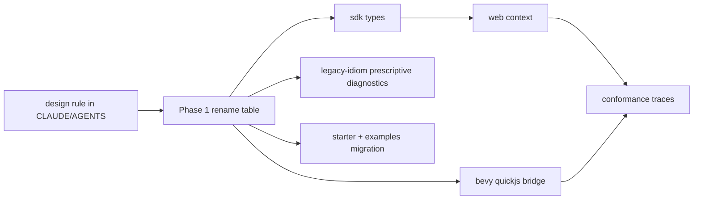
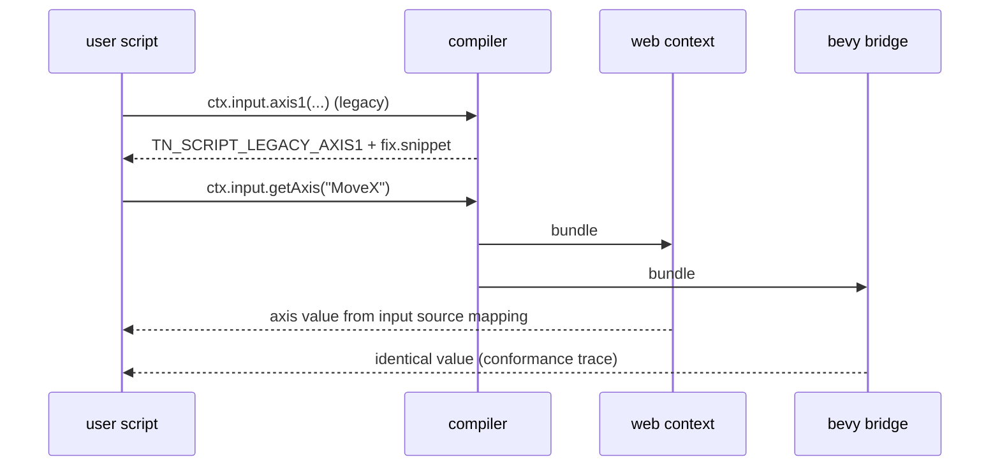

# PRD: Convention Alignment (Script Context KISS Pass)

`Planning Mode: Principal Architect`
`Complexity: 7 -> HIGH mode`

Score basis: +3 touches 10+ files (SDK types, stdlib, web runtime context,
Bevy QuickJS bridge, compiler, starter, examples, docs); +2 multi-package
changes; +2 shared runtime-contract semantics across web and native.

## 1. Context

**Problem:** The script-facing API carries bespoke idioms with zero training
distribution (`axis1` with call-site axis mapping, `positionOr`, option-bag
`fixedDelta`, script-side proof rounding), taxing every agent session; the
surface should match in-distribution conventions (Unity vocabulary, idiomatic
JS) wherever behavior is identical.

**Files Analyzed:**

- `templates/structured-source-starter/src/scripts/player.ts`
- `packages/sdk` script context types (`ctx.entity`, `ctx.entities.byId`,
  `ctx.state`, `ctx.time.fixedDelta(...)`, `ctx.input.axis1(...)`,
  `transform()` helpers, per STATUS.md)
- `packages/runtime-web-three/src/` context implementation
- `runtime-bevy/crates/threenative_runtime/src/systems_host_bridge.js` and
  `systems_context.rs`
- `packages/script-stdlib/src/` (`Vec3`, `InputEx`, `MotionEx`, ...)
- `packages/compiler/src/` helper-import allowlist and script validation
- `content/input/*.input.json` axis/action source contract

**Current Behavior:**

- `ctx.input.axis1("MoveX", { negative: "move-left", positive: "move-right" })`
  defines the axis mapping at the call site even though
  `content/input/*.input.json` is the durable input source of truth.
- `transform.positionOr([0, 0.35, 0])` forces a script-side fallback for
  data the runtime already knows (the authored transform).
- `ctx.time.fixedDelta({ fallback: 1/60, max: 1/30, min: 0.001 })` pushes
  engine-policy clamping into every script.
- The starter script rounds positions (`Vec3.round(..., 6)`) so proof
  artifacts are deterministic — an engine concern leaked into user code.
- Web and Bevy QuickJS bridge both implement these idioms; the conformance
  gate pins them as shared contract.

## Pre-Planning Findings

**How will this feature be reached?**

- [x] Entry point identified: every `src/scripts/**/*.ts` authored by users
  and agents; the SDK types are the discovery surface.
- [x] Caller file identified: web runtime systems context and the Bevy
  QuickJS host bridge execute the new API; the compiler validates it.
- [x] Registration/wiring needed: SDK type exports, both runtime context
  factories, compiler script validation, conformance fixtures, starter and
  example scripts, cookbook entries (PRD-002, later), docs.

**Is this user-facing?**

- [x] YES. This IS the user/agent-facing scripting API. No graphical UI;
  the "UI" is the typed context surface plus diagnostics.

**Full user flow:**

1. Agent writes a movement script using conventions it already knows:
   `const move = ctx.input.getAxis("MoveX")`,
   `entity.transform.position = next`, `ctx.time.fixedDelta`.
2. Compiler accepts it; legacy idioms fail with prescriptive diagnostics
   naming the exact replacement (PRD-004 `fix` style, implemented here for
   these codes even though PRD-004 ships separately).
3. Both runtimes execute identical semantics; conformance traces prove it.

## 2. Solution

**Approach:**

- **Adopt the design rule first** (CLAUDE.md/AGENTS.md): new portable API
  must reuse in-distribution names (Unity vocabulary, idiomatic JS/Three.js
  shapes) when behavior matches; must use a deliberately distinct name when
  behavior differs; must not add option-bag parameters for engine policy.
- **Anti-uncanny-valley rule**, committed alongside: do not cosplay
  MonoBehaviour. Systems remain functions over a context; no `GetComponent`,
  no coroutine look-alikes, no lifecycle classes. Same-name-only-when-same-
  behavior prevents confident hallucination of Unity APIs we do not have.
- Rename/reshape the four measured offenders (the committed worklist; the
  rename table in Phase 1 is the single source of truth):
  - `ctx.input.axis1(id, {negative, positive})` -> `ctx.input.getAxis(id)`;
    the negative/positive action mapping moves into
    `content/input/*.input.json` axis rows where it always belonged.
  - `transform().positionOr(fallback)` -> `transform.position` read backed
    by the authored/live transform (no script fallback);
    `setPosition(v)` -> `transform.position = v` property write, with
    `setPosition` retained as an explicit-method alias since property
    setters and batched effects must stay equivalent.
  - `ctx.time.fixedDelta(options)` -> `ctx.time.fixedDelta` readonly
    property; clamp policy becomes engine-owned defaults, overridable only
    in `content/runtime/*.runtime.json`, never at call sites.
  - Remove proof-rounding from user scripts: proof/trace sampling rounds at
    capture time in both runtimes; `Vec3.round` stays in the stdlib but no
    starter/cookbook code uses it for determinism.
- **Hard swap, no long deprecation**: pre-1.0 and agent-facing means old
  idioms become compile-time diagnostics with prescriptive `fix` payloads
  (instruction + snippet), not silent aliases that keep the old dialect
  alive in generated code.

**Key Decisions:**

- [x] Axis mapping is source data, not call-site data — this is a
  correctness fix, not just a rename (input rebinding/overrides already
  live in input source; call-site mappings bypassed them).
- [x] Property-style `transform.position` is implemented over the existing
  effect/patch path (getter/setter objects in both JS hosts); no new write
  semantics, undeclared-write validation unchanged.
- [x] Web/Bevy land in the same phase per idiom — the conformance gate
  forbids splitting shared contract changes across phases.
- [x] Legacy diagnostics: `TN_SCRIPT_LEGACY_AXIS1`,
  `TN_SCRIPT_LEGACY_POSITION_OR`, `TN_SCRIPT_LEGACY_FIXED_DELTA_OPTIONS`,
  each with `fix.snippet`.
- [x] Sequencing note: running this before PRD-001 sacrifices the pre-fix
  benchmark baseline; accepted deliberately so the benchmark measures the
  API we intend to keep.

**Data Changes:** `content/input/*.input.json` axis rows gain/normalize
`negativeAction`/`positiveAction` fields (schema-versioned, additive);
`content/runtime/*.runtime.json` gains optional fixed-step clamp fields.

## 3. Sequence Flow

## 4. Execution Phases

#### Phase 1: Design rule + committed rename table - the contract is decided before code moves

**Files (max 5):**

- `CLAUDE.md` + `AGENTS.md` - convention-first and anti-uncanny-valley
  rules (edit, keep aligned).
- `docs/contracts/script-context-conventions.md` - rename table: every
  legacy idiom, its replacement, behavior notes, and the diagnostic code.
- `templates/structured-source-starter/AGENTS.md` - rule reference (edit).

**Implementation:**

- [ ] Write the rules with 3 concrete accept/reject examples each.
- [ ] Commit the rename table covering the four offenders plus an audited
  sweep of the full `ISystemContext`/stdlib surface for further option-bag
  or `-Or`-suffix idioms (table rows added, implementation may defer).

**Tests Required:** none (contract doc phase).

**User Verification:**

- Action: review the rename table.
- Expected: you agree with every row before any code changes; rows you
  reject are removed now, cheaply.

**Checkpoint:** manual (user reviews table) + automated `prd-work-reviewer`.

#### Phase 2: Input - getAxis over source-authored axis mapping (web + Bevy + compiler)

**Files (max 5):**

- `packages/authoring/src/` input document axis-row validation (edit).
- `packages/sdk/src/` context types (edit).
- `packages/runtime-web-three/src/` input context (edit).
- `runtime-bevy/crates/threenative_runtime/src/systems_host_bridge.js` +
  `systems_context.rs` (edit).
- `packages/compiler/src/` legacy `axis1` diagnostic (edit).

**Implementation:**

- [ ] Axis rows carry the action mapping; `tn input add-axis` already
  writes key lists — normalize to named actions.
- [ ] `getAxis(id)` reads the source-declared mapping in both hosts;
  unknown axis id -> prescriptive diagnostic listing declared axes.
- [ ] `axis1` call sites fail compile with `TN_SCRIPT_LEGACY_AXIS1` +
  snippet showing `getAxis` plus the input-source row to add.

**Tests Required:**
| Test File | Test Name | Assertion |
|-----------|-----------|-----------|
| `packages/runtime-web-three/src/*.test.ts` | `should return signed axis when source declares negative and positive actions` | -1/0/+1 values |
| `runtime-bevy` `systems_host` tests | `should expose getAxis when axis declared in input IR` | trace parity with web |
| `packages/compiler/src/*.test.ts` | `should reject axis1 with fix snippet when legacy call present` | code + `fix.snippet` |

**Verification Plan:** package tests above plus `pnpm verify:conformance`
(shared contract change).

**User Verification:**

- Action: build the migrated starter; run `tn playtest` smoke scenario.
- Expected: movement identical to before the rename.

#### Phase 3: Transform property access + engine-owned fixedDelta (web + Bevy)

**Files (max 5):**

- `packages/sdk/src/` context types (edit).
- `packages/runtime-web-three/src/` transform/time context (edit).
- `runtime-bevy/crates/threenative_runtime/src/systems_host_bridge.js` (edit).
- `packages/authoring/src/` runtime-doc clamp fields (edit).
- `packages/compiler/src/` legacy diagnostics for `positionOr` /
  option-bag `fixedDelta` (edit).

**Implementation:**

- [ ] `transform.position` getter/setter over the existing patch/effect
  path in both JS hosts; `setPosition` kept as alias; undeclared-write
  validation untouched.
- [ ] `ctx.time.fixedDelta` readonly property; clamps from runtime source
  doc with engine defaults (1/60 fallback, 1/30 max, 0.001 min — current
  starter values become the defaults).
- [ ] Legacy shapes -> `TN_SCRIPT_LEGACY_POSITION_OR` /
  `TN_SCRIPT_LEGACY_FIXED_DELTA_OPTIONS` with snippets.

**Tests Required:**
| Test File | Test Name | Assertion |
|-----------|-----------|-----------|
| `packages/runtime-web-three/src/*.test.ts` | `should apply property write when transform.position assigned` | same effect log as setPosition |
| `runtime-bevy` `systems_host` tests | `should read authored position when transform.position accessed` | no fallback needed |
| `packages/runtime-web-three/src/*.test.ts` | `should clamp fixedDelta from runtime doc when clamps authored` | doc values win over defaults |

**Verification Plan:** package tests, `cargo test -p threenative_runtime
systems_host`, `pnpm verify:conformance`.

**User Verification:**

- Action: write a 5-line script using only `transform.position` and
  `ctx.time.fixedDelta`; playtest it.
- Expected: it reads like code you have seen before; behavior matches the
  legacy starter script.

#### Phase 4: Proof-time rounding + migrate starter, examples, and docs

**Files (max 5 per sub-batch):**

- Batch A: web + Bevy proof/trace sampling rounds at capture
  (`capture.rs` / web observation path); starter `player.ts` rewritten in
  the new dialect with no rounding.
- Batch B: enrolled example scripts migrated (representative-5 first if
  PRD-005 landed, else all with `TN_SCRIPT_LEGACY_*` as the worklist);
  `docs/STATUS.md` capability note; conformance fixtures updated.

**Implementation:**

- [ ] Round transform samples to 6 decimals at proof capture in both
  runtimes so determinism is engine-owned.
- [ ] Starter script becomes the canonical new-dialect example (target:
  fewer lines than today, zero option bags, zero fallbacks).
- [ ] Migrate examples by fixing every `TN_SCRIPT_LEGACY_*` diagnostic;
  the compiler is the migration checklist.

**Tests Required:**
| Test File | Test Name | Assertion |
|-----------|-----------|-----------|
| `runtime-bevy` proof harness tests | `should emit rounded samples when capturing transforms` | 6-decimal determinism |
| `tools/verify` scenario diff | `should keep web and native scenario diff empty after migration` | existing gate green |

**Verification Plan:** `pnpm build && pnpm test`, `pnpm verify:conformance`,
`pnpm verify:scripting-helpers-lifecycle`, starter + one example
`tn playtest` runs, `pnpm verify:generated-games` (or representative-5).

**User Verification:**

- Action: read the new starter `player.ts` next to the old one.
- Expected: the new one contains zero idioms you would need to explain to
  a Unity or Three.js developer.

## 5. Checkpoint Protocol

HIGH complexity: automated `prd-work-reviewer` checkpoint after every
phase; manual checkpoints after Phase 1 (rename-table approval) and Phase 4
(behavior review of migrated starter playtest artifacts).

## 6. Acceptance Criteria

- [ ] Convention-first + anti-uncanny-valley rules committed in
  CLAUDE.md/AGENTS.md; rename table committed as a contract doc.
- [ ] `getAxis`, `transform.position` get/set, and property `fixedDelta`
  behave identically on web and Bevy with conformance evidence.
- [ ] All `TN_SCRIPT_LEGACY_*` diagnostics carry prescriptive `fix`
  snippets; no starter/example emits any of them.
- [ ] Proof determinism is engine-owned; no user script rounds for proofs.
- [ ] `pnpm verify:conformance`, `pnpm verify:scripting-helpers-lifecycle`,
  and the generated-game gate pass post-migration.
- [ ] `docs/STATUS.md` capability note updated.
- [ ] PRD-001 benchmark runs AFTER this lands (bundle README updated).
