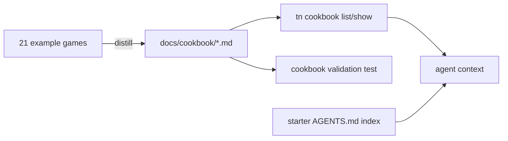
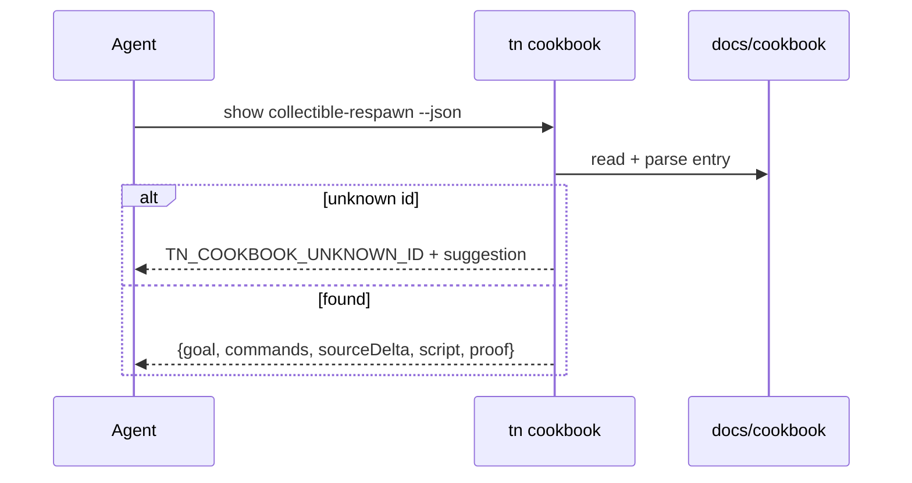

# PRD: Authoring Cookbook (Few-Shot Worked Examples)

`Planning Mode: Principal Architect`
`Complexity: 5 -> MEDIUM mode`

Score basis: +3 touches 10+ files (cookbook entries, CLI command, template
wiring, tests); +2 new module (`docs/cookbook` contract + validation harness).

## 1. Context

**Problem:** Models learn unseen DSLs from few-shot complete examples far
better than from reference docs, but ThreeNative's agent context today is
reference-style (AGENTS.md rules, STATUS.md prose, CLI help) with no
pattern-sized worked examples, so agents re-derive the dialect every session.

**Files Analyzed:**

- `templates/structured-source-starter/AGENTS.md`, `CLAUDE.md`
- `templates/structured-source-starter/content/scenes/arena.scene.json`
- `packages/cli/src/` command registration pattern
- `docs/PRDs/done/game-development-velocity-kits.md` (recipe precedent)
- 21 `examples/*` generated games (source of distilled patterns)

**Current Behavior:**

- Recipes (`tn recipe`) apply operations but do not teach; their plans are
  operation lists, not narrated goal->delta->proof examples.
- Example games are complete but far too large to fit in agent context.
- Starter `AGENTS.md` states rules ("prefer tn ... --json") without showing a
  single complete before/after source delta.

## Pre-Planning Findings

**How will this feature be reached?**

- [x] Entry point identified: `tn cookbook list --json`,
  `tn cookbook show <id> --json`, plus static files under `docs/cookbook/`
  and a compact index embedded in generated starter `AGENTS.md`.
- [x] Caller file identified: `packages/cli/src/index.ts` command
  registration; `tn create` template emission for the AGENTS.md index.
- [x] Registration/wiring needed: CLI command registry, template generator,
  `pnpm check:docs` link coverage.

**Is this user-facing?**

- [x] YES. Consumers are agents (primary) and humans (secondary). UI is the
  CLI JSON surface plus markdown files; no graphical UI required.

**Full user flow:**

1. Agent starts work in a generated project; `AGENTS.md` contains the
   cookbook index (id + one-line goal per entry) and the `tn cookbook show`
   command.
2. Agent runs `tn cookbook show collectible-respawn --json`.
3. Response contains: goal, exact CLI commands or source JSON delta, the
   script file content, the proof command, and the expected proof outcome.
4. Agent adapts the pattern to its scene and runs the stated proof command.

## 2. Solution

**Approach:**

- One cookbook entry = one markdown file with YAML frontmatter (id, goal,
  category, surfaces) and four fenced sections in fixed order: `commands`,
  `source-delta`, `script`, `proof`. Machine-parseable, human-readable.
- Entries are **CI-validated executable documents**: a test harness copies
  `structured-source-starter` to a temp dir, applies each entry's commands
  and script, then runs validate + build. A cookbook entry that stops
  compiling fails CI, so examples can never rot.
- Distill entries from the existing 21 example games; target 16 entries
  across gameplay, camera, physics, UI, and assets.
- Keep entries under ~120 lines each so 3-4 fit in a single agent context
  load alongside the task.

**Key Decisions:**

- [x] Entries live in `docs/cookbook/` (repo docs), shipped with the CLI
  package as data so `tn cookbook` works in generated projects offline.
- [x] Reuse the existing CLI JSON result shape
  (`ok`/`diagnostics`) for `tn cookbook` output.
- [x] Validation harness reuses the temp-project scaffold pattern from
  `verify:template-playability` rather than inventing a new one.
- [x] Error handling: unknown cookbook id returns
  `TN_COOKBOOK_UNKNOWN_ID` with the nearest-match suggestion (prescriptive,
  per PRD-004 style).

**Data Changes:** None.

## 3. Sequence Flow

## 4. Execution Phases

#### Phase 1: Entry format, parser, and first 4 entries - agent can read one validated pattern end to end

**Files (max 5):**

- `docs/cookbook/FORMAT.md` - entry contract.
- `docs/cookbook/collectible-respawn.md` (+3 entries: `player-move-wasd`,
  `follow-camera`, `hud-score-binding`).
- `packages/cli/src/cookbook/parse.ts` - frontmatter/section parser.
- `packages/cli/src/cookbook/parse.test.ts`

**Implementation:**

- [ ] Define and document the four-section format with one canonical example.
- [ ] Write the 4 entries by distilling starter/example patterns; every
  command in them must be a real current `tn` surface.
- [ ] Parser returns a typed entry object; malformed entries produce stable
  diagnostics with file/section paths.

**Tests Required:**
| Test File | Test Name | Assertion |
|-----------|-----------|-----------|
| `packages/cli/src/cookbook/parse.test.ts` | `should parse entry when all four sections present` | typed fields populated |
| `packages/cli/src/cookbook/parse.test.ts` | `should reject entry when proof section missing` | `TN_COOKBOOK_ENTRY_INVALID` with section path |

**User Verification:**

- Action: read `docs/cookbook/collectible-respawn.md`.
- Expected: you could apply it to a fresh starter by copy-paste alone.

#### Phase 2: Executable validation harness - CI proves every entry still compiles

**Files (max 5):**

- `tools/verify/src/cookbookGate.ts` - scaffold temp starter, apply entry
  commands/script, run validate + build per entry.
- `tools/verify/src/cookbookGate.test.ts`
- `package.json` - register `verify:cookbook` focused gate (edit).
- `docs/STATUS.md` - one-paragraph capability note (edit, per repo rule).

**Implementation:**

- [ ] Apply each entry's `commands` block through the real CLI against a
  temp copy of `structured-source-starter`; write `script` files; run
  `tn authoring validate` + build.
- [ ] Negative test: a fixture entry with an invalid operation fails the
  gate with the entry id and failing command in the report.
- [ ] Write report to `tools/verify/artifacts/cookbook/verification-report.json`.

**Tests Required:**
| Test File | Test Name | Assertion |
|-----------|-----------|-----------|
| `tools/verify/src/cookbookGate.test.ts` | `should pass when all entries apply and build` | report `ok: true`, per-entry rows |
| `tools/verify/src/cookbookGate.test.ts` | `should fail with entry id when a command is invalid` | failing entry + command in report |

**Verification Plan:** `pnpm verify:cookbook` locally; evidence is the
report plus per-entry temp build logs.

**User Verification:**

- Action: `pnpm verify:cookbook`
- Expected: pass with 4 entry rows; corrupt one entry command, expect a
  failure naming that entry.

#### Phase 3: tn cookbook command + starter index wiring - agents discover entries without being told

**Files (max 5):**

- `packages/cli/src/commands/cookbook.ts` - `list`/`show` subcommands.
- `packages/cli/src/commands/cookbook.test.ts`
- `packages/cli/src/index.ts` - register command (edit).
- `templates/structured-source-starter/AGENTS.md` - embed cookbook index +
  usage line (edit).
- `packages/cli/package.json` - ship `docs/cookbook` as package data (edit).

**Implementation:**

- [ ] `list` returns id/goal/category rows; `show` returns the parsed entry.
- [ ] Unknown id -> `TN_COOKBOOK_UNKNOWN_ID` + nearest match.
- [ ] Starter AGENTS.md gets a "Worked examples first" section instructing
  agents to check `tn cookbook list` before authoring a new pattern.

**Tests Required:**
| Test File | Test Name | Assertion |
|-----------|-----------|-----------|
| `packages/cli/src/commands/cookbook.test.ts` | `should list all entries when docs present` | count matches entry files |
| `packages/cli/src/commands/cookbook.test.ts` | `should suggest nearest id when id unknown` | suggestion field populated |

**User Verification:**

- Action: `tn cookbook show follow-camera --json` inside a generated project.
- Expected: full entry JSON, no repo checkout required.

#### Phase 4: Scale to 16 entries across all high-value surfaces

**Files:** 12 new entry files under `docs/cookbook/` (content, not code);
`docs/PRDs/agent-ergonomics-2026-07-05/README.md` progress note (edit).

**Implementation:**

- [ ] Add entries for: trigger-zone win, fail/retry reset, kinematic hazard,
  physics knockdown, GLB hero import + animation clip, catalog asset search
  + provenance, materials pass, mobile HUD fit, pause UI state, sound cue,
  scale check, lane-runner spawn pattern.
- [ ] All entries pass `verify:cookbook`.

**Tests Required:** covered by the Phase 2 gate.

**User Verification:**

- Action: `tn cookbook list --json`
- Expected: 16 entries spanning gameplay/camera/physics/UI/assets categories.

## 5. Checkpoint Protocol

Automated checkpoint via `prd-work-reviewer` after each phase. No manual
checkpoint needed (CLI/docs surface; the executable gate is the proof).

## 6. Acceptance Criteria

- [ ] 16 validated entries; `verify:cookbook` green and failing correctly on
  a corrupted fixture.
- [ ] `tn cookbook list/show --json` works inside a generated project.
- [ ] Generated starter AGENTS.md points agents at the cookbook first.
- [ ] `docs/STATUS.md` updated (capability note) per repo rule.
- [ ] `pnpm check:docs` passes with the new docs linked.
