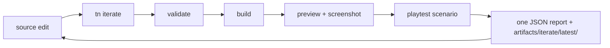
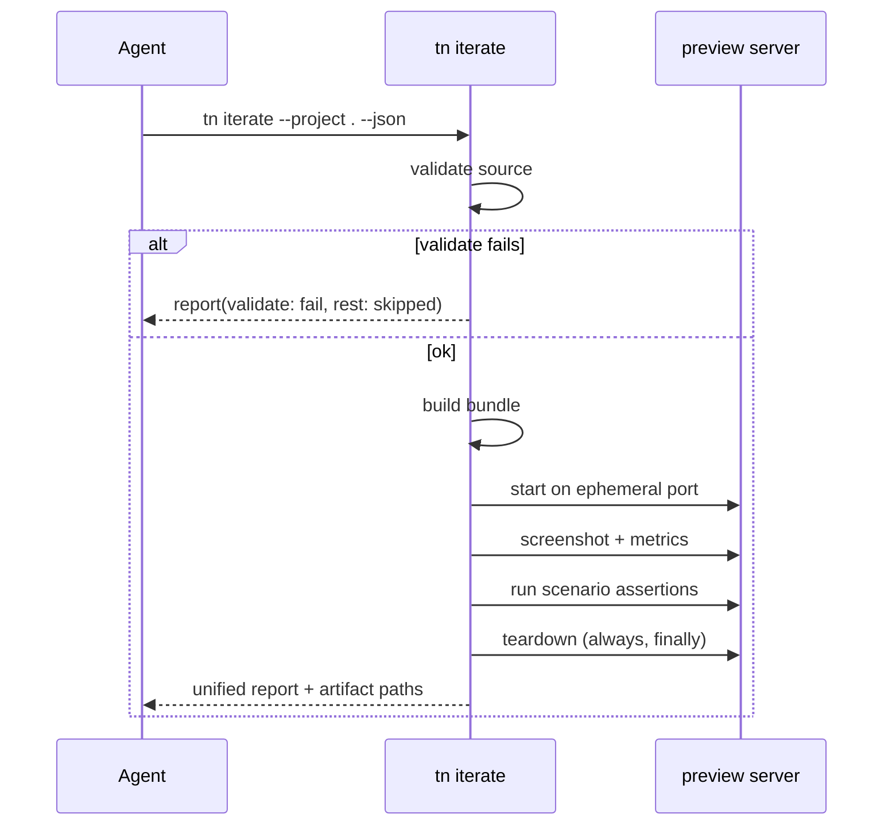

# PRD: Single-Command Iteration Loop (`tn iterate`)

`Planning Mode: Principal Architect`
`Complexity: 4 -> MEDIUM mode`

Score basis: +2 touches 6-10 files; +2 multi-step orchestration state
(preview/server lifecycle across validate/build/screenshot/playtest).

## 1. Context

**Problem:** An agent iteration today requires orchestrating five commands
(validate -> build -> dev/preview -> screenshot -> playtest) with separate
JSON outputs and its own server lifecycle management, making each visual
iteration cost minutes and thousands of tokens.

**Files Analyzed:**

- `packages/cli/src/commands/playtest.ts`
- `packages/cli/src/commands/sceneProof.ts` (existing multi-step composition
  precedent: validate + build + capture in one command)
- `packages/cli/src/commands/gameQaProof.ts` (step orchestration + report)
- `packages/cli/src/commands/playtestArtifacts.ts` (artifact conventions)
- `tn dev` preview state surface (`/__threenative/dev-state.json`)

**Current Behavior:**

- `tn scene proof` already composes validate/build/capture but is
  scene-scoped, requires an external `--web-url`, and does not run playtest
  movement assertions.
- `tn game qa --run-proof` composes many steps but is a heavyweight release
  evidence path, not a fast iteration loop.
- No command owns the full loop with a self-managed preview server.

## Pre-Planning Findings

**How will this feature be reached?**

- [x] Entry point identified: `tn iterate --project <path> [--scenario
  <file>] [--skip-playtest] --json`.
- [x] Caller file identified: `packages/cli/src/index.ts` registration;
  primary consumers are agents (starter AGENTS.md documents it) and the
  cookbook `proof` sections (PRD-002).
- [x] Registration/wiring needed: CLI registry, starter AGENTS.md, cookbook
  proof-command convention.

**Is this user-facing?**

- [x] YES. CLI JSON surface consumed by agents and humans; no graphical UI.

**Full user flow:**

1. Agent edits `content/**` or `src/scripts/**`.
2. Agent runs `tn iterate --project . --json`.
3. Command validates source, builds, boots an ephemeral preview server,
   captures a screenshot with visual metrics, runs the default (or named)
   playtest scenario, tears the server down.
4. Agent receives ONE JSON: per-step status, all diagnostics, screenshot
   path, movement result, and total duration; fixes and reruns.

## 2. Solution

**Approach:**

- Compose existing internals; write no new validation/build/capture logic.
  `tn iterate` is an orchestrator over the same functions used by
  `tn authoring validate`, build, `tn screenshot`, and `tn playtest`.
- Fail fast with full context: if validate fails, skip build/capture but
  still return the unified report shape with later steps marked `skipped`.
- Own the server lifecycle: start a one-shot preview on an ephemeral port,
  always tear down (also on error paths) so repeated agent runs never leak
  processes or ports.
- Artifacts go to `artifacts/iterate/latest/` (overwritten each run) to
  avoid unbounded disk growth during agent loops; `--keep` copies to a
  timestamped sibling.

**Key Decisions:**

- [x] Report schema `threenative.iterate-report` with ordered `steps[]`
  rows (`id`, `status: pass|fail|skipped`, `diagnostics`, `artifacts`,
  `durationMs`) reusing the shared diagnostic shape.
- [x] Default scenario resolution: `--scenario` flag, else first
  `playtests/*.playtest.json`, else `--skip-playtest` semantics with a
  `TN_ITERATE_NO_SCENARIO` info diagnostic (not an error).
- [x] Reuse `sceneProof`'s headless/Xvfb handling for capture.
- [x] Explicitly NOT a release evidence path: iterate artifacts do not
  satisfy `tn game qa` or generated-game gates (prevents proof-loop
  weakening from PRD-001-scenario-ratchet's perspective).

**Data Changes:** None.

## 3. Sequence Flow

## 4. Execution Phases

#### Phase 1: Orchestrator with validate/build steps - unified report exists and fails fast correctly

**Files (max 5):**

- `packages/cli/src/commands/iterate.ts` - command + step runner + report.
- `packages/cli/src/commands/iterate.test.ts`
- `packages/cli/src/index.ts` - register (edit).
- `packages/authoring/src/` report schema addition (edit, wherever
  `threenative.*` report contracts are validated).

**Implementation:**

- [ ] Step-runner utility: ordered steps, fail-fast with `skipped` marking,
  aggregate diagnostics, per-step timing.
- [ ] Wire validate + build steps by calling existing internals directly
  (no subprocess spawning of our own CLI).
- [ ] `--json` output validates against the new report schema.

**Tests Required:**
| Test File | Test Name | Assertion |
|-----------|-----------|-----------|
| `packages/cli/src/commands/iterate.test.ts` | `should mark build and capture skipped when validate fails` | steps: fail, skipped, skipped; exit code 1 |
| `packages/cli/src/commands/iterate.test.ts` | `should pass validate and build when starter project is clean` | both steps pass, report schema-valid |

**User Verification:**

- Action: break `arena.scene.json` in a scratch starter copy, run
  `tn iterate --project . --json`.
- Expected: one JSON with the validate diagnostic and later steps `skipped`.

#### Phase 2: Preview + screenshot + scenario steps with guaranteed teardown - full loop in one command

**Files (max 5):**

- `packages/cli/src/commands/iterate.ts` (edit)
- `packages/cli/src/commands/iteratePreview.ts` - ephemeral server
  lifecycle wrapper over the existing dev/preview internals.
- `packages/cli/src/commands/iterate.test.ts` (edit)
- `packages/cli/src/commands/iteratePreview.test.ts`

**Implementation:**

- [ ] Ephemeral-port preview start with readiness wait; teardown in
  `finally` including SIGINT handling.
- [ ] Screenshot step reuses the `tn screenshot` capture + metric path;
  playtest step reuses scenario execution with default resolution rules.
- [ ] Artifacts written to `artifacts/iterate/latest/` (report, PNG,
  playtest observations); `--keep` copies to timestamped dir.

**Tests Required:**
| Test File | Test Name | Assertion |
|-----------|-----------|-----------|
| `packages/cli/src/commands/iteratePreview.test.ts` | `should free the port when a later step throws` | no listener after run |
| `packages/cli/src/commands/iterate.test.ts` | `should emit TN_ITERATE_NO_SCENARIO info when project has no playtests` | info severity, run still passes |

**Verification Plan:**

1. Unit tests above.
2. Manual proof on `templates/structured-source-starter`: full run passes
   with screenshot + movement result in one JSON; run twice back-to-back to
   prove no port/process leak.
3. Evidence: `artifacts/iterate/latest/` contents attached to checkpoint.

**User Verification:**

- Action: `tn iterate --project templates/structured-source-starter --json`
  twice in a row.
- Expected: both runs complete; second run does not hit a port conflict.

#### Phase 3: Agent-context wiring - agents are told this is THE loop

**Files (max 5):**

- `templates/structured-source-starter/AGENTS.md` (edit)
- `templates/structured-source-starter/package.json` - `iterate` script
  (edit).
- `docs/workflows/playtest-proof.md` - document iterate vs qa/release
  boundary (edit).
- `docs/STATUS.md` - capability note (edit).

**Implementation:**

- [ ] Replace the multi-command "useful loop" in starter instructions with
  `tn iterate` as the default inner loop; keep the full commands listed as
  the underlying steps.
- [ ] State explicitly that iterate artifacts are not release evidence.

**Tests Required:**
| Test File | Test Name | Assertion |
|-----------|-----------|-----------|
| `tools/verify/src/templateProductionGate.test.ts` | `should require iterate script when starter production metadata present` | gate row for `iterate` (edit existing gate) |

**User Verification:**

- Action: `tn create` a fresh project; read its AGENTS.md.
- Expected: iterate loop documented as the first authoring instruction.

## 5. Checkpoint Protocol

Automated checkpoint via `prd-work-reviewer` after each phase. Phase 2 adds
a manual checkpoint (screenshot artifact review) since capture correctness
is visual.

## 6. Acceptance Criteria

- [ ] One command returns validate/build/screenshot/playtest results in a
  single schema-valid JSON with all diagnostics.
- [ ] Fail-fast marks downstream steps `skipped`; exit code reflects worst
  step.
- [ ] No port/process leak across repeated runs (tested).
- [ ] Starter templates document iterate as the default agent loop.
- [ ] `docs/STATUS.md` updated; `pnpm --filter @threenative/cli test` and
  `pnpm verify:template-production` pass.
