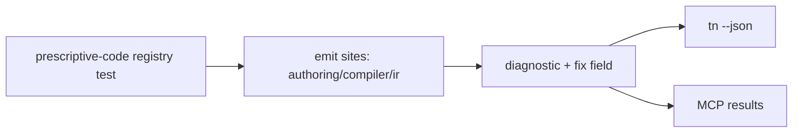
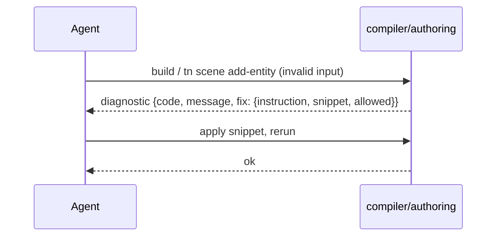

# PRD: Prescriptive Diagnostics (Errors That Contain the Fix)

`Planning Mode: Principal Architect`
`Complexity: 5 -> MEDIUM mode`

Score basis: +3 touches 10+ files (shared diagnostic type, authoring,
compiler, IR emitters, tests); +2 multi-package changes.

## 1. Context

**Problem:** Diagnostics are stable and correctly identify violations
(code/severity/path/message), but they rarely tell the agent what to write
instead, so each rejection costs an extra explore/guess iteration.

**Files Analyzed:**

- shared diagnostic result shape in `@threenative/authoring` (ok/changed/
  filesWritten/diagnostics contract per STATUS.md)
- `packages/compiler/src/` script import rejection
  (`TN_SCRIPT_UNSUPPORTED_IMPORT`,
  `TN_SCRIPT_MODULE_LOCAL_REFERENCE_UNSUPPORTED`)
- `packages/ir/src/` validation diagnostics
  (`TN_PHYSICS_CAPSULE_CENTER_SUSPECT` precedent — it already suggests)
- `docs/contracts/authoring-mcp.md` (diagnostic contract for adapters)

**Current Behavior:**

- Diagnostic shape: `code`, `severity`, `path`, `message`, sometimes a
  suggested fix in prose ("suggested fix where supported" per CLAUDE.md),
  with no structured, machine-consumable fix field.
- The highest-friction rejections for agents (unsupported imports, unknown
  fields, invalid operation payloads, generated-path writes) name the
  violation but not the allowed alternative.

## Pre-Planning Findings

**How will this feature be reached?**

- [x] Entry point identified: every existing `tn ... --json` surface,
  compiler build output, and MCP results — the `fix` field rides the
  existing diagnostics arrays.
- [x] Caller file identified: emit sites in `@threenative/authoring`,
  `@threenative/compiler`, `@threenative/ir`; consumed by agents reading
  CLI/MCP JSON.
- [x] Registration/wiring needed: extend the shared diagnostic type once;
  update the `authoring-mcp.md` contract; no new commands.

**Is this user-facing?**

- [x] YES. Agents and humans read diagnostics in every authoring loop; the
  "UI" is the JSON/text diagnostic rendering that already exists.

**Full user flow:**

1. Agent writes `import * as THREE from "three"` in a script.
2. Build fails with `TN_SCRIPT_UNSUPPORTED_IMPORT` as today, now carrying
   `fix`: a one-line instruction, a correct code snippet, and the allowed
   package list (plus a cookbook id when one exists, per PRD-002).
3. Agent applies the snippet without a docs-exploration round trip.

## 2. Solution

**Approach:**

- Add one optional structured field to the shared diagnostic shape:
  `fix?: { instruction: string; snippet?: string; allowed?: string[];
  cookbook?: string; docs?: string }`. Optional means zero migration cost;
  emitters adopt incrementally.
- Do NOT boil the ocean: identify the top ~15 agent-hit diagnostics and fix
  those first. Selection is evidence-based: grep diagnostic codes emitted in
  the 21 example games' historical QA artifacts and the authoring/compiler
  test fixtures for the most-tested rejection paths.
- Enforce quality with a registry test: every diagnostic code on the
  "prescriptive" list must emit a non-empty `instruction` and, where the fix
  is code-shaped, a `snippet` that itself passes the relevant validator
  (fixes must not be lies).

**Key Decisions:**

- [x] `fix` is additive and optional — existing consumers, tests, and the
  MCP parity contract remain valid without changes.
- [x] Snippets are validated in tests (apply the snippet, assert the
  original diagnostic disappears) for the code-shaped subset.
- [x] Message text stays stable; prescriptive content lives only in `fix`
  so downstream code matching on messages does not break.
- [x] Top-15 list is committed as
  `packages/authoring/src/prescriptiveCodes.ts` so the registry test is
  deterministic.

**Data Changes:** None (additive JSON field on an existing contract; bump
the diagnostic contract doc, not schema versions).

## 3. Sequence Flow

## 4. Execution Phases

#### Phase 1: Contract + registry + first 3 prescriptive codes - the pattern exists end to end

**Files (max 5):**

- `packages/authoring/src/` shared diagnostic type (edit).
- `packages/authoring/src/prescriptiveCodes.ts` - committed top list +
  helper to build `fix` objects consistently.
- `packages/compiler/src/` `TN_SCRIPT_UNSUPPORTED_IMPORT` emit site (edit).
- `packages/authoring/src/` generated-path rejection emit site (edit).
- `packages/authoring/src/prescriptiveCodes.test.ts`

**Implementation:**

- [ ] Extend shared type; render `fix.instruction` in human CLI output under
  the message line.
- [ ] `TN_SCRIPT_UNSUPPORTED_IMPORT` fix: allowed package list + correct
  named-import snippet.
- [ ] Generated-path rejection fix: name the owning durable source document
  to edit instead.
- [ ] Registry test: codes in the list must emit `fix` on their fixture
  trigger.

**Tests Required:**
| Test File | Test Name | Assertion |
|-----------|-----------|-----------|
| `packages/compiler/src/*.test.ts` | `should include allowed packages when rejecting unsupported import` | `fix.allowed` contains `@threenative/script-stdlib` |
| `packages/compiler/src/*.test.ts` | `should clear diagnostic when fix snippet is applied` | rebuild after snippet: no diagnostic |
| `packages/authoring/src/prescriptiveCodes.test.ts` | `should fail when a registered code emits no fix` | registry enforcement |

**User Verification:**

- Action: add `import * as THREE from "three"` to a starter script, build.
- Expected: error output includes "use: `import { Vec3 } from
  '@threenative/script-stdlib'` — allowed packages: [...]".

#### Phase 2: Select and convert the remaining top-15 codes - highest-friction rejections all prescriptive

**Files (max 5 per sub-batch; run as two sub-batches):**

- Batch A: authoring operation payload validation, unknown scene field,
  missing script export, duplicate stable ID, invalid transform vector.
- Batch B: unsupported component payloads, material reference misses,
  playtest scenario schema errors, `TN_SCRIPT_MODULE_LOCAL_REFERENCE_
  UNSUPPORTED`, capability/unsupported-API rejections.
- `packages/authoring/src/prescriptiveCodes.ts` (edit per batch).

**Implementation:**

- [ ] Evidence step first: enumerate candidate codes from example-game QA
  artifacts and test fixtures; commit the ranked list into the registry
  file with a comment noting the selection evidence.
- [ ] Convert each code with instruction + snippet/allowed/cookbook fields;
  wire cookbook ids where PRD-002 entries exist.

**Tests Required:**
| Test File | Test Name | Assertion |
|-----------|-----------|-----------|
| per emit-site test files | `should include fix when <code> triggers` | one per converted code |
| `packages/authoring/src/prescriptiveCodes.test.ts` | `should cover all registered codes when registry grows` | registry stays enforced |

**User Verification:**

- Action: trigger three converted diagnostics from a scratch project.
- Expected: each names the correction, not just the violation.

#### Phase 3: Contract doc + MCP parity - adapters expose the same fixes

**Files (max 5):**

- `docs/contracts/authoring-mcp.md` (edit)
- `packages/mcp-server/src/*.test.ts` - parity test includes `fix` (edit).
- `docs/STATUS.md` - capability note (edit).

**Implementation:**

- [ ] Document the `fix` field, its optionality, and the snippet-validity
  rule in the adapter contract.
- [ ] Extend the existing MCP/CLI parity tests to assert `fix` passes
  through unchanged.

**Tests Required:**
| Test File | Test Name | Assertion |
|-----------|-----------|-----------|
| `packages/mcp-server/src/*.test.ts` | `should return identical fix objects when MCP and CLI reject same input` | deep-equal parity |

**User Verification:**

- Action: trigger a prescriptive diagnostic through the MCP server.
- Expected: same `fix` payload as the CLI.

## 5. Checkpoint Protocol

Automated checkpoint via `prd-work-reviewer` after each phase. No manual
checkpoints (pure contract/API surface with test-verifiable behavior).

## 6. Acceptance Criteria

- [ ] Shared diagnostic shape carries optional structured `fix`; zero
  breakage in existing consumers (full `pnpm test` green).
- [ ] Top-15 registry committed with selection evidence; registry test
  enforces fix presence and snippet validity.
- [ ] MCP parity includes `fix`.
- [ ] `docs/STATUS.md` and `docs/contracts/authoring-mcp.md` updated.
