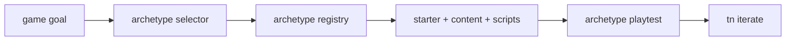
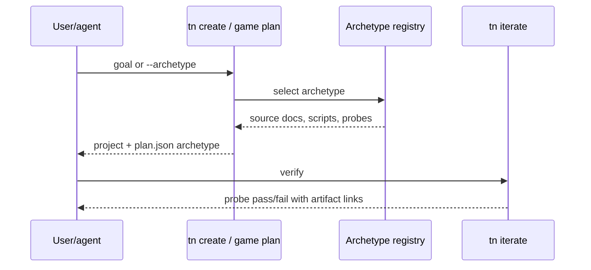

# PRD: Archetype Scaffolds

`Planning Mode: Principal Architect`
`Complexity: 8 -> HIGH mode`

Score basis: +3 touches 10+ files across CLI, templates, scripts, playtests,
docs, and verification; +2 multi-package changes; +2 new scaffold system;
+1 release-gate impact.

## 1. Context

**Problem:** The starter is implicitly top-down, forcing agents to hand-author
camera rigs, controllers, input maps, and physics profiles for other common
game types.

**Files Analyzed:**

- `docs/PRDs/engine-improvement-candidates-2026-07-07.md`
- `CHALLENGES.md`
- `tools/agent-benchmark/TOKEN-COST-DIRECTION.md`
- `templates/structured-source-starter/`
- `packages/cli/src/commands/game.ts`
- `docs/PRDs/done/agent-ergonomics-2026-07-05/`

**Current Behavior:**

- `tn game plan --apply --json` can produce scaffold-first output for
  prompt-matched recipes.
- L1 archetype concepts are fused into whole-game recipes.
- Common perspectives like third-person, first-person, side-scroller, and
  racing do not have first-class scaffold names.
- Agents spend authored-delta tokens on boilerplate that should be selected
  from game type vocabulary.

## Pre-Planning Findings

**How will this feature be reached?**

- [x] Entry point identified: `tn create <name> --archetype ...` and
  `tn game plan --goal ... --apply --json`.
- [x] Caller file identified: CLI create/game-plan command wiring and starter
  template generation code.
- [x] Registration/wiring needed: archetype registry, template emit path,
  plan selection, playtest probes, API card docs, CI ratchet entries.

**Is this user-facing?**

- [x] YES. Users select archetypes directly or receive them from game-plan
  goal analysis.
- [ ] NO.

**Full user flow:**

1. User runs `tn create racer --archetype racing --json` or asks
   `tn game plan` for a racing goal.
2. CLI emits L0 starter plus L1 rig/controller/input/physics/look profile.
3. User runs `tn iterate --project racer --json`.
4. The archetype-specific probe passes with zero manual edits.

## 2. Solution

**Approach:**

- Add an archetype registry for 4-6 common game types:
  `top-down`, `third-person`, `first-person`, `side-scroller`, `racing`.
- Each archetype owns camera rig, controller script, input map, physics
  profile, default look profile, and one or more probes.
- Teach `tn game plan` to select and report the archetype from goal text.
- Keep mechanics out of archetypes; mechanics belong to PRD-003 blocks.
- Document each archetype with one screenshot, controls, and probe list.

**Key Decisions:**

- [x] Archetypes are L1 only: perspective, control, physics profile, and proof.
- [x] Web-first proof is enough here; native proof waits for PRD-011 policy.
- [x] Existing recipes must be decomposable into archetype plus PRD-003 blocks.

**Data Changes:** New template/archetype content and scripts; no IR schema
change unless existing contracts cannot express a required rig.

## 3. Sequence Flow

## 4. Execution Phases

#### Phase 1: Registry And Top-Down Baseline - Existing top-down behavior is named explicitly.

**Files (max 5):**

- `packages/cli/src/commands/game.ts` - select/report `top-down`.
- `packages/cli/src/commands/game.test.ts` - plan output coverage.
- `templates/structured-source-starter/` - baseline archetype metadata.
- `docs/API-CARD.md` or starter API card source - top-down entry.

**Implementation:**

- [ ] Introduce an archetype registry using existing scaffold helpers.
- [ ] Preserve current top-down recipe behavior while reporting L1 selection.
- [ ] Add `plan.json.archetype` and compact CLI output.

**Tests Required:**

| Test File | Test Name | Assertion |
|-----------|-----------|-----------|
| `packages/cli/src/commands/game.test.ts` | `should report top-down archetype for collector goals` | plan JSON contains `archetype: "top-down"` |

**User Verification:**

- Action: `tn game plan --goal "top-down collector" --project . --json`.
- Expected: JSON names `top-down` without requiring any source edits.

#### Phase 2: First-Person And Third-Person Scaffolds - Perspective-heavy prompts start from the right rig.

**Files (max 5):**

- `packages/cli/src/archetypes/*.ts` - first-person and third-person entries.
- `templates/structured-source-starter/src/scripts/*.ts` - controller scripts.
- `templates/structured-source-starter/content/**/*.json` - rig content.
- `packages/cli/src/commands/create.test.ts` - create tests.
- `packages/cli/src/commands/game.test.ts` - goal-selection tests.

**Implementation:**

- [ ] Add first-person look/move controller with look probe.
- [ ] Add third-person chase camera/controller with follow probe.
- [ ] Ensure IDs and scripts are stable and starter-visible.

**Tests Required:**

| Test File | Test Name | Assertion |
|-----------|-----------|-----------|
| `packages/cli/src/commands/create.test.ts` | `should create first-person scaffold with look probe` | emitted project includes probe and controller script |
| `packages/cli/src/commands/game.test.ts` | `should choose third-person for chase-camera goals` | plan JSON names `third-person` |

**User Verification:**

- Action: create each archetype and run `tn iterate --json`.
- Expected: probes pass with zero manual edits.

#### Phase 3: Side-Scroller And Racing Scaffolds - Physics-profile archetypes prove movement constraints.

**Files (max 5):**

- `packages/cli/src/archetypes/*.ts` - side-scroller and racing entries.
- `templates/structured-source-starter/src/scripts/*.ts` - jump/racing
  controller scripts.
- `templates/structured-source-starter/playtests/*.playtest.json` - probes.
- `packages/cli/src/commands/create.test.ts` - scaffold tests.
- `tools/verify/src/*` - archetype CI ratchet hook if needed.

**Implementation:**

- [ ] Add side-scroller gravity/jump profile and jump probe.
- [ ] Add racing throttle/steer profile and lap or checkpoint probe.
- [ ] Keep mechanics like scoring/checkpoints in PRD-003 blocks.

**Tests Required:**

| Test File | Test Name | Assertion |
|-----------|-----------|-----------|
| `packages/cli/src/commands/create.test.ts` | `should create side-scroller scaffold with jump probe` | probe references stable player id |
| `packages/cli/src/commands/create.test.ts` | `should create racing scaffold with throttle probe` | controller and input map are emitted |

**User Verification:**

- Action: create `--archetype side-scroller` and `--archetype racing`.
- Expected: `tn iterate --json` passes each default probe.

#### Phase 4: Docs And CI Ratchet - Archetypes stay playable.

**Files (max 5):**

- `docs/API-CARD.md` or generator source - archetype cards.
- `tools/verify/src/*` - deterministic archetype scaffold gate.
- `tools/verify/src/*.test.ts` - gate tests.
- `docs/STATUS.md` - index entry.
- `docs/status/capabilities/*.md` - capability evidence.

**Implementation:**

- [ ] Add screenshot/probe docs for each archetype.
- [ ] Add deterministic CI replay for each archetype.
- [ ] Update status docs and evidence links.

**Tests Required:**

| Test File | Test Name | Assertion |
|-----------|-----------|-----------|
| `tools/verify/src/*.test.ts` | `should reject archetype scaffold without passing probe` | gate fails with stable diagnostic |

**User Verification:**

- Action: run the archetype verify gate.
- Expected: every archetype creates and verifies without manual edits.

## 5. Checkpoint Protocol

- Automated review after every phase.
- Manual screenshot review for phases 2-4 because perspective and framing are
  visual user-facing outcomes.

## 6. Verification Strategy

- CLI unit tests for selection and project emission.
- `tn iterate --json` on each archetype scaffold.
- Verify gate replay for all archetypes.
- Screenshot evidence linked from status docs.

## 7. Acceptance Criteria

- [ ] At least five archetypes are selectable by CLI and game-plan goal.
- [ ] Each archetype emits controls, scripts, content, look profile, and probe.
- [ ] Each probe passes from a fresh scaffold with zero edits.
- [ ] API card documents each archetype compactly.
- [ ] CI fails if an archetype needs manual repair.

