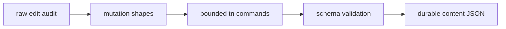
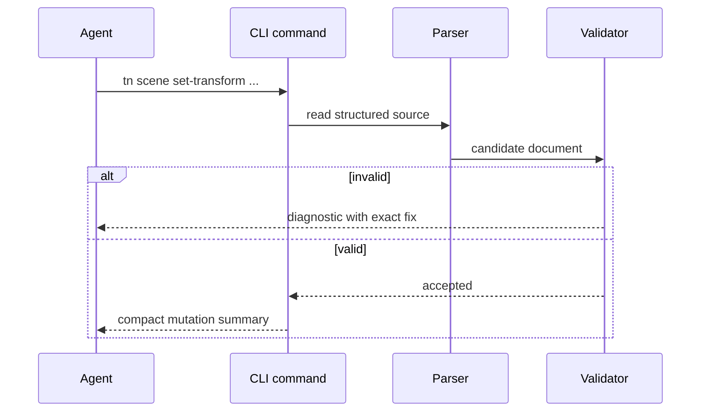

# PRD: Schema-Aware Mutation Surface

`Planning Mode: Principal Architect`
`Complexity: 6 -> MEDIUM mode`

Score basis: +2 touches 6-10 files, +2 multi-package CLI/schema validation,
+1 transcript audit, +1 diagnostics/status impact.

## 1. Context

**Problem:** Agents hand-edit `content/**` JSON when CLI coverage is missing,
breaking schema invariants and paying diagnose-repair costs.

**Files Analyzed:**

- `docs/PRDs/engine-improvement-candidates-2026-07-07.md`
- `CHALLENGES.md`
- `tools/agent-benchmark/TOKEN-COST-DIRECTION.md`
- `packages/cli/src/commands/`
- `packages/ir/src/`
- `content/**/*.json` conventions in templates/examples

**Current Behavior:**

- Repo policy already prefers bounded `tn ... --json` edits.
- CLI mutation coverage does not cover every transcript edit shape.
- Raw JSON edits are still visible in benchmark sessions.
- Validation exists, but some mutation paths are not command-addressable.

## Pre-Planning Findings

**How will this feature be reached?**

- [x] Entry point identified: bounded commands such as `tn scene set-transform`,
  `tn ui bind`, `tn prefab set-material`.
- [x] Caller file identified: CLI command router and IR/source validators.
- [x] Registration/wiring needed: command audit list, schema-aware writers,
  prescriptive diagnostics, starter instruction update.

**Is this user-facing?**

- [x] YES. Agents use commands instead of hand editing JSON.
- [ ] NO.

**Full user flow:**

1. Agent needs to move an entity, bind UI text, or change material.
2. Agent runs a bounded `tn` mutation command with `--json`.
3. CLI validates the full document before writing.
4. Agent receives a compact success summary or literal fix diagnostic.

## 2. Solution

**Approach:**

- Audit benchmark transcripts for every raw edit to `content/**`.
- Group edits into command shapes; only implement evidenced shapes.
- Use existing schema parse/serialize utilities instead of string patching.
- Validate before write and fail with prescriptive diagnostics.
- Update starter instructions to make raw JSON edits an explicit last resort.

**Key Decisions:**

- [x] No generic schemaless JSON-path setter.
- [x] Commands are added only when transcript evidence justifies them.
- [x] Writers preserve schema/version fields and stable ids.

**Data Changes:** Structured source documents are mutated through CLI writers;
no schema migrations expected.

## 3. Sequence Flow

## 4. Execution Phases

#### Phase 1: Raw Edit Audit - Command list is evidence-driven.

**Files (max 5):**

- `tools/agent-benchmark/MUTATION-SURFACE-AUDIT-2026-07-XX.md` - transcript
  edit inventory.
- `tools/verify/artifacts/agent-benchmark/*` - source transcripts.

**Implementation:**

- [ ] Inspect pilot, rerun, and off-recipe transcripts.
- [ ] List every raw `content/**` edit and desired command shape.
- [ ] Rank by frequency and repair cost.

**Tests Required:**

| Test File | Test Name | Assertion |
|-----------|-----------|-----------|
| audit review | `should map every content edit to a command or explicit deferral` | no raw edit shape is unclassified |

**User Verification:**

- Action: read the audit table.
- Expected: every proposed command links to transcript evidence.

#### Phase 2: Scene And Prefab Mutations - Common transform/material edits avoid raw JSON.

**Files (max 5):**

- `packages/cli/src/commands/scene.ts` - transform mutation.
- `packages/cli/src/commands/prefab.ts` - material mutation.
- `packages/cli/src/commands/*.test.ts` - mutation coverage.
- `packages/cli/src/sourceWriters/*.ts` - shared structured writer.

**Implementation:**

- [ ] Add transform setters for position/rotation/scale.
- [ ] Add prefab material assignment by stable id.
- [ ] Validate and serialize through structured APIs.

**Tests Required:**

| Test File | Test Name | Assertion |
|-----------|-----------|-----------|
| `packages/cli/src/commands/scene.test.ts` | `should set transform without changing stable ids` | only transform fields change |
| `packages/cli/src/commands/prefab.test.ts` | `should reject unknown material with exact fix` | diagnostic names valid material ids |

**User Verification:**

- Action: run transform/material commands on a starter project.
- Expected: `tn authoring validate --json` passes after each command.

#### Phase 3: UI Binding Mutations - HUD edits are command-addressable.

**Files (max 5):**

- `packages/cli/src/commands/ui.ts` - binding command.
- `packages/cli/src/commands/ui.test.ts` - binding tests.
- `packages/cli/src/sourceWriters/*.ts` - shared helpers if needed.
- `docs/API-CARD.md` or generator source - command docs.

**Implementation:**

- [ ] Add `tn ui bind <node> --resource <path> --json` or audited variant.
- [ ] Validate node/resource existence before write.
- [ ] Emit compact before/after binding summary.

**Tests Required:**

| Test File | Test Name | Assertion |
|-----------|-----------|-----------|
| `packages/cli/src/commands/ui.test.ts` | `should bind HUD text to resource path` | UI source validates after write |
| `packages/cli/src/commands/ui.test.ts` | `should explain missing node fix` | diagnostic names available node ids |

**User Verification:**

- Action: bind score text in a generated project.
- Expected: playtest sees updated HUD without manual JSON edit.

#### Phase 4: Instructions And Benchmark Ratchet - Future sessions stop raw content edits.

**Files (max 5):**

- `templates/structured-source-starter/AGENTS.md`
- `templates/structured-source-starter/CLAUDE.md`
- `docs/cookbook/*` or cookbook index when present.
- `tools/verify/src/*` - transcript/gate check if practical.
- `docs/status/capabilities/*.md`

**Implementation:**

- [ ] Document command-first mutation policy in starter instructions.
- [ ] Add examples to cookbook/API card.
- [ ] Add a benchmark post-run check for raw `content/**` edits when feasible.

**Tests Required:**

| Test File | Test Name | Assertion |
|-----------|-----------|-----------|
| `tools/verify/src/*.test.ts` | `should flag raw content edits in benchmark transcript` | diagnostic points to matching command |

**User Verification:**

- Action: run a benchmark-style edit session.
- Expected: transcript uses `tn` mutations instead of raw `content/**` edits.

## 5. Checkpoint Protocol

- Automated checkpoint after each phase.
- No manual checkpoint unless command UX output becomes visually significant.

## 6. Verification Strategy

- Command unit tests.
- Full document validation after every write.
- Transcript ratchet in future benchmark rounds.
- `pnpm verify:cookbook` if cookbook examples change.

## 7. Acceptance Criteria

- [ ] Audit maps every observed raw content edit to command or deferral.
- [ ] Highest-frequency transform/material/UI edits have bounded commands.
- [ ] Commands validate before writing and preserve stable ids.
- [ ] Starter instructions advertise command-first editing.
- [ ] Next benchmark round has zero raw `content/**` Edit calls.

