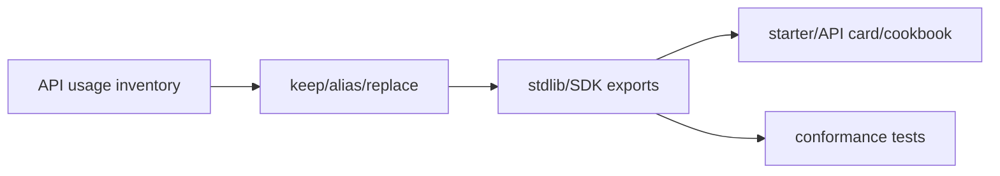
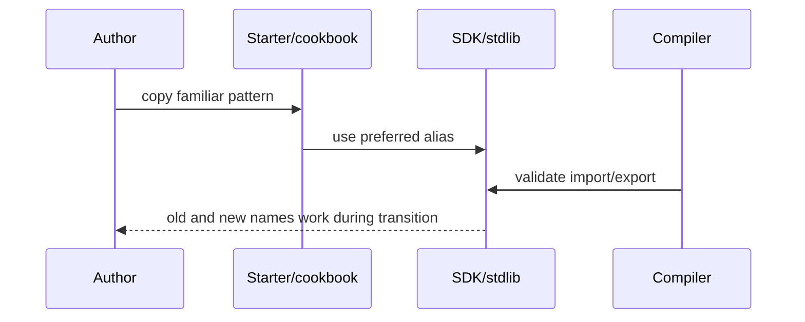

# PRD: API Pruning To In-Distribution Shapes

`Planning Mode: Principal Architect`
`Complexity: 7 -> HIGH mode`

Score basis: +3 touches 10+ files across stdlib, SDK, docs, examples, tests;
+2 multi-package API changes; +1 deprecation/migration behavior; +1
conformance impact.

## 1. Context

**Problem:** Bespoke API idioms cost context and invite mistakes where
Unity-like or Three.js-familiar names would transfer for free.

**Files Analyzed:**

- `docs/PRDs/engine-improvement-candidates-2026-07-07.md`
- `CHALLENGES.md`
- `packages/sdk/`
- `packages/compiler/`
- `packages/cli/`
- `templates/structured-source-starter/`

**Current Behavior:**

- Starter scripts use project-specific idioms like `axis1`, `positionOr`,
  `fixedDelta({ fallback, max, min })`, and deterministic math helpers.
- Some names are load-bearing, but others can have boring aliases.
- Existing names must keep working for at least one cycle.

## Pre-Planning Findings

**How will this feature be reached?**

- [x] Entry point identified: script stdlib/SDK exports and starter/cookbook
  usage.
- [x] Caller file identified: public package exports, compiler import checks,
  templates, examples.
- [x] Registration/wiring needed: transcript API inventory, alias exports,
  deprecation diagnostics, docs/cookbook migration.

**Is this user-facing?**

- [x] YES. Authors use the public API and starter scripts.
- [ ] NO.

**Full user flow:**

1. Author follows starter/cookbook using familiar API names.
2. Old names still work but can warn or document deprecation.
3. Compiler and diagnostics accept both names during transition.
4. Future benchmark transcripts show dialect-confusion failures disappear.

## 2. Solution

**Approach:**

- Inventory every exported stdlib/SDK shape used in benchmark transcripts.
- Classify each as keep, alias, or replace.
- Add boring aliases where semantics match Unity/Three vocabulary.
- Update starter scripts, API card, cookbook entries, and diagnostics to prefer
  the boring names.
- Keep old names working one cycle with explicit deprecation notes.

**Key Decisions:**

- [x] No IR or content-schema renames in this PRD.
- [x] Aliases only when semantics genuinely match familiar vocabulary.
- [x] Existing authored projects remain compatible.

**Data Changes:** Public API aliases and documentation; no schema migration.

## 3. Sequence Flow

## 4. Execution Phases

#### Phase 1: API Shape Inventory - Changes are evidence-based.

**Files (max 5):**

- `tools/agent-benchmark/API-SHAPE-AUDIT-2026-07-XX.md`
- `tools/verify/artifacts/agent-benchmark/*` - transcript evidence.
- `packages/*/src/index.ts` - export inventory references.

**Implementation:**

- [ ] Inventory exported shapes touched by benchmark agents.
- [ ] Classify keep/alias/replace.
- [ ] Record compatibility and migration risk.

**Tests Required:**

| Test File | Test Name | Assertion |
|-----------|-----------|-----------|
| audit review | `should classify every benchmark-touched API shape` | no touched export is unclassified |

**User Verification:**

- Action: inspect audit.
- Expected: every proposed alias links to transcript evidence and rationale.

#### Phase 2: Low-Risk Aliases - Familiar names are available without breaking old projects.

**Files (max 5):**

- `packages/sdk/src/*`
- `packages/script-stdlib/src/*` if package exists.
- `packages/compiler/src/*import*.ts`
- `packages/*/src/*.test.ts`
- `packages/*/package.json` only if exports change.

**Implementation:**

- [ ] Add aliases for the first low-risk set.
- [ ] Update import allowlists.
- [ ] Add tests proving old and new names behave identically.

**Tests Required:**

| Test File | Test Name | Assertion |
|-----------|-----------|-----------|
| package tests | `should expose boring alias with same behavior as legacy helper` | old/new outputs match |
| compiler tests | `should allow preferred named import` | compiler accepts new name |

**User Verification:**

- Action: use new alias in a starter script and build.
- Expected: script compiles and behavior matches legacy helper.

#### Phase 3: Starter/Cookbook Migration - First-touch docs teach preferred names.

**Files (max 5):**

- `templates/structured-source-starter/src/scripts/*.ts`
- `templates/structured-source-starter/AGENTS.md`
- `docs/API-CARD.md` or generator source.
- `docs/cookbook/patterns/*.json`
- `docs/cookbook/index.json`

**Implementation:**

- [ ] Update starter scripts to preferred names.
- [ ] Update cookbook/API card examples.
- [ ] Keep deprecation notes compact.

**Tests Required:**

| Test File | Test Name | Assertion |
|-----------|-----------|-----------|
| template tests | `should build starter script with preferred API names` | starter compiles |
| cookbook verifier | `should validate entries after API migration` | `pnpm verify:cookbook` passes |

**User Verification:**

- Action: create fresh starter and inspect script.
- Expected: script reads with familiar preferred names.

#### Phase 4: Deprecation And Benchmark Check - Dialect confusion becomes measurable.

**Files (max 5):**

- `packages/compiler/src/*diagnostic*.ts`
- `packages/compiler/src/*.test.ts`
- `tools/agent-benchmark/*` - dialect-confusion analysis.
- `docs/status/capabilities/*.md`
- `docs/STATUS.md`

**Implementation:**

- [ ] Add non-breaking deprecation diagnostics or docs for old names.
- [ ] Add benchmark transcript classifier for dialect-confusion failures.
- [ ] Update status docs with migration/evidence.

**Tests Required:**

| Test File | Test Name | Assertion |
|-----------|-----------|-----------|
| compiler tests | `should keep legacy helper working during deprecation cycle` | no hard failure |
| benchmark analysis | `should count dialect-confusion failures` | report includes metric |

**User Verification:**

- Action: run old and new starter scripts.
- Expected: both work; docs steer new authors to preferred names.

## 5. Checkpoint Protocol

- Automated checkpoint after every phase.
- Manual API review after phase 1 and phase 3 for naming quality.

## 6. Verification Strategy

- Package unit tests for aliases.
- Compiler import tests.
- Template build tests.
- `pnpm verify:conformance` for shared contracts.
- `pnpm verify:cookbook` after examples change.

## 7. Acceptance Criteria

- [ ] Every benchmark-touched public shape is classified.
- [ ] Preferred aliases exist for evidenced low-risk bespoke names.
- [ ] Starter/API card/cookbook prefer in-distribution names.
- [ ] Legacy names remain working for one cycle.
- [ ] Benchmark transcripts stop showing dialect-confusion failures for
  migrated shapes.

