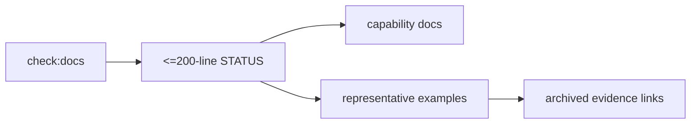
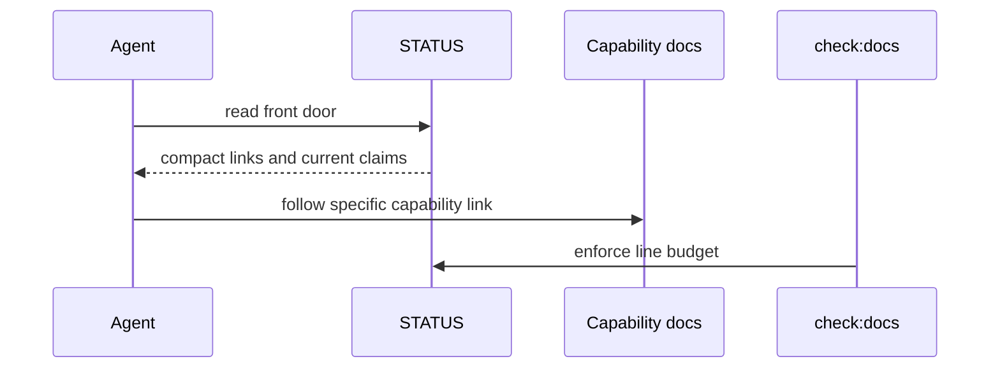

# PRD: Meta-Layer Compression

`Planning Mode: Principal Architect`
`Complexity: 5 -> MEDIUM mode`

Score basis: +2 touches 6-10 docs/verify files, +1 release-gate behavior,
+1 docs automation, +1 status/capability impact.

## 1. Context

**Problem:** `docs/STATUS.md` is too large to serve as a context-window front
door, and generated-game evidence volume has become standing maintenance cost.

**Files Analyzed:**

- `docs/PRDs/engine-improvement-candidates-2026-07-07.md`
- `CHALLENGES.md`
- `docs/STATUS.md`
- `docs/status/capabilities/*.md`
- `tools/verify/src/`
- `examples/`

**Current Behavior:**

- `docs/STATUS.md` is thousands of lines and no longer compact.
- Capability details already have per-capability files.
- Generated-game gates include many examples, increasing evidence upkeep.

## Pre-Planning Findings

**How will this feature be reached?**

- [x] Entry point identified: `docs/STATUS.md`, `pnpm check:docs`, and
  generated-game release gate.
- [x] Caller file identified: docs checker and verify-tools gate.
- [x] Registration/wiring needed: STATUS line budget, representative example
  allowlist, archive links, docs index updates.

**Is this user-facing?**

- [x] YES. Agents and maintainers use STATUS as the front door.
- [ ] NO.

**Full user flow:**

1. Agent opens `docs/STATUS.md`.
2. It sees a <= 200-line index with links to capability detail pages.
3. Release gate checks 3-5 representative generated examples.
4. Archived examples remain accessible without standing full-evidence cost.

## 2. Solution

**Approach:**

- Rewrite `docs/STATUS.md` as a compact index into capability docs.
- Enforce a <= 200-line STATUS budget in `pnpm check:docs`.
- Select 3-5 representative generated examples for full release gate.
- Archive or downgrade the rest to non-blocking evidence references.
- Preserve discoverability through links, not duplicated status prose.

**Key Decisions:**

- [x] STATUS is an index, not the evidence store.
- [x] Representative examples stay release-gated; archived examples stay
  linkable.
- [x] Line budget is enforced automatically.

**Data Changes:** Docs structure and release-gate example set.

## 3. Sequence Flow

## 4. Execution Phases

#### Phase 1: STATUS Index Rewrite - The front door fits in context.

**Files (max 5):**

- `docs/STATUS.md`
- `docs/status/capabilities/*.md` - fill any missing detail moved from STATUS.
- `docs/status/README.md` if needed.

**Implementation:**

- [ ] Move duplicated detail from STATUS to capability pages.
- [ ] Keep STATUS to current claim, link, owner/evidence pointer.
- [ ] Stay under 200 lines.

**Tests Required:**

| Test File | Test Name | Assertion |
|-----------|-----------|-----------|
| docs check | `should keep STATUS links valid` | `pnpm check:docs` passes |

**User Verification:**

- Action: `wc -l docs/STATUS.md`.
- Expected: line count is <= 200.

#### Phase 2: Line-Budget Enforcement - STATUS cannot regrow unnoticed.

**Files (max 5):**

- `tools/verify/src/docs*.ts`
- `tools/verify/src/docs*.test.ts`
- `package.json` if `check:docs` script changes.

**Implementation:**

- [ ] Add STATUS line-budget check to docs verifier.
- [ ] Emit diagnostic pointing to capability docs when over budget.
- [ ] Add passing/failing tests.

**Tests Required:**

| Test File | Test Name | Assertion |
|-----------|-----------|-----------|
| `tools/verify/src/docs*.test.ts` | `should fail when STATUS exceeds 200 lines` | diagnostic names line budget |
| `tools/verify/src/docs*.test.ts` | `should pass compact STATUS` | no diagnostic |

**User Verification:**

- Action: run `pnpm check:docs`.
- Expected: docs pass and budget check is included.

#### Phase 3: Representative Example Gate - Evidence volume matches maintenance value.

**Files (max 5):**

- `tools/verify/src/gameProductionGate*.ts`
- `tools/verify/src/gameProductionGate*.test.ts`
- `examples/README.md` or generated examples index.
- `docs/status/capabilities/*.md`
- `docs/STATUS.md`

**Implementation:**

- [ ] Pick 3-5 representative generated examples.
- [ ] Gate only representative set for full release evidence.
- [ ] Archive/downgrade remaining examples with links and rationale.

**Tests Required:**

| Test File | Test Name | Assertion |
|-----------|-----------|-----------|
| `tools/verify/src/gameProductionGate*.test.ts` | `should gate only representative generated examples` | non-representative archived examples do not block |

**User Verification:**

- Action: run generated-game gate.
- Expected: report lists representative set and archived count.

## 5. Checkpoint Protocol

- Automated checkpoint after each phase.
- Manual review after phase 1 to confirm STATUS remains useful.

## 6. Verification Strategy

- `pnpm check:docs`.
- Docs verifier unit tests.
- Generated-game gate tests.
- Link validation for archived examples.

## 7. Acceptance Criteria

- [ ] `docs/STATUS.md` is <= 200 lines.
- [ ] `pnpm check:docs` enforces the line budget.
- [ ] Full generated-game gate covers 3-5 representative examples.
- [ ] Other examples are archived/downgraded with discoverable links.
- [ ] No capability evidence is lost; it moves behind links.

