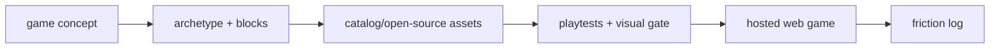
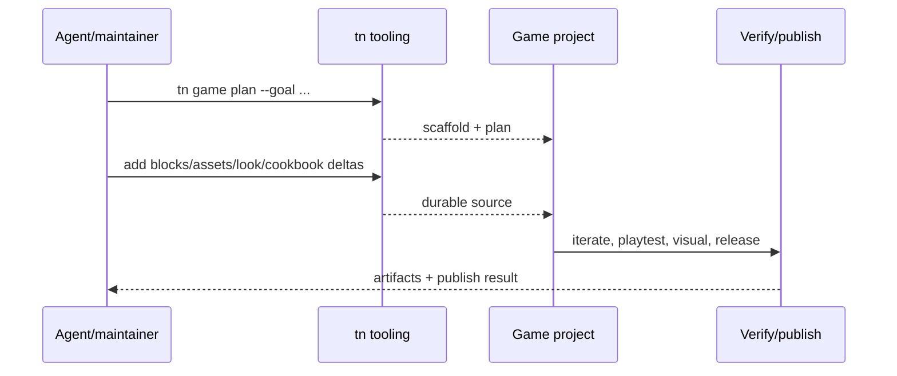

# PRD: Ship One Genuinely Good Game

`Planning Mode: Principal Architect`
`Complexity: 8 -> HIGH mode`

Score basis: +3 touches 10+ files across example game, assets, scripts,
playtests, packaging, docs, and status; +2 new polished game system; +2
multi-package proof/publish path; +1 release/public evidence impact.

## 1. Context

**Problem:** The stack has many proof slices but no shipped game that tests
whether the agent-native authoring loop produces a game a stranger would
actually play for five minutes.

**Files Analyzed:**

- `docs/PRDs/engine-improvement-candidates-2026-07-07.md`
- `CHALLENGES.md`
- `docs/workflows/open-source-3d-asset-kits.md`
- `examples/`
- `packages/cli/src/commands/game.ts`
- `tools/verify/src/`

**Current Behavior:**

- Examples and benchmarks prove individual loops but hide integration gaps.
- Recipes can scaffold simple games, but quality ceiling remains uncertain.
- The friction log from building a real game is not yet feeding the PRD loop.

## Pre-Planning Findings

**How will this feature be reached?**

- [x] Entry point identified: example game project, `tn game plan`,
  archetype/block/cookbook/look commands, `tn iterate`, release/publish path.
- [x] Caller file identified: CLI authoring workflow, example verification
  gates, package/publish scripts.
- [x] Registration/wiring needed: game concept plan, asset sourcing, playable
  loop, proof scenarios, friction log, hosting/package evidence.

**Is this user-facing?**

- [x] YES. The deliverable is a playable public web-first game.
- [ ] NO.

**Full user flow:**

1. Player opens hosted game.
2. Player sees a polished first screen, starts play immediately, learns
   controls in context, and experiences progression/fail/retry feedback.
3. Game logs no unsupported API or proof failures.
4. Friction discovered during production becomes issues against earlier PRDs.

## 2. Solution

**Approach:**

- Pick one concept above benchmark complexity but still scoped for a short
  production cycle.
- Build agent-first using PRD-002 archetypes, PRD-003 blocks, PRD-006
  cookbook, and PRD-007 look profiles.
- Source hero/environment/reward assets from the catalog or open-source packs.
- Keep web-first; package with PRD-011 webview path only if landed.
- Maintain a friction log that maps every engine/authoring pain to a follow-up
  PRD or explicit non-goal.

**Key Decisions:**

- [x] Engine features are not invented unless the friction log justifies them.
- [x] Real assets are required for hero, obstacle/enemy, reward, and dominant
  environment surfaces.
- [x] Publishable fun beats parity breadth.

**Data Changes:** New example game, assets, playtests, artifacts, hosted
release notes.

## 3. Sequence Flow

## 4. Execution Phases

#### Phase 1: Game Brief And Production Plan - Scope is playable before source changes.

**Files (max 5):**

- `examples/<game>/PLAN.md`
- `examples/<game>/FRICTION.md`
- `examples/<game>/AGENTS.md`
- `examples/<game>/CLAUDE.md`
- `docs/status/capabilities/*.md` - placeholder evidence link if needed.

**Implementation:**

- [ ] Run `tn game plan --goal "<concept>" --project examples/<game> --json`.
- [ ] Define loop, controls, objective, progression, fail/retry, feedback,
      proof commands, asset needs, and scale checks.
- [ ] Start friction log before implementation.

**Tests Required:**

| Test File | Test Name | Assertion |
|-----------|-----------|-----------|
| plan review | `should define playable loop and proof commands before edits` | plan includes controls, objective, retry, proof |

**User Verification:**

- Action: read `PLAN.md`.
- Expected: concept is scoped enough to build without new engine invention.

#### Phase 2: Playable Vertical Slice - The core loop works with rough content.

**Files (max 5):**

- `examples/<game>/content/**/*.json`
- `examples/<game>/src/scripts/**/*.ts`
- `examples/<game>/playtests/core-loop.playtest.json`
- `examples/<game>/package.json`
- `examples/<game>/threenative.config.json`

**Implementation:**

- [ ] Build core loop with archetype and mechanic blocks.
- [ ] Add fail/retry and progression state.
- [ ] Add core-loop playtest and iterate proof.

**Tests Required:**

| Test File | Test Name | Assertion |
|-----------|-----------|-----------|
| `examples/<game>/playtests/core-loop.playtest.json` | `should complete one core loop and retry after fail` | playtest observes objective and retry |

**User Verification:**

- Action: run `tn iterate --project examples/<game> --json`.
- Expected: core-loop proof passes with artifact links.

#### Phase 3: Asset And Visual Polish - The game no longer reads as primitives.

**Files (max 5):**

- `examples/<game>/content/assets/**/*.json`
- `examples/<game>/content/**/*.json`
- `examples/<game>/artifacts/visual-quality/*`
- `examples/<game>/CREDITS.md`
- `examples/<game>/FRICTION.md`

**Implementation:**

- [ ] Source hero, obstacle/enemy, reward, and environment assets.
- [ ] Apply look profile and material polish.
- [ ] Capture before/after visual evidence.
- [ ] Record asset licenses.

**Tests Required:**

| Test File | Test Name | Assertion |
|-----------|-----------|-----------|
| visual gate | `should pass visual quality threshold for shipped game` | scorer metrics pass |

**User Verification:**

- Action: inspect visual artifacts.
- Expected: scene has recognizable assets and styled lighting/materials.

#### Phase 4: Game Feel And Content Pass - Five-minute play has progression.

**Files (max 5):**

- `examples/<game>/src/scripts/**/*.ts`
- `examples/<game>/content/**/*.json`
- `examples/<game>/playtests/progression.playtest.json`
- `examples/<game>/playtests/fail-retry.playtest.json`
- `examples/<game>/FRICTION.md`

**Implementation:**

- [ ] Tune difficulty curve and feedback moments.
- [ ] Add progression and fail/retry playtests.
- [ ] Add sound/music only through existing supported surfaces.

**Tests Required:**

| Test File | Test Name | Assertion |
|-----------|-----------|-----------|
| `examples/<game>/playtests/progression.playtest.json` | `should advance difficulty after early objective` | state/resource changes as expected |
| `examples/<game>/playtests/fail-retry.playtest.json` | `should reset after fail and retry` | retry returns to playable state |

**User Verification:**

- Action: play for five minutes.
- Expected: objective, progression, feedback, and retry are clear.

#### Phase 5: Publish And Friction Report - The game validates or falsifies the loop.

**Files (max 5):**

- `examples/<game>/artifacts/release/*`
- `examples/<game>/RELEASE.md`
- `examples/<game>/FRICTION.md`
- `docs/status/capabilities/*.md`
- `docs/STATUS.md`

**Implementation:**

- [ ] Build and host the web game.
- [ ] Package with webview path if PRD-011 is available.
- [ ] Publish release evidence and friction summary.
- [ ] Convert friction items into PRD follow-ups or explicit non-goals.

**Tests Required:**

| Test File | Test Name | Assertion |
|-----------|-----------|-----------|
| release gate | `should pass shipped-game release proof` | hosted build/artifacts exist and verify |

**User Verification:**

- Action: open the published URL.
- Expected: game loads, plays, and can be replayed without local tooling.

## 5. Checkpoint Protocol

- Automated checkpoint after every phase.
- Manual checkpoints after phases 3-5 for visual quality, play feel, and
  public release behavior.

## 6. Verification Strategy

- `tn iterate` after gameplay/input changes.
- Scenario playtests for core loop, progression, and fail/retry.
- Visual quality scorer with screenshots.
- Release gate and hosted smoke test.
- Webview package proof if applicable.

## 7. Acceptance Criteria

- [ ] A web-first game is publicly playable.
- [ ] A stranger can understand and play for five minutes.
- [ ] Core loop, progression, and fail/retry playtests pass.
- [ ] Visual quality gate passes with real assets and license credits.
- [ ] Friction log maps production issues to follow-up PRDs or non-goals.
- [ ] No unsupported API is added only to serve the game without evidence.

## 8. Progress Log

### 2026-07-07

Metro Surfer Heist was selected as the PRD-012 release candidate because it has
real GLB hero, obstacle, reward, and environment assets plus existing
game-production evidence.

Completed local release-readiness docs:

- `examples/metro-surfer-heist/README.md`
- `examples/metro-surfer-heist/PLAN.md`
- `examples/metro-surfer-heist/CREDITS.md`
- `examples/metro-surfer-heist/FRICTION.md`
- `examples/metro-surfer-heist/RELEASE.md`

Verified through the repo-root CLI:

- `node packages/cli/dist/index.js build --project examples/metro-surfer-heist --json`
  passed with `TN_BUILD_OK`.
- `node packages/cli/dist/index.js playtest --project examples/metro-surfer-heist --scenario playtests/smoke-movement.playtest.json --stable-artifacts --json`
  passed with `TN_PLAYTEST_OK`; raw evidence is under
  `examples/metro-surfer-heist/artifacts/playtest/smoke-movement/latest/`.
- `node packages/cli/dist/index.js playtest --project examples/metro-surfer-heist --scenario playtests/progression.playtest.json --stable-artifacts --json`
  passed with `TN_PLAYTEST_OK`; raw evidence is under
  `examples/metro-surfer-heist/artifacts/playtest/progression/latest/`.
- `node packages/cli/dist/index.js playtest --project examples/metro-surfer-heist --scenario playtests/fail-gate.playtest.json --stable-artifacts --json`
  passed with `TN_PLAYTEST_OK`; raw evidence is under
  `examples/metro-surfer-heist/artifacts/playtest/fail-gate/latest/`.
- `node packages/cli/dist/index.js playtest --project examples/metro-surfer-heist --scenario playtests/fail-retry.playtest.json --stable-artifacts --json`
  passed with `TN_PLAYTEST_OK`; raw evidence is under
  `examples/metro-surfer-heist/artifacts/playtest/fail-retry/latest/`.
- `node packages/cli/dist/index.js game qa --project examples/metro-surfer-heist --run-proof --entity runner --press KeyD --expect-axis x --json`
  passed with zero blockers, zero diagnostics, and all seven phase ledgers
  passing; raw report is
  `examples/metro-surfer-heist/artifacts/game-production/qa-report.json`.
- `node packages/cli/dist/index.js game release --project examples/metro-surfer-heist --json`
  passed with zero release risks; raw report is
  `examples/metro-surfer-heist/artifacts/game-production/release-report.json`.

Known blockers before this PRD can move to done:

- No external public hosting URL or deploy workflow is configured for the game.
- A local Pages-style static build attempt failed because the browser bundle
  requested `node:fs/promises`; raw failure is
  `examples/metro-surfer-heist/artifacts/verify/verification-report.json`.
- No five-minute human playtest transcript is recorded.
