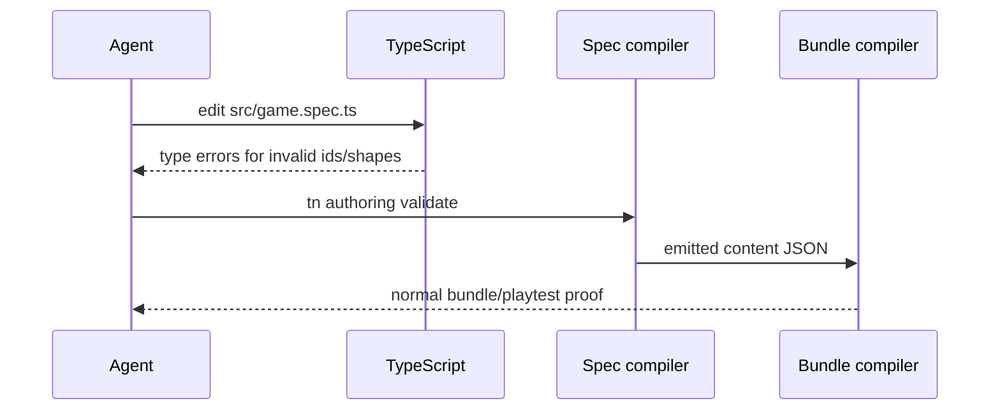

# PRD: Typed TypeScript Game Spec

`Planning Mode: Principal Architect`
`Complexity: 8 -> HIGH mode`

Score basis: +3 touches 10+ files across SDK/compiler/CLI/templates/docs, +2
new authoring surface, +2 multi-package codegen/build integration, +1 release
gate and cookbook impact.

## 1. Context

**Problem:** The model is strong at TypeScript but weak at recalling
ThreeNative's JSON dialect, so schema/declaration/input-ID mistakes consume
the remaining agent cost even after adoption fixes.

**Files Analyzed:**

- `tools/agent-benchmark/OFF-RECIPE-ROUND-4-RECOMMENDATIONS-2026-07-07.md`
- `docs/PRDs/done/other/typescript-authoring-facade-and-script-ergonomics.md`
- `docs/PRDs/done/complete-structured-authoring-parity.md`
- `packages/sdk/src/`
- `packages/ir/src/`
- `packages/compiler/src/`
- `packages/cli/src/commands/game.ts`
- `templates/`
- `docs/cookbook/`

**Current Behavior:**

- Durable source is SDK declarations plus `content/**/*.json`; behavior is
  `src/scripts/**/*.ts`.
- Agents must coordinate many JSON documents for scenes, systems, UI,
  materials, and resources.
- Round 4 shows the largest remaining cost comes from dialect/schema recall.
- Architectural Bet A and Bet C recommend making typed TS the schema and
  collapsing the multi-file surface.

**Implementation Note:** An experimental vertical slice now exists: SDK typed
spec types, compiler ID-union generation from structured source, and typed
spec-to-canonical-source emission. Starter/cookbook/default migration and the
benchmark decision remain open before this PRD is complete.

## Pre-Planning Findings

**How will this feature be reached?**

- [x] Entry point identified: new starter authoring file such as
  `src/game.spec.ts`, compiler build step, `tn authoring validate`, and
  `tn game plan --apply`.
- [x] Caller file identified: CLI build/validate flow and compiler source
  document ingestion.
- [x] Registration/wiring needed: generated types, TS-to-content compiler,
  starter template update, cookbook, source-map/provenance links.

**Is this user-facing?**

- [x] YES. Agents author source data in TypeScript instead of raw JSON.
- [ ] NO.

**Full user flow:**

1. Agent opens one typed `src/game.spec.ts` file.
2. Agent edits scene/entities/resources/systems/UI using generated types and
   ID unions.
3. `tsc` catches invalid IDs, fields, and component shapes before iterate.
4. Compiler emits canonical `content/**/*.json` artifacts for the existing IR
   and runtime stack.

## 2. Solution

**Approach:**

- Generate TypeScript types from existing structured-source schemas and known
  project IDs.
- Add a typed game-spec API that defines scenes, entities, resources, systems,
  UI, materials, and script references in one coherent TS document.
- Compile the spec into canonical `content/**/*.json`; keep JSON as generated
  contract artifacts.
- Preserve existing CLI commands and JSON source support during migration.
- Update starters and cookbook only after a vertical slice proves lower failure
  cost.

**Key Decisions:**

- [x] Typed TS is an authoring surface, not a runtime contract replacement.
- [x] Canonical bundle and runtime adapters remain unchanged.
- [x] JSON source remains supported until migration evidence justifies changing
  defaults.

**Data Changes:** New generated type artifacts and optional `src/game.spec.ts`;
canonical `content/**/*.json` remains emitted.

## 3. Sequence Flow

## 4. Execution Phases

#### Phase 1: Design Spike And Type Boundary - The TS surface is scoped.

**Files (max 5):**

- `docs/PRDs/agent-native-authoring-loop-2026-07-07/PRD-017-typed-typescript-game-spec.md`
- `docs/architecture/typed-game-spec.md`
- `packages/ir/src/`
- `packages/sdk/src/`
- `packages/compiler/src/`

**Implementation:**

- [x] Specify the minimal typed spec covering round-4 failure classes:
  resources, entity IDs, input IDs, transforms, systems, and script references.
- [x] Define generated type ownership and output paths.
- [x] Document non-goals: arbitrary Three.js, DOM, filesystem, workers, raw
  runtime handles.

**Tests Required:**

| Test File | Test Name | Assertion |
|-----------|-----------|-----------|
| design review | `should map every round-4 schema failure to a type check or explicit non-goal` | no failure class is unassigned |

**User Verification:**

- Action: review architecture doc.
- Expected: the typed surface is smaller than the full source schema but covers
  the benchmark failure classes.

#### Phase 2: Type Generation - Schemas produce usable authoring types.

**Files (max 5):**

- `packages/sdk/src/gameSpecTypes.ts`
- `packages/sdk/src/gameSpecTypes.test.ts`
- `packages/ir/src/`
- `packages/compiler/src/gameSpec/typegen.ts`
- `packages/compiler/src/gameSpec/typegen.test.ts`

**Implementation:**

- [x] Generate or hand-author the first typed facade from existing schemas.
- [x] Include branded unions for entity, resource, input, material, and UI IDs.
- [x] Add compile-time examples using `tsc --noEmit`.

**Tests Required:**

| Test File | Test Name | Assertion |
|-----------|-----------|-----------|
| `packages/compiler/src/gameSpec/typegen.test.ts` | `should generate id unions from project source` | generated types include known IDs |
| type fixture | `should reject invalid input id at tsc time` | fixture fails with expected type error |

**User Verification:**

- Action: run the type fixture command.
- Expected: invalid IDs fail before any iterate command.

#### Phase 3: Spec Compiler Vertical Slice - One typed document emits valid content.

**Files (max 5):**

- `packages/compiler/src/gameSpec/compile.ts`
- `packages/compiler/src/gameSpec/compile.test.ts`
- `packages/cli/src/commands/authoring*.ts`
- `examples/typed-spec-smoke/src/game.spec.ts`
- `examples/typed-spec-smoke/content/**/*.json`

**Implementation:**

- [x] Compile a minimal spec with one scene, one resource, one system, and one
  UI binding into canonical JSON.
- [x] Preserve source maps/provenance back to the TS spec.
- [x] Run existing build flow from generated content.

**Implementation Note:** Typed spec compilation now annotates generated
authoring documents with source maps so authoring provenance ownership entries
point back to `src/game.spec.ts` instead of generated `content/**/*.json`.

**Tests Required:**

| Test File | Test Name | Assertion |
|-----------|-----------|-----------|
| `packages/compiler/src/gameSpec/compile.test.ts` | `should emit valid structured source from typed spec` | emitted content validates |
| example proof | `should build typed-spec smoke example` | `tn build` passes |

**User Verification:**

- Action: edit the typed smoke spec and run `tn iterate --project examples/typed-spec-smoke --json`.
- Expected: source compiles, builds, and playtest proof runs through existing IR.

#### Phase 4: Starter And Cookbook Trial - New projects can choose typed source.

**Files (max 5):**

- `templates/structured-source-starter/src/game.spec.ts`
- `templates/structured-source-starter/AGENTS.md`
- `templates/structured-source-starter/CLAUDE.md`
- `docs/cookbook/*`
- `tools/verify/src/cookbookGate.ts`

**Implementation:**

- [x] Add typed spec as an opt-in starter mode or experimental flag.
- [ ] Add cookbook entries for resource state, entity transforms, input IDs,
  and UI bindings.
- [ ] Run cookbook verification.

**Implementation Note:** `tn create --authoring typed-spec` now scaffolds
`src/game.spec.ts`, runs the typed-spec compiler once to emit canonical
`content/**/*.json`, and rewrites starter scripts so validate/build regenerate
structured source before using the normal compiler path.

**Tests Required:**

| Test File | Test Name | Assertion |
|-----------|-----------|-----------|
| cookbook gate | `should verify typed spec cookbook entries` | examples compile and validate |
| template gate | `should include typed spec guidance in generated starter` | starter has AGENTS/CLAUDE source boundary text |

**User Verification:**

- Action: create a project with the typed spec option.
- Expected: first screen builds from `src/game.spec.ts` without hand-editing
  JSON.

#### Phase 5: Benchmark Trial And Decision - Typed source earns default status or stays experimental.

**Files (max 5):**

- `tools/agent-benchmark/prompts/*.json`
- `tools/verify/artifacts/agent-benchmark/typed-spec-trial-*/REPORT.md`
- `docs/status/capabilities/*.md`
- `docs/STATUS.md`
- `docs/bevy-feature-parity.md` only if parity claims change.

**Implementation:**

- [ ] Run a focused benchmark trial against round-4 failure classes.
- [ ] Compare steps, failed commands, and retry chains against JSON source.
- [ ] Decide whether typed spec becomes the default starter surface.

**Tests Required:**

| Test File | Test Name | Assertion |
|-----------|-----------|-----------|
| benchmark report | `should prove typed spec reduces schema retry budget` | schema/declaration failures drop to target range |

**User Verification:**

- Action: inspect trial report.
- Expected: decision is evidence-backed, not assumed.

## 5. Checkpoint Protocol

- Automated checkpoint after every phase.
- Manual checkpoints after Phase 1 for API shape and after Phase 5 for default
  authoring decision.

## 6. Verification Strategy

- Type-level fixtures with expected `tsc` pass/fail outcomes.
- Compiler tests for emitted canonical JSON.
- Existing build/validate/playtest gates on generated content.
- `pnpm verify:cookbook` when cookbook entries change.
- `pnpm verify:conformance` if emitted IR behavior changes.

## 7. Acceptance Criteria

- [ ] A typed spec can represent the round-4 failure classes.
- [ ] Invalid entity/resource/input IDs fail at TypeScript compile time.
- [ ] Typed spec emits canonical structured source and existing IR bundles.
- [ ] Starter/cookbook guidance is verified.
- [ ] Benchmark trial decides whether typed spec becomes default.
