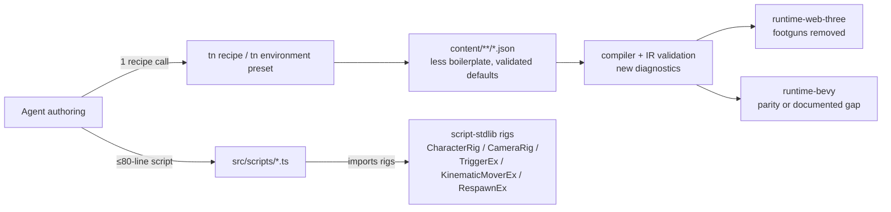

# PRD: Authoring Abstractions And Polished Defaults

`Planning Mode: Principal Architect`
`Complexity: 10 → HIGH mode (10+ files, multi-package, new modules, shared runtime contracts)`

## 1. Context

**Problem:** Building `examples/humanoid-physics-course` to a ~7/10 finish
required an agent to hand-write ~160 lines of generic gameplay plumbing, learn
four undocumented engine footguns, and hand-tune a full
environment/runtime/material stack — all of which burns LLM tokens and creates
silent-failure surface that abstractions and better defaults should absorb.

**Files Analyzed:**

- `examples/humanoid-physics-course/src/scripts/player.ts` (282 lines),
  `content/{scenes,systems,ui,environment,materials,runtime,input}/*.json`,
  `AGENT_GAME_PLAN.md`, `docs/PRDs/ue-quality-polish.md`.
- `packages/script-stdlib/src/{index,gameplay,vectors,rotation,numeric,feedback,bounds}.ts`,
  `src/bundle-source.ts`, `src/index.test.ts` (typed/bundle parity contract).
- `packages/runtime-web-three/src/systems/context.ts` (`createSystemContext`),
  `src/systems/contextTypes.ts` (`ISystemContext`), `src/character.ts`
  (`traceCharacterControllers`), physics step ordering.
- `packages/cli/src/commands/{game,scene,sceneComponents,recipe,sourceDocuments}.ts`;
  `packages/authoring/src/recipes.ts` (11 recipes incl. `third-person-controller`,
  `kinematic-character`, `trigger-zone`, `dressed-environment-kit`),
  `packages/authoring/src/operations/uiRecipes.ts` (12 UI recipes),
  `packages/authoring/src/gameWorkflow.ts` (`createGameQualityReport`).
- `packages/ir/src/{types,runtimeConfig,uiTypes,rendering,environment}.ts`
  (`IAtmosphereProfileIr`, `RENDER_LOOK_PROFILE_PRESETS`: `parity`/`balanced`,
  `IUiNodeIr` bindings).
- `templates/structured-source-starter/content/**` and its built IR.
- Prior art: `docs/PRDs/done/beautiful-defaults-render-look-profiles.md`,
  `done/game-development-velocity-kits.md`,
  `done/complete-structured-authoring-parity.md`.

**Current Behavior (measured pain, all reproduced in the example):**

- **Cross-file magic coupling.** `player.ts` hardcodes
  `CONTROLLER_SPEED = 3.1` to mirror `CharacterController.speed` in
  `arena.scene.json` and passes `fixedDelta: delta * speed / CONTROLLER_SPEED`
  to `context.character.move` to fake variable speed. Any drift between the
  two numbers silently changes movement speed.
- **Engine footguns every game must rediscover:**
  1. `stepPhysics` integrates kinematic `RigidBody.velocity` before
     `fixedUpdate`, so a script that `setPose`s AND leaves velocity nonzero
     moves the entity twice per tick. The example patches
     `RigidBody.velocity: [0,0,0]` every frame as a workaround
     (`player.ts:139`).
  2. Feet-origin capsules need `Collider.center: [0, height/2, 0]` or the
     floor blocks all horizontal movement; nothing validates or defaults this.
  3. Model forward axis is per-asset folklore (Soldier.glb faces -Z; heading
     is `atan2(-dirX, -dirZ)`) recorded only in a code comment.
  4. `RigidBody` accepts both `mass` and `inverseMass` with no consistency
     check (`crate.push.01` authors `mass: 2.5, inverseMass: 0.4`).
- **~160 of 282 script lines are generic plumbing**, not game design:
  locomotion easing/turn-smoothing/animation-cadence (~80 lines), a
  third-person camera boom with smoothing state stashed in the `GameState`
  resource (~75 lines), a sine-wave hazard mover with hand-derived velocity,
  distance-based checkpoint/hazard/finish detection **despite the colliders
  already being authored `trigger: true`**, and `isRecord`/`isVec3`/
  `forwardOfYaw` duplicated in both system functions because the bundler
  forbids relative imports between scripts.
- **stdlib has the math but not the rigs.** `CameraMath.followPose/orbitPose`,
  `ControllerEx.worldCardinalCharacter`, `CheckpointRaceEx`, `SpawnEx`,
  `TimerEx` exist as pure functions, but nothing owns smoothing state, engine
  wiring (`context.character.move`, `context.animation.play`), trigger
  consumption, or respawn lifecycle — so each game re-implements the wiring.
- **HUD text is assembled by string concatenation in three places** in
  `player.ts` (reset, finish, per-frame) because UI bindings
  (`hud.ui.json` `bindings`) can only mirror a resource field verbatim — no
  format templates.
- **Scene JSON is boilerplate-heavy:** 11 static props each repeat
  `MeshRenderer` + `Collider` (hand-computed sizes duplicating mesh dims ×
  scale) + `RigidBody {kind: static}`; rotations are raw radians
  (`-1.570796`); the environment doc carries a bogus
  `path.validation` two-point path solely to satisfy validation.
- **The starter template default is a 2/10 blockout**: three flat-colored
  primitives, compiler-injected two-light rig, **no atmosphere document at
  all** (no sky, fog, shadows, IBL, bloom, tone mapping) — every generated
  game re-derives the entire "balanced daylight" stack the example had to
  hand-tune across `environment` + `runtime` + `materials` docs.
- Known CLI defect: `tn material set <id>` fails with
  `TN_AUTHORING_DOCUMENT_MISSING` for materials inside a multi-material
  document, forcing direct JSON edits.

## 2. Solution

**Approach:**

- **Remove the footguns at the engine layer** (speed coupling, kinematic
  double-integration, capsule center, mass redundancy, forward axis) so the
  correct thing is the default thing — validation diagnostics for what can't
  be defaulted.
- **Add engine-integrated "rig" helpers to `@threenative/script-stdlib`**
  (the only sanctioned import), with state held in `context.state(...)`:
  character locomotion, third-person camera, trigger events, kinematic
  oscillators, respawn. Target: the humanoid course script drops from 282 to
  ≤ 80 lines with identical behavior.
- **Make trigger gameplay declarative-first**: physics trigger events consumed
  via one stdlib call; sine/waypoint movers become an IR component so hazards
  need zero script.
- **Add UI format-template bindings** (`"CP {checkpoint}/{total}"`) so scripts
  patch numbers, never assemble HUD strings.
- **Ship a polished default baseline**: environment presets
  (`tn environment preset <name>`), an upgraded starter template with a full
  atmosphere/render-look stack, and an upgraded `third-person-controller`
  recipe that stamps the entire example-quality player rig (capsule with
  correct center, controller, camera, input doc, HUD cluster) in one command.
- **Fix the CLI paper cuts** that force raw JSON edits (multi-material
  `material set`, degree rotations, auto colliders).

**Architecture:**



**Key Decisions:**

- [x] Rig abstractions live in `packages/script-stdlib` (bundler whitelists
      only stdlib + kit packages; no relative script imports). Every rig ships
      in BOTH `src/*.ts` and `src/bundle-source.ts` with parity asserted in
      `index.test.ts` — this doubles implementation cost and is accepted.
- [x] Rigs are functions taking `context` and storing state via
      `context.state(key, defaults)` — never via the user-visible `GameState`
      resource (fixes the camera-state leak in the example).
- [x] Engine behavior changes (`character.move` speed, kinematic authority)
      are shared runtime contracts → web + Bevy + conformance coverage +
      `docs/STATUS.md` + `docs/bevy-feature-parity.md` updates. If Bevy can't
      land in the same phase, the parity doc records the gap explicitly.
- [x] Declarative `KinematicMover` is a new IR component (schema + both
      runtimes); UI format bindings extend `IUiNodeIr` bindings — both are
      versioned IR changes with accepted/rejected validation tests.
- [x] No new package. CLI additions go in existing command files; presets in
      `packages/authoring`.
- [x] Backwards compatibility: all changes are additive or
      diagnostic-gated; existing bundles keep validating. The kinematic
      authority fix changes runtime behavior only for entities a script posed
      in the same tick (currently guaranteed-buggy double integration).

**Data Changes:**

- IR: new `KinematicMover` component schema; `IUiBindingIr` gains optional
  `format` template; `RigidBody` validation gains mass-consistency rule;
  model asset schema gains optional `forwardAxis` (`"+z" | "-z" | "+x" | "-x"`,
  default `"+z"`).
- No migrations: all fields optional, versions bumped per IR conventions.

## 3. Integration Points

**How is this reached?**

- Entry points: `tn recipe apply third-person-controller`,
  `tn environment preset <name>`, `import { CharacterRig, CameraRig, TriggerEx,
  KinematicMoverEx, RespawnEx } from "@threenative/script-stdlib"`, and
  `tn create` (starter template).
- Callers: `packages/cli/src/commands/recipe.ts`,
  `sourceDocuments.ts` (environment), compiler bundler (stdlib injection),
  both runtime adapters (KinematicMover, UI format bindings).
- Wiring: recipes registered in `packages/authoring/src/recipes.ts`
  (`listAuthoringRecipeIds`); presets surfaced in `tn game plan` output so
  agents discover them without extra prompting.

**User-facing?** Yes — via CLI commands and generated-game quality. No GUI
work; the "UI" is the CLI/JSON/stdlib surface plus the rendered game.

**Full user flow:** Agent runs `tn game plan` → plan recommends recipe +
environment preset → agent applies both (2 commands ≈ what previously took
~40 JSON edits) → writes a ≤80-line gameplay script on top of rigs → scene
loop + `tn game score` show a polished baseline out of the box.

## 4. Execution Phases

#### Phase 1: Kill the two movement footguns — a script can drive a character without magic constants or double-integration hacks

**Files (max 5):**

- `packages/runtime-web-three/src/systems/context.ts` — `character.move`
  accepts `speed?: number` (overrides `CharacterController.speed` for this
  call) and `direction?: [x, z]` (unit direction; replaces the
  axes-plus-scaled-fixedDelta hack).
- `packages/runtime-web-three/src/character.ts` /
  physics step — kinematic bodies whose transform was set via a script
  command this tick skip velocity integration ("script authority"): track
  posed-entity ids in the command flush, consume in `stepPhysics`.
- `packages/ir/src/` (validation) — `RigidBody`: error when `mass` and
  `inverseMass` are both present and `|mass * inverseMass - 1| > 1e-3`;
  warning `TN_PHYSICS_CAPSULE_CENTER_SUSPECT` when a `CharacterController`
  entity has a capsule collider with `center` `[0,0,0]` and
  `height/2 > radius`.
- `packages/runtime-web-three/src/__tests__/` (or existing test home) —
  regression tests.
- `runtime-bevy/` — mirror kinematic script-authority semantics (or record
  the gap in `docs/bevy-feature-parity.md` within this phase).

**Implementation:**

- [ ] Extend `ISystemContext["character"]["move"]` options; keep old
      `axes`/`fixedDelta` path working unchanged.
- [ ] Script-authority flag per tick; conformance fixture proving a
      setPose+velocity script moves the entity exactly once per tick.
- [ ] New diagnostics with code/severity/path/message + suggested fix.
- [ ] Update `docs/STATUS.md` + `docs/bevy-feature-parity.md`.

**Tests Required:**
| Test File | Test Name | Assertion |
|-----------|-----------|-----------|
| runtime-web-three character tests | `should move at requested speed when move() called with speed override` | resolved displacement ≈ `speed * fixedDelta` |
| runtime-web-three physics tests | `should not double-integrate kinematic body when script sets pose in same tick` | position advances once |
| ir validation tests | `should reject RigidBody when mass and inverseMass disagree` | diagnostic code emitted |
| ir validation tests | `should warn when feet-origin capsule has zero center` | `TN_PHYSICS_CAPSULE_CENTER_SUSPECT` |

**Verification Plan:** package tests + `pnpm verify:conformance` (shared
contract) + `tn playtest --project examples/humanoid-physics-course --entity
player --press KeyW --frames 30 --expect-moved --expect-axis z --json` still
passes untouched (backwards compat).

**User Verification:** In the example, delete the `speed/CONTROLLER_SPEED`
scaling and the `velocity: [0,0,0]` patch, pass `speed` to `move()` — motion
is unchanged. (Do not commit that edit yet; Phase 7 does the full retrofit.)

#### Phase 2: stdlib rigs — CharacterRig + CameraRig

**Files (max 5):**

- `packages/script-stdlib/src/rigs.ts` — new namespaces:
  - `CharacterRig.update(context, entityId, opts)` — input axes →
    camera-relative direction, accel/decel (`moveToward`), heading persistence,
    exponential turn smoothing with max turn rate, `context.character.move`
    (Phase 1 `speed`/`direction`), bounds clamp, animation clip selection +
    cadence scaling (`idle/walk/run` with `sourceClip` mapping and
    `speed/referenceSpeed` playback scaling), `forwardAxis`-aware yaw math.
    Options: `{ walkSpeed, sprintSpeed, acceleration, deceleration,
    turnSmoothing, maxTurnSpeed, sprintAction?, clips?, bounds?,
    cameraYaw?: number }`. Returns `{ position, yaw, speed, moving, sprinting }`.
  - `CameraRig.thirdPerson(context, opts)` — smoothed follow point, lazily
    chasing yaw with rate cap, sprint pullback, shoulder offset, look-ahead;
    state in `context.state("tn.cameraRig." + cameraId, ...)`; sets the camera
    pose itself. Options mirror the example's tunables with those values as
    defaults. Returns `{ yaw }` (feed into `CharacterRig` for camera-relative
    movement).
- `packages/script-stdlib/src/bundle-source.ts` — same logic in raw JS.
- `packages/script-stdlib/src/index.ts` — export.
- `packages/script-stdlib/src/index.test.ts` — extend `sampleExpression` +
  deterministic multi-tick simulation with a mock context; parity assertion
  covers both rigs.
- `packages/script-stdlib/README.md` (or package docs home) — rig usage.

**Implementation:**

- [ ] Reuse `CameraMath`, `MotionEx`, `AngleEx`, `NumberEx` internally — rigs
      are wiring + state, not new math.
- [ ] Mock-context test harness (query/state/character/animation/time stubs)
      reusable by Phase 3 tests.
- [ ] Rigs must never read/write user resources; only `context.state`.

**Tests Required:**
| Test File | Test Name | Assertion |
|-----------|-----------|-----------|
| `index.test.ts` | `should keep exported and bundled helper behavior identical` | extended sample covers rigs |
| `index.test.ts` | `should ease speed toward target and cap turn rate when CharacterRig updates` | 60-tick sim matches expected pose within 1e-6 |
| `index.test.ts` | `should converge camera behind moving target without overshoot when CameraRig follows` | yaw error monotonic ↓ |

**Verification Plan:** `pnpm --filter @threenative/script-stdlib test`;
`pnpm build && pnpm verify`.

**User Verification:** A scratch project script of ~15 lines
(`CameraRig.thirdPerson` + `CharacterRig.update`) reproduces the example's
movement/camera feel.

#### Phase 3: stdlib rigs — TriggerEx, KinematicMoverEx, RespawnEx

**Files (max 5):**

- `packages/script-stdlib/src/rigs.ts` (extend):
  - `TriggerEx.entered(context, entity, { component? , layer? })` — consumes
    `context.physics.sensor`/overlap events with per-pair enter-edge detection
    in `context.state`; returns newly-entered entity views. Kills the
    hand-rolled distance checks for checkpoints/hazards/finish.
  - `TriggerEx.cooldown(context, key, seconds)` — the hit-cooldown pattern.
  - `KinematicMoverEx.sweep(context, entity, { origin, axis|direction,
    radius, speed, phase })` — sine mover that sets position AND the correct
    derivative velocity (Phase 1 makes the velocity purely advisory for
    physics prediction).
  - `RespawnEx.reset(context, entity, { position, yaw, components?, resources? })`
    — one call for pose reset + component patches + resource patches.
- `packages/script-stdlib/src/bundle-source.ts`, `src/index.ts`,
  `src/index.test.ts` — parity + edge-detection tests.
- `packages/runtime-web-three/src/systems/context.ts` — only if sensor events
  lack enter/exit edges today: expose stable pair ids so `TriggerEx` can
  edge-detect (verify first; skip if already sufficient).

**Tests Required:**
| Test File | Test Name | Assertion |
|-----------|-----------|-----------|
| `index.test.ts` | `should report trigger entry exactly once when overlap persists across ticks` | second tick returns [] |
| `index.test.ts` | `should emit position and matching derivative velocity when sweep advances` | `v ≈ d(pos)/dt` |
| parity test | extended sample | typed == bundled |

**Verification Plan:** stdlib tests; `pnpm verify`. In the example project,
a spike replacing checkpoint detection with `TriggerEx.entered` passes the
same playtest.

**User Verification:** Walking into a checkpoint fires exactly one HUD
increment; standing inside it fires no repeats.

#### Phase 4: Declarative KinematicMover component + UI format bindings

**Files (max 5):**

- `packages/ir/src/types.ts` + validation — `KinematicMover` component:
  `{ mode: "sine" | "waypoints", axis?/direction?, radius?, speed, phase?,
  waypoints?, loop? }`; accepted/rejected fixtures.
- `packages/runtime-web-three/src/` — system that drives `KinematicMover`
  entities (position + derivative velocity) with zero script.
- `runtime-bevy/src/` — same, or explicit parity-doc gap entry.
- `packages/ir/src/uiTypes.ts` + validation + web UI runtime —
  `IUiBindingIr.format?: string` with `{resourceField}` placeholders and
  `{field:fixed1}`-style numeric formatting (reuse `TextEx`); binding may list
  multiple resource fields.
- `packages/ir/fixtures/` — shared fixtures for both features.

**Implementation:**

- [ ] Compiler passes component through; conformance fixture with one sine
      mover asserting identical trajectories web/Bevy.
- [ ] Format grammar kept minimal (placeholder + `fixed<n>`/`pad<n>`); invalid
      templates → validation diagnostic, not runtime crash.
- [ ] Update `docs/STATUS.md`, `docs/bevy-feature-parity.md`,
      `docs/contracts/` entry for both.

**Tests Required:**
| Test File | Test Name | Assertion |
|-----------|-----------|-----------|
| ir tests | `should accept sine mover and reject unknown mode` | schema behavior |
| conformance | `should produce identical mover trajectory on web and bevy` | positions match per tick |
| ui runtime tests | `should render formatted binding when resource fields change` | `"CP 1/2"` from `{checkpoint}`,`{total}` |

**Verification Plan:** `pnpm verify:conformance` + UI runtime tests.

**User Verification:** A scene-JSON-only hazard sweeps back and forth with no
script; HUD line updates from numeric resource patches only.

#### Phase 5: CLI — upgraded third-person recipe, environment presets, paper cuts

**Files (max 5):**

- `packages/authoring/src/recipes.ts` — upgrade `third-person-controller`
  (or add `third-person-character` if compat requires): stamps player entity
  (capsule collider with computed `center: [0, height/2, 0]`,
  `CharacterController`, kinematic `RigidBody`), camera entity with
  `third-person-follow` (or CameraRig-ready ids), full input doc
  (WASD/arrows + sprint + retry axes), `hud-status-cluster` UI recipe wiring,
  and a generated `src/scripts/<name>.ts` stub that uses
  `CharacterRig`/`CameraRig`/`TriggerEx`/`RespawnEx` (≤ 40 lines).
- `packages/authoring/src/` (new `environmentPresets.ts`) + CLI wiring in
  `packages/cli/src/commands/sourceDocuments.ts` —
  `tn environment preset <daylight|overcast|sunset|night> --project . --json`:
  writes atmosphere (sun/ambient/fog/sky/ACES/shadows), skybox +
  environmentMap stubs, and matching `renderLook` overrides in one command;
  values seeded from the example's hand-tuned "overcast daylight" stack.
- `packages/cli/src/commands/sourceDocuments.ts` — fix `tn material set`
  `TN_AUTHORING_DOCUMENT_MISSING` for multi-material documents.
- `packages/cli/src/commands/sceneComponents.ts` — `--rotation-deg` on
  transform/entity commands; `collider --size auto` derives box size from the
  referenced mesh dims × entity scale.
- `packages/cli/src/commands/game.ts` — `tn game plan` output recommends the
  upgraded recipe + an environment preset for matching goals.

**Tests Required:**
| Test File | Test Name | Assertion |
|-----------|-----------|-----------|
| authoring recipe tests | `should stamp capsule center at half height when third-person recipe applies` | center `[0, h/2, 0]` |
| cli tests | `should set material inside multi-material document when material set runs` | exit 0, JSON updated |
| cli tests | `should write full atmosphere document when environment preset applies` | validates clean, no bogus path required |
| cli tests | `should convert degrees when --rotation-deg used` | radians in JSON |

**Verification Plan:** CLI/authoring package tests; apply recipe + preset in a
scratch project → `tn authoring validate --json` clean → `tn scene proof`.
Also remove the environment-validation requirement that forced the
`path.validation` hack (or ship presets with a sanctioned minimal path and a
tracked follow-up — decide in-phase, record which).

**User Verification:** From a fresh starter project, two commands + zero JSON
edits produce a walkable third-person character in a lit, fogged, shadowed,
tone-mapped scene.

#### Phase 6: Polished starter template baseline

**Files (max 5):**

- `templates/structured-source-starter/content/environment/arena.environment.json`
  (new) — `daylight` preset output.
- `templates/structured-source-starter/content/runtime/default.runtime.json` —
  `renderLook: balanced` + bloom/grading matching the preset.
- `templates/structured-source-starter/content/materials/arena.materials.json`
  — roughness/metalness-complete materials; emissive goal marker; no compiler
  light injection reliance (author the light rig or keep atmosphere-driven).
- `templates/structured-source-starter/README.md` + `AGENT_GAME_PLAN.md` —
  document rigs/recipes/presets as the FIRST tools ("do not hand-roll
  locomotion, cameras, triggers, movers, HUD strings — use these"), replacing
  guidance that currently teaches the expensive path.
- `examples/` smoke coverage of the template build if one exists (else
  template build test in CLI tests).

**Verification Plan:** `tn create` from template → build → `tn game score`:
visuals phase must not be the floor score; screenshot proof shows sky, fog,
shadows, tone mapping instead of void + two lights.

**User Verification:** A freshly generated project's first screenshot looks
like a lit scene, not a debug blockout (target: the "7/10" example's
atmosphere quality is now the free baseline).

#### Phase 7: Retrofit humanoid-physics-course as the proof + token benchmark

**Files (max 5):**

- `examples/humanoid-physics-course/src/scripts/player.ts` — rewrite on
  rigs/TriggerEx/KinematicMoverEx/RespawnEx: target ≤ 80 lines (from 282),
  zero duplicated type guards, zero `CONTROLLER_SPEED`, zero velocity-zeroing,
  zero HUD string assembly.
- `content/scenes/arena.scene.json` — hazards move to `KinematicMover`
  component; drop redundant `inverseMass`.
- `content/ui/hud.ui.json` — format bindings; delete `hudLine`/`*Text` fields
  from `GameState` (script patches numbers only).
- `content/systems/arena.systems.json` — updated reads/writes/services.
- `examples/humanoid-physics-course/artifacts/` — before/after evidence.

**Implementation:**

- [ ] Behavior parity is the gate: full playtest matrix (W/A/S/D + retry),
      checkpoint→finish flow, hazard hit cooldown, screenshot diff.
- [ ] Record the benchmark in this PRD's evidence section: script LOC,
      scene/UI JSON line counts, and count of cross-file numeric couplings
      before vs after.

**Tests Required:**
| Test File | Test Name | Assertion |
|-----------|-----------|-----------|
| playtest (CLI, not unit) | KeyW/A/S/D `--expect-moved --expect-axis` | all pass |
| `tn game qa --run-proof` | full proof run | no regressions vs current report |

**Verification Plan:** `tn authoring validate` → `tn scene proof arena` →
`pnpm build && pnpm verify` → `tn game qa --run-proof --json`; side-by-side
screenshots committed.

**User Verification:** Play a full lap — identical feel; read `player.ts` —
only game-specific logic remains (course rules, HUD numbers, hazard tuning).

#### Phase 8: Docs, status, and agent-guidance closure

**Files (max 5):**

- `docs/STATUS.md`, `docs/bevy-feature-parity.md` — final capability rows
  (character.move speed, kinematic authority, KinematicMover, UI format
  bindings, presets).
- `CLAUDE.md` + `AGENTS.md` (repo root, mirrored) — add a "prefer rigs,
  recipes, and presets before hand-rolling" rule to Game Planning.
- `docs/workflows/` — short "building a game with rigs and presets" workflow
  page (the token-efficient golden path, with the 2-command + ≤80-line-script
  example).
- Move this PRD to `docs/PRDs/done/` on completion.

**Verification Plan:** `pnpm check:docs`, `pnpm check:names`,
`pnpm verify:release`.

## 5. Checkpoint Protocol

After every phase, spawn the automated reviewer:

```
Task(subagent_type: "prd-work-reviewer",
     prompt: "Review checkpoint for phase N of PRD at
              docs/PRDs/authoring-abstractions-and-polished-defaults.md")
```

HIGH complexity → automated checkpoint every phase; **additional manual
checkpoints** for Phases 1 (movement feel), 5–7 (visual/feel proof
screenshots, playtest by hand). Continue only on PASS.

## 6. Acceptance Criteria

- [ ] All 8 phases complete; `pnpm build`, `pnpm verify`,
      `pnpm verify:conformance` green throughout.
- [ ] `examples/humanoid-physics-course/src/scripts/player.ts` ≤ 80 lines with
      behavior parity proven by playtest matrix + `tn game qa --run-proof`.
- [ ] Zero cross-file numeric couplings remain in the example (no
      `CONTROLLER_SPEED`, no velocity-zeroing patch, no hand HUD strings, no
      redundant `inverseMass`).
- [ ] A fresh starter project reaches a lit/fogged/shadowed/tone-mapped
      walkable third-person scene with exactly: `tn create` +
      `tn recipe apply third-person-controller` + `tn environment preset
      daylight` + a ≤ 40-line script stub (generated).
- [ ] New IR features (KinematicMover, UI format bindings) have
      accepted/rejected validation tests and web/Bevy conformance coverage or
      an explicit parity-doc gap entry.
- [ ] script-stdlib typed/bundle parity test covers every new rig.
- [ ] `tn material set` works inside multi-material documents (reproducing
      test included).
- [ ] `docs/STATUS.md` + `docs/bevy-feature-parity.md` updated (repo rule for
      capability changes); token benchmark recorded in Verification Evidence.

## 7. Success Metrics (the point of the PRD)

| Metric | Before (measured) | Target |
| --- | --- | --- |
| Gameplay script LOC for the humanoid course | 282 | ≤ 80 |
| Generic plumbing lines an agent must write | ~160 | 0 (rigs) |
| Engine footguns requiring folklore knowledge | 4 | 0 (defaulted or diagnosed) |
| Commands/edits to reach a lit walkable 3rd-person scene | ~40+ JSON edits across 7 docs | 2 CLI commands + generated stub |
| HUD string assembly sites in scripts | 3 | 0 (format bindings) |
| Starter template visual baseline | unlit primitives, no atmosphere | full daylight preset stack |

## Verification Evidence

_(fill in per phase during execution; include the Phase 7 token/LOC benchmark
table and before/after screenshots)_

### Phase 1 Partial Checkpoint

- Implemented web `ctx.character.move(entity, { direction, speed })` support
  while preserving the existing `axes` / `fixedDelta` path.
- Implemented web script-authored kinematic transform authority: entity-sourced
  `Transform` writes mark the entity for the next physics step, and kinematic
  velocity integration is skipped once for that same tick.
- Added IR validation coverage for inconsistent `RigidBody.mass` /
  `inverseMass` and warning `TN_PHYSICS_CAPSULE_CENTER_SUSPECT` for explicit
  zero-centered character capsules.
- Recorded the remaining native parity gap in `docs/bevy-feature-parity.md`;
  Bevy does not yet prove equivalent script-authority behavior.
- Evidence run:
  `pnpm --filter @threenative/runtime-web-three test`,
  `pnpm --filter @threenative/ir test`, and `pnpm verify:conformance`.

### Phase 2 Partial Checkpoint

- Added `CharacterRig.update` and `CameraRig.thirdPerson` to
  `@threenative/script-stdlib`.
- Rigs store internal smoothing state only through `context.state(...)`, call
  Phase 1 `context.character.move` direction/speed overrides, set entity/camera
  poses, and optionally play idle/walk/run animation clips.
- Mirrored the same rig behavior in `SCRIPT_STDLIB_BUNDLE_SOURCE` and extended
  typed/bundle parity samples.
- Added deterministic mock-context tests for character acceleration/turn
  behavior and third-person camera convergence.
- Evidence run: `pnpm --filter @threenative/script-stdlib test`.

### Phase 3 Partial Checkpoint

- Added `TriggerEx.entered` and `TriggerEx.cooldown` to
  `@threenative/script-stdlib` for state-backed trigger edge detection and
  cooldown gates over `context.physics.sensor(...)`.
- Added `KinematicMoverEx.sweep` for sine-swept kinematic motion that writes
  pose and patches derivative `RigidBody.velocity`.
- Added `RespawnEx.reset` for pose, component, and resource reset wiring.
- Mirrored all Phase 3 helpers in `SCRIPT_STDLIB_BUNDLE_SOURCE` and extended
  typed/bundle parity samples.
- Added deterministic tests for persistent trigger overlap edge detection,
  cooldown state, kinematic derivative velocity, and respawn reset behavior.
- Evidence run: `pnpm --filter @threenative/script-stdlib test`.

### Phase 4 Partial Checkpoint

- Added `KinematicMover` to IR world entity components with validation for
  accepted sine/waypoint shapes and rejected malformed mover fields.
- Added formatted UI binding support to IR validation and web UI resolution,
  including fixed-decimal and padded-field placeholders.
- Added web runtime sine `KinematicMover` stepping before physics, preserving
  the authored origin across frames and writing derivative velocity to
  kinematic `RigidBody` components.
- Recorded the remaining native parity gap in `docs/bevy-feature-parity.md`;
  Bevy does not yet map or prove the declarative `KinematicMover` contract.
- Fixed the stdlib `CharacterRig` deceleration bug where movement speed stayed
  nonzero after input release but the move request used a zero direction.
- Retrofitted `examples/humanoid-physics-course` to call
  `context.character.move` with direct `direction` and `speed`, removing the
  local `CONTROLLER_SPEED` coupling.
- Evidence run: `pnpm --filter @threenative/ir test`,
  `pnpm --filter @threenative/runtime-web-three test`,
  `pnpm --filter @threenative/script-stdlib test`,
  `node .threenative/cli/index.js authoring validate --json`,
  `node .threenative/cli/index.js build`,
  `node .threenative/cli/index.js verify --frames 2 --json`,
  `node .threenative/cli/index.js game score --project . --json`, and
  directional playtests for `KeyW`, `KeyS`, `KeyA`, and `KeyD`.

### Phase 5 Partial Checkpoint

- Upgraded the `third-person-controller` authoring recipe to emit a capsule
  collider `center` at half the authored height, removing the feet-origin
  capsule footgun for recipe users.
- Extended the `scene.set_collider` authoring operation to accept a `center`
  vector so recipes and clients can persist safe collider centers without raw
  JSON edits.
- Fixed `tn material set` to locate and update material rows inside grouped
  multi-material documents instead of requiring document id and material id to
  match.
- Added `tn scene set-transform --rotation-deg x,y,z`, converting authored
  degrees to stable radian source values and rejecting conflicting
  `--rotation` / `--rotation-deg` use.
- Evidence run: `pnpm --filter @threenative/authoring test` and
  `pnpm --filter @threenative/cli test`.

### Phase 7 Movement-Rig Checkpoint

- Retrofitted `examples/humanoid-physics-course/src/scripts/player.ts` to use
  `CharacterRig.update` and `CameraRig.thirdPerson` for player locomotion and
  camera follow instead of hand-rolled input normalization, speed easing, yaw
  smoothing, `character.move` scaling, and camera boom math.
- Added durable source resources plus resource schemas for the stdlib rig
  states (`tn.characterRig.player` and `tn.cameraRig.camera.main`) so systems
  access remains explicit and build validation keeps enforcing resource
  contracts.
- Promoted all new stdlib rig helper namespaces through the compiler's
  supported script import allowlist.
- Removed the example's velocity-zeroing workaround from player movement; the
  Phase 1 script-authority runtime fix now owns same-tick kinematic
  double-integration prevention.
- Evidence run: `pnpm --filter @threenative/compiler test`,
  `node .threenative/cli/index.js authoring validate --json`,
  `node .threenative/cli/index.js build`,
  `node .threenative/cli/index.js verify --frames 2 --json`, and directional
  playtests for `KeyW`, `KeyS`, `KeyA`, and `KeyD`.
