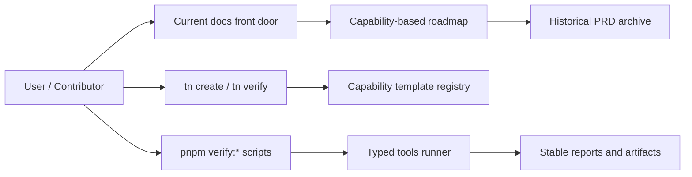
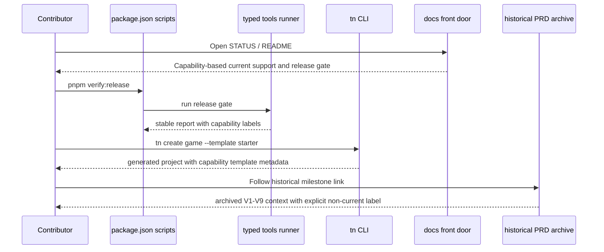

# Cleanup PRD: Versioned Debt, Script Tooling, and Docs Front Door

Complexity: 9 -> HIGH mode

## 1. Context

**Problem:** The repo uses `v1` through `v9` as product architecture, script
organization, docs structure, examples, fixtures, and release language, which
makes the current supported surface hard to understand and expensive to change.

**Files Analyzed:**

- `package.json`
- `scripts/verify-v9.mjs`
- `scripts/verify-conformance.mjs`
- `scripts/check-docs-v8.mjs`
- `packages/cli/src/commands/create.ts`
- `packages/sdk/scripts/run-tests.mjs`
- `packages/cli/scripts/run-tests.mjs`
- `packages/compiler/scripts/run-tests.mjs`
- `docs/STATUS.md`
- `docs/bevy-feature-parity.md`
- `docs/PRDs/v7/README.md`
- `docs/PRDs/v9/README.md`

**Current Behavior:**

- `docs/PRDs/` is organized by numbered batches (`v1` through `v9`) instead of
  product capabilities, historical archive, or current roadmap lanes.
- Top-level scripts expose numbered gates such as `verify:v7`, `verify:v9`,
  `check:docs:v8`, and many one-off `.mjs` files.
- Current docs repeatedly describe the product in milestone terms, including an
  active-gate mismatch where `docs/STATUS.md` still says V7 is active while V9
  implementation evidence exists.
- Examples, templates, conformance fixtures, artifact paths, and CLI template
  names include version labels even when the content represents a capability
  (`physics-character`, `rendering-lights`, `assets-gltf-scene-workflow`).
- Package-level test runners duplicate near-identical `.mjs` scripts that could
  be a typed shared tool.

## Surface Area Inventory

The cleanup is incomplete unless every row below is classified, migrated,
archived, or explicitly left alone with a reason.

| Surface | Current Examples | Target Policy |
| --- | --- | --- |
| Top-level package scripts | `verify:v9`, `verify:v8:color-parity`, `check:docs:v7`, `check:quality:v9` | Replace active scripts with `verify:release`, `verify:<capability>`, `check:docs`, and `check:names`; keep old names only as tested aliases during the deprecation window. |
| Script filenames and exports | `scripts/verify-v9.mjs`, `scripts/check-docs-v8.mjs`, `V9_FOCUSED_GATES`, `checkDocsV8` | Move active tooling to typed capability modules; keep `.mjs` wrappers only for compatibility. |
| Script tests and fixture builders | `scripts/verify-v9.test.mjs`, `writeMinimalV9Repo`, temp dirs like `tn-verify-v9-` | Rename to release/capability language and update assertions for canonical reports. |
| Package-level test runners | `packages/*/scripts/run-tests.mjs` | Replace duplicated `.mjs` runners with a shared typed runner or package script that compiles then runs Node tests. |
| CLI command output | `V1 commands:`, `V1 currently supports`, `V7 desktop packaging` | Current CLI help and diagnostics should use product/capability language; archive-only diagnostics may keep historical names. |
| CLI template registry and generated config | `--template v1`, `v2-arena`, `v7-functional`, config `"template": "v7-functional"` | Add canonical template names and tested legacy aliases; generated new projects should store canonical template names. |
| CLI verification modules | `packages/cli/src/verify/v3Scene.ts`, `v4Scripting.ts`, `v9VisualMatrix.ts` | Rename active modules by capability (`sceneVerification`, `scriptingParity`, `visualMatrix`) or mark old ones as archive-only compatibility. |
| Diagnostic codes | `TN_V8_COLOR_PARITY_*`, `TN_V4_EFFECT_LOG_*`, `TN_VERIFY_V9_*` | Decide per code: stable external diagnostics may stay with compatibility docs; new/current diagnostics use capability codes such as `TN_COLOR_PARITY_*`. |
| Docs front door | `docs/STATUS.md`, `docs/README.md`, `docs/bevy-feature-parity.md` | Current support and release gate use capability names; historical milestone references point to archive. |
| Historical PRDs | `docs/PRDs/v1` through `docs/PRDs/v9`, `V9-04-...md` | Move/index under `docs/PRDs/archive/milestones/`; preserve links or add redirects/index entries. |
| Standalone verification docs | `docs/verify-v3.md`, `docs/verify-v7.md`, `docs/verify-v8-procedural-mesh.md` | Replace with current verification docs plus archive pages for historical commands. |
| Examples | `examples/v9-physics-character`, `examples/v8-color-parity`, `examples/v1-canonical` | Rename maintained examples to capability names; archive or clearly label historical examples. |
| Templates | `templates/v1`, `templates/v2-arena`, `templates/v7-functional` | Canonical capability/product names with compatibility aliases in CLI. |
| Example/template package metadata | package names, README titles, scripts, config `outDir` paths containing `v*` | Canonical names for maintained examples/templates; historical examples can keep old names only under archive policy. |
| Conformance fixture directories | `packages/ir/fixtures/conformance/v9-physics-character` | Resolve active fixtures through a canonical capability catalog; retain legacy paths or aliases until all callers migrate. |
| Fixture manifests and catalogs | `v7-fixture-catalog.json`, `v9-fixture-catalog.json`, manifest names like `conformance-v9-physics-character` | Canonical `fixture-catalog.json`; legacy catalogs map to canonical IDs with deprecation diagnostics. |
| Bundle JSON content | fixture `manifest.json` names, `verification.manifest.json` owner PRD links, embedded artifact output paths | Update current fixture metadata and owner links; do not alter real schema/product `version` fields. |
| IR schema `$id` paths | `https://schemas.threenative.local/v1/world.schema.json` | Classify separately as schema-versioning. Leave unchanged unless a schema-version migration PRD is written. |
| Runtime Bevy code/tests/artifacts | `runtime-bevy/artifacts/v4`, Rust tests or report labels referencing old gates | Migrate active report labels/paths; archive static evidence artifacts or exclude generated artifacts from current-name checks. |
| Runtime web/CLI visual helpers | comments and sample region helpers referencing `examples/v8-*` | Update with renamed example paths in the same phase as example migration. |
| Artifact paths and reports | `artifacts/v9`, `artifacts/conformance/v7-*`, JSON `generatedBy` fields | New reports use canonical paths; old paths are readable compatibility inputs or archived generated output. |
| CI and automation references | any workflow, README, or agent instruction invoking `verify:v*` | Update to canonical scripts; keep explicit compatibility tests for old commands. |
| AGENTS and skill references | repo guidance mentioning V1/V2/V3/V4 milestones | Update only current workflow guidance; preserve historical context where it describes past milestones. |

**Interpretation of Cleanup:**

- Remove version-numbered nomenclature from current product surfaces and active
  workflows.
- Preserve historical PRDs and evidence through an explicit archive structure,
  redirects, or compatibility aliases.
- Do not rename IR document `version` fields such as `"0.1.0"`; those are real
  schema/product versions, not the milestone debt being cleaned up.
- Do not rename JSON Schema `$id` paths such as `/v1/world.schema.json` in this
  PRD; that is a schema-versioning decision and needs its own compatibility
  plan.
- Do not break external CLI users without a compatibility period and diagnostics.

## Pre-Planning Findings

**How will this cleanup be reached?**

- [x] Entry points identified: `pnpm verify`, `pnpm verify:*`,
  `pnpm check:*`, `tn create`, `tn verify`, docs index pages.
- [x] Caller files identified: `package.json`, `scripts/*.mjs`,
  `packages/cli/src/commands/create.ts`, `packages/cli/src/commands/verify.ts`
  if profile wiring is present there, and docs under `docs/`.
- [x] Registration/wiring needed: package scripts, CLI template registry,
  conformance fixture catalog, docs links, and compatibility aliases.

**Is this user-facing?**

- [x] YES. User-facing surfaces include package scripts, CLI template names,
  generated project metadata, docs navigation, examples, and diagnostics.
- [ ] NO.

**Full user flow:**

1. User reads `docs/README.md` or `docs/STATUS.md`.
2. User sees current product capabilities grouped by domain, not by `V7/V8/V9`.
3. User runs `pnpm verify:release` or `tn create --template starter`.
4. Compatibility aliases such as `pnpm verify:v9` or `--template v7-functional`
   continue to work for one deprecation window and print actionable guidance.
5. Generated projects and current docs use capability names going forward.

## 2. Solution

**Approach:**

- Introduce a cleanup boundary: `current` product docs and commands use
  capability names; historical milestone material moves under an archive index.
- Replace version-numbered top-level scripts with stable names:
  `verify:release`, `verify:conformance`, `verify:visual`, `verify:examples`,
  `check:docs`, and focused capability checks.
- Migrate hand-written repo scripts from `.mjs` to TypeScript under a typed tools
  folder, with one shared runner for command execution, JSON reports, diagnostics,
  and test discovery.
- Rename current examples/templates/fixtures by capability where they are not
  specifically historical, while preserving aliases for existing CLI flags and
  report paths.
- Rewrite the docs front door so `docs/STATUS.md`, `docs/bevy-feature-parity.md`,
  and `docs/README.md` state the supported product surface without requiring
  readers to understand milestone numbering.



**Key Decisions:**

- [x] Use capability names for active surfaces: examples, templates, fixtures,
  docs sections, focused gates, and report labels.
- [x] Keep historical PRD files intact at first; move or index them through an
  archive phase after links and docs checks are updated.
- [x] Use TypeScript for repo tooling. Package scripts should use `pnpm exec`
  rather than `npx` because the repo standard package manager is `pnpm@10.25.0`.
- [x] Add compatibility aliases for old `verify:v*`, `check:docs:v*`, and
  `--template v*` names before removing them.
- [x] Treat docs cleanup as implementation work with tests, not a manual rewrite.

**Data Changes:** None. No database or persistent runtime data changes.

## 3. Sequence Flow



## 4. Execution Phases

#### Phase 1: Inventory and Naming Contract - A contributor can see the approved current names and every legacy alias before files move.

**Files (max 5):**

- `docs/PRDs/cleanup-versioned-debt.md` - keep this PRD updated as the source plan.
- `docs/developer-workflow.md` - document new command and naming conventions.
- `docs/STATUS.md` - add cleanup status and current release-gate language.
- `docs/README.md` - add current docs entry points and archive explanation.
- `package.json` - add temporary inventory/check script if needed.

**Implementation:**

- [x] Create a generated inventory of all `v[0-9]` names in docs, scripts,
  package scripts, templates, examples, fixtures, artifacts, CLI tests, Rust
  tests, schema IDs, diagnostic codes, generated manifests, package metadata,
  and README command references.
- [x] Classify each occurrence as `historical-archive`, `compat-alias`,
  `current-surface`, `fixture-id`, `artifact-path`, `schema-version`,
  `diagnostic-code`, `generated-output`, `package-metadata`, or
  `external-compatibility`.
- [x] Define the target naming map, including examples:
  `verify:v9` -> `verify:release`, `check:docs:v9` -> `check:docs`,
  `v7-functional` -> `starter-functional`, `v9-physics-character` ->
  `physics-character`, `docs/PRDs/v9` -> `docs/PRDs/archive/milestones/v9`.
- [x] Add an allowlist file that forces every retained version reference to carry
  a classification, owner, rationale, and removal/migration policy.
- [x] Update current docs to point to the cleanup PRD and state that versioned
  names are legacy unless explicitly marked historical.
- [x] Add a test that fails if new current-surface `v[0-9]` names are introduced
  outside the allowlist.

**Tests Required:**

| Test File | Test Name | Assertion |
| --- | --- | --- |
| `scripts/check-current-names.test.ts` | `should classify legacy version names when scanning repo surfaces` | The scanner returns each occurrence with a valid classification. |
| `scripts/check-current-names.test.ts` | `should reject new current version labels outside the allowlist` | A fake current doc using `V10 release gate` fails with a stable diagnostic. |
| `scripts/check-current-names.test.ts` | `should require owner and policy for each retained version reference` | Each allowlist row has owner, classification, rationale, and migration policy. |

**User Verification:**

- Action: run `pnpm check:names`.
- Expected: a readable report lists legacy aliases, historical archives, and
  current-surface violations with file paths.

**Checkpoint:** Automated PRD reviewer must pass before Phase 2.

#### Phase 2: Typed Tooling Foundation - Verification and docs checks can run through typed shared tooling instead of copied `.mjs` scripts.

**Files (max 5):**

- `package.json` - add typed tool dependencies/scripts and compatibility aliases.
- `tools/verify/src/runner.ts` - shared command runner and JSON report helpers.
- `tools/verify/src/docs.ts` - docs consistency checks with capability naming.
- `tools/verify/src/release.ts` - aggregate release gate orchestration.
- `tools/verify/src/runner.test.ts` - runner behavior tests.

**Implementation:**

- [x] Add a TypeScript tools workspace or package using the repo's ESM
  `NodeNext` settings.
- [x] Move common command execution, timeout, diagnostics, report writing, and
  summary logic out of `scripts/verify-v*.mjs` into `tools/verify/src/runner.ts`.
- [x] Implement `pnpm check:docs` as a capability-aware docs check that replaces
  one-off `check:docs:v*` current usage.
- [x] Implement `pnpm verify:release` as the current aggregate release gate.
- [x] Rename active report schemas and `generatedBy` fields to canonical tool
  names while preserving legacy readers for existing reports.
- [x] Include a typed migration wrapper for package-level test runners so
  `packages/sdk`, `packages/ir`, `packages/compiler`, `packages/cli`,
  `packages/r3f`, `packages/ui`, and `packages/runtime-web-three` do not keep
  duplicated `.mjs` runner logic.
- [x] Keep old package scripts as aliases that call the new typed entry points
  and print a deprecation diagnostic.

**Tests Required:**

| Test File | Test Name | Assertion |
| --- | --- | --- |
| `tools/verify/src/runner.test.ts` | `should return a stable diagnostic when a command fails` | The runner includes command name, exit code, stderr, and suggested fix. |
| `tools/verify/src/docs.test.ts` | `should validate current docs without milestone-specific scripts` | `docs/STATUS.md`, `docs/README.md`, and parity docs pass the new docs gate. |
| `tools/verify/src/release.test.ts` | `should preserve verify:v9 as a compatibility alias` | The alias invokes `verify:release` and emits a deprecation diagnostic. |

**User Verification:**

- Action: run `pnpm check:docs`, `pnpm verify:release`, and old alias
  `pnpm verify:v9`.
- Expected: new commands pass; old alias still runs and clearly names the new
  command to use.

**Checkpoint:** Automated PRD reviewer must pass before Phase 3.

#### Phase 3: CLI Templates and Examples - New projects use capability template names while legacy template flags still work.

**Files (max 5):**

- `packages/cli/src/commands/create.ts` - template registry and alias handling.
- `packages/cli/src/commands/create.test.ts` - new and legacy template behavior.
- `templates/starter-functional/package.json` - renamed current starter template.
- `examples/physics-character/package.json` - renamed current example package.
- `docs/developer-workflow.md` - updated create/template docs.

**Implementation:**

- [x] Replace hard-coded template union checks with a registry containing
  canonical names, legacy aliases, source directory, deprecation message, and
  generated config template value.
- [x] Promote capability template names such as `starter`, `arena`,
  `environment`, `scripting`, and `starter-functional`.
- [x] Keep legacy `v1`, `v2-arena`, `v3-environment`, `v4-scripting`,
  `v5-game-starter`, and `v7-functional` aliases for one deprecation window.
- [x] Rename current examples/templates whose folder name is only a milestone
  label and update references in tests and docs.
- [x] Update package names, README titles, `threenative.config.json` template
  values, `outDir` paths, generated package scripts, and example-specific
  verification manifests in the same change as each folder rename.
- [ ] Update code comments and visual helper constants that name old example
  paths, such as swatch/sample-region helpers tied to example layouts.
- [ ] Avoid changing historical examples that exist only as evidence for archived
  PRDs until Phase 5.

**Tests Required:**

| Test File | Test Name | Assertion |
| --- | --- | --- |
| `packages/cli/src/commands/create.test.ts` | `should create starter-functional template by canonical name` | Generated config and package scripts use canonical naming. |
| `packages/cli/src/commands/create.test.ts` | `should create legacy v7-functional template with deprecation diagnostic` | Alias succeeds and suggests `starter-functional`. |
| `packages/cli/src/commands/create.test.ts` | `should reject unknown template with canonical options` | Error output lists canonical names first and legacy aliases separately. |

**User Verification:**

- Action: run `pnpm --filter @threenative/cli test -- --run create`.
- Expected: canonical and legacy template flows both pass.

**Checkpoint:** Automated PRD reviewer must pass before Phase 4.

#### Phase 4: Conformance and Release Gates - Runtime evidence is grouped by capability, not milestone.

**Files (max 5):**

- `scripts/verify-conformance.mjs` or `tools/verify/src/conformance.ts` -
  conformance gate migration.
- `packages/ir/fixtures/conformance/fixture-catalog.json` - canonical fixture catalog.
- `packages/ir/fixtures/conformance/v9-fixture-catalog.json` - legacy alias or archived catalog.
- `runtime-bevy/crates/threenative_runtime/tests/conformance.rs` - fixture path updates if needed.
- `packages/runtime-web-three/src/conformance` - fixture path updates if needed.

**Implementation:**

- [x] Create a canonical fixture catalog grouped by capability:
  `physics-character`, `animation-state`, `animation-blending`,
  `rendering-lights`, `assets-gltf-scene-workflow`, `ui-navigation`, and so on.
- [x] Update conformance runners to resolve fixtures through the catalog rather
  than hard-coded versioned paths.
- [x] Keep legacy fixture paths or symlink-free aliases until all tests and docs
  use the catalog.
- [ ] Rename report labels and artifact metadata to capability names while
  preserving old artifact paths as read-compatible inputs where practical.
- [ ] Update diagnostic codes and report schemas according to the compatibility
  policy: stable external codes get documented aliases; internal current codes
  move to capability names.
- [ ] Update fixture bundle manifests, verification manifests, owner PRD links,
  and embedded artifact output paths that currently point at versioned folders.
- [ ] Update web and Bevy conformance tests in the same change so runtime
  semantics remain aligned.

**Tests Required:**

| Test File | Test Name | Assertion |
| --- | --- | --- |
| `tools/verify/src/conformance.test.ts` | `should resolve canonical fixture ids from the catalog` | Each current capability fixture has a bundle path and owner docs link. |
| `tools/verify/src/conformance.test.ts` | `should resolve legacy fixture ids with deprecation diagnostics` | `v9-physics-character` maps to `physics-character`. |
| `tools/verify/src/conformance.test.ts` | `should reject fixture manifests with unclassified version labels` | Current fixture metadata cannot introduce new milestone names. |
| Runtime conformance tests | `should run current capability fixtures` | Web and Bevy consume the same canonical fixture set. |

**User Verification:**

- Action: run `pnpm verify:conformance`.
- Expected: conformance output names capabilities and writes stable reports.

**Checkpoint:** Automated PRD reviewer must pass before Phase 5.

#### Phase 5: Docs Restructure and Archive - Current docs are readable without milestone archaeology, and historical PRDs are explicitly archived.

**Files (max 5):**

- `docs/README.md` - current docs navigation.
- `docs/STATUS.md` - authoritative current support and release gate.
- `docs/bevy-feature-parity.md` - capability backlog without active V labels.
- `docs/PRDs/README.md` - PRD index split into current initiatives and archive.
- `docs/PRDs/archive/README.md` - milestone archive index.

**Implementation:**

- [x] Create a PRD index that separates `Current initiatives`, `Capability PRDs`,
  and `Historical milestone archive`.
- [x] Move or link historical `docs/PRDs/v1` through `docs/PRDs/v9` under
  `docs/PRDs/archive/milestones/` after updating relative links.
- [x] Rewrite `docs/STATUS.md` so the active gate is capability/release based
  and no longer contradicts implemented V9 evidence.
- [x] Rewrite `docs/bevy-feature-parity.md` evidence anchors to canonical
  capability gates and archive links.
- [ ] Remove stale standalone `docs/verify-v*.md` pages or move them to the
  archive with replacement pages for current commands.
- [x] Update docs references in `docs/architecture.md`, `docs/developer-workflow.md`,
  `docs/runtime-adapters.md`, `docs/feature-maturity.md`, `docs/diagnostics.md`,
  and any example/template READMEs found by the name inventory.
- [ ] Update AGENTS guidance only where it describes current required workflow;
  keep historical milestone mentions only when they explicitly refer to archived
  work.

**Tests Required:**

| Test File | Test Name | Assertion |
| --- | --- | --- |
| `tools/verify/src/docs.test.ts` | `should pass docs front door checks after archive move` | Current docs have no unclassified milestone language. |
| `tools/verify/src/docs.test.ts` | `should validate all PRD links after archive move` | Every relative markdown link resolves. |
| `tools/verify/src/docs.test.ts` | `should reject active-gate mismatch between STATUS and package scripts` | `docs/STATUS.md` names an existing current release script. |

**User Verification:**

- Action: open `docs/README.md` and follow links to status, parity, current PRDs,
  and the archive.
- Expected: current support is understandable without reading milestone folders;
  historical PRDs remain reachable and clearly labeled.

**Checkpoint:** Automated PRD reviewer must pass before Phase 6.

#### Phase 6: Remove Legacy Current Usage - Versioned aliases are reduced to archive-only references.

**Files (max 5):**

- `package.json` - remove or downgrade old aliases after deprecation window.
- `tools/verify/src/legacyAliases.ts` - legacy alias policy and diagnostics.
- `packages/cli/src/commands/create.ts` - legacy template alias policy.
- `docs/developer-workflow.md` - final command names.
- `docs/STATUS.md` - final cleanup completion state.

**Implementation:**

- [ ] Remove old `check:docs:v*` scripts once `check:docs` covers current docs.
- [x] Either remove old `verify:v*` aliases or keep them as hidden compatibility
  aliases that fail with a clear migration message, depending on release policy.
- [x] Ensure current package scripts, docs, examples, and tests do not require a
  versioned name to run the maintained product.
- [ ] Ensure current TypeScript module names, Rust test names, diagnostics,
  fixture IDs, package metadata, generated config values, README command
  examples, and report schemas no longer require milestone names.
- [ ] Keep archive paths, historical document titles, and explicit compatibility
  tests as the only allowed versioned references.
- [ ] Update `docs/STATUS.md` and `docs/bevy-feature-parity.md` in the same
  change so the front door and drift tracker reflect the cleanup completion.

**Tests Required:**

| Test File | Test Name | Assertion |
| --- | --- | --- |
| `scripts/check-current-names.test.ts` | `should allow version labels only in archive and compatibility policy files` | Current surfaces are version-label free. |
| `tools/verify/src/legacyAliases.test.ts` | `should produce actionable migration diagnostics for removed aliases` | Removed aliases name the canonical replacement. |
| `packages/cli/src/commands/create.test.ts` | `should apply final legacy template policy` | Legacy templates behave according to the chosen compatibility policy. |

**User Verification:**

- Action: run `pnpm check:names`, `pnpm check:docs`, `pnpm verify:release`, and
  `pnpm verify:conformance`.
- Expected: all pass; any remaining `v[0-9]` references are archive or explicit
  compatibility-policy entries.

**Checkpoint:** Automated PRD reviewer must pass before closing the cleanup.

## 5. Checkpoint Protocol

After each phase, run the automated checkpoint reviewer:

```txt
subagent_type: prd-work-reviewer
prompt: Review checkpoint for phase N of PRD at docs/PRDs/cleanup-versioned-debt.md
```

Continue only when the reviewer reports PASS or this PRD is updated with an
accepted scope change.

Because this is HIGH complexity, manual verification is also required for the
docs restructure phase:

```txt
## PHASE 5 COMPLETE - CHECKPOINT

Files changed: [list]
Tests passing: [yes/no]
pnpm check:docs: [pass/fail]

Manual verification needed:
1. [ ] Open docs/README.md and confirm current docs are reachable without
       reading milestone archive pages.
2. [ ] Open docs/PRDs/archive/README.md and confirm historical PRDs remain
       reachable and clearly labeled.
```

## 6. Verification Strategy

**Unit Tests:**

- Typed runner tests for command failure, timeout, report generation, and
  deprecation diagnostics.
- Docs checker tests for link resolution, active-gate consistency, current-name
  allowlist behavior, and archive classification.
- CLI create tests for canonical template names and legacy aliases.

**Integration Tests:**

- `pnpm check:docs`
- `pnpm check:names`
- `pnpm verify:release`
- `pnpm verify:conformance`
- `pnpm --filter @threenative/cli test -- --run create`

**Compatibility Proof:**

```bash
pnpm verify:v9
pnpm check:docs:v8
pnpm --filter @threenative/cli tn create legacy --template v7-functional --json
```

Expected during the compatibility window: commands still work, emit deprecation
diagnostics, and identify canonical replacements.

**Evidence Required:**

- [x] Name inventory report committed or generated by `pnpm check:names`.
- [x] Current docs gate passes.
- [ ] Release gate passes using canonical names.
- [x] Conformance gate passes with capability fixture catalog.
- [x] Legacy alias tests pass until aliases are intentionally removed.
- [x] `docs/STATUS.md` and `docs/bevy-feature-parity.md` are updated with the
  final cleanup state.

## 7. Acceptance Criteria

- [ ] Every surface in the Surface Area Inventory has been classified and either
  migrated, archived, retained as a documented compatibility alias, or excluded
  with an explicit schema/generated-output rationale.
- [ ] Current docs no longer describe active work primarily as V1/V2/.../V9.
- [ ] Historical PRDs remain reachable under an explicit archive.
- [ ] `docs/STATUS.md` names a current release gate that exists in
  `package.json`.
- [ ] `docs/bevy-feature-parity.md` uses capability evidence anchors and archive
  links instead of active milestone language.
- [ ] Top-level package scripts provide canonical current commands:
  `check:docs`, `check:names`, `verify:release`, and `verify:conformance`.
- [ ] Hand-written current repo tooling is TypeScript, with `.mjs` retained only
  for compatibility wrappers or third-party constraints.
- [ ] CLI template canonical names are capability/product names; legacy
  versioned aliases are tested and documented.
- [ ] Conformance fixtures are reachable through a canonical capability catalog.
- [ ] Current examples, templates, fixture IDs, artifact metadata, diagnostic
  policies, CLI output, package metadata, README command examples, TypeScript
  verification modules, and Rust/runtime test references follow the canonical
  naming policy or are covered by the retained-reference allowlist.
- [ ] `pnpm verify`, `pnpm verify:release`, `pnpm check:docs`, and
  `pnpm verify:conformance` pass.
- [ ] Automated checkpoint reviews passed for every phase, with manual docs
  verification completed for Phase 5.

## Non-Goals

- Do not change IR schema versions or package semantic versions.
- Do not remove historical PRDs without an archive and link preservation plan.
- Do not change ThreeNative's product boundary: users author TypeScript; Bevy
  remains an internal native runtime adapter.
- Do not combine this cleanup with new engine features.
- Do not replace `pnpm` with `npm` or `npx` in repo scripts.
