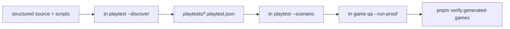
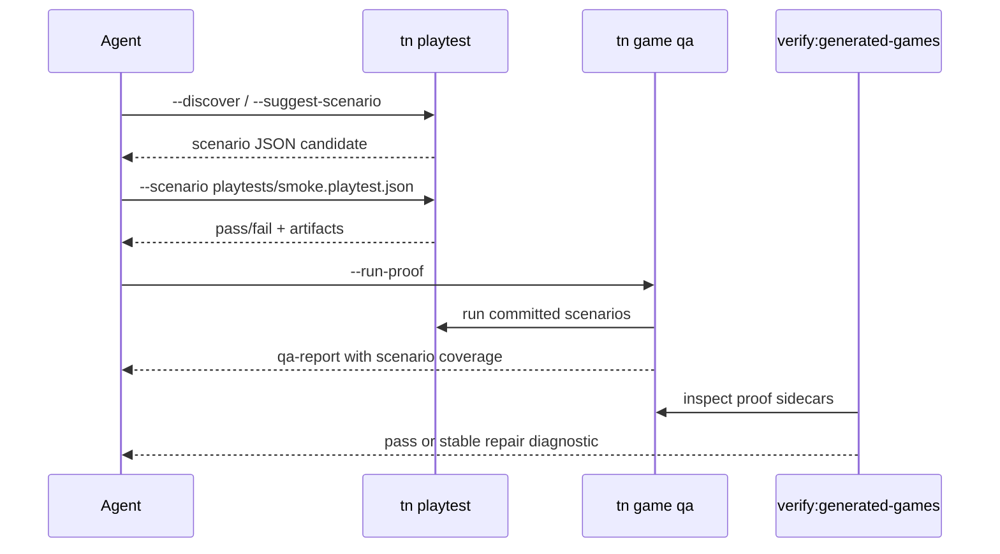

# PRD: Agent Proof Loop Scenario Ratchet

`Planning Mode: Principal Architect`
`Complexity: 8 -> HIGH mode`

Score basis: +3 touches 10+ files across CLI, templates, examples, and
verify-tools; +2 multi-package proof gates; +2 stateful watch/discovery and
artifact behavior; +1 release-gate impact.

## 1. Context

**Problem:** `tn playtest` is the right agent feedback loop, but the roadmap
requires every maintained starter/example to carry scenario proof and for
generated-game gates to reject projects that only prove one-shot movement.

**Files Analyzed:**

- `docs/status/ROADMAP.md`
- `docs/audits/FOUNDATIONAL_BOTTLENECK_AUDIT_2026-07-05.md`
- `packages/cli/src/commands/playtest.ts`
- `packages/cli/src/commands/playtestScenario.ts`
- `packages/cli/src/commands/playtest.test.ts`
- `packages/cli/src/commands/gameQaProof.ts`
- `tools/verify/src/gameProductionGateProofs.ts`
- `tools/verify/src/gameProductionGate.test.ts`
- `templates/structured-source-starter/AGENTS.md`
- `templates/racing-kit-rally-starter/threenative.config.json`

**Current Behavior:**

- Scenario files, discovery, rich assertions, stable artifacts, and watch-mode
  hooks exist in the CLI surface.
- `tn game plan --apply --json` now creates scaffold-first, scenario-backed
  starter source for the collector and lane-runner paths before agent patching.
- Compact playtest reports, artifact-backed deep logs, and agent IO budget
  gates now exist; new proof-loop output must preserve those token constraints.
- `tn game qa --run-proof` discovers `playtests/*.playtest.json` and falls
  back to one-shot playtest flags when no scenario exists.
- Generated-game gates still need a final ratchet so scaffold-first and
  generated-game release paths require committed scenario proof rather than
  accepting ephemeral one-shot movement proof.
- Native scenario execution is intentionally out of scope here; that belongs
  to `native-parity-closure-and-proof-loop.md`.

## Pre-Planning Findings

**How will this feature be reached?**

- [x] Entry point identified: `tn playtest --scenario`,
  `tn playtest --discover`, `tn game qa --run-proof`, and
  `pnpm verify:generated-games`.
- [x] Caller file identified:
  `packages/cli/src/commands/gameQaProof.ts` and
  `tools/verify/src/gameProductionGateProofs.ts`.
- [x] Registration/wiring needed: verify-tools gate checks, template scenario
  files, example scenario files, docs/template instructions.

**Is this user-facing?**

- [x] YES. Agents and users see stronger playtest diagnostics and template
  proof files.
- [ ] NO.

**Full user flow:**

1. User or agent creates/edits a game.
2. They run `tn playtest --scenario playtests/smoke.playtest.json --json`.
3. `tn game qa --run-proof` runs all committed scenarios before broader QA.
4. `verify:generated-games` rejects missing/stale scenario proof and points
   to the exact scenario or artifact that must be repaired.

## 2. Solution

**Approach:**

- Treat committed scenario playtests as the default proof artifact for any
  generated game or maintained starter.
- Treat scaffold-first output as a first-class caller: generated projects from
  `tn game plan --apply --json` must include committed scenarios and compact
  reproduction commands from the start.
- Keep one-shot flags backward-compatible, but downgrade them to fallback
  smoke evidence that cannot satisfy generated-game release gates when a
  project has enough source to infer a scenario.
- Extend QA and verify reports with scenario coverage: scenarios discovered,
  scenarios run, assertion types covered, artifacts produced, and compact
  reproduction command. Deep effect logs stay artifact-backed, not stdout.
- Add scenario files to maintained starter/example projects and update
  templates so new generated projects inherit the proof loop.

**Key Decisions:**

- [x] Existing `--entity/--press` one-shot flags remain supported and are
      internally treated as an ephemeral scenario.
- [x] Committed scenario files are required for maintained starters and
      generated-game release proof.
- [x] Native targets remain out of scope for this PRD under the 2026-07-07
      native parity freeze. Webview packaging is the desktop fallback; native
      proof-harness-backed scenarios require a separate shipped-game need before
      new Bevy parity work resumes.
- [x] Scenario artifact bundles must include `summary.json`, screenshots,
      effect log, manifest, diagnostics, and reproduction command.

**Data Changes:** Add or update `playtests/*.playtest.json` source files in
templates/examples. No IR schema changes.

## 3. Sequence Flow

## 4. Execution Phases

#### Phase 1: Scenario Coverage Report - QA tells agents which committed playtests ran.

**Files (max 5):**

- `packages/cli/src/commands/gameQaProof.ts` - add scenario coverage block to
  QA proof output.
- `packages/cli/src/commands/gameQaProof.test.ts` - cover multiple scenario
  discovery and one-shot fallback reporting.
- `tools/verify/src/gameProductionGateProofs.ts` - read coverage from QA
  sidecar.
- `tools/verify/src/gameProductionGate.test.ts` - accepted/rejected proof
  coverage fixtures.

**Implementation:**

- [ ] Record discovered scenario paths, run status, assertion ids, artifact
      directory, and reproduction command for each playtest proof step.
- [ ] Mark one-shot fallback as `coverage.kind: "ephemeral"`.
- [ ] Emit stable diagnostics when a scenario path is missing or failed.

**Tests Required:**

| Test File | Test Name | Assertion |
|-----------|-----------|-----------|
| `packages/cli/src/commands/gameQaProof.test.ts` | `should report committed scenario coverage when QA runs playtests` | QA JSON lists every scenario and artifact directory |
| `tools/verify/src/gameProductionGate.test.ts` | `should reject generated-game proof with only ephemeral playtest coverage` | diagnostic points to missing committed scenario |

**User Verification:**

- Action: run `tn game qa --project examples/humanoid-physics-course --run-proof --json`.
- Expected: QA output includes both humanoid course scenarios and their
  artifact directories.

#### Phase 2: Starter And Example Scenario Baseline - Maintained projects carry runnable scenario files.

**Files (max 5):**

- `templates/structured-source-starter/playtests/smoke-movement.playtest.json`
  - committed starter proof.
- `templates/structured-source-starter/playtests/native-smoke-movement.playtest.json`
  - committed desktop proof-harness fixture.
- `templates/racing-kit-rally-starter/playtests/rally-throttle.playtest.json`
  - committed starter proof.
- `templates/*/threenative.config.json` - proof commands prefer scenarios.
- `examples/*/playtests/*.playtest.json` - add missing scenario files only for
  maintained generated-game examples.
- Template `AGENTS.md` / `README.md` docs - scenario-first proof loop.

**Implementation:**

- [ ] Convert template one-shot proof commands to scenario commands.
- [ ] Keep one-shot command examples as fallback docs only.
- [ ] Ensure every committed scenario uses valid `KeyboardEvent.code` values
      accepted by the CLI runner.

**Tests Required:**

| Test File | Test Name | Assertion |
|-----------|-----------|-----------|
| `tools/verify/src/templateProductionGate.test.ts` | `should require starter scenario proof commands` | templates reference `--scenario playtests/...` |
| `packages/cli/src/commands/playtest.test.ts` | `should run template scenario files` | scenario loader accepts template JSON |

**User Verification:**

- Action: `tn create scratch && cd scratch && tn game qa --run-proof --json`.
- Expected: QA runs the inherited smoke scenario without needing manual
  `--entity` / `--press` flags.

#### Phase 3: Generated-Game Gate Ratchet - Release gates reject missing scenario proof.

**Files (max 5):**

- `tools/verify/src/gameProductionGateProofs.ts` - enforce committed
  scenario proof for generated games.
- `tools/verify/src/gameProductionGate.test.ts` - negative cases for one-shot
  proof, stale artifacts, and missing scenario files.
- `tools/verify/src/gameProductionGateTestUtils.ts` - fixture helper update.
- `docs/STATUS.md` - record promoted proof-loop ratchet.
- `docs/bevy-feature-parity.md` - note web-only target under the native parity
  freeze and link the webview desktop fallback.

**Implementation:**

- [ ] Require at least one committed scenario under `playtests/` when project
      metadata says generated game or maintained starter.
- [ ] Require the scenario artifact manifest to match the scenario name and
      current source hash.
- [ ] Keep a repair hint that can be executed directly.

**Tests Required:**

| Test File | Test Name | Assertion |
|-----------|-----------|-----------|
| `tools/verify/src/gameProductionGate.test.ts` | `should reject stale scenario proof sidecar` | diagnostic includes scenario path and rerun command |
| `tools/verify/src/gameProductionGate.test.ts` | `should accept committed scenario proof with fresh manifest` | gate passes |

**User Verification:**

- Action: `pnpm verify:generated-games`.
- Expected: generated-game report lists scenario proof coverage for every
  maintained generated-game project.

#### Phase 4: Agent Watch Loop Polish - Watch mode produces concise repair events.

**Files (max 5):**

- `packages/cli/src/commands/playtest.ts` - compact JSON event stream for
  `--watch`.
- `packages/cli/src/commands/playtest.test.ts` - event ordering and
  `--pass-once` coverage.
- `docs/workflows/playtest-proof.md` - document watch loop event contract.
- `templates/_shared/AGENT_GAME_PLAN.md` - prefer watch loop during repair.

**Implementation:**

- [ ] Emit line-delimited `start`, `diagnostic`, `artifact`, `pass`, and
      `fail` events in watch mode.
- [ ] Keep full JSON report on final run.
- [ ] Include the smallest next repair command in failed events.

**Tests Required:**

| Test File | Test Name | Assertion |
|-----------|-----------|-----------|
| `packages/cli/src/commands/playtest.test.ts` | `should emit watch repair events with stable ids` | event stream is ordered and parseable |

**User Verification:**

- Action: `tn playtest --scenario playtests/smoke.playtest.json --watch --json`.
- Expected: each source edit produces one concise JSON event group and a
  stable artifact directory.

## 5. Verification Strategy

- `pnpm --filter @threenative/cli test -- --run playtest`
- `pnpm --filter @threenative/verify-tools test -- --run gameProductionGate`
- `pnpm verify:template-production`
- `pnpm verify:generated-games`
- `pnpm check:docs`

## 6. Acceptance Criteria

- [ ] Every maintained starter/generated-game example has at least one
      committed scenario playtest.
- [ ] `tn game qa --run-proof` reports scenario coverage and artifact paths.
- [ ] `verify:generated-games` rejects projects with only ephemeral one-shot
      movement proof.
- [ ] Watch-mode JSON events are stable and documented.
- [ ] Native target limitations remain explicit and point to the native parity
      PRD rather than being silently skipped.
