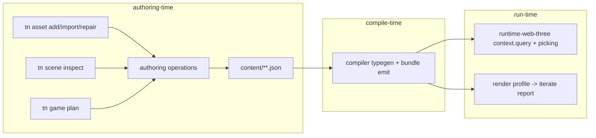

# PRD-001: Authoring Friction Fixes From The Chess Codex Trial

`Planning Mode: Principal Architect`
`Complexity: 3 (10+ files) + 2 (multi-package) + 2 (runtime/compiler state logic) = 7 -> HIGH mode`

Source evidence: `docs/PRDs/done/chess-trial-remediation-2026-07-12/AUTHORING-TRIAL-CHESS-CODEX-2026-07-12.md`
(findings C1-C7, C9, C10). Playtest-loop findings (C8 and related) are owned
by `PRD-002-playtest-loop-trust-and-visual-proof.md` in this bundle.

Phases are independently landable and ordered by trial cost. Each phase is a
vertical slice with its own verification; stop-and-checkpoint after each.

---

## 1. Context

**Problem:** Three Codex authoring sessions on `examples/chess` burned most of
their effort on ten engine/CLI frictions: silent custom-component query
failure, GLB-subtree picking misses, an invisible render profile regrading
textures, late asset-type validation, missing import/conversion tooling,
undocumented schema vocabulary, missing unlit/backdrop/material-patch
primitives, a game-plan path bug, scaffold residue, and camera-mode opacity.

**Files analyzed (exploration evidence):**

- `packages/runtime-web-three/src/systems/context.ts` (query: 715-718,
  matchesQuery: 1626-1630; picking services: 900-912)
- `packages/runtime-web-three/src/systems/services/picking.ts` (pickMesh:
  26-69) and `picking.test.ts`
- `packages/runtime-web-three/src/mapWorld.ts` (attachLoadedModel: 666-694)
- `packages/compiler/src/typegen.ts` (collectProjectSchemas: 149-159,
  ProjectComponentMap emission: 51-67)
- `packages/script-stdlib/src/script-context.ts` (ScriptContext: 24-75, no
  `picking`) vs `packages/runtime-web-three/src/systems/contextTypes.ts`
  (picking declared: 197-200)
- `packages/authoring/src/iterateReport.ts` (IIterateReport, no profile field)
- `packages/ir/src/runtimeConfig.ts` (RENDER_LOOK_PROFILE_PRESETS: 142-183),
  `packages/authoring/src/operations/sharedA.ts:474` (cinematic default)
- `packages/cli/src/commands/asset.ts` (assetCommand: 198-242, usage string
  line 220, gltfMetadataDiagnostics: 556-574)
- `packages/authoring/src/operations/assets.ts` (addAsset: 378-410)
- `packages/sdk/src/assets.ts` (AssetKind line 3, assetRef format sets:
  468-478, `TN_SDK_ASSET_FORMAT_UNSUPPORTED` throw at 475)
- `packages/compiler/src/gltf/metadata.ts` (gltfMaterialExtensionStatus:
  362-370)
- `packages/cli/src/assetSourceCatalog/catalog.ts` (searchAssetSources:
  104-112, scoreWord: 501-526, isDirectDownload/downloadUrl fields: 36, 43)
- `packages/compiler/src/emit/bundle.ts` (parseSourceInputBinding: 695-713)
- `packages/authoring/src/operations/sharedD.ts` (input binding validation:
  1062-1119; texture wrap enum: 385-395; inspectSceneNode: 822-850)
- `packages/authoring/src/operations/sharedC.ts` (validateTransform: 540-567)
- `packages/authoring/src/operations/materialValidation.ts` (kind set: 43,
  85-88)
- `packages/runtime-web-three/src/presentation.ts` (setMaterial: ~242)
- `packages/cli/src/commands/game.ts` (gamePlanCommand: 174-256,
  planArtifactPath: 254, buildPlanDiagnostics: 2209-2236),
  `packages/cli/src/commands/gameShared.ts` (resolveProjectPath: 3-7)
- `packages/cli/src/templates/registry.ts` (10-21),
  `templates/structured-source-starter/` (~76 files)

**Current behavior (condensed):**

- `matchesQuery` does bare key lookups; unknown component names silently
  return empty/wrong results, and `typegen.ts` only collects components from
  `.schema.json`, so scene-declared custom components type as `never`.
- `pickMesh` iterates world-IR entities and AABBs only; GLB descendants
  attached via `attachLoadedModel` carry no entity association, so
  ignore-by-entity-id cannot exclude them and hits cannot resolve to owners.
- `tn iterate` output never states the active render-look profile; the
  starter default is `cinematic`, which regrades authored textures.
- `tn asset add --type glb` writes the document untouched; the mismatch only
  surfaces at build as `TN_SDK_ASSET_FORMAT_UNSUPPORTED`. No import/convert
  or repair command exists. Catalog `scoreWord` weights all fields equally,
  so "chess piece" matches track pieces.
- Input-binding micro-syntax (`"pointer.0"`) is undocumented; `wrapS:
  "clamp"` and quaternion rotations are rejected without aliases; the generic
  `TN_AUTHORING_SHAPE_INVALID` fix snippet can point at unrelated cookbook
  entries.
- No `unlit` material kind, no scene backdrop node, no script-facing material
  patch API (hover feedback shipped as a scale hack).
- `tn game plan` wrote artifacts to a doubled `examples/chess/examples/chess`
  path; off-recipe plans emit collector-template proof commands and
  `TN_GAME_PLAN_SOURCE_DEFAULT_FALLBACK` noise. No minimal create template.
- `inspectSceneNode` returns raw component JSON; camera mode/fov is not
  summarized anywhere.

## 2. Solution

**Approach:**

- Make silent failures loud at the earliest owning surface: query-time
  diagnostics for unknown components, add-time asset type/format validation,
  iterate-time render-profile reporting.
- Close the entity-association gap for imported GLB subtrees so picking
  ignore/resolve semantics operate on whole entities.
- Extend the authoring vocabulary where agents predictably guess (aliases,
  quaternion conversion, correct fix snippets, one syntax doc page).
- Add the three missing visual primitives at the smallest portable scope:
  `unlit` material kind, `tn asset import`/`repair`, and a bounded script
  material-patch command.
- Fix the two off-recipe paper cuts (plan path doubling, honest off-recipe
  degradation) and add a minimal starter template.

**Key decisions:**

- [x] Query fix is diagnostic-first, not registry-gated: unknown component
  names in `query.with/without/changed` emit a once-per-system runtime
  diagnostic instead of silently matching nothing. Typegen additionally
  learns scene-declared components so typings stop collapsing to `never`.
- [x] Picking fix lives at the association layer (`userData.entityId` on GLB
  descendants + owner resolution in pick paths), not per-call workarounds.
- [x] Conversion uses `assimpjs` as an optional CLI dependency (already
  proven viable by the trial's hand-rolled pipeline); absence degrades to a
  clear `TN_ASSET_IMPORT_CONVERTER_MISSING` diagnostic.
- [x] New CLI commands (`asset import`, `asset repair`) are registered in the
  owning CLI command registry first, per repo adapter-list rules; help,
  dispatch, and MCP parity derive from it.
- [x] `unlit` ships web-first with a stable native diagnostic (native parity
  work is freeze-gated per PRD-018/019); documented in the capability doc.
- [x] Script material patching follows the existing bounded-command pattern
  (like particles/audio facades): declared command, effect-log evidence, both
  script-stdlib implementations (`src/*.ts` and `src/bundle-source.ts`) kept
  in parity as `index.test.ts` requires.
- [x] Backdrop/skybox scene node is explicitly deferred: `SkyboxDeclaration`
  and `EnvironmentMapDeclaration` already exist in
  `packages/sdk/src/environment.ts`; the gap is a scene-level image backdrop,
  which needs its own design pass (tracked as a follow-up, not a phase).

**Data changes:** additive IR/authoring schema changes only — `unlit`
material kind, optional `summary` on scene-inspect payloads, optional
`activeRenderProfile` on the iterate report, new asset-import provenance
fields. No migrations.

**Integration points:** every phase modifies an existing reachable surface
(`tn` CLI commands, runtime script context, compiler typegen). The two new
commands enter through the CLI command registry and are exercised by
conformance/smoke derivation from that registry. No orphaned code: each phase
names the caller that hits the new path.

### Architecture (where each fix sits)



---

## 3. Execution Phases

#### Phase 1: GLB subtree picking (C3) - clicking a piece resolves to its entity and ignore lists cover imported children

**Files (max 5):**

- `packages/runtime-web-three/src/mapWorld.ts` - in `attachLoadedModel()`
  (666-694), traverse `gltf.scene` and set `child.userData.entityId =
  <owning entity id>` on every descendant object.
- `packages/runtime-web-three/src/systems/services/picking.ts` - extend
  `pickMesh()` so a hit anywhere in an entity's subtree resolves to the
  owning entity id and `ignore` excludes the whole subtree. Where the AABB
  is computed from the authored mesh only, expand the tested volume to the
  entity object's world-space bounding box (which includes attached GLB
  children) so imported geometry cannot occlude without attribution.
- `packages/runtime-web-three/src/systems/services/picking.test.ts` - new
  cases below.
- `packages/runtime-web-three/src/mapWorld.test.ts` (or nearest existing
  mapWorld test) - descendant tagging assertion.

**Implementation:**

- [x] Tag descendants at attach time (single traversal, idempotent).
- [x] Resolve hits: any intersected object walks `userData.entityId` (or
  parent chain) to an owning entity before ranking; hits with no owner are
  reported as `entity: null` instead of shadowing an owned hit.
- [x] Apply `ignore` after owner resolution so entity ids exclude subtrees.

**Tests Required:**
| Test File | Test Name | Assertion |
|-----------|-----------|-----------|
| `picking.test.ts` | `should exclude glb child meshes when parent entity is ignored` | pick result skips subtree, hits square behind |
| `picking.test.ts` | `should resolve glb child hit to owning entity id` | `result.entity === "piece.wp1"` |
| `mapWorld.test.ts` | `should tag loaded model descendants with entity id` | every traversed mesh has `userData.entityId` |

**Verification plan:** `pnpm --filter @threenative/runtime-web-three test`;
then in `examples/chess`, temporarily restore a `picking.mesh`-based
selection path and run the committed opening playtest — click-select must
pass 10/10 pointer commits (manual browser check, this is the trial's live
complaint).

**User verification:** open the chess web preview, click pieces near edges
20 times; zero "click resolves to nothing" events.

Checkpoint: spawn `prd-work-reviewer` for phase 1 before phase 2.

#### Phase 2: Custom components are queryable and typed (C1) - `query({with:["ChessPiece"]})` works or fails loudly

**Files (max 5):**

- `packages/runtime-web-three/src/systems/context.ts` - in the query path
  (715-718/1626-1630), collect the set of component names present across
  `world.entities` plus schema components once per world build; when a
  `with`/`without`/`changed` name is in neither, push a once-per-system
  runtime diagnostic `TN_RUNTIME_QUERY_UNKNOWN_COMPONENT` (surfaced through
  the existing runtime-diagnostics channel that playtest/iterate already
  fail on).
- `packages/compiler/src/typegen.ts` - extend `collectProjectSchemas()`
  (149-159) with a second pass that walks scene documents' entity
  `components` maps and adds unknown component names to
  `ProjectComponentMap` as `Record<string, unknown>`-shaped entries (schema
  entries keep their precise fields and win on conflict).
- `packages/compiler/src/typegen.test.ts` - typegen cases.
- `packages/runtime-web-three/src/systems/context.test.ts` - runtime cases.

**Implementation:**

- [x] Runtime known-component set built once per world load, invalidated on
  spawn with novel component keys.
- [x] Diagnostic includes the unknown name and the nearest known name
  (levenshtein <= 2) as a `fix` hint.
- [x] Typegen: scene-declared components produce loose typings, not `never`;
  regenerating types in `examples/chess` must type `"ChessPiece"` queries.

**Tests Required:**
| Test File | Test Name | Assertion |
|-----------|-----------|-----------|
| `context.test.ts` | `should match entities on scene-declared custom components` | ChessPiece query returns tagged entities |
| `context.test.ts` | `should emit unknown-component diagnostic once when query names missing component` | diagnostic code `TN_RUNTIME_QUERY_UNKNOWN_COMPONENT`, emitted once across two ticks |
| `typegen.test.ts` | `should include scene-declared components in ProjectComponentMap` | generated source contains `ChessPiece` |
| `typegen.test.ts` | `should prefer schema field types over scene-inferred entries` | schema-typed fields survive |

**Verification plan:** package tests; then `node bin/tn types generate` in
`examples/chess` and `pnpm typecheck` there — the `ChessContext` cast for
query typing becomes unnecessary (do not edit the example in this PRD; just
prove the types compile).

Checkpoint: `prd-work-reviewer` phase 2.

#### Phase 3: ScriptContext service typing parity (C1d) - `context.picking` typechecks

**Files (max 5):**

- `packages/script-stdlib/src/script-context.ts` - add `picking: {
  mesh(options: PickMeshRequest): PickMeshResult; pointerRay(...): ... }`
  mirroring `contextTypes.ts:197-200`, with the request/result types
  exported from a shared location (move/re-export, do not duplicate).
- `packages/script-stdlib/src/index.test.ts` - extend the existing
  parity assertions to cover the new surface.
- `packages/runtime-web-three/src/systems/contextTypes.ts` - re-point to the
  shared types if they move.

**Implementation:**

- [x] Single source of truth for pick request/result types; both packages
  import it.
- [x] Audit `ScriptContext` against `ISystemContext` and add a drift test
  that fails when the runtime context exposes a service key missing from
  `ScriptContext` (explicit allowlist for intentionally-internal services),
  per the repo no-second-hand-list rule.

**Tests Required:**
| Test File | Test Name | Assertion |
|-----------|-----------|-----------|
| `script-stdlib/src/index.test.ts` | `should expose every runtime context service on ScriptContext or allowlist` | drift test passes; removing `picking` fails it |

**Verification plan:** `pnpm --filter @threenative/script-stdlib test`;
`pnpm typecheck` in `examples/chess` with the local `ChessContext` picking
cast removed locally (throwaway check).

Checkpoint: `prd-work-reviewer` phase 3.

#### Phase 4: Render profile surfaced in iterate (C4) - agents see what is grading their pixels

**Files (max 5):**

- `packages/authoring/src/iterateReport.ts` - add optional
  `activeRenderProfile?: string` to `IIterateReport`.
- `packages/cli/src/commands/iterate.ts` - after the build step (111-122),
  read the resolved runtime config's `renderer.renderLook.profile` and set
  the field; when profile is not `parity` AND the validate/build step saw
  changes in `content/materials/**` or texture assets, push a `warning`
  diagnostic `TN_RENDER_PROFILE_GRADING_ACTIVE` with the profile name and
  the one-line fix (`tn runtime set-rendering default --render-profile
  parity`).
- `packages/cli/src/commands/iterate.test.ts` - cases below.
- `docs/status/capabilities/<rendering capability doc>.md` +
  `docs/STATUS.md` index line - document the surfaced field (required by
  repo capability rules).

**Implementation:**

- [x] Field always present in `--json` output when a bundle was produced.
- [x] Warning is advisory (does not flip iterate to fail).
- [x] Human (non-json) output prints `render profile: cinematic` in the
  screenshot step line.

**Tests Required:**
| Test File | Test Name | Assertion |
|-----------|-----------|-----------|
| `iterate.test.ts` | `should report active render profile in iterate json` | `report.activeRenderProfile === "cinematic"` |
| `iterate.test.ts` | `should warn when material edits run under a grading profile` | diagnostic `TN_RENDER_PROFILE_GRADING_ACTIVE`, severity warning |
| `iterate.test.ts` | `should not warn under parity profile` | no such diagnostic |

**Verification plan:** package tests; run `node bin/tn iterate --project
examples/chess --json` and confirm the field appears (chess is now on
`parity`, so also flip a scratch project to `cinematic` to see the warning).

Checkpoint: `prd-work-reviewer` phase 4.

#### Phase 5: Asset add-time validation (C5.1) - `--type glb` fails at add, not at build

**Files (max 5):**

- `packages/authoring/src/operations/assets.ts` - in `addAsset()` (378-410),
  validate `options.type` against the SDK-owned kind set and, when a `path`
  is provided, validate its extension against the SDK format set for that
  kind. Reject with `TN_AUTHORING_ASSET_TYPE_INVALID` carrying a fix snippet
  (`--type model` for `.glb`, inferred from extension).
- `packages/sdk/src/assets.ts` - export the kind->formats map (it currently
  lives inline in `assetRef()`, 468-478) so authoring imports it instead of
  duplicating (no second hand-maintained list).
- `packages/cli/src/commands/asset.ts` - align the usage string (line 220)
  with the exported kinds; drop or map the phantom `mesh` type.
- `packages/authoring/src/operations.test.ts` (or new
  `operations/assets.test.ts`) - cases below.

**Implementation:**

- [x] `--type glb --path x.glb` -> error with fix `--type model`.
- [x] `--type model --path x.dae` -> error naming supported formats and
  pointing at `tn asset import` (phase 6).
- [x] Existing valid calls unchanged (regression: chess `--type model` adds).

**Tests Required:**
| Test File | Test Name | Assertion |
|-----------|-----------|-----------|
| `operations/assets.test.ts` | `should reject unsupported asset type at add time` | `TN_AUTHORING_ASSET_TYPE_INVALID`, fix snippet suggests `model` |
| `operations/assets.test.ts` | `should reject format mismatch for kind at add time` | `.dae` under `model` rejected with supported list |
| `operations/assets.test.ts` | `should accept model glb add unchanged` | `TN_ASSET_OK` |

**Verification plan:** package tests; CLI proof: `node bin/tn asset add
scratch.asset --type glb --path assets/foo.glb --json` returns the error in
one command instead of two.

Checkpoint: `prd-work-reviewer` phase 5.

#### Phase 6: `tn asset import` (C5.2) - one command from .dae/.obj/.fbx to a registered GLB

**Files (max 5):**

- CLI command registry (owning source per
  `docs/PRDs/done/other/adapter-surface-remediation-2026-07-08/`) - register
  `asset import` first; help/dispatch derive from it.
- `packages/cli/src/commands/assetImport.ts` (new) - `tn asset import
  <source-path-or-url> --id <asset-id> [--license <id>] [--attribution
  <text>] [--variant name=hexColor ...] --json`: convert via `assimpjs`
  (optional dependency; emit `TN_ASSET_IMPORT_CONVERTER_MISSING` with
  install instructions when absent), rewrite/strip non-relative texture
  URIs (the trial's `C:/3D Work/...` case), optionally emit per-variant
  GLBs with injected `baseColorFactor`, write provenance (source, license,
  attribution) into the asset record, then delegate registration to the
  phase-5-validated `addAsset()`.
- `packages/cli/src/commands/assetImport.test.ts` - cases below, using a
  small committed `.dae` fixture.
- `packages/authoring/src/operations/assets.ts` - accept the provenance
  fields (additive).

**Implementation:**

- [x] Conversion, texture-path repair, variant injection, registration, and
  a summary (`TN_ASSET_IMPORT_OK`) in one command.
- [x] License flag required for non-local URLs (catalog-first rules).
- [x] Failure surfaces the assimp error verbatim under
  `TN_ASSET_IMPORT_CONVERT_FAILED`.

**Tests Required:**
| Test File | Test Name | Assertion |
|-----------|-----------|-----------|
| `assetImport.test.ts` | `should convert dae fixture to glb and register model asset` | output GLB exists, document contains asset with provenance |
| `assetImport.test.ts` | `should strip absolute texture uris during import` | no `C:/` URIs in output GLB JSON |
| `assetImport.test.ts` | `should emit variant glbs with base color factors` | `--variant white=#f0f0f0` produces second GLB |
| `assetImport.test.ts` | `should fail with converter-missing diagnostic when assimpjs absent` | `TN_ASSET_IMPORT_CONVERTER_MISSING` |

**Verification plan:** package tests; end-to-end: re-import one Viliami
chess `.dae` in a scratch project and `tn iterate` it to a nonblank
screenshot. Manual checkpoint (visual): confirm the imported piece renders.

Checkpoint: `prd-work-reviewer` phase 6 (+ manual visual check).

#### Phase 7: `tn asset repair --strip-extensions` (C5.3) - unsupported glTF extensions are fixable, not just reported

**Files (max 5):**

- CLI command registry - register `asset repair`.
- `packages/cli/src/commands/assetRepair.ts` (new) - read a GLB/GLTF, remove
  material extensions classified `unsupported` by
  `gltfMaterialExtensionStatus()` (compiler `gltf/metadata.ts:362-370`),
  write in place with `--backup` default-on, report what was stripped
  (`TN_ASSET_REPAIR_OK`).
- `packages/cli/src/commands/asset.ts` - in `gltfMetadataDiagnostics()`
  (556-574), attach a fix pointing at `tn asset repair <path>
  --strip-extensions` to the existing
  `TN_ASSET_GLTF_EXTENSION_UNSUPPORTED` warning.
- `packages/cli/src/commands/assetRepair.test.ts` - cases below.

**Tests Required:**
| Test File | Test Name | Assertion |
|-----------|-----------|-----------|
| `assetRepair.test.ts` | `should strip unsupported material extensions from glb` | `KHR_materials_ior` absent after repair, promoted extensions retained |
| `assetRepair.test.ts` | `should write backup before repairing` | `<file>.bak` exists with original bytes |
| `asset.test.ts` (inspect) | `should attach repair fix to unsupported extension warning` | fix references `tn asset repair` |

**Verification plan:** package tests; repair the trial's failing catalog
floor GLB in a scratch dir and confirm `tn asset inspect` goes quiet on
extension warnings.

Checkpoint: `prd-work-reviewer` phase 7.

#### Phase 8: Catalog search relevance and compact output (C5.4)

**Files (max 5):**

- `packages/cli/src/assetSourceCatalog/catalog.ts` - `scoreWord()` (501-526):
  weight `directName`/`id`/`gameCategory` exact matches above generic
  substring hits; apply a multiplicative penalty when the query's category
  terms match no category/tag field (kills "chess piece" -> track pieces);
  rank `isDirectDownload: true` above index-only records at equal score.
- `packages/cli/src/commands/asset.ts` - search output (around 328/405):
  default to a compact record shape (id, name, format, license, directness,
  one-line note, score); move full records behind `--full`; cap default
  stdout per the token-budget PRD conventions.
- `packages/cli/src/assetSourceCatalog/catalog.test.ts` - cases below.

**Tests Required:**
| Test File | Test Name | Assertion |
|-----------|-----------|-----------|
| `catalog.test.ts` | `should rank category-matching records above incidental keyword hits` | chess query: chess-set record outranks track-piece record |
| `catalog.test.ts` | `should rank direct downloads above index-only records at equal score` | ordering assertion |
| `asset.test.ts` | `should emit compact search records by default and full records with --full` | default record has <= 8 keys |

**Verification plan:** package tests; run the trial's exact query
(`tn asset source search --query "chess piece" --format glb --direct-only
--json`) and eyeball that output is compact and relevant-or-empty.

Checkpoint: `prd-work-reviewer` phase 8.

#### Phase 9: Schema vocabulary and fix snippets (C6)

**Files (max 5):**

- `packages/authoring/src/operations/sharedD.ts` - (a) texture wrap
  (385-395): accept `"clamp"`/`"mirror"` aliases, normalize with a
  `warning` diagnostic; (b) input bindings (1062-1119): when a binding is a
  non-string object, reject with a **binding-specific** fix snippet showing
  the string micro-syntax for the same device
  (`{"device":"pointer","button":0}` -> `"pointer.0"`).
- `packages/authoring/src/operations/sharedC.ts` - `validateTransform`
  (540-567): when `rotation` is a 4-number finite vector, convert quaternion
  -> Euler (XYZ order, matching runtime conventions), apply, and emit
  `TN_AUTHORING_ROTATION_QUATERNION_CONVERTED` warning; keep hard rejection
  for other shapes.
- `packages/authoring/src/prescriptiveCodes.ts` - stop attaching the generic
  cookbook snippet to `TN_AUTHORING_SHAPE_INVALID` when a field-specific fix
  is present; a fix must reference the failing path's document kind or be
  omitted.
- `docs/contracts/input-binding-syntax.md` (new) - the full micro-syntax
  grammar (`device.control[.axis]`, devices, pointer buttons/axes, keyboard
  codes) with examples; link it from the starter API card generator so
  generated projects carry it.
- `packages/authoring/src/operations.test.ts` - cases below.

**Tests Required:**
| Test File | Test Name | Assertion |
|-----------|-----------|-----------|
| `operations.test.ts` | `should normalize clamp wrap alias with warning` | value becomes `clampToEdge`, warning emitted |
| `operations.test.ts` | `should convert quaternion rotation to euler with warning` | `[-0.7071,0,0,0.7071]` -> approx `[-1.5708,0,0]` |
| `operations.test.ts` | `should attach pointer binding fix snippet for object-form binding` | fix snippet contains `"pointer.0"` |
| `operations.test.ts` | `should not attach unrelated cookbook snippet to shape errors` | no `collectible-respawn` reference on input errors |

**Verification plan:** package tests + `pnpm check:docs` (new doc page).
Replay the trial's exact three failures as CLI calls; each must now return
either success-with-warning or a self-sufficient fix.

Checkpoint: `prd-work-reviewer` phase 9.

#### Phase 10: `unlit` material kind + script material patch (C7) - backdrops stop fighting lights; hover stops being a scale hack

Split into two sub-slices; land (a) before (b).

**(a) unlit kind — Files (max 5):**

- `packages/authoring/src/operations/materialValidation.ts` - add `unlit`
  to the kind set (43, 85-88).
- `packages/ir/src/types.ts` - extend the material IR union with `unlit`
  (color/map only; no lighting/emissive fields).
- `packages/runtime-web-three/src/presentation.ts` - map `unlit` to
  `THREE.MeshBasicMaterial` in the material factory (~242).
- Native adapter boundary: emit the existing stable
  unsupported-feature diagnostic pattern for `unlit` on the Bevy path
  (follow the audio/particle facade precedent) — native parity is
  freeze-gated.
- `docs/status/capabilities/<materials doc>.md` + `docs/STATUS.md` line.

**(b) material patch command — Files (max 5):**

- `packages/script-stdlib/src/feedback.ts` (+ mirrored
  `src/bundle-source.ts` — parity enforced by `index.test.ts`) - add
  `MaterialEx.patch(entityId, { color?, emissive?, emissiveIntensity?,
  opacity? })` emitting a declared `material.patch` command.
- `packages/runtime-web-three/src/systems/context.ts` (command intake) and
  the effect application site in `mapWorld.ts`/presentation - apply patches
  to the entity's cloned material (GLB override-merge semantics already
  exist for authored overrides; reuse them), record in the effect log.
- `packages/runtime-web-three/src/systems/context.test.ts` - cases below.

**Tests Required:**
| Test File | Test Name | Assertion |
|-----------|-----------|-----------|
| `materialValidation` tests | `should accept unlit material kind` | validate passes |
| `presentation.test.ts` | `should build MeshBasicMaterial for unlit kind` | instance check |
| `script-stdlib/index.test.ts` | `should keep bundle-source parity for MaterialEx` | existing parity harness covers new export |
| `context.test.ts` | `should apply material patch command to entity material and log effect` | emissive changes, effect log entry present |

**Verification plan:** package tests; visual proof in a scratch project:
unlit backdrop quad under colored lights renders the texture verbatim
(screenshot); hover-highlight via `MaterialEx.patch` visible in iterate
screenshot. Manual checkpoint (visual).

Checkpoint: `prd-work-reviewer` phase 10 (+ manual visual check).

#### Phase 11: Game plan honesty and path fix (C9.5/C9.6)

**Files (max 5):**

- `packages/cli/src/commands/gameShared.ts` - `resolveProjectPath()` (3-7):
  canonicalize the resolved path and add a regression test reproducing the
  doubled `examples/chess/examples/chess` artifact path (run with cwd inside
  the project and `--project .`; if the repro needs `INIT_CWD`, set it in
  the test).
- `packages/cli/src/commands/game.ts` - (a) assert/normalize before line 254
  so `planArtifactPath` never contains a repeated project segment; (b) when
  no kit candidate scores above threshold, emit
  `TN_GAME_PLAN_OFF_RECIPE` (info) naming the nearest archetype, suppress
  the collector-template `proofCommands`, and emit generic proof commands
  (`tn iterate`, committed-scenario playtest) instead; collapse the four
  `TN_GAME_PLAN_SOURCE_DEFAULT_FALLBACK` warnings into one summary
  diagnostic when all defaults fired together.
- `packages/cli/src/commands/gameScore.test.ts` - cases below.

**Tests Required:**
| Test File | Test Name | Assertion |
|-----------|-----------|-----------|
| `gameScore.test.ts` | `should not double project segments in plan artifact path` | path contains exactly one `examples/chess` |
| `gameScore.test.ts` | `should emit off-recipe diagnostic and generic proof commands for unmatched goal` | `TN_GAME_PLAN_OFF_RECIPE`, no `coin-pickup` reference |
| `gameScore.test.ts` | `should collapse all-default fallback warnings into one` | single fallback diagnostic |

**Verification plan:** package tests; rerun the trial's exact command from
inside `examples/chess` and check the artifact lands once.

Checkpoint: `prd-work-reviewer` phase 11.

#### Phase 12: Minimal starter template (C9.7) - off-recipe games start clean

**Files (max 5):**

- `packages/cli/src/templates/registry.ts` - register
  `structured-source-minimal` (registry-first rule).
- `templates/structured-source-minimal/` (new) - derived from
  `structured-source-starter` minus: `arena` scene content beyond one empty
  scene, `src/scripts/player.ts`, `src/scripts/lib/movement.ts`, the four
  starter playtests, `assets/goal-ping.wav`, prefab content, and the
  `recipe:controller` script; keep AGENTS/CLAUDE/API-CARD/config/iterate
  wiring and one empty-scene smoke playtest so `tn iterate` is green at
  create time.
- `packages/cli/src/commands/create.test.ts` - cases below.
- Template manifest/enrollment (whatever drift test guards the template
  list) - enroll the new template.

**Tests Required:**
| Test File | Test Name | Assertion |
|-----------|-----------|-----------|
| `create.test.ts` | `should create minimal starter without gameplay residue` | no `player.ts`, no `goal-ping.wav`, no starter playtests |
| `create.test.ts` | `should iterate green immediately after minimal create` | `TN_ITERATE_OK` on fresh minimal project |

**Verification plan:** package tests + `pnpm verify:smoke` (template
enrollment); scratch-create a minimal project and run `tn iterate`.

Checkpoint: `prd-work-reviewer` phase 12.

#### Phase 13: Camera inspect summary (C10) - orthographic can't hide

**Files (max 5):**

- `packages/authoring/src/operations/sharedD.ts` - `inspectSceneNode()`
  (822-850): when the matched entity has a camera component, add a
  `summary` field: `{ mode, fovY|size, near, far, position, rotation }`.
- `packages/cli/src/commands/scene.ts` - print the summary line first in
  human output (`camera.main: orthographic size=10.6 ...`).
- `packages/authoring/src/operations.test.ts` - cases below.
- `docs/` API card generator - document `fovY` (perspective) vs `size`
  (orthographic) component shapes.

**Tests Required:**
| Test File | Test Name | Assertion |
|-----------|-----------|-----------|
| `operations.test.ts` | `should summarize camera mode and lens on scene inspect` | summary has `mode: "orthographic"`, `size` |
| `scene` CLI test | `should print camera summary line in human output` | stdout starts with mode |

**Verification plan:** package tests; `node bin/tn scene inspect chess
--node camera.main --json` in `examples/chess` shows the summary.

Checkpoint: `prd-work-reviewer` phase 13.

---

## 4. Deferred (explicitly out of scope)

- **Scene backdrop/skybox image node** (C7b): needs a design pass over
  `packages/sdk/src/environment.ts` skybox declarations vs a new scene node
  kind; capture as its own PRD when picked up.
- **Generator-owned content contract** (C2): architectural; overlaps
  `docs/PRDs/done/other/editor-ready-modular-authoring-and-scripting-architecture.md`.
  Do not band-aid in this PRD.
- **Bevy-side unlit/material-patch parity**: freeze-gated by the native path
  decision (PRD-018/019); stable diagnostics only.

## 5. Verification Strategy (whole PRD)

Narrowest-first per repo rules, after each phase:

```bash
pnpm --filter <touched-package> test
pnpm typecheck
pnpm test
pnpm check:docs          # phases 4, 9, 10a, 13 (docs touched)
pnpm verify:conformance  # phases 1-3, 10 (runtime behavior)
pnpm verify:smoke        # phases 6, 7, 12 (new commands/template)
```

Evidence to record per phase in this file after landing: test counts, the
replayed trial command and its new output, and screenshots for phases 6/10.

## 6. Acceptance Criteria

- [x] All 13 phases landed with their tests passing.
- [x] Every trial failure replay (documented per phase) now yields either
  success or a self-sufficient diagnostic in one command.
- [x] New commands exist in the CLI command registry with derived help and
  smoke enrollment; no hand-duplicated adapter lists.
- [x] `docs/status/capabilities/*` and `docs/STATUS.md` updated for phases
  4 and 10a; `pnpm check:docs` green.
- [x] All `prd-work-reviewer` checkpoints reported PASS.
- [x] `examples/chess` still iterates green (regression guard).

## 7. Completion Evidence (2026-07-12)

- Package suites: authoring 82/82, compiler 257/257, runtime-web-three
  408/408, plus focused CLI, IR, script-stdlib, and Bevy boundary tests.
- Every related commit passed the pre-commit smoke gate, including the example
  build sweep. `pnpm check:docs` and `pnpm verify:cookbook` are green.
- Clean chess regression: `tn iterate` returned `TN_ITERATE_OK`; validation,
  build, screenshot, `chess-capture-hud`, and `chess-opening` all passed.
- Picking: a clean-HEAD scratch copy temporarily used `picking.mesh`; 20/20
  near-edge browser clicks resolved to owned pieces with no page or runtime
  errors. The reviewer marked phases 1-4 PASS.
- Custom-component typing: clean chess `tn types generate` followed by
  `tsc --noEmit` passed without a query-context cast.
- Asset import: the DAE fixture imported as a registered GLB and `model-test`
  captured a nonblank screenshot with five visible meshes. Repair proof showed
  `KHR_materials_ior` as unsupported before repair, then only promoted
  `KHR_materials_clearcoat` and zero extension diagnostics after repair.
- Catalog replay: the exact `chess piece` query ranked the CC0 Chess Set first;
  compact output remained below the ten-record cap.
- Material proof: a scratch structured-source project built a textured `unlit`
  surface under colored lights and imported `MaterialEx`; `material.patch`
  visibly changed it to magenta while retaining the texture grid. The manual
  screenshot checkpoint and reviewer passed. The Bevy unlit diagnostic test
  locks code, path, and freeze-gate suggestion.
- Minimal template: a real fresh create (not mocked capture/playtest) returned
  `TN_ITERATE_OK` with visual and gameplay verdicts passing.
- Reviewer checkpoints: phases 1-4, 5-9, and 10-13 all reported PASS after
  their corrective re-reviews.

Known unrelated baseline: the aggregate clean-worktree `pnpm test` run exposed
one pre-existing compiler lifecycle expectation mismatch, and aggregate
`pnpm build`/`pnpm typecheck`/`pnpm verify:conformance` were blocked in that
detached checkout by missing editor build outputs. The touched package suites,
pre-commit smoke gates, docs gate, cookbook gate, real chess iterate, real
minimal iterate, and feature-specific proofs above are green.
