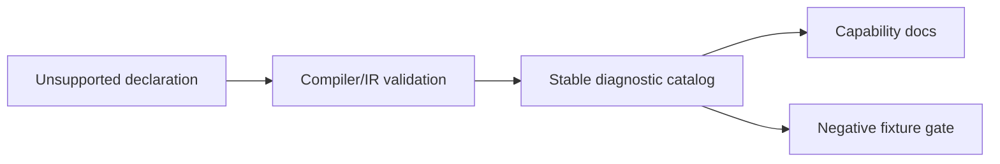
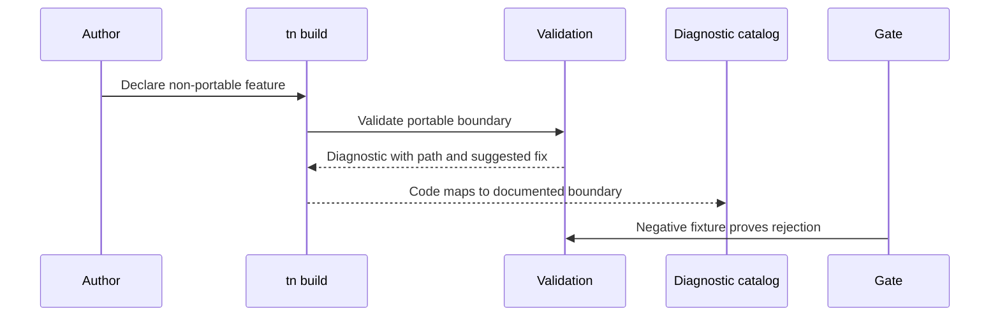

# PRD: External Services, Media, and Non-Portable Boundaries

Complexity: 9 -> HIGH mode

Score basis: +2 spans persistence, audio, networking, authoring boundaries, and
diagnostics, +2 adds policy/report schemas, +2 affects compiler/CLI/runtime
validation paths, +2 touches multiple packages and docs, +1 extends release
and docs gates.

## 1. Context

**Problem:** The remaining cloud, network media, alternate authoring, online
service, 2D workflow, and backend-only rows need stable boundary diagnostics so
future contributors do not mistake intentionally non-portable features for
missing implementation.

**Files Analyzed:**

- `docs/bevy-feature-parity.md`
- `docs/STATUS.md`
- `docs/PRDs/done/other/post-v10-persistence-hot-reload.md`
- `docs/PRDs/done/other/post-v10-production-audio-diagnostics-packaging.md`
- `/home/joao/.claude/skills/prd-creator/SKILL.md`

**Current Behavior:**

- Local save/settings persistence, autosave restore, local audio, mixer/effect
  reports, audio routing diagnostics, platform-native handle boundaries, and
  unsupported networking diagnostics are already promoted.
- Cloud save/account storage, custom audio decoders, streaming/network audio,
  direct Bevy authoring, raw Three.js authoring as source of truth, online
  services, 2D sprite/tile workflows, and backend-only feature claims remain
  unchecked.

## Pre-Planning Findings

No external credentials should be required. Any cloud or account behavior must
be represented as declarations and diagnostics unless a future PRD introduces a
portable service abstraction.

**How will this feature be reached?**

- [x] Entry point identified: SDK/IR unsupported-feature declarations,
  compiler diagnostics, CLI validation, runtime diagnostics, package/profile
  validation, docs checks, and release gates.
- [x] Caller file identified: compiler validators, IR schema validators, CLI
  build/verify paths, web and Bevy runtime diagnostic reporters, and docs
  drift tooling.
- [x] Registration/wiring needed: diagnostic catalog entries, capability
  boundary reports, negative fixtures, docs, and parity map updates.

**Is this user-facing?**

- [x] YES. Authors need actionable diagnostics when they try non-portable
  features.
- [ ] NO.

**Full user flow:**

1. User attempts to declare cloud save, custom decoder, streaming audio,
   networking, raw Three.js, direct Bevy, 2D workflows, or backend-only
   behavior.
2. Build/runtime validation rejects the declaration before it is ignored or
   partially executed.
3. Diagnostics explain the portable alternative, boundary reason, and future
   promotion route if any.
4. Docs and capability manifests keep AI agents and contributors inside the
   supported contract.

## 2. Solution

**Approach:**

- Convert remaining intentionally deferred rows into stable diagnostic
  boundaries before any new implementation work.
- Keep local/offline-first persistence and bundle-local media as the supported
  baseline.
- Reject executable decoders, arbitrary streams, account-bound storage,
  replication, collaboration, raw engine authoring, and 2D-only workflows with
  specific codes and suggestions.
- Add negative fixtures so release gates prove unsupported features fail
  intentionally.

**Key Decisions:**

- [x] Library/framework choices: reuse existing diagnostic model, capability
  reports, compiler validation, runtime diagnostics, and docs checks.
- [x] Error-handling strategy: fail fast with code, severity, path, boundary
  reason, and suggested portable alternative.
- [x] Reused utilities: negative fixtures, diagnostic catalog tests, docs drift
  checks, and release gate artifact validation.

**Data Changes:** Extend capability and diagnostic catalogs. No database
migrations.

## 3. Sequence Flow

## 4. Execution Phases

#### Phase 1: Cloud, Online, and Alternate Authoring Boundaries - Non-portable platform features fail clearly.

**Files (max 5):**

- `packages/ir/src/*` - boundary schema/diagnostic fixtures
- `packages/compiler/src/*` - unsupported declaration diagnostics
- `packages/cli/src/*` - build/verify diagnostic surfacing
- `tools/verify/src/*` - negative fixture checks
- `docs/*` - status, parity, and diagnostic docs

**Implementation:**

- [ ] Add stable diagnostics for cloud save/account-bound storage declarations.
- [ ] Add diagnostics for direct Bevy authoring and raw Three.js as source of
  truth.
- [ ] Add diagnostics for online services, replication, collaboration, and
  backend-only features.
- [ ] Keep unsupported-networking diagnostics aligned with existing runtime
  boundary evidence.

**Tests Required:**

| Test File | Test Name | Assertion |
| --- | --- | --- |
| `packages/compiler/src/boundary-diagnostics.test.ts` | `should reject cloud save declarations without portable storage provider` | Diagnostic includes portable local-save suggestion. |
| `packages/ir/src/boundary-diagnostics.test.ts` | `should reject direct Bevy authoring references in portable IR` | Diagnostic code is stable. |
| `tools/verify/src/boundary-diagnostics.test.ts` | `should require negative fixtures for online service diagnostics` | Gate fails when fixture is missing. |

**Verification Plan:**

1. Unit tests for each unsupported boundary.
2. Negative fixture gate.
3. Diagnostic catalog/docs check.
4. `pnpm verify:release` before marking deferred rows as checked diagnostics.

**User Verification:**

- Action: build negative fixtures that attempt cloud save and direct Bevy
  authoring.
- Expected: build fails with stable, actionable diagnostics.

#### Phase 2: Media and 2D Workflow Boundaries - Audio streams and out-of-scope 2D features are explicit.

**Files (max 5):**

- `packages/ir/src/*` - media/2D boundary validation
- `packages/compiler/src/*` - media/2D diagnostics
- `packages/runtime-web-three/src/*` - runtime diagnostic reporting
- `runtime-bevy/src/*` - runtime diagnostic reporting
- `docs/*` - capability docs and parity map updates

**Implementation:**

- [ ] Add stable diagnostics for custom audio source/decoder support.
- [ ] Add stable diagnostics for streaming and network audio declarations.
- [ ] Add stable diagnostics for sprites, tilemaps, LDtk/Tiled, and 2D-specific
  collision workflows while ThreeNative remains scoped as 3D-only.
- [ ] Document bundle-local local audio and 3D portable alternatives.

**Tests Required:**

| Test File | Test Name | Assertion |
| --- | --- | --- |
| `packages/ir/src/media-boundaries.test.ts` | `should reject executable custom audio decoders` | Diagnostic includes local OGG/WAV alternative. |
| `packages/compiler/src/media-boundaries.test.ts` | `should reject network audio stream declarations` | Diagnostic includes boundary reason. |
| `runtime-bevy/tests/media_boundaries.rs` | `should report unsupported 2D tile workflow declarations` | Native diagnostic code matches schema. |

**Verification Plan:**

1. Unit tests for media and 2D boundary diagnostics.
2. Web/Bevy diagnostic parity tests.
3. Docs diagnostic catalog check.
4. `pnpm check:docs`.

**User Verification:**

- Action: build negative fixtures for custom decoders, network audio, and
  tilemap declarations.
- Expected: all fail with documented diagnostic codes and suggested supported
  alternatives.

## 5. Acceptance Criteria

- [ ] Every remaining intentionally deferred row has a stable diagnostic or a
  follow-up promotion PRD.
- [ ] No diagnostics require cloud credentials, account services, or network
  access.
- [ ] Capability docs and diagnostic catalog describe the boundary in terms AI
  agents can follow.
- [ ] Parity rows are checked only when negative fixtures and docs gates prove
  the boundary.

