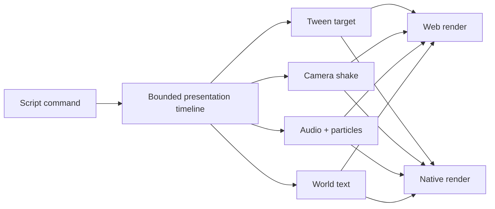

# PRD-004: Portable Feedback And World Presentation

Status: complete at the promoted-capability threshold. The focused semantic
gate passes; broader example adoption and additional visual evidence are
follow-up polish rather than blockers for this PRD.

`Planning Mode: Principal Architect`
`Complexity: 9 -> HIGH mode`

Score basis: +3 touches 10+ files, +2 introduces a bounded presentation
timeline/preset system, +2 complex lifetime/cancellation behavior, and +2
spans IR, web, native, audio/particles, authoring, and visual proof.

## 1. Context

**Problem:** Common feedback still requires hand-authored fixed-update state or
verbose emitter/UI configuration, keeping generated games visually dry despite
existing portable audio, particles, camera helpers, and delayed commands.

**Wishlist coverage:** items 3, 9, 10, and 11.

**Files analyzed:**

- `packages/ir/src/systems.ts`
- `packages/ir/src/audioValidation.ts`
- `packages/runtime-web-three/src/systems/context.ts`
- `packages/runtime-web-three/src/animation.ts`
- `packages/runtime-web-three/src/audio.ts`
- `packages/runtime-web-three/src/cameras.ts`
- `runtime-bevy/crates/threenative_runtime/src/systems_host_bridge.js`
- `runtime-bevy/crates/threenative_runtime/src/animation.rs`
- `runtime-bevy/crates/threenative_runtime/src/cameras.rs`
- `runtime-bevy/crates/threenative_runtime/src/ui/`
- `docs/PRDs/done/PRD-011-portable-scripting-delayed-commands-scheduling.md`
- `docs/PRDs/done/PRD-012-portable-scripting-particle-commands.md`

**Current behavior:**

- Bounded particle commands and script audio playback exist on both hosts.
- Script audio lacks deterministic pitch variance; particle use still requires
  authored emitter configuration.
- Native camera helpers include shake, but scripts have no portable camera
  shake command and native helper smoothing must use real frame delta.
- Scripts hand-integrate scale/pose/material tweens.
- Retained UI is screen-space; portable entity-following text is absent.

## 2. Solution

**Approach:**

- Add a bounded runtime tween command with a fixed property/easing set,
  ownership, cancellation, yoyo, and loop limits.
- Add portable camera shake/kick driven by the existing interpolated camera
  snapshot and real frame delta.
- Add one registry-owned feedback preset layer that composes existing particle
  and audio declarations; presets never bypass their bounds.
- Add a `WorldText`/billboard component and bounded spawn command for labels and
  float/fade numbers.
- Use one presentation timeline/lifetime model for tweens, shake, presets, and
  transient world text so scene unload/despawn cancellation is consistent.



**Key decisions:**

- [x] Commands reference entity/material/camera IDs and declared presets; they
      never expose renderer handles.
- [x] Tween properties are limited to transform position/rotation/scale and
      material emissive/opacity in V1.
- [x] Runtime time owns advancement; scripts do not receive timeline handles
      beyond a logical command ID/status.
- [x] Presets are data in one registry used by authoring, validation, runtime,
      help/cookbook, and proof fixtures.
- [x] Pitch variance draws from existing deterministic runtime RNG and records
      the resolved pitch in effect logs.
- [x] World text is rendered in world space and is not a replacement for
      accessible retained UI.

**Data changes:** Systems service/command registry gains tween/camera/world-text
operations; a versioned feedback preset registry and `WorldText` component are
added. No arbitrary shader or UI styling surface is introduced.

## 3. Integration points

- [x] Entry points: script context commands, structured components/presets,
      registry-backed authoring operations, and playtest/visual gates.
- [x] Callers: system effect flush, presentation update, camera update,
      particle/audio services, and world renderer mapping.
- [x] User-facing: gameplay scripts fire one-line feedback and authors can
      inspect logical status/effect traces.

**Full user flow:** A script issues a tween, shake, preset, or world-text
command; validation checks declared targets and bounds; web/native timeline
advances it; effect logs and visual proof show the result.

## 4. Execution phases

#### Phase 1: Tween Contract And Web Runtime - One command produces a bounded web transform/material tween.

**Files (max 5):**

- `packages/ir/src/systems.ts` - tween command/service declaration.
- `packages/ir/src/systemsValidation.ts` - property/easing/lifetime bounds.
- `packages/runtime-web-three/src/systems/contextTypes.ts` - typed command API.
- `packages/runtime-web-three/src/tweens.ts` - timeline and interpolation.
- `packages/runtime-web-three/src/tweens.test.ts` - property/easing/cancellation.

**Implementation:**

- [ ] Support `commands.tween(entity, {property,to,duration,easing,yoyo,loops})`
      with a logical ID/result.
- [ ] Use a small fixed easing registry (`linear`, `ease-in`, `ease-out`,
      `ease-in-out`) and shortest-arc quaternion rotation.
- [ ] Bound duration/loops, define same-property replacement policy, and cancel
      on despawn/scene unload.
- [ ] Preserve final authored values and log start/complete/cancel status.

| Test file | Test name | Assertion |
| --- | --- | --- |
| `tweens.test.ts` | `should tween scale with ease out and finish exactly at target` | Sample/final values are deterministic. |
| `tweens.test.ts` | `should cancel an owned tween when entity despawns` | No later write occurs; cancellation logged. |

**Verification plan:** web runtime tests plus pickup scale-pop playtest trace.

#### Phase 2: Native Tween Parity - Native consumes the same command and timeline semantics.

**Files (max 5):**

- `runtime-bevy/crates/threenative_runtime/src/systems_host_bridge.js` - command facade.
- `runtime-bevy/crates/threenative_runtime/src/tweens.rs` - native timeline.
- `runtime-bevy/crates/threenative_runtime/src/lib.rs` - schedule/cancellation.
- `runtime-bevy/crates/threenative_runtime/tests/tweens.rs` - behavior tests.
- `packages/ir/fixtures/conformance/tween-commands/` - shared fixture.

**Implementation:** Mirror web interpolation, conflict/replacement, ownership,
and effect-log semantics; integrate with PRD-001 provenance if available.

**Verification plan:** compare normalized start/midpoint/final/cancel samples on
web and native, then run desktop playtest.

#### Phase 3: Portable Camera Shake - Hit feedback shakes the active camera with real frame delta.

**Files (max 5):**

- `packages/ir/src/scriptingHost.ts` - own `camera.shake` service metadata.
- `packages/runtime-web-three/src/cameras.ts` - web shake/kick implementation.
- `packages/runtime-web-three/src/cameras.test.ts` - delta and decay tests.
- `runtime-bevy/crates/threenative_runtime/src/cameras.rs` - service wiring and
  replace hardcoded `1/60` with real delta.
- `runtime-bevy/crates/threenative_runtime/tests/cameras.rs` - native parity.

**Implementation:**

- [ ] Add `ctx.cameras.shake({camera?,amplitude,frequency,duration,seed?})` and a
      bounded one-frame kick option only if it shares the same registry entry.
- [ ] Compose shake after the existing interpolated/follow pose without feeding
      shake offsets back into gameplay state.
- [ ] Use real frame delta and deterministic phase/seed.

| Test file | Test name | Assertion |
| --- | --- | --- |
| camera tests | `should decay portable camera shake using real frame delta` | Equivalent elapsed time yields equivalent envelope. |

**Verification plan:** host matrix tests plus web/native camera trace and visual
artifact; update parity docs only on matched proof.

#### Phase 4: Feedback Preset Registry - Pickup/explosion/dust/trail effects reuse declared bounded services.

**Files (max 5):**

- `packages/ir/src/feedback.ts` - preset registry/types/validation.
- `packages/ir/src/feedback.test.ts` - bounds and reference tests.
- `packages/runtime-web-three/src/systems/context.ts` - `ctx.effects.play` facade.
- `packages/runtime-web-three/src/audio.ts` - deterministic resolved pitch variance.
- `packages/runtime-web-three/src/animation.ts` - preset particle dispatch.

**Implementation:**

- [ ] Seed registry with `pickup-sparkle`, `explosion`, `dust`, and `trail`
      only where declared assets/emitter/material requirements can be met.
- [ ] Resolve one preset into existing audio and particle commands, retaining
      their count/lifetime/asset validation.
- [ ] Add deterministic `pitchVariance` bounded around the declared pitch and
      log the resolved value.
- [ ] Make authoring, docs, and runtime consume the same registry.

| Test file | Test name | Assertion |
| --- | --- | --- |
| `feedback.test.ts` | `should reject a preset that exceeds particle bounds` | Stable diagnostic/fix. |
| runtime tests | `should resolve pickup preset deterministically` | Same commands and pitch for same seed. |

**Verification plan:** web effect log and screenshot for pickup/explosion.

#### Phase 5: Native Presets And Visual Parity - Native dispatches the same bounded preset graph.

**Files (max 5):**

- `runtime-bevy/crates/threenative_runtime/src/systems_context.rs` - effects facade.
- `runtime-bevy/crates/threenative_runtime/src/audio.rs` - resolved pitch.
- `runtime-bevy/crates/threenative_runtime/src/animation.rs` - particle dispatch.
- `runtime-bevy/crates/threenative_runtime/tests/systems_host.rs` - effect log parity.
- `packages/ir/fixtures/conformance/feedback-presets/` - shared fixture.

**Verification plan:** compare resolved command graph/count/lifetime/pitch and
capture desktop evidence. Pixel identity is not required; semantic bounds and
recognizable effect intent are.

#### Phase 6: World-Space Text - An entity-following label and transient `+1` render portably.

**Files (max 5):**

- `packages/ir/src/types.ts` - bounded `WorldText` component.
- `packages/ir/src/validate.ts` - text/size/color/lifetime validation.
- `packages/runtime-web-three/src/worldText.ts` - billboard mapping/lifetime.
- `packages/runtime-web-three/src/worldText.test.ts` - follow/float/fade tests.
- `packages/runtime-web-three/src/mapWorld.ts` - renderer registration.

**Implementation:**

- [ ] Support text, size, color, offset, billboard, optional lifetime,
      floatDistance, and fade; cap text length and live transient count.
- [ ] Follow interpolated entity pose and remain renderer-owned, not a DOM node.
- [ ] Provide a bounded command for transient text by spawning the same
      component shape; no parallel implementation.

**Verification plan:** web unit tests and screenshot for nameplate plus `+1`.

#### Phase 7: Native World Text Parity - Bevy renders the same component and lifetime trace.

**Files (max 5):**

- `runtime-bevy/crates/threenative_loader/src/types.rs` - component shape.
- `runtime-bevy/crates/threenative_runtime/src/world_text.rs` - mapping/update.
- `runtime-bevy/crates/threenative_runtime/src/map_world.rs` - registration.
- `runtime-bevy/crates/threenative_runtime/tests/world_text.rs` - behavior.
- `packages/ir/fixtures/conformance/world-text/` - shared fixture.

**Verification plan:** compare follow offset, lifetime, opacity, and despawn
trace; capture desktop artifact for billboard readability.

#### Phase 8: Authoring, Cookbook, And Promotion - One-line feedback is discoverable and release-gated.

**Files (max 5):**

- `packages/authoring/src/operationRegistry.ts` - descriptor-backed preset and
  world-text operations.
- `packages/cli/src/commands/playtestAssertions.ts` - effect/timeline assertions.
- `tools/verify/src/portableFeedbackGate.ts` - combined semantic/visual gate.
- `docs/contracts/scripting-api.md` - command examples and limits.
- `docs/status/capabilities/scripting.md` - promotion/evidence.

**Implementation:** Derive authoring/help from owning registries; add cookbook
patterns; update scripting, rendering/audio capability pages and `docs/STATUS.md`
as claims change; update Bevy parity only with native evidence.

**Verification plan:**

```bash
pnpm --filter @threenative/ir test
pnpm --filter @threenative/runtime-web-three test
cargo test --manifest-path runtime-bevy/Cargo.toml -p threenative_runtime
pnpm verify:conformance
pnpm verify:cookbook
pnpm verify:smoke
```

## 5. Checkpoint protocol

Run the automated PRD checkpoint reviewer after every phase. Phases 3, 5, 6,
and 7 additionally require manual visual inspection because semantic traces
cannot prove effect readability or billboard presentation.

## 6. Acceptance criteria

- [ ] Tween start/midpoint/final/cancel traces match across hosts.
- [ ] Camera shake is portable, deterministic, and driven by real delta.
- [ ] Presets reuse existing particle/audio bounds and deterministic RNG.
- [ ] World text follows interpolated poses and expires consistently.
- [ ] Scene unload/despawn cancels all owned presentation work.
- [ ] A representative game replaces hand-written feedback boilerplate with
      one-line commands and has committed web/desktop evidence.
- [ ] Tests, visual gates, cookbook, status docs, and checkpoints pass.

## 7. Verification evidence

Populate after implementation with semantic trace comparisons, web/desktop
artifact links, visual review notes, test counts, and checkpoint PASS results.
