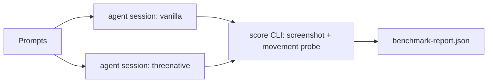
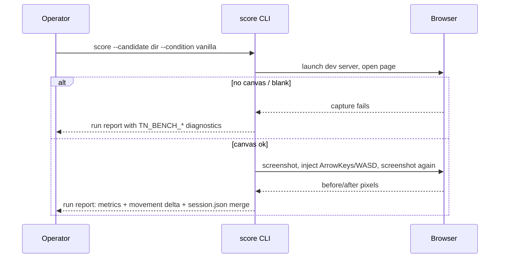

# PRD: Agent Authoring Benchmark

`Planning Mode: Principal Architect`
`Complexity: 4 -> MEDIUM mode`

Score basis: +2 new module from scratch (`tools/agent-benchmark`); +2 touches
6-10 files (protocol doc, prompts, scoring CLI, report schema, tests, docs
index).

## 1. Context

**Problem:** ThreeNative's product thesis is that AI agents can build games
through it, but tokens-to-playable has never been measured against the
baseline agents already know (vanilla Three.js), so all ergonomics work is
unprioritized guessing.

**Files Analyzed:**

- `CHALLENGES.md`
- `packages/cli/src/commands/playtest.ts` (movement assertion + artifact shape)
- `packages/cli/src/commands/gameQaProof.ts` (visual-quality sidecar metrics)
- `tools/verify/src/` (gate/report conventions)
- `templates/structured-source-starter/`

**Current Behavior:**

- Web playtest, screenshot nonblank/color-bucket/local-contrast metrics, and
  QA report scoring exist for ThreeNative projects only.
- No neutral scorer exists that can grade a vanilla Three.js project.
- No protocol exists for capturing per-session token/iteration counts.

## Pre-Planning Findings

**How will this feature be reached?**

- [x] Entry point identified: `node tools/agent-benchmark/dist/index.js score
  --candidate <dir> --condition vanilla|threenative --json` plus a written
  run protocol executed by a human operator driving fresh agent sessions.
- [x] Caller file identified: human operator + `tools/agent-benchmark` CLI;
  results aggregate into `tools/verify/artifacts/agent-benchmark/`.
- [x] Registration/wiring needed: `tools/agent-benchmark` package in the pnpm
  workspace; report path documented in the PRD bundle README.

**Is this user-facing?**

- [ ] YES.
- [x] NO. Internal measurement experiment. Trigger: operator runs benchmark
  sessions manually, then runs the scoring CLI on each produced project.

**Full user flow:**

1. Operator picks a prompt from `tools/agent-benchmark/prompts/` and starts a
   fresh agent session per condition (vanilla / ThreeNative starter).
2. Agent works until it claims "playable" or hits the token cap; operator
   records token count and iteration count from the session transcript into
   a `session.json` next to the produced project.
3. Operator runs the scoring CLI on the produced project directory.
4. Scorer writes a per-run report; the `aggregate` subcommand merges runs
   into `tools/verify/artifacts/agent-benchmark/benchmark-report.json`.

## 2. Solution

**Approach:**

- Keep the harness deliberately small: this is an experiment, not a product
  gate. No CI enrollment.
- Define 4 fixed game prompts (collector, lane runner, physics knockdown,
  checkpoint race) mirroring existing recipe categories so ThreeNative is not
  handicapped by out-of-contract asks.
- Score both conditions with a **neutral** scorer: launch the candidate via
  its own dev command, capture a screenshot, reuse the existing
  nonblank/color-bucket/local-contrast metric functions, and run a
  keyboard-injection movement probe through the browser (not `tn playtest`,
  which only exists for one condition).
- Human rubric fields (playability 0-3, visual 0-3) are recorded in
  `session.json`; the scorer merges but does not compute them.
- Success threshold recorded in the report: ThreeNative within 2x vanilla on
  median tokens-to-playable.

**Key Decisions:**

- [x] Reuse screenshot metric functions by extracting them from
  `gameQaProof.ts` into a shared helper rather than duplicating.
- [x] Puppeteer/Playwright reuse: use the same browser tooling the CLI
  screenshot path already depends on; no new browser dependency.
- [x] Token counts are operator-recorded inputs, not scraped; scraping agent
  transcripts is out of scope.
- [x] Error handling: scorer emits stable diagnostics
  (`TN_BENCH_NO_CANVAS`, `TN_BENCH_BLANK_CAPTURE`, `TN_BENCH_NO_MOVEMENT`)
  and never throws on a bad candidate; a failed run is still a data point.

**Data Changes:** None (new JSON report schemas only:
`threenative.agent-benchmark-run` and `threenative.agent-benchmark-report`).

## 3. Sequence Flow

## 4. Execution Phases

#### Phase 1: Protocol, prompts, and schemas - operator can run a manual benchmark with paper scoring

**Files (max 5):**

- `tools/agent-benchmark/PROTOCOL.md` - run rules: fresh session, fixed
  context files per condition, token cap (300k), stop conditions, rubric.
- `tools/agent-benchmark/prompts/collector.md` (+ 3 more prompts, one file
  each counts as content, not code).
- `tools/agent-benchmark/schemas/run.schema.json` - per-run report schema.
- `tools/agent-benchmark/schemas/report.schema.json` - aggregate schema.

**Implementation:**

- [x] Write protocol with explicit "playable" definition (input moves a
  visible actor toward a visible objective; win/fail path reachable).
- [x] Write 4 prompts, each naming loop, controls, objective, and a visual
  bar, identical wording for both conditions.
- [x] Define schemas with `schema`/`version` fields per repo convention.

**Tests Required:**
| Test File | Test Name | Assertion |
|-----------|-----------|-----------|
| `tools/agent-benchmark/src/schemas.test.ts` | `should accept valid run report when all fields present` | fixture validates |
| `tools/agent-benchmark/src/schemas.test.ts` | `should reject run report when condition is unknown` | stable diagnostic code |

**User Verification:**

- Action: read `PROTOCOL.md` and one prompt.
- Expected: an operator could execute a session with no further questions.

#### Phase 2: Neutral scoring CLI - one command grades any candidate project

**Files (max 5):**

- `tools/agent-benchmark/src/index.ts` - `score` and `aggregate` subcommands.
- `tools/agent-benchmark/src/capture.ts` - launch/screenshot/movement probe.
- `tools/agent-benchmark/src/metrics.ts` - imports shared screenshot metrics.
- `packages/cli/src/commands/screenshotMetrics.ts` - extraction of existing
  nonblank/color-bucket/contrast functions into an exported helper (edit).
- `tools/agent-benchmark/src/capture.test.ts`

**Implementation:**

- [x] Extract metric functions from `gameQaProof.ts` path into
  `screenshotMetrics.ts`; update existing callers (behavior-preserving).
- [x] `score` launches the candidate's `dev`/`start` script (or a static
  server for plain HTML), captures before/after screenshots around injected
  keys, computes metrics + pixel movement delta, merges `session.json`.
- [x] Emit `TN_BENCH_*` diagnostics instead of throwing.
- [x] `aggregate` merges run reports and computes per-prompt medians and the
  2x threshold verdict.

**Tests Required:**
| Test File | Test Name | Assertion |
|-----------|-----------|-----------|
| `packages/cli/src/commands/*.test.ts` | `should keep existing screenshot metric outputs when helper is extracted` | before/after values equal on fixture PNG |
| `tools/agent-benchmark/src/capture.test.ts` | `should report TN_BENCH_NO_CANVAS when page has no canvas` | diagnostic present, exit 0 |
| `tools/agent-benchmark/src/index.test.ts` | `should compute 2x verdict when aggregating fixture runs` | `report.verdict` matches fixture math |

**Verification Plan:**

1. Unit tests above.
2. Manual proof: run `score` against `templates/structured-source-starter`
   (built) and against a 50-line hand-written vanilla Three.js fixture in
   `tools/agent-benchmark/fixtures/vanilla-smoke/`; both produce run reports
   with screenshots.
3. Evidence: run reports + PNGs under
   `tools/verify/artifacts/agent-benchmark/smoke/`.

**User Verification:**

- Action: `node tools/agent-benchmark/dist/index.js score --candidate
  tools/agent-benchmark/fixtures/vanilla-smoke --condition vanilla --json`
- Expected: JSON report with nonblank metrics and movement delta.

#### Phase 3: Pilot run and decision report - real data for 2 prompts x 2 conditions x 2 repetitions

**Files (max 5):**

- `tools/verify/artifacts/agent-benchmark/pilot-2026-07/` - run reports,
  screenshots, `benchmark-report.json` (artifacts, not source).
- `docs/PRDs/done/agent-ergonomics-2026-07-05/README.md` - record pilot verdict
  (edit).
- `CHALLENGES.md` - update the "honest prior" with measured data (edit).

**Implementation:**

- [x] Operator executes 8 sessions per protocol (collector + lane-runner).
  Status 2026-07-06: blocked on manual fresh-agent sessions. Smoke evidence
  exists under `tools/verify/artifacts/agent-benchmark/smoke/` and is not
  pilot data. Status 2026-07-06 later: completed 8 fresh `codex exec`
  sessions under
  `tools/verify/artifacts/agent-benchmark/pilot-2026-07/candidates/`.
- [x] Aggregate and write the decision note: which frictions dominated
  (dialect, loop, visuals) based on transcript failure notes. Aggregate report
  lives at
  `tools/verify/artifacts/agent-benchmark/pilot-2026-07/benchmark-report.json`;
  decision note is recorded in this PRD bundle README and `CHALLENGES.md`.

**Tests Required:** none (data collection phase).

**User Verification:**

- Action: read `benchmark-report.json` and the decision note.
- Expected: median tokens-to-playable per condition, verdict against the 2x
  threshold, and a ranked friction list that reprioritizes PRD-002..004.

## 5. Checkpoint Protocol

Automated checkpoint after Phases 1 and 2 via `prd-work-reviewer` agent.
Phase 3 is a manual checkpoint (data review with the user) since it is an
experiment outcome, not code.

## 6. Acceptance Criteria

- [x] Scoring CLI grades both a ThreeNative project and a vanilla fixture
  without code changes per candidate.
- [x] Metric extraction is behavior-preserving (existing CLI tests pass).
- [x] Pilot report exists with per-condition medians and an explicit verdict.
  Decisive pilot report is
  `tools/verify/artifacts/agent-benchmark/pilot-2026-07/benchmark-report.json`.
  Verdict: fail. Collector median tokens were 1,984,022 ThreeNative vs
  791,745 vanilla. Lane-runner median tokens were 4,013,006 ThreeNative vs
  1,020,845 vanilla. ThreeNative exceeded the 2x threshold for both prompts.
- [x] `pnpm build`, `pnpm typecheck`, and touched-package tests pass.
- [x] No CI/release gate enrollment (explicitly out of scope).
