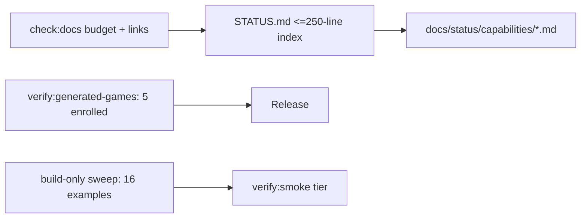

# PRD: Meta-Layer Compression (STATUS Index + Gate Pruning)

Status: done.

Implementation note: the PRD was written against a stale 21-generated-game
inventory. At execution time this repo had two generated-game production
candidates (`humanoid-physics-course`, `metro-surfer-heist`) and one remaining
example (`stylized-nature-component`). The release gate therefore remains
enrolled on the two production-plan candidates, and the new build-only sweep
covers the remaining example. The no-third-state inventory rule is enforced
against the current production-plan candidates.

`Planning Mode: Principal Architect`
`Complexity: 5 -> MEDIUM mode`

Score basis: +3 touches 10+ files (STATUS split, per-capability docs, gate
config, example de-enrollment); +2 release-gate impact treated as complex
cross-cutting change.

## 1. Context

**Problem:** `docs/STATUS.md` is ~2,900 lines (~70k tokens) and no longer
fits an agent context window despite being "the implementation front door,"
and the generated-games release gate maintains full QA evidence for 21
example games, so meta-maintenance now competes with product work every
session.

**Files Analyzed:**

- `docs/STATUS.md` (2,924 lines)
- `docs/PRDs/other/docs-front-door-compaction.md` (existing overlapping PRD
  — this PRD supersedes and should absorb/close it)
- `tools/verify/src/gameProductionGate*.ts` (21-project enrollment list)
- `docs/bevy-feature-parity.md`
- `pnpm check:docs` behavior

**Current Behavior:**

- STATUS.md accretes a paragraph per completed slice, newest work embedded
  mid-document; evidence commands, historical narrative, and current
  capability claims are interleaved.
- `verify:generated-games` audits 21 examples with full
  plan/QA/release/visual-quality evidence and is in the release profile.
- CLAUDE.md rule: capability/release-gate changes must update STATUS.md and
  bevy-feature-parity.md — every slice grows the file further.

## Pre-Planning Findings

**How will this feature be reached?**

- [x] Entry point identified: `docs/STATUS.md` (read path for every agent
  session), `pnpm check:docs`, `pnpm verify:generated-games`.
- [x] Caller file identified: `tools/verify/src/gameProductionGate*.ts`
  enrollment list; `tools/verify/src/docs*` checks.
- [x] Registration/wiring needed: docs check must enforce the new size
  budget and index->capability-doc links so compression cannot silently
  regress.

**Is this user-facing?**

- [ ] YES.
- [x] NO. Internal docs/gates. Triggered by every agent session (STATUS
  read) and release verification (gate profile).

**Full user flow:**

1. Agent session starts and reads `docs/STATUS.md` (now <= 250 lines): goal,
   capability table with one-line status + link each, current active PRDs.
2. Agent follows exactly one capability doc link for the area it works on.
3. Release runs `verify:generated-games` over 5 representative examples;
   the other 16 remain buildable examples without release evidence burden.

## 2. Solution

**Approach:**

- Restructure, do not delete: move existing STATUS prose into
  `docs/status/capabilities/<area>.md` files (authoring, scripting,
  rendering, physics, UI, assets, native-parity, game-production, editor,
  tooling-proof) preserving evidence commands; STATUS.md becomes a bounded
  index with a per-capability status line and link.
- Amend the CLAUDE.md/AGENTS.md rule wording: capability changes update the
  relevant capability doc + the STATUS index line, not a STATUS paragraph.
- Enforce with `check:docs`: STATUS.md hard line budget (250) and
  index-link resolution, so the file cannot re-accrete.
- Gate pruning: keep 5 representative examples in `verify:generated-games`
  (one per major genre/mechanic: physics knockdown, lane-runner, collector,
  vehicle/checkpoint, courier/trigger). De-enrolled examples stay in
  `examples/` and must still build, via a cheap build-only sweep, but drop
  the full QA/release evidence requirement.
- Close/absorb `docs/PRDs/other/docs-front-door-compaction.md` into this PRD
  to avoid duplicate backlog.

**Key Decisions:**

- [x] History is preserved via git and capability docs — no evidence text is
  deleted, only relocated.
- [x] Representative-5 selection criteria committed in the gate source with
  a comment (genre coverage + native-scenario fixture inclusion).
- [x] The gate's inventory-drift check (new example with plan.json must
  enroll) is updated to: enroll OR be listed in the explicit
  `buildOnlyExamples` list — no silent third state.
- [x] `bevy-feature-parity.md` is untouched in scope except link updates
  (it is evidence-anchored and separately structured).

**Data Changes:** None.

## 3. Sequence Flow

Not applicable (docs/config restructure); the flowchart above covers it.

## 4. Execution Phases

#### Phase 1: Capability doc split + STATUS index - front door fits in context again

**Files (max 5 code/doc units; capability docs are relocated content):**

- `docs/status/capabilities/*.md` - ~10 new files of relocated prose.
- `docs/STATUS.md` - rewritten as the index (edit).
- `CLAUDE.md` + `AGENTS.md` - amend the update rule wording (edit, keep
  aligned per repo rule).
- `docs/PRDs/README.md` - link updates (edit).

**Implementation:**

- [ ] Partition current STATUS.md prose by capability; relocate verbatim
  with dated section headers; newest-first inside each doc.
- [ ] Write the index: product goal (existing), capability table
  (area | status | one line | link), active PRD bundle links, gate profile
  pointer.
- [ ] Update rule text so future slices append to capability docs.

**Tests Required:**
| Test File | Test Name | Assertion |
|-----------|-----------|-----------|
| `tools/verify/src/docsCheck.test.ts` | `should fail when STATUS.md exceeds 250 lines` | budget enforced (test added Phase 2, listed here for spec completeness) |

**User Verification:**

- Action: open `docs/STATUS.md`; pick one capability and follow its link.
- Expected: index readable in one screenful of scrolls; capability doc
  contains the full prior evidence prose for that area.

#### Phase 2: Docs-check enforcement - compression cannot regress

**Files (max 5):**

- `tools/verify/src/docsCheck.ts` (or the module behind `check:docs`) -
  STATUS line budget + index-link resolution + capability-doc orphan check
  (edit).
- `tools/verify/src/docsCheck.test.ts` (edit/new)

**Implementation:**

- [ ] Hard-fail `check:docs` when STATUS.md > 250 lines, when an index link
  does not resolve, or when a `docs/status/capabilities/*.md` file is not
  linked from the index.
- [ ] Stable diagnostics naming the offending line count / link.

**Tests Required:**
| Test File | Test Name | Assertion |
|-----------|-----------|-----------|
| `tools/verify/src/docsCheck.test.ts` | `should fail with line count when STATUS budget exceeded` | diagnostic includes actual count |
| `tools/verify/src/docsCheck.test.ts` | `should fail when capability doc is orphaned` | file path in diagnostic |

**User Verification:**

- Action: append 300 filler lines to STATUS.md locally, run
  `pnpm check:docs`.
- Expected: fails with the budget diagnostic; revert, passes.

#### Phase 3: Gate pruning to representative-5 + build-only sweep - release evidence surface shrinks 4x

**Files (max 5):**

- `tools/verify/src/gameProductionGate.ts` - enrollment list -> 5 +
  `buildOnlyExamples` list + updated drift rule (edit).
- `tools/verify/src/gameProductionGate.test.ts` (edit)
- `tools/verify/src/exampleBuildSweep.ts` - build-only check for
  de-enrolled examples, registered under the smoke tier.
- `package.json` - script registration (edit).
- `docs/status/capabilities/game-production.md` - record the policy (edit).

**Implementation:**

- [ ] Select the representative 5 (must include the native scenario fixture
  project and one physics-core game); commit selection rationale comment.
- [ ] Drift rule update: every `examples/*` with `plan.json` must be in
  exactly one of enrolled/buildOnly lists.
- [ ] Build sweep: validate + build each de-enrolled example; no QA/release
  evidence required.
- [ ] Update `docs/bevy-feature-parity.md` links if any point at
  de-enrolled evidence (link updates only).

**Tests Required:**
| Test File | Test Name | Assertion |
|-----------|-----------|-----------|
| `tools/verify/src/gameProductionGate.test.ts` | `should fail when example is in neither enrolled nor build-only list` | drift diagnostic names project |
| `tools/verify/src/exampleBuildSweep.test.ts` | `should fail when a build-only example does not build` | project + step in report |

**Verification Plan:**

1. Unit tests above.
2. `pnpm verify:generated-games` green over 5 projects; runtime compared to
   pre-change run recorded in the report summary.
3. Evidence: gate report + sweep report under `tools/verify/artifacts/`.

**User Verification:**

- Action: run `pnpm verify:generated-games` and the new sweep.
- Expected: both pass; wall-clock for the release gate drops substantially
  (record before/after in the checkpoint).

#### Phase 4: Close superseded PRD + finalize

**Files (max 5):**

- `docs/PRDs/other/docs-front-door-compaction.md` - move to
  `docs/PRDs/done/` with a supersession note (per repo rule for finished
  PRDs).
- `docs/PRDs/README.md` - index update (edit).

**Implementation:**

- [ ] Record which of its acceptance items this PRD delivered; anything
  dropped is noted explicitly, not silently.

**Tests Required:** `pnpm check:docs` passes (link moves).

**User Verification:**

- Action: `pnpm check:docs && pnpm verify:smoke`.
- Expected: green; PRD index shows compaction work as done/superseded.

## 5. Checkpoint Protocol

Automated checkpoint via `prd-work-reviewer` after each phase. Phase 1 adds
a manual checkpoint: the user reviews the new STATUS index and one
capability doc for information loss before enforcement lands in Phase 2.

## 6. Acceptance Criteria

- [ ] `docs/STATUS.md` <= 250 lines, enforced by `check:docs`.
- [ ] All prior STATUS evidence prose reachable via capability docs (no
  content deleted).
- [ ] `verify:generated-games` audits exactly 5 enrolled examples; the
  other 16 covered by a build-only sweep; drift rule allows no third state.
- [ ] CLAUDE.md/AGENTS.md rule wording updated and aligned.
- [ ] `docs-front-door-compaction.md` closed with supersession note.
- [ ] `pnpm check:docs`, `pnpm verify:smoke`, `pnpm verify:generated-games`
  pass.
