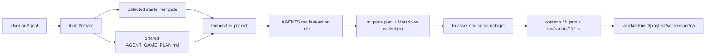
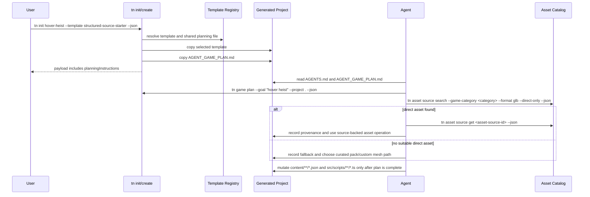

# PRD: Agent Game Planning Template and Init Scaffold

Complexity: 8 -> HIGH mode

Score basis: +2 touches 6-10 future files, +2 adds a new template/scaffold
surface, +2 spans CLI/templates/docs/verify, +1 affects developer-facing
workflow output, +1 adds release-gate coverage for scaffold drift.

## 1. Context

**Problem:** Agent-created games can still begin with source mutation before a
complete gameplay and asset plan, even though the desired workflow is to plan
first and use the CLI asset catalog before falling back to primitives.

**Goal:** Ship a canonical game-planning Markdown template with every
agent-assisted `tn init` project, wire starter instructions to it, and verify
that maintained starters require plan-first, catalog-first game creation.

**Non-goals:**

- Do not replace `tn game plan --json` or the structured
  `artifacts/game-production/plan.json` evidence contract.
- Do not add a raw Three.js, Bevy/Rust, DOM, filesystem, worker, or renderer
  handle authoring path.
- Do not require external web search or paid asset-generation providers.
- Do not accept primitive-only or primitive-looking scenes as finished games.
- Do not move game source of truth out of `content/**/*.json` and
  `src/scripts/**/*.ts`.

**Files Analyzed:**

- `AGENTS.md`
- `docs/PRDs/README.md`
- `docs/PRDs/done/other/agentic-game-production-workflow.md`
- `docs/PRDs/done/other/agent-friendly-3d-game-creation-contract.md`
- `docs/PRDs/other/agent-friendly-project-and-visual-debugging-workflows.md`
- `docs/contracts/distribution-contract.md`
- `docs/contracts/game-production-workflow.md`
- `docs/workflows/agent-game-creation.md`
- `docs/workflows/open-source-3d-asset-kits.md`
- `templates/structured-source-starter/AGENTS.md`
- `templates/racing-kit-rally-starter/AGENTS.md`
- `packages/cli/src/commands/create.ts`
- `packages/cli/src/commands/create.test.ts`
- `packages/cli/src/commands/game.ts`
- `packages/cli/src/templates/registry.ts`
- `packages/cli/scripts/copy-templates.mjs`
- `tools/verify/src/templateProductionGate.ts`

**Current Behavior:**

- `tn init` is an alias for `tn create` and copies the selected template
  directory into the new project.
- Generated starter projects already include `AGENTS.md` and `CLAUDE.md`.
- `templates/structured-source-starter/AGENTS.md` contains detailed
  plan-first and asset-catalog-first guidance, but that guidance is inline and
  can drift across templates.
- `tn game plan --goal <text> --project . --json` already emits a non-mutating
  game plan with design, source, asset, polish, and proof sections.
- `tn game improve --apply-plan` rejects incomplete plans before mutation, but
  agents still need a visible project-local instruction file that says to
  create the plan before editing source.
- `tn asset source search --game-category <category> --format glb
  --direct-only --json` and `tn asset source get <asset-source-id> --json`
  exist and are referenced in workflow docs.
- `pnpm verify:template-production` checks starter scripts, production
  metadata, and basic README/AGENTS production-loop terms, but it does not
  require a canonical planning template file or a first-action instruction.

## Pre-Planning Findings

No secret configuration is required. The asset source catalog is a local SQLite
tooling dependency shipped with the CLI; if it is missing, the implementation
must produce a stable diagnostic and a documented fallback path instead of
silently moving to primitive geometry or web search.

The existing starter `AGENTS.md` proves the desired policy is already known:
plan before mutation, inventory every high-value surface, query the asset
source catalog first for GLB/glTF, preserve provenance, wire animation clips for
active models, prove scale, and inspect screenshots before calling the game
done. The missing product shape is a reusable, scaffolded planning artifact
that each new project carries by default.

## Integration Points

**How will this feature be reached?**

- [x] Entry point identified:
  - `tn init <name> [--template <template>] [--json]`
  - `tn create <name> [--template <template>] [--json]`
  - Generated project `AGENTS.md`
  - Generated project `AGENT_GAME_PLAN.md`
  - `pnpm run game:plan`
  - `tn game plan --goal <text> --project . --json`
  - `pnpm verify:template-production`
- [x] Caller file identified:
  - `packages/cli/src/commands/create.ts`
  - `packages/cli/src/templates/registry.ts`
  - `packages/cli/scripts/copy-templates.mjs`
  - `tools/verify/src/templateProductionGate.ts`
- [x] Registration/wiring needed:
  - Add a shared Markdown planning template to the template distribution
    surface.
  - Teach `tn init/create` to copy it into new game-capable projects.
  - Reference the file from each starter `AGENTS.md` and `README.md`.
  - Add create-command tests and template-production gate checks.
  - Update workflow/distribution docs to name the scaffolded file.

**Is this user-facing?**

- [x] YES. The users are developers and AI agents creating a game from a fresh
  ThreeNative project.
- [ ] NO.

**Full user flow:**

1. User asks an agent to create a game or runs
   `tn init arcade-runner --template structured-source-starter --json`.
2. CLI scaffolds `AGENT_GAME_PLAN.md` into the project and returns it in the
   JSON/human next-step output.
3. Agent reads local `AGENTS.md`, which says the first game-creation action is
   to fill the planning template and run `pnpm run game:plan` or
   `tn game plan --goal "<game idea>" --project . --json`.
4. Agent inventories playable loop, controls, objective, progression,
   fail/retry, feedback, high-value surfaces, source owners, script owners,
   UI/HUD states, audio feedback, scale, polish, and proof commands before
   editing source.
5. For each 3D model surface, agent records the exact
   `tn asset source search --game-category <category> --format glb
   --direct-only --json` command and any selected
   `tn asset source get <asset-source-id> --json` result before using web
   research, custom meshes, or primitives.
6. Agent mutates only durable source through bounded `tn ... --json` commands
   and `src/scripts/**/*.ts` script edits.
7. Agent proves the slice with validate/build/playtest/screenshot/score/QA and
   updates the planning file with blockers or fallback evidence if catalog
   assets or runtime capabilities are unavailable.

## 2. Solution

**Approach:**

- Add one canonical Markdown source template, proposed as
  `templates/_shared/AGENT_GAME_PLAN.md`, that is copied into new
  game-capable projects as root `AGENT_GAME_PLAN.md`.
- Keep generated starter `AGENTS.md` concise by pointing to
  `AGENT_GAME_PLAN.md` as the required first stop for game creation and major
  game changes.
- Extend `tn init/create` to copy the shared planning file after the selected
  template directory is copied. Start with all maintained templates; make this
  configurable through template registry metadata only if a future non-game
  template should opt out.
- Update create-command output to include the planning file in
  `referenceDocs` or a dedicated `planningInstructions` field and include
  `pnpm run game:plan` in the human next-step text.
- Update `pnpm verify:template-production` so maintained templates fail if
  they do not ship the planning file, do not reference it from `AGENTS.md`, or
  do not include the catalog-first asset sourcing commands.
- Update docs to define `AGENT_GAME_PLAN.md` as a scaffolded planning worksheet
  and `artifacts/game-production/plan.json` as machine-readable evidence.

**Key Decisions:**

- [x] Library/framework choices: reuse the existing CLI scaffold command,
  template registry, package template copy script, game plan command, asset
  source catalog command, and template-production verify gate.
- [x] Error-handling strategy: missing scaffolded planning assets produce
  stable diagnostics in create tests and verify gates; missing runtime asset
  catalog during actual game creation remains a documented blocker/fallback,
  not silent primitive downgrade.
- [x] Reused utilities: `tn game plan`, `tn asset source search/get`,
  `tn asset inspect`, `tn model-test`, `tn game scale`,
  `tn game qa --run-proof`, and existing `production.agent` metadata.

**Data Changes:**

- New scaffolded Markdown file:
  - Source: `templates/_shared/AGENT_GAME_PLAN.md`
  - Generated project path: `AGENT_GAME_PLAN.md`
- Optional CLI create payload addition:
  - `planningInstructions: "AGENT_GAME_PLAN.md"`
- No database migrations.
- No IR schema changes.

**Required Template Content:**

The Markdown template must be explicit enough for an agent to complete before
source mutation. It must include these sections:

- **Game Goal:** user request, template, current project path, and date.
- **First Commands:** `tn game inspect --project . --json`,
  `tn game plan --goal "<game idea>" --project . --json`, and the local
  `pnpm run game:plan` script when available.
- **Playable Loop:** player verb, controls, objective, progression,
  fail/retry path, scoring/state, and feedback moments.
- **High-Value Surface Inventory:** player/hero, obstacle/enemy/vehicle,
  reward/interactable, world/environment, UI/HUD, and audio feedback.
- **UI Approach:** native ThreeNative UI for portable HUD, prompts, menus, and
  UI that may need to coordinate with 3D/game state; React webview UI as an
  optional panel layer for inventories, settings, shops, maps, dialogs, and
  other screen-space experiences that do not need to attach to a 3D entity.
- **Asset Sourcing Plan:** required catalog search command per model surface,
  selected `asset-source-id`, source URL, provenance URL, origin, license
  evidence, review status, downloaded date, conversion notes, and fallback.
- **Animation and Scale Plan:** clips to inspect/use for active actors, runtime
  bounds expectations, `tn game scale --project . --json`, and camera/lighting
  alternatives to incoherent scaling.
- **Source Ownership:** exact `content/**/*.json` documents and
  `src/scripts/**/*.ts` modules/exports that will own each planned behavior.
- **Polish Checklist:** silhouettes, materials, lighting, camera framing,
  environment context, set dressing, VFX/motion/audio, UI states, mobile fit,
  and performance budget.
- **Proof Checklist:** validate, build, inspect, playtest, screenshot,
  nonblank/motion proof, score, QA, release, and blocker notes.

**Risks:**

- Duplicating long policy in every starter can create drift. Mitigate with one
  shared template and concise references from `AGENTS.md`.
- A Markdown worksheet can diverge from `tn game plan --json`. Mitigate by
  treating JSON as machine-readable evidence and Markdown as the human/agent
  checklist; both must name the same high-value surfaces and commands.
- Copying shared files after template copy can overwrite a template-specific
  file. Mitigate by failing with a diagnostic if a selected template already
  ships `AGENT_GAME_PLAN.md`, unless the registry explicitly marks it as
  template-owned.
- Future non-game templates may not need the file. Mitigate with registry
  metadata if a non-game template is added.

## 3. Sequence Flow

## 4. Execution Phases

#### Phase 1: Shared Planning Template - New projects have a canonical plan-first worksheet.

**Files (max 5):**

- `templates/_shared/AGENT_GAME_PLAN.md` - add the canonical planning worksheet.
- `templates/structured-source-starter/AGENTS.md` - point agents at the
  worksheet before game source mutation.
- `templates/racing-kit-rally-starter/AGENTS.md` - point agents at the
  worksheet before substantial game changes.
- `templates/structured-source-starter/README.md` - mention the worksheet in
  the production workflow.
- `templates/racing-kit-rally-starter/README.md` - mention the worksheet in the
  production workflow.

**Implementation:**

- [ ] Create `templates/_shared/AGENT_GAME_PLAN.md` with all required sections.
- [ ] Keep instructions concrete: include exact `tn game plan`, `tn asset
  source search`, `tn asset source get`, `tn asset inspect`, `tn model-test`,
  `tn game scale`, and proof commands.
- [ ] Include UI planning guidance that names native ThreeNative UI as the
  portable default and React webview UI as a screen-space panel option with
  limitations, including no attachment to 3D elements.
- [ ] Replace duplicated long guidance in starter `AGENTS.md` only where it can
  be safely shortened without weakening local source-boundary rules.
- [ ] Add starter README references so human users see the same first step.

**Tests Required:**

| Test File | Test Name | Assertion |
| --- | --- | --- |
| `tools/verify/src/templateProductionGate.test.ts` | `should require scaffolded game planning instructions for maintained templates` | Missing `AGENT_GAME_PLAN.md` or missing `AGENTS.md` reference emits `TN_TEMPLATE_AGENT_PLAN_MISSING`. |

**User Verification:**

- Action: Open `templates/_shared/AGENT_GAME_PLAN.md`.
- Expected: The first action is planning, and the asset section requires SQLite
  catalog search before web search or primitives.

#### Phase 2: Init/Create Scaffold Wiring - `tn init` ships the planning worksheet by default.

**Files (max 5):**

- `packages/cli/src/templates/registry.ts` - add shared planning-template
  metadata if needed.
- `packages/cli/src/commands/create.ts` - copy the shared plan into generated
  projects and expose it in output.
- `packages/cli/src/commands/create.test.ts` - assert created projects include
  the worksheet and output references it.
- `packages/cli/scripts/copy-templates.mjs` - ensure `_shared` is packaged or
  explicitly copied into CLI distribution.

**Implementation:**

- [ ] After copying the selected template, copy
  `templates/_shared/AGENT_GAME_PLAN.md` to
  `<project>/AGENT_GAME_PLAN.md`.
- [ ] Do not overwrite a template-owned `AGENT_GAME_PLAN.md` unless the future
  registry contract explicitly allows it.
- [ ] Add `planningInstructions: "AGENT_GAME_PLAN.md"` to JSON output, or add
  the file to `referenceDocs` if payload compatibility is preferred.
- [ ] Add human output that says to open `AGENT_GAME_PLAN.md` and run
  `pnpm run game:plan` before creating/changing the game.
- [ ] Confirm the file is present from both source-checkout templates and
  packaged `dist/template-files` templates.

**Tests Required:**

| Test File | Test Name | Assertion |
| --- | --- | --- |
| `packages/cli/src/commands/create.test.ts` | `should scaffold game planning instructions through init alias` | `initProject(["my-game", "--json"])` creates `AGENT_GAME_PLAN.md` and payload references it. |
| `packages/cli/src/commands/create.test.ts` | `should scaffold catalog-first planning instructions for racing starter` | Racing starter output contains `AGENT_GAME_PLAN.md` with `tn asset source search --game-category`. |

**User Verification:**

- Action: Run `tn init test-game --json`.
- Expected: The generated project includes `AGENT_GAME_PLAN.md`, and CLI output
  tells the agent to plan before mutating game source.

#### Phase 3: Verify Gate and Docs Contract - Starter drift fails before release.

**Files (max 5):**

- `tools/verify/src/templateProductionGate.ts` - require planning file,
  AGENTS/README references, and catalog-first command text.
- `tools/verify/src/templateProductionGate.test.ts` - cover missing and passing
  planning-template cases.
- `docs/contracts/game-production-workflow.md` - define the relationship
  between `AGENT_GAME_PLAN.md` and `artifacts/game-production/plan.json`.
- `docs/contracts/distribution-contract.md` - state that agent-assisted
  templates ship local planning instructions.
- `docs/workflows/agent-game-creation.md` - add the worksheet as the first
  project-local planning surface.

**Implementation:**

- [ ] Add diagnostics:
  - `TN_TEMPLATE_AGENT_PLAN_MISSING`
  - `TN_TEMPLATE_AGENT_PLAN_REFERENCE_MISSING`
  - `TN_TEMPLATE_AGENT_PLAN_ASSET_CATALOG_MISSING`
- [ ] Require the planning template to mention all high-value surfaces and both
  `tn asset source search --game-category` and
  `tn asset source get <asset-source-id> --json`.
- [ ] Require the planning template to mention native UI, React webview UI,
  appropriate webview uses such as inventories/panels, and the limitation that
  webview UI cannot attach to a 3D element.
- [ ] Require starter `AGENTS.md` to say planning is the first game-creation
  action.
- [ ] Document that Markdown is the local checklist and
  `artifacts/game-production/plan.json` is the machine-readable evidence.

**Tests Required:**

| Test File | Test Name | Assertion |
| --- | --- | --- |
| `tools/verify/src/templateProductionGate.test.ts` | `should reject templates without catalog-first planning worksheet` | Gate fails when the worksheet omits catalog search/get commands. |
| `tools/verify/src/templateProductionGate.test.ts` | `should pass maintained templates with planning worksheet` | Gate passes for a complete template fixture. |

**User Verification:**

- Action: Run `pnpm verify:template-production`.
- Expected: The report includes a passing check for scaffolded plan-first,
  catalog-first instructions.

#### Phase 4: Release Evidence and Regression Sweep - The shipped CLI proves the default behavior.

**Files (max 5):**

- `package.json` - no script changes expected; use existing gates unless
  implementation reveals a missing narrow command.
- `docs/PRDs/README.md` - move this PRD only when complete.
- `docs/STATUS.md` - update only if implementation changes release evidence or
  supported workflow status.
- `docs/bevy-feature-parity.md` - update only if implementation changes a
  capability/evidence anchor under repo rules.

**Implementation:**

- [ ] Run the narrow create tests.
- [ ] Run `pnpm verify:template-production`.
- [ ] Run `pnpm check:docs` because docs and starter instructions changed.
- [ ] Run `pnpm verify:distribution` or the smallest distribution proof that
  confirms packed CLI templates include `AGENT_GAME_PLAN.md`.
- [ ] If the implementation changes supported workflow status, update
  `docs/STATUS.md` and `docs/bevy-feature-parity.md` in the same PR.

**Tests Required:**

| Test File | Test Name | Assertion |
| --- | --- | --- |
| `scripts/verify-distribution-release.mjs` or existing distribution proof | `should include agent game planning instructions in packed CLI templates` | Packed `@threenative/cli` creates a project containing `AGENT_GAME_PLAN.md`. |

**User Verification:**

- Action: Install or pack the CLI, run `tn init scratch-game --json`, and read
  the generated `AGENT_GAME_PLAN.md`.
- Expected: The file is present and starts with plan-first instructions before
  any source mutation.

## 5. Checkpoint Protocol

After each implementation phase:

- Run the phase's narrow automated tests.
- Run `pnpm verify:template-production` after any phase touching templates,
  starter docs, or the verification gate.
- Use an automated PRD checkpoint reviewer when available:
  `Review checkpoint for phase <N> of PRD at
  docs/PRDs/other/agent-game-planning-template-and-init-scaffold.md`.
- Continue only when tests and checkpoint review pass or when the PRD is
  updated with a documented blocker and fallback.

## 6. Verification Strategy

**Unit/CLI tests:**

- `packages/cli/src/commands/create.test.ts` proves both `createProject` and
  `initProject` scaffold `AGENT_GAME_PLAN.md`.
- The tests assert the file contains the exact catalog-first command family,
  high-value surface inventory terms, and proof-loop terms.

**Verify gate tests:**

- `tools/verify/src/templateProductionGate.test.ts` proves incomplete
  maintained templates fail with stable diagnostics.
- The passing fixture proves README, AGENTS, package scripts, production
  metadata, and `AGENT_GAME_PLAN.md` agree.

**Distribution proof:**

- A packed CLI or distribution verification step creates a project from the
  packaged template files and confirms `AGENT_GAME_PLAN.md` survives packaging.

**Manual review:**

- Read the generated project from `tn init` and verify the first game-creation
  action is planning, not editing source.
- Confirm the worksheet makes primitive geometry the last fallback, not an
  acceptable finished default.

## 7. Acceptance Criteria

- [ ] `tn init <name>` and `tn create <name>` scaffold
  `AGENT_GAME_PLAN.md` for maintained game-capable templates.
- [ ] The scaffolded worksheet requires a complete playable-loop plan before
  mutation.
- [ ] The worksheet inventories player/hero, obstacle/enemy/vehicle,
  reward/interactable, world/environment, UI/HUD, and audio-feedback surfaces.
- [ ] The worksheet tells agents that ThreeNative has a native UI API and also
  supports React webview UI for screen-space panels such as inventories, while
  noting webview limitations such as not attaching to a 3D element.
- [ ] The worksheet requires `tn asset source search --game-category <category>
  --format glb --direct-only --json` before web search or primitive fallback
  for model surfaces.
- [ ] The worksheet requires `tn asset source get <asset-source-id> --json` for
  selected catalog records and provenance preservation next to committed assets.
- [ ] Starter `AGENTS.md` files point agents to the worksheet as the first
  game-creation step.
- [ ] `tn init/create --json` output names the planning instructions path.
- [ ] `pnpm verify:template-production` fails when maintained starters omit the
  worksheet, omit AGENTS/README references, or omit catalog-first asset
  sourcing instructions.
- [ ] Distribution proof confirms packed CLI templates scaffold the worksheet.
- [ ] Docs explain that `AGENT_GAME_PLAN.md` is the local checklist and
  `artifacts/game-production/plan.json` is machine-readable evidence.
- [ ] All specified tests and relevant verification gates pass.
