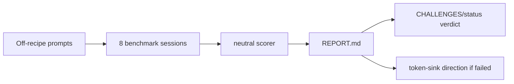
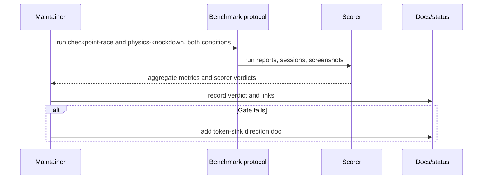

# PRD: Off-Recipe Benchmark Round

`Planning Mode: Principal Architect`
`Complexity: 4 -> MEDIUM mode`

Score basis: +1 touches 1-5 docs/artifact areas, +2 benchmark protocol and
multi-run evidence, +1 release/status claim impact.

## 1. Context

**Problem:** The 2026-07-07b benchmark pass measured two prompt-matched
recipes, not marginal agent authoring cost off the rails.

**Files Analyzed:**

- `docs/PRDs/archive/engine-improvement-candidates-2026-07-07.md`
- `CHALLENGES.md`
- `tools/agent-benchmark/OFF-RECIPE-DIRECTIVE.md`
- `tools/agent-benchmark/TOKEN-COST-DIRECTION.md`
- `tools/verify/artifacts/agent-benchmark/scaffold-first-token-rerun-2026-07-07b/REPORT.md`

**Current Behavior:**

- Collector and lane-runner scaffold-first runs passed because recipes
  authored the full game.
- Checkpoint-race and physics-knockdown prompts exist and have no matching
  recipe.
- The decisive off-recipe token ratio has not been measured.
- Benchmark status claims live in `CHALLENGES.md`, artifact reports, and
  status docs.

## Pre-Planning Findings

**How will this feature be reached?**

- [x] Entry point identified: `tools/agent-benchmark/OFF-RECIPE-DIRECTIVE.md`
  run protocol and benchmark scorer.
- [x] Caller file identified: benchmark runner/scorer scripts under
  `tools/agent-benchmark` and evidence aggregation under
  `tools/verify/artifacts/agent-benchmark`.
- [x] Registration/wiring needed: new dated artifact directory, report link,
  `CHALLENGES.md` verdict update, status index update when claims change.

**Is this user-facing?**

- [x] YES. The result informs the product kill/continue decision.
- [ ] NO.

**Full user flow:**

1. Maintainer runs both off-recipe prompts in vanilla and ThreeNative
   conditions.
2. Benchmark scorer records raw tokens, failed commands, pass/fail, visual
   score, and authoring path.
3. Maintainer publishes `REPORT.md` and updates product/status docs.
4. Future PRDs use the off-recipe result as the evidence gate.

## 2. Solution

**Approach:**

- Execute the directive verbatim with fresh vanilla baselines.
- Keep recipes and prompt-specific tuning frozen during the round.
- Record authoring path as `recipe-delta` or `bare-starter`.
- Gate the thesis on raw median token ratio `<= 2.0x` vanilla per prompt.
- If the gate fails, extract the top three ThreeNative token sinks before any
  fix work starts.

**Key Decisions:**

- [x] No new checkpoint-race or physics-knockdown recipes during this round.
- [x] Medians, not single runs, decide pass/fail.
- [x] This PRD succeeds when the number exists, regardless of pass/fail.

**Data Changes:** New evidence directory under
`tools/verify/artifacts/agent-benchmark/off-recipe-2026-07-XX/`.

## 3. Sequence Flow

## 4. Execution Phases

#### Phase 1: Evidence Directory And Run Matrix - The benchmark has a clean, dated target.

**Files (max 5):**

- `tools/verify/artifacts/agent-benchmark/off-recipe-2026-07-XX/` - fresh
  evidence directory.
- `tools/verify/artifacts/agent-benchmark/off-recipe-2026-07-XX/RUNS.txt` -
  run matrix and stop-rule notes.

**Implementation:**

- [ ] Create the dated evidence directory.
- [ ] List 8 required runs: two prompts, two conditions, two repeats.
- [ ] Confirm no prompt-specific recipe exists before starting.

**Tests Required:**

| Test File | Test Name | Assertion |
|-----------|-----------|-----------|
| `tools/agent-benchmark` protocol run | `should score every required off-recipe run` | all 8 runs produce run reports and scorer output |

**User Verification:**

- Action: inspect `RUNS.txt`.
- Expected: it lists every required run and the no-new-recipes rule.

#### Phase 2: Benchmark Runs And Aggregate Report - The off-recipe ratio is known.

**Files (max 5):**

- `tools/verify/artifacts/agent-benchmark/off-recipe-2026-07-XX/REPORT.md` -
  aggregate table and verdict.
- `tools/verify/artifacts/agent-benchmark/off-recipe-2026-07-XX/benchmark-report.json`
  - scorer output.

**Implementation:**

- [ ] Run every session under unchanged protocol.
- [ ] Record raw tokens, failed commands, scorer status, screenshot result,
      and authoring path.
- [ ] Compute median raw token ratio per prompt.

**Tests Required:**

| Test File | Test Name | Assertion |
|-----------|-----------|-----------|
| benchmark scorer | `should pass or fail each run with stable scorer output` | each run has `TN_BENCH_SCORE_OK` or a recorded failure reason |

**User Verification:**

- Action: open `REPORT.md`.
- Expected: report includes the same table shape as 2026-07-07b plus
  authoring path and friction summaries.

#### Phase 3: Verdict And Follow-Up Direction - Status reflects the measured result.

**Files (max 5):**

- `CHALLENGES.md` - update item 1 and closing verdict.
- `docs/status/capabilities/*.md` - update benchmark status when applicable.
- `docs/STATUS.md` - update one-line index entry when claims change.
- `tools/agent-benchmark/OFF-RECIPE-DIRECTION-2026-07-XX.md` - create only
  if the gate fails.

**Implementation:**

- [ ] Record pass, mixed, or fail against the `<= 2.0x` gate.
- [ ] Link the evidence directory.
- [ ] If failed, extract top three token sinks from ThreeNative transcripts.

**Tests Required:**

| Test File | Test Name | Assertion |
|-----------|-----------|-----------|
| docs check | `should keep status links valid` | `pnpm check:docs` passes |

**User Verification:**

- Action: read the updated `CHALLENGES.md` item 1.
- Expected: it states concrete ratios and dates, not a qualitative guess.

## 5. Checkpoint Protocol

- Phase 1: automated review of run matrix and no-recipe precondition.
- Phase 2: automated review of artifact completeness and scorer outputs.
- Phase 3: automated review of docs/status consistency.

## 6. Verification Strategy

- Run the benchmark protocol for all required sessions.
- Run the neutral scorer for every session.
- Run `pnpm check:docs` after verdict docs change.

## 7. Acceptance Criteria

- [ ] All 8 off-recipe sessions are recorded.
- [ ] Median raw token ratio exists per prompt.
- [ ] `REPORT.md` includes authoring path and friction list.
- [ ] `CHALLENGES.md` has the dated verdict.
- [ ] Status docs update any changed benchmark claim.
- [ ] Failed gate includes a token-sink direction doc before fixes begin.

