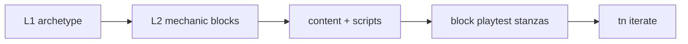
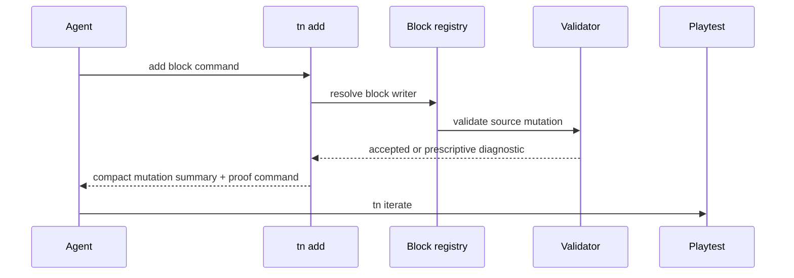

# PRD: Compositional Mechanic Blocks

`Planning Mode: Principal Architect`
`Complexity: 8 -> HIGH mode`

Score basis: +3 touches 10+ files across CLI, templates, examples, tests, and
docs; +2 new authoring module family; +2 multi-package verification; +1
release-gate impact.

## 1. Context

**Problem:** Existing recipes are whole-game monoliths, so they only help
exact prompts and do not reduce authored deltas for off-recipe games.

**Files Analyzed:**

- `docs/PRDs/engine-improvement-candidates-2026-07-07.md`
- `tools/agent-benchmark/OFF-RECIPE-DIRECTIVE.md`
- `packages/cli/src/commands/game.ts`
- `templates/structured-source-starter/`
- `docs/PRDs/proof-first-engine-loop-2026-07-05/PRD-008-declarative-gameplay-flow-spawners-sequencer.md`

**Current Behavior:**

- Two recipe paths can scaffold full collector/lane-runner games.
- Mechanics are fused with camera/controller/setup details.
- Agents cannot stack small bounded commands for spawners, timers, triggers,
  projectiles, score, or follow cameras.

## Pre-Planning Findings

**How will this feature be reached?**

- [x] Entry point identified: `tn add <block> ... --json` and future
  `tn game plan --apply` composition.
- [x] Caller file identified: CLI command router and game-plan recipe emitter.
- [x] Registration/wiring needed: block registry, schema-aware writers,
  playtest stanza emitter, API card entries, recipe recomposition.

**Is this user-facing?**

- [x] YES. Agents and users compose mechanics through bounded commands.
- [ ] NO.

**Full user flow:**

1. User starts from an archetype scaffold.
2. Agent runs `tn add trigger-sequence ... --json` and `tn add score ... --json`.
3. CLI writes durable source and playtest stanzas.
4. `tn iterate --json` proves the composed game loop.

## 2. Solution

**Approach:**

- Build a mechanic block registry with durable source writers and probe
  emitters.
- Start with evidenced blocks from benchmark prompts: spawner, timer,
  trigger-sequence, projectile, score, follow-camera.
- Make blocks compose with PRD-002 archetypes.
- Rebuild collector and lane-runner recipes as archetype plus blocks.
- Keep block output schema-aware and deterministic.

**Key Decisions:**

- [x] Blocks are not new whole-game recipes.
- [x] Initial block list is transcript/prompt driven, not speculative.
- [x] Every block emits proof hooks or a reason it is proofed by another block.

**Data Changes:** Durable source mutations in `content/**/*.json` and
`src/scripts/**/*.ts`; no raw JSON-path setter.

## 3. Sequence Flow

## 4. Execution Phases

#### Phase 1: Block Registry And Spawner/Timer - Simple loops compose without scripts by hand.

**Files (max 5):**

- `packages/cli/src/commands/add.ts` - command entry point.
- `packages/cli/src/mechanicBlocks/*.ts` - registry and two blocks.
- `packages/cli/src/commands/add.test.ts` - command tests.
- `docs/API-CARD.md` or generator source - compact entries.

**Implementation:**

- [ ] Add `tn add spawner --pattern grid|ring|lane --prefab <id> --count N`.
- [ ] Add `tn add timer --resource <name> --direction up|down --limit N`.
- [ ] Emit playtest stanzas where observable.

**Tests Required:**

| Test File | Test Name | Assertion |
|-----------|-----------|-----------|
| `packages/cli/src/commands/add.test.ts` | `should add grid spawner with validation` | source includes spawned prefab references and stable ids |
| `packages/cli/src/commands/add.test.ts` | `should add countdown timer resource` | timer resource and proof stanza are emitted |

**User Verification:**

- Action: run spawner and timer blocks in a fresh top-down project.
- Expected: `tn iterate --json` passes and reports the added proof stanza.

#### Phase 2: Trigger Sequence And Score - Checkpoint-style objectives are bounded commands.

**Files (max 5):**

- `packages/cli/src/mechanicBlocks/triggerSequence.ts`
- `packages/cli/src/mechanicBlocks/score.ts`
- `packages/cli/src/commands/add.test.ts`
- `templates/structured-source-starter/src/scripts/*.ts` - shared helpers if
  needed.
- `docs/API-CARD.md` or generator source.

**Implementation:**

- [ ] Add ordered and unordered trigger sequence block.
- [ ] Add score/win/retry block tied to named events.
- [ ] Ensure generated script references use allowed stdlib imports.

**Tests Required:**

| Test File | Test Name | Assertion |
|-----------|-----------|-----------|
| `packages/cli/src/commands/add.test.ts` | `should add ordered trigger sequence with checkpoint proof` | playtest asserts ordered checkpoints |
| `packages/cli/src/commands/add.test.ts` | `should add score win condition with retry key` | emitted source includes win and retry state |

**User Verification:**

- Action: compose checkpoint race from side-scroller or racing archetype plus
  trigger/score blocks.
- Expected: checkpoints and win state verify without raw JSON edits.

#### Phase 3: Projectile And Follow Camera - Knockdown/follow mechanics compose across archetypes.

**Files (max 5):**

- `packages/cli/src/mechanicBlocks/projectile.ts`
- `packages/cli/src/mechanicBlocks/followCamera.ts`
- `packages/cli/src/commands/add.test.ts`
- `packages/ir/fixtures/*` - fixture only if block needs shared conformance.
- `packages/ir/src/*` - only if existing IR cannot express required metadata.

**Implementation:**

- [ ] Add launcher/key projectile block with physics metadata.
- [ ] Add follow camera block that can retarget existing camera rigs.
- [ ] Include diagnostics for missing launcher, target, or collider metadata.

**Tests Required:**

| Test File | Test Name | Assertion |
|-----------|-----------|-----------|
| `packages/cli/src/commands/add.test.ts` | `should add projectile launcher with physics proof` | launcher input and projectile prefab are emitted |
| `packages/cli/src/commands/add.test.ts` | `should retarget follow camera to existing entity` | camera binding updates without duplicating rigs |

**User Verification:**

- Action: compose physics-knockdown from an archetype plus projectile block.
- Expected: playtest observes launch and impact target movement.

#### Phase 4: Recipe Recomposition - Existing recipes prove blocks are real.

**Files (max 5):**

- `packages/cli/src/commands/game.ts` - recipe composition via blocks.
- `packages/cli/src/commands/game.test.ts` - parity with previous scaffold.
- `tools/verify/src/*` - recipe scaffold gate.
- `docs/status/capabilities/*.md` - evidence update.
- `docs/STATUS.md` - index line.

**Implementation:**

- [ ] Rebuild top-down collector as top-down archetype plus blocks.
- [ ] Rebuild lane-runner as archetype plus blocks.
- [ ] Preserve gate-equivalent output and proof artifacts.

**Tests Required:**

| Test File | Test Name | Assertion |
|-----------|-----------|-----------|
| `packages/cli/src/commands/game.test.ts` | `should build collector from archetype and blocks` | plan output lists block composition |
| `tools/verify/src/*.test.ts` | `should pass generated-game gate after recipe recomposition` | existing recipe proof still passes |

**User Verification:**

- Action: run `tn game plan --apply` for existing recipe prompts.
- Expected: games remain playable and plan JSON lists archetype plus blocks.

## 5. Checkpoint Protocol

- Automated checkpoint after every phase.
- Manual proof review for projectile/physics phase because contact behavior
  needs artifact inspection.

## 6. Verification Strategy

- CLI unit tests for every block.
- Schema validation before writes.
- `tn iterate --json` on composed prompt examples.
- Generated-game gate after recipe recomposition.

## 7. Acceptance Criteria

- [ ] Six initial blocks exist with compact docs.
- [ ] Blocks compose with every PRD-002 archetype where semantically valid.
- [ ] Checkpoint-race and physics-knockdown can be expressed as archetype plus
  blocks plus small authored glue.
- [ ] Existing recipes are rebuilt from archetype plus blocks.
- [ ] No block requires raw content JSON editing.

