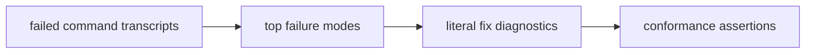
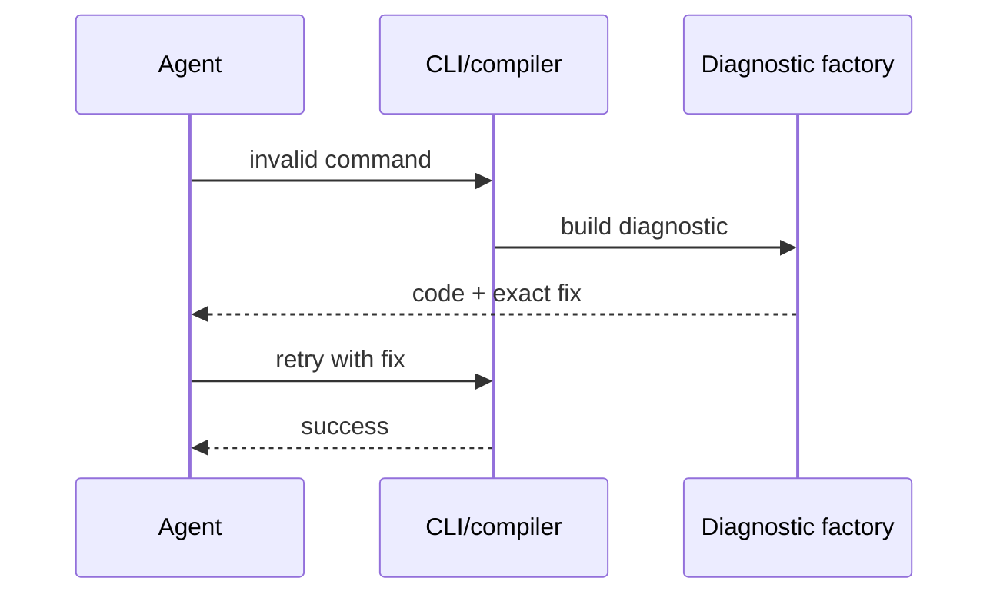

# PRD: Prescriptive Diagnostics v2

`Planning Mode: Principal Architect`
`Complexity: 6 -> MEDIUM mode`

Score basis: +2 touches 6-10 files, +2 multi-package diagnostics/contracts,
+1 transcript mining, +1 conformance/release-gate impact.

## 1. Context

**Problem:** Failed commands still cost multi-step diagnose-retry loops because
diagnostics often name the violation without containing the exact fix.

**Files Analyzed:**

- `docs/PRDs/archive/engine-improvement-candidates-2026-07-07.md`
- `CHALLENGES.md`
- `tools/agent-benchmark/TOKEN-COST-DIRECTION.md`
- `packages/cli/src/`
- `packages/compiler/src/`
- `packages/ir/src/`

**Current Behavior:**

- Diagnostics are stable and structured in many paths.
- Pilot medians still showed 4-9 failed commands per session.
- Some diagnostics require agents to grep source or infer exact flag/import
  shape.

## Pre-Planning Findings

**How will this feature be reached?**

- [x] Entry point identified: CLI/compiler/validator failure paths.
- [x] Caller file identified: command handlers and diagnostic factories.
- [x] Registration/wiring needed: transcript failure inventory,
  diagnostic text/fix updates, conformance assertions.

**Is this user-facing?**

- [x] YES. Agents and users see command errors and suggested fixes.
- [ ] NO.

**Full user flow:**

1. Agent runs an invalid command or script build.
2. Diagnostic includes code, severity, path, message, and literal fix.
3. Agent applies the exact fix in one step.
4. Next command succeeds.

## 2. Solution

**Approach:**

- Mine failed commands from pilot, rerun, and off-recipe transcripts.
- Pick the top roughly 10 failure modes by frequency and repair cost.
- Update each diagnostic to include exact flags, valid values, schema snippets,
  or import lines.
- Add tests asserting the fix text remains present and correct.
- Keep existing diagnostic codes stable.

**Key Decisions:**

- [x] No diagnostic renumbering.
- [x] Fix text must be executable, not generic advice.
- [x] New categories are out of scope unless required for a top failure mode.

**Data Changes:** None.

## 3. Sequence Flow

## 4. Execution Phases

#### Phase 1: Failure Mode Inventory - The diagnostic backlog is measured.

**Files (max 5):**

- `tools/agent-benchmark/DIAGNOSTIC-FAILURE-AUDIT-2026-07-XX.md`
- `tools/verify/artifacts/agent-benchmark/*` - transcript evidence.

**Implementation:**

- [ ] Extract every failed command from pilot/rerun/off-recipe transcripts.
- [ ] Group by diagnostic code and repair action.
- [ ] Select top failure modes by frequency and token cost.

**Tests Required:**

| Test File | Test Name | Assertion |
|-----------|-----------|-----------|
| audit review | `should rank diagnostics by observed repair cost` | top list cites transcripts |

**User Verification:**

- Action: review audit.
- Expected: each selected diagnostic has an observed failure and desired fix.

#### Phase 2: CLI Argument And Path Fixes - Common bad commands self-correct.

**Files (max 5):**

- `packages/cli/src/diagnostics*.ts` - fix metadata.
- `packages/cli/src/commands/*.ts` - command-specific messages.
- `packages/cli/src/commands/*.test.ts` - assertions.
- `packages/cli/src/testUtils/*` - diagnostic helpers if needed.

**Implementation:**

- [ ] Add exact missing/invalid flag suggestions.
- [ ] Add exact path suggestions for missing scene, script, prefab, or project.
- [ ] Assert JSON diagnostics include structured `fix` when supported.

**Tests Required:**

| Test File | Test Name | Assertion |
|-----------|-----------|-----------|
| `packages/cli/src/commands/*.test.ts` | `should suggest exact flag when required option is missing` | diagnostic fix contains the full flag |
| `packages/cli/src/commands/*.test.ts` | `should suggest valid path when source path is missing` | diagnostic names nearest valid path |

**User Verification:**

- Action: run a known bad command from the audit.
- Expected: the next command can be copied from the diagnostic fix.

#### Phase 3: Script/Schema Fixes - Import and schema errors contain concrete repair text.

**Files (max 5):**

- `packages/compiler/src/*diagnostic*.ts`
- `packages/ir/src/*diagnostic*.ts`
- `packages/compiler/src/*.test.ts`
- `packages/ir/src/*.test.ts`
- `packages/ir/fixtures/*` - fixtures for schema errors.

**Implementation:**

- [ ] Add exact named import fix for stdlib import violations.
- [ ] Add schema snippets for common structured-source mistakes.
- [ ] Keep messages compact enough for agent output budgets.

**Tests Required:**

| Test File | Test Name | Assertion |
|-----------|-----------|-----------|
| `packages/compiler/src/*.test.ts` | `should include exact stdlib import fix when script import is invalid` | message contains allowed named import shape |
| `packages/ir/src/*.test.ts` | `should include schema snippet when field shape is invalid` | fix text names expected field and example |

**User Verification:**

- Action: intentionally use a disallowed import.
- Expected: diagnostic says the exact allowed import line.

#### Phase 4: Recovery Metric - Benchmark reports whether failures recover in one step.

**Files (max 5):**

- `tools/agent-benchmark/*` - failure recovery analysis.
- `tools/verify/artifacts/agent-benchmark/*/REPORT.md` - report shape.
- `docs/status/capabilities/*.md`
- `docs/STATUS.md`

**Implementation:**

- [ ] Add recovery-step counting to benchmark analysis.
- [ ] Report failed-command median and one-step recovery rate.
- [ ] Update status docs with evidence.

**Tests Required:**

| Test File | Test Name | Assertion |
|-----------|-----------|-----------|
| benchmark analysis test | `should count one-step diagnostic recovery` | report distinguishes immediate recovery from loops |

**User Verification:**

- Action: inspect next benchmark report.
- Expected: failed-command median and recovery-step metric are visible.

## 5. Checkpoint Protocol

- Automated checkpoint after each phase.
- Manual spot review of diagnostic wording for clarity after phases 2 and 3.

## 6. Verification Strategy

- Unit tests assert exact fix text.
- Conformance tests cover schema/compiler diagnostics.
- Benchmark recovery metric confirms field behavior.
- `pnpm verify:conformance` for shared contracts.

## 7. Acceptance Criteria

- [ ] Top observed failure modes have literal fix diagnostics.
- [ ] Diagnostic codes remain stable.
- [ ] Tests assert fix text for every changed diagnostic.
- [ ] Next benchmark failed-command median is 0-1.
- [ ] Any remaining failure recovers in one step or is documented as new work.

