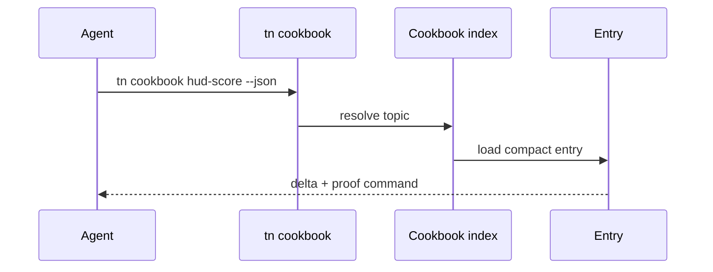

# PRD: Cookbook Few-Shot Pattern Pairs

`Planning Mode: Principal Architect`
`Complexity: 6 -> MEDIUM mode`

Score basis: +2 touches 6-10 files across docs, CLI, templates, verify tools;
+2 new command/content surface; +1 transcript audit; +1 cookbook verification
impact.

## 1. Context

**Problem:** The API card says what exists, but agents need small complete
examples showing the exact source delta for common game patterns.

**Files Analyzed:**

- `docs/PRDs/archive/engine-improvement-candidates-2026-07-07.md`
- `CHALLENGES.md`
- `tools/agent-benchmark/TOKEN-COST-DIRECTION.md`
- `examples/`
- `templates/structured-source-starter/AGENTS.md`
- `docs/cookbook/`

**Current Behavior:**

- Examples exist but are too large to replay as compact few-shot context.
- Agents grep engine internals when API-card coverage runs out.
- Starter instructions can advertise compact commands, but cookbook lookup is
  not yet a first-class CLI surface.

## Pre-Planning Findings

**How will this feature be reached?**

- [x] Entry point identified: `tn cookbook <topic> --json`.
- [x] Caller file identified: CLI command router and starter instructions.
- [x] Registration/wiring needed: cookbook index, compact entry schema,
  verification command, API card/starter links.

**Is this user-facing?**

- [x] YES. Agents and users retrieve worked deltas.
- [ ] NO.

**Full user flow:**

1. Agent needs a respawning collectible, HUD score, or trigger pattern.
2. Agent runs `tn cookbook collectible-respawn --json`.
3. CLI returns a compact goal/delta/proof entry.
4. Agent applies the pattern using bounded commands or source edits when no
   command exists.

## 2. Solution

**Approach:**

- Distill 10-20 pattern-sized pairs from examples and benchmark transcripts.
- Keep each entry under roughly 1.5 KB.
- Shape entries as goal, content JSON delta, script diff, and proof command.
- Serve entries by compact grep-able CLI index.
- Advertise cookbook lookup in starter `AGENTS.md`/`CLAUDE.md`.

**Key Decisions:**

- [x] No prose tutorials.
- [x] Entries are pattern-sized and proof-backed.
- [x] Topic list is seeded from observed engine greps and benchmark needs.

**Data Changes:** New cookbook entry files and index.

## 3. Sequence Flow

## 4. Execution Phases

#### Phase 1: Topic Audit And Entry Schema - Cookbook content has a stable shape.

**Files (max 5):**

- `docs/cookbook/README.md` - schema and entry rules.
- `docs/cookbook/index.json` - initial empty/seed index.
- `tools/agent-benchmark/COOKBOOK-TOPIC-AUDIT-2026-07-XX.md`
- `tools/verify/src/cookbook*.ts` - verifier if needed.

**Implementation:**

- [ ] Audit transcript `rg`/engine-grep events.
- [ ] Define compact entry schema: topic, goal, delta, script, proof.
- [ ] Set entry byte budget and validation rules.

**Tests Required:**

| Test File | Test Name | Assertion |
|-----------|-----------|-----------|
| cookbook verifier | `should validate cookbook entry schema and size budget` | entries are valid and compact |

**User Verification:**

- Action: inspect topic audit.
- Expected: initial topic list maps to observed agent questions.

#### Phase 2: First Ten Pattern Pairs - Common patterns are answerable without engine grep.

**Files (max 5):**

- `docs/cookbook/patterns/*.json` - first 10 entries.
- `docs/cookbook/index.json` - topic index.
- `tools/verify/src/cookbook*.test.ts` - validation tests.
- `docs/API-CARD.md` or generator source - lookup instruction.

**Implementation:**

- [ ] Distill entries from examples and benchmark deltas.
- [ ] Include one proof command per entry.
- [ ] Keep every entry under the size budget.

**Tests Required:**

| Test File | Test Name | Assertion |
|-----------|-----------|-----------|
| `tools/verify/src/cookbook*.test.ts` | `should validate first cookbook entries` | schema and byte budget pass |

**User Verification:**

- Action: read an entry for a HUD score pattern.
- Expected: it contains exact source delta and proof command, not prose only.

#### Phase 3: CLI Lookup - Agents can pull compact examples on demand.

**Files (max 5):**

- `packages/cli/src/commands/cookbook.ts`
- `packages/cli/src/commands/cookbook.test.ts`
- `packages/cli/src/index.ts` or command router.
- `docs/cookbook/index.json`
- `package.json` scripts if `verify:cookbook` changes.

**Implementation:**

- [ ] Add `tn cookbook <topic> --json`.
- [ ] Add topic search/list behavior with compact output.
- [ ] Return stable diagnostics for missing topics.

**Tests Required:**

| Test File | Test Name | Assertion |
|-----------|-----------|-----------|
| `packages/cli/src/commands/cookbook.test.ts` | `should return compact cookbook entry by topic` | JSON contains goal, delta, proof |
| `packages/cli/src/commands/cookbook.test.ts` | `should suggest nearest topic when missing` | diagnostic lists close matches |

**User Verification:**

- Action: run `tn cookbook collectible-respawn --json`.
- Expected: output is compact and directly actionable.

#### Phase 4: Starter Advertising And Ratchet - Future agents prefer cookbook lookup.

**Files (max 5):**

- `templates/structured-source-starter/AGENTS.md`
- `templates/structured-source-starter/CLAUDE.md`
- `docs/cookbook/patterns/*.json` - expand to 10-20 entries.
- `tools/verify/src/cookbook*.ts`
- `docs/status/capabilities/*.md`

**Implementation:**

- [ ] Advertise cookbook lookup in starter instructions.
- [ ] Expand to 10-20 entries.
- [ ] Add benchmark transcript check for engine-internal greps when feasible.

**Tests Required:**

| Test File | Test Name | Assertion |
|-----------|-----------|-----------|
| cookbook verifier | `should validate all cookbook entries` | `pnpm verify:cookbook` passes |

**User Verification:**

- Action: run a benchmark-style task and inspect transcript.
- Expected: cookbook lookups replace engine-internal greps.

## 5. Checkpoint Protocol

- Automated checkpoint after each phase.
- Manual sample review for entry usefulness after phases 2 and 4.

## 6. Verification Strategy

- Entry schema/size tests.
- CLI command tests.
- `pnpm verify:cookbook`.
- Benchmark transcript check for cookbook adoption.

## 7. Acceptance Criteria

- [ ] 10-20 compact pattern pairs exist.
- [ ] `tn cookbook <topic> --json` returns a directly usable entry.
- [ ] Starter instructions advertise cookbook lookup.
- [ ] `pnpm verify:cookbook` passes.
- [ ] Next benchmark round shows zero engine-internal greps for covered topics.

