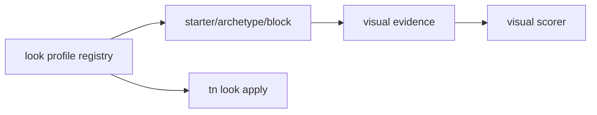
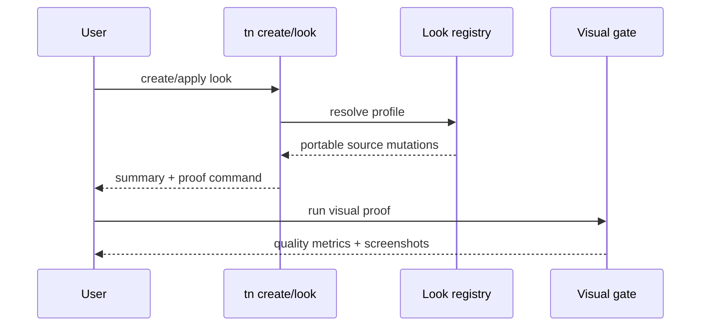

# PRD: Beautiful Scaffolds

`Planning Mode: Principal Architect`
`Complexity: 7 -> HIGH mode`

Score basis: +3 touches 10+ files across CLI, templates, examples, visual
gates, docs, and evidence; +2 multi-package rendering/tooling; +1 visual
quality gate; +1 status/capability impact.

## 1. Context

**Problem:** Passing scaffold screenshots are nonblank but visually flat,
even though look profiles and beautiful defaults exist elsewhere in the repo.

**Files Analyzed:**

- `docs/PRDs/engine-improvement-candidates-2026-07-07.md`
- `CHALLENGES.md`
- `docs/PRDs/done/beautiful-defaults-render-look-profiles.md`
- `templates/structured-source-starter/`
- `packages/runtime-web-three/`
- `tools/verify/src/`

**Current Behavior:**

- Existing scaffolds rely on basic primitives and simple lighting.
- Look profile work is not consistently applied to starters, recipes, or
  future archetypes/blocks.
- Visual gates mostly reject blank output, not low-quality flat scenes.

## Pre-Planning Findings

**How will this feature be reached?**

- [x] Entry point identified: starter generation, archetype/block defaults,
  and `tn look apply <profile> --json`.
- [x] Caller file identified: CLI scaffold emitters and visual verification
  gates.
- [x] Registration/wiring needed: profile registry, command route, default
  application, benchmark scorer thresholds, screenshot evidence.

**Is this user-facing?**

- [x] YES. Users see better starting scenes and can apply named look profiles.
- [ ] NO.

**Full user flow:**

1. User creates a starter/archetype or applies a mechanic block.
2. The project receives a curated look profile automatically.
3. User can run `tn look apply arcade-neon --json` to switch profiles.
4. Visual gate rewards styled scenes over flat primitives.

## 2. Solution

**Approach:**

- Promote or add `tn look apply <profile> --json` with 4-6 curated profiles.
- Apply a default profile to starter, archetypes, and block outputs.
- Keep within current portable contract: palette, env lighting, fog,
  atmosphere, bloom/tonemapping where supported, material presets.
- Add visual scoring thresholds for color bucket count and local contrast.
- Commit before/after screenshots as evidence.

**Key Decisions:**

- [x] No custom shader or new portable rendering contract.
- [x] Profiles must work with existing web contract first.
- [x] Visual thresholds tighten quality without becoming taste-only review.

**Data Changes:** Look profile definitions and generated source defaults.

## 3. Sequence Flow

## 4. Execution Phases

#### Phase 1: Look Command And Profile Registry - Profiles are a bounded CLI surface.

**Files (max 5):**

- `packages/cli/src/commands/look.ts`
- `packages/cli/src/lookProfiles/*.ts`
- `packages/cli/src/commands/look.test.ts`
- `docs/API-CARD.md` or generator source.

**Implementation:**

- [x] Add or promote `tn look apply <profile> --json`.
- [x] Define 4-6 portable profiles.
- [x] Validate profile mutations before writing.

**Tests Required:**

| Test File | Test Name | Assertion |
|-----------|-----------|-----------|
| `packages/cli/src/commands/look.test.ts` | `should apply look profile with portable source mutations` | scene validates after write |
| `packages/cli/src/commands/look.test.ts` | `should list available look profiles` | JSON includes profile names and summaries |

**User Verification:**

- Action: apply each look profile to a starter.
- Expected: source validates and proof command is printed.

#### Phase 2: Default Scaffold Integration - New projects start styled.

**Files (max 5):**

- `templates/structured-source-starter/content/**/*.json`
- `packages/cli/src/commands/create.ts`
- `packages/cli/src/archetypes/*.ts` if PRD-002 exists.
- `packages/cli/src/mechanicBlocks/*.ts` if PRD-003 exists.
- `packages/cli/src/commands/create.test.ts`

**Implementation:**

- [x] Apply default profile to base starter.
- [x] Ensure archetype and block emitters preserve/extend the look profile.
- [x] Avoid profile duplication on repeated commands.

**Tests Required:**

| Test File | Test Name | Assertion |
|-----------|-----------|-----------|
| `packages/cli/src/commands/create.test.ts` | `should create starter with default look profile` | emitted scene includes profile metadata |
| `packages/cli/src/commands/create.test.ts` | `should not duplicate profile when applied twice` | source remains stable |

**User Verification:**

- Action: create a fresh starter and capture screenshot.
- Expected: scene uses styled palette/lighting/fog/material presets.

#### Phase 3: Visual Quality Gate - Flat primitives score worse than styled scenes.

**Files (max 5):**

- `tools/verify/src/visualQuality*.ts`
- `tools/verify/src/visualQuality*.test.ts`
- `tools/agent-benchmark/*scorer*`
- `tools/verify/artifacts/*` - fixture screenshots.

**Implementation:**

- [x] Add minimum color bucket and local contrast thresholds.
- [x] Keep nonblank checks as baseline.
- [x] Produce stable diagnostics with screenshot artifact links.

**Tests Required:**

| Test File | Test Name | Assertion |
|-----------|-----------|-----------|
| `tools/verify/src/visualQuality*.test.ts` | `should fail flat primitive screenshot below contrast threshold` | diagnostic names failed metric |
| `tools/verify/src/visualQuality*.test.ts` | `should pass styled scaffold screenshot` | metrics exceed threshold |

**User Verification:**

- Action: run visual gate on before/after scaffold screenshots.
- Expected: before fails or scores lower; after passes.

#### Phase 4: Evidence And Status - Visual uplift is documented with proof.

**Files (max 5):**

- `examples/*/artifacts/visual-quality/*` - before/after screenshots.
- `docs/status/capabilities/*.md`
- `docs/STATUS.md`
- `docs/bevy-feature-parity.md` if parity claims change.

**Implementation:**

- [x] Commit side-by-side evidence for starter/archetype/recipe screenshots.
- [x] Update capability docs with thresholds and artifact links.
- [x] Avoid any new Bevy parity claim unless proved.

**Tests Required:**

| Test File | Test Name | Assertion |
|-----------|-----------|-----------|
| docs check | `should link visual evidence from status docs` | `pnpm check:docs` passes |

**User Verification:**

- Action: inspect status evidence links.
- Expected: before/after images show visible quality uplift.

## 5. Checkpoint Protocol

- Automated checkpoint after every phase.
- Manual visual checkpoint after phases 2-4.

## 6. Verification Strategy

- CLI tests for profile mutation.
- Visual quality unit tests with fixtures.
- Screenshot evidence for default scaffolds.
- `pnpm check:docs` after capability updates.

## 6A. Completion Evidence

- CLI/profile surface: `packages/cli/src/commands/look.ts`,
  `packages/cli/src/lookProfiles/registry.ts`, and
  `packages/cli/src/commands/look.test.ts`.
- Default starter/archetype/block preservation:
  `packages/cli/src/commands/create.test.ts`,
  `packages/cli/src/commands/add.test.ts`, and
  `templates/structured-source-starter/content/runtime/default.runtime.json`.
- Visual quality thresholds:
  `packages/cli/src/verify/renderingQuality.test.ts` and
  `packages/cli/src/verify/imageAnalysis.ts`.
- Committed visual evidence:
  `docs/pr-evidence/prd-007-beautiful-scaffolds/`.
- Raw generated render-look report reference:
  `tools/verify/artifacts/render-look/verification-report.json`.

## 7. Acceptance Criteria

- [x] 4-6 look profiles are available through CLI.
- [x] Starter, archetypes, and block outputs apply a curated default.
- [x] Visual scorer penalizes flat primitive output.
- [x] Evidence screenshots are committed and linked.
- [x] No new unsupported rendering contract is introduced.
