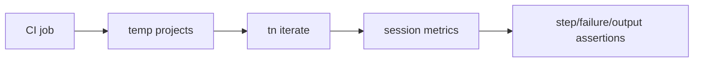
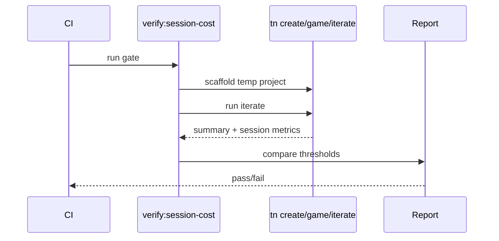

# PRD: Session Cost Ratchet In CI

`Planning Mode: Principal Architect`
`Complexity: 5 -> MEDIUM mode`

Score basis: +2 touches 6-10 files across benchmark capture, verify tools, CI,
and tests; +2 automation/gate behavior; +1 release-gate impact.

## 1. Context

**Problem:** Token regressions are discovered by expensive human-operated
benchmark rounds instead of deterministic CI checks on step count and repair
loops.

**Files Analyzed:**

- `docs/PRDs/archive/engine-improvement-candidates-2026-07-07.md`
- `tools/agent-benchmark/TOKEN-COST-DIRECTION.md`
- `tools/verify/artifacts/agent-benchmark/*/session*.json`
- `tools/verify/src/`
- `.github/workflows/` if present

**Current Behavior:**

- `session.json` captures token splits in some benchmark paths.
- Step count is the causal cost driver but is not consistently gated.
- CI does not deterministically scaffold archetypes/recipes/blocks and assert
  zero repair loops.

## Pre-Planning Findings

**How will this feature be reached?**

- [x] Entry point identified: `pnpm verify:session-cost` or equivalent CI job.
- [x] Caller file identified: verify-tools runner and CI workflow.
- [x] Registration/wiring needed: session step capture, golden-path replay,
  thresholds, package script, workflow entry.

**Is this user-facing?**

- [ ] YES.
- [x] NO. Internal release gate triggered by CI and local verify.

**Full user flow:**

1. Maintainer changes scaffold, CLI, archetype, or block behavior.
2. CI scaffolds representative temp projects and runs deterministic iterate.
3. Gate fails if manual edits, failed commands, step count, or output budget
   regress.
4. Maintainer fixes the owning scaffold/command before benchmark reruns.

## 2. Solution

**Approach:**

- Extend session capture with deterministic tool-step counts where missing.
- Add a verify gate that replays golden scaffold paths without LLM agents.
- Assert zero manual edits, failed commands `== 0`, tool steps `<= 12`, and
  iterate summary `<= 2 KB`.
- Cover each archetype and recipe/block composition that is in the release
  surface.
- Add CI workflow/package script.

**Key Decisions:**

- [x] No LLM agent runs in CI.
- [x] Step count is gated as a proxy for raw token risk.
- [x] Deterministic replay catches scaffold regressions before benchmarks.

**Data Changes:** Session/report JSON adds step-count fields.

## 3. Sequence Flow

## 4. Execution Phases

#### Phase 1: Session Step Capture - Reports expose the causal variable.

**Files (max 5):**

- `tools/agent-benchmark/*session*.ts`
- `tools/verify/src/*session*.ts`
- `tools/verify/src/*session*.test.ts`
- `tools/verify/artifacts/agent-benchmark/*/session-from-events.mjs` if
  reused.

**Implementation:**

- [ ] Add normalized `toolStepCount` and `failedCommandCount` fields.
- [ ] Preserve existing token fields.
- [ ] Add tests for event-log conversion.

**Tests Required:**

| Test File | Test Name | Assertion |
|-----------|-----------|-----------|
| `tools/verify/src/*session*.test.ts` | `should derive tool step count from event log` | count matches fixture |
| `tools/verify/src/*session*.test.ts` | `should derive failed command count` | failures are counted once |

**User Verification:**

- Action: inspect generated session JSON.
- Expected: it includes step and failed-command counts.

#### Phase 2: Deterministic Replay Gate - Golden paths fail on repair loops.

**Files (max 5):**

- `tools/verify/src/sessionCostGate.ts`
- `tools/verify/src/sessionCostGate.test.ts`
- `tools/verify/src/sessionCostFixtures.ts`
- `package.json`
- `pnpm-workspace.yaml` only if needed.

**Implementation:**

- [ ] Scaffold temp projects for current recipes and available archetypes.
- [ ] Run the scaffold-first path and `tn iterate --json`.
- [ ] Assert thresholds and produce compact diagnostics.

**Tests Required:**

| Test File | Test Name | Assertion |
|-----------|-----------|-----------|
| `tools/verify/src/sessionCostGate.test.ts` | `should pass golden path under thresholds` | step count <= 12 and failures == 0 |
| `tools/verify/src/sessionCostGate.test.ts` | `should fail when iterate output exceeds budget` | diagnostic reports output bytes |

**User Verification:**

- Action: run `pnpm verify:session-cost`.
- Expected: deterministic scaffold paths pass or fail with actionable metrics.

#### Phase 3: CI Wiring And Status - Regressions block merges.

**Files (max 5):**

- `.github/workflows/*.yml` - CI job if repo uses GitHub Actions.
- `package.json` - script.
- `docs/status/capabilities/*.md`
- `docs/STATUS.md`
- `tools/verify/src/sessionCostGate.test.ts` - workflow fixture if needed.

**Implementation:**

- [ ] Add CI job for session-cost gate.
- [ ] Document thresholds and rationale.
- [ ] Link evidence from status docs.

**Tests Required:**

| Test File | Test Name | Assertion |
|-----------|-----------|-----------|
| local CI dry run | `should run verify:session-cost from package script` | command exits 0 on current baseline |

**User Verification:**

- Action: inspect CI output for the job.
- Expected: job reports step counts, failed commands, and output budget.

## 5. Checkpoint Protocol

- Automated checkpoint after each phase.
- No manual checkpoint required.

## 6. Verification Strategy

- Unit tests for session metrics.
- Gate tests with passing/failing fixtures.
- Local `pnpm verify:session-cost`.
- CI run evidence.

## 7. Acceptance Criteria

- [ ] Session JSON records step and failed-command counts.
- [ ] Deterministic replay covers current scaffold-first paths.
- [ ] Gate enforces `toolStepCount <= 12`, failed commands `== 0`, and iterate
  summary `<= 2 KB`.
- [ ] CI runs the gate.
- [ ] Status docs link the threshold and evidence.

