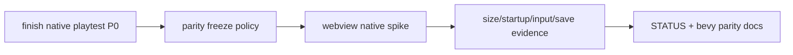
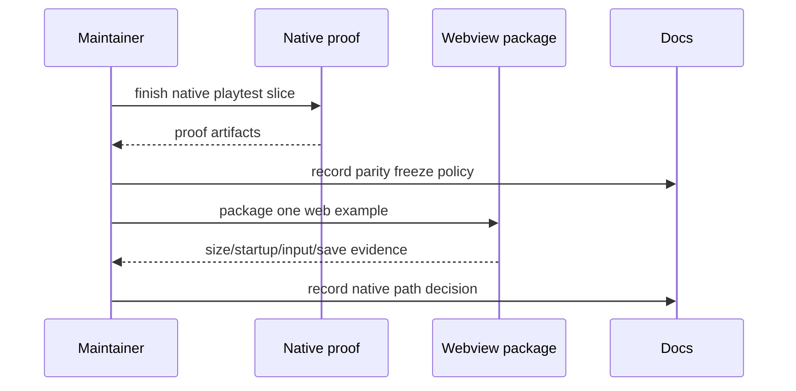

# PRD: Native Path Decision And Parity Freeze

`Planning Mode: Principal Architect`
`Complexity: 7 -> HIGH mode`

Score basis: +2 touches 6-10 files across native runtime, packaging, docs, and
verify tools; +2 external/native packaging integration; +2 multi-package
runtime decision; +1 status/parity claim impact.

## 1. Context

**Problem:** Broad Bevy parity work creates an indefinite 2x maintenance tax,
while the practical native shipping path may be a webview wrapper around the
web runtime.

**Files Analyzed:**

- `docs/PRDs/archive/engine-improvement-candidates-2026-07-07.md`
- `CHALLENGES.md`
- `docs/bevy-feature-parity.md`
- `runtime-bevy/`
- `packages/runtime-web-three/`
- `docs/status/capabilities/*.md`

**Current Behavior:**

- Bevy parity is valuable as proof of portability but expensive as a broad
  standing commitment.
- Native proof tooling is lagging relative to contract claims.
- There is no recorded parity freeze policy tied to shipped-game need.
- A webview/Tauri-style native package has not been spiked and measured.

## Pre-Planning Findings

**How will this feature be reached?**

- [x] Entry point identified: native playtest slice, parity docs, and webview
  packaging spike command.
- [x] Caller file identified: runtime-bevy proof harness, packaging scripts,
  docs/status updates.
- [x] Registration/wiring needed: finish native proof gap, record freeze
  policy, add webview package example, measure size/startup/input/save paths.

**Is this user-facing?**

- [x] YES. It affects native packaging promises and product positioning.
- [ ] NO.

**Full user flow:**

1. Maintainer finishes current native proof slice.
2. Docs declare no new portable Bevy surface without shipped-game need.
3. User packages one web runtime example through the webview path.
4. Evidence records startup, size, input, window, and save-path behavior.

## 2. Solution

**Approach:**

- Finish the in-flight native playtest P0 before policy changes.
- Add explicit parity freeze policy to STATUS and Bevy feature parity docs.
- Spike a Tauri/webview wrapper around one web-runtime example.
- Measure binary/package size, startup time, input/window behavior, and save
  path basics.
- Use shipped-game need as the gate for future Bevy surface promotion.

**Key Decisions:**

- [x] Freeze comes after current native proof P0 is closed.
- [x] Webview path is measured as a practical shipping path, not assumed.
- [x] New Bevy parity surfaces require shipped-game evidence.

**Data Changes:** Packaging spike artifacts and docs policy.

## 3. Sequence Flow

## 4. Execution Phases

#### Phase 1: Native Proof Closure - Existing P0 is not left dangling.

**Files (max 5):**

- `runtime-bevy/*` - native proof harness closure.
- `runtime-bevy/artifacts/*` - evidence.
- `tools/verify/src/*native*.ts`
- `tools/verify/src/*native*.test.ts`
- `docs/bevy-feature-parity.md`

**Implementation:**

- [x] Finish the current native playtest proof slice.
- [x] Record before/after screenshots or equivalent native artifacts.
- [x] Update Bevy parity docs with exact evidence and residuals.

**Tests Required:**

| Test File | Test Name | Assertion |
|-----------|-----------|-----------|
| native verify test | `should run native proof harness for selected example` | artifact manifest is produced |

**User Verification:**

- Action: inspect `runtime-bevy/artifacts/`.
- Expected: native proof artifact links match docs claims.

#### Phase 2: Parity Freeze Policy - Future Bevy breadth has a hard gate.

**Files (max 5):**

- `docs/STATUS.md`
- `docs/bevy-feature-parity.md`
- `docs/status/capabilities/*.md`
- `AGENTS.md` if repo policy needs local update.

**Implementation:**

- [x] State the freeze: no new portable surface promoted to Bevy without a
      shipped game needing it.
- [x] Define what evidence qualifies as shipped-game need.
- [x] Link the policy from status docs.

**Tests Required:**

| Test File | Test Name | Assertion |
|-----------|-----------|-----------|
| docs check | `should keep parity freeze links valid` | `pnpm check:docs` passes |

**User Verification:**

- Action: read `docs/bevy-feature-parity.md`.
- Expected: policy is explicit and dated.

#### Phase 3: Webview Native Package Spike - Practical native path is measured.

**Files (max 5):**

- `packages/packager-webview/*` or chosen package location.
- `examples/<selected>/` - package config.
- `tools/verify/src/webviewPackage*.ts`
- `tools/verify/src/webviewPackage*.test.ts`
- `docs/runtime/*.md` - usage notes.

**Implementation:**

- [x] Package one web-runtime example through the webview path.
- [x] Prove input, window creation, and save-path basics.
- [x] Measure startup time and package size.

**Tests Required:**

| Test File | Test Name | Assertion |
|-----------|-----------|-----------|
| `tools/verify/src/webviewPackage*.test.ts` | `should record webview package size and startup` | report includes numeric measurements |

**User Verification:**

- Action: launch packaged example.
- Expected: it starts, accepts input, and writes/reads a basic save path.

#### Phase 4: Decision Record And Status - Native strategy is clear.

**Files (max 5):**

- `docs/architecture/ADR-*.md` or `docs/runtime/native-path.md`
- `docs/STATUS.md`
- `docs/bevy-feature-parity.md`
- `docs/status/capabilities/*.md`
- `docs/PRDs/done/*` only when finishing/moving this PRD.

**Implementation:**

- [x] Record Bevy role and webview role.
- [x] Link measurements.
- [x] Define follow-up triggers for revisiting Bevy parity.

**Tests Required:**

| Test File | Test Name | Assertion |
|-----------|-----------|-----------|
| docs check | `should keep native path decision links valid` | `pnpm check:docs` passes |

**User Verification:**

- Action: read the native path decision.
- Expected: it states when to use Bevy, when to use webview, and what evidence
  would change the decision.

## 5. Checkpoint Protocol

- Automated checkpoint after every phase.
- Manual checkpoint after phases 1 and 3 because native artifacts/packages need
  direct inspection.

## 5A. Progress Log

2026-07-07 slice:

- Added the parity freeze policy to `docs/STATUS.md`,
  `docs/bevy-feature-parity.md`, and native/tooling capability docs.
- Recorded the native path decision in `docs/runtime/native-path.md`.
- Added `pnpm verify:webview-package`, which packages
  `packages/ir/fixtures/conformance/ui-persistence-settings-facades/game.bundle`
  through `tn package --runtime webview --format installer`.
- Raw local evidence is written under
  `tools/verify/artifacts/webview-package/`, including
  `verification-report.json`, `package-output/desktop-web/package.report.json`,
  `package-output/desktop-web/webview.inspection.json`, and the generated
  archive/installer.
- Remaining before moving this PRD to done: close the native proof P0 and do
  the manual packaged-app launch inspection called out in phases 1 and 3.

2026-07-07 completion slice:

- Rebuilt the Bevy runtime release binary before proof; the first native run
  used a stale binary and failed the now-preferred `context.input.getAxis`
  starter script path.
- Closed the native P0 with:
  `node packages/cli/dist/index.js playtest --project templates/structured-source-starter --target desktop --entity player --press KeyD --frames 30 --expect-moved --native-screenshots --out ../../runtime-bevy/artifacts/native-playtest-p0/structured-source-starter --json`.
- Raw native evidence:
  `runtime-bevy/artifacts/native-playtest-p0/structured-source-starter/summary.json`
  reports `TN_PLAYTEST_OK`, no diagnostics, `runtime: "bevy"`,
  `target: "desktop"`, `input: "KeyD"`, and movement distance `1.200024`.
  The same directory contains `before.png`, `after.png`,
  `native-frame-samples.json`, `manifest.json`, `observations.json`, and
  `runtime-trace.json`.
- Re-ran `pnpm verify:webview-package`; the latest report under
  `tools/verify/artifacts/webview-package/verification-report.json` records
  `startupMs: 111`, `packageBytes: 3081261`, `archiveBytes: 1067333`,
  five input-facing services, two settings entries, one save slot, and the
  local-static-server launcher startup check. The package inspection still
  explicitly does not claim embedded Wry/Tauri behavior.

## 6. Verification Strategy

- Native proof harness.
- Webview package measurement tests.
- Manual launch check.
- `pnpm check:docs`.

## 7. Acceptance Criteria

- [x] Current native proof P0 is closed with artifacts.
- [x] Parity freeze policy is explicit in status/parity docs.
- [x] One webview-packaged example is measured for size/startup/input/save.
- [x] Native path decision is recorded and linked.
- [x] Future Bevy promotion requires shipped-game need evidence.
