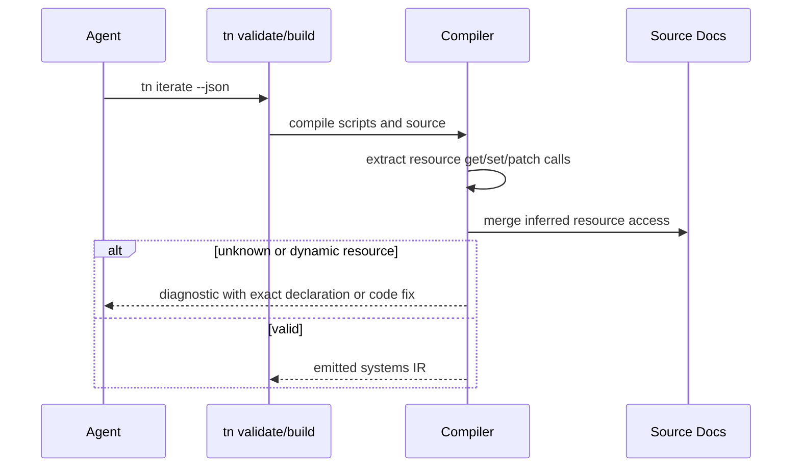

# PRD: Derived Resource Declarations

`Planning Mode: Principal Architect`
`Complexity: 6 -> MEDIUM mode`

Score basis: +2 touches compiler/authoring/CLI/script diagnostics, +2
multi-package source analysis and validation behavior, +1 benchmark failure
class impact, +1 docs/status evidence.

## 1. Context

**Problem:** Agents still pay repeated iterate failures for missing
`resourceReads` and `resourceWrites` even though those declarations are
mechanically derivable from script resource access.

**Files Analyzed:**

- `tools/agent-benchmark/OFF-RECIPE-ROUND-4-RECOMMENDATIONS-2026-07-07.md`
- `packages/compiler/src/scripts/diagnostics.ts`
- `packages/compiler/src/scripts/sourceRefs.ts`
- `packages/compiler/src/scene-document.ts`
- `packages/authoring/src/operations.ts`
- `packages/cli/src/commands/sourceDocuments.ts`
- `packages/runtime-web-three/src/systems/effects.ts`
- `docs/contracts/scripting-api.md`

**Current Behavior:**

- Systems and lifecycle declarations carry explicit resource access lists.
- Compiler diagnostics already detect resource writes not declared in
  `resourceWrites`.
- Runtime effects reject undeclared resource writes.
- Round 4 shows this private-framework convention is the top repeated failure
  class after adoption was fixed.

## Pre-Planning Findings

**How will this feature be reached?**

- [x] Entry point identified: script compile, authoring validate, build,
  `tn iterate`, and source-document mutation commands.
- [x] Caller file identified: compiler script diagnostics and source document
  normalization/writers.
- [x] Registration/wiring needed: resource access extractor, declaration merge
  path, fix-snippet fallback, tests, docs/status evidence.

**Is this user-facing?**

- [x] YES. Agents and users stop hand-maintaining resource access lists.
- [ ] NO.

**Full user flow:**

1. Author writes script code that calls `context.resources.get/set/patch`.
2. Build/validate derives resource read/write requirements from the script.
3. Missing declaration fields are filled or reported as an exact structured fix.
4. `tn iterate` no longer fails on mechanically inferable resource lists.

## 2. Solution

**Approach:**

- Add a compiler-owned extractor for literal resource IDs used by supported
  resource helper calls.
- Merge inferred reads/writes into structured system and lifecycle declarations
  before bundle emit.
- Keep explicit declarations as allowed authoring input, but validate conflicts
  and unknown resource IDs with existing diagnostics.
- Add `--fix` support or exact source-document snippets where automatic writes
  are not appropriate.
- Preserve sorted, deterministic resource lists in emitted IR and source output.

**Key Decisions:**

- [x] Inference covers statically named resource IDs only.
- [x] Dynamic resource names remain unsupported and receive a stable
  diagnostic with a fix.
- [x] Runtime enforcement stays in place as a backstop, but normal authored
  scripts should fail before runtime.

**Data Changes:** Emitted system/lifecycle IR gains derived `resourceReads`
and `resourceWrites`; authored source documents and bundle schema are
unchanged.

## 3. Sequence Flow

## 4. Execution Phases

#### Phase 1: Resource Access Extraction - The compiler can name required resources.

**Files (max 5):**

- `packages/compiler/src/scripts/resourceAccess.ts`
- `packages/compiler/src/scripts/resourceAccess.test.ts`
- `packages/compiler/src/scripts/sourceRefs.ts`
- `packages/compiler/src/scripts/diagnostics.ts`

**Implementation:**

- [x] Parse script AST for supported `resources.get`, `resources.set`, and
  `resources.patch` calls.
- [x] Classify literal gets as reads and set/patch calls as writes.
- [x] Diagnose dynamic resource IDs with a stable unsupported-code diagnostic.

**Tests Required:**

| Test File | Test Name | Assertion |
|-----------|-----------|-----------|
| `packages/compiler/src/scripts/resourceAccess.test.ts` | `should infer resource reads and writes from literal helper calls` | extractor returns sorted IDs |
| `packages/compiler/src/scripts/resourceAccess.test.ts` | `should reject dynamic resource ids with a fix` | diagnostic names the supported literal shape |

**User Verification:**

- Action: run compiler tests for scripts.
- Expected: resource access inference is deterministic and diagnostic-backed.

#### Phase 2: Declaration Merge - Build/validate fills mechanical lists.

**Files (max 5):**

- `packages/compiler/src/scene-document.ts`
- `packages/compiler/src/authoring/normalize.ts`
- `packages/compiler/src/examples.test.ts`
- `packages/authoring/src/operations.ts`
- `packages/authoring/src/operationRegistry.ts`

**Implementation:**

- [x] Merge inferred resource access into systems and lifecycle records during
  script source resolution.
- [x] Preserve explicit declarations and stable sort order.
- [x] Add a diagnostic fix path for non-derivable dynamic IDs while making
  literal helper calls automatic.

**Tests Required:**

| Test File | Test Name | Assertion |
|-----------|-----------|-----------|
| `packages/compiler/src/examples.test.ts` | `should emit structured source system metadata` | IR contains inferred resource reads |
| `packages/compiler/src/examples.test.ts` | `should lower structured lifecycle script refs` | lifecycle IR contains only the inferred write for the export that writes |

**User Verification:**

- Action: remove `resourceWrites` from a starter system that writes
  `GameState`, then run `tn build --json` or `tn iterate --json`.
- Expected: validation/build succeeds with derived emitted metadata or prints a
  single dynamic-ID fix, not a multi-step undeclared-resource failure.

#### Phase 3: CLI Fix And Round-4 Regression Case - The top failure class is impossible to repeat.

**Files (max 5):**

- `packages/cli/src/commands/build.test.ts`
- `packages/cli/src/commands/source-documents-command.test.ts`
- `tools/agent-benchmark/ROUND-4-RESOURCE-DECLARATION-REGRESSION.md`
- `docs/status/capabilities/*.md`
- `docs/STATUS.md`

**Implementation:**

- [x] Add a regression fixture modeled on the round-4 undeclared-resource
  failures.
- [x] Ensure `tn build` reports no undeclared-resource error for inferable
  cases; `tn iterate` uses the same build/compiler path.
- [x] Update status docs with the evidence link.

**Tests Required:**

| Test File | Test Name | Assertion |
|-----------|-----------|-----------|
| `packages/cli/src/commands/build.test.ts` | `should not fail inferable resource writes during build` | no `resourceWrites` diagnostic is emitted |
| regression report | `should cover round-4 undeclared resource cases` | fixture links to categorized transcript evidence |

**User Verification:**

- Action: inspect the regression report and run the listed command.
- Expected: the command passes or provides a single exact fix.

## 5. Checkpoint Protocol

- Automated checkpoint after every phase.
- No manual checkpoint required.

## 6. Verification Strategy

- Compiler unit tests for AST extraction.
- Authoring/CLI tests for fix application and deterministic source output.
- `pnpm verify:conformance` if emitted IR or shared diagnostics change.
- Status docs and benchmark regression note.

## 7. Acceptance Criteria

- [x] Literal resource reads/writes are derived from scripts.
- [x] Derived lists are deterministic and schema-validated.
- [x] Dynamic resource IDs fail with a stable, actionable diagnostic.
- [x] Round-4 undeclared-resource failures are covered by regression evidence.
- [x] Future benchmark sessions cannot hit inferable `resourceWrites` or
  `resourceReads` failures.
