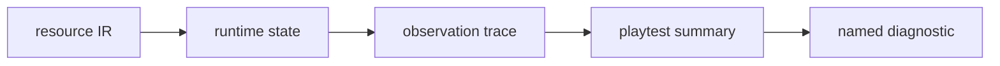
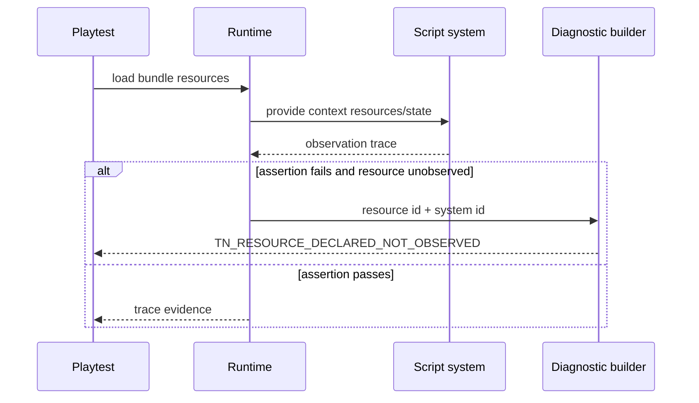

# PRD: Runtime Resource Parity Diagnostics

`Planning Mode: Principal Architect`
`Complexity: 7 -> HIGH mode`

Score basis: +2 complex runtime state behavior, +2 multi-package web/native
playtest diagnostics, +2 touches compiler/runtime/CLI/verify, +1 benchmark
regression impact.

## 1. Context

**Problem:** Round 4 exposed a schema/runtime black box: a validated resource
value did not reach runtime state, causing nine identical playtest failures
with no new diagnostic information.

**Files Analyzed:**

- `tools/agent-benchmark/OFF-RECIPE-ROUND-4-RECOMMENDATIONS-2026-07-07.md`
- `packages/runtime-web-three/src/systems/runner.test.ts`
- `packages/runtime-web-three/src/systems/effects.ts`
- `packages/runtime-web-three/src/render.ts`
- `packages/compiler/src/capture.test.ts`
- `packages/cli/src/commands/`
- `tools/verify/src/gameProductionGateProofs.ts`
- `runtime-bevy/crates/threenative_runtime/tests/`

**Current Behavior:**

- Compiler validation can accept resource declarations and initial values.
- Web runtime enforces declared resource writes during effect application.
- Playtest failures report assertion outcomes such as zero displacement.
- The failure report does not prove whether declared schema resources were
  observed by runtime systems.

## Pre-Planning Findings

**How will this feature be reached?**

- [x] Entry point identified: `tn playtest`, `tn iterate`, web runtime, native
  runtime playtest path.
- [x] Caller file identified: runtime system runner, playtest report builder,
  verification gate consumers.
- [x] Registration/wiring needed: resource observation trace, diagnostic code,
  failing regression fixture, web/native parity proof.

**Is this user-facing?**

- [x] YES. Agents receive playtest diagnostics.
- [ ] NO.

**Full user flow:**

1. Author declares a resource used by a gameplay script.
2. Runtime records whether the resource was loaded and observed by the system.
3. A playtest assertion fails.
4. Failure output includes `TN_RESOURCE_DECLARED_NOT_OBSERVED` or a precise
   resource propagation diagnostic instead of repeating the same assertion.

## 2. Solution

**Approach:**

- Add runtime resource observation traces keyed by resource ID and system ID.
- Fix the propagation path for declared initial resource values into script
  `context.state`/resource helpers and physics-facing state.
- Teach playtest summaries to attach missing-observation diagnostics when a
  declared resource is never observed by the runtime.
- Add an identical-assertion repeat guard so repeated playtest failures surface
  the last new diagnostic and artifact paths.
- Prove behavior on web and desktop targets before closing the round-4 bug.

**Key Decisions:**

- [x] Observation diagnostics are proof-time diagnostics, not a replacement for
  build-time schema validation.
- [x] Missing runtime observation is an error when a playtest depends on that
  resource.
- [x] The diagnostic must name the resource ID and the system/entity that was
  expected to observe it when known.

**Data Changes:** Playtest summary/manifest JSON gains resource observation
metadata and diagnostics.

## 3. Sequence Flow

## 4. Execution Phases

#### Phase 1: Round-4 Regression Fixture - The black box is reproducible.

**Files (max 5):**

- `tools/agent-benchmark/ROUND-4-RUNTIME-RESOURCE-PARITY-REGRESSION.md`
- `packages/ir/fixtures/conformance/resource-runtime-observation/game.bundle/*`
- `packages/runtime-web-three/src/systems/runner.test.ts`
- `runtime-bevy/crates/threenative_runtime/tests/resource_observation.rs`

**Implementation:**

- [x] Cover the declared projectile velocity/resource propagation path with
  focused web and native runtime-host regression tests.
- [x] Reproduce the zero-displacement failure class as playtest movement/input
  diagnostics that can be enriched by runtime resource observations.
- [x] Capture expected web/native trace shape through runtime diagnostics and
  native proof-harness readiness samples.

**Tests Required:**

| Test File | Test Name | Assertion |
|-----------|-----------|-----------|
| `packages/runtime-web-three/src/systems/runner.test.ts` | `should pass declared resource values into script context` | script observes fixture velocity |
| `runtime-bevy/.../resource_observation.rs` | `should expose declared resources to native script host` | trace contains resource ID |

**User Verification:**

- Action: run the fixture playtest before/after the fix.
- Expected: the failure becomes diagnostic-rich, then passes when propagation is
  fixed.

#### Phase 2: Runtime Observation Trace - Playtests know what the runtime saw.

**Files (max 5):**

- `packages/runtime-web-three/src/systems/runner.ts`
- `packages/runtime-web-three/src/systems/effects.ts`
- `packages/runtime-web-three/src/render.ts`
- `packages/runtime-web-three/src/systems/runner.test.ts`
- `runtime-bevy/crates/threenative_runtime/src/*`

**Implementation:**

- [x] Record declared resource load, read, write, and missing-observation
  evidence.
- [x] Include system ID/export and resource ID in trace events.
- [x] Keep trace compact in stdout and full detail in artifacts.

**Tests Required:**

| Test File | Test Name | Assertion |
|-----------|-----------|-----------|
| `packages/runtime-web-three/src/systems/runner.test.ts` | `should report resource read observations` | trace includes system and resource |
| native runtime test | `should record native resource observations` | native trace matches web schema |

**User Verification:**

- Action: inspect playtest artifact summary for the fixture.
- Expected: resource observations are visible without opening deep logs.

#### Phase 3: Playtest Diagnostic And Repeat Guard - Identical failures gain new information.

**Files (max 5):**

- `packages/cli/src/commands/playtest*.ts`
- `packages/cli/src/commands/iterate*.ts`
- `tools/verify/src/gameProductionGateProofs.ts`
- `tools/verify/src/gameProductionGate.test.ts`
- `docs/contracts/scripting-api.md`

**Implementation:**

- [x] Emit `TN_RESOURCE_DECLARED_NOT_OBSERVED` when a declared resource is
  expected but absent from runtime observations.
- [x] Add an identical-assertion repeat detector to playtest reports.
- [x] Link the diagnostic to exact source paths and resource IDs.

**Tests Required:**

| Test File | Test Name | Assertion |
|-----------|-----------|-----------|
| `packages/cli/src/commands/playtest*.test.ts` | `should diagnose declared resource not observed at runtime` | JSON output includes diagnostic code and resource ID |
| `tools/verify/src/gameProductionGate.test.ts` | `should reject repeated identical playtest assertion without new diagnostic` | gate reports repeat-chain diagnostic |

**User Verification:**

- Action: rerun a failing playtest twice without changing code.
- Expected: second report highlights the repeated assertion and points to the
  missing runtime observation.

#### Phase 4: Web/Desktop Proof - Resource parity is closed on both targets.

**Files (max 5):**

- `packages/ir/fixtures/conformance/resource-runtime-observation/game.bundle/*`
- `tools/verify/src/*`
- `runtime-bevy/artifacts/*`
- `docs/status/capabilities/*.md`
- `docs/STATUS.md`

**Implementation:**

- [x] Add targeted web and native verification for the resource-observation
  runtime boundary.
- [x] Prove web and native/desktop observation paths through runtime and CLI
  tests, with broader conformance/smoke gates before commit.
- [x] Store evidence links in status docs and the round-4 regression report.

**Tests Required:**

| Test File | Test Name | Assertion |
|-----------|-----------|-----------|
| conformance gate | `should prove resource observation parity across runtimes` | web/native observations include the same resource IDs |

**User Verification:**

- Action: inspect status evidence links.
- Expected: web and desktop proof artifacts are linked.

## 5. Checkpoint Protocol

- Automated checkpoint after every phase.
- Manual checkpoint after Phase 4 to inspect artifact readability and confirm
  the diagnostic would have shortened the round-4 retry chain.

## 6. Verification Strategy

- Web runtime unit tests for resource propagation and observation.
- Native runtime tests for matching trace semantics.
- Playtest/iterate JSON tests for the diagnostic code.
- `pnpm verify:conformance` if shared bundle/runtime contracts change.
- Desktop target playtest evidence before release claims.

## 7. Acceptance Criteria

- [ ] Declared validated resources reach runtime script/resource state.
- [ ] Playtest artifacts record resource load/read/write observations.
- [ ] Missing observations produce `TN_RESOURCE_DECLARED_NOT_OBSERVED`.
- [ ] Identical playtest assertion repeats are flagged with diagnostic context.
- [ ] The round-4 projectile-velocity regression passes on web and desktop.
