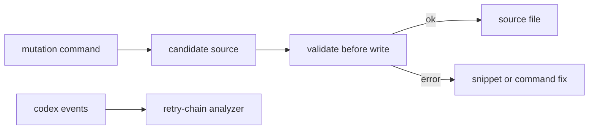
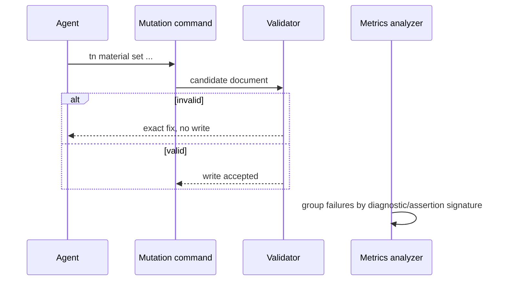

# PRD: Write-Time Validation And Retry Ratchet

`Planning Mode: Principal Architect`
`Complexity: 6 -> MEDIUM mode`

Score basis: +2 validated CLI mutation behavior, +2 benchmark analyzer and
verify tooling, +1 diagnostics impact, +1 docs/status impact.

## 1. Context

**Problem:** Schema mistakes still cost full `tn iterate` cycles, and benchmark
reports do not fail fast when the same diagnostic or assertion repeats.

**Files Analyzed:**

- `tools/agent-benchmark/OFF-RECIPE-ROUND-4-RECOMMENDATIONS-2026-07-07.md`
- `docs/PRDs/done/agent-native-authoring-loop-2026-07-07/PRD-004-schema-aware-mutation-surface.md`
- `docs/PRDs/done/agent-native-authoring-loop-2026-07-07/PRD-005-prescriptive-diagnostics-v2.md`
- `docs/PRDs/done/agent-native-authoring-loop-2026-07-07/PRD-009-session-cost-ratchet-ci.md`
- `packages/cli/src/commands/sourceDocuments.ts`
- `packages/authoring/src/operationRegistry.ts`
- `tools/verify/src/sessionMetrics.ts`
- `tools/verify/src/sessionCostGate.ts`

**Current Behavior:**

- Several bounded mutation commands validate structured source.
- Some schema errors still appear only during a later validate/build/iterate
  cycle.
- Session metrics count failed commands, but not consecutive same-root-cause
  chains or identical assertion repeats.
- Round 4 showed four-failure and nine-failure retry chains.

**Implementation Note:** The existing `@threenative/authoring` source document
and scene mutation helpers already validate candidate source before writing.
This PRD records the writer policy in an audit artifact and adds the missing
retry-chain metrics/gates to session-cost verification.

## Pre-Planning Findings

**How will this feature be reached?**

- [x] Entry point identified: `tn add`, `tn scene`, `tn ui`, `tn material`,
  source-document commands, benchmark aggregate analyzer.
- [x] Caller file identified: CLI command handlers, authoring operation
  registry, session metrics parser.
- [x] Registration/wiring needed: write-time validation adapter, fix snippet
  application, retry-chain metrics, thresholds in reports/gates.

**Is this user-facing?**

- [x] YES. Agents receive immediate validation failures and one-step fixes.
- [ ] NO.

**Full user flow:**

1. Agent asks the CLI to mutate source.
2. CLI validates the candidate document before writing.
3. Invalid input is rejected immediately with a concrete snippet/fix command.
4. Benchmark report fails if the same diagnostic costs more than one retry.

## 2. Solution

**Approach:**

- Audit all mutation commands and route them through a shared
  validate-before-write helper.
- Add fix-snippet output for mutation rejections that currently defer to
  iterate.
- Extend session metrics with consecutive same-diagnostic counts and
  identical playtest assertion repeat counts.
- Add thresholds: max consecutive same diagnostic `<= 1`; identical assertion
  repeats `== 0`.
- Keep raw tokens as a metric, but make retry chains a hard regression.

**Key Decisions:**

- [x] No schemaless raw JSON mutation command.
- [x] Every writer either validates before write or is explicitly excluded with
  rationale.
- [x] Retry-chain metrics use diagnostic codes when present and normalized
  assertion signatures for playtest failures.

**Data Changes:** Benchmark/session reports gain retry-chain fields.

## 3. Sequence Flow

## 4. Execution Phases

#### Phase 1: Mutation Writer Audit - Every write path has a validation policy.

**Files (max 5):**

- `tools/agent-benchmark/WRITE-TIME-VALIDATION-AUDIT-2026-07-07.md`
- `packages/cli/src/commands/sourceDocuments.ts`
- `packages/authoring/src/operationRegistry.ts`
- `packages/authoring/src/operations.ts`

**Implementation:**

- [x] List every command that writes `content/**/*.json` or generated starter
  source.
- [x] Mark each as validate-before-write, generated-only, or deferred with
  reason.
- [x] Identify the remaining round-4 schema mistakes that need instant
  rejection.

**Tests Required:**

| Test File | Test Name | Assertion |
|-----------|-----------|-----------|
| audit review | `should classify every source writer` | no command writer is unclassified |

**User Verification:**

- Action: read the audit.
- Expected: round-4 schema errors map to concrete writer fixes.

#### Phase 2: Shared Validate-Before-Write Helper - Bad source never lands.

**Files (max 5):**

- `packages/cli/src/sourceWriters/validatedWrite.ts`
- `packages/cli/src/sourceWriters/validatedWrite.test.ts`
- `packages/cli/src/commands/sourceDocuments.ts`
- `packages/cli/src/commands/*.test.ts`
- `packages/authoring/src/operations.ts`

**Implementation:**

- [x] Add a helper that validates candidate structured source before writing.
- [x] Convert highest-risk mutation commands to the helper.
- [x] Return exact fix snippets for invalid schema shape, invalid input ID, and
  legacy transform form.

**Tests Required:**

| Test File | Test Name | Assertion |
|-----------|-----------|-----------|
| `packages/cli/src/sourceWriters/validatedWrite.test.ts` | `should reject invalid candidate before writing` | original file remains unchanged |
| `packages/cli/src/commands/*.test.ts` | `should return exact fix for invalid input id` | diagnostic names valid IDs |

**User Verification:**

- Action: run a command with a known invalid ID or schema field.
- Expected: command exits quickly, leaves files unchanged, and prints a fix.

#### Phase 3: Retry-Chain Metrics - Repeated root causes are visible.

**Files (max 5):**

- `tools/verify/src/sessionMetrics.ts`
- `tools/verify/src/sessionMetrics.test.ts`
- `tools/verify/src/sessionCostGate.ts`
- `tools/verify/src/sessionCostGate.test.ts`
- `tools/agent-benchmark/*`

**Implementation:**

- [x] Parse diagnostic codes from command/playtest JSON output where present.
- [x] Normalize playtest assertion signatures.
- [x] Report `maxConsecutiveSameDiagnostic` and
  `identicalAssertionRepeatCount`.
- [x] Fail aggregate gates when thresholds are exceeded.

**Tests Required:**

| Test File | Test Name | Assertion |
|-----------|-----------|-----------|
| `tools/verify/src/sessionMetrics.test.ts` | `should count consecutive same diagnostic failures` | max chain matches fixture |
| `tools/verify/src/sessionMetrics.test.ts` | `should count repeated identical playtest assertions` | repeats exclude first occurrence |

**User Verification:**

- Action: run analyzer over the round-4 pk-r2 transcript.
- Expected: report names the nine-failure identical assertion chain.

#### Phase 4: Status And Benchmark Gate - One-retry is the enforced standard.

**Files (max 5):**

- `tools/verify/src/sessionCostGate.ts`
- `package.json`
- `docs/status/capabilities/*.md`
- `docs/STATUS.md`
- `tools/agent-benchmark/ROUND-5-PROTOCOL.md`

**Implementation:**

- [x] Add thresholds to the local benchmark/session gate.
- [x] Document the one-retry rule and identical-assertion zero-repeat rule.
- [x] Update status with links to the round-4 failure evidence and new metric.

**Tests Required:**

| Test File | Test Name | Assertion |
|-----------|-----------|-----------|
| `tools/verify/src/sessionCostGate.test.ts` | `should fail when identical failed assertions repeat` | diagnostic reports assertion repeat count |

**User Verification:**

- Action: inspect the next benchmark aggregate report.
- Expected: retry-chain fields are first-class metrics.

## 5. Checkpoint Protocol

- Automated checkpoint after every phase.
- No manual checkpoint required.

## 6. Verification Strategy

- Unit tests for validate-before-write and unchanged-file guarantees.
- CLI command tests for fix snippets.
- Session metrics fixtures for diagnostic and assertion repeat chains.
- `pnpm verify:conformance` if shared diagnostic output changes.

## 7. Acceptance Criteria

- [x] All source-writing CLI paths have a validation policy.
- [x] Highest-risk mutation commands validate before writing.
- [x] Round-4 schema mistake classes fail immediately with exact fixes.
- [x] Benchmark reports include retry-chain and identical-assertion metrics.
- [x] Gates enforce max same-diagnostic chain `<= 1` and assertion repeats
  `== 0`.
