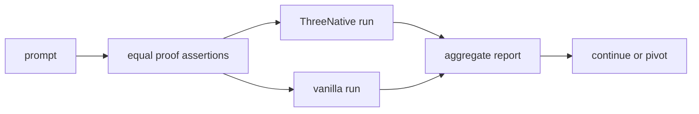
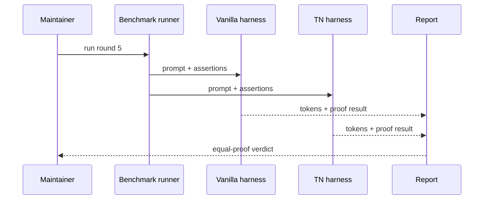

# PRD: Equal-Proof Benchmark Protocol

`Planning Mode: Principal Architect`
`Complexity: 5 -> MEDIUM mode`

Score basis: +2 benchmark harness/protocol changes, +1 analyzer/reporting,
+1 prompt set expansion, +1 docs/status decision impact.

## 1. Context

**Problem:** The current off-recipe gate compares ThreeNative sessions that run
real playtests against vanilla Three.js sessions that only prove page load and
movement smoke, so raw-token ratio prices unequal products.

**Files Analyzed:**

- `tools/agent-benchmark/OFF-RECIPE-ROUND-4-RECOMMENDATIONS-2026-07-07.md`
- `tools/agent-benchmark/OFF-RECIPE-DIRECTIVE.md`
- `tools/agent-benchmark/TOKEN-COST-DIRECTION.md`
- `tools/verify/artifacts/agent-benchmark/`
- `tools/verify/src/sessionMetrics.ts`
- `tools/verify/src/sessionCostGate.ts`

**Current Behavior:**

- Round-4 raw ratios failed the historical `<= 0.5x` gate.
- Adoption of `tn game plan`, cookbook, and `tn iterate` is fixed.
- Vanilla sessions pass with a weaker proof bar than ThreeNative sessions.
- `n=2` repeats allowed large median swings.

**Implementation Note:** Round-5 proof contracts are committed in
`tools/agent-benchmark/src/proof-contract.ts`, vanilla proof validation uses
the same contract, and aggregate reports gate only proof-passing runs with
three repeats and continuity/beyond-one-shot thresholds.

## Pre-Planning Findings

**How will this feature be reached?**

- [x] Entry point identified: agent benchmark runner, prompt definitions,
  aggregate report generator.
- [x] Caller file identified: benchmark scripts and report/analyzer modules.
- [x] Registration/wiring needed: shared playtest assertion contract, vanilla
  proof adapter, prompt set expansion, gate threshold update.

**Is this user-facing?**

- [ ] YES.
- [x] NO. This is release/strategy infrastructure.

**Full user flow:**

1. Maintainer launches a round-5 benchmark.
2. Both vanilla and ThreeNative candidates receive the same committed mechanic
   assertions.
3. The report gates on equal-proof token parity and retry/step budgets.
4. Decision rule determines continue, invest in typed authoring, or pivot.

## 2. Solution

**Approach:**

- Define a neutral assertion contract for each prompt: displacement thresholds,
  objective checks, fail/retry checks, and prompt-specific mechanic checks.
- Require vanilla candidates to pass the same assertions through a lightweight
  harness before token ratios are accepted.
- Replace the hard `<= 0.5x` raw-token gate with `<= 1.0-1.5x` at equal proof,
  failed-command median, step budget, and retry-chain thresholds.
- Add beyond-one-shot prompts where vanilla must iterate to satisfy committed
  proof.
- Raise repeats to at least three per condition.

**Key Decisions:**

- [x] Raw tokens remain reported, but no longer gate unequal proof.
- [x] Current prompts remain for continuity.
- [x] New prompts are selected by generic complexity criteria, not
  prompt-shaped recipes.

**Data Changes:** Benchmark reports gain proof-bar metadata, prompt complexity
classification, repeat count, and decision-rule output.

## 3. Sequence Flow

## 4. Execution Phases

#### Phase 1: Proof Contract - Prompts define equal assertions.

**Files (max 5):**

- `tools/agent-benchmark/ROUND-5-PROTOCOL.md`
- `tools/agent-benchmark/prompts/*.md`
- `tools/agent-benchmark/proof-contract.ts`
- `tools/agent-benchmark/proof-contract.test.ts`

**Implementation:**

- [x] Add assertion specs for checkpoint race and physics knockdown.
- [x] Include displacement, objective, and fail/retry checks where applicable.
- [x] Mark current prompts as continuity prompts.

**Tests Required:**

| Test File | Test Name | Assertion |
|-----------|-----------|-----------|
| `tools/agent-benchmark/proof-contract.test.ts` | `should require proof assertions for every prompt` | no benchmark prompt lacks assertions |

**User Verification:**

- Action: read `ROUND-5-PROTOCOL.md`.
- Expected: proof requirements are identical by condition.

#### Phase 2: Vanilla Proof Adapter - Vanilla must prove the same product.

**Files (max 5):**

- `tools/agent-benchmark/vanilla-proof.ts`
- `tools/agent-benchmark/vanilla-proof.test.ts`
- `tools/agent-benchmark/runner*.ts`
- `tools/agent-benchmark/prompts/*.md`
- `tools/verify/src/sessionMetrics.ts`

**Implementation:**

- [x] Add a browser/playtest adapter that can exercise vanilla games against
  the neutral assertion contract.
- [x] Fail vanilla sessions that only pass page-load smoke.
- [x] Store proof artifacts next to TN artifacts.

**Tests Required:**

| Test File | Test Name | Assertion |
|-----------|-----------|-----------|
| `tools/agent-benchmark/vanilla-proof.test.ts` | `should fail page-load-only vanilla proof` | missing mechanic assertion fails |
| `tools/agent-benchmark/vanilla-proof.test.ts` | `should pass movement threshold when implemented` | assertion records distance |

**User Verification:**

- Action: inspect a vanilla proof artifact.
- Expected: it reports the same assertions as the TN session.

#### Phase 3: Prompt Set And Repeats - Medians stabilize and memorization is bounded.

**Files (max 5):**

- `tools/agent-benchmark/prompts/*.md`
- `tools/agent-benchmark/ROUND-5-PROTOCOL.md`
- `tools/agent-benchmark/report*.ts`
- `tools/agent-benchmark/report*.test.ts`

**Implementation:**

- [x] Add at least two beyond-one-shot prompts selected by generic criteria:
  persistent save/load state, multi-mechanic coupling, tuned difficulty, or
  content-scale solvability.
- [x] Require at least three repeats per condition.
- [x] Keep current prompts for continuity.

**Tests Required:**

| Test File | Test Name | Assertion |
|-----------|-----------|-----------|
| report test | `should reject benchmark report with fewer than three repeats` | report status is fail |
| prompt test | `should classify continuity and beyond-one-shot prompts` | prompt metadata drives report sections |

**User Verification:**

- Action: generate a dry-run report from fixtures.
- Expected: it shows continuity and beyond-one-shot sections separately.

#### Phase 4: Decision Report - Round 5 gives an honest continue/pivot answer.

**Files (max 5):**

- `tools/agent-benchmark/report*.ts`
- `tools/verify/artifacts/agent-benchmark/round-5-*/REPORT.md`
- `docs/status/capabilities/*.md`
- `docs/STATUS.md`

**Implementation:**

- [x] Gate continuity prompts at `<= 1.5x` equal-proof tokens plus step/retry
  budgets.
- [x] Gate beyond-one-shot prompts at `<= 1.0x` equal-proof tokens where
  vanilla must iterate.
- [x] Emit the decision rule from the recommendation document.

**Tests Required:**

| Test File | Test Name | Assertion |
|-----------|-----------|-----------|
| report test | `should emit continue verdict under equal-proof thresholds` | verdict matches fixture metrics |
| report test | `should emit pivot verdict over equal-proof threshold` | report recommends vanilla-lift decision |

**User Verification:**

- Action: read the round-5 report.
- Expected: it states proof parity, repeat count, thresholds, and decision.

## 5. Checkpoint Protocol

- Automated checkpoint after every phase.
- Manual checkpoint after Phase 1 to confirm assertion contracts are not
  biased toward either implementation.

## 6. Verification Strategy

- Unit tests for proof-contract validation and report thresholds.
- Fixture-driven tests for vanilla proof adapter outcomes.
- Dry-run aggregate report before paid/LLM benchmark execution.
- Status docs update after real round-5 evidence exists.

## 7. Acceptance Criteria

- [x] Every benchmark prompt has committed equal-proof assertions.
- [x] Vanilla sessions must pass the same mechanic checks as TN sessions.
- [x] Repeats are at least three per condition.
- [x] Gate is changed from `<= 0.5x` raw tokens to equal-proof parity
  thresholds plus failed-command/step/retry budgets.
- [x] Round-5 report emits the recommendation decision rule.
