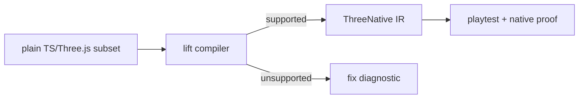
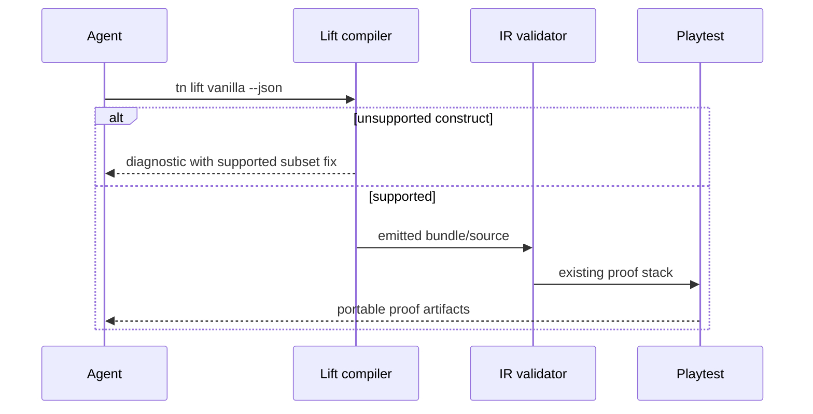

# PRD: Vanilla-Lift Pipeline Decision

`Planning Mode: Principal Architect`
`Complexity: 7 -> HIGH mode`

Score basis: +2 new lift compiler prototype, +2 multi-package IR/compiler/CLI
integration, +2 complex subset diagnostics, +1 strategic decision impact.

## 1. Context

**Problem:** If equal-proof round 5 still showed ThreeNative authoring above
the decision threshold after tactical failure classes were fixed, agents should
author where training data is strongest and ThreeNative should ingest/lift that
output into portable IR. The guided round-5 collector evidence resolved that
gate in the negative, so this decision PRD is closed and the vanilla-lift
compiler prototype is not started.

**Files Analyzed:**

- `tools/agent-benchmark/OFF-RECIPE-ROUND-4-RECOMMENDATIONS-2026-07-07.md`
- `packages/compiler/src/`
- `packages/ir/src/`
- `packages/cli/src/commands/game.ts`
- `packages/sdk/src/`
- `packages/runtime-web-three/src/`
- `tools/verify/src/sessionMetrics.ts`

**Current Behavior:**

- ThreeNative expects structured source and script declarations as the authoring
  contract.
- Vanilla Three.js one-shots common tutorial-like prompts from model memory.
- The IR, runtime, playtest, and scoring stack can still provide portable proof
  after ingestion if a constrained lift is feasible.
- The round-4 decision rule said to prototype this only if round 5 failed at
  equal-proof thresholds. The guided round-5 collector evidence shows direct
  ThreeNative at `0.454x` vanilla raw tokens and `0.443x` cost-weighted at
  equal proof, so the trigger did not fire.

## Pre-Planning Findings

**How will this feature be reached?**

- [x] Entry point identified: experimental `tn lift vanilla --project <path>
  --json` or equivalent CLI command after round-5 decision.
- [x] Caller file identified: CLI command router and compiler lift module.
- [x] Registration/wiring needed: constrained subset spec, AST extractor,
  rejection diagnostics, IR fixture, playtest proof.

**Is this user-facing?**

- [x] YES, but only as an experimental pivot path.
- [ ] NO.

**Full user flow:**

1. Agent authors a plain Three.js/TypeScript game in a constrained style.
2. Maintainer runs `tn lift vanilla --json`.
3. Lift compiler extracts entities, transforms, materials, input, objectives,
   scoring, and supported physics metadata.
4. Unsupported constructs are rejected loudly with fix snippets.
5. Lifted IR runs through existing ThreeNative playtest and native proof stack.

## 2. Solution

**Approach:**

- Gate work on the PRD-016 equal-proof round-5 decision.
- Define a small honest subset based on `tn game plan` mechanic taxonomy:
  movement, objectives, scoring, hazards, physics interactions, and fail/retry.
- Build an AST-based lift prototype for one or two benchmark-like vanilla game
  shapes.
- Reject unsupported arbitrary Three.js calls instead of silently dropping
  behavior.
- Compare lift cost against direct ThreeNative and typed-spec authoring before
  any product pivot.

**Key Decisions:**

- [x] This PRD is decision-gated; do not start before equal-proof round 5.
- [x] Silent partial lifts are forbidden.
- [x] The existing IR/runtime/proof stack remains the asset being reused.

**Data Changes:** Experimental lift reports and lifted source/IR fixtures.

## 3. Sequence Flow

## 4. Execution Phases

#### Phase 1: Decision Gate - Lift work starts only if evidence demands it.

**Files (max 5):**

- `tools/verify/artifacts/agent-benchmark/round-5-*/REPORT.md`
- `tools/agent-benchmark/VANILLA-LIFT-DECISION-2026-07-XX.md`
- `docs/status/capabilities/*.md`
- `docs/STATUS.md`

**Implementation:**

- [x] Apply the round-4 decision rule to round-5 equal-proof evidence.
- [x] Record whether direct TN/typed-spec authoring remains viable.
- [x] Start the prototype only if TN stays above `~1.5x` at equal proof after
  failure classes are engineered out. Outcome: the trigger did not fire, so the
  prototype remains unstarted.

**Tests Required:**

| Test File | Test Name | Assertion |
|-----------|-----------|-----------|
| decision review | `should cite equal-proof metrics before lift work starts` | decision doc links report metrics |

**User Verification:**

- Action: read the decision doc.
- Expected: it clearly says continue, typed-spec default, or vanilla-lift
  prototype.

#### Phase 2: Supported Subset Spec - The lift boundary is honest.

**Closure Note:** Phases 2-4 are canceled for this decision PRD. If future
evidence reopens vanilla-lift, create a new PRD with the then-current benchmark
and native-path constraints instead of resuming this closed decision.

**Files (max 5):**

- `docs/architecture/vanilla-lift-subset.md`
- `packages/compiler/src/lift/`
- `packages/compiler/src/lift/subset.test.ts`
- `tools/agent-benchmark/prompts/*.json`

**Implementation:**

- [ ] Define supported AST/API shapes for scene objects, input, movement,
  scoring, physics metadata, and fail/retry.
- [ ] Define explicit unsupported diagnostics for raw renderer handles, DOM,
  timers, workers, arbitrary shaders, and unbounded Three.js APIs.
- [ ] Link subset categories to benchmark prompt mechanics.

**Tests Required:**

| Test File | Test Name | Assertion |
|-----------|-----------|-----------|
| `packages/compiler/src/lift/subset.test.ts` | `should reject unsupported renderer handle access` | diagnostic includes fix guidance |
| `packages/compiler/src/lift/subset.test.ts` | `should accept supported movement/input pattern` | subset matcher returns supported nodes |

**User Verification:**

- Action: review subset doc.
- Expected: unsupported constructs are explicit and not silently lifted.

#### Phase 3: Lift Compiler Prototype - One vanilla game becomes portable IR.

**Files (max 5):**

- `packages/compiler/src/lift/compileVanilla.ts`
- `packages/compiler/src/lift/compileVanilla.test.ts`
- `packages/cli/src/commands/lift.ts`
- `packages/ir/fixtures/conformance/vanilla-lift-smoke/game.bundle/*`
- `examples/vanilla-lift-smoke/`

**Implementation:**

- [ ] Extract supported scene objects, transforms, input handlers, movement
  state, objective/scoring state, and physics metadata.
- [ ] Emit canonical structured source or direct IR bundle with provenance.
- [ ] Add CLI command returning compact lift summary and diagnostics.

**Tests Required:**

| Test File | Test Name | Assertion |
|-----------|-----------|-----------|
| `packages/compiler/src/lift/compileVanilla.test.ts` | `should lift supported vanilla movement game into IR` | emitted bundle validates |
| `packages/cli/src/commands/lift.test.ts` | `should report unsupported constructs without emitting partial IR` | no bundle is written on hard reject |

**User Verification:**

- Action: run `tn lift vanilla --project examples/vanilla-lift-smoke --json`.
- Expected: generated bundle validates and unsupported cases fail loudly.

#### Phase 4: Proof And Cost Trial - Lift is measured against direct authoring.

**Files (max 5):**

- `tools/verify/artifacts/agent-benchmark/vanilla-lift-trial-*/REPORT.md`
- `tools/agent-benchmark/report*.ts`
- `tools/verify/src/sessionMetrics.ts`
- `docs/status/capabilities/*.md`
- `docs/STATUS.md`

**Implementation:**

- [ ] Run lifted output through existing playtest and desktop proof where
  applicable.
- [ ] Compare vanilla+lifter cost to direct TN and typed-spec cost.
- [ ] Emit keep/pivot/stop recommendation.

**Tests Required:**

| Test File | Test Name | Assertion |
|-----------|-----------|-----------|
| trial report | `should compare lift cost against direct authoring` | report includes tokens, steps, failures, proof results |

**User Verification:**

- Action: inspect trial report.
- Expected: the report decides whether vanilla-lift earns more investment.

## 5. Checkpoint Protocol

- Automated checkpoint after every phase.
- Manual checkpoints after Phase 1 and Phase 4 because they are strategic
  investment decisions.

## 6. Verification Strategy

- AST subset unit tests for supported and rejected patterns.
- Compiler tests for emitted IR validation.
- CLI tests for no-partial-output guarantees.
- Existing playtest/conformance proof on lifted fixtures.
- Benchmark trial report before any pivot claim.

## 7. Acceptance Criteria

- [x] Work starts only after equal-proof round-5 evidence triggers the decision.
  Outcome: it did not trigger, so implementation work did not start.
- [x] Decision report records the evidence-backed outcome.
- [x] Vanilla-lift subset/prototype work remains unstarted.

## 8. Progress Log

### 2026-07-07 decision gate check

Recorded the current vanilla-lift gate status in
`tools/agent-benchmark/VANILLA-LIFT-DECISION-2026-07-07.md`.

The reviewed evidence does not satisfy the PRD-018 trigger:

- `tools/verify/artifacts/agent-benchmark/off-recipe-rerun-2026-07-07b/benchmark-report.json`
  is useful round-4/off-recipe evidence, but it uses the older half-vanilla
  threshold instead of the round-5 equal-proof threshold.
- `tools/verify/artifacts/agent-benchmark/typed-spec-trial-2026-07-07a/benchmark-report.json`
  remains `insufficient-data` with one counted typed-spec repeat and no
  comparable direct ThreeNative repeat for the collector prompt.
- `collector-typed-spec-r2` reached `TN_ITERATE_OK`, but it is excluded from
  aggregate medians because the interrupted run has no completed token usage
  record.

Decision at that checkpoint: do not start the vanilla-lift compiler prototype
yet. This checkpoint was superseded by the 2026-07-08 guided round-5 closure
below.

### 2026-07-07 round-5 collector matrix (9/9 proof-passing)

`tools/verify/artifacts/agent-benchmark/round-5-collector-prep-2026-07-07/benchmark-report.json`
now has 3 proof-passing repeats per arm on the collector prompt:

- Direct ThreeNative: median 1.45M tokens (6.29x vanilla raw, 4.02x
  cost-weighted), 35 tool steps (gate 30), 2 failed commands (gate 0).
- Typed-spec: median 1.63M tokens (1.12x direct TN), 4 failed commands.
  Verdict stays `experimental`; typed-spec did not reduce cost.
- Vanilla: median 231K tokens, 13 steps, 0 failed commands, equal-proof
  assertions pass.

Gate reading against the pre-committed rule in `ROUND-5-PROTOCOL.md`:

- The strict trigger ("both surfaces miss after failed-command median 0") is
  NOT yet met: failed-command medians are 2 (direct TN) and 4 (typed-spec),
  so friction is not demonstrably dead in fresh sessions.
- However, the gap is structurally larger than friction can explain. At
  ~41K tokens/step replay cost, hitting 1.5x vanilla (~347K) requires ~8-10
  steps; removing 2 failed commands from a 35-step run cannot close 6.3x.
  The median run spends ~16 of 35 steps on discovery/verify churn
  (`behaviorMedian`: 6 artifact-forensics, 4 engine-source searches, 6
  standalone verify commands, and 0 `tn iterate` uses despite iterate being
  the intended single-step verifier).

Status at that checkpoint: Phase 1 remained open. This was superseded by the
2026-07-08 guided round-5 closure below, which closes the decision PRD without
starting vanilla-lift.

### 2026-07-08 guided round-5 decision closure

`tools/verify/artifacts/agent-benchmark/round-5-collector-guided-2026-07-08/benchmark-report.json`
resolved the decision gate for this PRD:

- Direct ThreeNative median: `20,950` tokens.
- Vanilla median: `46,192` tokens.
- Ratio: `0.454x` raw and `0.443x` cost-weighted.
- Equal-proof repeats: 3 per condition, with proof passing for all scored
  slots.
- Aggregate verdict still fails only because both direct ThreeNative and
  vanilla have failed-command median `1` while the gate requires `0`.

Decision: close PRD-018 without starting vanilla-lift. The trigger required
direct ThreeNative to remain above the equal-proof threshold; the guided round
shows the opposite.
