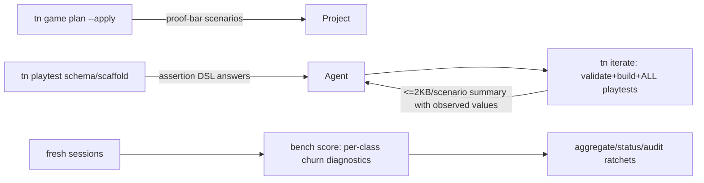
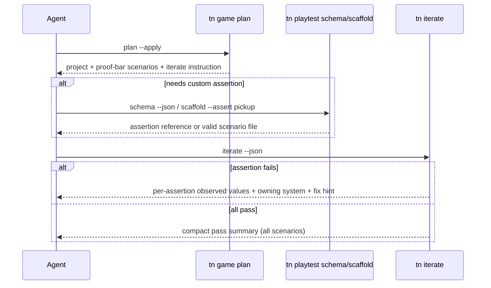

# PRD: Step-Class Elimination For The Authoring Loop

`Planning Mode: Principal Architect`
`Complexity: 7 -> HIGH mode`

Score basis: +3 touches 10+ files across phases, +2 multi-package
(`packages/cli`, `tools/agent-benchmark`, `tools/verify`), +2 new
playtest-scaffold/schema authoring surface.

## 1. Context

**Problem:** The round-5 collector matrix shows the median direct ThreeNative
run burns ~16 of 35 tool steps on measurable churn classes (engine-source
greps, standalone verifies, artifact forensics) that the product surface can
eliminate by construction; at ~41K replay tokens per step, no failure-fix work
can close the 6.29x token gap without removing these steps.

**Files Analyzed:**

- `tools/verify/artifacts/agent-benchmark/round-5-collector-prep-2026-07-07/benchmark-report.json`
- `tools/verify/artifacts/agent-benchmark/round-5-collector-prep-2026-07-07/candidates/collector-threenative-r{1,2,3}/codex-events.jsonl`
- `tools/agent-benchmark/src/aggregate.ts` (behavior counters, adoption budget)
- `packages/cli/src/commands/iterate.ts`
- `packages/cli/src/commands/playtestScenario.ts`, `playtestAssertions.ts`
- `packages/cli/src/commands/cookbook.ts`
- `tools/verify/src/agentIoBudget.ts`, `tools/verify/src/apiCard.ts`

**Current Behavior (from the three direct-TN collector transcripts):**

- `tn iterate` runs exactly one scenario (`firstScenario` or `--scenario`), so
  proving win + retry + HUD forces repeated standalone `tn playtest` calls
  (median `standaloneVerifyCommandCount`: 6, `iterateCommandCount` scored 0
  against the adoption budget).
- Scaffolded playtests do not cover the round-5 proof bar
  (`keyboard-movement`, `pickup-objective`, `win-state`, `retry-path`), so
  every run authors new scenarios by reading engine sources
  (`playtestScenario.ts`, `playtestAssertions.ts`, `playtest.test.ts`) and
  example projects to reverse-engineer the assertion DSL (median
  `engineSourceSearchCommandCount`: 4).
- Playtest/iterate CLI summaries omit observed assertion values, so agents jq
  into `artifacts/**/summary.json`, `effect-log.json`, `observations.json` to
  learn why an assertion failed (median `artifactForensicsCommandCount`: 6).
- `aggregate.ts` already computes `instructionAdoptionBudget` (standalone
  verify 0, forensics 0, engine greps 0, discovery >= 1, iterate >= 1) but it
  is an aggregate boolean, not a per-run, per-class ratchet with diagnostics.

## Pre-Planning Findings

**How will this feature be reached?**

- [x] Entry points identified: `tn playtest scaffold`, `tn playtest schema
  --json`, `tn iterate` (extended), `tn game plan --apply` (extended),
  `agent-benchmark score/aggregate/status/audit` (extended gates).
- [x] Caller files identified: CLI command router (`packages/cli/src`),
  benchmark scorer/aggregator (`tools/agent-benchmark/src`), session-cost
  acceptance (`tools/verify/src`).
- [x] Registration/wiring: new playtest subcommands registered in the CLI
  router and documented in scaffold instructions + cookbook so fresh agents
  discover them without greps.

**Is this user-facing?**

- [x] YES for agent-users of the CLI (new/extended `tn` commands and compact
  summaries); no GUI surface.
- [ ] NO.

**Full user flow:**

1. Agent runs `tn game plan --goal "<idea>" --project . --apply --json` and
   receives proof-bar-aligned playtest scenarios plus next-step instructions
   naming `tn iterate` as the only verification command.
2. Agent needs a new/changed assertion and runs `tn playtest schema --json`
   or `tn playtest scaffold --assert <mechanic> --json` instead of grepping
   engine sources.
3. Agent runs `tn iterate --project . --json` once; it validates, builds, and
   runs ALL `playtests/*.playtest.json` scenarios, returning one compact
   summary with per-assertion observed values and failure explanations.
4. Benchmark scorer emits per-class churn diagnostics per run; aggregate,
   status, and audit gates fail when any churn class exceeds its ratchet.

## 2. Solution

**Approach:**

- Make playtest scenario authoring self-service: machine-readable assertion
  schema plus mechanic-keyed scenario scaffolds, so
  `engineSourceSearchCommandCount` goes to 0 by removing the need.
- Make `tn iterate` subsume all standalone verification: run every scenario in
  one invocation with a bounded, forensics-grade summary, so
  `standaloneVerifyCommandCount` and `artifactForensicsCommandCount` go to ~0.
- Make `tn game plan --apply` emit scenarios that already cover the mechanic
  taxonomy's proof assertions, so common games prove without authoring
  scenarios at all.
- Ratchet each churn class in the benchmark per run (not just per aggregate)
  with named diagnostics, and wire the ratchets into `verify:session-cost` so
  regressions fail CI-shaped checks before any rerun.
- Keep thresholds unchanged: this PRD makes the round-5 confirmation rerun
  friction-free; it does not move any gate.

**Key Decisions:**

- [x] Attack demand, not instructions: round-4 proved adoption fixes alone do
  not close the gap; each churn class loses its *reason to exist*.
- [x] Reuse existing counters in `aggregate.ts`; extend to per-run diagnostics
  rather than inventing a parallel metric system.
- [x] Compact summaries follow the existing `agentIoBudget` byte-budget
  pattern (<= 2KB per scenario).
- [x] No threshold changes; `ROUND-5-PROTOCOL.md` pre-commitment stands.

**Data Changes:** New machine-readable playtest assertion schema output; new
per-run behavior diagnostics in `run-report.json`; no IR/bundle changes.

## 3. Sequence Flow

## 4. Execution Phases

#### Phase 1: Playtest Authoring Surface - Agents get DSL answers from the CLI, not engine greps.

**Files (max 5):**

- `packages/cli/src/commands/playtestSchema.ts` - new `tn playtest schema
  --json` emitting the assertion/step DSL (kinds, fields, examples) derived
  from the same definitions `playtestAssertions.ts` executes.
- `packages/cli/src/commands/playtestScaffold.ts` - new `tn playtest scaffold
  --assert <movement|pickup|win-state|retry> --json` writing a valid scenario.
- `packages/cli/src/commands/playtestSchema.test.ts`
- `packages/cli/src/commands/playtestScaffold.test.ts`
- `packages/cli/src/commands/help.ts` - register + one-line discovery text.

**Implementation:**

- [ ] Derive schema output from the executable assertion registry (single
  source of truth; no hand-maintained duplicate doc).
- [ ] Scaffold templates cover the four round-5 proof-bar assertion families
  observed in the transcripts (keyboard-movement, pickup-objective,
  win-state, retry-path) keyed to `tn game plan` mechanic taxonomy names.
- [ ] Scaffolded scenarios validate against the playtest loader with zero
  manual edits.

**Tests Required:**

| Test File | Test Name | Assertion |
|-----------|-----------|-----------|
| `playtestSchema.test.ts` | `should list every executable assertion kind when schema is requested` | schema kinds set equals assertion registry kinds set |
| `playtestScaffold.test.ts` | `should emit a loader-valid scenario when scaffolding pickup mechanic` | scenario loads and references only project-known IDs |
| `playtestScaffold.test.ts` | `should reject unknown mechanic with fix guidance` | diagnostic lists supported mechanics |

**User Verification:**

- Action: in a fresh scaffold, run `tn playtest scaffold --assert pickup
  --json` then `tn playtest --scenario <emitted> --json`.
- Expected: scenario runs without editing; every DSL question from the r1-r3
  transcripts (`holdFrames`, `textIncludes`, resource assertions, `KeyR`
  press) is answerable from `tn playtest schema --json` output.

#### Phase 2: Iterate Subsumes Verification - One command proves every scenario with forensics inline.

**Files (max 5):**

- `packages/cli/src/commands/iterate.ts` - run ALL `playtests/*.playtest.json`
  by default (keep `--scenario` as filter); summary includes per-assertion
  observed values.
- `packages/cli/src/commands/iterate.test.ts`
- `packages/cli/src/commands/playtestArtifacts.ts` - expose observed
  assertion values / resource snapshots for summary composition.
- `packages/cli/src/commands/playtestArtifacts.test.ts`

**Implementation:**

- [ ] Multi-scenario execution with per-scenario pass/fail rollup and stable
  ordering.
- [ ] Failed assertions report: assertion id, expected, observed
  (`details.after`), owning system where known (reuse the
  `TN_PLAYTEST_RESOURCE_STATE_STAGNATED` snapshot work), and artifact path
  only as a last-resort pointer.
- [ ] Summary stays <= 2KB per scenario under the `agentIoBudget` pattern;
  truncation is explicit, never silent.
- [ ] Every jq query the r1-r3 agents ran against `summary.json` /
  `effect-log.json` / `observations.json` is answered directly in the iterate
  summary.

**Tests Required:**

| Test File | Test Name | Assertion |
|-----------|-----------|-----------|
| `iterate.test.ts` | `should run all scenarios when no scenario flag given` | rollup includes every `playtests/*.playtest.json` |
| `iterate.test.ts` | `should include observed assertion values when a scenario fails` | failed entry has expected + observed + owning system |
| `iterate.test.ts` | `should keep per-scenario summary within byte budget` | bytes <= 2048 per scenario, truncation flagged |

**User Verification:**

- Action: break one scenario in a fixture project, run `tn iterate --json`
  once.
- Expected: single command reports all scenarios; the failure explains itself
  without any follow-up `jq`/`find` into `artifacts/`.

#### Phase 3: Scaffold-To-Proof Coverage - Common games need zero hand-authored scenarios.

**Files (max 5):**

- `packages/cli/src/commands/game/` (plan apply module) - emit proof-bar
  scenarios for planned mechanics using Phase 1 scaffolds.
- `packages/cli/src/commands/gameScore.test.ts` or plan-apply test file -
  coverage assertions.
- `tools/verify/src/agentIoBudget.ts` (or session-cost module) - extend the
  `verify:session-cost` acceptance replay to require: apply + iterate passes
  with zero authored scenarios, zero manual edits.
- `tools/verify/src/agentIoBudget.test.ts`

**Implementation:**

- [ ] `tn game plan --apply` maps each planned mechanic to a scaffolded
  scenario covering its proof assertion family; collector-class plans cover
  all four round-5 assertion families out of the box.
- [ ] Apply output tells the agent explicitly: "verify with `tn iterate`; do
  not run standalone validate/build/playtest".
- [ ] Session-cost acceptance replay proves scaffold -> apply -> iterate
  passes the proof bar with `manualEdits: 0` and `authoredScenarios: 0` for
  the collector recipe (extend to lane-runner, checkpoint-race,
  physics-knockdown recipes as they exist).

**Tests Required:**

| Test File | Test Name | Assertion |
|-----------|-----------|-----------|
| plan-apply test | `should emit scenarios covering all planned mechanic proof families` | emitted scenario set covers plan mechanics' assertion families |
| `agentIoBudget.test.ts` | `should pass session-cost acceptance with zero authored scenarios` | acceptance record shows authoredScenarios 0, manualEdits 0, proof pass |

**User Verification:**

- Action: `tn create` + `tn game plan --goal "collector" --apply --json` +
  `tn iterate --json` with no other commands.
- Expected: all proof-bar assertions pass; three-command path, no edits.

#### Phase 4: Per-Class Benchmark Ratchets - Churn regressions are machine-caught per run.

**Files (max 5):**

- `tools/agent-benchmark/src/aggregate.ts` - per-run churn-class evaluation
  emitting `TN_BENCH_BEHAVIOR_ENGINE_SOURCE_SEARCH_EXCEEDED`,
  `TN_BENCH_BEHAVIOR_STANDALONE_VERIFY_EXCEEDED`,
  `TN_BENCH_BEHAVIOR_FORENSICS_EXCEEDED`,
  `TN_BENCH_BEHAVIOR_ITERATE_MISSING` diagnostics with offending commands.
- `tools/agent-benchmark/src/types.ts` - per-run behavior budget fields.
- `tools/agent-benchmark/src/status.ts` - slot status surfaces per-class
  budget results per scored run.
- `tools/agent-benchmark/src/next-steps-audit.ts` - new requirement rows:
  churn budgets green on the session-cost path before rerun.
- `tools/agent-benchmark/src/aggregate.test.ts` (shared assertions may also
  live in `status.test.ts` / `next-steps-audit.test.ts` touched minimally).

**Implementation:**

- [ ] Budgets (per run, direct-TN and typed-spec arms): engine-source
  searches == 0, standalone verifies == 0, forensics <= 1, iterate >= 1,
  discovery >= 1 — matching the existing `instructionAdoptionBudget` but
  reported per run with the actual offending command strings.
- [ ] `withinInstructionAdoptionBudget` derivation unchanged for old reports
  (nullable fields; no admissibility break for existing artifacts).
- [ ] Audit refuses `run-confirmation-round` next-action until Phase 3's
  session-cost acceptance is green.

**Tests Required:**

| Test File | Test Name | Assertion |
|-----------|-----------|-----------|
| `aggregate.test.ts` | `should emit engine-source-search diagnostic with offending command when budget exceeded` | diagnostic includes command text and count |
| `aggregate.test.ts` | `should keep old reports admissible when behavior counters are absent` | null counters produce no exceeded diagnostics |
| `next-steps-audit.test.ts` | `should block confirmation rerun when churn budgets are not green` | audit returns incomplete with churn requirement rows |

**User Verification:**

- Action: rerun `aggregate` + `audit` against
  `round-5-collector-prep-2026-07-07` artifacts.
- Expected: the three direct-TN runs each show named churn diagnostics with
  the exact grep/jq commands quoted; audit lists churn budgets as the
  blocking requirement.

#### Phase 5: Friction-Free Confirmation Prep - The cross-prompt matrix becomes runnable evidence.

**Files (max 5):**

- `tools/agent-benchmark/src/prepare.ts` - round-5b manifest generation for
  lane-runner, checkpoint-race, physics-knockdown (3x3 each, reusing the
  collector slot machinery).
- `tools/agent-benchmark/src/prepare.test.ts`
- `tools/agent-benchmark/ROUND-5B-PROTOCOL-2026-07-XX.md` - protocol addendum:
  churn ratchets are admissibility conditions; decision rule unchanged.
- `docs/status/capabilities/*.md` + `docs/STATUS.md` - one-line capability
  status updates for the authoring-loop changes (per repo rule).

**Implementation:**

- [ ] Generate prepared manifests only after `next-steps-audit` reports all
  non-session requirements complete (Phase 4 gate).
- [ ] Protocol addendum re-states the pre-committed decision rule verbatim
  and records that thresholds did not move.
- [ ] Hand off: matrix results feed PRD-017 Phase 5 (typed-spec default) and
  PRD-018 Phase 1 (vanilla-lift trigger); this PRD makes no default/pivot
  decision itself.

**Tests Required:**

| Test File | Test Name | Assertion |
|-----------|-----------|-----------|
| `prepare.test.ts` | `should generate three-prompt matrix manifest when audit is green` | manifest has 9 slots per prompt across three arms |
| `prepare.test.ts` | `should refuse manifest generation when audit is incomplete` | command exits nonzero with audit diagnostics |

**User Verification:**

- Action: run `prepare` for round-5b, then `status --json`.
- Expected: operator queue shows pending fresh-session slots for all three
  prompts; no slot is runnable while churn requirements are red.

## 5. Checkpoint Protocol

- Automated checkpoint after every phase via `prd-work-reviewer`.
- Manual checkpoints after Phase 2 (agent-facing summary quality is a
  judgment call — read a broken-scenario iterate summary yourself) and
  Phase 5 (strategic handoff to PRD-017/PRD-018 decisions).

## 6. Verification Strategy

- Unit tests per phase as tabled above (`pnpm test` scoped to touched
  packages first, then full).
- `pnpm typecheck` and `pnpm build` after CLI surface changes.
- `pnpm verify:session-cost` proves the zero-authored-scenario,
  zero-manual-edit, single-iterate path deterministically (Phase 3 exit
  criterion; per `TOKEN-COST-DIRECTION.md`, the benchmark is confirmation,
  not discovery).
- Benchmark CLI (`aggregate`, `status`, `audit`) replayed against the
  existing round-5 collector artifacts as regression fixtures: old runs must
  show the new churn diagnostics; old reports without counters stay
  admissible.
- Transcript-derived question catalog check: every engine-grep and forensics
  jq from `collector-threenative-r{1,2,3}/codex-events.jsonl` must be
  answerable by a Phase 1/2 surface (documented as a checklist in the Phase 1
  review).

## 7. Acceptance Criteria

- [ ] `tn playtest schema --json` answers the assertion-DSL questions from
  all three round-5 direct-TN transcripts; kinds stay in sync with the
  executable registry by test.
- [ ] `tn iterate --json` runs all scenarios in one call with observed values
  inline; per-scenario summary <= 2KB.
- [ ] Collector-class `tn create` + `tn game plan --apply` + `tn iterate`
  passes the round-5 proof bar with zero authored scenarios and zero manual
  edits, enforced by `verify:session-cost`.
- [ ] Per-run churn diagnostics and budgets land in score/aggregate/status/
  audit without breaking admissibility of existing artifacts.
- [ ] Round-5b three-prompt manifest is generated and gated on green churn
  requirements; thresholds and the pre-committed decision rule are unchanged.
- [ ] `docs/STATUS.md` and the relevant `docs/status/capabilities/*.md`
  entries updated.

## 8. Progress Log

### 2026-07-07 PRD created

Grounded in the completed round-5 collector matrix
(`round-5-collector-prep-2026-07-07/benchmark-report.json`, 9/9
proof-passing): direct TN 6.29x raw / 4.02x cost-weighted vs vanilla, 35
median steps vs gate 30, with `behaviorMedian` = 6 artifact-forensics, 4
engine-source searches, 6 standalone verifies, 0 iterate uses. Transcript
audit of `collector-threenative-r{1,2,3}` attributes the churn to three
product gaps: playtest DSL not self-describable, iterate single-scenario
only, and summaries without observed values. This PRD removes the demand for
those steps and ratchets each class per run; the cross-prompt confirmation
rerun (lane-runner, checkpoint-race, physics-knockdown) then feeds the
PRD-017 Phase 5 and PRD-018 Phase 1 decisions.
