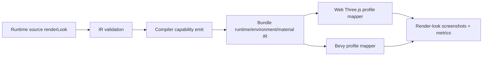
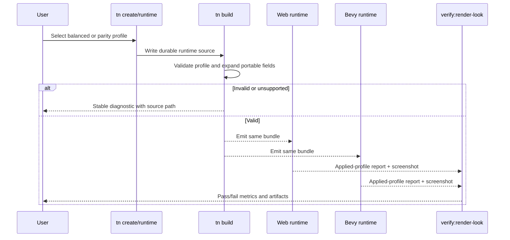

# PRD: Beautiful Defaults Render Look Profiles

Complexity: 13 -> HIGH mode

Score basis: +3 touches 10+ implementation/test/docs files, +2 adds a new
portable profile contract, +2 spans SDK/IR/compiler/CLI/web/Bevy/templates/
verify/docs, +2 requires visual screenshot analysis and threshold tuning, +2
requires cross-runtime renderer capability negotiation, +2 changes generated
project defaults and user-facing visual output.

## 1. Context

**Problem:** ThreeNative can prove portable rendering and visual parity, but
fresh projects still look flatter than a game author expects because quality
renderer choices are scattered across runtime config, atmosphere, lights,
materials, and verification rather than selected through an explicit portable
look profile.

**Files Analyzed:**

- `docs/STATUS.md`
- `docs/bevy-feature-parity.md`
- `docs/visual-parity-policy.md`
- `docs/PRDs/README.md`
- `docs/PRDs/other/default-game-visual-polish.md`
- `docs/PRDs/other/advanced-visual-effects-lighting-material-depth.md`
- `packages/ir/src/runtimeConfig.ts`
- `packages/ir/schemas/runtime-config.schema.json`
- `packages/runtime-web-three/src/render.ts`
- `packages/runtime-web-three/src/conformance.ts`
- `runtime-bevy/crates/threenative_loader/src/types.rs`
- `runtime-bevy/crates/threenative_runtime/src/map_world.rs`
- `runtime-bevy/crates/threenative_runtime/src/conformance.rs`
- `packages/authoring/src/operations.ts`
- `packages/authoring/src/operationRegistry.ts`

**Current Behavior:**

- Runtime config already supports renderer antialias modes, bloom,
  `colorGrading`, depth-of-field metadata, and forward render path.
- Web already applies sRGB output, tone mapping, exposure, and optional bloom
  from runtime config, but profile-level contrast/saturation/post policy is not
  a coherent default contract.
- Bevy already loads runtime renderer config and maps antialias and bloom to
  native camera components; some color-grading semantics remain report-level or
  incomplete.
- Authoring operations expose runtime creation and bloom/antialias settings,
  but not a named quality profile that authors can choose safely.
- This PRD absorbs the useful source-backed visual-polish direction into a
  narrower profile-selection contract that coordinates existing runtime,
  atmosphere, material, and QA fields.
- The visual parity policy explicitly avoids pixel-perfect web/Bevy matching.
  Strict parity paths must stay deterministic and must not inherit game-quality
  effects by accident.

## Pre-Planning Findings

The outside proposal is directionally useful but should not be copied into the
repo as-is. The relevant idea is an explicit, versioned `RenderLookProfile`
selector with `parity` and game-quality choices. Less relevant pieces are a
second full `rendering.ir.json` that duplicates existing runtime/environment/
material contracts, public renderer-specific names such as a particular
engine-only tone mapper, and mandatory first-slice effects like GTAO where
portable support is not already proven.

No `.env` or external service configuration is required. All proof should use
bundle-local fixtures and deterministic artifact paths.

**How will this feature be reached?**

- [x] Entry point identified: `tn create`, `tn runtime ...`, structured source
  runtime documents, compiler bundle emit, web preview, Bevy preview,
  conformance verification, and a focused render-look verification gate.
- [x] Caller file identified: source-document authoring operations, runtime
  config IR validation, compiler capability emit, `runtime-web-three` render
  setup, Bevy world mapping, conformance reports, template scaffolding, and
  verify tooling.
- [x] Registration/wiring needed: SDK/authoring profile helpers, source schema
  and IR validation, capability names, runtime mappings, diagnostics, template
  defaults, package scripts, docs index, status/parity docs when promoted.

**Is this user-facing?**

- [x] YES -> users see better default project screenshots and can select
  `parity`, `balanced`, `cinematic`, or `stylized` without renderer internals.
- [ ] NO.

**Full user flow:**

1. User creates a project or edits runtime settings.
2. The CLI writes a durable source-backed render-look profile selection.
3. The compiler validates the profile, expands it into existing portable
   runtime/environment/material fields, and emits required capabilities.
4. Web and Bevy apply the same semantic profile where supported and report any
   fallback.
5. Conformance uses `parity`; starter/game QA uses `balanced` unless the user
   explicitly opts out.
6. `pnpm verify:render-look` captures artifacts proving strict parity remains
   stable and `balanced` is visibly richer than `parity`.

## 2. Solution

**Approach:**

- Add a compact `RenderLookProfile` contract as a named preset plus bounded
  numeric overrides. It should reference and normalize existing renderer,
  atmosphere, lighting, and material fields rather than inventing a parallel
  complete rendering document.
- Support four profile names: `parity`, `balanced`, `cinematic`, and
  `stylized`. Only `parity` and `balanced` are required for first promotion;
  `cinematic` and `stylized` may validate as presets only after web/Bevy
  mappings and screenshots exist.
- Default maintained starters and generated games to `balanced`. Existing
  projects and conformance fixtures without a profile remain `parity`.
- Keep adapter internals private. Public SDK/IR fields express semantic intent:
  tone mapping family, exposure, contrast, saturation, antialias preference,
  bloom intent, fog/sky intent, shadow quality, and material defaults.
- Require explicit fallback diagnostics when a target cannot provide the
  requested semantic effect.



**Key Decisions:**

- [x] Library/framework choices: reuse existing runtime config validation,
  Three.js renderer/composer paths, Bevy 0.14.2 camera/bloom/antialias
  components, visual calibration tooling, and generated-game screenshot
  sidecars.
- [x] Error-handling strategy: unsupported or out-of-range fields emit stable
  diagnostics with target, profile, source path, fallback behavior, and
  suggested fix.
- [x] Reused utilities: conformance reports, rendering quality metrics, image
  comparison, visual parity policy, runtime source authoring operations, and
  existing bloom/color-grading tests.

**Data Changes:**

- Extend runtime config with a profile selector, for example:

```ts
type RenderLookProfileName = "parity" | "balanced" | "cinematic" | "stylized";

type RenderLookProfileIr = {
  version: 1;
  profile: RenderLookProfileName;
  overrides?: {
    exposure?: number;
    contrast?: number;
    saturation?: number;
    bloomIntensity?: number;
    shadowQuality?: "off" | "low" | "medium" | "high";
    environmentIntensity?: number;
  };
};
```

- Do not duplicate full light, material, atmosphere, or texture documents in a
  new rendering IR file unless a later implementation proves existing source
  documents cannot represent the needed data.
- Add manifest capabilities only for promoted semantics:
  `render.lookProfile.v1`, `render.profile.parity`, `render.profile.balanced`,
  `render.colorManagement.srgb`, `render.toneMapping`, `render.colorGrading`,
  `render.shadow.directional`, `render.postprocess.bloom`, and optional
  report-only capabilities for AO/vignette/sharpen until implemented.

## 3. Sequence Flow



## 4. Execution Phases

#### Phase 1: Profile Contract and Validation - Authors can select parity or balanced through source data.

**Files (max 5):**

- `packages/ir/src/runtimeConfig.ts` - add profile selector and override types.
- `packages/ir/schemas/runtime-config.schema.json` - validate profile names and
  conservative override ranges.
- `packages/ir/src/validate.ts` - add stable diagnostics for bad values and
  unsupported profile/effect combinations.
- `packages/ir/src/validate.test.ts` - accepted/rejected profile tests.
- `docs/contracts/render-look-profiles.md` - semantic contract and parity rules.

**Implementation:**

- [ ] Add `renderer.renderLook` or equivalent source-backed selector under the
  existing runtime config contract.
- [ ] Define first promoted preset values for `parity` and `balanced` only.
- [ ] Keep `cinematic` and `stylized` behind validation/report-only status until
  screenshots prove them.
- [ ] Reject unsupported raw postprocess pass names, renderer handles, and
  Bevy/Three.js-specific payloads.
- [ ] Add diagnostics:
  `TN_RENDER_PROFILE_UNSUPPORTED`, `TN_RENDER_LOOK_OUT_OF_RANGE`,
  `TN_VISUAL_PARITY_PROFILE_MISMATCH`, and
  `TN_RENDER_PROFILE_FALLBACK_USED`.

**Tests Required:**

| Test File | Test Name | Assertion |
| --- | --- | --- |
| `packages/ir/src/validate.test.ts` | `should accept parity and balanced render look profiles` | Runtime config validates without diagnostics. |
| `packages/ir/src/validate.test.ts` | `should reject out of range render look overrides` | Diagnostic includes exact JSON path and suggested range. |
| `packages/ir/src/validate.test.ts` | `should reject backend-specific render look payloads` | Diagnostic prevents raw renderer/postprocess internals. |

**User Verification:**

- Action: author runtime source with `renderLook.profile: "balanced"` and run
  authoring validation.
- Expected: validation passes and emitted diagnostics are empty.

**Checkpoint:** Automated `prd-work-reviewer` review after Phase 1.

#### Phase 2: CLI, SDK, and Template Selection - New projects get balanced without hiding source.

**Files (max 5):**

- `packages/sdk/src/render-look.ts` - expose safe profile helpers if SDK-level
  authoring needs them.
- `packages/authoring/src/operations.ts` - create/set runtime render-look
  operations.
- `packages/authoring/src/operationRegistry.ts` - register operation arguments.
- `templates/structured-source-starter/content/runtime/default.runtime.json` -
  select `balanced`.
- `packages/cli/src/commands/*` - wire `tn create --render-profile` and runtime
  profile flags where command ownership lives.

**Implementation:**

- [ ] Add `tn create --render-profile parity|balanced|cinematic|stylized`,
  defaulting maintained starters to `balanced`.
- [ ] Keep existing projects with no profile at `parity` until migration opts in.
- [ ] Ensure `tn create --render-profile parity` writes a neutral deterministic
  profile for fixture/conformance projects.
- [ ] Add bounded runtime authoring operations so agents can switch profiles
  without editing generated bundles.

**Tests Required:**

| Test File | Test Name | Assertion |
| --- | --- | --- |
| `packages/authoring/src/operations.test.ts` | `should set render look profile in runtime source` | Written JSON preserves schema/version and stable IDs. |
| `packages/cli/src/*.test.ts` | `should scaffold balanced render look by default` | New starter runtime source contains `balanced`. |
| `packages/cli/src/*.test.ts` | `should scaffold parity when requested` | `--render-profile parity` emits deterministic neutral source. |

**User Verification:**

- Action: run `tn create demo --render-profile balanced --json`.
- Expected: durable source contains the selected profile; no emitted bundle JSON
  is hand-edited.

**Checkpoint:** Automated `prd-work-reviewer` review after Phase 2.

#### Phase 3: Web Runtime Mapping - Balanced affects web output through adapter-owned mapping.

**Files (max 5):**

- `packages/runtime-web-three/src/rendering/applyRenderLookProfile.ts` - map
  semantic profile to renderer/composer decisions.
- `packages/runtime-web-three/src/rendering/createPostprocessPipeline.ts` -
  build optional adapter-owned passes.
- `packages/runtime-web-three/src/render.ts` - call profile mapping from the
  existing render setup.
- `packages/runtime-web-three/src/conformance.ts` - report requested/applied
  profile and fallbacks.
- `packages/runtime-web-three/src/render.test.ts` - renderer and fallback tests.

**Implementation:**

- [ ] For `parity`, preserve current deterministic sRGB/no-tonemapping/no-post
  behavior except for existing conformance-required output paths.
- [ ] For `balanced`, map profile fields to existing sRGB, ACES-like tone
  mapping, exposure, bloom, antialiasing, sky/environment fallback, and material
  defaults where supported.
- [ ] Treat AO, vignette, sharpening, and custom color passes as optional until
  the implementation has tests and screenshot proof.
- [ ] Validate texture color-space classification through asset/material
  metadata rather than guessing at runtime.

**Tests Required:**

| Test File | Test Name | Assertion |
| --- | --- | --- |
| `packages/runtime-web-three/src/render.test.ts` | `should preserve parity render look without artistic passes` | No bloom/AO/vignette/sharpen pass is created. |
| `packages/runtime-web-three/src/render.test.ts` | `should map balanced render look to supported web renderer settings` | Report records tone mapping, exposure, bloom, and AA decisions. |
| `packages/runtime-web-three/src/conformance.test.ts` | `should report render look fallbacks` | Unsupported optional effects are listed with stable codes. |

**User Verification:**

- Action: preview parity and balanced fixtures in web and capture screenshots.
- Expected: parity remains neutral; balanced is visibly richer and reports no
  hidden adapter-only tweaks.

**Checkpoint:** Automated `prd-work-reviewer` review plus manual contact-sheet
inspection after Phase 3.

#### Phase 4: Bevy Runtime Mapping - Native output consumes the same semantic profile.

**Files (max 5):**

- `runtime-bevy/crates/threenative_loader/src/types.rs` - load profile fields.
- `runtime-bevy/crates/threenative_runtime/src/render_look.rs` - map profile
  values to native renderer/camera/light policy.
- `runtime-bevy/crates/threenative_runtime/src/map_world.rs` - wire profile
  mapping into world setup.
- `runtime-bevy/crates/threenative_runtime/src/conformance.rs` - report
  requested/applied profile and fallbacks.
- `runtime-bevy/crates/threenative_runtime/tests/rendering.rs` - native mapping
  tests.

**Implementation:**

- [ ] For `parity`, preserve current visual parity fixtures and avoid artistic
  bloom/color/post additions.
- [ ] For `balanced`, enable native equivalents only where Bevy 0.14.2 can
  express the semantics from the shared profile.
- [ ] Emit diagnostics for unsupported color grading, AO, environment, fog, or
  postprocess semantics instead of silently ignoring them.
- [ ] Keep Bevy-specific component and renderer names out of public TypeScript
  and IR.

**Tests Required:**

| Test File | Test Name | Assertion |
| --- | --- | --- |
| `runtime-bevy/crates/threenative_runtime/tests/rendering.rs` | `should preserve parity render look without artistic native passes` | Native camera/world lacks balanced-only components. |
| `runtime-bevy/crates/threenative_runtime/tests/rendering.rs` | `should map balanced render look to native renderer settings` | Native observations include applied bloom/AA/light policy. |
| `runtime-bevy/crates/threenative_runtime/tests/conformance.rs` | `should report render look fallbacks` | Unsupported native effects produce stable diagnostic rows. |

**User Verification:**

- Action: run native capture for parity and balanced fixtures.
- Expected: the same profile is reported as requested/applied; unsupported
  fields are diagnosed with fallback behavior.

**Checkpoint:** Automated `prd-work-reviewer` review plus manual contact-sheet
inspection after Phase 4.

#### Phase 5: Render-Look Verification Gate - Screenshots prove better defaults without breaking parity.

**Files (max 5):**

- `tools/verify/src/renderLook.ts` - focused gate implementation.
- `tools/verify/src/renderLook.test.ts` - metrics and diagnostic tests.
- `examples/render-look/parity` - strict fixture source and artifacts.
- `examples/render-look/balanced` - balanced fixture source and artifacts.
- `package.json` - register `pnpm verify:render-look`.

**Implementation:**

- [ ] Build parity and balanced fixtures from durable source.
- [ ] Capture web screenshots and native screenshots where supported.
- [ ] Write artifacts under example-local `artifacts/render-look/` plus an
  aggregate report under `tools/verify/artifacts/render-look/`.
- [ ] Report average luminance, contrast, saturation, bright-pixel contribution,
  edge clarity, nonblank area, and fallback diagnostics.
- [ ] Assert parity remains stable using existing visual parity constraints.
- [ ] Assert balanced exceeds parity on conservative saturation/contrast/depth
  metrics without requiring web/Bevy pixel identity.

**Tests Required:**

| Test File | Test Name | Assertion |
| --- | --- | --- |
| `tools/verify/src/renderLook.test.ts` | `should fail when parity fixture uses balanced profile` | Diagnostic is `TN_VISUAL_PARITY_PROFILE_MISMATCH`. |
| `tools/verify/src/renderLook.test.ts` | `should fail when balanced screenshot is visually flat` | Diagnostic identifies weak saturation/contrast/depth metrics. |
| `tools/verify/src/renderLook.test.ts` | `should pass fixture metrics with renderer-specific tolerance` | Report includes artifact paths and threshold values. |

**User Verification:**

- Action: run `pnpm verify:render-look` and inspect the contact sheet.
- Expected: report shows parity stable and balanced visibly improved.

**Checkpoint:** Automated `prd-work-reviewer` review plus manual contact-sheet
inspection after Phase 5.

#### Phase 6: Docs, Status, and Release Policy - Profile behavior is documented and gated.

**Files (max 5):**

- `docs/render-look-profiles.md` - author-facing profile guide.
- `docs/visual-parity-policy.md` - parity versus beautiful-defaults policy.
- `docs/STATUS.md` - promoted capability status and proof commands.
- `docs/bevy-feature-parity.md` - evidence anchors and native fallback caveats.
- `docs/PRDs/README.md` - index this PRD.

**Implementation:**

- [ ] Document that `parity` is for conformance, migration, regression, and
  exact debugging; `balanced` is for new game defaults.
- [ ] Document every promoted field, target fallback, and unsupported optional
  effect.
- [ ] Add exact artifact paths and commands after the gate lands.
- [ ] Only include `verify:render-look` in release profiles once screenshots and
  thresholds are deterministic in CI.

**Tests Required:**

| Test File | Test Name | Assertion |
| --- | --- | --- |
| docs check | `should keep render-look docs indexed` | `pnpm check:docs` passes. |
| release gate test | `should include render-look gate only after promotion` | Release profile matches status docs. |

**User Verification:**

- Action: follow the docs to create a balanced and parity project.
- Expected: docs, source output, diagnostics, and artifact paths agree.

**Checkpoint:** Automated `prd-work-reviewer` review after Phase 6.

## 5. Acceptance Criteria

- [ ] Maintained new-game templates default to `balanced`; conformance and
  parity fixtures always use `parity`.
- [ ] Existing projects without a profile continue to behave as `parity` until
  migration explicitly opts them in.
- [ ] Public SDK/authoring exposes safe profile names and bounded numeric
  overrides only.
- [ ] Web and Bevy consume the same semantic profile and report requested,
  applied, and fallback values.
- [ ] Unsupported visual features fail or degrade with stable diagnostics.
- [ ] Texture color-space classification is validated through material/asset
  metadata.
- [ ] Screenshot artifacts prove balanced is visibly richer than parity without
  requiring pixel-perfect cross-runtime matching.
- [ ] No arbitrary postprocessing chain, Three.js renderer handle, Bevy renderer
  type, or Bevy component becomes public API.
- [ ] `docs/STATUS.md` and `docs/bevy-feature-parity.md` are updated when the
  capability/release gate is promoted.

## 6. Verification Strategy

Run narrow checks first, then cross-runtime visual evidence:

```bash
pnpm --filter @threenative/ir test -- --run runtime
pnpm --filter @threenative/authoring test -- --run runtime
pnpm --filter @threenative/runtime-web-three test -- --run render
cargo test -p threenative_runtime rendering
pnpm verify:conformance
pnpm verify:render-look
pnpm check:docs
```

Manual screenshot/contact-sheet inspection is required before promoting
thresholds. Manual inspection must be reported as manual evidence unless a
verifier writes a pass/fail result.

## 7. Recommendations Absorbed and Rejected

**Absorbed:**

- Explicit separation between `parity` and quality output.
- A versioned profile selector and conservative numeric overrides.
- `balanced` as the default for new games/templates.
- Stable diagnostics for unsupported target features and fallbacks.
- Screenshot metrics proving better defaults while keeping parity stable.

**Rejected or deferred for this repo context:**

- A separate full `rendering.ir.json` duplicating runtime, environment, light,
  and material IR. Existing contracts should be reused first.
- Mandatory GTAO/SSAO, vignette, sharpening, LUTs, and custom color passes in
  the first implementation slice.
- Public renderer-specific names or handles from Three.js or Bevy.
- Pixel-perfect web/Bevy screenshot expectations.
- Automatic migration of existing projects to `balanced`.

## 8. Risks and Guardrails

- Hidden adapter boosts could make parity untrustworthy. Guardrail: every
  profile decision must be source-backed or reported as a fallback.
- Visual metrics can reward noisy screenshots. Guardrail: use metrics as a
  floor and keep manual contact-sheet review for promotion.
- Bevy support may lag web support for color grading or postprocess. Guardrail:
  fail or diagnose unsupported semantics and keep optional effects report-only
  until native proof exists.
- This PRD could sprawl into general art-direction work. Guardrail:
  `RenderLookProfile` owns profile selection, preset expansion, target
  fallback reporting, and proof metrics; concrete game art and scene-specific
  polish stay in templates, examples, and generated-game QA work.
