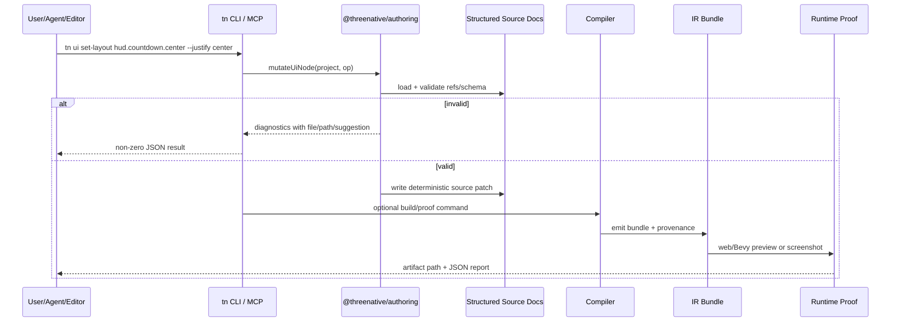

# PRD: Complete Structured Authoring Parity

Complexity: 13 -> HIGH mode

Score basis: +3 touches 10+ future files, +2 adds/extends authoring source systems, +2 spans SDK/compiler/authoring/CLI/MCP/runtime/docs/templates, +2 changes durable source-of-truth boundaries, +2 covers complex state/provenance/round-trip logic, +1 adds editor/map-editor user-facing workflows, +1 requires cross-runtime web/Bevy proof.

## 1. Context

**Problem:** ThreeNative currently has two competing authoring realities: expressive TypeScript can create rich games quickly, but a future map/editor workflow cannot safely persist editor changes back into arbitrary TypeScript; meanwhile the CLI/source-scene path is deterministic and agent-safe but does not yet cover the full TypeScript SDK authoring surface.

**Goal:** Make structured authoring documents the durable source of truth for all editor-owned game data, with CLI/MCP/editor operations covering the complete data-authoring surface previously only practical through TypeScript. TypeScript remains for gameplay scripts and optional generators, not as the required round-trippable scene/map source.

**Non-goals:**

- Do not build the visual map editor UI in this PRD.
- Do not reverse-generate arbitrary TypeScript from edited ECS/IR/editor documents.
- Do not make generated `dist/game.bundle/*.json` durable source.
- Do not remove TypeScript gameplay scripting.
- Do not make CLI a general-purpose programming language.
- Do not make MCP own authoring behavior; MCP must wrap the same authoring core/CLI operations.
- Do not promise arbitrary import/round-trip from any Three.js project or handwritten TS prototype.

**Files analyzed:**

- `AGENTS.md`
- `/home/joao/.claude/skills/prd-creator/SKILL.md`
- `docs/PRDs/README.md`
- `docs/PRDs/done/other/agent-safe-scene-authoring-cli.md`
- `docs/PRDs/other/agent-friendly-project-and-visual-debugging-workflows.md`
- `docs/PRDs/other/editor-ready-modular-authoring-and-scripting-architecture.md`
- `packages/authoring/src/operations.ts`
- `packages/authoring/src/schemas.ts`
- `packages/authoring/src/index.ts`
- `packages/cli/src/commands/scene.ts`
- `packages/sdk/src/authoring.ts`
- `packages/sdk/src/ecs/World.ts`
- `packages/sdk/src/index.ts`
- `packages/ui/src/components.tsx`
- `packages/ui/src/capture.ts`
- `packages/ui/src/index.ts`
- `packages/runtime-web-three/src/ui/domOverlay.ts`

**Current behavior:**

- Rich games are still easiest to author in TypeScript because TS gives loops, helper functions, procedural generation, reusable composition, and gameplay systems.
- The existing `tn scene ...` CLI can create/inspect/validate/mutate scene source and now import emitted `world.ir.json` into editable scene source.
- The CLI/source-scene path covers core ECS mutations better than before, including direct `MeshRenderer`, `Camera`, `Light`, PascalCase resources, and ECS-style entity IDs.
- The CLI path does not yet cover the full durable source surface: asset catalogs, materials, generated/custom meshes, UI tree/style/layout, input maps, system metadata, script module refs, audio, scenes/lifecycle, prefabs/hierarchy, bundle import/export, and provenance.
- A previous rich kart prototype proved the gap: ECS parity could be achieved by importing `world.ir.json`, but visual/runtime parity still required manually copying `materials.ir.json`, `assets.manifest.json`, `gltf.scene.json`, `ui.ir.json`, `systems.ir.json`, `input.ir.json`, `scripts.bundle.js`, and `manifest.json`.
- The UI runtime uses ThreeNative retained UI IR rendered by the web DOM overlay, not React, but current CLI commands cannot fully author/patch that UI IR ergonomically.

## 2. Product Decision

The durable authoring model must be:

```txt
Structured Authoring Source Documents + Script Modules + Optional Generators
        ↓
Shared @threenative/authoring core operations
        ↓
tn CLI operations       optional MCP wrapper       future visual editor
        ↓
Compiler authoring graph + provenance
        ↓
Generated portable IR bundle
        ↓
Web Three.js / Native Bevy runtimes
```

### Required source-of-truth rule

TypeScript may remain source for **gameplay behavior modules** and **optional one-way generators**, but it must not be the only durable source for editor-owned scene/map data.

A map editor must be able to load, mutate, save, close, reopen, and rebuild a project without needing to reconstruct arbitrary TypeScript. Therefore, editor-owned data must be stored as structured source documents such as:

```txt
content/
  scenes/karting.scene.json
  prefabs/kart.prefab.json
  materials/track.material.json
  meshes/track.mesh.json
  assets/kenney-roads.asset.json
  ui/hud.ui.json
  input/kart.input.json
  systems/kart.systems.json
  audio/kart.audio.json
  scripts/kartArcadePhysics.ts
```

TypeScript can still produce structured authoring documents in two supported ways:

1. **Script modules:** authored behavior code referenced by stable module/export metadata.
2. **Generators/importers:** explicit one-way tools that output structured source docs, with provenance and overwrite policy. Once the editor edits generated source, the generator is not assumed to receive automatic reverse patches.

### CLI role correction

The CLI should not replace TypeScript as a programming language, but it **must** cover the full structured authoring surface.

That means the CLI is not just a convenience editor for ECS entities. It is the canonical operation/mutation/proof layer for all durable authoring documents:

- project/source inspection;
- schema/semantic validation;
- create/update/delete structured declarations;
- import generated bundles into source documents where allowed;
- run migrations;
- compile/build;
- preview/prove;
- produce machine-readable diagnostics.

MCP and future editor tooling call the same operations. They do not implement a separate authoring model.

## 3. Integration Points

**How will this feature be reached?**

- [x] Entry points identified:
  - `tn authoring inspect --json`
  - `tn authoring validate --json`
  - `tn authoring migrate --json`
  - `tn bundle import <bundle-dir> --project <path> --json`
  - `tn scene ...` expanded beyond ECS-only mutation
  - `tn ui ...`
  - `tn material ...`
  - `tn asset ...`
  - `tn prefab ...`
  - `tn system ...`
  - future MCP tools wrapping those commands/core operations
  - future editor commands calling `@threenative/authoring`
- [x] Caller files identified:
  - `packages/authoring/src/*`
  - `packages/cli/src/commands/*`
  - `packages/compiler/src/scene-document.ts`
  - future compiler authoring-graph modules
  - `packages/sdk/src/authoring.ts`
  - `packages/ui/src/capture.ts`
  - `packages/runtime-web-three/src/ui/domOverlay.ts`
  - Bevy runtime loaders where new IR/source mapping affects emitted bundle semantics
- [x] Registration/wiring needed:
  - CLI command registry/help output.
  - Package exports for authoring operations.
  - Docs and PRD index.
  - Tests in authoring/CLI/compiler/runtime packages.
  - Template/example migration to structured source docs.

**Is this user-facing?**

- [x] YES. Developers, agents, future map-editor users, and MCP clients use this to create/edit/save game content.
- [ ] NO.

**Full user flow:**

1. User or agent creates a project from a template.
2. Template stores scene/map/UI/material/asset data as structured source documents, not only TS.
3. User opens a future map editor or runs CLI/MCP commands.
4. Editor/CLI mutates source docs through `@threenative/authoring` operations.
5. `tn authoring validate` catches schema/reference/capability errors before build.
6. `tn build` compiles structured source + script module refs into a portable bundle.
7. `tn dev`, `tn screenshot`, `tn record`, and `tn verify` prove the same output in web and, where relevant, native Bevy.
8. User closes/reopens the editor; the editor reloads structured source docs directly. No TS reverse-generation is required.

## 4. Solution

**Approach:**

- Promote structured authoring documents from ECS-only scene files into a complete source-document family covering scene, entities, prefabs, resources, assets, materials, meshes, UI, input, systems, audio, and script refs.
- Expand `@threenative/authoring` into the shared mutation/validation/migration core used by CLI, MCP, and the future editor.
- Add `tn bundle import` / `tn authoring import-bundle` to convert generated bundle catalogs into structured source where possible, with explicit unsupported diagnostics where source cannot be recovered.
- Keep TypeScript for script behavior and optional generators, but require those generators to emit structured source docs rather than hiding editor-owned data inside arbitrary TS.
- Add provenance and ownership metadata so generated IR can be traced back to source docs and editor patches can be classified as persistable, hot-reload-only, generator-owned, or rejected.
- Add visual/runtime proof gates so source-document parity is proven by generated bundle output, not just document validation.

```mermaid
flowchart LR
    Human[Human / Agent / Editor] --> CLI[tn CLI]
    Human --> MCP[MCP wrapper]
    Editor[Future Map Editor] --> Core[@threenative/authoring]
    CLI --> Core
    MCP --> Core
    Core --> Source[Structured Source Docs]
    Source --> Compiler[Compiler Authoring Graph]
    Scripts[TS Script Modules] --> Compiler
    Generators[Optional TS Generators] --> Source
    Compiler --> Bundle[Generated IR Bundle]
    Bundle --> Web[Web Three.js]
    Bundle --> Bevy[Native Bevy]
```

**Key Decisions:**

- [x] Library/framework choices: reuse existing `packages/authoring`, `packages/cli`, compiler emit/validation, ThreeNative retained UI, and existing web/Bevy runtime adapters.
- [x] Error-handling strategy: all authoring operations return stable diagnostic codes, source paths, JSON pointers, related references, and suggested repair commands.
- [x] Reused utilities: existing scene authoring core, document formatting, CLI JSON result shapes, compiler bundle validation, UI capture IR, and proof commands.
- [x] Source boundary: generated IR and `scripts.bundle.js` are disposable build outputs; structured docs and TS script modules are durable source.
- [x] Editor boundary: editor mutates structured documents; it does not patch arbitrary TS or generated runtime files.

**Data Changes:**

Add or extend schema-versioned source document types. Suggested first stable document family:

```txt
content/project.authoring.json
content/scenes/*.scene.json
content/prefabs/*.prefab.json
content/entities/*.entities.json      # optional split for large maps
content/resources/*.resources.json
content/assets/*.assets.json
content/materials/*.materials.json
content/meshes/*.meshes.json
content/ui/*.ui.json
content/input/*.input.json
content/systems/*.systems.json
content/audio/*.audio.json
```

Each document should include:

- `schema`;
- `version`;
- stable IDs;
- owner scene/module where relevant;
- source/provenance metadata;
- references to other documents by stable IDs, not generated bundle paths;
- optional generator provenance `{ generatorId, inputHash, outputHash, overwritePolicy }`.

## 5. Sequence Flow



## 6. Required Capability Coverage

### 6.1 Structured source documents

The source model must represent every editor-owned data category previously practical through TypeScript:

- project metadata and build targets;
- lifecycle scenes and activation policy;
- visual scene membership;
- entities and components;
- transforms and hierarchy;
- prefabs and instances;
- resources and defaults;
- component/resource schemas;
- input maps/actions/axes;
- retained UI tree, layout, style, bindings, minimap/bar/image/text/button nodes;
- materials, textures, generated meshes, primitive meshes, GLB/glTF handles;
- asset import settings and dependency copy policy;
- audio declarations;
- system metadata: schedule, queries, reads/writes, resources, commands, script ref;
- script module references, not generated script code;
- runtime config and target profile settings where editor-owned.

### 6.2 CLI/MCP operation coverage

Add operation groups. Names can change during design, but coverage must not shrink.

```bash
# Whole authoring project
tn authoring inspect --project . --json
tn authoring validate --project . --json
tn authoring migrate --project . --from <version> --to <version> --json

# Bundle/source import
tn bundle import dist/game.bundle --project . --mode source --json
tn bundle diff-source dist/game.bundle --project . --json

# Scenes/entities/prefabs/resources
tn scene create <scene-id> --json
tn scene add-entity <scene-id> <entity-id> --json
tn scene set-component <scene-id> <entity-id> <component> --value <json> --json
tn scene set-transform <scene-id> <entity-id> ... --json
tn scene set-hierarchy <scene-id> <child-id> --parent <parent-id> --json
tn prefab create <prefab-id> --json
tn prefab add-component <prefab-id> <component> --value <json> --json
tn resource set <resource-id> --value <json> --json

# Assets/materials/meshes
tn asset add <asset-id> --file <path> --kind model|texture|audio --json
tn asset inspect <asset-id-or-path> --json
tn material create <material-id> --kind standard --json
tn material set <material-id> --color '#fff' --roughness 0.5 --json
tn mesh primitive <mesh-id> --kind box|sphere|cylinder|cone|custom --json

# UI/input/audio
tn ui create <ui-doc-id> --json
tn ui add-text <node-id> --text <text> --json
tn ui add-minimap <node-id> --resource <resource-id.field> --json
tn ui set-layout <node-id> --position absolute --top 280 --width 1280 --justify center --align center --json
tn ui set-style <node-id> --font-size 118 --color '#fef3c7' --json
tn ui bind <node-id> --resource RaceState.status --json
tn input add-action <action-id> --keys W,ArrowUp --json
tn audio add <audio-id> --file <path> --json

# Systems/scripts
tn system create <system-id> --schedule fixedUpdate --json
tn system set-query <system-id> --with VehiclePhysics --without RivalAI --json
tn system set-commands <system-id> --set-component Transform --json
tn system attach-script <system-id> --module src/scripts/kart.ts --export kartArcadePhysics --json
```

### 6.3 TypeScript role

TypeScript remains supported for:

- gameplay systems/scripts;
- custom helpers used inside scripts;
- project-level composition where it references structured documents;
- generators that intentionally produce structured source documents.

TypeScript is not the required persistence target for:

- map edits;
- entity placement;
- material/style tweaks;
- UI layout tweaks;
- asset catalog edits;
- generated bundle diffs;
- editor move/rotate/scale operations.

### 6.4 Import/round-trip limits

`tn bundle import` must be honest:

- It can import bundle catalogs that carry enough source-safe data.
- It must attach provenance showing imported documents came from generated bundle data.
- It must not infer missing procedural intent.
- It must not reverse-generate TS loops/helpers.
- It must report unsupported recoveries with diagnostics, e.g. `TN_AUTHORING_IMPORT_UNRECOVERABLE_SCRIPT_BODY`.

## 7. Execution Phases

### Phase 1: Source Document Inventory and Gap Matrix - prove the missing surface explicitly

**Files (max 5):**

- `docs/contracts/authoring-source-documents.md` - define source document family and source/generated/runtime boundaries.
- `docs/PRDs/other/complete-structured-authoring-parity.md` - update if findings change.
- `packages/authoring/src/schemas.ts` - add preliminary source document kind constants/types if needed.
- `packages/authoring/src/__tests__/source-document-inventory.test.ts` - coverage matrix fixture.
- `docs/PRDs/README.md` - index already added in this PRD change.

**Implementation:**

- [ ] Build a matrix of TypeScript SDK/authoring capabilities vs structured source support vs CLI operations.
- [ ] Classify each capability as `supported`, `partial`, `missing`, or `non-goal`.
- [ ] Explicitly cover UI, assets, materials, meshes, input, systems, scripts, audio, lifecycle scenes, prefabs, resources, and runtime config.
- [ ] Document the source/generated/runtime ownership rule.

**Tests Required:**

| Test File | Test Name | Assertion |
|-----------|-----------|-----------|
| `packages/authoring/src/__tests__/source-document-inventory.test.ts` | `authoring coverage matrix includes every declared source kind` | No source kind is omitted from matrix. |
| `packages/authoring/src/__tests__/source-document-inventory.test.ts` | `generated bundle files are not source kinds` | `world.ir.json`, `ui.ir.json`, `scripts.bundle.js` are rejected as durable source kinds. |

**User Verification:**

- Action: Read coverage matrix.
- Expected: It is clear which TypeScript-era authoring surfaces still lack structured source/CLI support.

**Checkpoint:**

```bash
pnpm --filter @threenative/authoring test -- --run source-document-inventory
pnpm check:docs
```

### Phase 2: Authoring Source Package Expansion - structured docs load/save/validate beyond scene ECS

**Files (max 5):**

- `packages/authoring/src/schemas.ts` - add schema definitions for UI/material/asset/input/system/audio/prefab docs.
- `packages/authoring/src/documents.ts` - discover/load/save document family.
- `packages/authoring/src/operations.ts` - shared validation entrypoints.
- `packages/authoring/src/index.ts` - exports.
- `packages/authoring/src/__tests__/structured-documents.test.ts` - validation fixtures.

**Implementation:**

- [ ] Add schema-versioned source doc contracts for each first-class authoring category.
- [ ] Add deterministic formatting for all source doc families.
- [ ] Add semantic reference validation between documents.
- [ ] Add stable diagnostics for unknown refs, duplicate IDs, generated-path misuse, and unsupported fields.

**Tests Required:**

| Test File | Test Name | Assertion |
|-----------|-----------|-----------|
| `packages/authoring/src/__tests__/structured-documents.test.ts` | `loads mixed authoring source document family` | Project loader discovers scene, UI, material, asset, input, system, and prefab docs. |
| `packages/authoring/src/__tests__/structured-documents.test.ts` | `rejects generated bundle paths as source` | Generated artifact paths produce diagnostic codes. |
| `packages/authoring/src/__tests__/structured-documents.test.ts` | `validates cross-document references` | Missing material/mesh/UI/resource/system refs are diagnosed. |

**User Verification:**

- Action: Run `tn authoring inspect --json` on a template project.
- Expected: JSON report lists all source documents and generated artifact exclusions.

**Checkpoint:**

```bash
pnpm --filter @threenative/authoring test
```

### Phase 3: Bundle Import to Structured Source - close the ECS-only parity gap

**Files (max 5):**

- `packages/authoring/src/importBundle.ts` - import generated bundle catalogs into source docs.
- `packages/authoring/src/operations.ts` - expose import operation.
- `packages/cli/src/commands/bundle.ts` - add `tn bundle import` and `diff-source`.
- `packages/cli/src/index.ts` - register command/help.
- `packages/cli/src/commands/bundle-command.test.ts` - CLI tests.

**Implementation:**

- [ ] Import `world.ir.json` into scene/entities/resources source docs.
- [ ] Import `materials.ir.json`, `assets.manifest.json`, `gltf.scene.json`, `ui.ir.json`, `input.ir.json`, `systems.ir.json`, `runtime.config.json`, and `target.profile.json` where recoverable.
- [ ] Convert `scripts.bundle.js` only into script refs if a manifest/provenance map exists; otherwise diagnose unrecoverable generated script bodies.
- [ ] Produce a diff report: imported, skipped, unsupported, overwritten, conflicts.
- [ ] Add `--mode source` and `--dry-run`.

**Tests Required:**

| Test File | Test Name | Assertion |
|-----------|-----------|-----------|
| `packages/cli/src/commands/bundle-command.test.ts` | `imports rich bundle catalogs into structured source` | World/material/UI/input/system/assets docs are written. |
| `packages/cli/src/commands/bundle-command.test.ts` | `dry-run reports without writing` | No files changed; report lists planned writes. |
| `packages/authoring/src/__tests__/import-bundle.test.ts` | `unrecoverable generated script body is diagnostic not source` | Generated JS is not persisted as TS source. |

**User Verification:**

- Action: Import the rich kart bundle used in the CLI parity proof.
- Expected: Rebuild from structured source produces bundle validation without manually copying catalogs.

**Checkpoint:**

```bash
pnpm --filter @threenative/authoring test -- --run import-bundle
pnpm --filter @threenative/cli test -- --run bundle-command
```

### Phase 4: Full CLI Operation Groups - mutate every editor-owned source category

**Files (max 5 per sub-slice):**

Split into sub-slices to keep each implementation reviewable:

- `packages/cli/src/commands/ui.ts` + tests.
- `packages/cli/src/commands/material.ts` + tests.
- `packages/cli/src/commands/asset.ts` extensions + tests.
- `packages/cli/src/commands/prefab.ts` + tests.
- `packages/cli/src/commands/system.ts` + tests.

**Implementation:**

- [ ] Add `tn ui` create/add/set-layout/set-style/bind/remove operations.
- [ ] Add `tn material` create/set/inspect operations.
- [ ] Add `tn mesh` primitive/custom declaration operations.
- [ ] Add `tn prefab` create/mutate/instantiate operations.
- [ ] Add `tn input` action/axis operations.
- [ ] Add `tn system` metadata/query/commands/script-ref operations.
- [ ] Ensure every command supports `--json`, deterministic filesWritten, non-zero error codes, and repair diagnostics.

**Tests Required:**

| Test File | Test Name | Assertion |
|-----------|-----------|-----------|
| `packages/cli/src/commands/ui-command.test.ts` | `centers countdown via UI layout operation` | Written UI doc has `justify:center`, `align:center`; runtime DOM proof can consume it. |
| `packages/cli/src/commands/material-command.test.ts` | `creates material referenced by MeshRenderer` | Build validation sees material ref resolved. |
| `packages/cli/src/commands/system-command.test.ts` | `attaches script ref without generated script source` | System doc references module/export and compiler emits script bundle. |

**User Verification:**

- Action: Reproduce the countdown-centering fix using only CLI operations, not manual `ui.ir.json` edits.
- Expected: screenshot pixel analysis centers countdown within <= 4 px of viewport center.

**Checkpoint:**

```bash
pnpm --filter @threenative/cli test -- --run ui-command
pnpm --filter @threenative/cli test -- --run material-command
pnpm --filter @threenative/cli test -- --run system-command
```

### Phase 5: Compiler Authoring Graph and Provenance - source patches know ownership

**Files (max 5):**

- `packages/compiler/src/authoring/graph.ts` - normalized graph model.
- `packages/compiler/src/authoring/provenance.ts` - source-to-IR mappings.
- `packages/compiler/src/capture.ts` or relevant capture entry - collect graph.
- `packages/compiler/src/emit/bundle.ts` - emit provenance/report artifact.
- `packages/compiler/src/authoring/graph.test.ts` - tests.

**Implementation:**

- [ ] Preserve source document path and JSON pointer for emitted entities/components/materials/assets/UI/system refs.
- [ ] Emit an authoring provenance report in bundle artifacts.
- [ ] Use provenance to classify runtime/editor patches as source-persistable, generator-owned, full-reload-required, or rejected.
- [ ] Detect duplicate/conflicting declarations before emit.

**Tests Required:**

| Test File | Test Name | Assertion |
|-----------|-----------|-----------|
| `packages/compiler/src/authoring/graph.test.ts` | `maps emitted MeshRenderer material to material source doc` | Provenance points to material source path/pointer. |
| `packages/compiler/src/authoring/graph.test.ts` | `maps UI countdown node to UI source doc` | UI IR node provenance survives emit. |
| `packages/compiler/src/authoring/graph.test.ts` | `rejects conflicting source ownership` | Duplicate/conflicting source declarations fail before runtime emit. |

**User Verification:**

- Action: Inspect `dist/game.bundle/authoring.provenance.json` after build.
- Expected: Can trace countdown UI, kart entities, materials, and script refs back to source docs/modules.

**Checkpoint:**

```bash
pnpm --filter @threenative/compiler test -- --run authoring
pnpm --filter @threenative/compiler build
```

### Phase 6: Template Migration and Editor-Ready Example Proof - prove humans/agents can author without TS scene blobs

**Files (max 5 per migrated template):**

- `templates/starter-functional/content/**` - structured source docs.
- `templates/starter-functional/src/scripts/**` - behavior scripts only.
- `templates/racing-kart/content/**` or equivalent canonical racing template.
- `templates/racing-kart/src/scripts/**` - behavior scripts only.
- `packages/cli/src/templates/registry.ts` - template registration/help.

**Implementation:**

- [ ] Migrate at least one simple template and one rich/playable racing template to structured source docs.
- [ ] Keep `src/game.ts` as thin bootstrap/composition or remove it where CLI can build from source docs directly.
- [ ] Ensure gameplay remains in script modules with explicit system refs.
- [ ] Ensure UI/materials/assets/input/source docs are editable without touching TS.
- [ ] Add agent docs explaining when to use CLI vs TS scripts/generators.

**Tests Required:**

| Test File | Test Name | Assertion |
|-----------|-----------|-----------|
| `packages/cli/src/commands/create.test.ts` | `creates structured-source racing template` | Project includes content docs and script modules, not one giant game.ts. |
| `packages/compiler/src/examples.test.ts` | `structured racing template builds` | Bundle validation passes from source docs. |
| visual gate fixture | `structured racing template screenshot` | Track, player, rivals, HUD/minimap/countdown visible. |

**User Verification:**

- Action: Create the racing template, center countdown via CLI, rebuild, screenshot.
- Expected: No TypeScript scene edits needed; visual proof shows changed UI.

**Checkpoint:**

```bash
pnpm --filter @threenative/cli test -- --run create
pnpm --filter @threenative/compiler test -- --run examples
pnpm verify:pre-push
```

### Phase 7: MCP and Future Editor Adapter Contract - wrappers over same core, no drift

**Files (max 5):**

- `packages/mcp-server/src/index.ts` - expose new operation groups if existing package remains.
- `packages/mcp-server/src/index.test.ts` - parity tests.
- `docs/contracts/authoring-mcp.md` - wrapper contract.
- `docs/workflows/agent-authoring.md` - CLI/MCP/editor usage guidance.
- `packages/authoring/src/operations.ts` - shared operation exports as needed.

**Implementation:**

- [ ] Add MCP tools only as wrappers over `@threenative/authoring` operations or `tn ... --json` parity behavior.
- [ ] Add tests proving MCP and CLI return equivalent diagnostics/results for representative operations.
- [ ] Document MCP as adapter, not source-of-truth.
- [ ] Define editor adapter expectations: operation input/output shapes, diagnostics, optimistic patch policy, and persistence rules.

**Tests Required:**

| Test File | Test Name | Assertion |
|-----------|-----------|-----------|
| `packages/mcp-server/src/index.test.ts` | `ui layout MCP matches CLI operation result` | Same filesWritten/diagnostics/source output. |
| `packages/mcp-server/src/index.test.ts` | `bundle import MCP wraps same authoring core` | No duplicate import behavior. |

**User Verification:**

- Action: Use CLI and MCP to perform equivalent countdown/UI/material patch.
- Expected: Same source docs and validation output.

**Checkpoint:**

```bash
pnpm --filter @threenative/mcp-server test
pnpm check:docs
```

## 8. Verification Strategy

### Required proof layers

1. **Schema/unit proof:** authoring package tests for every source document family and operation.
2. **CLI contract proof:** command tests for JSON output, exit codes, filesWritten, diagnostics, and deterministic formatting.
3. **Compiler proof:** structured source docs compile to valid bundle IR with provenance.
4. **Runtime proof:** web Three.js and native Bevy consume the emitted bundle where the feature affects shared runtime behavior.
5. **Visual proof:** screenshot/video artifacts for visual/UI/material/asset changes.
6. **Round-trip proof:** source docs can be edited, saved, rebuilt, closed/reopened, and edited again without TypeScript reverse-generation.

### Focused acceptance scenario

Use the kart racer as the concrete end-to-end scenario because it already exposed the gaps.

```bash
# 1. Import rich generated bundle into structured source.
tn bundle import /home/joao/projects/threenative-karting-redo/dist/game.bundle \
  --project /tmp/kart-structured \
  --mode source \
  --json

# 2. Mutate UI through CLI, not manual JSON.
tn ui set-layout hud.countdown.center \
  --project /tmp/kart-structured \
  --justify center \
  --align center \
  --top 280 \
  --height 160 \
  --width 1280 \
  --json

# 3. Build and validate.
tn build --project /tmp/kart-structured --json
tn validate --project /tmp/kart-structured --json

# 4. Capture proof.
tn dev --target web --project /tmp/kart-structured --json
tn screenshot --url http://127.0.0.1:<port>/ --out artifacts/countdown.png --json
```

Expected proof:

- bundle validation passes without manually copying generated catalogs;
- screenshot shows track/karts/HUD/minimap;
- countdown yellow component center is within <= 4 px of viewport center;
- no dark square/shadow artifact;
- source docs, not generated bundle files, contain the UI/material/entity edits.

## 9. Acceptance Criteria

- [ ] Every editor-owned TypeScript-era authoring category has a structured source representation or an explicit non-goal diagnostic.
- [ ] CLI operations cover scene, entity, component, transform, hierarchy, prefab, resource, asset, material, mesh, UI, input, audio, system, and script-ref edits.
- [ ] `tn bundle import` can import rich bundle catalogs into structured source documents without manual catalog copying for supported data.
- [ ] Generated JS script bodies are not treated as durable source; script refs require source module/export provenance.
- [ ] The compiler emits provenance from source docs/modules to generated IR bundle entries.
- [ ] Future MCP/editor adapters use the same authoring core operations and do not duplicate validation/mutation logic.
- [ ] At least one rich racing template is migrated so visual scene/map/UI/material/asset edits are source-document driven, while gameplay behavior remains in TS script modules.
- [ ] Round-trip editor scenario passes: load structured source, mutate UI/material/entity placement, save, rebuild, close/reopen, mutate again, rebuild, prove visual output.
- [ ] Web runtime proof passes for migrated template; Bevy proof passes for all shared runtime features claimed.
- [ ] Docs explain the corrected architecture: TypeScript is for scripts/generators, not mandatory durable map/editor source.

## 10. Risks and Mitigations

- **Risk:** CLI becomes an unusable shell DSL for procedural generation.
  - **Mitigation:** CLI covers structured operations, bulk imports, patch files, and template/generator outputs; complex procedural generation remains explicit one-way generators that emit source docs.
- **Risk:** Bundle import creates false confidence by reverse-engineering generated artifacts without original intent.
  - **Mitigation:** import reports provenance and unsupported/unrecoverable areas; generated script bodies are diagnostics, not source.
- **Risk:** Structured docs become fragmented and painful for humans.
  - **Mitigation:** provide higher-level CLI operations, editor adapters, templates, and optional module split conventions; keep deterministic formatting and inspect reports.
- **Risk:** Runtime hot patches diverge from source.
  - **Mitigation:** use provenance to classify patches and require explicit save-to-source operations for persistable changes.
- **Risk:** MCP drifts into a second implementation.
  - **Mitigation:** parity tests compare MCP and CLI/core operation output.
- **Risk:** Existing TS projects cannot be fully migrated automatically.
  - **Mitigation:** support source-doc-first templates going forward and honest import diagnostics for old/generated/unrecoverable projects.

## 11. Open Questions

- Should `tn build` eventually support source-doc-only projects without a `src/game.ts` bootstrap, or should a tiny bootstrap remain required for package ergonomics?
- How much UI authoring should live in JSON source docs versus TSX-like retained UI modules compiled to source docs?
- Should generators be represented as first-class `content/generators/*.generator.json` declarations with input/output ownership, or remain external commands?
- What is the minimum provenance needed for editor save/reload in the first map-editor MVP?
- Should `tn bundle import` write split documents by default or one consolidated document per category for easier review?

## 12. Definition of Done

This PRD is done only when a rich playable template can be authored, edited, rebuilt, and visually proven through structured source documents and CLI operations without manual generated-bundle patching or TypeScript scene reverse-generation.

The final demo must include:

- a playable scene;
- multiple entities/components/resources;
- materials/assets/meshes;
- retained UI with bound values;
- input and system script refs;
- visual proof artifacts;
- an editor-style edit such as moving an entity, changing material color, and centering countdown UI;
- source docs showing the persisted changes;
- web proof and Bevy proof for shared features.
