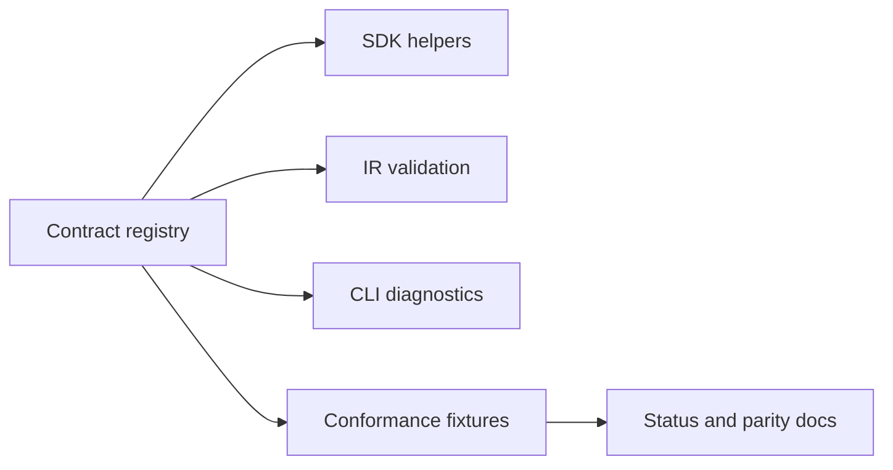

# Shared Contract Residuals

## Status

Implemented

Complexity: 9 -> HIGH mode

## Complexity Assessment

- +3 touches 10+ SDK/IR/compiler/test/docs files during implementation
- +2 adds or tightens shared contract surfaces
- +2 spans SDK, IR, compiler, CLI, verification, and docs
- +2 covers renderer/platform policy decisions with diagnostic boundaries

## Context

**Problem:** Several parity rows name shared SDK/IR/compiler semantics as the
remaining gap before adapters can make stronger claims.

**Files Analyzed:**

- `docs/bevy-feature-parity.md`
- `docs/PRDs/done/other/post-v10-rendering-materials-geometry-residuals.md`
- `docs/PRDs/done/other/post-v10-input-ui-platform-polish.md`
- `/home/joao/.agents/skills/prd-creator/SKILL.md`

**Current Behavior:**

- Promoted geometry, materials, rendering, and platform rows already have broad
  coverage.
- Advanced deformation, CSG, storage-buffer geometry, advanced PBR, custom
  post, SSR/GI, deferred rendering, multi-window, cursor, power, and clear-color
  updates are mostly diagnostic or boundary rows.
- The parity table still needs a single source of truth for which shared fields
  are promotable, diagnostic-only, or intentionally unsupported.

## Impact

**Planned files touched:** SDK declarations, IR schemas, compiler validation,
CLI diagnostics, conformance fixtures, capability docs, `docs/STATUS.md`, and
`docs/bevy-feature-parity.md`.

**Features affected:** procedural geometry, advanced material imports,
renderer intent, platform/window policy, capability reporting, and diagnostics.

**Main risks:**

- Promoting fields without adapter proof creates false parity claims.
- Keeping too much diagnostic-only behavior undocumented makes authoring feel
  arbitrary.
- Duplicated allowlists can drift across SDK, compiler, and docs.

## Integration Points

**How will this feature be reached?**

- [x] Entry point identified: SDK declarations, structured source, `tn build`,
  `tn authoring validate --json`, conformance fixtures, and docs gates.
- [x] Caller file identified: SDK helpers, IR validators, compiler lowering,
  CLI validation command handlers, and verification tooling.
- [x] Registration/wiring needed: schema fields, diagnostic codes, fixture
  enrollment, capability docs, and status/parity updates.

**Is this user-facing?**

- [x] YES. Authors see accepted portable declarations or stable diagnostics.
- [ ] NO -> Internal/background feature.

**Full user flow:**

1. User authors geometry, material, renderer, or platform declarations.
2. `tn build` and validation commands classify each declaration as promoted,
   diagnostic-only, or unsupported.
3. CLI JSON output includes stable codes, paths, and fixes.
4. Docs and conformance fixtures agree with the runtime capability manifest.

## Solution

**Approach:**

- Establish a registry-backed shared contract table for residual visual and
  platform fields.
- Promote only fields with a bounded adapter proof path; keep the rest as
  explicit diagnostics.
- Derive CLI diagnostics, conformance fixture expectations, and docs snippets
  from the owning registry where practical.
- Add drift tests for any surface that cannot yet be generated.

**Key Decisions:**

- [x] Library/framework choices: reuse existing SDK/IR/compiler validation,
  diagnostic catalog, and conformance fixture patterns.
- [x] Error-handling strategy: unsupported residual declarations fail with
  stable diagnostics and suggested portable alternatives.
- [x] Reused utilities: capability manifests, diagnostic helpers, structured
  fixture builders, and docs checks.

**Data Changes:** IR schema/report additions only. No database migrations.

## Execution Phases

#### Phase 1: Registry And Diagnostics - Authors get one consistent answer for residual features.

**Files (max 5):**

- `packages/ir/src/*` - contract registry and validation hooks
- `packages/sdk/src/*` - helper exports or typed rejection surfaces
- `packages/compiler/src/*` - lowering and diagnostic integration
- `packages/ir/fixtures/*` - accepted and rejected residual fixtures
- `docs/status/capabilities/*.md` - capability claim updates

**Implementation:**

- [x] Define registry rows for advanced geometry, material, renderer, and
  platform residuals.
- [x] Wire validators and compiler diagnostics to the registry.
- [x] Add explicit fixes for portable alternatives where a fallback exists.

**Tests Required:**

| Test File | Test Name | Assertion |
|-----------|-----------|-----------|
| `packages/ir/src/residual-contract.test.ts` | `should reject unsupported residual declaration when registry marks diagnostic-only` | Diagnostic code, path, and fix are stable. |
| `packages/compiler/src/residual-contract.test.ts` | `should lower promoted residual fields from structured source` | Emitted IR matches fixture. |
| `tools/verify/src/docs.test.ts` | `should fail when residual registry and parity docs drift` | Missing docs row is reported. |

**User Verification:**

- Action: Run `tn authoring validate --json` on accepted and rejected fixtures.
- Expected: Accepted fixtures emit IR; rejected fixtures include stable fixes.

#### Phase 2: Conformance And Docs Gate - Capability claims cannot drift.

**Files (max 5):**

- `packages/ir/fixtures/*` - conformance fixtures
- `tools/verify/src/*` - gate enrollment
- `docs/bevy-feature-parity.md` - parity row updates
- `docs/STATUS.md` - one-line index update
- `docs/status/capabilities/*.md` - detailed status updates

**Implementation:**

- [x] Add conformance fixtures for promoted, diagnostic-only, and unsupported
  residual declarations.
- [x] Extend the nearest existing focused gate
  (`verify:rendering-residuals` in `tools/verify/src/cli/run.ts`) before
  adding a new one; if a new gate is needed, register it in `FOCUSED_GATES`
  and run it via `pnpm verify:focused`.
- [x] Extend `tools/verify/src/docs.ts` so every `pnpm verify:*` command cited
  in `docs/bevy-feature-parity.md` and `docs/STATUS.md` must resolve to a root
  `package.json` script or a registered `FOCUSED_GATES` entry (bugfix: today
  the parity doc cites six focused gates as root commands that fail as
  written; see the `checkCitedVerifyCommands` snippet in this bundle's
  `README.md` Bugfix Backlog).
- [x] Rewrite the stale parity-doc commands as
  `pnpm verify:focused verify:<gate>` while adding that check.
- [x] Update parity and capability docs with evidence links.

**Tests Required:**

| Test File | Test Name | Assertion |
|-----------|-----------|-----------|
| `tools/verify/src/residualContract.test.ts` | `should include residual fixtures in conformance gate` | Gate report lists all registry rows. |
| `tools/verify/src/docs.test.ts` | `should fail when a doc cites an unregistered verify command` | Stale `pnpm verify:*` reference is reported with the doc path. |
| `packages/ir/src/conformance.test.ts` | `should preserve diagnostic residual metadata` | Report contains capability state. |

**User Verification:**

- Action: Run `pnpm verify:conformance`.
- Expected: Report includes residual contract rows and no docs drift.

## Verification Strategy

- Run `pnpm verify:conformance`.
- Run the narrow IR/compiler tests added by this PRD.
- Run `pnpm check:docs` after docs updates.

## Acceptance Criteria

- [x] Residual feature registry owns promoted/diagnostic/unsupported status.
- [x] SDK, IR, compiler, CLI, fixtures, and docs do not duplicate unmanaged
  allowlists.
- [x] Stable diagnostics exist for every diagnostic-only or unsupported row.
- [x] Every `pnpm verify:*` command cited in parity/status docs resolves to a
  root script or registered focused gate, enforced by the docs gate.
- [x] `pnpm verify:conformance` and `pnpm check:docs` pass.
- [x] Parity and capability docs cite the new evidence.

## Implementation Notes

- `SHARED_RESIDUAL_CONTRACT_ROWS` extends the existing Bevy catalog registry
  without adding a second hand-maintained classification list. Material and
  runtime-renderer validators resolve their unsupported diagnostic codes from
  the owning rows; compiler validation preserves those IR diagnostics.
- The existing `rendering-residuals` conformance fixture declares the shared
  residual contract capability, and the focused web/native gate serializes the
  relevant registry rows into its verification report.
- The docs gate parses root package scripts and registered focused gates, then
  rejects invalid `pnpm verify:*` citations in `docs/STATUS.md` and
  `docs/bevy-feature-parity.md`.

Verification completed 2026-07-09:

- `pnpm --filter @threenative/ir test -- --run "catalog residual|advanced material|advanced renderer|unsupported renderer"`
- `pnpm --filter @threenative/compiler test -- --run "registry-owned residual|shared IR diagnostics"`
- `pnpm --filter @threenative/verify-tools test -- --run "docs|verify command"`
- `pnpm verify:focused verify:rendering-residuals`
- `pnpm verify:conformance`
- `pnpm check:docs`
