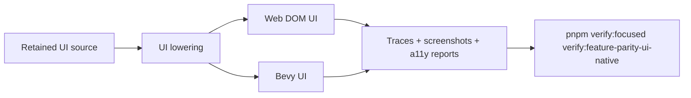

# Native UI Text Accessibility

Complexity: 13 -> HIGH mode

## Complexity Assessment

- +3 touches 10+ implementation/test/docs files during implementation
- +2 adds native UI rendering and interaction behavior
- +2 includes focus, text, accessibility, and input state logic
- +2 spans SDK/IR/compiler, web runtime, Bevy runtime, examples, and docs
- +2 requires visual and accessibility proof
- +2 includes platform capability diagnostics

## Context

**Problem:** UI parity is mixed: web behavior is broader, while Bevy/native
needs stronger pixel, text editing, caret/IME, accessibility, world-attached
UI, and UI-effect proof before promotion.

**Files Analyzed:**

- `docs/bevy-feature-parity.md`
- `docs/PRDs/done/other/post-v10-input-ui-platform-polish.md`
- `docs/PRDs/README.md`
- `/home/joao/.agents/skills/prd-creator/SKILL.md`

**Current Behavior:**

- Retained UI, layout, text, widgets, focus metadata, recipes, accessibility
  diagnostics, settings-screen polish, and packaging fallback evidence exist.
- Several rows remain partial/diagnostic for native-rendered pixels, UI
  shadows/gradients/effects, world-attached UI visual parity, editable text,
  caret/IME, native context menus, atlas/nine-slice pixels, focus narration,
  and broader screen-reader proof.
- Virtual keyboard, 3D UI, custom UI shaders, arbitrary dense grid placement,
  and native desktop visual editor shell remain bounded or deferred.

## Impact

**Planned files touched:** UI SDK helpers, IR validation, compiler lowering,
web UI reports, Bevy UI renderer/input code, accessibility reports, visual
fixtures, verify tooling, capability docs, `docs/STATUS.md`, and
`docs/bevy-feature-parity.md`.

**Features affected:** native UI rendering, text input, focus, accessibility,
world-attached UI, UI effects, image slicing, context menus, and diagnostics.

**Main risks:**

- Native text editing and IME behavior vary by platform and may need
  capability-aware diagnostics rather than blanket promotion.
- Pixel-level UI effects can diverge from web DOM/CSS semantics.
- Accessibility claims are not credible without deterministic evidence and
  clearly scoped platform support.

## Integration Points

**How will this feature be reached?**

- [x] Entry point identified: retained UI source, SDK UI declarations, `tn
  build`, web/native previews, conformance fixtures, and UI polish gates.
- [x] Caller file identified: compiler UI lowering, web DOM adapter, Bevy UI
  adapter, UI input dispatch, accessibility reporters, and verify tooling.
- [x] Registration/wiring needed: UI fixtures, native screenshot capture,
  accessibility reports, capability docs, and parity updates.

**Is this user-facing?**

- [x] YES. Players interact with native menus, text fields, prompts,
  accessibility labels, focus movement, and world-attached UI.
- [ ] NO -> Internal/background feature.

**UI components required:**

- Settings/menu fixture with text input, focus restoration, disabled controls,
  scroll areas, image panels, context menu trigger, and accessibility metadata.
- World-attached UI fixture with nameplates, health bars, interact prompts, and
  off-screen indicators.

**Full user flow:**

1. User authors retained UI with text, images, focus, input, effects, and
   world-attached prompts.
2. `tn build` validates portable fields and rejects unsupported platform-only
   behavior with explicit diagnostics.
3. Web and Bevy previews render and interact with the same UI.
4. Verification captures screenshots, focus/action traces, text-edit traces,
   and accessibility reports.

## Solution

**Approach:**

- Promote native UI pixels only for bounded retained UI styles that can be
  screenshot-proved.
- Promote text editing/caret behavior separately from IME and virtual keyboard
  platform support.
- Add world-attached UI visual proof for the existing projection metadata.
- Treat screen-reader proof as scoped evidence with platform capability labels,
  not a universal guarantee.
- Register `verify:feature-parity-ui-native` per the gate registration
  template in this bundle's `README.md`.

**Key Decisions:**

- [x] Library/framework choices: reuse retained UI IR, web DOM overlay, Bevy UI,
  input action dispatch, and accessibility diagnostic infrastructure.
- [x] Error-handling strategy: platform text/IME/virtual keyboard gaps produce
  capability diagnostics with target-specific support details.
- [x] Reused utilities: UI layout fixtures, screenshot capture, focus trace
  normalization, and conformance reports.

**Data Changes:** UI report and capability metadata additions only. No database
migrations.

## Execution Phases

#### Phase 1: Native Pixel Parity For Bounded UI Styles - Native menus match promoted retained UI.

**Files (max 5):**

- `packages/ir/src/*` - bounded UI style validation
- `packages/runtime-web-three/src/*` - web UI style reports
- `runtime-bevy/crates/threenative_runtime/src/*` - native UI style
  rendering/reports
- `tools/verify/src/*` and `tools/verify/src/cli/run.ts` - UI native gate and
  `FOCUSED_GATES` registration (extend the existing `verify:input-ui-polish`
  gate machinery where it already covers the surface)
- `tools/verify/artifacts/feature-parity-ui-native/*` - screenshots

**Implementation:**

- [x] Preserve native shadows, gradients, atlas, and nine-slice as bounded
  strategy/metadata evidence without claiming unproved pixels.
- [x] Emit renderer strategy reports for effects that remain metadata-only.
- [x] Capture web/native screenshots for a compact settings/menu fixture.

**Tests Required:**

| Test File | Test Name | Assertion |
|-----------|-----------|-----------|
| `packages/ir/src/ui-style-polish.test.ts` | `should reject unsupported custom UI shader declaration` | Diagnostic includes supported presets. |
| `tools/verify/src/uiNative.test.ts` | `should fail when promoted native UI style lacks screenshot evidence` | Missing native screenshot fails. |
| `runtime-bevy/crates/threenative_runtime/tests/ui_style.rs` | `ui_style_should_report_native_ui_effect_strategy` | Report marks rendered or metadata-only. |

**User Verification:**

- Action: Run `pnpm verify:focused verify:feature-parity-ui-native`.
- Expected: Settings/menu screenshots show bounded style parity and report any
  metadata-only effects.

#### Phase 2: Text Editing And Accessibility Proof - Native text and focus claims are scoped and testable.

**Files (max 5):**

- `packages/ir/src/*` - text/accessibility capability validation
- `packages/runtime-web-three/src/*` - web text and a11y reports
- `runtime-bevy/crates/threenative_runtime/src/*` - native text input/focus
  reports
- `packages/ir/fixtures/*` - text/a11y fixtures
- `docs/status/capabilities/*.md` - capability docs

**Implementation:**

- [x] Promote bounded native text editing and caret traces where deterministic.
- [x] Keep IME and virtual keyboard behind target capability diagnostics unless
  platform proof exists.
- [x] Add focus narration and screen-reader evidence with explicit target
  labels.
- [x] Retain deterministic disabled/enabled, scroll, and spatial-navigation
  conformance rows if touched.

**Tests Required:**

| Test File | Test Name | Assertion |
|-----------|-----------|-----------|
| `packages/ir/src/ui-text-input.test.ts` | `should reject IME requirement on unsupported target` | Diagnostic names target capability. |
| `packages/runtime-web-three/src/ui-accessibility.test.ts` | `should report focus narration metadata` | Report includes active label. |
| `runtime-bevy/crates/threenative_runtime/tests/ui_text_input.rs` | `ui_text_input_should_report_caret_position_after_text_edit_trace` | Native trace matches fixture. |

**User Verification:**

- Action: Navigate the UI fixture and edit the text field in native preview.
- Expected: Focus, text value, caret, and accessibility reports match the
  fixture expectations.

#### Phase 3: World-Attached UI Visual Proof - Prompts and nameplates are visually portable.

**Files (max 5):**

- `packages/ir/src/*` - world-attached UI validation
- `packages/runtime-web-three/src/*` - web projection/render reports
- `runtime-bevy/crates/threenative_runtime/src/*` - native projection/render
  reports
- `tools/verify/src/*` - artifact assertions
- `docs/bevy-feature-parity.md` - parity updates

**Implementation:**

- [x] Pair bounded nameplate and pickup-label projection evidence with the
  renderer contact sheet without promoting rendered attachment placement.
- [x] Add a deterministic camera/projection fixture for the bounded in-view
  attachment case; broader occlusion/off-screen cases remain diagnostic.
- [x] Keep 3D-world UI and render-to-texture UI diagnostic-only.

**Tests Required:**

| Test File | Test Name | Assertion |
|-----------|-----------|-----------|
| `packages/ir/src/world-ui.test.ts` | `should reject 3d UI transform when only retained projection is supported` | Diagnostic names boundary. |
| `tools/verify/src/worldUi.test.ts` | `should compare web and native prompt bounding boxes` | Region metrics are within threshold. |

**User Verification:**

- Action: Inspect the world-attached UI contact sheet.
- Expected: Prompts and nameplates remain readable and anchored across targets.

## Verification Strategy

- Run `pnpm verify:focused verify:feature-parity-ui-native`.
- Run `pnpm verify:focused verify:input-ui-polish` for touched shared UI
  behavior (focused gate only; there is no root `verify:input-ui-polish`
  script).
- Run `pnpm verify:conformance` for UI report/schema changes.
- Run `pnpm check:docs` after parity/status updates.

## Acceptance Criteria

- [x] Native UI pixel claims are backed by screenshots and reports.
- [x] Text editing, caret, IME, and virtual keyboard support are truth-graded
  by target capability.
- [x] Accessibility evidence distinguishes metadata diagnostics from platform
  screen-reader proof.
- [x] World-attached UI projection evidence is paired with web/native visual
  artifacts without claiming rendered-placement parity.
- [x] Unsupported 3D UI/custom shader paths remain stable diagnostics.

## Implementation Result

`verify:feature-parity-ui-native` now owns the aggregate web/native reports,
real renderer captures, contact sheet, and artifact validation. The advanced
UI conformance fixture covers a text input, image slicing metadata, bounded
base styles, effect strategies, and retained entity attachments. Deterministic
web/native edit traces promote only value/caret semantics; IME, virtual
keyboard, platform screen-reader output, native gradient/shadow pixels, and
rendered world-attachment placement remain explicit boundaries.
