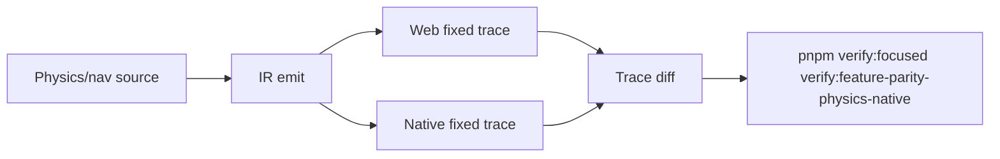

# Physics Navigation Native Depth

Complexity: 12 -> HIGH mode

## Complexity Assessment

- +3 touches 10+ implementation/test/docs files during implementation
- +2 includes physics solver and navigation behavior
- +2 spans SDK/IR/compiler, web runtime, Bevy runtime, examples, and docs
- +2 requires deterministic trace comparison across adapters
- +2 covers complex contact, mesh, and agent behavior
- +1 affects capability and parity documentation

## Context

**Problem:** Physics parity has strong promoted slices, but the gap side still
calls out Bevy/native proof depth plus shared boundaries for deeper contacts,
mesh terrain, navigation, constraints, vehicles, and ragdolls.

**Files Analyzed:**

- `docs/bevy-feature-parity.md`
- `docs/PRDs/done/other/post-v10-animation-physics-navigation-residuals.md`
- `docs/PRDs/done/PRD-013-portable-scripting-character-physics-contacts.md`
- `/home/joao/.agents/skills/prd-creator/SKILL.md`

**Current Behavior:**

- Fixed-tick physics, primitive colliders, contacts, queries, character
  movement, slope limits, pushing, mesh collider metadata, joints metadata, and
  navmesh/pathfinding have promoted evidence.
- The next useful work is deeper native trace proof, not public backend handle
  exposure.
- Full constraints, dynamic navmesh rebakes, crowd steering, off-mesh links,
  vehicles, soft bodies, and ragdolls are still bounded or deferred.

## Impact

**Planned files touched:** physics/nav SDK declarations, IR validation,
compiler lowering, web physics adapter, Bevy/Rapier adapter, navigation reports,
fixtures, verify tooling, capability docs, `docs/STATUS.md`, and
`docs/bevy-feature-parity.md`.

**Features affected:** contact payloads, mesh grounding, bounded mesh collider
diagnostics, constraints, navmesh updates, off-mesh links, crowd steering,
vehicle diagnostics, and unsupported backend handles.

**Main risks:**

- Solver tolerances can hide real behavior drift if not fixture-specific.
- Dynamic navigation can become nondeterministic without fixed seeds and small
  agent counts.
- Vehicle/ragdoll scope can balloon beyond portable engine needs.

## Integration Points

**How will this feature be reached?**

- [x] Entry point identified: SDK physics/nav declarations, script services,
  `tn build`, web/native playtests, and focused physics verification gates.
- [x] Caller file identified: compiler physics/nav emitters, web physics host,
  Bevy/Rapier host, navigation service, and verification runners.
- [x] Registration/wiring needed: fixtures, trace reports, package scripts,
  capability docs, and parity updates.

**Is this user-facing?**

- [x] YES. Authors and players experience character grounding, contact
  responses, pathfinding, moving obstacles, and diagnostics.
- [ ] NO -> Internal/background feature.

**Full user flow:**

1. User authors characters, colliders, nav agents, constraints, or bounded
   vehicle-like declarations.
2. `tn build` validates portable metadata and rejects raw backend handles.
3. Web and Bevy playtests execute fixed scenarios and write trace reports.
4. Verification compares traces, tolerances, screenshots where useful, and
   diagnostic boundaries.

## Solution

**Approach:**

- Deepen native proof for already-promoted primitive, character, mesh, and nav
  behavior before expanding API scope.
- Add narrow dynamic navigation and off-mesh-link fixtures only where reports
  remain deterministic.
- Keep vehicles, ragdolls, soft bodies, arbitrary triangle narrow phase, and
  public backend handles diagnostic-only unless separately narrowed.
- Use trace diagrams or screenshots for scenarios where numeric reports are not
  enough to explain behavior.
- Register `verify:feature-parity-physics-native` per the gate registration
  template in this bundle's `README.md`.

**Key Decisions:**

- [x] Library/framework choices: reuse existing fixed-tick physics,
  character-contact, navmesh, conformance, and playtest proof infrastructure.
- [x] Error-handling strategy: unsupported solver/nav/vehicle requests produce
  stable diagnostics with bounded alternatives.
- [x] Reused utilities: trace diffing, physics self-verification fixtures,
  playtest artifacts, and docs gates.

**Data Changes:** Physics/navigation report additions only. No database
migrations.

## Execution Phases

#### Phase 1: Native Contact Depth - Existing physics claims get richer native traces.

**Files (max 5):**

- `packages/ir/src/*` - physics trace/report validation
- `packages/runtime-web-three/src/*` - web trace output
- `runtime-bevy/crates/threenative_runtime/src/*` - native trace output
- `tools/verify/src/*` and `tools/verify/src/cli/run.ts` - native physics gate
  and `FOCUSED_GATES` registration
- `tools/verify/artifacts/feature-parity-physics-native/*` - evidence

**Implementation:**

- [x] Add native trace depth for multi-contact ordering, material response,
  stacking, sensors, shape casts, and layer/mask filtering.
- [x] Add fixture-specific tolerances and stable ordering rules.
- [x] Emit compact sidecars for contact-heavy scenarios.

**Tests Required:**

| Test File | Test Name | Assertion |
|-----------|-----------|-----------|
| `tools/verify/src/physicsNative.test.ts` | `should fail when native contact ordering evidence is missing` | Missing contact sidecar fails. |
| `tools/verify/src/physicsSelfVerification.ts` | generated material/stack contact sidecars | Reports preserve stable ordered contact summaries. |

**User Verification:**

- Action: Run `pnpm verify:focused verify:feature-parity-physics-native`.
- Expected: Native contact depth reports match web traces within documented
  tolerances.

#### Phase 2: Mesh Terrain And Character Grounding - Characters behave on authored mesh terrain.

**Files (max 5):**

- `packages/ir/src/*` - mesh terrain grounding validation
- `packages/compiler/src/*` - collider/nav lowering
- `packages/runtime-web-three/src/*` - web grounding trace
- `runtime-bevy/crates/threenative_runtime/src/*` - native grounding trace
- `docs/status/capabilities/*.md` - capability docs

**Implementation:**

- [x] Aggregate the existing arbitrary sloped mesh terrain grounding proof for
  bounded fixtures.
- [x] Retain collider local-center, walkability, and mesh terrain policy
  validation in the prerequisite gates.
- [x] Keep arbitrary triangle narrow phase diagnostic-only unless bounded by
  the fixture contract.

**Tests Required:**

| Test File | Test Name | Assertion |
|-----------|-----------|-----------|
| `packages/runtime-web-three/src/mesh-grounding.test.ts` | `should ground character on authored sloped mesh terrain` | Web trace reports the walkable ramp. |
| `runtime-bevy/crates/threenative_runtime/tests/animation_physics_residuals.rs` | `should_ground_character_on_authored_sloped_mesh_terrain` | Native trace matches expected grounded frames. |

**User Verification:**

- Action: Run the mesh-terrain character fixture in web and native preview.
- Expected: Character remains grounded or ungrounded at the same authored
  thresholds.

#### Phase 3: Bounded Navigation Residuals - Dynamic nav behavior is deterministic or rejected.

**Files (max 5):**

- `packages/ir/src/*` - navigation residual validation
- `packages/runtime-web-three/src/*` - web nav reports
- `runtime-bevy/crates/threenative_runtime/src/*` - native nav reports
- `tools/verify/src/*` - nav artifact checks
- `docs/bevy-feature-parity.md` - parity updates

**Implementation:**

- [x] Aggregate the deterministic bounded rebake fixture with fixed authored
  regions and budgets.
- [x] Add bounded crowd steering and off-mesh-link reports for small agent
  counts.
- [x] Reject vehicles, ragdolls, soft bodies, and raw nav handles with stable
  diagnostics unless a future PRD narrows them.

**Tests Required:**

| Test File | Test Name | Assertion |
|-----------|-----------|-----------|
| `packages/ir/src/navigation-residuals.test.ts` | `should reject dynamic navmesh rebake over budget` | Diagnostic reports every exceeded bound. |
| `packages/runtime-web-three/src/navigation-residuals.test.ts` | `should report off-mesh link traversal` | Bounded residual trace preserves link traversal. |
| `tools/verify/src/physicsNative.test.ts` | aggregate residual validation | Missing navigation promotion evidence fails. |

**User Verification:**

- Action: Inspect the navigation trace report.
- Expected: Dynamic obstacle, crowd, and off-mesh-link behavior is deterministic
  or explicitly rejected.

## Verification Strategy

- Run `pnpm verify:focused verify:feature-parity-physics-native`.
- Run `pnpm verify:physics-self-verification`.
- Run `pnpm verify:character-physics-contacts` for touched character behavior.
- Run `pnpm verify:conformance` and `pnpm check:docs` after schema/docs
  changes.

## Acceptance Criteria

- [x] Native physics traces are deeper for promoted contact and character rows.
- [x] Mesh terrain grounding has web/native proof for bounded fixtures.
- [x] Dynamic navigation residuals are either deterministic and proved or
  rejected with stable diagnostics.
- [x] Vehicles, ragdolls, soft bodies, arbitrary narrow phase, and backend
  handles remain explicit boundaries.
- [x] Parity and capability docs cite focused evidence.

## Implementation Result

`verify:feature-parity-physics-native` now composes the established physics
self-verification and animation/physics residual proof families. Every promoted
contact-heavy scene emits a compact stable-order sidecar, and the aggregate
validator requires passing material, stacking, character, query, bounded mesh,
sloped-grounding, bounded-rebake, off-mesh-link, and small-crowd evidence. The
work also fixed the residual comparator to honor its declared numeric tolerance
without false failures at binary floating-point boundaries and raised the
nested conformance timeout to its measured runtime.
