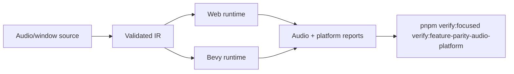

# Audio Platform Runtime Polish

Complexity: 10 -> HIGH mode

## Complexity Assessment

- +3 touches 10+ implementation/test/docs files during implementation
- +2 spans SDK/IR/compiler, web runtime, Bevy runtime, examples, and docs
- +2 includes runtime platform/device capability behavior
- +2 covers cross-adapter audio playback and diagnostics
- +1 affects release/capability documentation

## Context

**Problem:** Audio and window/platform parity are mostly promoted, but the gap
side still calls out both-adapter polish for audio and shared platform policy
for resize/scale, cursor, power/background, clear-color, and single-window
diagnostics.

**Files Analyzed:**

- `docs/bevy-feature-parity.md`
- `docs/PRDs/done/other/post-v10-production-audio-diagnostics-packaging.md`
- `docs/PRDs/done/other/target-profile-contract-hardening.md`
- `/home/joao/.agents/skills/prd-creator/SKILL.md`

**Current Behavior:**

- Local audio assets, playback commands, spatial/listener metadata, mixer/effect
  reports, music transitions, persistence, target profiles, and resize/scale
  observations are present.
- Device routing, platform handles, custom decoders, streaming/network audio,
  custom cursors, power/background policy, clear-color updates, and multi-window
  remain policy or diagnostic rows.
- The useful polish layer is capability-aware reporting plus proof that promoted
  audio behavior remains aligned across web and Bevy.

## Impact

**Planned files touched:** audio/window SDK declarations, IR validation,
compiler emit, web audio/platform adapters, Bevy audio/platform adapters,
target-profile validation, verify tooling, capability docs, `docs/STATUS.md`,
and `docs/bevy-feature-parity.md`.

**Features affected:** audio device diagnostics, mixer/effect reports, routing
policy, soundtrack transitions, generated tones, resize/scale reports, cursor
policy, power/background policy, clear color, and multi-window diagnostics.

**Main risks:**

- Platform audio devices differ enough that pass/fail must be capability-aware.
- Custom decoder or streaming work can accidentally imply arbitrary network or
  filesystem access.
- Window/platform policy can drift between target profiles, runtime adapters,
  and docs.

## Integration Points

**How will this feature be reached?**

- [x] Entry point identified: SDK audio/window declarations, target profiles,
  `tn build`, web/native previews, and production-hardening gates.
- [x] Caller file identified: compiler audio/window emitters, web audio host,
  Bevy audio host, target-profile validators, and verification tooling.
- [x] Registration/wiring needed: device reports, platform policy diagnostics,
  fixtures, package scripts, docs, and status updates.

**Is this user-facing?**

- [x] YES. Authors and players experience playback, mixing, music transitions,
  device capability messaging, resize behavior, and platform diagnostics.
- [ ] NO -> Internal/background feature.

**Full user flow:**

1. User authors audio, mixer, listener, target-profile, and window declarations.
2. `tn build` validates portable behavior and rejects platform-only escape
   hatches.
3. Web and Bevy runtimes execute playback/platform scenarios and write
   capability reports.
4. Verification compares promoted audio traces and checks diagnostics for
   deferred platform features.

## Solution

**Approach:**

- Strengthen cross-adapter audio proof for playback, spatial/listener, mixer,
  effect-chain, generated tones, and music transitions.
- Add capability-aware device routing diagnostics without exposing native
  platform handles.
- Centralize window/platform policy for cursor, power/background, clear color,
  and multi-window declarations.
- Keep custom decoders, streaming, network audio, and arbitrary platform APIs
  diagnostic-only.
- Register `verify:feature-parity-audio-platform` per the gate registration
  template in this bundle's `README.md`.

**Key Decisions:**

- [x] Library/framework choices: reuse existing audio command traces,
  target-profile validation, production-hardening reports, and platform
  diagnostics.
- [x] Error-handling strategy: unsupported device routing, custom decoder,
  streaming, cursor, power, clear-color, and multi-window requests emit stable
  target-aware diagnostics.
- [x] Reused utilities: audio report serializers, target-profile fixtures,
  diagnostic catalog, and docs guards.

**Data Changes:** Audio/platform report additions only. No database migrations.

## Execution Phases

#### Phase 1: Audio Proof Refresh - Promoted playback behavior stays aligned.

**Files (max 5):**

- `packages/ir/src/*` - audio report validation
- `packages/runtime-web-three/src/*` - web audio trace/report output
- `runtime-bevy/crates/threenative_runtime/src/*` - native audio trace/report
  output
- `tools/verify/src/*` and `tools/verify/src/cli/run.ts` - audio platform gate
  and `FOCUSED_GATES` registration
- `tools/verify/artifacts/feature-parity-audio-platform/*` - evidence

**Implementation:**

- [x] Add focused reports for playback, pause/resume/seek/stop/query, mixer
  routing, ducking, effects, spatial/listener movement, generated tones, and
  music transitions.
- [x] Compare deterministic command traces across web and Bevy.
- [x] Keep platform-native handles internal-only.

**Tests Required:**

| Test File | Test Name | Assertion |
|-----------|-----------|-----------|
| `tools/verify/src/audioPlatform.test.ts` | `should compare web and native music transition reports` | Transition state sequence matches. |
| `packages/runtime-web-three/src/audio.test.ts` | `audio lifecycle trace should apply playback controls` | Web lifecycle preserves ordered control states. |
| `runtime-bevy/crates/threenative_runtime/tests/audio.rs` | `audio_lifecycle_trace_should_apply_playback_controls` | Native lifecycle includes control and tone command fields. |

**User Verification:**

- Action: Run `pnpm verify:focused verify:feature-parity-audio-platform`.
- Expected: Audio command and mixer reports match across adapters.

#### Phase 2: Device And Platform Policy Diagnostics - Platform-only requests fail clearly.

**Files (max 5):**

- `packages/ir/src/*` - device/window policy validation
- `packages/compiler/src/*` - diagnostics and lowering
- `packages/runtime-web-three/src/*` - web capability reports
- `runtime-bevy/crates/threenative_runtime/src/*` - native capability reports
- `docs/status/capabilities/*.md` - capability docs

**Implementation:**

- [x] Add capability-aware diagnostics for device routing, custom decoders,
  streaming, and network audio.
- [x] Add shared policy diagnostics for custom cursors, power/background,
  clear-color updates, and multi-window declarations.
- [x] Preserve resize/scale observations and target-profile repair hints.

**Tests Required:**

| Test File | Test Name | Assertion |
|-----------|-----------|-----------|
| `packages/ir/src/ui-window-catalog.test.ts` | `should reject non-deterministic UI routing and platform window policies` | Shared registry owns the four window-policy diagnostics. |
| `packages/runtime-web-three/src/ui-window-catalog.test.ts` | `should report window resize and scale-factor observations` | Web report derives the shared policy codes. |
| `runtime-bevy/crates/threenative_runtime/tests/ui_window_catalog.rs` | `should_report_window_resize_and_scale_factor_changes` | Native report preserves resize/scale and single-window policy. |
| `tools/verify/src/audioPlatform.test.ts` | platform registry comparison | Policy-code drift fails the aggregate. |

**User Verification:**

- Action: Validate rejected audio/platform fixtures with `--json`.
- Expected: Diagnostics include code, path, message, target capability, and fix.

## Verification Strategy

- Run `pnpm verify:focused verify:feature-parity-audio-platform`.
- Run `pnpm verify:focused verify:production-hardening` for touched
  audio/platform reports (focused gate only; there is no root
  `verify:production-hardening` script).
- Run `pnpm verify:conformance` for report/schema changes.
- Run `pnpm check:docs` after status updates.

## Acceptance Criteria

- [x] Promoted audio behavior has refreshed web/native trace evidence.
- [x] Device routing and platform audio gaps are capability-aware diagnostics.
- [x] Window/platform policies are centralized and drift-tested.
- [x] Custom decoders, streaming/network audio, platform handles, and arbitrary
  platform APIs remain explicit boundaries.
- [x] Parity and capability docs cite focused evidence.

## Implementation Result

`verify:feature-parity-audio-platform` now refreshes the established
production-hardening reports and validates the complete playback-control
sequence, mixer/ducking, listener attenuation, music transitions,
generated-tone commands, device-routing diagnostics, resize/scale observations,
and shared window-policy diagnostics. The gate exposed and fixed missing native
tone-command serialization. It preserves custom decoders, streaming/network
audio, native handles, custom cursor images, host power/background control,
runtime clear-color mutation, and multi-window APIs as explicit boundaries.
