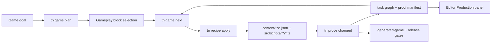
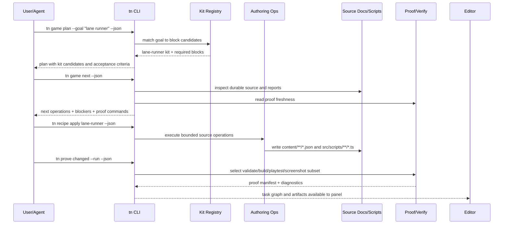

# PRD: Game Development Velocity Kits

Complexity: 12 -> HIGH mode

Score basis: +3 touches 10+ future implementation/test/docs files, +2 adds a
new source-backed kit and recipe system, +2 spans CLI/editor/templates/verify
and docs, +2 introduces task orchestration and proof reuse, +2 affects
generated-game quality gates and release evidence, +1 requires stable
diagnostics and status/parity alignment.

## 1. Context

**Problem:** ThreeNative can already plan, author, validate, and prove games,
but game development is still too slow because authors and agents repeatedly
hand-compose common gameplay structures, decide the next repair manually, and
rerun broad proof commands to answer narrow questions.

**Goal:** Reduce time from game idea to playable, visually credible, verified
vertical slice by shipping source-backed game construction kits, a next-action
orchestrator, and incremental proof reuse that compose existing ThreeNative
authoring, scripting, asset, UI, and verification contracts.

**Files Analyzed:**

- `AGENTS.md`
- `docs/PRDs/README.md`
- `docs/PRDs/other/agent-friendly-project-and-visual-debugging-workflows.md`
- `docs/PRDs/other/agent-game-planning-template-and-init-scaffold.md`
- `docs/PRDs/done/other/agentic-game-production-workflow.md`
- `docs/PRDs/done/other/script-stdlib-common-gameplay-helpers.md`
- `docs/PRDs/done/verification-strategy-and-speed.md`
- `docs/contracts/authoring-source-documents.md`
- `docs/contracts/game-production-workflow.md`
- `docs/contracts/diagnostics.md`
- `/home/joao/.claude/skills/prd-creator/SKILL.md`

**Current Behavior:**

- `tn game inspect`, `tn game plan`, `tn game improve`, `tn game score`,
  `tn game qa`, and `tn game release` provide production workflow primitives.
- Structured source documents and `src/scripts/**/*.ts` are the durable source
  boundary for game content and behavior.
- Authoring operations, prefabs, compact scene instances, script stdlib
  helpers, asset-source catalog commands, and proof gates exist, but broad game
  requests still require manual composition.
- Active PRDs cover project scaffolding, visual debugging, planning templates,
  structured authoring parity, editor architecture, and script code mode.
- Verification has faster release aggregation, but authoring-time proof is not
  yet incremental, cache-aware, or tied to game-development tasks.

## Pre-Planning Findings

The agent-team debate produced three viable strategies:

- **Reusable abstractions:** source-backed gameplay blocks, domain kits,
  prefabs, reducers, and recipe manifests reduce authoring volume.
- **Workflow orchestration:** `tn game next` and an editor production panel
  reduce decision latency by turning plans, diagnostics, and reports into
  bounded next operations.
- **Fast proof loops:** proof manifests, changed-proof selection, and staleness
  diagnostics reduce verification latency without weakening release gates.

The chosen strategy combines all three. Kits alone can create source quickly
but do not tell an agent what to fix next. Orchestration alone can recommend
work but still leaves too much hand-authored boilerplate. Fast proof alone
shortens validation but does not reduce the amount of source to create. The
product should therefore make kits the unit of game construction, orchestration
the control loop, and incremental proof the acceptance loop.

No secret configuration is required. Optional external providers remain local
tooling only and must not appear in source documents, emitted bundles, generated
`dist/**`, browser runtime code, or proof reports beyond redacted capability
status.

## Integration Points

**How will this feature be reached?**

- [x] Entry point identified:
  - `tn game plan --goal "<game idea>" --project . --json`
  - `tn game next --project . --json`
  - `tn recipe apply <kit-or-block> --project . --json`
  - `tn prove changed --project . --json`
  - `tn playtest --recipe <id> --project . --json`
  - editor Production panel over the same JSON contracts
  - `pnpm verify:template-production`, `pnpm verify:generated-games`, and
    `pnpm verify:release`
- [x] Caller file identified:
  - CLI command routing under `packages/cli/src/commands/`
  - authoring operation registry and structured source writers
  - recipe and template registries
  - script stdlib or opt-in kit packages
  - editor adapter and future Production panel
  - verifier implementation under `tools/verify/src`
  - docs contracts and status/parity pages after implementation
- [x] Registration/wiring needed:
  - kit manifest schema, recipe/block registry, proof manifest schema, command
    registrations, editor route metadata, focused verify gate, docs index
    entries, and starter drift checks.

**Is this user-facing?**

- [x] YES. Developers and agents use it to create and iterate on games faster.
- [ ] NO.

**Full user flow:**

1. User asks for a game or runs `tn game plan --goal "top-down salvage game"
   --project . --json`.
2. The plan selects source-backed kit blocks such as `controller.top-down`,
   `objective.collect-all`, `spawn.region-wave`, `camera.follow-target`, and
   `feedback.score-hud`.
3. User or agent runs `tn game next --project . --json` and receives the next
   bounded operations with source owners, recipe IDs, asset-catalog commands,
   expected proof, and blockers.
4. `tn recipe apply top-down-collector --project . --json` writes structured
   source, prefab instances, input maps, UI resources, script references, and
   proof recipe declarations.
5. Scripts import pure reducers from kit packages or the promoted stdlib
   surface; runtime state remains explicit in declared components/resources.
6. `tn prove changed --project . --json` selects the narrowest fresh proof:
   validate, build, scene proof, model test, scale check, playtest recipe,
   screenshot, or focused verifier gate.
7. Editor displays the same task graph, recommended next actions, proof
   freshness, and artifacts without owning a separate mutation engine.
8. Release gates aggregate kit, source, asset, UI, proof, and parity evidence
   rather than trusting a generated-game completion claim.

## 2. Product Model

### Speed Principles

- Prefer composition of proven blocks over repeated hand-authored scene,
  script, UI, input, and proof boilerplate.
- Every generated or recipe-authored element must land in durable source:
  `content/**/*.json` or `src/scripts/**/*.ts`.
- Every recommendation must name a concrete operation, source path, command,
  expected artifact, and diagnostic or blocker.
- Every kit must include its own proof recipe and acceptance criteria.
- Proof acceleration may reuse artifacts only when durable source, assets,
  bundle output, runtime target, command parameters, and proof recipe inputs
  match.
- Fast local proof must never weaken release, conformance, generated-game, or
  visual quality gates.

### Core Concepts

| Concept | Contract |
| --- | --- |
| Gameplay block | Typed planning/recipe unit such as `controller.lane-runner`, `objective.collect-all`, or `feedback.score-hud`. |
| Domain kit | Opt-in package and recipe manifest for a reusable genre slice, such as collector, lane runner, or checkpoint race. |
| Kit manifest | Versioned metadata declaring blocks, source owners, prefab roles, script modules, input, UI, asset roles, diagnostics, and proof commands. |
| Recipe operation | Bounded source mutation such as `tn recipe apply top-down-collector --json`; it writes structured source and scripts only where declared. |
| Task graph | Derived artifact under `artifacts/game-production/task-graph.json` that tracks phase nodes, recommended operations, source owners, blockers, and proof. |
| Proof manifest | Artifact ledger recording source hashes, asset hashes, bundle hash, runtime, command parameters, diagnostics, screenshots, timings, and freshness. |
| Playtest recipe | Source-backed declaration such as `content/proofs/*.json` for inputs, frames, expected state/UI/score, and required artifacts. |

### Initial Kit Targets

The first promoted kits should cover common vertical slices that prove the
system without creating a broad gameplay DSL:

- **Top-down collector:** move a hero, collect rewards, avoid hazards, update
  score/lives HUD, win when all required rewards are collected, retry on fail.
- **Lane runner:** steer between lanes, dodge obstacles, collect bonuses,
  increase speed over time, show distance/score and fail/retry state.
- **Checkpoint race:** drive or pilot through checkpoints, track lap/time,
  handle missed checkpoint feedback, show HUD progress, prove scale/camera.

Each kit must provide:

- gameplay block IDs and recipe parameters;
- prefab roles for player, reward, hazard, checkpoint/goal, camera rig, HUD,
  and environment anchors;
- source document families it writes or requires;
- script module/export names and explicit state ownership;
- pure reducers where useful, with no hidden runtime state;
- asset-role expectations and catalog-first sourcing guidance;
- UI state coverage for gameplay, pause, settings, loading, fail/retry,
  win/milestone, and touch controls when applicable;
- proof recipes and required commands;
- unsupported capability diagnostics.

### Explicit Non-Goals

- No second source format, raw Three.js scene generation, raw Bevy/Rust
  gameplay generation, DOM gameplay, filesystem access, workers, timers,
  renderer handles, native handles, or arbitrary npm imports.
- No edits to `dist/**`, emitted IR, emitted bundle JSON, or
  `scripts.bundle.js` as bug fixes or source persistence.
- No broad gameplay DSL that replaces normal `src/scripts/**/*.ts` behavior.
- No genre-specific helpers in core `@threenative/script-stdlib` unless they
  are genuinely cross-genre and pure.
- No claim that physics-heavy kits are production-ready without authored
  `RigidBody`/`Collider` contracts and web/Bevy proof.
- No primitive-only high-value surfaces accepted as finished kit output.
- No screenshot-driven tuning of adapter colors, lights, or materials.

## 3. Solution

**Approach:**

- Add a versioned kit/block manifest and recipe metadata layer over existing
  structured source operations.
- Implement `tn game next` as a read-first orchestrator that derives task graph
  nodes from source, plan, diagnostics, QA reports, kit manifests, and proof
  artifacts.
- Implement `tn prove changed` and proof manifests to select and reuse narrow
  proof without bypassing release evidence.
- Ship three small promoted kits as maintained examples and template
  composition options.
- Expose the same kit, task, and proof contracts to the editor through a
  Production panel after CLI behavior is proven.
- Ratchet verification so promoted kits cannot drift from plan, source,
  script, asset, UI, playtest, screenshot, and parity evidence.

**Key Decisions:**

- [x] Library/framework choices: reuse the existing CLI command framework,
  structured authoring operations, recipe/template registries, script stdlib
  bundling rules, asset-source catalog, game production report contract, and
  verifier implementation.
- [x] Error-handling strategy: stable diagnostics preserve `code`, `severity`,
  `path`, `message`, and `suggestion`; recipe and proof failures must name the
  owning kit block, source path, and next command when possible.
- [x] Reused utilities: `tn game inspect/plan/improve/qa/release`,
  `tn asset source search/get`, `tn asset inspect`, `tn model-test`,
  `tn game scale`, `tn scene proof`, `tn playtest`, and existing
  generated-game verification.

**Data Changes:**

- New kit/block manifest schema, likely under a repo-owned package or
  `packages/cli` data surface.
- New project artifact:
  `artifacts/game-production/task-graph.json`.
- New proof artifact metadata, either artifact-local or
  `artifacts/game-production/proof-manifest.json`.
- Optional source-backed playtest recipes under `content/proofs/*.json`.
- No database migrations.
- IR schema changes only if proof recipe declarations or kit metadata need to
  become runtime-visible; the initial target should keep them authoring/tooling
  side.

## 4. Sequence Flow

## 5. Execution Phases

#### Phase 1: Kit Manifest And Block Planning - Plans can name reusable gameplay blocks without mutating source.

**Files (max 5):**

- `packages/cli/src/commands/game.ts` - include kit/block candidates in plan
  output.
- `packages/cli/src/game/kits.ts` - new kit/block manifest loader and initial
  in-repo manifest definitions.
- `packages/cli/src/game/kits.test.ts` - manifest validation and goal matching
  tests.
- `docs/contracts/game-production-workflow.md` - document kit/block fields in
  plan and inventory reports.
- `docs/PRDs/README.md` - link this active PRD.

**Implementation:**

- [x] Define `threenative.game-kit-manifest` with id, version, blocks,
  parameters, source owners, prefab roles, script refs, input/UI/resource
  requirements, asset roles, proof commands, and diagnostics.
- [x] Add read-only kit suggestions to `tn game plan --json`.
- [x] Keep all kit suggestions non-mutating and clearly marked as tooling
  guidance.
- [x] Add diagnostics for invalid manifests and unsupported block capability.

**Tests Required:**

| Test File | Test Name | Assertion |
|-----------|-----------|-----------|
| `packages/cli/src/game/kits.test.ts` | `validates kit manifest shape` | Rejects missing block ids, source owners, or proof commands with stable diagnostics. |
| `packages/cli/src/commands/game.test.ts` | `includes kit candidates in game plan` | `tn game plan --json` includes block IDs and non-mutating recipe suggestions. |

**User Verification:**

- Action: `tn game plan --goal "simple top-down collector" --project . --json`
- Expected: Output includes collector block candidates, required source owners,
  and proof commands without editing files.

#### Phase 2: Recipe Apply And Prefab Roles - One kit can create a playable source skeleton through bounded operations.

**Files (max 5):**

- `packages/cli/src/commands/recipe.ts` - new `tn recipe apply` command.
- `packages/cli/src/game/recipeApply.ts` - recipe-to-authoring operation
  execution.
- `packages/cli/src/game/recipeApply.test.ts` - deterministic file-write and
  rejection tests.
- `templates/structured-source-starter/AGENTS.md` - point agents to recipe
  apply after plan completion.
- `docs/contracts/authoring-source-documents.md` - document recipe-owned source
  writes and proof recipe source files if introduced.

**Implementation:**

- [x] Implement `tn recipe apply <kit-id> --project . --json` for the first
  top-down collector skeleton.
- [x] Write only declared `content/**/*.json` and `src/scripts/**/*.ts` paths
  through structured authoring operations or explicit script scaffolds.
- [x] Generate prefab roles, input bindings, systems, UI bindings, script
  references, and proof recipe stubs.
- [x] Reject missing/incompatible source documents before partial mutation.

**Tests Required:**

| Test File | Test Name | Assertion |
|-----------|-----------|-----------|
| `packages/cli/src/game/recipeApply.test.ts` | `applies collector recipe deterministically` | Repeated runs produce stable source paths and IDs. |
| `packages/cli/src/game/recipeApply.test.ts` | `rejects undeclared write path` | Recipe cannot write `dist/**` or undeclared source files. |

**User Verification:**

- Action: `tn recipe apply top-down-collector --project . --json && tn authoring validate --project . --json`
- Expected: Source validates, script references exist, and output names the
  next proof command.

#### Phase 3: Game Next Task Graph - The CLI tells authors the next highest-leverage bounded action.

**Files (max 5):**

- `packages/cli/src/commands/game.ts` - add `tn game next`.
- `packages/cli/src/game/taskGraph.ts` - derive task graph from source,
  reports, kit manifests, diagnostics, and proof.
- `packages/cli/src/game/taskGraph.test.ts` - prioritization and staleness
  tests.
- `docs/contracts/game-production-workflow.md` - document
  `task-graph.json` and recommendation shape.
- `tools/verify/src/templateProductionGate.ts` - ensure maintained starters
  expose recommended game scripts once available.

**Implementation:**

- [x] Emit top recommendations with operation id, command, source owner,
  expected proof, phase, priority, and blocking diagnostics.
- [x] Persist `artifacts/game-production/task-graph.json` after `plan`,
  `recipe apply`, `qa`, and `next`.
- [x] Cover common blockers: missing script export, missing UI state, missing
  asset provenance, stale screenshot, unproven scale, and placeholder
  high-value surface.
- [x] Keep `next` useful in read-only mode; do not require `--apply`.

**Tests Required:**

| Test File | Test Name | Assertion |
|-----------|-----------|-----------|
| `packages/cli/src/game/taskGraph.test.ts` | `prioritizes missing script export before screenshot` | Script wiring blocker ranks above visual proof. |
| `packages/cli/src/game/taskGraph.test.ts` | `marks stale proof from source hash mismatch` | Recommendation includes rerun proof command and diagnostic. |

**User Verification:**

- Action: `tn game next --project . --json`
- Expected: Output names 3-5 concrete next actions, no vague prose-only advice.

#### Phase 4: Incremental Proof Manifest - Changed source selects the narrowest proof.

**Files (max 5):**

- `packages/cli/src/commands/prove.ts` - add `tn prove changed` and
  `tn proof diff`.
- `packages/cli/src/game/proofManifest.ts` - source/asset/bundle hashing and
  freshness evaluation.
- `packages/cli/src/game/proofManifest.test.ts` - hash, staleness, and command
  selection tests.
- `tools/verify/src/gameReadinessGate.ts` - focused generated-game readiness
  proof entry point.
- `docs/contracts/game-production-workflow.md` - document proof freshness and
  diagnostic codes.

**Implementation:**

- [x] Add proof metadata to selected existing playtest, scene proof, screenshot,
  and game QA artifacts.
- [x] Implement read-only `tn prove changed --json` recommendations first.
- [x] Add `--run` only after command selection is deterministic and tested.
- [x] Emit stable diagnostics such as `TN_VERIFY_PROOF_STALE`,
  `TN_VERIFY_SOURCE_HASH_MISMATCH`, `TN_VERIFY_BUNDLE_HASH_MISMATCH`, and
  `TN_VERIFY_ASSET_CHANGED`.
- [x] Add `tn proof diff --from <artifact> --to <artifact> --json` for
  diagnostic, transform, asset, screenshot, timing, and bundle changes.

**Tests Required:**

| Test File | Test Name | Assertion |
|-----------|-----------|-----------|
| `packages/cli/src/game/proofManifest.test.ts` | `reuses fresh unrelated proof` | Unchanged source and matching command parameters do not rerun proof. |
| `packages/cli/src/game/proofManifest.test.ts` | `selects playtest for script change` | Script hash change maps to validate/build/playtest, not full release. |
| `tools/verify/src/gameReadinessGate.test.ts` | `fails missing high-value asset proof` | Gate emits stable diagnostic and source path. |

**User Verification:**

- Action: edit one `src/scripts/**/*.ts` file, then run
  `tn prove changed --project . --json`.
- Expected: Output recommends validate/build/playtest and reports unrelated
  screenshot or asset proof as fresh when hashes match.

#### Phase 5: Promoted Kits And Example Proof - Three maintained kits prove faster game creation end to end.

**Files (max 5):**

- `packages/collector-kit/src/index.ts` - pure reducers and public kit exports.
- `packages/lane-runner-kit/src/index.ts` - pure reducers and public kit
  exports.
- `packages/checkpoint-race-kit/src/index.ts` - pure reducers and public kit
  exports.
- `examples/game-velocity-kits/` - maintained example using all three kit
  paths or focused subexamples.
- `package.json` - package scripts and workspace registration.

**Implementation:**

- [x] Ship top-down collector, lane runner, and checkpoint race kits with pure
  reducers and recipe manifests.
- [x] Keep runtime facades out of reducers; scripts own `ctx` access and state
  persistence explicitly.
- [x] Add catalog-first asset role guidance and fallback evidence for each
  promoted kit.
- [x] Add playtest recipes, screenshot proof, UI state proof, scale proof, and
  generated-game QA artifacts for the maintained examples.

**Tests Required:**

| Test File | Test Name | Assertion |
|-----------|-----------|-----------|
| `packages/collector-kit/src/index.test.ts` | `collect-all reducer reaches win state` | Deterministic state transition with no host APIs. |
| `packages/lane-runner-kit/src/index.test.ts` | `lane change reducer clamps legal lanes` | Invalid lane requests stay in bounds. |
| `packages/checkpoint-race-kit/src/index.test.ts` | `checkpoint reducer rejects out-of-order checkpoint` | Progress state and feedback are deterministic. |

**User Verification:**

- Action: create a fresh starter, apply each kit recipe, run
  `tn prove changed --run --project . --json`, and inspect artifacts.
- Expected: Each kit produces a playable loop, retained UI state, asset-role
  evidence, and focused proof without hand-authored boilerplate.

#### Phase 6: Editor Production Panel And Release Ratchet - The same fast loop is available visually and enforced by gates.

**Files (max 5):**

- `packages/editor/src/panels/ProductionPanel.tsx` - task graph, kit blocks,
  proof freshness, and operation buttons.
- `packages/editor/src/adapters/gameProduction.ts` - CLI/authoring adapter over
  the same JSON contracts.
- `packages/editor/src/panels/ProductionPanel.test.tsx` - panel rendering and
  action wiring tests.
- `tools/verify/src/generatedGames.ts` - require promoted kit proof in
  generated-game aggregation.
- `docs/STATUS.md` and `docs/bevy-feature-parity.md` - update capability and
  parity evidence after implementation.

**Implementation:**

- [x] Add read-only panel rows for phase status, block status, source owners,
  recommendations, proof freshness, and artifacts.
- [x] Wire safe buttons only to existing bounded operations and CLI JSON
  contracts.
- [x] Add operation parity checks so CLI and editor do not drift.
- [x] Ratchet `verify:generated-games` and release aggregation to require kit
  manifest, source, script, asset, UI, playtest, screenshot, and parity status
  evidence for promoted kits.
- [x] Update status and Bevy parity docs because this changes capability and
  release-gate claims.

**Tests Required:**

| Test File | Test Name | Assertion |
|-----------|-----------|-----------|
| `packages/editor/src/panels/ProductionPanel.test.tsx` | `renders next actions from task graph` | Shows command, source owner, and proof status. |
| `tools/verify/src/generatedGames.test.ts` | `requires promoted kit proof evidence` | Missing kit proof fails generated-game gate. |

**User Verification:**

- Action: open the editor on a kit-authored example and inspect the Production
  panel.
- Expected: Panel displays current kit/task/proof state and invokes the same
  operations as the CLI.

## 6. Verification Strategy

Use the narrowest relevant verification first:

- Manifest and planner changes: `pnpm --filter @threenative/cli test`.
- Recipe source writes: CLI tests plus `tn authoring validate --project <fixture> --json`.
- Script reducer packages: package tests and compiler helper-import/bundle tests
  only when promoted imports change.
- Runtime or shared contract changes: include `pnpm verify:conformance`.
- Generated-game proof changes: `pnpm verify:generated-games`.
- Template or starter workflow changes: `pnpm verify:template-production`.
- Release-gate changes: `pnpm verify:release`.

Required final evidence for promoted kits:

- plan output with block IDs and acceptance criteria;
- deterministic source write trace;
- source validation and build output;
- script reducer tests;
- asset-source/provenance ledger or explicit blocker;
- retained UI state evidence;
- input-driven playtest recipe;
- screenshot or scene proof artifact;
- scale/camera proof for high-value 3D surfaces;
- web runtime proof and explicit Bevy parity status.

## 7. Open Questions

- Should kit manifests live in `packages/cli` initially, or in a new shared
  package so editor and verify can consume them without depending on CLI code?
- Should `content/proofs/*.json` become a first-class structured source family
  immediately, or remain artifact/tooling metadata until the playtest recipe
  model stabilizes?
- Should promoted kits be separate workspace packages, or one
  `@threenative/game-kits` package with subpath exports?
- Which existing example should become the first migration target for
  kit-authored source proof?
- What minimum Bevy observation hooks are needed before kit proof can claim
  parity rather than web-only evidence?
