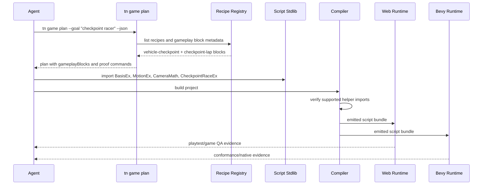

# PRD: GameBlocks-Informed Gameplay Accuracy

Complexity: 10 -> HIGH mode

Score basis: +3 touches 10+ future implementation/test/docs files, +2 adds
new gameplay-block planning and metadata surface, +2 includes complex
stateful movement/camera/gameplay reducer logic, +2 spans CLI, authoring
recipes, script stdlib, compiler tests, verification, and docs, +1 adds an
external reference-source policy.

## 1. Context

**Problem:** `tn game plan` and the current recipe set help agents create
bounded source changes, but they still leave too much precise 3D behavior to
ad hoc script authoring, which causes axis mistakes, camera mismatch, weak
movement semantics, and gameplay state that can drift from what is visible.

**Goal:** Mine the useful portable semantics from `xt4d/GameBlocks` into
ThreeNative-owned planning descriptors, pure script helpers, recipe metadata,
and verification fixtures so generated games start from proven movement,
camera, objective, spawn, and state-machine patterns instead of agent-invented
3D behavior.

**Non-goals:**

- Do not vendor GameBlocks as a runtime dependency or copy its Three.js,
  Rapier, DOM, localStorage, or renderer-object modules into ThreeNative game
  source.
- Do not expose Three.js, Rapier, Bevy, DOM, filesystem, worker, timer, or
  renderer handles to user scripts.
- Do not replace `tn game plan --json`, structured source, or
  `src/scripts/**/*.ts` as the durable authoring workflow.
- Do not promote dynamic vehicle wheel physics, arbitrary terrain mesh
  collision, or backend-specific solver behavior in this PRD.
- Do not tune visuals to match GameBlocks examples. Preserve authored IR values
  and improve source-owned behavior contracts.

**Files Analyzed:**

- `AGENTS.md`
- `docs/PRDs/README.md`
- `docs/PRDs/done/other/agentic-game-production-workflow.md`
- `docs/PRDs/done/other/agent-friendly-3d-game-creation-contract.md`
- `docs/PRDs/done/other/script-stdlib-common-gameplay-helpers.md`
- `docs/PRDs/other/agent-game-planning-template-and-init-scaffold.md`
- `docs/PRDs/proof-first-engine-loop-2026-07-05/PRD-009-portable-scripting-character-physics-contacts.md`
- `docs/contracts/game-production-workflow.md`
- `docs/contracts/scripting.md`
- `docs/workflows/agent-game-creation.md`
- `packages/cli/src/commands/game.ts`
- `packages/cli/src/commands/gameScore.test.ts`
- `packages/authoring/src/gameAgentInventory.ts`
- `packages/authoring/src/recipes.ts`
- `packages/authoring/src/recipes.test.ts`
- `packages/script-stdlib/src/index.ts`
- `packages/script-stdlib/src/gameplay.ts`
- `packages/script-stdlib/src/feedback.ts`
- `packages/script-stdlib/src/vectors.ts`
- `packages/script-stdlib/src/rotation.ts`
- External: `xt4d/GameBlocks` at commit
  `ba678d6b82890d151cc839c090fda8ef883c0184`
- External: `gameblocks/SKILL.md`
- External: `gameblocks/summary.md`
- External: `gameblocks/modules/math/WorldBasis.js`
- External:
  `gameblocks/modules/actor-motion/character/WorldCardinalCharacterMotionController.js`
- External: `gameblocks/modules/camera/PositionFollowCameraRig.js`
- External: `gameblocks/modules/gameplay/RaceCheckpointLapPlay.js`
- External: `gameblocks/modules/world/environment/SpawnAreaSampler.js`
- External: `LICENSE`

**Current Behavior:**

- `tn game plan --goal <text> --project . --json` emits a non-mutating
  `threenative.game-plan` with design, asset, source, script, polish, proof,
  and recipe-step sections.
- Authoring recipes cover `third-person-controller`, `top-down-collector`,
  `lane-runner`, `vehicle-checkpoint`, `obstacle-avoider`, `physics-target`,
  and `dressed-environment-kit`, but recipe metadata does not yet describe the
  underlying controller/camera/gameplay pattern in a reusable way.
- `@threenative/script-stdlib` already provides pure helpers such as `Vec2`,
  `Vec3`, `Quat`, `InputEx`, `MotionEx`, `TimerEx`, `CameraMath`, `RandomEx`,
  `Bounds2`, and `Bounds3`.
- Existing stdlib helpers assume the active ThreeNative coordinate convention
  directly; there is no explicit portable `BasisEx` helper that names
  right/up/forward axes, validates handedness, maps control signs, or converts
  planar motion through a single source of truth.
- GameBlocks is MIT licensed and contains 74 source modules. Its summary
  states dependencies on Three.js `0.161.0` and Rapier3D `0.14.0`; those
  dependencies make direct runtime adoption inappropriate for ThreeNative, but
  many module semantics are portable.

## Pre-Planning Findings

No `.env` or secret configuration is relevant.

GameBlocks is useful because it separates common game behavior into small,
inspectable modules. The highest-value ideas for ThreeNative are:

| GameBlocks Area | ThreeNative Use | Decision |
|-----------------|-----------------|----------|
| `math/WorldBasis.js` | Axis descriptors, planar components, control signs, yaw/pitch/roll frame semantics | Promote as a pure `BasisEx`-style stdlib helper and conformance fixture. |
| Character motion controllers | Input-to-intent patterns for world-cardinal, heading-relative, target, and mouse-look movement | Promote bounded pure reducers or recipe templates; do not copy Three.js vectors. |
| Camera rigs | Position-follow, pose-follow, first-person, and look-offset rigs | Extend `CameraMath` and recipe metadata with named rig semantics. |
| Gameplay reducers | Race checkpoint/lap, snake, combat, flight, wave spawning, projectile lifecycle | Promote selected plain-data reducers incrementally, starting with checkpoint/lap and spawn/wave helpers. |
| Spawn and planar utilities | Region-based spawn sampling and block regions | Promote plain JSON region contracts in stdlib or recipe metadata. |
| UI DOM renderers and localStorage settings | DOM HUD, storage settings | Do not promote; ThreeNative retained UI and persistence contracts own this space. |
| Rapier kinematic/dynamic resolvers | Collision-aware movement and car physics | Use as reference for future physics PRDs only; do not promote solver-specific APIs here. |
| Visual factories/environments | Procedural Three.js visuals | Use only as art-direction inspiration; ThreeNative source documents own scene assets and materials. |

The first product improvement should be a planning and helper contract, not
new raw engine capability. Agents should see named gameplay blocks in the game
plan, then implement script bodies with promoted pure helpers and source-backed
recipes. This keeps the engine boundary intact while reducing spatial
guesswork.

## Integration Points

**How will this feature be reached?**

- [x] Entry point identified:
  - `tn game inspect --project <path> --json`
  - `tn game plan --goal <text> --project <path> --json`
  - `tn game improve --apply-plan <file> --project <path> --json`
  - `tn recipe <recipe-id> ... --json`
  - user scripts importing named helpers from `@threenative/script-stdlib`
  - `pnpm verify:conformance`
  - `pnpm verify:game-production`
- [x] Caller file identified:
  - `packages/cli/src/commands/game.ts`
  - `packages/authoring/src/recipes.ts`
  - `packages/script-stdlib/src/index.ts`
  - `packages/compiler/src/scripts/sourceRefs.ts`
  - `tools/verify/src/gameProductionGate.ts`
- [x] Registration/wiring needed:
  - Add `gameplayBlocks` descriptors to game-plan output.
  - Add recipe metadata that maps recipes to controller, camera, objective,
    world, and proof block IDs.
  - Add promoted pure helper exports and compiler import whitelist entries.
  - Add focused tests and conformance/generated-game proof.
  - Update workflow and contract docs.

**Is this user-facing?**

- [x] YES. The users are developers and coding agents creating or improving
  ThreeNative games.
- [ ] NO.

**Full user flow:**

1. User asks an agent to create or improve a game.
2. Agent runs `tn game inspect --project . --json`.
3. Agent runs `tn game plan --goal "<game idea>" --project . --json`.
4. The plan includes `gameplayBlocks` such as `basis.y-up-z-forward`,
   `controller.world-cardinal-character`, `camera.position-follow`,
   `objective.checkpoint-lap`, `spawn.region-sampler`, or
   `state.wave-spawn`.
5. Agent selects matching recipe steps and script helpers instead of inventing
   movement/camera/state math from scratch.
6. `tn game improve --apply-plan` applies bounded structured-source recipe
   steps, and scripts import promoted pure helpers from
   `@threenative/script-stdlib`.
7. Agent proves the result with authoring validation, build, playtest motion,
   screenshot, game score, QA, release, and conformance where shared runtime
   behavior is touched.

## 2. Solution

**Approach:**

- Add a `gameplayBlocks` planning layer that names precise controller, camera,
  objective, spawn, and reducer patterns inspired by GameBlocks but owned by
  ThreeNative.
- Promote the most reusable pure semantics into `@threenative/script-stdlib`,
  starting with `BasisEx`, basis-aware camera helpers, checkpoint/lap reducer,
  and spawn-region helpers.
- Extend authoring recipe metadata so `tn game plan` can recommend block IDs
  and proof commands per game genre without relying only on prose.
- Keep all helper APIs dependency-free, JSON-compatible, deterministic, and
  host-free. Do not import Three.js or Rapier.
- Add focused tests and conformance fixtures that prove the same helper logic
  and generated script patterns behave consistently in compiler, web, and
  Bevy paths.

```mermaid
flowchart LR
    GB[GameBlocks Reference] --> Triage[ThreeNative Triage Doc]
    Triage --> Plan[tn game plan gameplayBlocks]
    Triage --> Stdlib[@threenative/script-stdlib helpers]
    Plan --> Recipes[Authoring Recipe Metadata]
    Recipes --> Source[content/**/*.json + src/scripts/**/*.ts]
    Stdlib --> Scripts[src/scripts/**/*.ts]
    Scripts --> Compiler[Compiler Helper Import Whitelist]
    Compiler --> Web[Web Runtime]
    Compiler --> Bevy[Bevy Runtime]
    Web --> Evidence[Conformance + Game Production Proof]
    Bevy --> Evidence
```

**Key Decisions:**

- [x] Library/framework choices: reuse `@threenative/script-stdlib`,
  `planAuthoringRecipe`, `tn game plan`, `tn game improve`, existing compiler
  supported-import checks, and existing game-production gates.
- [x] Error-handling strategy: unsupported GameBlocks-derived ideas become
  stable diagnostics or documented non-goals. Direct Three.js/Rapier/DOM use is
  rejected at the script/compiler boundary.
- [x] Reused utilities: current `InputEx`, `MotionEx`, `CameraMath`, `TimerEx`,
  `RandomEx`, `Bounds2`, `Bounds3`, recipe metadata, game inventory, and
  proof-command infrastructure.

**Data Changes:**

- Extend `threenative.game-plan` with a backward-compatible optional field:

```ts
gameplayBlocks?: Array<{
  id: string;
  kind: "basis" | "controller" | "camera" | "objective" | "spawn" | "ai" | "combat" | "world";
  source: "threenative" | "gameblocks-inspired";
  appliesWhen: string[];
  helperImports: string[];
  recipeIds: string[];
  scriptResponsibilities: string[];
  proof: string[];
  cautions: string[];
}>;
```

- Extend recipe plan metadata with optional `gameplayBlocks: string[]`.
- Add pure stdlib exports. Proposed names:
  - `BasisEx`
  - `ControllerEx`
  - `CheckpointRaceEx`
  - `SpawnEx`
  - optional later `WaveEx` and `ProjectileEx`
- No database migrations.
- No direct IR schema change is required unless a later phase promotes a
  source-declared gameplay-block document. If that happens, update
  `docs/STATUS.md` and `docs/bevy-feature-parity.md` with evidence.

**External Source Policy:**

- GameBlocks is MIT licensed. If implementation copies any non-trivial code,
  preserve the license notice in the copied/adapted file or an adjacent
  attribution note.
- Prefer behavioral reimplementation over source copying. Translate Three.js
  `Vector3`/`Quaternion` objects into tuple/plain-object inputs and outputs.
- Record the upstream commit hash and selected modules in a workflow reference
  doc so future agents know what was reviewed.

## 3. Sequence Flow



## 4. Execution Phases

#### Phase 1: Reference Inventory And Plan Blocks - Game plans name reusable gameplay blocks.

**Files (max 5):**

- `docs/workflows/gameblocks-reference-inventory.md` - reviewed module
  inventory, selected semantics, exclusion policy, license note, upstream
  commit.
- `packages/cli/src/commands/game.ts` - add optional `gameplayBlocks` to
  `tn game plan` output.
- `packages/cli/src/commands/gameScore.test.ts` - plan output tests for block
  shape and genre mapping.
- `docs/contracts/game-production-workflow.md` - document `gameplayBlocks`.
- `docs/workflows/agent-game-creation.md` - instruct agents to select blocks
  before script authoring.

**Implementation:**

- [x] Add a GameBlocks reference inventory doc with selected modules and
  rejected modules.
- [x] Add deterministic `buildGameplayBlocks(goal, inventory)` output for
  top-down, lane runner, checkpoint/vehicle, physics target, combat, and
  generic third-person goals.
- [x] Include block IDs, helper imports, matching recipe IDs, cautions, and
  proof commands.
- [x] Keep `mutate:false` and all existing plan fields backward-compatible.

**Tests Required:**

| Test File | Test Name | Assertion |
|-----------|-----------|-----------|
| `packages/cli/src/commands/gameScore.test.ts` | `should include gameplay blocks in generated game plan` | Plan contains basis, controller, camera, objective, and proof block rows. |
| `packages/cli/src/commands/gameScore.test.ts` | `should map checkpoint racing goals to vehicle and checkpoint blocks` | `vehicle-checkpoint` and `objective.checkpoint-lap` are recommended without mutating files. |

**User Verification:**

- Action: Run `pnpm --filter @threenative/cli test -- --run gameScore`.
- Expected: Game plan output includes actionable block descriptors and still
  writes no files.

#### Phase 2: Pure Basis And Controller Helpers - Scripts can use one source of truth for axes and planar control.

**Files (max 5):**

- `packages/script-stdlib/src/gameplay.ts` - add `BasisEx` and initial
  `ControllerEx` pure helpers.
- `packages/script-stdlib/src/index.ts` - export new helpers.
- `packages/script-stdlib/src/index.test.ts` - deterministic helper and
  host-free bundle tests.
- `packages/compiler/src/scripts/sourceRefs.ts` - allow new named imports.
- `packages/compiler/src/scripts/sourceRefs.test.ts` - accepted/rejected import
  coverage.

**Implementation:**

- [x] Implement `BasisEx.create({ right, up, forward })`, validation for three
  distinct axes, and right-cross-forward handedness checks.
- [x] Implement `BasisEx.controlSignal`, `toPlanar`, `fromBasisComponents`,
  `flatten`, `distance2d`, `forwardToYaw`, and `yawPitchRollFrame` using plain
  tuples/objects.
- [x] Implement `ControllerEx.worldCardinalCharacter` as a pure reducer that
  converts input axes, current position/velocity/yaw, `dt`, speed, turn rate,
  gravity, and jump into next intent data.
- [x] Keep helpers deterministic, host-free, dependency-free, and JSON
  serializable.

**Tests Required:**

| Test File | Test Name | Assertion |
|-----------|-----------|-----------|
| `packages/script-stdlib/src/index.test.ts` | `should validate gameplay basis descriptors` | Duplicate axes and invalid handedness throw or return stable errors as specified. |
| `packages/script-stdlib/src/index.test.ts` | `should convert cardinal controls through BasisEx deterministically` | Forward/right inputs produce expected planar deltas and yaw. |
| `packages/script-stdlib/src/index.test.ts` | `should keep BasisEx and ControllerEx host-free in bundle source` | VM context lacks DOM/Node globals and returns identical results. |
| `packages/compiler/src/scripts/sourceRefs.test.ts` | `should allow gameplay accuracy stdlib imports` | Named imports compile and unsupported namespace/default imports remain rejected. |

**User Verification:**

- Action: Run `pnpm --filter @threenative/script-stdlib test` and
  `pnpm --filter @threenative/compiler test -- --run sourceRefs`.
- Expected: New helpers are available only through supported named imports.

#### Phase 3: Recipe Metadata And Script Guidance - Recipes advertise exact gameplay semantics.

**Files (max 5):**

- `packages/authoring/src/recipes.ts` - add `gameplayBlocks` metadata and
  richer proof/source responsibilities.
- `packages/authoring/src/recipes.test.ts` - metadata coverage for existing
  recipes.
- `packages/cli/src/commands/game.ts` - merge recipe block metadata into plan
  steps.
- `packages/cli/src/commands/gameScore.test.ts` - plan-step metadata tests.
- `docs/workflows/agent-game-creation.md` - recipe-to-block reference table.

**Implementation:**

- [x] Map existing recipes to block IDs:
  `third-person-controller`, `top-down-collector`, `lane-runner`,
  `vehicle-checkpoint`, `obstacle-avoider`, `physics-target`, and
  `dressed-environment-kit`.
- [x] Add script responsibility hints such as `owns movement intent`,
  `owns checkpoint progress`, `owns fail/retry state`, and `owns HUD text`.
- [x] Add proof hints with expected movement axis, trigger event, UI binding,
  and screenshot/QA evidence.
- [x] Ensure `tn game improve` persists the same metadata in
  `artifacts/game-production/plan.json`.

**Tests Required:**

| Test File | Test Name | Assertion |
|-----------|-----------|-----------|
| `packages/authoring/src/recipes.test.ts` | `should expose gameplay block metadata for maintained recipes` | Every game recipe has at least one controller/objective/world/proof block. |
| `packages/cli/src/commands/gameScore.test.ts` | `should include recipe gameplay blocks in plan steps` | Plan steps include block IDs and proof hints for matching recipes. |

**User Verification:**

- Action: Run `pnpm --filter @threenative/authoring test -- --run recipes`
  and `pnpm --filter @threenative/cli test -- --run gameScore`.
- Expected: Recipe metadata is visible in plan output and remains
  non-mutating.

#### Phase 4: Objective And Spawn Reducers - Common state machines are reusable plain-data helpers.

**Files (max 5):**

- `packages/script-stdlib/src/gameplay.ts` - add `CheckpointRaceEx` and
  `SpawnEx`.
- `packages/script-stdlib/src/index.ts` - export helpers.
- `packages/script-stdlib/src/index.test.ts` - reducer tests.
- `packages/compiler/src/scripts/sourceRefs.ts` - allow imports.
- `packages/compiler/src/scripts/sourceRefs.test.ts` - compiler import tests.

**Implementation:**

- [x] Add `CheckpointRaceEx` functions for init, start, step, checkpoint pass,
  lap complete, finish ordering, snapshot, and reset using plain data.
- [x] Add `SpawnEx` region contracts for rect, circle, polygon, and segment
  corridor, plus block-region rejection and deterministic sampled points from
  `RandomEx`.
- [x] Keep event ordering deterministic and stable for generated-game proof.
- [x] Avoid wall-clock time. Callers pass `dt` and persist returned state in
  declared resources.

**Tests Required:**

| Test File | Test Name | Assertion |
|-----------|-----------|-----------|
| `packages/script-stdlib/src/index.test.ts` | `should emit checkpoint race events in stable order` | Checkpoint, lap, player finish, and race finish events match expected payloads. |
| `packages/script-stdlib/src/index.test.ts` | `should sample spawn regions while rejecting blocked regions` | Deterministic seed/index produces allowed positions or null after bounded attempts. |
| `packages/compiler/src/scripts/sourceRefs.test.ts` | `should allow checkpoint and spawn stdlib imports` | Scripts importing new helpers pass whitelist validation. |

**User Verification:**

- Action: Run `pnpm --filter @threenative/script-stdlib test`.
- Expected: Objective and spawn helpers are deterministic and host-free.

#### Phase 5: Runtime And Gate Proof - Generated games prove block behavior across web and Bevy.

**Files (max 5):**

- `packages/ir/fixtures/conformance/gameplay-blocks/game.bundle/manifest.json`
  - fixture manifest.
- `packages/ir/fixtures/conformance/gameplay-blocks/game.bundle/world.ir.json`
  - source-derived scene/physics/script fixture.
- `packages/ir/fixtures/conformance/gameplay-blocks/game.bundle/scripts.bundle.js`
  - emitted helper-using script fixture.
- `tools/verify/src/gameProductionGate.ts` - verify persisted plans retain
  block metadata when present.
- `tools/verify/src/gameProductionGate.test.ts` - aggregate gate tests.

**Implementation:**

- [x] Add a compact conformance fixture that uses `BasisEx`,
  `ControllerEx`, `CameraMath`, and `CheckpointRaceEx`.
- [x] Capture expected service/effect observations for movement, checkpoint
  progress, UI resource write, and retry state.
- [x] Require generated-game production gate to preserve `gameplayBlocks` when
  `plan.json` includes them, without making old plans invalid.
- [x] Add release-gate docs/status updates if this phase promotes a new shared
  runtime contract.

**Tests Required:**

| Test File | Test Name | Assertion |
|-----------|-----------|-----------|
| `tools/verify/src/gameProductionGate.test.ts` | `should preserve gameplay block plan evidence` | Generated-game plan with blocks passes; stale or malformed block evidence reports stable diagnostics. |
| Existing conformance tests | `gameplay-blocks fixture` | Web and Bevy observations match fixture expectations. |

**User Verification:**

- Action: Run `pnpm verify:conformance` and `pnpm verify:game-production`.
- Expected: Gameplay block semantics are proven by shared fixtures and
  generated-game gates.

## 5. Checkpoint Protocol

After each phase, run an automated PRD checkpoint review:

```text
Use Task tool with:
- subagent_type: "prd-work-reviewer"
- prompt: "Review checkpoint for phase <N> of PRD at docs/PRDs/done/gameblocks-informed-gameplay-accuracy.md"
```

Continue only after the reviewer reports PASS. Phase 5 also needs manual
inspection of generated-game proof artifacts if screenshots or playtest traces
change.

## 6. Verification Strategy

**Focused commands:**

- `pnpm --filter @threenative/script-stdlib test`
- `pnpm --filter @threenative/compiler test -- --run sourceRefs`
- `pnpm --filter @threenative/authoring test -- --run recipes`
- `pnpm --filter @threenative/cli test -- --run gameScore`
- `pnpm verify:conformance`
- `pnpm verify:game-production`

**Evidence Required:**

- [x] Plan output includes `gameplayBlocks` without mutating project files.
- [x] New stdlib helpers pass export and injected bundle parity tests.
- [x] Compiler accepts only promoted named helper imports.
- [x] Existing recipes expose block metadata and proof hints.
- [x] Generated-game production proof preserves block metadata when present.
- [x] Web and Bevy conformance fixtures prove shared semantics if runtime
  behavior is promoted.

## 7. Acceptance Criteria

- [x] GameBlocks reference inventory is committed with upstream commit,
  selected modules, rejected modules, and MIT license handling.
- [x] `tn game plan --json` emits optional, deterministic `gameplayBlocks`
  guidance for common generated-game goals.
- [x] `@threenative/script-stdlib` includes promoted pure basis/controller and
  selected state reducer helpers with host-free tests.
- [x] Authoring recipes advertise matching gameplay block metadata and proof
  responsibilities.
- [x] Generated-game proof gates preserve and validate block evidence when
  present.
- [x] No Three.js, Rapier, DOM, localStorage, filesystem, worker, timer, Bevy,
  or renderer handles are exposed to user scripts.
- [x] All specified focused tests pass.
- [x] `pnpm verify:conformance` passes for any shared runtime contract touched.
- [x] Capability/release-gate changes, if any, update `docs/STATUS.md` and
  `docs/bevy-feature-parity.md`.
