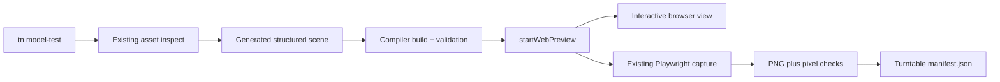
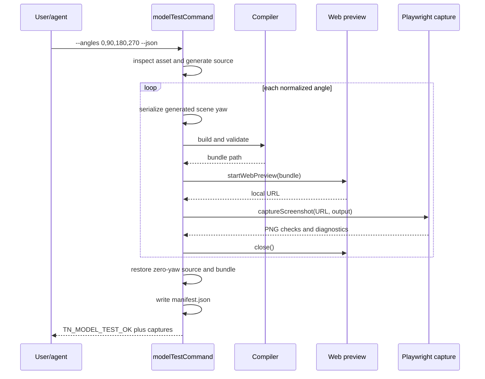

# PRD: GLB Visual Inspection and Turntable Capture

**Status:** Done
**Date:** 2026-07-11
**Complexity:** 6 -> MEDIUM mode

Complexity score:

- +2: expected to touch 6-10 files.
- +2: preview/build/browser lifecycle and cleanup logic.
- +2: changes cross the CLI and web-runtime package boundary.

## 1. Context

**Problem:** ThreeNative can structurally inspect and runtime-load glTF/GLB
assets, but an author cannot use one `tn` command to interactively view a model
or create deterministic, rotated inspection images without first operating a
separate preview project and URL.

**Files analyzed:**

- `packages/cli/src/index.ts`
- `packages/cli/src/index.test.ts`
- `packages/cli/src/commands/asset.ts`
- `packages/cli/src/commands/modelTest.ts`
- `packages/cli/src/commands/modelTest.test.ts`
- `packages/cli/src/commands/visualProof.ts`
- `packages/cli/src/commands/dev.ts`
- `packages/cli/src/commands/help.ts`
- `packages/cli/src/commands/help.test.ts`
- `packages/runtime-web-three/src/devServer.ts`
- `docs/status/capabilities/assets.md`
- `docs/STATUS.md`

**Current behavior:**

- `tn asset inspect <path>` parses glTF/GLB metadata, dependencies, bounds,
  calibration hints, and diagnostics, but produces no visual output.
- `tn model-test <path>` generates a structured one-model proof project with a
  floor, ruler, bounds marker, camera, and lights.
- `tn model-test --screenshot` only captures when the caller also supplies a
  separately running `--url`; otherwise it reports
  `TN_MODEL_TEST_SCREENSHOT_UNAVAILABLE`.
- `startWebPreview` already owns validated bundle serving and a closeable Vite
  server. `captureScreenshot` already owns Playwright capture, readiness checks,
  PNG inspection, and browser cleanup.
- The generated scene has no command-controlled yaw and there is no turntable
  capture/report contract.

## 2. Goals and Non-Goals

### Goals

- Make `tn model-test <asset> --view` a one-command interactive GLB/glTF
  inspection workflow.
- Make `tn model-test <asset> --screenshot` self-contained when `--url` is not
  supplied.
- Add deterministic single-angle and multi-angle capture suitable for agent and
  human inspection.
- Keep the generated structured scene as the source of truth; do not patch
  emitted bundle JSON or runtime-private objects.
- Reuse the existing compiler, web preview server, screenshot analysis, and
  diagnostic conventions.
- Emit machine-readable artifact details and actionable failures under `--json`.

### Non-goals

- Converting GLB geometry into a raster asset format or modifying the source
  GLB.
- Building a general-purpose DCC tool, material editor, animation editor, or
  mesh repair utility.
- Adding raw Three.js authoring to generated projects.
- Claiming Bevy visual parity from web-only inspection captures.
- Contact-sheet composition in the first release. Individual PNGs plus a JSON
  manifest are sufficient and easier to inspect programmatically.

## 3. User-facing Contract

### Commands

```bash
# Existing metadata inspection remains unchanged.
tn asset inspect assets/hero.glb --json

# Generate the model-test project, build it, start a local viewer, and keep it
# alive until interrupted.
tn model-test assets/hero.glb --view

# Capture one self-hosted inspection frame at zero yaw.
tn model-test assets/hero.glb --screenshot --json

# Capture one explicitly rotated frame.
tn model-test assets/hero.glb --screenshot --angle 45 --json

# Capture a deterministic turntable set.
tn model-test assets/hero.glb --angles 0,90,180,270 --json

# Preserve the advanced/existing external-preview flow.
tn model-test assets/hero.glb --screenshot \
  --url http://127.0.0.1:5173 --screenshot-out hero.png --json
```

### Flag semantics

| Flag | Behavior |
| --- | --- |
| `--view` | Builds the generated model-test project, starts `startWebPreview`, prints the URL, and keeps the server alive until SIGINT/SIGTERM. Mutually exclusive with `--screenshot`, `--angles`, and `--url`. |
| `--screenshot` | Captures one PNG. Without `--url`, the command builds and serves its generated project automatically. |
| `--angle <degrees>` | Sets model yaw for `--view` or a single `--screenshot`; default `0`. It is invalid with `--angles`. |
| `--angles <csv>` | Implies self-hosted screenshots and captures one PNG per yaw. It is mutually exclusive with `--view`, `--angle`, `--url`, and `--screenshot-out`. |
| `--url <url>` | Retains the existing externally managed preview escape hatch for a single screenshot. |
| `--screenshot-out <png>` | Retains the existing single-frame output override. |
| `--out <dir>` | Continues to own the generated proof project and defaults to `artifacts/model-test`. Turntable images live under `<out>/artifacts/turntable/`. |

Angles must be finite numbers. Normalize them into `[0, 360)`, remove exact
duplicates after normalization while preserving input order, and reject empty
lists or more than 36 distinct angles. This bound prevents accidental
long-running browser/build loops. Artifact filenames use normalized,
filesystem-safe values such as `model-test-yaw-000.png`,
`model-test-yaw-090.png`, and `model-test-yaw-022_5.png`.

### Result contract

A successful single capture keeps the existing `screenshot` field. A
turntable run adds:

```json
{
  "code": "TN_MODEL_TEST_OK",
  "turntable": {
    "manifestPath": ".../artifacts/turntable/manifest.json",
    "captures": [
      {
        "angleDegrees": 0,
        "outPath": ".../model-test-yaw-000.png",
        "byteSize": 12345,
        "checks": { "nonblank": { "ok": true } }
      }
    ]
  }
}
```

`manifest.json` is structured serialization of the capture results, input
asset path, normalized angles, capture time, and generated bundle path. A
capture with screenshot diagnostics of severity `error` makes the command fail
with `TN_MODEL_TEST_CAPTURE_FAILED`, while preserving completed capture records
for diagnosis.

## 4. Integration Points

**How will this feature be reached?**

- [x] Entry point identified: `tn model-test` in `packages/cli/src/index.ts`.
- [x] Caller identified: CLI dispatch calls `modelTestCommand`.
- [x] Registration/wiring identified: extend the owning command descriptor so
  top-level help derives the new flags from the existing registry entry; update
  task-oriented asset help and drift tests.

**Is this user-facing?**

- [x] Yes, through the CLI and browser preview. No editor UI is required for
  this slice; the interactive UI is the existing ThreeNative web preview.

**Full user flow:**

1. The user passes a local `.glb` or `.gltf` to `tn model-test`.
2. `modelTestCommand` runs existing asset inspection and generates durable
   structured model-test source plus copied dependencies.
3. The compiler builds and validates the bundle.
4. `startWebPreview` serves the validated bundle.
5. In view mode, the terminal displays the URL and the user inspects the model
   in the browser. In capture mode, Playwright waits for runtime readiness and
   writes analyzed PNGs.
6. The command returns a human report or stable JSON; temporary preview servers
   and browser processes close on success and failure.

## 5. Solution

### Approach

- Extend `model-test`; do not add a second top-level GLB viewer command or a
  second asset-inspection implementation.
- Introduce a small parser for inspection mode and angle flags. Parse before
  creating files so usage failures do not leave partial projects.
- Parameterize `renderSceneDocument` with model yaw in degrees and serialize
  the corresponding Y-axis rotation in the structured scene.
- Add a self-hosted capture helper that builds/validates through existing
  compiler APIs, starts `startWebPreview({ silent: true })`, calls the existing
  screenshot helper, and always closes the server in `finally`.
- For turntables, rewrite only the generated model-test structured source for
  each angle, rebuild, capture, then restore angle zero and rebuild so the
  project left on disk is stable and unsurprising. Never mutate `dist/**`
  directly.
- Write `manifest.json` only through `JSON.stringify`; never construct JSON by
  string concatenation.



### Key decisions

- [x] Reuse `startWebPreview` rather than create another static server.
- [x] Reuse `captureScreenshot` rather than create a second Playwright path.
- [x] Rotate authored source, not the emitted IR or a runtime-private handle.
- [x] Keep `--url` backward compatible for callers that manage their own
  preview.
- [x] Treat browser launch, runtime readiness, missing canvas, blank image,
  resource failure, and rebuild failures as stable actionable diagnostics.
- [x] Use yaw degrees at the CLI boundary, matching familiar engine tooling,
  and convert only at the structured transform boundary if the schema requires
  radians.

**Data changes:** No schema or migration. One new versioned-by-shape artifact,
`manifest.json`, is local proof output rather than a runtime contract.

## 6. Sequence Flow



## 7. Execution Phases

### Phase 1: Self-hosted single-frame inspection - A user can view or capture a GLB without supplying a preview URL

**Files (5):**

- `packages/cli/src/commands/modelTest.ts` - parse modes, parameterize yaw,
  build/start/close the existing preview, and expose interactive view state.
- `packages/cli/src/commands/modelTest.test.ts` - command, capture, validation,
  and cleanup coverage.
- `packages/cli/src/index.ts` - update the owning `model-test` descriptor usage
  and description.
- `packages/cli/src/index.test.ts` - assert registry-derived top-level help.
- `packages/cli/src/commands/help.ts` - update task-oriented asset help and
  examples.

**Implementation:**

- [x] Add a typed mode/flag parser for `--view`, `--screenshot`, `--angle`,
  `--url`, and `--screenshot-out`, including mutual-exclusion diagnostics.
- [x] Parameterize generated model rotation with a default yaw of zero.
- [x] Make no-URL `--screenshot` build, validate, start a silent web preview,
  capture, and close it in `finally`.
- [x] Preserve externally supplied `--url` behavior.
- [x] Implement `--view` with the same generated build and preview server;
  return a ready URL and retain the server until process interruption, using the
  lifecycle pattern already established by `tn dev --target web`.
- [x] Ensure non-JSON output prints artifact paths or the interactive URL.

**Tests required:**

| Test file | Test name | Assertion |
| --- | --- | --- |
| `modelTest.test.ts` | `should capture a self-hosted screenshot when url is omitted` | A real generated bundle is served, PNG is non-empty, status is `captured`, and no unavailable diagnostic remains. |
| `modelTest.test.ts` | `should preserve external preview capture when url is supplied` | Existing data-URL/server capture path still succeeds. |
| `modelTest.test.ts` | `should apply model yaw when angle is supplied` | Generated structured scene contains the expected Y rotation and other transform fields are preserved. |
| `modelTest.test.ts` | `should reject incompatible inspection modes` | Stable usage diagnostic is returned before source generation. |
| `index.test.ts` | `should advertise self-hosted model inspection` | Help includes `--view`, `--angle`, and self-hosted `--screenshot`. |

**Verification plan:**

```bash
pnpm --filter @threenative/cli build
pnpm --filter @threenative/cli test
pnpm --filter @threenative/cli typecheck
```

User verification:

- Action: run `tn model-test <real.glb> --screenshot --json`.
- Expected: command returns a captured, nonblank PNG without asking for a URL.
- Action: run `tn model-test <real.glb> --view` and open the printed URL.
- Expected: model, scale ruler, bounds reference, floor, camera, and lighting are
  visible until the command is interrupted.

**Checkpoint:** Run an automated PRD checkpoint review for Phase 1 and proceed
only on PASS.

### Phase 2: Deterministic turntable capture - A user can produce a bounded set of rotated inspection images in one command

**Files (3):**

- `packages/cli/src/commands/modelTest.ts` - parse/normalize angle lists,
  orchestrate rebuild/capture/cleanup, restore zero-yaw source, and serialize the
  manifest.
- `packages/cli/src/commands/modelTest.test.ts` - angle parsing, ordering,
  filenames, partial failure, restoration, and manifest tests.
- `packages/cli/src/commands/help.test.ts` - task-oriented help assertions.

**Implementation:**

- [x] Parse comma-separated finite numbers, normalize to `[0, 360)`, dedupe in
  input order, and enforce the 1-36 capture bound.
- [x] Generate deterministic safe filenames and reject `--screenshot-out` for
  multi-angle runs.
- [x] For each angle, serialize generated source, build/validate, serve, capture,
  collect checks, and close the preview even when capture fails.
- [x] Stop on the first failed capture, retain completed records, restore the
  generated source to zero yaw, rebuild it, and return a nonzero diagnostic.
- [x] On success, write the structured turntable manifest atomically and return
  its path and capture summaries.

**Tests required:**

| Test file | Test name | Assertion |
| --- | --- | --- |
| `modelTest.test.ts` | `should capture normalized angles in requested order` | `0,90,450,-90` yields captures for `0,90,270` in that order. |
| `modelTest.test.ts` | `should reject invalid or excessive turntable angles` | Empty, non-finite, and 37-angle inputs return stable diagnostics without captures. |
| `modelTest.test.ts` | `should write a structured turntable manifest` | JSON parses and exactly matches asset, angle, path, byte-size, and check results. |
| `modelTest.test.ts` | `should restore zero-yaw source after turntable capture` | Generated source and final verified bundle represent yaw zero. |
| `modelTest.test.ts` | `should close preview and report completed captures when a later capture fails` | Exit is nonzero, prior capture records remain, and no server handle leaks. |
| `help.test.ts` | `should document turntable inspection examples` | Asset help includes the canonical `--angles 0,90,180,270 --json` example. |

**Verification plan:**

```bash
pnpm --filter @threenative/cli build
pnpm --filter @threenative/cli test
pnpm --filter @threenative/cli typecheck
pnpm verify:conformance
```

User verification:

- Action: run
  `tn model-test <real.glb> --angles 0,90,180,270 --json`.
- Expected: four distinct, nonblank PNGs and a parseable manifest are written;
  the JSON result lists the same angles and paths.

**Checkpoint:** Run an automated PRD checkpoint review for Phase 2 and proceed
only on PASS. Also manually inspect the four PNGs because visual framing and
rotation direction cannot be proved fully by metadata assertions.

### Phase 3: Capability and workflow promotion - Users and agents can discover the proven workflow from canonical documentation

**Files (3):**

- `docs/status/capabilities/assets.md` - document interactive viewing,
  self-hosted screenshots, turntables, limits, and proof commands.
- `docs/STATUS.md` - update the one-line Assets capability index entry without
  overstating native parity.
- `docs/cookbook/README.md` or the owning asset-inspection recipe selected
  during implementation - add the reusable inspection workflow only if the
  cookbook currently owns asset authoring recipes.

**Implementation:**

- [x] Update capability docs with exact command examples and evidence status.
- [x] Update the one-line status index entry as required by repo policy.
- [x] Add or update a cookbook recipe if inspection commands are cookbook-owned;
  otherwise record explicitly in the implementation evidence that no relevant
  recipe exists.
- [x] Do not describe web captures as native/Bevy parity evidence.

**Tests required:**

| Test or gate | Assertion |
| --- | --- |
| `pnpm check:docs` | Links, status format, and documentation checks pass. |
| `pnpm verify:cookbook` | Required if a cookbook recipe changes; command parses and remains synchronized. |
| CLI help smoke | Documented commands match registry-rendered help. |

**Verification plan:**

```bash
pnpm check:docs
pnpm verify:cookbook # only when cookbook content changes
pnpm --filter @threenative/cli test
```

User verification:

- Action: start at `docs/STATUS.md`, follow the Assets link, and copy the
  turntable command.
- Expected: the command runs without undocumented setup and produces the stated
  artifacts.

**Checkpoint:** Run an automated PRD checkpoint review for Phase 3 and proceed
only on PASS.

## 8. Error Handling and Diagnostics

Diagnostics must retain the repo shape: stable `code`, severity where
applicable, path, actionable message, and suggested fix.

Required codes (names may be consolidated only if an existing code precisely
fits):

- `TN_MODEL_TEST_MODE_CONFLICT` - incompatible flags.
- `TN_MODEL_TEST_ANGLE_INVALID` - a single yaw is absent or non-finite.
- `TN_MODEL_TEST_ANGLES_INVALID` - empty, non-finite, or excessive angle list.
- `TN_MODEL_TEST_PREVIEW_FAILED` - generated bundle could not be served.
- `TN_MODEL_TEST_CAPTURE_FAILED` - screenshot or readiness checks failed.
- `TN_MODEL_TEST_RESTORE_FAILED` - generated zero-yaw project could not be
  restored after a turntable run; report this even if an earlier capture also
  failed.

Every owned preview server must close in `finally`. Interactive mode must close
on SIGINT and SIGTERM. Cleanup must not delete the generated project or
successful inspection artifacts.

## 9. Verification Evidence Template

Complete this section during implementation; do not mark the PRD done without
real paths and results.

### Phase 1

- CLI tests: `pnpm --filter @threenative/cli typecheck` passed; focused
  `packages/cli/dist/commands/modelTest.test.js` passed 11/11, including real
  self-hosted capture, external URL capture, yaw, view lifecycle, and cleanup.
  The full package test command was also run; two unrelated existing
  `gameScore.test.ts` cases failed because of current worktree changes outside
  this PRD (`should apply collector scaffold to a fresh starter` and `should
  include project inventory in generated game plan`).
- Self-hosted single screenshot: `tools/verify/artifacts/glb-visual-inspection/single-result.json`
  reports `TN_MODEL_TEST_OK`, a nonblank PNG at
  `tools/verify/artifacts/glb-visual-inspection/single/artifacts/model-test.png`,
  and no capture diagnostics.
- Interactive view smoke: `tools/verify/artifacts/glb-visual-inspection/view/result.json`
  reports `TN_MODEL_TEST_OK` and a ready `http://127.0.0.1:5173/` URL; the
  SIGTERM smoke left no matching model-test process (`pgrep` check).
- Checkpoint review: PASS after the focused tests, registry/help assertions,
  self-hosted artifact check, and camera/bounds visual correction.

### Phase 2

- Turntable tests: the focused model-test suite passed 11/11, covering
  normalization/order, invalid and excessive lists, manifest serialization,
  zero-yaw restoration, partial failure, and preview cleanup.
- Four-angle manifest: `tools/verify/artifacts/glb-visual-inspection/turntable-result.json`
  and `tools/verify/artifacts/glb-visual-inspection/turntable/artifacts/turntable/manifest.json`
  report ordered angles `0,90,180,270`; all four PNGs are nonblank and have
  positive byte sizes.
- Manual visual rotation/framing review: inspected
  `tools/verify/artifacts/glb-visual-inspection/turntable/artifacts/turntable/model-test-yaw-000.png`,
  `model-test-yaw-090.png`, `model-test-yaw-180.png`, and
  `model-test-yaw-270.png`. The model remains centered and visible at every
  angle; 0/180 show the face and 90/270 show the edge.
  `compare-images` reports changed-pixel ratios of `0.20555555555555555`
  (000 vs 090) and `0.20550455729166667` (090 vs 180).
- `pnpm verify:conformance`: PASS; report at
  `packages/ir/artifacts/conformance/verification-report.json`.
- Checkpoint review: PASS after manifest/source/bundle audit and manual PNG
  inspection. Web-only visual inspection is not native parity evidence.

### Phase 3

- `pnpm check:docs`: PASS (`Docs consistency passed.`).
- `pnpm verify:cookbook`: not applicable; `docs/cookbook` has no
  asset-inspection authoring recipe, so no cookbook entry was changed.
- CLI help smoke: focused registry/help tests passed and both top-level and
  task-oriented help expose the same `--view`, `--angle`, `--screenshot`, and
  `--angles` contract.
- Checkpoint review: PASS; Assets capability documentation and the
  `docs/STATUS.md` one-line entry are updated without a Bevy parity claim.

## 10. Acceptance Criteria

- [x] `tn asset inspect` remains backward compatible.
- [x] `tn model-test <glb> --view` starts a usable interactive local preview
  without requiring a pre-existing project or URL.
- [x] `tn model-test <glb> --screenshot` creates a nonblank PNG without
  requiring `--url`.
- [x] `--angle` produces the requested authored yaw for view or single capture.
- [x] `--angles 0,90,180,270` produces four ordered PNGs and a structured JSON
  manifest.
- [x] Invalid and conflicting flags fail before mutating output.
- [x] Turntable runs restore the generated project to zero yaw.
- [x] Browser and preview processes close on success, capture failure, build
  failure, SIGINT, and SIGTERM as applicable.
- [x] JSON output contains stable codes, normalized angles, artifact paths,
  capture checks, and actionable diagnostics.
- [x] CLI registry help and task-oriented help describe the same contract.
- [x] Focused CLI tests, typecheck, `pnpm verify:conformance`, and documentation
  checks pass.
- [x] Capability docs and the `docs/STATUS.md` one-line entry are updated.
- [x] No Bevy parity claim is made from web-only screenshots.
- [x] All phase checkpoint reviews pass.
- [x] After all evidence is recorded and checks pass, move this PRD to
  `docs/PRDs/done`.

## 11. Implementation References

The existing codebase is the primary contract. Framework lifecycle details
should continue to follow:

- Playwright screenshot API: <https://playwright.dev/docs/screenshots>
- Vite JavaScript `createServer` API: <https://vite.dev/guide/api-javascript.html#createServer>
