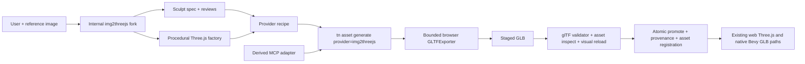

# Internal img2threejs GLB Authoring Provider

Status: Completed

Complexity: 9 -> HIGH mode

## Complexity Assessment

- +3 touches more than 10 authoring, CLI, MCP, exporter, proof, and documentation files
- +2 adds a new local asset-generation provider and browser export runner
- +2 requires bounded execution, asynchronous texture readiness, staged output,
  and atomic promotion
- +2 spans authoring contracts, CLI, MCP, internal skill distribution, and proof

Every implementation phase requires an automated checkpoint review. Phases
that change the upstream fork, browser exporter, visual fidelity, or real GLB
proof also require the manual checks listed below.

## Context

**Problem:** ThreeNative can generate bounded GLBs with Blender, but it cannot
use img2threejs as a second, image-guided procedural authoring engine or turn an
accepted img2threejs `THREE.Group` factory into a normal inspected and
registered GLB.

**Files Analyzed:**

- `AGENTS.md`
- `packages/authoring/src/schemas.ts`
- `packages/authoring/src/generatorProvenance.ts`
- `packages/authoring/src/operationRegistry.ts`
- `packages/authoring/src/operations/documents.ts`
- `packages/cli/src/commands/asset.ts`
- `packages/cli/src/commands/sourceGeneratorCommand.ts`
- `packages/cli/src/blender/runBlenderGenerator.ts`
- `packages/cli/src/modelProviders/registry.ts`
- `packages/cli/src/externalTools/registry.ts`
- `packages/mcp-server/src/index.ts`
- `docs/PRDs/other/optional-headless-blender-asset-generation.md`
- `docs/status/capabilities/assets.md`
- `docs/status/SYSTEMS_CODE_QUALITY_STATUS.md`
- img2threejs upstream `SKILL.md`, `README.md`, `ROADMAP.md`, `LICENSE`,
  `forge/stage3_build/generate_threejs_factory.py`, and pipeline tests at
  commit `e8ff28a6ae0cb534c7b2ebc15cb3f06709262d5b`

**Upstream Sources:**

- Repository: <https://github.com/hoainho/img2threejs>
- Inspected commit: <https://github.com/hoainho/img2threejs/commit/e8ff28a6ae0cb534c7b2ebc15cb3f06709262d5b>
- License: <https://github.com/hoainho/img2threejs/blob/e8ff28a6ae0cb534c7b2ebc15cb3f06709262d5b/LICENSE>
- Roadmap: <https://github.com/hoainho/img2threejs/blob/e8ff28a6ae0cb534c7b2ebc15cb3f06709262d5b/ROADMAP.md>
- Three.js `GLTFExporter`: <https://threejs.org/docs/#examples/en/exporters/GLTFExporter>

**Current Behavior:**

- `tn asset generate <id> --provider blender` is the only local procedural GLB
  generation command. Its descriptor, dispatch, provenance, and runner are
  Blender-specific.
- Successful Blender generation stages, inspects, budget-checks, promotes, and
  registers a normal project-local GLB. Existing runtime paths do not need to
  know which authoring provider created it.
- The authoring generator provenance union recognizes only `typescript` and
  `blender` providers.
- The MCP server is a thin adapter over CLI/authoring descriptors. It must not
  become the owner of a second img2threejs execution path.
- Upstream img2threejs is an MIT-licensed agent skill, not an npm package. The
  inspected repository has no `package.json` and publishes no package API. It
  combines Python 3.10 standard-library scripts, prompt/rubric documents,
  structured sculpt specs, and generated TypeScript factories.
- Upstream produces an animation-oriented `THREE.Group` factory and review
  evidence, not a GLB. Its roadmap defers glTF export to v1.4 alongside true
  character rigs; the current requirement needs a bounded object GLB path
  sooner without claiming rig or morph-target support.
- Generated factories can use DOM canvas textures and store live `Object3D`
  references in `root.userData.sculptRuntime`. A naive Node export or direct
  `userData` serialization is therefore neither sufficient nor safe.

## Product Decision

Adopt img2threejs through a **minimal internal fork plus a CLI-first
ThreeNative provider**.

The durable public integration is:

```bash
tn asset generate prop.radio \
  --provider img2threejs \
  --recipe content/generators/prop.radio.img2threejs.json \
  --project . \
  --json
```

The internal fork owns the image analysis, sculpt specification, staged visual
review loop, and generated Three.js factory. ThreeNative owns the provider
recipe, factory compatibility checks, GLB export, output budgets, atomic
promotion, asset registration, provenance, and web/native proof.

Agents receive a descriptor-derived MCP adapter named
`asset.generate_img2threejs`. This MCP tool accepts the same asset ID, recipe
path, output path, overwrite policy, and project root as the CLI command. It
does not accept inline TypeScript, run a second exporter, or own pipeline
state. No separate internal MCP server is introduced.

The agent-facing entry point remains the internal `img2threejs` skill. The
skill prepares and visually approves the durable source artifacts, then calls
the CLI command to finalize them. The CLI does not pretend that a deterministic
command can replace the skill's vision-guided judgment.

### Why Fork Instead Of Package Consumption

| Option | Decision | Reason |
| --- | --- | --- |
| Depend on an upstream npm/Python package | Reject for v1 | No package or stable library API exists at the inspected commit. |
| Copy selected scripts into CLI code | Reject | The scripts, rubrics, schemas, and pass rules evolve together; selective copying creates an untracked second implementation. |
| Embed the complete skill in the published CLI | Reject for v1 | Agent-host installation and CLI distribution have different lifecycles, and the CLI should not own prompt/rubric behavior. |
| Maintain a minimal internal fork | Accept | It preserves upstream history and license, permits internal integration instructions, and supports pinned, reviewed upgrades. |
| Put GLB export in the internal fork | Reject as the sole owner | ThreeNative already owns GLB inspection, budgets, registration, provenance, and runtime acceptance. |
| Add a ThreeNative CLI provider and derived MCP adapter | Accept | Humans, CI, editor adapters, and agents share one tested execution boundary. |

Package extraction may be reconsidered only after either upstream publishes a
versioned library/schema API or ThreeNative completes two clean upstream syncs
and three production assets without fork-local pipeline patches. Even then,
the CLI provider contract remains stable and hides the packaging choice.

## Goals

- Let an internal agent turn one project-local reference image into a reviewed
  procedural Three.js model and then a reusable GLB without opening Blender.
- Preserve the img2threejs value proposition: diffable sculpt spec, diffable
  TypeScript factory, staged visual review, named hierarchy, sockets, and
  collider/destruction metadata.
- Reuse `tn asset generate`, generator provenance, GLB inspection, output
  conflict policy, asset registration, model-test, build, and runtime paths.
- Keep the CLI/core operation as the single execution boundary and derive MCP
  help, schema, argv, and dispatch from one provider descriptor.
- Export self-contained binary glTF 2.0 with embedded supported textures and
  no implicit runtime dependency on img2threejs, Python, Playwright, or Three.js
  authoring source.
- Fail unsupported factory features before promotion with stable, actionable
  diagnostics.
- Preserve input, upstream, review, factory, exporter, and output provenance
  without embedding the reference image or sensitive local paths in the GLB.
- Prove that the exported-and-reloaded GLB remains visually equivalent to the
  accepted procedural model under the same neutral camera and lighting.

## Non-Goals

- No one-shot `--image` CLI command that claims to replace agent vision and the
  upstream pass/review loop.
- No separate img2threejs MCP server, MCP-owned state, or MCP-only behavior.
- No arbitrary inline TypeScript or remote factory URL accepted by CLI/MCP.
- No raw upstream Python execution from the ThreeNative CLI in v1. The internal
  skill invokes its own pinned scripts before finalization.
- No automatic network access during GLB finalization. Images, factories, and
  textures must already be project-local.
- No character `SkinnedMesh`, skeleton, morph-target, facial-rig, or animation
  export claim in v1. These follow upstream's true-rig work and require a
  separate parity PRD.
- No support claim for `ShaderMaterial`, `RawShaderMaterial`, video textures,
  render targets, postprocessing, procedural runtime deformation, or
  displacement maps that have not been baked into exportable geometry.
- No implicit conversion of review cameras, studio lights, helpers, or editor
  gizmos into game asset nodes.
- No edit of generated GLB bytes to make inspection pass. Fix the factory,
  compatibility adapter, exporter, or recipe owner.
- No promise that a single reference image reveals occluded geometry or grants
  rights to reproduce the depicted subject.

## Integration Points

### How Will This Feature Be Reached?

- [x] Entry point identified: `tn asset generate <asset-id> --provider
  img2threejs --recipe <project-path> --json`
- [x] Caller identified: the internal img2threejs skill calls the CLI after its
  final required pass has an accepted review; humans and CI may call the same
  command directly for an already reviewed workspace.
- [x] Registration/wiring identified: one asset-generation provider descriptor
  supplies CLI usage, validation, dispatch metadata, MCP schema/argv, and
  strategy guidance.
- [x] MCP identified: `asset.generate_img2threejs`, derived from the provider
  descriptor and routed through the existing MCP CLI executor.
- [x] Result identified: `assets/generated/<asset-id>.glb`, normal structured
  asset registration, generator provenance, inspection JSON, and proof command
  suggestions.

### Is This User-Facing?

- [x] YES. It is an authoring command and agent workflow, but no new editor UI
  is required for v1.
- [x] The existing editor can consume the resulting registered GLB exactly as
  it consumes Blender, imported, or downloaded GLBs.
- [x] Editor buttons for initiating image sculpting are deferred until the
  CLI/skill path has production evidence.

### Full User Flow

1. User adds a rights-cleared reference image under `content/references/**` and
   asks the internal img2threejs skill to rebuild it.
2. The skill runs its pinned suitability, assessment, detail inventory, sculpt
   spec, locked build passes, render capture, and review loop.
3. The skill writes or updates a project-local provider recipe pointing to the
   accepted sculpt spec and generated model factory.
4. The skill invokes `tn asset generate ... --provider img2threejs --json`.
5. ThreeNative validates paths, hashes, accepted reviews, factory exports,
   supported Three.js features, budgets, and overwrite policy.
6. A bounded browser exporter instantiates only the declared factory, waits for
   allowed local textures, sanitizes runtime metadata, and emits a staged GLB.
7. ThreeNative runs structural validation and existing inspection, then
   atomically promotes and registers the GLB with provenance.
8. The JSON response returns counts, bounds, hashes, files written, diagnostics,
   and exact `tn model-test`, authoring validation, web build, and desktop proof
   commands.
9. User sees the registered GLB in existing asset/editor/runtime flows; no
   img2threejs code runs in the shipped game.

## Durable Ownership And Source Layout

The following files are durable source:

```text
content/references/prop.radio.png
content/generators/prop.radio.sculpt-spec.json
content/generators/prop.radio.img2threejs.json
src/generators/createPropRadioModel.ts
```

The following are generated or evidence outputs:

```text
assets/generated/prop.radio.glb
content/generators/prop.radio.generator.json
content/assets/prop.radio.assets.json
artifacts/img2threejs/prop.radio/**
```

The sculpt spec remains the owner of components, materials, build-pass order,
review history, and review evidence. The provider recipe references that spec;
it must not duplicate accepted pass IDs or scores by hand.

The TypeScript factory remains the owner of final procedural geometry and
materials. The GLB is generated delivery output. Manual GLB edits create a
generator ownership conflict and must fail under the existing overwrite
policy rather than being silently replaced.

## Provider Recipe Contract

The initial recipe is a structured JSON document:

```json
{
  "schema": "threenative.img2threejs-generator",
  "version": "0.1.0",
  "id": "prop.radio",
  "sourceImage": "content/references/prop.radio.png",
  "sculptSpec": "content/generators/prop.radio.sculpt-spec.json",
  "validationReport": "content/generators/prop.radio.validation.json",
  "factory": {
    "module": "src/generators/createPropRadioModel.ts",
    "export": "createPropRadioModel"
  },
  "upstream": {
    "repository": "https://github.com/hoainho/img2threejs",
    "commit": "e8ff28a6ae0cb534c7b2ebc15cb3f06709262d5b",
    "skillVersion": "1.2.0"
  },
  "export": {
    "rootNode": "prop.radio",
    "embedTextures": true,
    "includeRuntimeExtras": true
  },
  "budgets": {
    "maxOutputBytes": 33554432,
    "maxTriangles": 250000,
    "maxMaterials": 64,
    "maxTextures": 64,
    "timeoutMs": 120000
  }
}
```

Rules:

- `sourceImage`, `sculptSpec`, and `factory.module` are project-relative,
  symlink-resolved, and constrained to `content/**` or `src/generators/**` as
  appropriate.
- `validationReport` is a project-local ThreeNative envelope around the exact
  JSON output of `validate_sculpt_spec.py --strict-quality --json`. It records
  the reviewed validator identity and sculpt-spec SHA-256; stale, failed, or
  structurally invalid reports fail recording.
- MCP accepts a recipe path only. Inline recipe objects are intentionally
  excluded because review history and factory source must be durable and
  inspectable before execution.
- `factory.export` must be a named function returning `THREE.Group` or a
  promise of `THREE.Group`. It receives only bounded export options; it does
  not receive filesystem, process, network, or runtime adapter handles.
- The referenced sculpt spec must pass the fork's strict validator and show a
  contiguous `continue` decision for every required pass. Missing screenshots,
  comparison images, global thresholds, or critical feature thresholds fail
  finalization.
- Upstream repository, commit, and skill version are required provenance. The
  supported internal fork manifest decides which commits are allowed.
- Budget values may lower provider defaults but may not raise hard limits.
- Unknown fields fail validation. Schema and version values are preserved.

## Internal Fork And Sync Policy

1. Create the internal fork from inspected commit
   `e8ff28a6ae0cb534c7b2ebc15cb3f06709262d5b` and preserve the MIT `LICENSE`
   and copyright notice.
2. Keep an unmodified `upstream/main` tracking branch and a minimal internal
   integration branch. Do not squash away upstream history.
3. Limit fork-local changes to ThreeNative integration instructions, recipe
   emission, stable machine-readable diagnostics, and tests. The GLB exporter
   stays in ThreeNative.
4. Record the internal fork URL, upstream base SHA, reviewed tree hash, skill
   version, license, sync date, and local patch list in
   `docs/vendor/img2threejs.md` and the provider registry.
5. Sync only from an explicit upstream tag or reviewed commit. Run upstream
   tests, recipe compatibility fixtures, visual golden proof, and the complete
   ThreeNative provider gate before advancing the supported SHA.
6. Fail provider finalization when a recipe names an unreviewed commit. The
   diagnostic must name the supported commit and the internal upgrade process.
7. Prefer upstream contributions for generic fixes. Do not make internal
   delivery depend on upstream accepting the ThreeNative-specific adapter.
8. Treat input-image and generated-model rights separately from the MIT code
   license; record user-supplied source/license/attribution metadata when the
   asset is registered.

## GLB Export Compatibility Contract

### Supported In V1

- `THREE.Group`, `Object3D`, and `Mesh` hierarchies with finite transforms
- `BufferGeometry` produced by standard or custom procedural geometry
- indexed and non-indexed triangles with positions, normals, UVs, vertex
  colors, and tangents when valid
- `MeshBasicMaterial`, `MeshStandardMaterial`, and the glTF-compatible subset
  of `MeshPhysicalMaterial`
- project-local PNG, JPEG, or WebP image textures and generated canvas textures
  that can be embedded in the GLB
- stable unique node, mesh, material, and socket names
- optional `InstancedMesh` only after an exporter fixture proves the emitted
  extension loads in both ThreeNative runtimes; otherwise it fails closed
- JSON-safe collider, destruction-group, socket, and source identifiers stored
  as glTF `extras`

### Rejected In V1

- live `Object3D`, material, texture, function, DOM, or cyclic references in
  serialized `userData`
- `ShaderMaterial`, `RawShaderMaterial`, node materials without a proved glTF
  mapping, video/cube/depth/data textures without an explicit contract, and
  render targets
- unbaked displacement, runtime modifiers, geometry changed after export, and
  custom WebGL renderer hooks
- `SkinnedMesh`, skeletons, morph targets, and animation clips
- lights, cameras, controls, helpers, postprocessing, and review-only studio
  objects inside the returned asset root
- HTTP(S), data fetched during execution, absolute filesystem paths, and
  textures outside the project root
- non-finite transforms, zero-scale roots, duplicate required node names,
  malformed attributes, output over budget, or unsupported glTF extensions

### Export Process

1. Parse and validate the provider recipe and sculpt spec with structured
   readers.
2. Resolve and hash all durable inputs before execution.
3. Compile the named project-local factory through the existing TypeScript
   toolchain into a temporary authoring workspace.
4. Launch a dedicated headless Chromium page because current factories can use
   `document`, canvas, `TextureLoader`, and Three.js browser APIs.
5. Intercept all network requests. Permit only the generated local page,
   packaged Three.js modules, and declared project-local texture URLs.
6. Invoke the named factory once with deterministic export options and a fixed
   Three.js revision. Enforce timeout, browser termination, and log-size caps.
7. Await all declared local texture loads; a missing, tainted, or failed
   texture is an error rather than a silent material downgrade.
8. Update world matrices, validate the object graph, clone the export root,
   and strip review-only objects.
9. Convert `root.userData.sculptRuntime` live references into JSON-safe node
   names and typed extras. Fail when a required runtime reference cannot be
   resolved uniquely.
10. Run `GLTFExporter` with binary and embedded-image output. Capture the Blob
    as a bounded Playwright download into a unique staging directory; do not
    move multi-megabyte GLB data through JSON/base64 command output.
11. Run Khronos glTF validation plus existing `tn asset inspect` semantics.
12. Enforce byte, triangle, material, texture, node, and extension budgets.
13. Re-import the staged GLB into the proof page and compare it with the source
    factory under identical neutral camera, exposure, tone mapping, and lights.
14. Atomically promote the GLB, write generator provenance, and register the
    normal model asset. On any failure, preserve the prior accepted output.

## Provenance Contract

`threenative.generator-provenance` gains an `img2threejs` variant with:

- generator ID and output path
- provider ID `img2threejs`
- upstream repository, supported commit, skill version, and internal fork tree
  hash
- recipe, sculpt spec, factory module, and named export paths
- SHA-256 hashes for source image, sculpt spec, recipe, factory source, and
  output GLB
- Three.js and exporter versions
- accepted pass IDs and hashes derived from the sculpt spec, not copied from
  recipe input
- export budgets and observed counts/bounds/extensions
- started/completed timestamps, duration, overwrite policy, and proof paths

The GLB `extras` may include provider ID, non-sensitive source IDs, upstream
commit, and named runtime metadata. It must not include the source image bytes,
absolute paths, agent prompts, user identity, local skill paths, or review
screenshots.

## Diagnostics

At minimum, implement these stable codes with `file`, `path`, `message`, and an
actionable `fix` or suggestion:

| Code | Trigger | Required guidance |
| --- | --- | --- |
| `TN_IMG2THREEJS_RECIPE_INVALID` | malformed schema, unknown field, or bad path | regenerate or fix the named recipe field |
| `TN_IMG2THREEJS_UPSTREAM_UNREVIEWED` | recipe commit is not in the supported manifest | use the supported internal skill or perform the upgrade gate |
| `TN_IMG2THREEJS_SPEC_INVALID` | strict upstream spec validation fails | run the exact fork validator command |
| `TN_IMG2THREEJS_REVIEW_INCOMPLETE` | required pass or evidence is absent/not accepted | resume the named pass in the skill |
| `TN_IMG2THREEJS_FACTORY_EXPORT_INVALID` | module/export missing or return value is not a Group | export the required named factory signature |
| `TN_IMG2THREEJS_RESOURCE_OUTSIDE_PROJECT` | source, factory, or texture escapes allowed roots | move it under the prescribed project path |
| `TN_IMG2THREEJS_NETWORK_BLOCKED` | finalizer attempts HTTP(S) or another undeclared request | make the resource project-local and declare it |
| `TN_IMG2THREEJS_TEXTURE_LOAD_FAILED` | declared texture cannot be loaded/embedded | identify the failed texture and supported formats |
| `TN_IMG2THREEJS_FEATURE_UNSUPPORTED` | rejected Three.js object/material/texture feature | name the object path and supported replacement or required bake |
| `TN_IMG2THREEJS_RUNTIME_METADATA_INVALID` | cyclic or unresolved runtime references | name the metadata path and required stable node/socket ID |
| `TN_IMG2THREEJS_EXPORT_TIMEOUT` | factory/texture/export exceeds deadline | simplify the factory or lower texture/geometry work |
| `TN_IMG2THREEJS_GLTF_INVALID` | Khronos or ThreeNative structural validation fails | surface validator messages without editing generated bytes |
| `TN_IMG2THREEJS_OUTPUT_BUDGET_EXCEEDED` | hard or requested limit exceeded | report observed and allowed values |
| `TN_IMG2THREEJS_VISUAL_PARITY_FAILED` | exported GLB differs from accepted factory | report silhouette/color metrics and proof artifact paths |

## Architecture



## Sequence Flow

```mermaid
sequenceDiagram
    participant U as User/agent
    participant S as img2threejs skill
    participant C as ThreeNative CLI
    participant B as Bounded browser exporter
    participant V as Validators/proof
    participant A as Authoring source

    U->>S: reference image + intended use
    S->>S: assess, spec, build, render, review
    S->>C: asset generate --provider img2threejs --recipe ...
    C->>C: validate recipe/spec/reviews/paths/hashes
    alt invalid or incomplete
        C-->>S: stable diagnostic + exact fix
    else ready
        C->>B: compiled named factory + local assets
        B->>B: instantiate, sanitize, export binary glTF
        B-->>C: staged GLB path
        C->>V: glTF validate, inspect, reload, compare
        alt validation, budget, or parity failure
            V-->>C: structured failure + retained evidence
            C-->>S: no promotion; prior GLB preserved
        else pass
            V-->>C: counts, bounds, hashes, visual metrics
            C->>A: atomic GLB/provenance/asset registration
            C-->>U: success JSON + next proof commands
        end
    end
```

## Execution Phases

Implementation must stop at each checkpoint. Continue only after the automated
PRD review reports `PASS`; the manual checks below are additional where listed.

### Phase 1: Provider Ownership And Fork Manifest

**User-visible outcome:** CLI help recognizes `img2threejs` as a local
asset-generation provider and reports its supported fork/version without
claiming generation is already available.

**Files (max 6):**

The original five-file estimate omitted `packages/cli/src/index.ts`, which is
the actual owner of `CLI_COMMAND_REGISTRY` and therefore the only surface from
which the existing MCP server discovers command adapters. This amendment adds
that owner rather than moving registry construction or creating a second
enrollment list.

- `packages/cli/src/assetGenerationProviders/registry.ts` (new) - descriptor
  owner for Blender and img2threejs help, capability, provenance, and MCP data
- `packages/cli/src/assetGenerationProviders/registry.test.ts` (new) - registry
  completeness, uniqueness, and supported upstream manifest tests
- `packages/cli/src/commands/asset.ts` - derive generate usage/provider lookup
  from the registry and return explicit not-yet-runnable diagnostics
- `packages/cli/src/commands/asset.test.ts` - CLI help and unknown/unavailable
  provider tests
- `docs/vendor/img2threejs.md` (new) - internal fork URL, MIT notice, pinned
  base/tree hashes, patch list, and sync procedure

**Implementation:**

- [x] Create the internal fork without changing ThreeNative source behavior.
- [x] Record upstream base SHA, internal fork tree hash, skill version, license,
  and source URL in the descriptor-owned manifest.
- [x] Replace the Blender-only generation descriptor owner with a provider
  registry; preserve existing Blender argv/help/MCP behavior byte-for-byte.
- [x] Add an unavailable-until-wired `img2threejs` descriptor so incomplete
  work cannot be presented as supported.
- [x] Add a drift test proving help and provider IDs derive from the registry.

**Tests Required:**

| Test File | Test Name | Assertion |
| --- | --- | --- |
| `assetGenerationProviders/registry.test.ts` | `should retain one complete descriptor for each local generation provider` | IDs, versions, licenses, usage, and MCP metadata are complete and unique |
| same | `should reject an unreviewed img2threejs commit` | unsupported SHA cannot be selected |
| `commands/asset.test.ts` | `should derive asset generate help from the provider registry` | Blender and img2threejs usage appear once in registry order |
| same | `should preserve Blender generation behavior after registry extraction` | existing Blender command and MCP descriptor snapshots do not drift |

**Verification Plan:**

1. Run focused CLI registry and asset command tests.
2. Run existing Blender CLI/MCP tests as a regression control.
3. Run `pnpm check:docs` for vendor record/link validity.

**User Verification:**

- Action: run `tn asset generate --help` and inspect the img2threejs provider
  status JSON.
- Expected: discoverable syntax and pinned fork metadata, with an honest
  unavailable diagnostic until Phase 3.

**Checkpoint:** automated PRD phase review; manual confirmation that the
internal fork exists, preserves MIT license/history, and matches the recorded
tree hash.

#### Phase 1 Result - 2026-07-21 America/Vancouver

- Files changed: `packages/cli/src/assetGenerationProviders/registry.ts`,
  `packages/cli/src/assetGenerationProviders/registry.test.ts`,
  `packages/cli/src/commands/asset.ts`,
  `packages/cli/src/commands/asset.test.ts`, and
  `docs/vendor/img2threejs.md`.
- Focused verification: CLI typecheck/build and registry/asset tests PASS
  (45/45).
- Broader regression: MCP server tests PASS (40/40), including the existing
  Blender descriptor, argv, execution, traversal, symlink, and forbidden-code
  cases.
- Documentation gate: `pnpm check:docs` reaches the naming inventory but FAILS
  on four pre-existing unclassified version labels under
  `tools/agent-benchmark`; no Phase 1 documentation diagnostic was reported.
- Automated PRD review: PASS after restoring the exact three-field Blender
  compatibility descriptor and adding its required snapshot regression.
- Manual verification: the private internal mirror has `upstream/main` and
  `threenative/integration` at
  `e8ff28a6ae0cb534c7b2ebc15cb3f06709262d5b`; tree
  `75f7d805630d4819a8957643d3969232187d339c` and MIT `LICENSE` blob
  `97f66605397b3c505f6867cfb47dbcf537de06f6` match the vendor record. The
  `tn asset generate --help --json` result exposes the pinned provider as
  unavailable until exporter wiring is complete.

### Phase 2: Structured Recipe And Generator Provenance

**User-visible outcome:** a completed img2threejs workspace can be validated
and recorded as durable generator source without running the exporter.

**Files (max 7):**

The Phase 2 checkpoint expanded the original five-file bound by two files.
`operations/sharedA.ts` owns durable fresh-process generator-provenance
validation, while the CLI provider registry must derive the reviewed manifest
from the descriptor-owned neutral authoring contract instead of retaining a
second hand-maintained commit list.

- `packages/authoring/src/schemas.ts` - add the img2threejs recipe/provenance
  types and provider union
- `packages/authoring/src/generatorProvenance.ts` - validate ownership and
  source/output conflicts for the new provider
- `packages/authoring/src/operations/documents.ts` - record the provider recipe
  reference and provenance document
- `packages/authoring/src/operationRegistry.ts` - add one descriptor-owned
  `generator.record_img2threejs` operation
- `packages/authoring/src/operationRegistry.test.ts` - positive, negative,
  traversal, review, commit, and conflict cases
- `packages/authoring/src/operations/sharedA.ts` - validate durable
  img2threejs provenance on every project reload
- `packages/cli/src/assetGenerationProviders/registry.ts` - derive the CLI
  provider manifest from the authoring operation descriptor

**Implementation:**

- [x] Implement strict structured parsing for the recipe and referenced sculpt
  spec; do not use regex or ad hoc JSON edits.
- [x] Validate project-contained source image, spec, recipe, factory, and output
  paths after symlink resolution.
- [x] Derive accepted passes from sculpt-spec review history and enforce a
  contiguous completed sequence.
- [x] Record upstream identity and all source hashes without duplicating review
  values in the recipe.
- [x] Extend generator conflict/ownership checks to `img2threejs` outputs.

**Tests Required:**

| Test File | Test Name | Assertion |
| --- | --- | --- |
| `operationRegistry.test.ts` | `should record a reviewed img2threejs generator workspace` | structured provenance contains paths, hashes, provider, and accepted passes |
| same | `should reject img2threejs review gaps before recording` | first incomplete pass returns `TN_IMG2THREEJS_REVIEW_INCOMPLETE` |
| same | `should reject unreviewed upstream commits` | only registry-supported SHA is accepted |
| same | `should reject source factory texture and output traversal` | no path or symlink escapes allowed roots |
| same | `should preserve manual generated output under manual overwrite policy` | conflict fails without writing source or output |

**Verification Plan:**

1. Run authoring operation registry tests.
2. Run generator provenance and atomic batch regression tests.
3. Inspect a successful recorded document and each stable negative diagnostic.

**User Verification:**

- Action: dispatch `generator.record_img2threejs` against one accepted fixture
  and one missing-review fixture.
- Expected: accepted source is recorded; incomplete source fails with the exact
  pass and next action.

**Checkpoint:** automated PRD phase review.

#### Phase 2 Verification Evidence

- Files changed: the seven files declared above. The scope expansion is owned
  by durable reload validation and descriptor-derived provider manifest data.
- Focused verification: authoring typecheck/build and img2threejs registry
  tests PASS, including strict report, review gap, upstream commit, traversal,
  cross-root/output symlink, fresh-reload provenance, and manual conflict cases.
- Broader regression: the complete authoring suite PASS (130/130); CLI
  typecheck/build and provider-registry tests PASS (3/3); `git diff --check`
  PASS.
- Exact upstream proof: the positive fixture was captured and
  `python3 forge/stage2_spec/validate_sculpt_spec.py <fixture> --strict-quality
  --json` at reviewed commit
  `e8ff28a6ae0cb534c7b2ebc15cb3f06709262d5b` returned exit 0, `ok: true`, and
  an empty errors array.
- Documentation gate: `pnpm check:docs` reaches the naming inventory and still
  reports only the four pre-existing unclassified `v1`/`v8` labels under
  `tools/agent-benchmark`; the Phase 2-added `V1` diagnostic wording was
  corrected and no new documentation diagnostic remains.
- Automated PRD review: PASS after strict validator attestation, durable
  provider-specific provenance validation, prescribed-root symlink checks,
  safe persisted resource paths, and the explicit seven-file amendment.
- Manual verification: accepted fixture dispatch records hashed provenance;
  the missing-review fixture fails with `TN_IMG2THREEJS_REVIEW_INCOMPLETE` and
  identifies `structural-pass` plus its resume action.

### Phase 3: Reachable Binary GLB Export

**User-visible outcome:** the CLI turns one accepted, texture-free procedural
object fixture into a validated, registered GLB.

**Files (max 13):**

Phase 3's original five-file estimate omitted the provider registry that owns
reachability, the two existing tests that assert the provider is unavailable,
and the CLI package/lockfile entries required to distribute Three.js and the
Khronos validator directly. The capability index/detail and systems-quality
ledger are also required by the repository policy when making the provider
reachable and adding a new isolated exporter subsystem. These eight
owner/dependency/status files are included here instead of adding command-local
availability exceptions or relying on
monorepo-only transitive dependencies.

- `packages/cli/src/img2threejs/runImg2ThreejsGenerator.ts` (new) - bounded
  staging, browser lifecycle, validation, promotion, and provenance service
- `packages/cli/src/img2threejs/exporterPage.ts` (new) - browser-side Group
  validation, metadata sanitization, and `GLTFExporter` invocation
- `packages/cli/src/img2threejs/runImg2ThreejsGenerator.test.ts` (new) - runner
  happy path and process/path/timeout/budget failures
- `packages/cli/src/img2threejs/fixtures/createFixtureRadioModel.ts` (new) -
  deterministic named hierarchy/material/socket fixture
- `packages/cli/src/commands/asset.ts` - dispatch provider to the new runner and
  expose the complete command result
- `packages/cli/src/assetGenerationProviders/registry.ts` - mark the bounded
  CLI provider reachable at its owning registry
- `packages/cli/src/assetGenerationProviders/registry.test.ts` - update the
  registry-owned availability assertion
- `packages/cli/src/commands/asset.test.ts` - replace the obsolete unavailable
  command assertion with reachable-dispatch coverage
- `packages/cli/package.json` - own direct Three.js, types, and Khronos
  validator dependencies for the published CLI
- `pnpm-lock.yaml` - mechanically record the direct dependency ownership
- `docs/status/capabilities/assets.md` - record the bounded reachable-provider
  claim and its current proof boundary
- `docs/STATUS.md` - update the one-line asset capability index claim
- `docs/status/SYSTEMS_CODE_QUALITY_STATUS.md` - record the new isolated
  browser exporter subsystem and its follow-up risk boundary

**Implementation:**

- [x] Compile only the recipe-declared module/export and instantiate it in one
  isolated browser page.
- [x] Block all network requests and cap time, output bytes, browser logs, and
  object counts.
- [x] Require a finite named `THREE.Group`; reject review lights/cameras/helpers
  and v1-unsupported features.
- [x] Sanitize live runtime references into JSON-safe named extras.
- [x] Export a binary GLB to staging, run glTF validation and asset inspection,
  then atomically promote/register it through existing owners.
- [x] Preserve the previous accepted GLB and provenance on every failure.

**Tests Required:**

| Test File | Test Name | Assertion |
| --- | --- | --- |
| `runImg2ThreejsGenerator.test.ts` | `should export inspect promote and register a reviewed procedural Group` | output is GLB, passes validator/inspection, and registration/provenance agree |
| same | `should preserve the previous output when browser export fails` | prior bytes/hash/source remain unchanged |
| same | `should reject a factory returning a Scene Mesh or non-object value` | stable factory diagnostic identifies export |
| same | `should block network texture and fetch requests` | no request leaves local allowlist and no output is promoted |
| same | `should terminate timed out or oversized generation` | browser is cleaned up and exact observed limit is reported |

**Verification Plan:**

1. Run the img2threejs runner test suite and asset command happy path.
2. Run Khronos validator and `tn asset inspect` on the emitted fixture.
3. Run twice and confirm deterministic semantic counts/bounds; byte identity is
   required only when Three.js/exporter version and all inputs are unchanged.
4. Confirm staging cleanup and prior-output preservation under injected faults.

**User Verification:**

- Action: run the proposed `tn asset generate ... --provider img2threejs`
  command against the fixture recipe.
- Expected: `TN_ASSET_GENERATE_OK`, a normal registered GLB, input/output hashes,
  and exact next proof commands.

**Checkpoint:** automated review plus manual inspection of runner containment,
process cleanup, validator output, and the first generated GLB.

#### Phase 3 Result - 2026-07-22 America/Vancouver

- Files changed: the thirteen amended Phase 3 files above. The original
  five-file estimate was corrected before implementation so provider
  reachability, published CLI dependencies, existing assertions, capability
  claims, and the new subsystem quality ledger remain owned and synchronized.
- Real-browser proof: the reviewed radio fixture exports a deterministic binary
  GLB through isolated Chromium, passes Khronos validation and ThreeNative
  inspection, retains named nodes/materials/runtime socket metadata, registers
  as `generator:prop.radio`, and produces byte-identical GLB output on rerun
  with unchanged inputs and tool versions.
- Containment/failure proof: HTTP/fetch, WebSocket/TCP, and WebRTC/STUN/UDP
  probes make zero external connections or datagrams and promote no output;
  browser timeout, output budget, invalid factory returns, and thrown factory
  paths preserve prior GLB, provenance, and asset registration bytes.
- Focused verification: CLI typecheck/build and runner/registry/asset suites
  PASS. The full CLI suite reaches 681/683; its two failures are unrelated
  pre-existing regressions (including starter-template expectation drift),
  while all Phase 3 tests pass in the same run.
- Documentation gate: `pnpm check:docs` still reports only the four
  pre-existing unclassified `v1`/`v8` labels under `tools/agent-benchmark`; no
  Phase 3 documentation diagnostic was added.
- Automated PRD review: PASS after browser networking globals were locked
  before factory evaluation, HTTP/WebSocket routing and DNS/QUIC launch guards
  remained as defense in depth, live TCP/UDP regressions proved zero egress,
  and stable diagnostic codes were aligned to the PRD contract.

### Phase 4: Materials, Embedded Textures, And Runtime Extras

**User-visible outcome:** a representative textured hard-surface factory
exports with its accepted look, named sockets, and JSON-safe runtime metadata.

**Files (max 10):**

The original five-file estimate omitted the durable visual-metric owner, the
representative textured fixture, and the required capability/quality ledgers.
This amendment freezes those owners before implementation and keeps the matrix
and proof thresholds out of the browser-runner string.

- `packages/cli/src/img2threejs/compatibility.ts` (new) - explicit supported
  Three.js/glTF feature matrix and diagnostic mapping
- `packages/cli/src/img2threejs/compatibility.test.ts` (new) - material,
  texture, geometry, extras, and rejected-feature fixtures
- `packages/cli/src/img2threejs/visualParity.ts` (new) - deterministic image
  metrics, thresholds, diff construction, and proof artifact serialization
- `packages/cli/src/img2threejs/exporterPage.ts` - local texture readiness,
  canvas embedding, color space, extras, and graph checks
- `packages/cli/src/img2threejs/runImg2ThreejsGenerator.ts` - declared resource
  hashing, observed budgets, and visual reload proof
- `packages/cli/src/img2threejs/runImg2ThreejsGenerator.test.ts` - end-to-end
  textured export, reload, parity, and rollback tests
- `packages/cli/src/img2threejs/fixtures/createFixtureRadioModel.ts` - promote
  the representative radio to the typed runtime-extras and textured matrix
- `docs/status/capabilities/assets.md` - record the bounded textured claim
- `docs/STATUS.md` - update the one-line asset capability index
- `docs/status/SYSTEMS_CODE_QUALITY_STATUS.md` - update the isolated exporter
  subsystem proof and remaining browser/texture risk boundary

**Frozen v1 compatibility contract:**

- Objects are `Group`, `Object3D`, and triangle `Mesh` only. Geometry requires
  finite `POSITION` item-size 3 and permits finite, count-matched `NORMAL` 3,
  `TANGENT` 4, `uv` through `uv3` item-size 2, and vertex `color` item-size 3
  or 4. Indices and groups must be integral, in range, and material-resolvable.
  Morphs, skinning, animation, instancing, lines, points, sprites, LODs,
  cameras, lights, helpers, and custom attributes fail closed.
- Materials are `MeshBasicMaterial` and `MeshStandardMaterial`. V1 preserves
  base color, opacity/alpha test/transparent mode, metalness, roughness,
  emissive and emissive intensity, double-sided state, and vertex colors.
  `MeshPhysicalMaterial`, shader/raw-shader materials, custom program hooks,
  displacement, bump, alpha/light/environment maps, wireframe, and non-normal
  blend/depth/stencil modes are unsupported until separately promoted.
- Texture slots are `map`, `metalnessMap`, `roughnessMap`, `emissiveMap`,
  `normalMap`, and `aoMap`. Inputs may be project-local PNG/JPEG/WebP images
  declared in `sourceHashes.resources` or an untainted non-empty canvas.
  `map` and `emissiveMap` require sRGB; data/normal/AO slots require no color
  space. UV channels 0 through 3 and offset/repeat/rotation are supported;
  non-default center/manual matrices fail closed. Separate metalness and
  roughness maps must share source and transform because GLTFExporter packs
  them. Output images require `bufferView` plus MIME and no URI; buffers may
  not have a URI. Allowed extensions are `KHR_materials_unlit`,
  `KHR_texture_transform`, and `KHR_materials_emissive_strength`.
- Each declared resource is snapshotted once after project-realpath
  containment, limited to 16 MiB encoded and 4096 by 4096 decoded pixels, and
  magic-sniffed before Chromium starts. The browser serves only exact,
  query-free virtual paths from that snapshot. Not every reviewed reference
  must be consumed, but every factory image request must be declared.
- With `includeRuntimeExtras: true`, the only accepted live metadata is
  `root.userData.sculptRuntime = { sourceId?, sockets?, colliders?,
  destructionGroups? }`. Socket entries map logical IDs to internal
  `Object3D`s; colliders are `{ id, node, kind: "box"|"sphere"|"capsule",
  size?, radius?, height?, isTrigger? }`; destruction groups map logical IDs
  to internal-node arrays. IDs use `[A-Za-z0-9._-]+`, references must resolve
  to unique named descendants, values must be finite, and unknown/cyclic/live
  external data is rejected. Export writes one sorted
  `extras.threenative` record with schema
  `threenative.img2threejs-runtime`, version `0.1.0`, and provider
  `img2threejs`; all other node/material/geometry user data is stripped from
  the cloned export graph. With `includeRuntimeExtras: false`, all runtime
  extras are stripped deterministically.
- Visual proof renders source and same-page `GLTFLoader.parse` reload at
  512x512, device-pixel-ratio 1, transparent background, sRGB output, no tone
  mapping, fixed camera/lights/exposure, and unchanged fitted framing. Metrics
  use alpha >= 16 silhouettes, IoU over all pixels, mean absolute normalized
  RGB delta over the silhouette union, and 8x8-window luma SSIM with
  `C1=0.01^2` and `C2=0.03^2`. Empty silhouettes or dimension mismatch fail.
  Source, reload, diff PNGs and metrics JSON are retained at
  `artifacts/img2threejs/<id>/reload-proof/<output-sha256>/` before acceptance;
  proof failure never mutates the accepted GLB, asset record, or provenance.

**Implementation:**

- [x] Support and test the exact v1 material/texture/geometry matrix above.
- [x] Embed all supported textures and prove the GLB has no external URI.
- [x] Preserve base color, metalness, roughness, emissive, alpha mode,
  double-sided state, UV transforms where supported, and correct color spaces.
- [x] Convert nodes/sockets/colliders/destruction groups to stable extras and
  reject unresolved/cyclic live references.
- [x] Re-render source factory and exported GLB under identical proof setup.
- [x] Require silhouette IoU >= 0.995, SSIM >= 0.98, and mean normalized RGB
  delta <= 3/255 for deterministic fixtures. Any threshold change requires new
  evidence and PRD review; tests may not widen tolerances to pass a regression.

**Tests Required:**

| Test File | Test Name | Assertion |
| --- | --- | --- |
| `compatibility.test.ts` | `should embed supported PBR and canvas texture channels` | GLB has embedded images and inspected material values match source |
| same | `should preserve unique named nodes sockets colliders and destruction groups as extras` | reloaded metadata resolves to intended nodes without cycles |
| same | `should reject shader material unbaked displacement and review-only nodes` | each object path returns the documented unsupported diagnostic |
| `runImg2ThreejsGenerator.test.ts` | `should preserve accepted fixture appearance after GLB reload` | all three visual thresholds pass with retained before/after artifacts |
| same | `should roll back when visual parity fails` | staged evidence remains, accepted asset/provenance do not change |

**Verification Plan:**

1. Run feature-matrix unit tests and textured end-to-end export.
2. Inspect embedded image/material/extras records in structured validator output.
3. Capture source, reloaded GLB, diff, and metrics JSON under one proof owner.
4. Run `tn model-test --angles 0,90,180,270 --json` on the result.

**User Verification:**

- Action: compare the accepted procedural preview and reloaded GLB contact
  sheets, then inspect named nodes/materials/extras.
- Expected: visually equivalent model, embedded textures, stable metadata, and
  no review-only studio content.

**Checkpoint:** automated review plus mandatory manual visual/material/extras
inspection.

#### Phase 4 Result - 2026-07-22 America/Vancouver

- Scope amendment: the original five-file list was corrected before coding to
  ten durable owners: the declarative compatibility matrix, visual-metric
  implementation, textured fixture, their focused tests, exporter/runner, and
  the three required capability/quality ledgers. The same amendment froze the
  exact material/texture/geometry subset, typed extras schema, resource limits,
  proof algorithms, and retained-artifact path.
- Export result: reviewed PNG/JPEG/WebP resources are snapshotted once and
  served only from exact virtual paths; supported canvas/local textures embed
  as GLB bufferViews with no URI. Basic/Standard material values, six texture
  slots, color spaces, UV transforms/channels, vertex color/tangent data, and
  the three allowed extensions have exact structured assertions.
- Runtime/proof result: live socket, collider, and destruction references are
  cloned into sorted `extras.threenative` records and resolve after an actual
  same-page `GLTFLoader` reload. Source and reload share one fitted camera and
  fixed renderer; retained 512px PNGs pass IoU/SSIM/RGB thresholds, while an
  injected parity failure retains evidence and preserves prior GLB, asset
  registration, and provenance bytes.
- Manual inspection: source/reload proof PNGs were byte-identical with an empty
  diff for the textured fixture. The typed reload record contained
  `prop.radio`, `socket.antenna`, collider `body`, and destruction group
  `shell`. `tn model-test /tmp/img2threejs-radio.glb --angles
  0,90,180,270 --json` returned `TN_MODEL_TEST_OK`, matching authored
  materials and four nonblank captures; all four angles were visually checked.
- Verification: CLI typecheck/build PASS; 13/13 img2threejs compatibility,
  containment, reload, parity, and rollback tests PASS from the repository
  root; 42/42 adjacent asset command tests PASS; `git diff --check` PASS.
  `pnpm check:docs` retains only the four pre-existing unclassified benchmark
  `v1`/`v8` labels and added no Phase 4 diagnostic.
- Automated checkpoint review: PASS after correcting shared-camera framing,
  fixed 8x8 SSIM windows, group bounds, strict metadata booleans/maps, the
  valid-token blob transition, actual reload resolution, exact five-image and
  preserved-value assertions, root-independent fixtures, and malformed-GLB
  diagnostic classification.

### Phase 5: Generic Generator Reruns And Atomic Ownership

**User-visible outcome:** recorded img2threejs generators rerun through
`tn generator run` with the same conflict, hashing, and rollback behavior as
Blender generators.

**Files (max 12):**

The original five-file estimate omitted the provider registry that must own
execution, the asset convenience path that currently bypasses generic reruns,
the img2threejs runner where output-conflict and optimistic-base checks belong,
and the authoring record owner that must retain accepted run state on
re-record. It also named command/MCP registry files whose safe activation is
Phase 6 work. This amendment corrects those owners before implementation;
actual MCP enrollment remains fail-closed until Phase 6 adds generic path
containment. The repository-wide capability policy additionally requires the
assets status detail and its one-line index to describe the new durable rerun
surface, bringing the honest phase bound to twelve files.

- `packages/authoring/src/operations/documents.ts` - preserve the accepted
  output hash and last-run state when re-recording the same img2threejs owner
- `packages/authoring/src/operationRegistry.test.ts` - prove re-record
  ownership/state preservation and policy changes
- `packages/cli/src/assetGenerationProviders/registry.ts` - own lazy runner
  dispatch and provenance operation metadata with help/MCP descriptors
- `packages/cli/src/assetGenerationProviders/registry.test.ts` - registry
  completeness and no-second-list drift coverage
- `packages/cli/src/commands/sourceGeneratorCommand.ts` - dispatch provider
  provenance without another provider-specific runner list
- `packages/cli/src/commands/generator.test.ts` - record/run/rerun/conflict and
  backward-compatible Blender/TypeScript cases
- `packages/cli/src/commands/asset.ts` - record once and reuse the generic
  generator command instead of invoking img2threejs directly
- `packages/cli/src/commands/asset.test.ts` - full asset-generate JSON contract,
  registration, and no-partial-write cases
- `packages/cli/src/img2threejs/runImg2ThreejsGenerator.ts` - enforce accepted
  output ownership and capture optimistic transaction bases before generation
- `packages/cli/src/img2threejs/runImg2ThreejsGenerator.test.ts` - real-runner
  overwrite-policy and concurrent-mutation regressions
- `docs/status/capabilities/assets.md` - record durable img2threejs rerun and
  ownership semantics without claiming Phase 6 MCP support
- `docs/STATUS.md` - keep the one-line assets capability index synchronized

**Frozen Phase 5 command contract:**

- Every available local-generation provider descriptor owns one lazy runner
  callback and its authoring provenance operation. `tn generator run` resolves
  the descriptor once and calls that callback; TypeScript generators remain
  the non-provider fallback. No command-local provider runner map is allowed.
- Re-recording the same img2threejs generator/output preserves its accepted
  `outputHash` and `lastRun` while replacing reviewed input fields and the
  requested policy. A different provider/id/output never inherits that state.
- Img2threejs matches existing Blender semantics: with no accepted output hash,
  `manual` and `skip` reject an existing output; with an accepted hash, they
  reject changed output bytes but may rerun unchanged owned output; `replace`
  may overwrite. Missing owned output may be regenerated.
- Output, asset-document, and provenance base hashes are captured before
  Chromium starts. A concurrent edit during generation makes publication fail
  and survives unchanged; proof evidence may remain.
- Asset and generator JSON share these core fields exactly: `generatorId`,
  `projectPath`, `ok`, `diagnostics`, `filesWritten`, `inputHash`, `outputHash`,
  `inspection`, `proofFiles`, `visualMetrics`, `validation`, and
  `nextCommands`. Only `code`, `command`, `message`, and the asset convenience
  `recordedFiles` annotation may differ.
- Phase 5 registry drift proof requires every available provider to own runner,
  provenance-operation, help, and MCP descriptor metadata. MCP adapter
  activation/export and end-to-end verification remain explicit Phase 6 work.

**Implementation:**

- [x] Route generator runs by the generator provenance provider descriptor,
  replacing provider-specific branching where practical.
- [x] Reuse the one img2threejs runner from both asset convenience and durable
  generator rerun flows.
- [x] Preserve existing `manual`, `replace`, and `skip` semantics.
- [x] Return identical core payload fields through asset and generator commands.
- [x] Add drift coverage so a new local generation provider cannot miss help,
  dispatch, provenance, or explicit MCP descriptor state; Phase 6 owns safe
  adapter activation and verification enrollment.

**Tests Required:**

| Test File | Test Name | Assertion |
| --- | --- | --- |
| `commands/generator.test.ts` | `should rerun recorded img2threejs provenance through the shared provider runner` | same hashes/counts/registration contract as asset generate |
| same | `should preserve Blender and TypeScript generator behavior` | existing positive and negative suites remain unchanged |
| `commands/asset.test.ts` | `should return one complete img2threejs asset generation payload` | code, files, counts, bounds, hashes, proof commands, and diagnostics are stable |
| same | `should leave no partial source or output on registration failure` | transaction rolls back all promoted records |

**Verification Plan:**

1. Run asset, generator, Blender runner, and provenance regression suites.
2. Run one provider twice under each overwrite policy.
3. Compare asset and generator JSON payloads after removing command labels.

**User Verification:**

- Action: record once, run twice, manually alter the output, then rerun under
  each overwrite policy.
- Expected: deterministic reruns where applicable and explicit ownership
  conflict behavior without silent loss.

**Checkpoint:** automated PRD phase review.

- Automated checkpoint review: PASS after deriving both runner and provenance
  dispatch from the provider descriptor, preserving accepted re-record state,
  enforcing all overwrite policies, capturing optimistic bases before browser
  execution, retaining concurrent edits, and proving asset/generator payload
  parity with Blender and TypeScript regressions intact.

### Phase 6: Derived MCP Adapter

**User-visible outcome:** agents can finalize an accepted workspace through
`asset.generate_img2threejs` with exact CLI parity and no new server.

**Files (max 8):**

The original estimate omitted the CLI enrollment owner and the repo-required
capability status surfaces. This amendment records those durable owners before
the Phase 6 checkpoint; no additional runtime or adapter implementation is
introduced by the documentation files.

- `packages/cli/src/assetGenerationProviders/registry.ts` - own MCP activation
  and generic recipe/output path roles while preserving the established public
  Blender MCP descriptor
- `packages/cli/src/commands/registry.ts` - enroll the descriptor-derived MCP
  name type and internal path-role contract without duplicating provider IDs
- `packages/cli/src/index.ts` - enroll every available local-generation MCP
  adapter from the provider registry and export the owner for drift proof
- `packages/mcp-server/src/index.ts` - generic contained-path validation and CLI
  argv adapter for local generation providers
- `packages/mcp-server/src/index.test.ts` - schema/argv/result parity, traversal,
  forbidden inline code, and cleanup tests
- `tools/verify/src/adapterSurfaceDrift.test.ts` - prove provider descriptor,
  CLI, MCP, and operation surfaces cannot drift
- `docs/status/capabilities/assets.md` - record the descriptor-derived MCP
  activation and its project-contained parity boundary
- `docs/STATUS.md` - update the one-line assets capability index claim

**Frozen Phase 6 adapter contract:**

- Each provider owns its unchanged public MCP name, description, input schema,
  ordered argv, and fixed provider arguments, plus explicit MCP activation and
  internal recipe/output path roles. The CLI command registry enrolls the
  registry-derived available adapter collection in provider order. The
  established `ASSET_GENERATE_BLENDER_DESCRIPTOR.mcp` public shape remains
  byte-compatible.
- Command MCP tool names derive from the provider ID union. MCP implementation
  code may not branch on Blender or img2threejs tool names; asset-ID validation,
  schema validation, inline-object permission, recipe/output patterns,
  defaults, and containment derive from the selected command adapter.
- Non-path schema and unknown-argument validation runs before project
  filesystem access. Path validation runs only after allowed-project-root
  validation and rejects traversal, remote schemes, generated source roots,
  existing escaping symlinks, and dangling escaping symlinks before CLI
  execution.
- MCP executes the normal CLI command once and returns its parsed structured
  content without provider-specific result or diagnostic mapping. Exact parity
  intentionally retains the established configured root in `content.projectPath`
  and MCP `cli.argv`; every other returned path must be project-relative, and
  image bytes, source/reload RGBA buffers, base64 payloads, browser logs, and
  provider-internal handles must be absent.
- CLI/browser staging, atomic rollback, and cleanup remain owned below MCP.
  Invalid MCP requests never invoke the CLI and create no source, output, or
  temporary provider state.
- Drift proof requires a bijection among available provider descriptors and
  local-generation CLI/MCP adapters, plus matching help, runner,
  provenance-operation, fixed argv, schema, path roles, and operation owner.

**Implementation:**

- [x] Derive MCP name, description, input schema, fixed provider argv, and path
  roles from the provider registry.
- [x] Accept only project-contained recipe/output paths and enum-bounded
  overwrite policy; never accept module source, code, URL, browser handle, or
  provider-internal options.
- [x] Execute the normal CLI command and return its exact structured payload.
- [x] Keep allowed-project-root, symlink, generated-source, and output guards.
- [x] Prove no second MCP server, exporter, provider state, or diagnostic mapper
  exists.

**Tests Required:**

| Test File | Test Name | Assertion |
| --- | --- | --- |
| `mcp-server/src/index.test.ts` | `should derive img2threejs MCP schema argv and description from its provider descriptor` | adapter data exactly matches registry owner |
| same | `should return byte-equivalent core results through CLI and MCP` | files/hashes/counts/bounds/diagnostics agree |
| same | `should reject inline code remote URLs traversal symlinks and generated recipe paths` | CLI is not invoked for invalid requests |
| `adapterSurfaceDrift.test.ts` | `should enroll every local generation provider across owned adapter surfaces` | missing help/dispatch/MCP/proof mapping fails |

**Verification Plan:**

1. Run CLI/MCP parity and adapter drift tests.
2. Invoke the MCP tool against positive and negative fixtures.
3. Confirm MCP structured content exposes no image bytes, browser logs,
   provider-internal handles, or absolute paths other than the established
   configured `projectPath`/CLI argv envelope.

**User Verification:**

- Action: call `asset.generate_img2threejs` with the same accepted recipe used
  by the CLI proof.
- Expected: the same registered GLB and structured result; invalid paths fail
  before command execution.

**Checkpoint:** automated PRD phase review plus manual MCP payload/redaction
inspection.

- Automated checkpoint review: PASS after independently confirming
  descriptor-owned schema/argv/path roles, registry-ordered CLI enrollment,
  provider-generic MCP validation and single CLI execution, pre-filesystem
  argument rejection, existing and dangling symlink containment, exact
  structured-result parity, payload redaction, rollback, and adapter drift
  coverage. Full MCP tests passed 44/44 and adapter drift tests passed 2/2.
- Manual MCP inspection: PASS. The positive reviewed-recipe fixture emitted
  the descriptor-derived img2threejs argv and relative output payload; the
  generated-source negative fixture returned `TN_MCP_PATH_REJECTED` without
  invoking the executor. The serialized positive envelope contained no image
  bytes, RGBA/base64 data, browser logs/handles, or absolute path outside the
  established configured project-root fields.

### Phase 7: Internal Skill Integration

**User-visible outcome:** the internal `/img2threejs` workflow ends by emitting
the ThreeNative recipe and calling the supported CLI finalizer.

**Files (max 7, in the internal img2threejs fork):**

The original estimate would have made the recipe emitter a fourth owner of
review-completion logic and left `CONTRIBUTING.md` pointing at only one test
module after adding a second. This amendment adds the existing pipeline owner
and the test-discovery documentation before implementation.

- `SKILL.md` - add ThreeNative as an explicit finalization target without
  changing generic upstream behavior
- `grimoire/integrations/threenative.md` (new) - durable paths, supported
  feature matrix, recipe/CLI flow, and diagnostics
- `forge/stage5_export/new_threenative_recipe.py` (new) - deterministic recipe
  emission from validated spec/factory inputs
- `forge/tests/test_threenative_recipe.py` (new) - schema, paths, commit,
  review-derived state, and deterministic output tests
- `forge/stage3_build/orchestrate_passes.py` - own a reusable completion report
  with an opt-in ThreeNative profile while preserving generic defaults
- `forge/tests/test_pipeline.py` - ensure generic staged behavior remains intact
- `CONTRIBUTING.md` - name unittest discovery as the complete fork test command

**Release enrollment amendment (8 ThreeNative files):**

The seven-file limit above governs the fork patch. After the automated and
manual checkpoint approve that patch, the supported private-fork tree must be
advanced atomically in its existing ThreeNative manifest, vendor record, and
exact contract fixtures. This amendment records those already-existing owners
before enrolling the released tree; it adds no provider behavior.

- `packages/authoring/src/schemas.ts` - advance the owning supported fork tree
- `docs/vendor/img2threejs.md` - record the integration commit/tree and patch list
- `packages/cli/src/assetGenerationProviders/registry.test.ts` - exact manifest projection
- `packages/cli/src/img2threejs/runImg2ThreejsGenerator.test.ts` - exact provenance fixture
- `packages/cli/src/commands/asset.test.ts` - exact asset payload fixture
- `packages/cli/src/commands/generator.test.ts` - exact generator payload fixture
- `packages/mcp-server/src/index.test.ts` - exact MCP payload fixture
- this PRD - record the Phase 7 checkpoint and released identity

**Frozen Phase 7 integration contract:**

- Existing Three.js factory output remains the default. The skill enters the
  `threenative-glb` terminal branch only when the user explicitly selects a
  ThreeNative/GLB result; stages 1 through 4 and generic factory generation do
  not gain a target flag or implicit recipe side effect.
- `orchestrate_passes.py` remains the completion owner. Its default profile
  preserves existing upstream behavior; its ThreeNative profile selects the
  latest review for every ordered pass, requires contiguous review order,
  `continue`, reference/render/comparison evidence for visual passes, global,
  layer, and critical-feature thresholds, and synchronized
  `locked-sequential` completion metadata.
- The emitter derives `sourceImage` from the sculpt spec and accepts only
  normalized, project-contained durable spec/factory/output paths. It rejects
  the character/hybrid track because the current ThreeNative provider is
  object-focused, validates the named export lexically, and leaves actual
  TypeScript/Group compatibility to the CLI browser boundary.
- One deterministic invocation emits the exact pinned strict-validator
  envelope and provider recipe as UTF-8 structured JSON. It records no time,
  cwd, review score, accepted-pass copy, or pipeline snapshot. Existing
  differing outputs require explicit replacement; an identical rerun is a
  no-op success, and a failed pair write restores both prior files.
- Repository, upstream commit, reviewed base tree, skill version, schema,
  hard budget ceilings, embedded-texture requirement, and root-node defaults
  are constants covered by fork tests. Requested budgets may only lower the
  ThreeNative ceilings.
- Skill guidance routes review judgment and `refine-spec` decisions to the
  sculpt spec, supported-feature/runtime/resource fixes to the factory or
  project-local inputs, and binary export/validation/reload/promotion to the
  existing CLI. It never edits GLB bytes or adds fork-owned export logic.

**Implementation:**

- [x] Keep default upstream output behavior unchanged unless ThreeNative is the
  selected target.
- [x] Generate the provider recipe through a structured serializer; do not ask
  the agent to hand-maintain duplicate review state.
- [x] Teach the skill to fix the owning sculpt spec/factory when finalization
  returns a compatibility or visual-parity diagnostic.
- [x] Keep screenshot judgment in the skill and binary validation/export in
  ThreeNative.
- [x] Pin ThreeNative integration tests to the supported fork tree and run full
  upstream tests before internal release.

**Tests Required:**

| Test File | Test Name | Assertion |
| --- | --- | --- |
| `test_threenative_recipe.py` | `test_emits_deterministic_threenative_recipe_from_reviewed_workspace` | exact schema/paths/factory/upstream/budgets output |
| same | `test_refuses_recipe_when_required_review_is_incomplete` | named pass and missing evidence are reported |
| same | `test_does_not_duplicate_review_scores_into_recipe` | sculpt spec remains sole review owner |
| `test_pipeline.py` | `test_generic_pipeline_does_not_require_threenative` | upstream hosts retain existing behavior |

**Verification Plan:**

1. Run full fork Python tests and deterministic recipe snapshots.
2. Run one complete skill loop against a rights-cleared internal hard-surface
   reference.
3. Finalize through CLI, then deliberately introduce one unsupported material
   and verify the skill repairs the factory rather than the GLB.
4. Retain source image, accepted comparison, factory preview, GLB reload, diff,
   and result JSON as internal evidence.

**User Verification:**

- Action: invoke the internal skill with an image and select ThreeNative GLB as
  intended output.
- Expected: reviewed spec/factory, generated recipe, successful CLI finalizer,
  and a normal project GLB; no manual Blender work or bespoke MCP call.

**Checkpoint:** automated review plus mandatory manual end-to-end skill and
visual review. Internal fork release is not advanced until both pass.

- Automated checkpoint: PASS after two independent read-only reviews. Initial
  findings for named-export false positives, lowered/non-finite review scores,
  unassessed domains, and malformed-spec tracebacks were fixed at the emitter
  and completion owners with adversarial coverage. Full fork discovery passed
  29/29, skill validation passed, and `git diff --check` passed.
- Generic forward test: PASS. An isolated skill invocation retained the normal
  reviewed Three.js factory as the default and created no ThreeNative recipe or
  validation side effect.
- Manual skill/visual checkpoint: PASS with the first-party `prop.radio`
  fixture. The rights attestation binds the reference to the repository-owned
  model-test screenshot and factory. The fresh web-runtime render and reference
  both hash to
  `05bce9fe5ce7e0f2387566d7d6cc2b1ade08c8b250f50d44f32f86aa817bcef1`;
  the retained comparison sheet is visually aligned. CLI finalization emitted
  a 9,340-byte, 108-triangle, two-material self-contained GLB with zero glTF
  errors/warnings and reload metrics silhouette IoU `1`, SSIM `0.9998832983`,
  and normalized mean RGB delta `0.0000160762`.
- Repair checkpoint: PASS. An injected `ShaderMaterial` failed with
  `TN_IMG2THREEJS_FEATURE_UNSUPPORTED` and wrote nothing; repairing only the
  factory to `MeshStandardMaterial` reused the unchanged recipe and reproduced
  GLB SHA-256
  `623280d162129ce023e7e96be4145af3acb3273c5961cdc865a17a4de30141ca`.
  The isolated forward-repair directory retained its success but not its first
  failure JSON; the primary manual proof retained the failure/hash sequence.
- Release enrollment: the approved seven-file patch was pushed to private
  branch `threenative/integration` at commit
  `c4eb8059e1304884386c86c7cf7448228887da81`, tree
  `3f410de76c9a7ae53875abe7b47f99edf3beb2a6`. The authoring manifest, vendor
  patch record, and exact CLI/MCP fixtures now enroll that tree. Authoring tests
  passed 131/131, focused CLI registry/asset/generator/provider tests passed
  76/76, and MCP tests passed 44/44. The broader dirty-worktree CLI run passed
  691/697; its six failures are outside the changed enrollment surfaces.
  `pnpm check:docs` reaches the naming inventory with only the five pre-existing
  unclassified `v1`/`v2`/`v8` labels and no Phase 7 documentation diagnostic.

### Phase 8: Reusable Proof, Cookbook, And Capability Evidence

**User-visible outcome:** maintainers have one repeatable gate and cookbook
pattern proving img2threejs source-to-GLB-to-runtime behavior.

**Files (max 13, amended before Phase 8 coding and at its security checkpoint):**

The original five-file bound omitted the registry drift test required by the
owning gate descriptor, the generic cookbook fixture owner needed to make the
documented reviewed-source workflow executable, and the tracked evidence
owner needed because `tools/verify/artifacts/**` is ignored. The capability
detail also cannot change without its one-line `docs/STATUS.md` index entry.
This bounded amendment keeps those concerns generic and descriptor/manifest
owned rather than adding an img2threejs-only cookbook bypass.

The Phase 8 security checkpoint then exercised the real runner and found that
its otherwise normalized result preserved `inspection.file.path` from the
private staging directory. The bounded checkpoint amendment adds the runner
owner and its existing focused test; filtering only the gate report would
leave the CLI/MCP contract vulnerable and would violate the acceptance
criterion for absolute-path-free result surfaces.

- `docs/cookbook/img2threejs-generated-prop.md` (new) - rights, skill, recipe,
  finalization, inspection, proof, rerun, and unsupported-feature workflow
- `tools/verify/src/img2ThreejsGate.ts` (new) - fixture export, validation,
  visual reload, build, and negative-control evidence
- `tools/verify/src/gateDescriptors.ts` - enroll the new focused gate from its
  owning descriptor
- `tools/verify/src/gateDescriptors.test.ts` - keep exact descriptor and
  non-release inventories derived and drift-checked
- `package.json` - add the focused verification command
- `tools/verify/src/cookbookGate.ts` - materialize a bounded, path-safe fixture
  manifest and execute local reviewed-source proof commands
- `tools/verify/src/cookbookGate.test.ts` - positive and unsafe-path coverage
  for the generic manifest contract
- `docs/cookbook/FORMAT.md` - document `fixtureManifest` and the
  `local-reviewed-source` provider boundary
- `tools/verify/evidence/img2threejs/deterministic-fixture.json` (new) - own
  immutable deterministic inputs, independent first-party reference bytes,
  rights metadata, and reviewed source identities
- `docs/status/capabilities/assets.md` - promote only the evidence actually
  proved and retain character/animation/native visual boundaries
- `docs/STATUS.md` - keep the one-line Assets claim aligned with capability
  detail as required by repository policy
- `packages/cli/src/img2threejs/runImg2ThreejsGenerator.ts` - normalize the
  inspection path at the result owner before CLI, MCP, or gate serialization
- `packages/cli/src/img2threejs/runImg2ThreejsGenerator.test.ts` - prove the
  real runner returns the accepted project-relative GLB path

**Implementation:**

- [x] Add a secret-free deterministic fixture gate that performs finalization,
  glTF validation, inspection, four-angle reload proof, authoring validation,
  web build, and desktop-target build/load proof.
- [x] Add negative controls for network requests, unsupported materials,
  incomplete reviews, unreviewed upstream SHA, path traversal, output budget,
  parity regression, and manual output conflicts.
- [x] Record source/factory/GLB hashes, semantic counts/bounds/extensions,
  visual metrics, runtime load observations, versions, and durations.
- [x] Add the reusable authoring pattern to cookbook ownership and run
  `pnpm verify:cookbook`.
- [x] Keep real-reference visual evidence separate from deterministic fixtures
  and record input-rights metadata.

**Frozen Phase 8 evidence contract:**

- The deterministic fixture and the independent reference are both
  first-party synthetic works. The independent reference is authored from the
  written radio concept and is not copied from a runtime render; it proves a
  bounded reference-to-factory comparison, not photographic reconstruction.
- The tracked manifest is the durable source/rights owner. Gate output under
  `tools/verify/artifacts/img2threejs/` is reproducible retained evidence, not
  the source of truth.
- A stable verification report records normalized paths and deterministic
  observations. Variable durations are isolated in `timings.json` so two clean
  exports can be byte/hash compared honestly.
- Web proof must load and render the generated GLB through the real web model
  path. Desktop proof must use `threenative_capture`, require a nonblank image,
  and require transform-trace `capture_request.assets_ready === true`; a native
  visual-parity promotion remains out of scope.
- All eight negative controls execute inside the focused gate and require their
  exact diagnostic plus absence of promoted output.

**Tests Required:**

| Test File | Test Name | Assertion |
| --- | --- | --- |
| `img2ThreejsGate.ts` | `fixture export and reload proof` | validator/inspect, budgets, hashes, metrics, web load, and desktop-target load pass |
| same | `unsupported material negative control` | gate fails when compatibility diagnostic is removed or weakened |
| same | `network negative control` | any outbound request fails and no output is promoted |
| same | `visual parity negative control` | known transform/material corruption fails thresholds |

**Verification Plan:**

1. Run the focused img2threejs gate twice from a clean workspace.
2. Run `pnpm verify:cookbook` and `pnpm check:docs`.
3. Run `pnpm verify:conformance` because the accepted GLB is consumed by shared
   web/native asset contracts.
4. Run the narrow CLI, MCP, authoring, Blender-regression, model-test-material,
   and package-content suites.

**User Verification:**

- Action: follow the cookbook from a clean internal project and inspect the
  retained contact sheet/report.
- Expected: no undocumented steps, no Blender requirement, and an inspectable
  GLB that builds/loads through existing web and desktop asset paths.

**Checkpoint:** automated review plus mandatory manual contact-sheet, metrics,
runtime-load, license/provenance, and cookbook review.

- Focused gate: PASS twice without concurrent artifact writers. Both complete
  invocations produced byte-identical normalized report SHA-256
  `e0d98da5dc02e6c8ccd3e10276b1c3295b39a10d28c485c9f30df73435fdc169`;
  variable timings remain in the sidecar. The tracked fixture manifest SHA-256
  is `a24fda3a5b1ddfb3913a4853fe779ffbc3210dfc143aab1debf37e8839d1619e`.
- Deterministic/runtime proof: PASS. Two clean exports retained GLB SHA-256
  `623280d162129ce023e7e96be4145af3acb3273c5961cdc865a17a4de30141ca`,
  9,340 bytes, 108 triangles, two materials, one embedded texture, bounds
  `1.4 x 0.82 x 0.42`, and zero validator errors/warnings. Reload proof passed
  silhouette IoU `1`, SSIM `0.9998832983109881`, and normalized mean RGB delta
  `0.00001607617256855521`. The real web path rendered all four angles with
  five visible meshes and matching authored materials; Bevy captured a
  nonblank image only after `assetsReady`, with native visual promotion false.
- Negative/security proof: PASS. All eight controls returned their exact
  diagnostics with `outputPromoted: false`. The checkpoint additionally fixed
  the real runner's private staging-path leak, deletion-sensitive manual
  conflict proof, normalized success status, failure-message redaction,
  canonical duplicate/base64/type/symlink validation, required rights/manual
  review metadata, raw source-byte/canary checks, and fixture/script owner drift.
  Runner tests passed 9/9 and focused cookbook fixture/security tests passed
  5/5.
- Cookbook/regression proof: PASS. `pnpm verify:cookbook` passed all 44 entries;
  the img2threejs entry ran generate, generator rerun, inspect, four-angle
  model-test, authoring validate, and build. Phase 8 also retained passing
  conformance, authoring, focused CLI, MCP, model-test-material, Blender package,
  source-size, descriptor, and package-content checks recorded above.
  `git diff --check` passed. `pnpm check:docs` reached only the five pre-existing
  unclassified `v1`/`v2`/`v8` naming diagnostics and found no Phase 8 issue.
- Automated checkpoint: PASS from independent functional/PRD and security/test
  reviewers after remediation. No source, test-coverage, capability-truth, or
  cookbook blocker remains.
- Manual visual/license/runtime checkpoint: PASS. The final four web images and
  native image are nonblank and framed; the narrow side views visibly include
  the labeled cyan bounds helper, while the orange ruler, floor wedge, and grid
  are explicitly excluded from model geometry. The separately authored CC0
  concept reference is visibly distinct from the actual web render. Its orange
  antenna/button treatment is knowingly absent from the accepted factory, so
  the recorded `0.78` decision promotes only bounded stylized-radio identity,
  never reference pixel parity or native visual parity.

### Phase 9: Status, Quality, And Final Evidence Closure

**User-visible outcome:** status pages state exactly what shipped, what remains
unsupported, and where the retained proof lives.

**Files (max 7, amended at the final documentation gate):**

The original five-file closure bound assumed the documented baseline naming
diagnostics could remain outside this PRD. The final acceptance criterion is
stricter: `pnpm check:docs` must pass. One diagnostic came from the Phase 2
test's task-introduced `prop.radio-v2.glb` filename; four came from three exact
agent-benchmark files that own a real versioned observation protocol but had
no naming classification. The bounded amendment renames the fixture output
semantically and classifies only those exact protocol owners instead of
weakening the scanner with a directory-wide exemption.

- `docs/STATUS.md` - update the one-line Assets claim and focused gate list
- `docs/status/SYSTEMS_CODE_QUALITY_STATUS.md` - record the generalized local
  provider registry and remaining browser-execution/skill-sync risks
- `docs/workflows/asset-pipeline.md` - document provider selection and normal
  downstream GLB behavior
- `docs/PRDs/done/internal-img2threejs-glb-authoring-provider.md` - add phase
  results and verification evidence
- `docs/PRDs/README.md` - retain the active link or move it to completed only
  after every acceptance criterion passes
- `packages/authoring/src/operationRegistry.test.ts` - remove the
  task-introduced milestone-like output name without changing the ownership test
- `scripts/version-name-allowlist.json` - classify the three exact benchmark
  observation-protocol owners so the required final docs gate is green

**Implementation:**

- [x] Update capability claims only after the focused and shared-runtime proof
  passes.
- [x] Record browser execution, fork sync, generated-code trust, visual-metric,
  and character/animation follow-up risks with bounded owners.
- [x] Link reports, contact sheets, fixture hashes, real-reference rights, and
  exact verification output from the PRD.
- [x] Move this PRD to `docs/PRDs/done` only when all required checks and manual
  checkpoints are complete.

**Tests Required:**

| Test File | Test Name | Assertion |
| --- | --- | --- |
| documentation checks | `PRD and capability link closure` | every status claim resolves to current retained evidence |
| status checks | `STATUS line and capability detail agree` | no broad image-to-3D, character, animation, or native visual claim is inferred |

**Verification Plan:**

1. Run `pnpm check:docs` and status length/link checks.
2. Re-run the focused gate after final documentation paths are known.
3. Review `git diff` for accidental generated artifacts or capability inflation.

**User Verification:**

- Action: start at `docs/STATUS.md`, follow Assets to this PRD and its evidence.
- Expected: a precise object-GLB authoring claim, explicit unsupported features,
  and reproducible proof commands.

**Phase 9 evidence links (resolved from the completed PRD location):**

- [tracked deterministic fixture, rights, review decision, and fork identity](../../../tools/verify/evidence/img2threejs/deterministic-fixture.json)
- [focused verification report](../../../tools/verify/artifacts/img2threejs/verification-report.json)
  and [variable-duration sidecar](../../../tools/verify/artifacts/img2threejs/timings.json)
- [four-angle web contact sheet](../../../tools/verify/artifacts/img2threejs/contact-sheets/four-angle-web.svg)
  and [independent-reference review sheet](../../../tools/verify/artifacts/img2threejs/contact-sheets/independent-reference.svg)
- [normal GLB reload proof](../../../tools/verify/artifacts/img2threejs/reload-proof/metrics.json)
  and [assets-ready native trace](../../../tools/verify/artifacts/img2threejs/screenshots/desktop/model-test.transform-trace.json)
- [executable clean-project cookbook pattern](../../cookbook/img2threejs-generated-prop.md),
  [asset pipeline workflow](../../workflows/asset-pipeline.md), and
  [pinned fork/sync record](../../vendor/img2threejs.md)
- [shared web/native conformance report](../../../packages/ir/artifacts/conformance/verification-report.json),
  [asset capability truth](../../status/capabilities/assets.md), and
  [front-door status](../../STATUS.md)

**Checkpoint:** final automated PRD review plus maintainer acceptance of status
truth and evidence. Then move the PRD to `docs/PRDs/done`.

- Status/workflow closure: PASS. `docs/STATUS.md` remains 96 lines and links
  the object-focused claim to the bounded asset capability detail and focused
  gate. The workflow now explains catalog/Blender/img2threejs selection,
  explicit GLB opt-in, durable reviewed inputs, normal downstream GLB behavior,
  ownership conflicts, repair-at-source, rights, and unsupported character,
  animation, shader, broader-factory, and native-pixel-parity boundaries. The
  systems ledger assigns browser execution, generated-code trust, fork sync,
  metric sensitivity, packaged-host, and future character/animation risks to
  bounded owners.
- Documentation verification: PASS. `pnpm check:docs` now completes with zero
  diagnostics. The task-introduced milestone-like output name was replaced by
  a semantic name, and only the three exact files owning the benchmark's real
  observation-protocol versions were classified. `git diff --check` passes.
- Current contract tests: PASS. Authoring registry tests pass 31/31; the five
  focused CLI files pass 82/82 (provider registry 3, asset 44, generator 20,
  compatibility 6, runner 9); MCP passes 44/44; adapter drift passes 2/2. A
  combined root-cwd invocation initially produced two path-sensitive harness
  failures, then the package-owned cwd reruns passed completely. No product
  assertion was weakened.
- Current broader proof: PASS. `pnpm verify:conformance` produced report
  SHA-256 `2e668c4984a987966f4a2914755a0e72e7aa579785c7c8375af82a94ec7a6103`;
  `pnpm verify:model-test-material` passed its positive, relocation,
  four-angle, and fallback negative proof; `pnpm verify:blender-package`
  accepted 1,020 entries with no forbidden content. Two initially parallel CLI
  builds contended over the generated template-copy directory; serialized
  reruns passed.
- Final pre-archive provider proof: PASS. `pnpm verify:img2threejs` rebuilt the
  current tree and retained report SHA-256
  `e0d98da5dc02e6c8ccd3e10276b1c3295b39a10d28c485c9f30df73435fdc169`,
  fixture manifest SHA-256
  `a24fda3a5b1ddfb3913a4853fe779ffbc3210dfc143aab1debf37e8839d1619e`,
  GLB SHA-256
  `623280d162129ce023e7e96be4145af3acb3273c5961cdc865a17a4de30141ca`,
  all eight no-promotion controls, four real web angles, and assets-ready native
  load smoke. The final cookbook run remains 44/44 with six executable commands
  in the img2threejs entry.
- External release identity: PASS. Remote `upstream/main` is
  `e8ff28a6ae0cb534c7b2ebc15cb3f06709262d5b`; remote integration is
  `c4eb8059e1304884386c86c7cf7448228887da81`, directly parented by upstream,
  with tree `3f410de76c9a7ae53875abe7b47f99edf3beb2a6`, preserved MIT blob
  `97f66605397b3c505f6867cfb47dbcf537de06f6`, and the exact recorded seven-path
  patch.
- Pre-archive independent audits: technical acceptance PASS. The documentation
  and criterion-by-criterion reviewers found only the expected lifecycle
  closure items: record this result, mark completion, move the PRD, retarget
  the index/quality link, and rerun final link/docs review from the completed
  location.
- Final Phase 9 checkpoint: PASS-to-archive from both the independent
  documentation/capability reviewer and the criterion-by-criterion acceptance
  auditor. Maintainer-facing status truth was reviewed from `docs/STATUS.md`
  through the asset capability, workflow, evidence, risks, and unsupported
  boundaries; no inflated character, animation, broader-factory, packaged-host,
  or native-pixel-parity claim remains. The approved destination is the
  top-level `docs/PRDs/done/` path used by the evidence links below.
- Post-archive closure: PASS. The PRD moved to the approved completed path,
  `docs/PRDs/README.md` and the systems-quality owner now target it, every PRD
  checkbox is complete, and `pnpm check:docs` plus `git diff --check` pass from
  the moved tree. A final `pnpm verify:img2threejs` run after the documentation
  paths were settled returned `TN_IMG2THREEJS_GATE_OK` and reproduced the same
  normalized report SHA-256 recorded above.

## Checkpoint Protocol

After each implementation phase:

1. Run the narrow tests listed for that phase.
2. Run an automated PRD checkpoint reviewer against this file, the phase diff,
   and test output.
3. Correct all drift before continuing.
4. For Phases 1, 3, 4, 6, 7, and 8, complete the additional manual checks.
5. Append compact verification evidence to this PRD.

HIGH-mode manual checkpoint response:

```text
PHASE <N> COMPLETE - CHECKPOINT

Files changed: <paths>
Focused tests: PASS/FAIL
Broader regression tests: PASS/FAIL
Automated PRD review: PASS/NEEDS CORRECTION/BLOCKED

Manual verification:
1. <action> -> <expected result>

Reply "continue" to authorize the next phase, or report issues.
```

## Verification Strategy

### Unit Proof

- structured recipe/spec/provenance parsing and unknown-field rejection
- supported/unreviewed upstream manifest selection
- review-history completeness and threshold enforcement
- path, symlink, generated-source, and output containment
- Three.js feature compatibility and JSON-safe extras conversion
- budgets, overwrite policy, hashes, and diagnostic stability

### Integration Proof

- compiled factory -> bounded browser -> staged binary GLB
- local/canvas texture readiness and embedding
- Khronos validator plus existing ThreeNative inspection
- staged promotion plus atomic generator/asset registration
- prior-output preservation under browser, validator, budget, parity, and
  registration failures
- durable generator rerun parity with the asset convenience command

### Adapter Proof

- provider registry -> CLI help/dispatch -> authoring operation -> MCP
  schema/argv/result -> verification enrollment
- exact CLI/MCP core result parity
- no second provider list without descriptor derivation or explicit drift test

### Visual Proof

- same factory input, camera, resolution, pixel ratio, exposure, tone mapping,
  color space, background, and neutral lighting before/after export
- source render, reloaded GLB render, alpha mask, diff image, and metrics JSON
- silhouette IoU >= 0.995, SSIM >= 0.98, and mean RGB delta <= 3/255 for
  deterministic fixtures
- four-angle contact sheet for one textured hard-surface fixture and one
  rights-cleared real internal reference

### Runtime Proof

- `tn asset inspect <output.glb> --json`
- `tn model-test <output.glb> --angles 0,90,180,270 --json`
- `tn authoring validate --json`
- generated-project web build/load
- desktop-target build/load through the existing GLB contract
- `pnpm verify:conformance`

### Security And Failure Proof

- outbound network request blocked
- absolute path, traversal, and symlink escape blocked
- inline code and remote recipe/factory URL absent from MCP schema
- browser timeout/termination/log/output caps
- no secret, prompt, image byte, or absolute path in result/provenance/GLB extras
- malformed/cyclic userData, unsupported object/material, failed texture,
  invalid GLB, over-budget output, and visual regression all fail closed

## Acceptance Criteria

- [x] An internal fork exists at the recorded tree hash with upstream history
  and MIT license preserved.
- [x] The repo records a reviewed upstream base, skill version, fork tree hash,
  patch list, and sync process.
- [x] `tn asset generate <id> --provider img2threejs --recipe <path> --json` is
  the primary durable interface.
- [x] `asset.generate_img2threejs` is derived from the same descriptor and
  returns CLI-equivalent structured results.
- [x] No separate MCP server or MCP-owned exporter/state exists.
- [x] The internal skill produces a structured recipe and calls the CLI only
  after all required reviews pass.
- [x] Recipe, sculpt spec, factory, provenance, and output are parsed/serialized
  structurally with stable schema/version fields.
- [x] Finalization performs no external network access and accepts no inline or
  remote factory code.
- [x] Supported procedural geometry, PBR materials, canvas/local textures,
  hierarchy, sockets, colliders, and destruction metadata survive GLB export
  under the documented compatibility contract.
- [x] Unsupported shaders, unbaked displacement, review-only nodes, rigs,
  morphs, animations, and external resources fail with actionable diagnostics.
- [x] Successful output is one self-contained GLB under `assets/generated/**`,
  a normal registered asset, and hash-bound generator provenance.
- [x] Failed export/validation/budget/parity/registration never replaces the
  prior accepted GLB or leaves partial source records.
- [x] Deterministic visual fixtures meet silhouette IoU >= 0.995, SSIM >= 0.98,
  and mean RGB delta <= 3/255 after GLB reload.
- [x] At least one rights-cleared internal reference completes the full skill
  -> recipe -> CLI -> GLB -> inspect -> four-angle proof flow.
- [x] Resulting GLBs build and load through existing web and desktop-target
  runtime asset paths without img2threejs in the shipped game.
- [x] Existing Blender, TypeScript generator, CLI, MCP, model-test, and package
  behavior remains passing.
- [x] The new provider is descriptor-owned or protected by explicit drift tests
  across help, dispatch, authoring, MCP, and verification surfaces.
- [x] Cookbook, asset workflow, capability detail, `docs/STATUS.md`, and systems
  quality status are updated from retained evidence.
- [x] All automated phase reviews and required manual checkpoints pass.
- [x] `pnpm verify:cookbook`, focused provider proof, relevant package tests,
  `pnpm verify:conformance`, and `pnpm check:docs` pass.
- [x] The PRD is moved to `docs/PRDs/done` only after all criteria are met.

## Release Boundary

V1 is an **internal, object-focused authoring provider**. It may be called
production-ready only for the tested hard-surface/material/metadata matrix and
the hosts covered by retained browser-export evidence. Character rigging,
morphs, animation export, unrestricted shaders, editor initiation UI, public
skill distribution, and unproved hosts remain explicit follow-ons.

The CLI interface is intentionally stable across those follow-ons: upstream
fork, future package, or future native exporter changes remain behind the same
provider recipe and `tn asset generate` contract.
