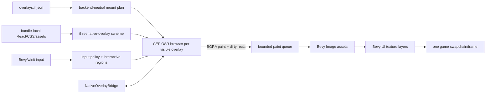
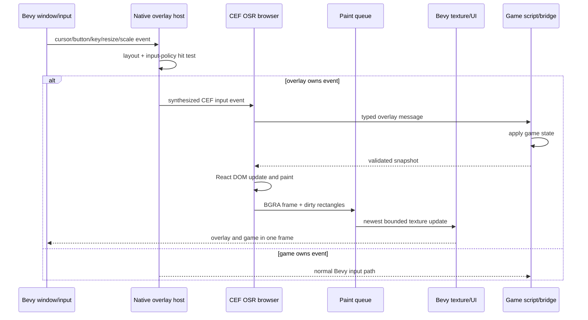

# PRD: Native React Overlays Through CEF Offscreen Textures

Complexity: 10 -> HIGH mode

Date: 2026-07-13
Status: DONE
Owner: Native runtime, desktop packaging, and verification tooling
Origin: `docs/audits/webview-overlay-alternatives-evaluation-2026-07-13.md`

## 1. Context

**Problem:** The native React overlay contract is sound, but the current
GTK/Wry host renders into a separate OS window, making transparency, z-order,
lifecycle, input shaping, and stale-pixel cleanup depend on window-manager and
WebKitGTK behavior that has already failed on the reference NVIDIA/Xwayland
machine.

**Complexity score:** +3 for more than 10 files, +2 for a new native host and
rendering subsystem, +2 for multi-package runtime/CLI/verification work, +2
for cross-thread browser lifecycle and input state, and +1 for integrating and
shipping the external CEF runtime = 10 (HIGH).

**Files analyzed:**

- `docs/audits/webview-overlay-alternatives-evaluation-2026-07-13.md`
- `docs/audits/native-overlay-linux-webview-investigation-2026-07-12.md`
- `docs/audits/native-overlay-stale-pixel-ghosting-2026-07-13.md`
- `runtime-bevy/Cargo.toml`
- `runtime-bevy/crates/threenative_runtime/Cargo.toml`
- `runtime-bevy/crates/threenative_runtime/src/{lib,main,overlay,overlay_host}.rs`
- `runtime-bevy/crates/threenative_runtime/src/proof_harness.rs`
- `runtime-bevy/crates/threenative_runtime/tests/{overlay,overlay_host}.rs`
- `packages/cli/src/native/{bevy,bevy.test}.ts`
- `packages/cli/src/commands/{package,playtest}.ts`
- `tools/verify/src/gateDescriptors.ts`
- `examples/chess/content/overlays/chess.overlays.json`
- `examples/chess/overlay/chess-side-select/src/App.tsx`
- `examples/chess/playtests/{chess-opening,chess-retained-native}.playtest.json`
- `docs/status/capabilities/ui.md`, `docs/STATUS.md`, and
  `docs/bevy-feature-parity.md`

### Current behavior

- Overlay declarations, message schemas, `@threenative/overlay-client`, bridge
  validation, snapshot replay, visibility controls, and input-mode controls
  are already shared contracts worth preserving.
- Web renders the overlay in an iframe in the browser compositor. Native uses
  Wry/WebKitGTK in a separately composited GTK window synchronized over the
  Bevy window.
- The native host is about 1,690 lines across `overlay_host.rs` and
  `overlay.rs`, including platform environment overrides, a loopback server,
  window synchronization, X11 input shapes, injected DOM observers, and
  script-evaluation snapshot delivery.
- On NVIDIA/Xwayland, removed transparent DOM pixels remain visible even when
  the bridge, React state, and live input regions all advance correctly.
  Resize-based, Cairo, CSS-damage, software-GL, and DMABUF experiments did not
  produce a shippable fix.
- Chess therefore targets its React overlay to web only and duplicates the
  essential desktop controls in retained native UI.
- Native playtest screenshots exist behind `--native-screenshots`, but native
  visual assertions are not yet part of an overlay-specific release gate.
- Bevy is pinned to `=0.14.2`. The current `bevy_cef` 0.12.0 release depends
  on Bevy 0.19 and CEF 149.3.0; adopting it directly would turn this PRD into
  a framework migration. The maintained raw `cef` binding is the production
  integration path for this scope; `bevy_cef` is reference code only.

### Measured Bevy upgrade decision

The Bevy version choice was tested on 2026-07-13 rather than assumed:

1. `cargo info bevy_cef@0.12.0 --verbose` confirmed that the current
   integration release uses Bevy 0.19. The original `bevy_cef` 0.1.0 used Bevy
   0.16, but adopting an obsolete integration would not solve ongoing CEF/Bevy
   maintenance.
2. A detached worktree changed `threenative_runtime` from Bevy 0.14.2 to 0.19.0
   and changed `threenative_components` from `bevy_ecs` 0.14.2 to 0.19.0, then
   ran:

   ```bash
   cargo check --workspace --all-targets --message-format short
   ```

3. After removing mixed-version ECS noise, the runtime still failed with 161
   library errors and 169 library-test errors. Breakage spans scene/PBR/UI
   bundles, render graphs and shaders, events/messages, hierarchy, textures,
   screenshots, accessibility, cameras, lighting/fog, audio, gamepad input,
   and component query shapes.
4. No migration edit was retained outside the disposable worktree.

**Decision:** Do not combine a Bevy 0.14.2 -> 0.19 migration with the native
overlay replacement. That migration is a separate high-risk initiative with
its own parity requirements. Implement CEF OSR through the raw maintained
binding on the current Bevy pin. Revisit the decision only if the raw-binding
spike fails for a reason that a framework upgrade demonstrably resolves; that
requires amending this PRD before changing the pin.

## 2. Goals

- Render each desktop React overlay into an offscreen CEF surface and upload
  those pixels into a Bevy-owned texture composited inside the game frame.
- Preserve the authored overlay manifest, generated bundle, React/Tailwind
  source, message schemas, `@threenative/overlay-client`, snapshot semantics,
  visibility behavior, and input modes.
- Route pointer, wheel, keyboard, focus, resize, and scale-factor events from
  Bevy/winit to CEF without a second native window or X11 shape regions.
- Prove the chess side chooser, transition to HUD, HUD buttons, and modal close
  with native screenshots and real routed input on the reference
  NVIDIA/Xwayland machine.
- Keep retained native UI as the lightweight and failure-safe tier when the
  CEF backend is absent or intentionally excluded.
- Package the CEF helper/runtime files, licenses, and bundle-local overlay
  assets with `tn package --runtime bevy` and fail preflight when any required
  runtime artifact is missing.
- Delete the Wry/GTK synchronized-window implementation after CEF meets the
  bridge, pixel, packaging, and platform exit criteria.

## 3. Non-goals

- No Bevy upgrade; the measured migration above keeps the `=0.14.2` pin
  unchanged unless this PRD is explicitly amended with new evidence.
- No IR or structured-source schema redesign. CEF is adapter-private.
- No rewrite of React overlays into retained UI, a custom React reconciler,
  Dioxus, Servo, Blitz, or a hand-built CSS engine.
- No WebGL, video, audio, third-party embeds, arbitrary remote navigation,
  downloads, browser chrome, or general-purpose browsing inside overlays.
- No accelerated CEF shared-texture path in the first production slice. CPU
  buffer OSR is the correctness baseline; acceleration requires separate
  measurements and a fallback to the same CPU path.
- No full IME, virtual keyboard, or platform screen-reader promotion. Preserve
  the existing explicit diagnostic boundaries.
- No claim that `tn package --runtime webview` is replaced. That command is the
  separate Three.js desktop-web fallback; this PRD changes React overlays
  inside the native Bevy runtime.
- No indefinite dual-backend maintenance. Wry may remain only during the
  measured migration window and is removed before this PRD is complete.

## 4. Integration Points

### How will this feature be reached?

- [x] Entry point: existing desktop overlay declarations in
  `overlays.ir.json` reached through `app_from_bundle_with_options`.
- [x] Caller: `runtime-bevy/.../src/lib.rs` installs one native overlay plugin
  when a bundle has an overlay targeting `desktop`.
- [x] Registration: one backend descriptor owns the Cargo feature, runtime
  capability name, CLI-required feature, package payload, and focused proof
  enrollment. Do not add a second hand-maintained backend list.
- [x] Runtime wiring: the existing `NativeOverlayHostPlan` and
  `NativeOverlayBridgeResource` feed the CEF host; CEF paint callbacks feed
  Bevy texture updates; Bevy input feeds CEF event calls.

### Is this user-facing?

Yes. Players see and operate the same React overlay on web and native. Overlay
authors keep one React/CSS implementation and one typed message contract.

### Full player flow

1. The player launches a desktop bundle that declares a React overlay.
2. The runtime resolves the `cef-osr` backend and creates a transparent
   offscreen browser for the bundle-local entry.
3. CEF paints BGRA pixels; the adapter uploads them to a Bevy texture and
   composites it above the game scene.
4. Bevy routes input to CEF only when the overlay's current input policy and
   reported interactive regions claim that event.
5. The overlay sends a typed bridge message; the game applies it and publishes
   a schema-validated snapshot back to the overlay.
6. React changes state; the next offscreen paint replaces the texture pixels,
   including transparent pixels where removed DOM used to be.

### Full author flow

1. The author scaffolds or edits the normal React overlay and declares
   `targetProfiles: ["web", "desktop"]`.
2. `tn build` emits the same overlay files and message contract used on web.
3. `tn playtest --target desktop --native-screenshots` launches the CEF-backed
   Bevy runtime and records before/after pixels plus bridge observations.
4. `tn package --runtime bevy` includes the native executable, CEF helper and
   resources, licenses, and the ordinary game bundle.

## 5. Solution

### Approach

- Keep `overlay.rs` as the backend-neutral bridge and contract layer. Shrink
  `overlay_host.rs` to mount planning, capability reporting, and backend
  selection.
- Add an adapter-private `overlay_cef/` module owning CEF process startup,
  browser lifecycle, local resource loading, paint queues, Bevy texture
  composition, input translation, and shutdown.
- Integrate the maintained raw `cef` crate against Bevy 0.14.2. Use
  `bevy_cef` only to inform event/lifecycle design; do not depend on or fork it
  solely to avoid its supported Bevy range.
- Land CPU-buffer OSR first. Copy only dirty rectangles when the Bevy 0.14
  image path supports bounded writes; otherwise make the full-frame copy
  explicit and measure it before promotion.
- Load overlay entries through a read-only `threenative-overlay://<id>/...`
  scheme rooted at the declared bundle entry. Reject traversal, remote URLs,
  popups, downloads, external protocols, and undeclared overlay IDs.
- Preserve the existing retained UI fallback and `TN_OVERLAY_TARGET_UNSUPPORTED`
  behavior for builds without the CEF backend.



### Key decisions

- [x] **Backend boundary:** `NativeOverlayBackendDescriptor` is the single
  owner of backend ID (`cef-osr`), Cargo feature, capability JSON, required
  package artifacts, and diagnostics. CLI tests assert derived values rather
  than repeating them.
- [x] **Version boundary:** keep Bevy 0.14.2 per the measured migration
  decision. Pin the exact compatible `cef`
  crate and CEF distribution versions in Cargo/build metadata and verify their
  checksums. Updating Chromium is an explicit dependency upgrade, not an
  unreviewed build-time fetch.
- [x] **Process model:** call CEF subprocess dispatch before normal runtime
  argument parsing. Package a dedicated helper executable when required by the
  platform. A helper invocation must never initialize Bevy or load a game
  bundle.
- [x] **Message loop:** use CEF's external message-pump integration on the main
  thread and schedule bounded work from Bevy `Update`; no blocking browser
  loop and no per-frame busy wait.
- [x] **Thread ownership:** CEF callbacks enqueue owned paint/bridge/crash
  records into bounded channels. Bevy resources and `Assets<Image>` are only
  mutated from Bevy systems. When paint production outruns consumption, keep
  the newest complete frame per overlay and record dropped-frame metrics.
- [x] **Pixel format:** normalize CEF's premultiplied BGRA output exactly once
  at the adapter boundary into the texture format expected by Bevy. Preserve
  alpha; do not use color-key transparency.
- [x] **Composition:** one Bevy UI image entity per mounted overlay, ordered by
  authored `zIndex` and sized from the overlay layout or the primary window.
  Visibility changes hide the entity and browser without reallocating an OS
  window.
- [x] **Input:** transform physical winit coordinates to overlay-local CSS
  pixels using window scale factor and authored layout. Existing input modes
  and reported interactive rectangles decide whether CEF or the game owns a
  pointer event. Modal mode captures pointer and keyboard; pointer mode only
  captures live interactive regions.
- [x] **Assets/security:** the custom scheme serves only normalized paths below
  the declared overlay root with correct MIME types. Network requests,
  navigation outside the scheme, new windows, downloads, permissions, and
  devtools are denied in production.
- [x] **Failure policy:** initialization/helper/resource/process failure emits
  a stable diagnostic and uses retained UI when the project provides it. A
  desktop overlay with no valid fallback fails proof/release rather than
  silently disappearing.
- [x] **Migration:** CEF becomes the only promoted native React overlay
  backend. Remove Wry, GTK, the loopback static server, window synchronization,
  repaint nudges, X11 input shaping, and the WebKit environment overrides once
  the replacement gates pass.

### Stable diagnostics

| Code | Trigger | Suggested fix |
| --- | --- | --- |
| `TN_OVERLAY_CEF_INIT_FAILED` | CEF cannot initialize | Inspect platform runtime dependencies and the pinned CEF distribution report. |
| `TN_OVERLAY_CEF_HELPER_MISSING` | Required helper executable/resource is absent | Rebuild or repackage the native runtime with the descriptor-owned CEF payload. |
| `TN_OVERLAY_CEF_RESOURCE_REJECTED` | Path traversal, remote URL, or undeclared resource request | Use bundle-local overlay assets and normalized relative paths. |
| `TN_OVERLAY_CEF_RENDER_TIMEOUT` | Browser reaches no nonblank paint before the readiness deadline | Inspect overlay console, resource, and CEF process diagnostics. |
| `TN_OVERLAY_CEF_PROCESS_CRASHED` | Browser/render subprocess exits unexpectedly | Inspect the crash record; retry once only when the crash policy marks it recoverable. |
| `TN_OVERLAY_CEF_INPUT_MAPPING_INVALID` | Scale/layout makes an event impossible to map | Fix the authored layout or runtime scale-factor handling before accepting input proof. |

### Data changes

No public IR, bundle, SDK, compiler, or overlay-client schema change. Internal
additions are:

- a runtime backend descriptor;
- CEF distribution/package metadata with checksums and license paths;
- structured paint/input/performance observations in native proof artifacts;
- a focused native-overlay verification report.

## 6. Sequence Flow



Resize does not recreate an OS overlay window. It updates browser viewport
size, overlay layout, texture allocation, and coordinate mapping as one
generation; stale paints from an older generation are discarded.

## 7. Success Budgets And Decision Gates

The spike is not complete because a page appeared once. Record all values in
`tools/verify/artifacts/native-overlay-cef/spike-report.json`.

| Measure | Spike threshold | Production threshold |
| --- | --- | --- |
| Side chooser transparency | Board visible through every transparent region | Automated region metric passes in repeated runs |
| Modal removal | Removed modal region changes to board/HUD pixels without resizing | 10/10 transitions pass; no stale modal pixels |
| Input | Real routed click selects a side and HUD buttons remain usable | Modal, pointer-island, keyboard, wheel, focus, resize, and scale tests pass |
| Bridge | Send, subscribe, replay, visibility, and input mode work | Existing web/native vectors plus desktop scenario pass |
| Frame cost | Record CPU copy/upload and total frame delta at 1280x720 | p95 overlay-host CPU cost <= 3 ms and no > 5 ms sustained regression over the no-overlay native baseline |
| Paint queue | No unbounded growth | At most one pending complete paint per overlay; dropped count is reported |
| Memory | Record parent and child-process working set after settle | No monotonic growth across 100 modal/HUD transitions; steady-state value is reported |
| Installed size | Record runtime, helper, resources, logical payload, and mounted-package deltas | Linux added physical on-disk size <= 250 MB for an executable package that runs directly from its mounted compressed filesystem; logical uncompressed payload is reported separately. Extraction-based fallback does not satisfy this gate. Other platforms retain an added installed-size ceiling of 250 MB unless their platform evidence explicitly updates this PRD. |
| Startup | First nonblank paint measured from process start | p95 <= 2.5 s on the reference machine over 10 warm runs |

If the raw binding cannot produce correct CPU OSR pixels, input, and bridge
behavior within the 10-working-day spike, stop. Record the failed criterion
and keep retained UI; do not add another Wry/WebKit workaround. Performance or
size misses after correctness may proceed only with an explicit PRD update
that preserves the same pixel and fallback gates.

**Installed-size product decision (2026-07-13):** Linux packaging may use a
read-only, zstd-compressed SquashFS/AppImage and measure the physical executable
package stored on disk, provided the application executes CEF directly from
the mounted filesystem. The Phase 1 proof packaged the stripped spike binary,
the complete CEF-required Linux file list, one declared `en-US` locale, and
license/notices into a 156,809,720-byte AppImage (SHA-256
`4b9222841d899fda86302321a3661b052731f25f15dbaa2339497a571dc85247`).
It launched from the mounted image, produced a nonblank CEF paint, routed the
Black side-selection click, and delivered subsequent snapshots. The same CEF
payload is 349,022,139 logical bytes before the executable; package reports
must retain both values. `--appimage-extract-and-run` and equivalent extracted
installations do not qualify because their physical installed footprint
returns to the uncompressed size.

## 8. Execution Phases

Each phase is a user-testable vertical slice. Complete the automated checkpoint
and any named manual checkpoint before starting the next phase.

### Phase 1: Timeboxed CEF OSR spike - The chess overlay paints and clears inside a Bevy frame

**Files (max 5):**

- `runtime-bevy/crates/threenative_runtime/Cargo.toml` - exact optional CEF dependency and spike binary
- `runtime-bevy/crates/threenative_runtime/src/overlay_cef/mod.rs` - minimal initialization, browser, and paint queue
- `runtime-bevy/crates/threenative_runtime/src/main.rs` - subprocess dispatch and normal runtime entry (the temporary spike binary was removed after promotion)
- `runtime-bevy/crates/threenative_runtime/tests/overlay_cef.rs` - lifecycle and buffer tests
- `tools/verify/artifacts/native-overlay-cef/spike-report.json` - measured decision evidence

**Implementation:**

- [x] Pin the exact `cef` crate/distribution pair and capture license,
  supported targets, required helper/resources, and checksums in the report.
- [x] Dispatch CEF subprocesses before Bevy startup and run external message
  pumping without blocking the Bevy frame loop.
- [x] Load the built chess overlay, request a transparent OSR surface, and
  upload CPU paint output to one Bevy-owned texture.
- [x] Exercise side chooser -> HUD -> settings open/close without any GTK/Wry
  window, OS-window positioning, or resize workaround.
- [x] Record every success budget above, even when the verdict is fail.

**Tests required:**

| Test | Assertion |
| --- | --- |
| `should dispatch a cef helper without initializing bevy` | Helper process returns through CEF path only |
| `should preserve transparent pixels when normalizing bgra paint` | Alpha and channel ordering match fixture bytes |
| `should keep only the newest paint when producer outruns bevy` | Queue remains bounded and records drops |
| Reference manual scenario | Modal removal produces correct pixels without window resize |

**Verification plan:**

```bash
pnpm --dir examples/chess run build:overlay
cargo test --manifest-path runtime-bevy/Cargo.toml -p threenative_runtime --test overlay_cef --features native-overlay-cef
cargo run --manifest-path runtime-bevy/Cargo.toml -p threenative_runtime --bin threenative_runtime --features native-overlay-cef -- examples/chess/dist/chess.bundle
```

**Manual checkpoint:** On the NVIDIA/Xwayland reference machine, capture
chooser, HUD, settings-open, and settings-closed frames. Confirm removed pixels
clear without moving or resizing the window and record PASS/FAIL in the spike
report. Stop on a failed spike verdict.

### Phase 2: Production host and local resource boundary - A desktop overlay reaches first paint through the normal runtime

**Files (max 5):**

- `runtime-bevy/crates/threenative_runtime/src/overlay_host.rs` - backend-neutral plan and descriptor selection
- `runtime-bevy/crates/threenative_runtime/src/overlay_cef/process.rs` - process lifecycle and external message pump
- `runtime-bevy/crates/threenative_runtime/src/overlay_cef/resources.rs` - custom scheme and MIME/path policy
- `runtime-bevy/crates/threenative_runtime/src/overlay_cef/mod.rs` - plugin and browser lifecycle
- `runtime-bevy/crates/threenative_runtime/src/lib.rs` - install the plugin from existing mount planning

**Implementation:**

- [x] Promote the successful spike code into the normal runtime and remove the
  spike-only binary once its reusable behavior is covered.
- [x] Define the single backend descriptor and derive runtime capability output
  from it.
- [x] Serve only declared bundle-local overlay roots through
  `threenative-overlay://`; normalize and bounds-check every request.
- [x] Deny remote navigation, new windows, downloads, permissions, external
  protocols, and production devtools.
- [x] Emit actionable initialization, helper, resource, timeout, and crash
  diagnostics.

**Tests required:**

| Test | Assertion |
| --- | --- |
| `should select cef-osr for a declared desktop overlay` | Mount plan reports the descriptor-owned backend |
| `should ignore web-only overlays` | No CEF process/browser is created |
| `should serve a normalized bundle-local asset` | Correct bytes and MIME type returned |
| `should reject traversal and remote navigation` | `TN_OVERLAY_CEF_RESOURCE_REJECTED` includes path and fix |
| `should shut down every browser before cef shutdown` | No leaked browser/process state |

**User verification:** Launch the normal `threenative_runtime` with a desktop
overlay fixture; expect a first nonblank overlay paint and no loopback server
or secondary window.

### Phase 3: Bevy texture composition and lifecycle - Transparent overlay pixels stay attached through window changes

**Files (max 5):**

- `runtime-bevy/crates/threenative_runtime/src/overlay_cef/render.rs` - paint generations, format conversion, texture updates
- `runtime-bevy/crates/threenative_runtime/src/overlay_cef/components.rs` - surface/image entities and z-order
- `runtime-bevy/crates/threenative_runtime/src/overlay_cef/mod.rs` - render systems and ordering
- `runtime-bevy/crates/threenative_runtime/tests/overlay_cef.rs` - render/lifecycle coverage
- `runtime-bevy/crates/threenative_runtime/src/proof_harness.rs` - overlay render observations and screenshot readiness

**Implementation:**

- [x] Create one transparent Bevy image surface per overlay and order it by
  authored `zIndex` above the game scene.
- [x] Apply authored layout or full-window bounds and update CEF viewport,
  texture size, and UI entity as one generation on resize/scale changes.
- [x] Discard late paint callbacks for obsolete generations.
- [x] Hide/show without destroying bridge state; destroy and release all
  textures on unmount/runtime shutdown.
- [x] Record first-paint, paint count, dropped paint count, upload bytes/time,
  dimensions, visibility, and composition generation.

**Tests required:**

| Test | Assertion |
| --- | --- |
| `should compose overlays in stable authored z order` | Entity order follows `zIndex` and stable ID tie-break |
| `should discard a stale paint after resize` | Old generation cannot overwrite new-size texture |
| `should clear removed content through transparent paint bytes` | Transparent replacement bytes reach the Bevy image |
| `should release image assets when an overlay unmounts` | No retained handle/entity/browser leak |

**User verification:** Resize, move, minimize/restore, and scale the Bevy
window. The overlay remains in the game frame, uses correct bounds, and never
floats above another application.

### Phase 4: Input and typed bridge parity - The chess chooser and HUD work without native-window shaping

**Files (max 5):**

- `runtime-bevy/crates/threenative_runtime/src/overlay_cef/input.rs` - coordinate, focus, pointer, wheel, and keyboard translation
- `runtime-bevy/crates/threenative_runtime/src/overlay_cef/bridge.rs` - CEF message/JavaScript adapter
- `runtime-bevy/crates/threenative_runtime/src/overlay_cef/mod.rs` - system ordering
- `runtime-bevy/crates/threenative_runtime/src/overlay.rs` - backend-neutral queue behavior only if required
- `runtime-bevy/crates/threenative_runtime/tests/overlay_cef.rs` - routed input and bridge tests

**Implementation:**

- [x] Map physical window coordinates through scale factor and authored layout
  into overlay-local CSS pixels.
- [x] Forward move, enter/leave, button, wheel, key, character, focus, and
  cancellation events supported by the current overlay contract.
- [x] Apply modal, pointer, keyboard, pointer-and-keyboard, and none policies;
  use live interactive rectangles for pointer-island routing.
- [x] Port send/subscribe, snapshot replay/deduplication, visibility, and
  setInput through CEF process messages and JavaScript execution.
- [x] Stop snapshot delivery at the first failed execution so a later sequence
  cannot permanently skip it.

**Tests required:**

| Test | Assertion |
| --- | --- |
| `should map hidpi window input to overlay css pixels` | Layout offset and scale are applied once |
| `should leave board clicks active outside pointer islands` | Nonclaimed pointer events stay on Bevy path |
| `should capture pointer and keyboard in modal mode` | Game does not receive claimed events |
| `should deliver send subscribe replay visibility and input controls` | Existing bridge semantics match web/native vectors |
| `should retry the first failed snapshot without skipping sequences` | Delivery cursor advances only after success |

**User verification:** With real mouse and keyboard input, select a chess side,
use HUD buttons, open/close settings, and interact with the board outside HUD
regions. No parent-window event relay or X11 shape is involved.

### Phase 5: Pixel-evidence gate and chess promotion - Native overlay regressions fail on what the player sees

**Files (max 5):**

- `examples/chess/content/overlays/chess.overlays.json` - restore `desktop` target after the gate passes
- `examples/chess/playtests/chess-overlay-native.playtest.json` - chooser/HUD/settings/input scenario with native screenshots
- `tools/verify/src/nativeOverlayCefGate.ts` - run scenario and measure regions/transitions
- `tools/verify/src/nativeOverlayCefGate.test.ts` - negative controls for stale/blank/detached pixels
- `tools/verify/src/gateDescriptors.ts` - descriptor-owned focused/release enrollment

**Implementation:**

- [x] Capture chooser, post-selection HUD, settings-open, settings-closed,
  resized, and restored screenshots through the native proof harness.
- [x] Compare declared regions so a logic-only state transition cannot pass
  when old modal pixels remain or the overlay is blank.
- [x] Assert bridge state, routed input ownership, no runtime errors, backend
  `cef-osr`, and no secondary native window alongside pixel metrics.
- [x] Add a stale-pixel negative control, a fully transparent/blank control,
  and a wrong-region control that each fail with stable diagnostics.
- [x] Re-enable desktop for the chess React overlay only after the focused gate
  passes on the reference machine.

**Tests required:**

| Test | Assertion |
| --- | --- |
| `should reject a post-transition frame containing chooser pixels` | Stale modal negative control fails |
| `should reject a blank overlay frame` | Logic/bridge evidence cannot substitute for pixels |
| `should reject metrics sampled outside the declared region` | Gate cannot pass through a bad crop |
| `should pass chooser hud settings and resize sequence` | Real native scenario produces complete evidence |

**Verification plan:**

```bash
pnpm --filter @threenative/verify-tools build
node --test tools/verify/dist/nativeOverlayCefGate.test.js
pnpm verify:focused verify:native-overlay-cef
(cd examples/chess && node bin/tn playtest --project . --scenario playtests/chess-overlay-native.playtest.json --target desktop --native-screenshots --json)
```

**Manual checkpoint:** Review the generated contact sheet once on each
supported compositor family before promotion. The automated region metrics
remain blocking after that review.

### Phase 6: Package CEF and remove Wry - A clean native package runs without system WebKitGTK

**Files (max 5):**

- `packages/cli/src/commands/package.ts` - copy descriptor-owned helper/resources/licenses and report size
- `packages/cli/src/commands/package.test.ts` - installed-layout and missing-artifact tests
- `packages/cli/src/native/bevy.ts` - derive required backend capability and build feature
- `packages/cli/src/native/bevy.test.ts` - stale-binary and Cargo argv coverage
- `runtime-bevy/crates/threenative_runtime/Cargo.toml` - remove Wry/GTK and the migration feature

**Implementation:**

- [x] Package the runtime executable, helper executable, CEF libraries,
  resource packs/locales, licenses/notices, and bundle using the descriptor as
  the source of truth.
- [x] Include artifact checksums, sizes, backend ID, CEF/Chromium version, and
  required relative paths in `package.report.json`.
- [x] Fail package creation and installed startup for a missing helper,
  library, resource pack, locale policy file, or license payload.
- [x] Capability-check cached native binaries for `cef-osr`; never reuse a Wry
  or feature-incomplete binary for a desktop overlay bundle.
- [x] Remove `gtk`, `wry`, the Wry feature, WebKit environment overrides,
  loopback server, window synchronization, X11 shaping, injected DOM region
  observers used only for OS-window management, and obsolete tests.

**Tests required:**

| Test | Assertion |
| --- | --- |
| `should package every descriptor-owned cef artifact` | Installed layout is complete and checksummed |
| `should fail when the cef helper or resource pack is missing` | Stable package diagnostic names missing path |
| `should reject a cached wry runtime for a cef overlay bundle` | Launcher rebuilds/selects the correct binary |
| `should start the installed package with local assets only` | First paint, bridge, and shutdown pass offline |
| Cargo tree assertion | No `wry`, `gtk`, or WebKitGTK dependency remains |

**User verification:** Install the archive on a clean machine without
WebKitGTK, disconnect network access, run the chess scenario, and confirm first
paint, interaction, screenshot evidence, and clean process shutdown.

### Phase 7: Platform matrix, documentation, and release closure - The capability claim matches shipped evidence

**Files (max 5):**

- `docs/status/capabilities/ui.md` - promote CEF texture behavior and retain explicit boundaries
- `docs/STATUS.md` - update the one-line UI index
- `docs/bevy-feature-parity.md` - link the pixel/bridge/input/package evidence
- `docs/status/SYSTEMS_CODE_QUALITY_STATUS.md` - close Wry debt and record CEF lifecycle/size risk
- `docs/runtime/desktop-packaging.md` - document native CEF payload and diagnostics

**Implementation:**

- [x] Run compile/package/smoke evidence on Linux X11/Xwayland, Linux Wayland,
  Windows, and macOS. A platform without evidence remains explicitly
  unsupported; do not generalize the Linux pass.
- [x] Record CEF/Chromium update ownership, checksum refresh procedure,
  security-notice cadence, and rollback procedure.
- [x] State that retained UI remains the lightweight tier and that
  `--runtime webview` remains the Three.js desktop-web fallback.
- [x] Update capability, parity, code-quality, packaging, and status claims
  only to the evidence actually produced.

**Verification plan:**

```bash
pnpm --filter @threenative/overlay-client test
pnpm --filter @threenative/runtime-web-three test -- --test-name-pattern overlay
cargo test --manifest-path runtime-bevy/Cargo.toml -p threenative_runtime --test overlay --test overlay_host --test overlay_cef --features native-overlay-cef
pnpm verify:focused verify:native-overlay-cef
pnpm verify:conformance
pnpm check:docs
```

**Manual checkpoint:** Review the platform evidence table, installed-size
decision, licensing payload, and contact sheets. Any waiver must name a
platform and cannot weaken the NVIDIA/Xwayland pixel gate.

## 9. Checkpoint Protocol

After every phase:

1. Run the phase's narrow tests and retain their output/evidence paths.
2. Run an automated PRD checkpoint review comparing the implementation diff
   with this PRD. Use the `prd-work-reviewer` agent when that reviewer is
   available; otherwise record an equivalent diff/test audit in the phase
   evidence.
3. Fix every requirement drift or explicitly amend this PRD before continuing.
4. For Phases 1, 3, 4, 5, 6, and 7, also complete the named manual visual,
   performance, packaging, or platform checkpoint.
5. Do not claim a phase complete because logic tests pass when required pixel
   evidence is absent.

## 10. Acceptance Criteria

- [x] The exact CEF crate/distribution versions, checksums, licenses, helper
  model, and supported platforms are pinned and reported.
- [x] Bevy remains pinned to 0.14.2; this PRD does not hide a framework upgrade.
- [x] Desktop React overlays render into Bevy-owned textures with real alpha
  and no separately composited overlay window.
- [x] The existing overlay IR, bundle layout, React client, message validation,
  snapshot replay, visibility, and input modes remain compatible.
- [x] Chess uses the React overlay on desktop again and passes real pointer,
  keyboard, bridge, modal/HUD/settings, resize, minimize/restore, and
  scale-factor scenarios.
- [x] Automated native screenshots reject stale removed pixels, blank output,
  wrong crops, and logic-only false positives.
- [x] The reference NVIDIA/Xwayland scenario passes 10/10 modal transitions
  without a resize or repaint workaround.
- [x] Paint queues are bounded, stale generations cannot overwrite current
  textures, and browser/texture/process resources shut down cleanly.
- [x] Performance, startup, memory, and installed-size budgets pass or this PRD
  contains an explicit approved revision explaining the new boundary.
- [x] `tn package --runtime bevy` includes and validates all CEF runtime,
  helper, resource, checksum, and license artifacts and runs offline on a clean
  supported machine.
- [x] Wry, GTK/WebKitGTK, the synchronized overlay window, loopback server,
  X11 shaping, WebKit environment hacks, and their obsolete tests are removed.
- [x] Retained UI remains functional for projects that choose the lightweight
  tier or provide a fallback.
- [x] The focused CEF overlay gate is descriptor-owned, release-enrolled, and
  passes alongside conformance and docs checks.
- [x] `docs/status/capabilities/ui.md`, `docs/STATUS.md`,
  `docs/bevy-feature-parity.md`, `docs/status/SYSTEMS_CODE_QUALITY_STATUS.md`,
  and desktop packaging docs match the final evidence.
- [x] Every phase checkpoint passed, including all required manual checks.

## 11. Completion Evidence

Completed on 2026-07-13/14 against the promoted Linux x86-64
NVIDIA/Xwayland target. Platforms without equivalent evidence remain
unsupported rather than inheriting this claim.

| Area | Result and retained evidence |
| --- | --- |
| Runtime/composition | One CEF session owns a browser, latest-frame queue, Bevy image, bridge state, and lifecycle generation per overlay. A two-overlay runtime launch reported `surfaceCount: 2`; stable `zIndex`/mount-order tests and 29 focused CEF tests passed. |
| Player flow | The desktop chess playtest selected Black, reached the HUD, exercised settings, resized to 1000x640, minimized/restored, and shut down cleanly with no diagnostics. The final run is under `examples/chess/artifacts/playtest/chess-overlay-native/2026-07-14T03-24-53-497Z`. |
| Pixel gate | `tools/verify/artifacts/native-overlay-cef/verification-report.json` passes chooser, hover, stale-modal, blank, wrong-region, package, resize, and restore checks. Resized/restored frames have SHA-256 `a6d8e9048a26aef3df809e1be1bb43dc75156f9b75ac98acf92495416107be11` and a zero pixel-difference ratio. |
| Input/bridge | Real pointer selection and bridge snapshots passed in the mounted package and playtest. Focus, wheel, key/character, modal suppression, cancellation, live pointer islands, topmost multi-overlay routing, and HiDPI physical-to-CSS mapping are covered by focused runtime tests. Full IME remains a declared non-goal. |
| Stability/performance | A release run completed 300 modal transitions. BGRA conversion p95 was 1.493 ms, upload was 0 microseconds, native frame cadence p95 was 13.976 ms with no over-budget frames, and the five-second settled process-tree RSS range was 136 KiB with a negative slope. |
| Startup/package | First nonblank mounted-package paint was 2195.69 ms. The directly mounted AppImage is 156,809,720 bytes, below the 250 MB gate; the separately reported logical CEF payload is 349,022,139 bytes. Package SHA-256 is `4b9222841d899fda86302321a3661b052731f25f15dbaa2339497a571dc85247`. Retained/native-only builds have no CEF feature or payload. |
| Failure/security | Stable init/helper/resource/timeout/process-crash/input-mapping diagnostics are covered. The local scheme rejects traversal and remote loads; production denies navigation, popups, downloads, permissions, external protocols, context-menu inspection, and devtools. |
| Cleanup | The Wry/GTK/WebKitGTK host, loopback server, synchronized overlay window, X11 shaping, WebKit environment workarounds, and spike-only binary are removed. No Wry, GTK, or WebKit dependency remains in the native Cargo graph. |
| Platform matrix | Linux x86-64 NVIDIA/Xwayland: promoted and gated. Linux native Wayland, Windows, and macOS: explicitly unsupported pending their own compile/package/input/pixel evidence. |
| Verification | `pnpm --filter @threenative/cli test` passed 507 tests; focused CEF/runtime/proof tests passed in an isolated clean worktree; `pnpm verify:focused verify:native-overlay-cef` passed. Final conformance and docs checks are recorded in the closing commit. |

The CEF update owner, security cadence, checksum refresh requirements, and
rollback procedure are documented in `docs/runtime/desktop-packaging.md`.
Manual review of chooser, HUD, settings, resized, and restored images found no
blank, flashing, detached, or leftover modal pixels.

## 12. Risks And Mitigations

| Risk | Mitigation |
| --- | --- |
| CEF adds roughly browser-scale binary weight and subprocesses | Measure in Phase 1, gate installed delta, make retained UI the explicit lightweight tier |
| Chromium/CEF version treadmill | Exact pins/checksums, dependency-upgrade procedure, security-notice owner, no latest-at-build behavior |
| Raw bindings expose unsafe lifecycle edges | Keep all unsafe/FFI ownership in `overlay_cef`, use bounded queues, generation IDs, shutdown tests, and Rust quality checks |
| CPU upload misses frame budget | Dirty rectangles where supported, newest-frame queue semantics, measured p95 budget, accelerated OSR only as a later compatible optimization |
| Helper/resource packaging differs by platform | Descriptor-owned payload, platform package tests, clean-machine offline smoke, missing-file diagnostics |
| Input coordinates drift under DPI/layout changes | One physical-to-CSS transform, generation-coupled resize, tests at multiple scale factors and offsets |
| Browser capabilities exceed the product need | Custom local scheme and deny-by-default navigation/download/permission policy |
| Browser crash leaves invisible or frozen UI | Structured crash diagnostic, bounded one-time recovery only where safe, fail proof when no retained fallback exists |
| Two native hosts become permanent | Wry removal is a blocking Phase 6 and acceptance criterion |
| Logic evidence again masks pixel failure | Native screenshot transition metrics and negative controls are release-blocking |

## 13. Deferred Follow-ups

- Re-evaluate Servo and Blitz about every six months behind the same host seam;
  neither is a condition for this PRD.
- Reconsider a React reconciler/native retained tree only if browser weight
  becomes unacceptable for mobile or console targets.
- Evaluate accelerated CEF OSR after CPU correctness and performance evidence,
  with CPU OSR retained as the fallback.
- Promote IME, virtual keyboard, and screen-reader behavior only through their
  own platform-evidence PRDs.
