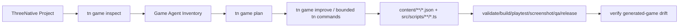
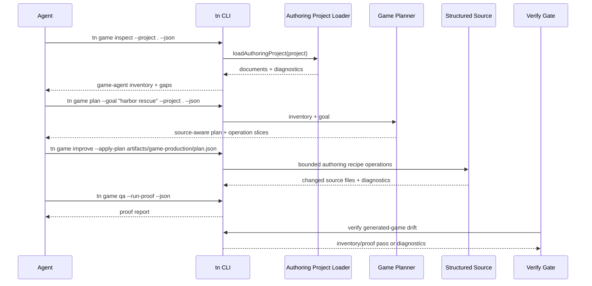

# PRD: Agent-Friendly 3D Game Creation Contract

Complexity: 11 -> HIGH mode

Score basis: +3 touches 10+ future files, +2 adds new CLI/report surfaces,
+2 spans authoring/compiler/CLI/templates/examples/verify/docs, +2 creates
cross-document planning and source-inventory logic, +1 affects release gates,
+1 updates developer-facing workflow docs.

## 1. Context

**Problem:** ThreeNative has the right structured-source pieces for generated
3D games, but examples do not yet expose a compact, consistent, machine-readable
contract that tells an agent what exists, what still needs work, and which
bounded operation should change each part.

**Goal:** Make a fresh AI agent reliably create a polished 3D game by giving it
one discoverable project inventory, one normalized generation checklist, one
source-shape contract, and drift checks that keep examples/templates aligned.

**Non-goals:**

- Do not replace `content/**/*.json` or `src/scripts/**/*.ts` as durable source.
- Do not make Bevy/Rust or generated `dist/**` authoring inputs.
- Do not require every example to have the same gameplay loop or visual style.
- Do not hide unsupported runtime features behind generated placeholder data.
- Do not solve advanced runtime residuals such as vehicle physics, arbitrary
  animation graphs, or online services in this PRD.

**Files Analyzed:**

- `AGENTS.md`
- `examples/AGENTS.md`
- `examples/*/AGENTS.md`
- `examples/*/CLAUDE.md`
- `examples/*/README.md`
- `examples/*/package.json`
- `examples/*/threenative.config.json`
- `examples/*/content/**/*.json`
- `examples/*/src/scripts/**/*.ts`
- `examples/*/verification.manifest.json`
- `templates/structured-source-starter/**`
- `templates/racing-kit-rally-starter/**`
- `packages/authoring/src/schemas.ts`
- `packages/authoring/src/project.ts`
- `packages/authoring/src/operations.ts`
- `packages/authoring/src/recipes.ts`
- `packages/authoring/src/gameWorkflow.ts`
- `packages/cli/src/index.ts`
- `packages/cli/src/commands/game.ts`
- `packages/cli/src/commands/asset.ts`
- `packages/cli/src/commands/scene.ts`
- `packages/cli/src/commands/create.test.ts`
- `packages/cli/src/commands/gameScore.test.ts`
- `docs/contracts/authoring-source-documents.md`
- `docs/contracts/game-production-workflow.md`
- `docs/workflows/compact-scene-source.md`
- `docs/workflows/open-source-3d-asset-kits.md`
- `docs/PRDs/other/agent-friendly-project-and-visual-debugging-workflows.md`
- `docs/PRDs/other/game-authoring-loop-hardening.md`

**Current Behavior:**

- Most generated games use the same source families:
  `assets`, `input`, `materials`, `meshes`, `prefabs`, `scenes`, `systems`,
  and `ui`, usually with `arena.*.json` filenames.
- A few examples are intentionally different: physics labs use manifests only,
  `racing-kit-rally` is asset-kit oriented, and `stylized-nature-component`
  focuses on assets/environment rather than a full game loop.
- `tn game plan`, `tn game score`, `tn game qa`, and `tn game release` already
  define production proof, but `tn game plan` emits generic guidance instead of
  an example-calibrated source inventory.
- Project metadata is inconsistent: some generated examples have rich
  `production` plans, some only `entry`/`outDir`, some omit `outDir`, and
  package scripts vary from full `game:*` coverage to only `build/dev/verify`.
- Scene documents often contain 50-145 raw entities and one script system,
  while only bowling uses compact instances heavily; agents still need a clear
  signal for when to use prefabs, instances, recipes, or direct scene edits.
- Asset provenance exists in several places (`threenative.config.json`,
  `assets/ASSET_PROVENANCE.md`, source docs, artifacts), but there is no single
  normalized ledger for a generator to read before choosing the next asset step.

## Pre-Planning Findings

No secret configuration is required. The SQLite asset catalog is a local tool
dependency; catalog absence must be reported as a sourceable blocker with a
stable diagnostic rather than silently falling back to primitive-looking art.

**Patterns found in `examples/`:**

- `examples/metro-surfer-heist` is the current positive reference for generated
  game feel and production shape: it has a specific three-lane endless-runner
  loop, concrete controls, objective, progression, fail/retry path, local custom
  GLB-kit fallback rationale, motion/playtest proof commands, and the
  `game:plan`, `game:score`, `game:qa`, and `game:release` scripts that future
  generated games should resemble.
- Structured generated game shape: 22 examples have `content/scenes/*.scene.json`;
  most use `content/scenes/arena.scene.json` plus matching `arena` input,
  materials, systems, and HUD documents.
- Source-family drift: `glassworks-prism-sorter`, `paper-plane-postmaster`, and
  `toy-train-yard-switcher` skip `content/meshes` or `content/prefabs`;
  `racing-kit-rally` skips separate assets/materials source in the example even
  though the starter has them; physics labs have no `content` tree.
- Script wiring pattern: generated games generally use one
  `content/systems/*.systems.json` system pointing at `src/scripts/player.ts`,
  but script responsibilities and owned state are only documented in some
  `threenative.config.json` files.
- UI pattern: generated games tend to have one `hud.ui.json` with 9-10 nodes,
  while full retained UI states are unevenly represented.
- Input pattern: generated games usually define five actions and no axes;
  racing uses actions plus an axis. Agents need a way to pick actions/axes from
  the game plan without hand-searching existing source.
- Visual pattern: many generated games use authored procedural mesh kits after
  catalog searches fail. This is acceptable only when the kit has recorded
  surface intent and passes visual proof; a primitive-derived GLB alone is not
  enough.
- Command drift: common scripts include `build`, `dev:web`, `playtest`,
  `validate`, and `verify`; only a subset includes `game:plan`, `game:score`,
  `game:qa`, and `game:release`. Even the strong `metro-surfer-heist` reference
  has README/script mismatch for `game:improve` and `recipe:controller`, so the
  drift gate should check docs-to-package command consistency.

**Main agent pain points:**

- Agents must inspect several files to answer basic questions: scene ID, player
  entity ID, script module/export, UI bindings, proof command, and asset plan.
- `threenative.config.json` production metadata is useful but not schema-backed
  by the authoring source contract and is unevenly populated.
- `tn game plan` knows the ideal process but does not include project-specific
  source inventory or a diff between "current project" and "complete vertical
  slice".
- The examples do not provide a canonical, generated `game-agent-inventory`
  artifact that future agents can trust as a starting map.
- Drift checks focus on production proof quality, not on agent ergonomics such
  as consistent scripts, discoverable source owners, or missing high-value
  surface metadata.

## Integration Points

**How will this feature be reached?**

- [x] Entry point identified:
  - `tn game inspect --project <path> --json`
  - `tn game plan --goal <text> --project <path> --json`
  - `tn game improve --apply-plan <file> --project <path> --json`
  - `tn create` / `tn init` for scaffolded starter metadata
  - `pnpm verify:generated-games` and a new focused drift check
- [x] Caller file identified:
  - `packages/cli/src/index.ts`
  - `packages/cli/src/commands/game.ts`
  - `packages/authoring/src/gameWorkflow.ts`
  - `packages/authoring/src/project.ts`
  - `packages/authoring/src/recipes.ts`
  - `packages/cli/src/commands/create.ts`
  - `tools/verify/src/**`
- [x] Registration/wiring needed:
  - Add CLI usage/help and tests for `tn game inspect`.
  - Feed inspect output into `tn game plan` defaults and diagnostics.
  - Teach starter templates and example gates to keep the inventory/proof
    contract current.

**Is this user-facing?**

- [x] YES. The user is a developer or AI agent creating a ThreeNative 3D game.
- [ ] NO.

**Full user flow:**

1. User asks an agent to create or improve a 3D game.
2. Agent runs `tn game inspect --project . --json`.
3. CLI returns source family inventory, scene IDs, entities, prefabs, assets,
   scripts, UI states, production metadata, proof commands, and gaps.
4. Agent runs `tn game plan --goal "<game idea>" --project . --json`.
5. Plan includes project-specific defaults, missing surfaces, recommended
   operations, and first required proof commands.
6. Agent applies bounded operations manually or through
   `tn game improve --apply-plan`.
7. Agent proves work with validate/build/playtest/screenshot/score/QA/release.
8. Verify gates reject drift when examples/templates stop providing the
   inventory and proof fields that agents rely on.

## 2. Solution

**Approach:**

- Add a canonical `tn game inspect --json` report that turns a project into an
  agent-readable inventory: source families, scene graph summary, script wiring,
  UI state coverage, input map, asset provenance, material diversity, production
  metadata, proof commands, and recommended next operations.
- Extend `tn game plan` to consume the same inventory and emit a sliced,
  project-aware plan instead of only generic design text.
- Normalize starter/example production metadata around a schema-backed
  `gameAgent` or `production.agent` section with stable IDs for high-value
  surfaces, script modules, source owners, controls, proof commands, and known
  blockers.
- Add focused authoring recipes for common 3D game slices that appear across
  examples: top-down collector, lane runner, vehicle checkpoint, obstacle
  avoider, physics target, and dressed environment kit.
- Add drift verification so maintained templates and generated-game examples
  expose consistent scripts, `threenative.config.json` fields, source family
  owners, and game-inspect reports.
- Document the resulting workflow in one compact "agent game creation" contract
  that links to existing source document, asset sourcing, compact scene, and
  production proof contracts.

**Key Decisions:**

- [x] Library/framework choices: reuse `@threenative/authoring` project loading,
  document schemas, operation registry, existing game-quality report constants,
  CLI command framework, and verify-tool gate style.
- [x] Error-handling strategy: every missing or inconsistent source owner emits
  stable diagnostics with `code`, `severity`, `path`, `message`, and
  `suggestedFix`.
- [x] Reused utilities: `loadAuthoringProject`, source document classifiers,
  `createGameQualityReport`, existing `tn game plan` plan shape, authoring
  recipes, `tn scene inspect`, and generated-game verification gates.

**Data Changes:**

- New JSON report schema: `threenative.game-agent-inventory` version `0.1.0`.
- Optional source/project metadata section in `threenative.config.json` or a
  first-class structured document if implementation chooses that after phase 1:
  high-value surfaces, script/source ownership, proof commands, and blockers.
- No database migrations.

**Risks:**

- Inventory can become another large report. Mitigate by making the top-level
  report compact and putting detailed file/entity rows in arrays with stable
  IDs.
- Normalization can accidentally flatten valid example diversity. Mitigate by
  classifying project kinds (`generated-game`, `physics-lab`, `asset-kit`,
  `environment-component`) before applying requirements.
- Existing examples may fail new gates. Roll out warnings first, then promote
  to release-blocking once maintained templates and generated examples are
  updated.
- `tn game improve` can overreach. Keep mutation limited to existing authoring
  recipes and explicit planned operations with tests.

## 3. Sequence Flow

## 4. Execution Phases

#### Phase 1: Add Game Agent Inventory - An agent can inspect any example and see the source owners and gaps in one JSON report

**Files (max 5):**

- `packages/authoring/src/gameAgentInventory.ts` - build
  `threenative.game-agent-inventory` from loaded source documents.
- `packages/authoring/src/gameAgentInventory.test.ts` - cover generated-game,
  physics-lab, racing-kit, and incomplete-project classifications.
- `packages/authoring/src/index.ts` - export inventory types and builder.
- `packages/cli/src/commands/game.ts` - add `inspect` subcommand that prints the
  inventory.
- `packages/cli/src/commands/gameScore.test.ts` - cover CLI JSON output and
  stable diagnostics.

**Implementation:**

- [ ] Define inventory types with `schema`, `version`, `projectKind`,
  `sourceFamilies`, `primaryScene`, `entry`, `outDir`, `scripts`,
  `scriptSystems`, `input`, `ui`, `assets`, `materials`, `highValueSurfaces`,
  `production`, `proofCommands`, `diagnostics`, and `recommendedOperations`.
- [ ] Classify projects as `generated-game`, `physics-lab`, `asset-kit`,
  `environment-component`, or `unknown`.
- [ ] Report missing source owners without failing non-game examples.
- [ ] Include concrete file paths and IDs so an agent can edit the right source.
- [ ] Register `tn game inspect [--project <path>] [--json]`.

**Tests Required:**

| Test File | Test Name | Assertion |
|-----------|-----------|-----------|
| `packages/authoring/src/gameAgentInventory.test.ts` | `should classify structured generated games when content families are present` | Inventory includes scene, systems, UI, input, scripts, proof command gaps |
| `packages/authoring/src/gameAgentInventory.test.ts` | `should classify physics labs without requiring content source` | Inventory kind is `physics-lab` and game-only gaps are warnings |
| `packages/cli/src/commands/gameScore.test.ts` | `should print game inspect inventory as json` | `schema === "threenative.game-agent-inventory"` |

**User Verification:**

- Action: run `tn game inspect --project examples/crystal-cavern --json`.
- Expected: JSON names `arena`, `src/scripts/player.ts`, HUD/input/material
  source files, production proof commands, and missing/complete high-value
  surfaces.

#### Phase 2: Make Game Plan Source-Aware - A generated plan uses the current project inventory instead of generic defaults

**Files (max 5):**

- `packages/cli/src/commands/game.ts` - call the inventory builder inside
  `gamePlanCommand`.
- `packages/cli/src/commands/gameScore.test.ts` - add plan tests for source-aware
  defaults.
- `docs/contracts/game-production-workflow.md` - document inventory-backed plan
  fields.
- `templates/structured-source-starter/threenative.config.json` - ensure
  starter production metadata satisfies inventory-backed plan requirements.
- `templates/racing-kit-rally-starter/threenative.config.json` - align starter
  metadata for asset-kit classification.

**Implementation:**

- [ ] Add `inventory` summary to `tn game plan --json`, including current
  project kind and selected defaults.
- [ ] Fill `steps[*].recipeArgs.sceneId`, `entityId`, and `cameraId` from
  existing source when available.
- [ ] Emit explicit missing-source diagnostics when plan defaults are inferred
  from fallback values.
- [ ] Add source-aware `recommendedOperations` for UI states, asset provenance,
  material variety, compact scene use, and script wiring.
- [ ] Keep `mutate: false` and existing `tn game improve` validation semantics.

**Tests Required:**

| Test File | Test Name | Assertion |
|-----------|-----------|-----------|
| `packages/cli/src/commands/gameScore.test.ts` | `should include project inventory in generated game plan` | Plan contains `inventory.projectKind` and `sourcePlan` paths from fixture source |
| `packages/cli/src/commands/gameScore.test.ts` | `should preserve non-mutating plan contract when inventory has gaps` | `mutate === false` and diagnostics are stable |

**User Verification:**

- Action: run `tn game plan --goal "top down rescue game" --project examples/river-rescue --json`.
- Expected: plan defaults reference existing `arena` source files and recommend
  only missing or weak surfaces.

#### Phase 3: Normalize Production Metadata - Starters and examples expose the same agent-readable high-value surface ledger

**Files (max 5):**

- `packages/authoring/src/gameAgentInventory.ts` - parse normalized production
  metadata and merge it with source-derived inventory.
- `packages/authoring/src/gameAgentInventory.test.ts` - cover metadata merge and
  missing field diagnostics.
- `packages/cli/src/commands/create.ts` - scaffold normalized metadata in new
  projects.
- `packages/cli/src/commands/create.test.ts` - assert generated projects include
  the metadata and scripts.
- `docs/contracts/game-production-workflow.md` - define the normalized metadata
  contract.

**Implementation:**

- [ ] Choose the source location after phase 1 evidence:
  `threenative.config.json.production.agent` unless a structured source
  document is clearly better.
- [ ] Define stable keys for `sourceShape`, `highValueSurfaces`,
  `scriptModules`, `uiStates`, `assetSourcing`, `proofCommands`, and
  `knownBlockers`.
- [ ] Update create/scaffold output so new structured-source projects include
  `game:plan`, `game:improve`, `game:score`, proof-running `game:qa`, and
  `game:release`.
- [ ] Preserve existing example-specific production descriptions while adding
  missing machine-readable IDs.

**Tests Required:**

| Test File | Test Name | Assertion |
|-----------|-----------|-----------|
| `packages/cli/src/commands/create.test.ts` | `should scaffold normalized agent metadata for structured source starter` | Config includes high-value surfaces and script/source owners |
| `packages/authoring/src/gameAgentInventory.test.ts` | `should merge normalized production metadata into inventory` | Inventory surfaces include source paths and provenance status |

**User Verification:**

- Action: create a new project with the structured-source starter and run
  `tn game inspect --json`.
- Expected: inventory has no "unknown source owner" diagnostics for the starter
  baseline.

#### Phase 4: Add Common 3D Game Recipes - Agents can apply vertical slices without hand-writing repeated JSON

**Files (max 5):**

- `packages/authoring/src/recipes.ts` - add new recipe planners.
- `packages/authoring/src/recipes.test.ts` - cover planned operations for each
  recipe.
- `packages/cli/src/commands/game.ts` - expose recipes in plan steps and
  improve validation.
- `packages/cli/src/commands/gameScore.test.ts` - cover `game improve` with one
  new vertical-slice recipe.
- `docs/workflows/agent-game-creation.md` - document when to use each recipe.

**Implementation:**

- [ ] Add recipe IDs for `top-down-collector`, `lane-runner`,
  `vehicle-checkpoint`, `obstacle-avoider`, `physics-target`, and
  `dressed-environment-kit`.
- [ ] Recipes must plan bounded existing operations; add operations only when a
  recipe cannot be expressed with current primitives.
- [ ] Each recipe must declare expected source owners, required args, generated
  IDs, and proof command suggestions.
- [ ] `tn game improve` must reject recipe steps that do not map to supported
  authoring operations.

**Tests Required:**

| Test File | Test Name | Assertion |
|-----------|-----------|-----------|
| `packages/authoring/src/recipes.test.ts` | `should plan top down collector as a vertical game slice` | Operations include input, player, reward, UI, and script wiring |
| `packages/cli/src/commands/gameScore.test.ts` | `should apply a supported vertical slice recipe from a valid plan` | Source files written and plan artifact persisted |

**User Verification:**

- Action: run `tn game plan --goal "coin collector" --json` and
  `tn game improve --apply-plan artifacts/game-production/plan.json --json` in
  a copied starter.
- Expected: project gains a playable source slice and `tn authoring validate`
  passes.

#### Phase 5: Add Example Drift Gates - Maintained examples keep the agent contract current

**Files (max 5):**

- `tools/verify/src/generatedGames.ts` - include game-agent inventory checks in
  generated-game verification.
- `tools/verify/src/templateProduction.ts` - require starter inventory quality.
- `package.json` - add or wire a focused script if needed.
- `docs/STATUS.md` - record the promoted agent-game inventory contract.
- `docs/bevy-feature-parity.md` - note no new runtime parity claim unless a
  runtime contract changes.

**Implementation:**

- [ ] Verify maintained starters expose inventory, normalized scripts, proof
  commands, source owners, and high-value surface metadata.
- [ ] Treat `examples/metro-surfer-heist` as the baseline generated-game
  exemplar for loop specificity, local custom kit fallback rationale,
  progression/retry metadata, and production command coverage.
- [ ] Verify generated-game examples do not silently lose `game:*` production
  scripts or production metadata.
- [ ] Verify README "Useful commands" blocks do not reference missing
  `package.json` scripts for maintained generated-game examples.
- [ ] Classify non-game examples separately so physics labs and asset components
  are not forced into generated-game requirements.
- [ ] Keep initial rollout as focused gate diagnostics; promote to release gate
  once examples are migrated.

**Tests Required:**

| Test File | Test Name | Assertion |
|-----------|-----------|-----------|
| `tools/verify/src/generatedGames.test.ts` | `should fail when a generated game lacks agent inventory source owners` | Diagnostic code names missing field/path |
| `tools/verify/src/templateProduction.test.ts` | `should require maintained starters to satisfy game inspect contract` | Starter inventory passes |

**User Verification:**

- Action: run the focused verify command added in this phase.
- Expected: maintained starters pass, generated-game examples report actionable
  drift rows, and non-game examples are classified without false failures.

#### Phase 6: Migrate Examples Incrementally - Existing examples become reliable exemplars for future agents

**Files (max 5 per slice):**

- `examples/<batch>/threenative.config.json` - add normalized metadata.
- `examples/<batch>/package.json` - align `game:*` scripts where the example is
  a generated game.
- `examples/<batch>/assets/ASSET_PROVENANCE.md` - normalize provenance when
  needed.
- `examples/<batch>/README.md` - link the inventory/proof workflow if missing.
- `examples/<batch>/artifacts/game-production/plan.json` - refresh only through
  supported commands when required by gates.

**Implementation:**

- [ ] Batch examples by project kind and age; migrate generated games first.
- [ ] Preserve existing gameplay, entity IDs, script exports, and authored
  values.
- [ ] Do not edit generated `dist/**`.
- [ ] For each batch, run `tn game inspect`, `tn authoring validate`, and the
  focused generated-game gate.
- [ ] Move any finished implementation PRDs to `docs/PRDs/done` only after all
  gates pass.

**Tests Required:**

| Test File | Test Name | Assertion |
|-----------|-----------|-----------|
| Existing focused gate | `generated game inventory batch passes` | Migrated examples satisfy inventory and proof metadata |
| Existing authoring validation | `example source remains valid` | No source diagnostics introduced |

**User Verification:**

- Action: pick a migrated example and run `tn game inspect --json`.
- Expected: an agent can identify current state, next operation, and proof loop
  without opening more than the report.

## 5. Checkpoint Protocol

After each phase, run an automated checkpoint review against this PRD. The
checkpoint must compare implementation against the phase requirements, inspect
the git diff, run the narrow verification commands listed in the phase, and
report PASS before the next phase begins.

Manual checkpoints are required for Phase 6 migration batches because they
change example-facing workflow and may affect visual/gameplay expectations.

## 6. Verification Strategy

**Phase-local commands:**

- `pnpm --filter @threenative/authoring test`
- `pnpm --filter @threenative/cli test`
- `pnpm verify:template-production`
- `pnpm verify:generated-games`
- `tn game inspect --project examples/<name> --json`
- `tn game plan --goal "<goal>" --project examples/<name> --json`
- `tn authoring validate --project examples/<name> --json`

**Release-level commands after all phases:**

- `pnpm build`
- `pnpm typecheck`
- `pnpm test`
- `pnpm verify:release`

**Evidence Required:**

- [ ] CLI JSON examples for generated-game, physics-lab, asset-kit, and
  environment-component projects.
- [ ] Tests proving stable diagnostics for missing source owners.
- [ ] Updated starter fixtures proving new projects are agent-readable.
- [ ] Focused gate artifacts showing examples/templates do not drift.
- [ ] Docs linking the source document, game production, compact scene, asset
  sourcing, and agent game creation workflows.

## 7. Acceptance Criteria

- [ ] `tn game inspect --json` exists and returns a stable
  `threenative.game-agent-inventory` report.
- [ ] Inventory classifies generated games, physics labs, asset kits, and
  environment components without false generated-game blockers.
- [ ] `tn game plan --project . --json` includes source-aware defaults and
  recommended operations from the inventory.
- [ ] New structured-source starter projects scaffold normalized production
  metadata and `game:*` scripts.
- [ ] Common 3D game vertical-slice recipes are available and tested.
- [ ] Generated-game examples expose source owners, high-value surfaces, script
  modules, UI state expectations, asset provenance, and proof commands in one
  agent-readable path.
- [ ] Drift gates catch missing inventory/proof metadata in maintained starters
  and generated-game examples.
- [ ] Documentation clearly says which files agents should edit, which commands
  should be preferred, and which artifacts are generated.
- [ ] `docs/STATUS.md` and `docs/bevy-feature-parity.md` are updated if any
  capability/release gate is promoted.
