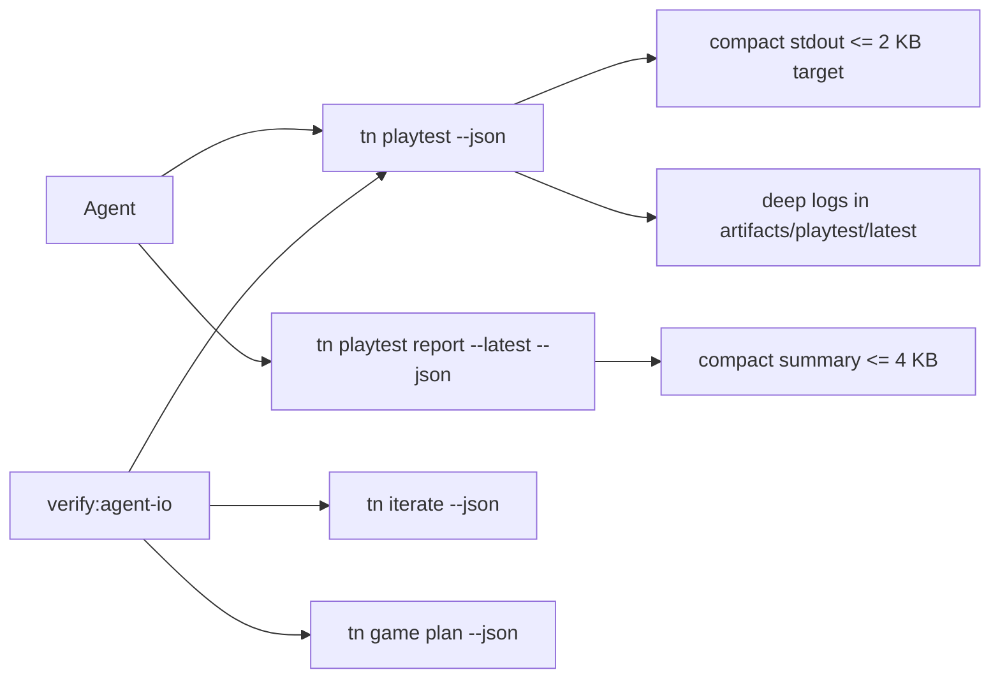
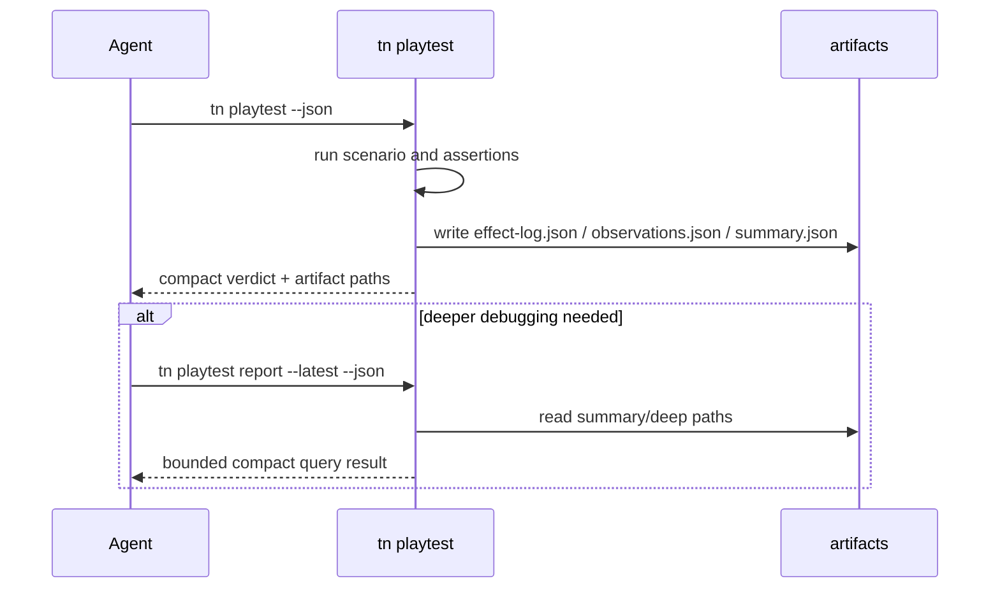

# PRD: Agent Token Efficiency IO Budget

Status: complete. Compact reports, artifact-backed deep logs, and the agent IO
budget gate are promoted.

`Planning Mode: Principal Architect`
`Complexity: 6 -> MEDIUM mode`

Score basis: +2 touches 6-10 files; +2 multi-package verification and docs
gate; +2 command-output contract changes across playtest, iterate, and agent
documented commands.

## 1. Context

**Problem:** ThreeNative benchmark sessions spend most tokens re-sending
megabyte-scale `tn playtest --json` payloads and artifact summaries that agents
are instructed to inspect.

**Files Analyzed:**

- `docs/audits/TOKEN_EFFICIENCY_AUDIT_2026-07-06.md`
- `packages/cli/src/commands/playtest.ts`
- `packages/cli/src/commands/playtestArtifacts.ts`
- `packages/cli/src/commands/playtest.test.ts`
- `packages/cli/src/commands/iterate.ts`
- `templates/structured-source-starter/AGENTS.md`
- `templates/_shared/AGENT_GAME_PLAN.md`
- `tools/verify/src/templateProductionGate.ts`
- `docs/PRDs/done/agent-ergonomics-2026-07-05/PRD-003-single-command-iteration-loop.md`

**Current Behavior:**

- Web playtest writes `effect-log.json`, `console.json`, `network.json`, and
  `runtime-trace.json`, then also embeds `effectLog` and full `observations` in
  stdout JSON.
- Pilot transcripts show `tn playtest --json` produced 1.05 MB to 6.29 MB per
  ThreeNative session, accounting for 76-98% of tool output bytes.
- Artifact `summary.json` and agent instructions still make it plausible for
  agents to read large frame logs directly.
- There is no verification gate that enforces agent-facing stdout budgets.

## Pre-Planning Findings

**How will this feature be reached?**

- [x] Entry point identified: `tn playtest --project <path> --json`,
  `tn iterate --project <path> --json`, and the new verification command
  `pnpm verify:agent-io` or equivalent focused gate.
- [x] Caller file identified: `packages/cli/src/commands/playtest.ts` assembles
  the current payload; `packages/cli/src/commands/iterate.ts` consumes playtest
  output for the repair loop; `tools/verify/src/*` owns gates.
- [x] Registration/wiring needed: CLI flag parsing for explicit verbose
  effect output, compact artifact writer, package script and CI/focused verify
  registration, starter docs updates.

**Is this user-facing?**

- [x] YES. This changes CLI JSON contracts for agents and humans, while keeping
  deep logs as files.

**Full user flow:**

1. Agent runs `tn playtest --project . --scenario playtests/smoke.playtest.json --json`.
2. Command runs the same scenario and writes full logs under
   `artifacts/playtest/<scenario>/latest/`.
3. Stdout returns a compact verdict, diagnostics, movement/camera evidence, and
   artifact paths only.
4. Agent reads the compact report or runs the sanctioned query command instead
   of dumping frame logs into context.

## 2. Solution

**Approach:**

- Make compact playtest stdout the default: omit `effectLog` and full
  `observations` from `tn playtest --json` unless an explicit debug flag asks
  for them.
- Keep full machine logs on disk under current artifact paths; add named deep
  log fields so tools can query them without relying on stdout payloads.
- Ensure agent-facing summaries are bounded: `summary.json` is a compact
  verdict document, while `effect-log.json` and `observations.json` are
  documented as deep machine logs.
- Add a stdout-budget verification gate for every command documented for
  agents: playtest, iterate, authoring validate, build or source validation,
  game plan, and cookbook show/list.

**Key Decisions:**

- [x] Default stdout target for playtest is <= 2 KB for ordinary passing runs;
  verification budget is <= 8 KB to allow diagnostics and path variance.
- [x] Explicit debug escape hatch is required for stdout effects. Prefer
  `--effects stdout` or `--verbose-effects`; document it as an interactive
  debugging mode, not the agent loop.
- [x] Full logs remain available as artifacts to preserve debuggability and
  existing machine proof.
- [x] Any artifact or command named in generated `AGENTS.md` must be compact
  enough to read directly, or the instructions must point to a query command.

**Data Changes:** No durable source schema changes. CLI report JSON shape
changes by removing default top-level `effectLog` and `observations` from
stdout while keeping artifact paths.

## 3. Sequence Flow

## 4. Execution Phases

#### Phase 1: Compact playtest stdout - playtest no longer prints frame logs by default

**Files (max 5):**

- `packages/cli/src/commands/playtest.ts` - compact payload assembly and debug
  flag.
- `packages/cli/src/commands/playtest.test.ts` - stdout shape and size tests.
- `packages/cli/src/commands/playtestArtifacts.ts` - compact summary writer if
  current summary embeds deep observations.
- `packages/cli/src/commands/playtestScenario.ts` - scenario option type if an
  effects mode is carried through.

**Implementation:**

- [ ] Replace default stdout fields `effectLog` and `observations` with
  artifact paths and compact counts: console error count, network error count,
  runtime diagnostic count, and asserted entity final poses.
- [ ] Add explicit effects stdout mode for interactive debugging.
- [ ] Preserve assertion evaluation by keeping internal access to effect logs
  before compacting the returned JSON.
- [ ] Keep backward-compatible deep logs on disk at current artifact filenames.

**Tests Required:**
| Test File | Test Name | Assertion |
|-----------|-----------|-----------|
| `packages/cli/src/commands/playtest.test.ts` | `should omit effect log and observations from default json stdout` | parsed stdout has artifact paths and no top-level `effectLog`/`observations` |
| `packages/cli/src/commands/playtest.test.ts` | `should include effect log only when effects stdout is requested` | debug flag preserves explicit payload |
| `packages/cli/src/commands/playtest.test.ts` | `should keep full playtest logs on disk` | `effect-log.json` and `observations.json` still exist |

**User Verification:**

- Action: run `tn playtest --project templates/structured-source-starter --json`.
- Expected: stdout is compact and points to artifact files; scenario behavior is
  unchanged.

#### Phase 2: Bounded artifact summaries and sanctioned report query - agents have a compact thing to inspect

**Files (max 5):**

- `packages/cli/src/commands/playtestArtifacts.ts` - bounded `summary.json`.
- `packages/cli/src/commands/playtest.ts` - `report --latest` or equivalent
  subcommand wiring if implemented here.
- `packages/cli/src/index.ts` - help text for the query command.
- `packages/cli/src/commands/playtest.test.ts` - report-query and artifact
  tests.
- `templates/_shared/AGENT_GAME_PLAN.md` - replace "read summary plus
  diagnostics/artifacts" with compact-query guidance.

**Implementation:**

- [ ] Define `threenative.playtest-summary` as the agent-facing artifact with
  verdict, diagnostics, assertion rows, final poses, counts, and deep-log
  paths.
- [ ] Keep `effect-log.json`, `observations.json`, `runtime-trace.json`,
  `console.json`, and `network.json` as deep machine logs.
- [ ] Add `tn playtest report --latest --json` or extend an existing
  playtest-report command to print the compact summary.
- [ ] Update generated instructions so agents do not `cat` or `jq` frame logs.

**Tests Required:**
| Test File | Test Name | Assertion |
|-----------|-----------|-----------|
| `packages/cli/src/commands/playtest.test.ts` | `should write bounded summary json with deep log pointers` | summary has schema, verdict, paths, and no frame entries |
| `packages/cli/src/commands/playtest.test.ts` | `should report latest playtest summary without reading deep logs to stdout` | query stdout stays below budget |

**User Verification:**

- Action: run a playtest, then `tn playtest report --latest --json`.
- Expected: the report is small, complete enough for repair, and includes paths
  for deep debugging.

#### Phase 3: Agent IO budget gate - output bloat cannot regress silently

**Files (max 5):**

- `tools/verify/src/agentIoBudget.ts` - gate implementation.
- `tools/verify/src/agentIoBudget.test.ts` - command budget fixtures.
- `tools/verify/src/cli/run.ts` or relevant verify registry - expose the gate.
- `package.json` - add `verify:agent-io` and wire into the appropriate broader
  verify target.
- `docs/status/capabilities/tooling-proof.md` - record the gate.

**Implementation:**

- [ ] Run each agent-documented command against a starter fixture and capture
  stdout byte length.
- [ ] Fail if normal passing stdout exceeds 8 KB for any command, with a stable
  diagnostic naming the command, actual byte count, budget, and likely fix.
- [ ] Include at least `tn playtest --json`, `tn iterate --json`,
  `tn game plan --json`, and `tn cookbook show <id> --json`.
- [ ] Document where verbose/deep logs live when a command fails the gate.

**Tests Required:**
| Test File | Test Name | Assertion |
|-----------|-----------|-----------|
| `tools/verify/src/agentIoBudget.test.ts` | `should fail when a documented command exceeds stdout budget` | emits `TN_AGENT_IO_STDOUT_BUDGET_EXCEEDED` |
| `tools/verify/src/agentIoBudget.test.ts` | `should pass compact starter command outputs` | all fixture rows under budget |

**User Verification:**

- Action: run `pnpm verify:agent-io`.
- Expected: gate passes and reports measured byte counts.

## 5. Checkpoint Protocol

- Phase 1 checkpoint: run CLI playtest tests plus one real starter playtest.
- Phase 2 checkpoint: run CLI playtest tests and inspect generated
  `summary.json`.
- Phase 3 checkpoint: run `pnpm verify:agent-io` and the narrow CLI tests.
- Automated PRD reviewer should compare each phase against this PRD before the
  next phase starts.

## 6. Verification Strategy

- Unit tests prove stdout shape and debug escape hatch behavior.
- Integration tests prove artifacts are still written and compact report
  command reads bounded summaries.
- Gate tests prove the byte budget fails loudly when output regresses.
- Manual spot check compares pre/post playtest artifact directory contents to
  ensure deep debugging data was not deleted.

## 7. Acceptance Criteria

- [ ] Default `tn playtest --json` no longer includes top-level `effectLog` or
  full `observations`.
- [ ] Full effect and observation data remain persisted as artifact files.
- [ ] Agent-facing `summary.json` and `tn playtest report --latest --json` stay
  below 4 KB for the starter passing scenario.
- [ ] `pnpm verify:agent-io` enforces <= 8 KB stdout for documented agent CLI
  commands.
- [ ] Starter and worksheet instructions direct agents to compact reports, not
  frame logs.
- [ ] Relevant CLI tests and `pnpm verify:agent-io` pass.
